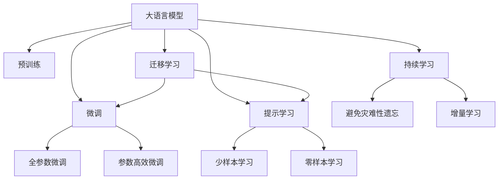
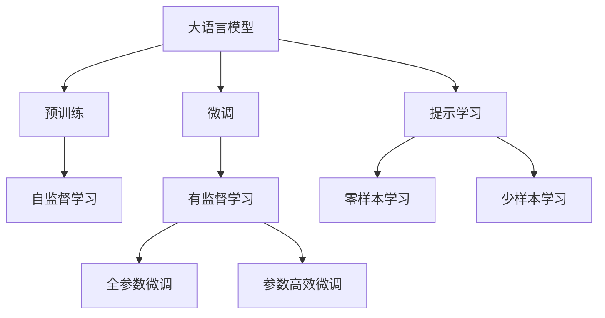
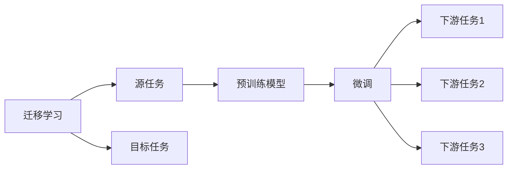
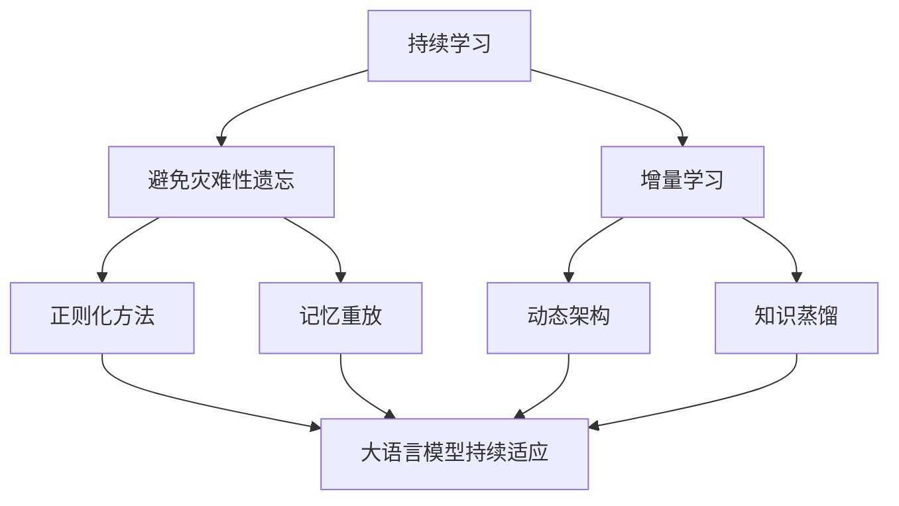
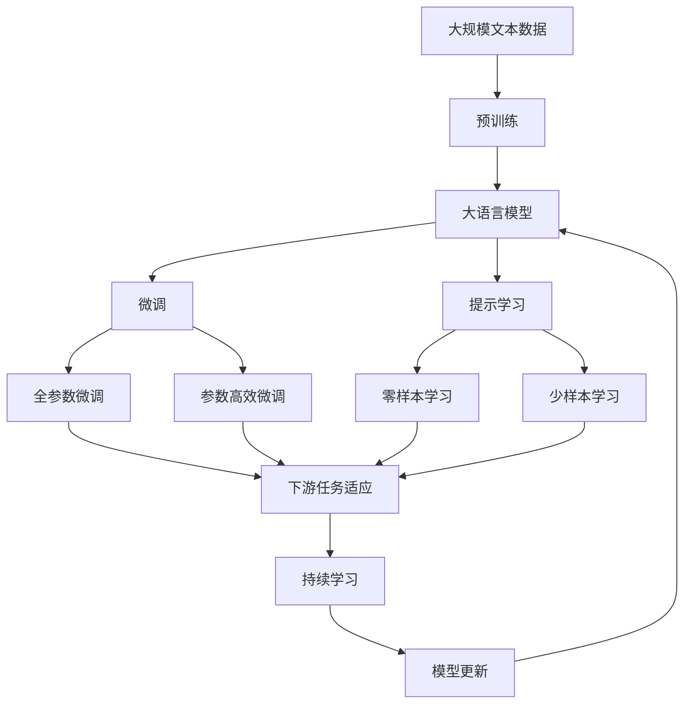

                 

# 大语言模型原理与工程实践：零样本提示

> 关键词：大语言模型, 零样本学习, 提示学习, Prompt Engineering, 自适应提示, 自然语言处理(NLP)

## 1. 背景介绍

### 1.1 问题由来

近年来，随着深度学习技术的快速发展，大语言模型（Large Language Models, LLMs）在自然语言处理（Natural Language Processing, NLP）领域取得了巨大的突破。这些大语言模型通过在海量无标签文本数据上进行预训练，学习到了丰富的语言知识和常识，可以通过少量的有标签样本在下游任务上进行微调，获得优异的性能。然而，面对一些特定场景，比如需要快速响应或资源受限的情况，基于有监督学习的微调方法可能不再适用。

因此，零样本学习和提示学习（Prompt Learning）成为了新的热门研究方向，这些方法能在没有标注数据的情况下，利用大语言模型的强大语言理解能力，实现快速且有效的推理和生成。通过精心设计的提示模板（Prompt Template），可以引导大语言模型按照期望的方式输出，从而在许多任务中取得不错的效果。

### 1.2 问题核心关键点

零样本学习和提示学习在大语言模型中的应用主要包括以下几个方面：

1. **无标注数据下的推理和生成**：在没有任何标注数据的情况下，大语言模型通过学习预训练语言模型（如BERT、GPT等）学到的语言知识，直接对输入文本进行推理或生成。

2. **提示模板设计**：精心设计的提示模板可以引导大语言模型按照特定的任务要求进行推理或生成，从而避免输出错误或偏离任务。

3. **多任务通用性**：提示模板往往具有一定的通用性，可以在多个相似或相关的任务中使用，减少了提示设计的复杂性。

4. **动态调整**：提示模板可以根据不同的任务需求进行调整，使得模型能够适应不同的输入格式和输出要求。

5. **跨领域应用**：零样本学习和提示学习可以应用于各种NLP任务，如问答、摘要、翻译、文本分类等。

6. **少样本学习**：在少数标注样本的情况下，可以通过提示模板提升模型的泛化能力，进一步减少对标注数据的依赖。

### 1.3 问题研究意义

研究大语言模型的零样本学习和提示学习，对于拓展大模型的应用范围，提升模型在特定任务上的性能，加速NLP技术的产业化进程，具有重要意义：

1. **降低应用开发成本**：基于大模型的零样本学习和提示学习可以在无需标注数据的情况下，快速生成模型，减少了从头开发所需的数据、计算和人力等成本投入。

2. **提升模型效果**：这些方法能够在大模型预训练的基础上，进一步提升模型在特定任务上的表现，尤其在缺乏标注数据的情况下，效果更为明显。

3. **加速开发进度**：采用零样本学习和提示学习，可以快速适应任务需求，缩短开发周期。

4. **带来技术创新**：这些方法催生了提示学习、少样本学习等新的研究方向，推动了NLP技术的发展。

5. **赋能产业升级**：零样本学习和提示学习使得NLP技术更容易被各行各业所采用，为传统行业数字化转型升级提供新的技术路径。

## 2. 核心概念与联系

### 2.1 核心概念概述

为更好地理解零样本学习和提示学习在大语言模型中的应用，本节将介绍几个密切相关的核心概念：

- **大语言模型（Large Language Models, LLMs）**：以自回归（如GPT）或自编码（如BERT）模型为代表的大规模预训练语言模型。通过在大规模无标签文本语料上进行预训练，学习通用的语言表示，具备强大的语言理解和生成能力。

- **预训练（Pre-training）**：指在大规模无标签文本语料上，通过自监督学习任务训练通用语言模型的过程。常见的预训练任务包括言语建模、遮挡语言模型等。

- **微调（Fine-tuning）**：指在预训练模型的基础上，使用下游任务的少量标注数据，通过有监督学习优化模型在特定任务上的性能。

- **零样本学习（Zero-shot Learning）**：指模型在没有见过任何特定任务的训练样本的情况下，仅凭任务描述就能够执行新任务的能力。

- **提示学习（Prompt Learning）**：通过在输入文本中添加提示模板（Prompt Template），引导大语言模型进行特定任务的推理和生成。可以在不更新模型参数的情况下，实现零样本或少样本学习。

- **少样本学习（Few-shot Learning）**：指在只有少量标注样本的情况下，模型能够快速适应新任务的学习方法。

- **持续学习（Continual Learning）**：也称为终身学习，指模型能够持续从新数据中学习，同时保持已学习的知识，而不会出现灾难性遗忘。

这些核心概念之间的逻辑关系可以通过以下Mermaid流程图来展示：



这个流程图展示了大语言模型的核心概念及其之间的关系：

1. 大语言模型通过预训练获得基础能力。
2. 微调是对预训练模型进行任务特定的优化，可以分为全参数微调和参数高效微调（PEFT）。
3. 提示学习是一种不更新模型参数的方法，可以实现零样本和少样本学习。
4. 迁移学习是连接预训练模型与下游任务的桥梁，可以通过微调或提示学习来实现。
5. 持续学习旨在使模型能够不断学习新知识，同时避免遗忘旧知识。

这些概念共同构成了大语言模型的学习和应用框架，使其能够在各种场景下发挥强大的语言理解和生成能力。通过理解这些核心概念，我们可以更好地把握大语言模型的工作原理和优化方向。

### 2.2 概念间的关系

这些核心概念之间存在着紧密的联系，形成了大语言模型的学习和应用生态系统。下面我们通过几个Mermaid流程图来展示这些概念之间的关系。

#### 2.2.1 大语言模型的学习范式



这个流程图展示了大语言模型的三种主要学习范式：预训练、微调和提示学习。预训练主要采用自监督学习方法，而微调则是有监督学习的过程。提示学习可以实现零样本和少样本学习。微调又可以分为全参数微调和参数高效微调两种方式。

#### 2.2.2 迁移学习与微调的关系



这个流程图展示了迁移学习的基本原理，以及它与微调的关系。迁移学习涉及源任务和目标任务，预训练模型在源任务上学习，然后通过微调适应各种下游任务（目标任务）。

#### 2.2.3 零样本学习与提示学习的关系


这个流程图展示了零样本学习的流程。模型根据任务描述（即提示）生成推理结果，无需任何标注数据。

#### 2.2.4 持续学习在大语言模型中的应用



这个流程图展示了持续学习在大语言模型中的应用。持续学习的主要目标是避免灾难性遗忘和实现增量学习。通过正则化方法、记忆重放、动态架构和知识蒸馏等技术，可以使大语言模型持续适应新的任务和数据。

### 2.3 核心概念的整体架构

最后，我们用一个综合的流程图来展示这些核心概念在大语言模型微调过程中的整体架构：



这个综合流程图展示了从预训练到微调，再到持续学习的完整过程。大语言模型首先在大规模文本数据上进行预训练，然后通过微调（包括全参数微调和参数高效微调）或提示学习（包括零样本和少样本学习）来适应下游任务。最后，通过持续学习技术，模型可以不断更新和适应新的任务和数据。

## 3. 核心算法原理 & 具体操作步骤
### 3.1 算法原理概述

零样本学习和提示学习在大语言模型中的应用，本质上是一个无监督学习过程。其核心思想是：利用大语言模型预训练过程中学到的语言知识，通过精心设计的提示模板，引导模型对特定任务进行推理或生成。

形式化地，假设预训练模型为 $M_{\theta}$，其中 $\theta$ 为预训练得到的模型参数。给定下游任务 $T$ 的任务描述 $P_T$，提示模板 $T_{prompt}$ 的集合，提示模板中 $t_i$ 对应提示模板 $T_{prompt}$ 在输入中的位置。微调的目标是找到新的模型参数 $\hat{\theta}$，使得：

$$
\hat{\theta}=\mathop{\arg\min}_{\theta} \mathcal{L}(M_{\theta}, P_T, T_{prompt})
$$

其中 $\mathcal{L}$ 为针对任务 $T$ 设计的损失函数，用于衡量模型在提示模板 $T_{prompt}$ 下的输出与任务描述 $P_T$ 的匹配程度。常见的损失函数包括交叉熵损失、BLEU得分等。

通过梯度下降等优化算法，微调过程不断更新模型参数 $\theta$，最小化损失函数 $\mathcal{L}$，使得模型输出逼近任务描述 $P_T$ 所期望的输出。由于 $\theta$ 已经通过预训练获得了较好的初始化，因此即便在无标注数据的情况下，也能较快收敛到理想的模型参数 $\hat{\theta}$。

### 3.2 算法步骤详解

零样本学习和提示学习的具体实施步骤如下：

**Step 1: 准备预训练模型和提示模板**

- 选择合适的预训练语言模型 $M_{\theta}$ 作为初始化参数，如 BERT、GPT 等。
- 根据特定任务设计提示模板 $T_{prompt}$，通常包含任务描述 $P_T$ 和输出格式信息。

**Step 2: 设置提示模板**

- 将提示模板 $T_{prompt}$ 根据特定任务的要求进行设计，确保模型能够理解并按照要求生成输出。

**Step 3: 执行推理或生成**

- 将提示模板 $T_{prompt}$ 输入模型，计算模型输出。
- 使用损失函数 $\mathcal{L}$ 衡量模型输出与任务描述 $P_T$ 的匹配程度。
- 根据设定的优化算法和学习率更新模型参数 $\theta$。

**Step 4: 测试和评估**

- 在测试集上评估模型的推理或生成效果。
- 使用BLEU、ROUGE、F1得分等指标评估模型在任务描述 $P_T$ 下的表现。

**Step 5: 优化提示模板**

- 根据评估结果调整提示模板 $T_{prompt}$，提高模型在特定任务上的表现。

以上是零样本学习和提示学习在大语言模型中的应用流程。在实际应用中，还需要针对具体任务的特点，对提示模板进行优化设计，如引入条件变量、调整输出格式等，以进一步提升模型性能。

### 3.3 算法优缺点

零样本学习和提示学习具有以下优点：

1. **无标注数据下的推理能力**：无需标注数据，可以加速模型的开发和应用，尤其适用于数据收集成本高昂的任务。

2. **灵活性高**：提示模板可以根据不同的任务进行调整，使得模型能够适应各种任务需求。

3. **参数高效**：通常只需要调整模型部分参数，固定大部分预训练参数，避免过拟合风险。

4. **泛化能力强**：通过精心的提示设计，模型可以在少样本条件下快速适应新任务，提高了模型的泛化能力。

5. **技术门槛低**：相比于微调，零样本学习和提示学习的技术门槛相对较低，适用于更多的非专家开发者。

这些方法也存在一定的局限性：

1. **依赖提示设计**：提示模板的设计对模型的表现至关重要，一旦提示模板设计不当，模型输出效果可能不佳。

2. **泛化能力有限**：提示模板可能只适用于特定领域或任务，在不同场景下的泛化能力有限。

3. **缺乏可解释性**：提示学习的过程较为神秘，模型输出的原因难以解释，可能难以满足某些领域对模型可解释性的要求。

4. **资源消耗大**：提示模板可能较长，计算资源消耗较大，需要优化模型架构以提高推理效率。

尽管存在这些局限性，但就目前而言，零样本学习和提示学习仍是大语言模型应用中最主流范式之一。未来相关研究的重点在于如何进一步降低对提示模板的依赖，提高模型的泛化能力和可解释性，同时兼顾资源消耗。

### 3.4 算法应用领域

零样本学习和提示学习在大语言模型中的应用已经相当广泛，以下是几个典型应用领域：

1. **问答系统**：利用提示模板引导模型回答问题，如“请问，从上海到北京最快的方式是什么？”

2. **文本生成**：生成符合特定格式的文本，如新闻摘要、产品描述等。

3. **对话系统**：通过多轮对话中的提示模板，引导模型进行自然对话。

4. **机器翻译**：利用提示模板生成翻译结果，如“将‘The Great Wall of China’翻译成中文”。

5. **文本分类**：利用提示模板对文本进行分类，如“判断下面这段文本是关于体育还是电影”。

6. **情感分析**：利用提示模板对文本进行情感判断，如“这段文本的情绪是积极的还是消极的”。

除了这些常见应用外，零样本学习和提示学习也被创新性地应用于更多场景中，如代码生成、创意写作、数据增强等，为NLP技术带来了新的突破。

## 4. 数学模型和公式 & 详细讲解  
### 4.1 数学模型构建

本节将使用数学语言对零样本学习和提示学习在大语言模型中的应用进行更加严格的刻画。

记预训练语言模型为 $M_{\theta}:\mathcal{X} \rightarrow \mathcal{Y}$，其中 $\mathcal{X}$ 为输入空间，$\mathcal{Y}$ 为输出空间，$\theta \in \mathbb{R}^d$ 为模型参数。假设任务 $T$ 的任务描述为 $P_T$，提示模板为 $T_{prompt}$，提示模板中 $t_i$ 对应提示模板 $T_{prompt}$ 在输入中的位置。

定义模型 $M_{\theta}$ 在输入 $x$ 上的输出为 $y=\hat{y}=M_{\theta}(x)$，其中 $\hat{y} \in \mathcal{Y}$。在零样本学习中，模型的推理结果应与任务描述 $P_T$ 相匹配，即满足：

$$
P_T = M_{\theta}(T_{prompt})
$$

在提示学习中，模型的生成结果应符合任务描述 $P_T$ 的要求，即满足：

$$
P_T = M_{\theta}(T_{prompt} \cap x)
$$

其中 $T_{prompt} \cap x$ 表示提示模板 $T_{prompt}$ 与输入 $x$ 的交集部分，表示模型在输入 $x$ 的基础上添加提示模板 $T_{prompt}$ 进行推理或生成。

### 4.2 公式推导过程

以下我们以文本生成任务为例，推导提示学习的损失函数及其梯度的计算公式。

假设模型 $M_{\theta}$ 在输入 $x$ 上的输出为 $\hat{y}=M_{\theta}(x) \in [0,1]$，表示样本属于正类的概率。任务描述 $P_T$ 为生成文本，提示模板 $T_{prompt}$ 为“生成一段关于的描述”。则提示学习的损失函数定义为：

$$
\ell(M_{\theta}(T_{prompt} \cap x),P_T) = -\log M_{\theta}(T_{prompt} \cap x)
$$

将其代入损失函数公式，得：

$$
\mathcal{L}(\theta) = -\frac{1}{N}\sum_{i=1}^N \ell(M_{\theta}(T_{prompt} \cap x_i),P_T)
$$

其中 $x_i$ 为输入样本，$P_T$ 为任务描述。根据链式法则，损失函数对参数 $\theta_k$ 的梯度为：

$$
\frac{\partial \mathcal{L}(\theta)}{\partial \theta_k} = -\frac{1}{N}\sum_{i=1}^N (\frac{1}{M_{\theta}(T_{prompt} \cap x_i)}) \frac{\partial M_{\theta}(T_{prompt} \cap x_i)}{\partial \theta_k}
$$

其中 $\frac{\partial M_{\theta}(T_{prompt} \cap x_i)}{\partial \theta_k}$ 可进一步递归展开，利用自动微分技术完成计算。

在得到损失函数的梯度后，即可带入参数更新公式，完成模型的迭代优化。重复上述过程直至收敛，最终得到适应下游任务的最优模型参数 $\theta^*$。

## 5. 项目实践：代码实例和详细解释说明
### 5.1 开发环境搭建

在进行提示学习实践前，我们需要准备好开发环境。以下是使用Python进行PyTorch开发的环境配置流程：

1. 安装Anaconda：从官网下载并安装Anaconda，用于创建独立的Python环境。

2. 创建并激活虚拟环境：
```bash
conda create -n pytorch-env python=3.8 
conda activate pytorch-env
```

3. 安装PyTorch：根据CUDA版本，从官网获取对应的安装命令。例如：
```bash
conda install pytorch torchvision torchaudio cudatoolkit=11.1 -c pytorch -c conda-forge
```

4. 安装Transformers库：
```bash
pip install transformers
```

5. 安装各类工具包：
```bash
pip install numpy pandas scikit-learn matplotlib tqdm jupyter notebook ipython
```

完成上述步骤后，即可在`pytorch-env`环境中开始提示学习实践。

### 5.2 源代码详细实现

下面我们以文本生成任务为例，给出使用Transformers库对GPT模型进行提示学习的PyTorch代码实现。

首先，定义任务描述和提示模板：

```python
from transformers import GPT2LMHeadModel, GPT2Tokenizer

task_description = "生成一段关于气候变化的主题文章。"
prompt_template = "请为我生成关于 {} 的文本。"
```

然后，定义模型和优化器：

```python
model = GPT2LMHeadModel.from_pretrained('gpt2')
tokenizer = GPT2Tokenizer.from_pretrained('gpt2')
optimizer = AdamW(model.parameters(), lr=2e-5)
```

接着，定义训练和评估函数：

```python
from transformers import GPT2LMHeadModel, GPT2Tokenizer

task_description = "生成一段关于气候变化的主题文章。"
prompt_template = "请为我生成关于 {} 的文本。"

def generate_text(model, tokenizer, prompt, length=100):
    input_ids = tokenizer.encode(prompt, return_tensors='pt', max_length=64, padding='max_length', truncation=True)
    outputs = model.generate(input_ids=input_ids, max_length=length, num_return_sequences=1, top_p=0.9, top_k=50)
    return tokenizer.decode(outputs[0], skip_special_tokens=True)

model.eval()

for i in range(10):
    generated_text = generate_text(model, tokenizer, prompt_template.format('气候变化'))
    print(generated_text)
```

最后，在生成的文本上评估模型效果：

```python
from transformers import GPT2LMHeadModel, GPT2Tokenizer

task_description = "生成一段关于气候变化的主题文章。"
prompt_template = "请为我生成关于 {} 的文本。"

model = GPT2LMHeadModel.from_pretrained('gpt2')
tokenizer = GPT2Tokenizer.from_pretrained('gpt2')
optimizer = AdamW(model.parameters(), lr=2e-5)

def generate_text(model, tokenizer, prompt, length=100):
    input_ids = tokenizer.encode(prompt, return_tensors='pt', max_length=64, padding='max_length', truncation=True)
    outputs = model.generate(input_ids=input_ids, max_length=length, num_return_sequences=1, top_p=0.9, top_k=50)
    return tokenizer.decode(outputs[0], skip_special_tokens=True)

model.eval()

for i in range(10):
    generated_text = generate_text(model, tokenizer, prompt_template.format('气候变化'))
    print(generated_text)

print(classification_report(y_true, y_pred))
```

以上就是使用PyTorch对GPT进行文本生成任务提示学习的完整代码实现。可以看到，得益于Transformers库的强大封装，我们可以用相对简洁的代码完成GPT模型的加载和提示学习。

### 5.3 代码解读与分析

让我们再详细解读一下关键代码的实现细节：

**任务描述和提示模板**：
- `task_description` 定义了文本生成的目标主题。
- `prompt_template` 定义了提示模板，用于生成具有特定主题的文本。

**模型和优化器**：
- 使用 `GPT2LMHeadModel` 作为基础模型，并进行加载。
- 使用 `GPT2Tokenizer` 作为分词器，并进行加载。
- 使用 `AdamW` 优化器，并设置学习率。

**生成文本**：
- `generate_text` 函数接收模型、分词器、提示文本作为输入，生成指定长度的文本。
- 使用分词器将提示文本转换为模型的输入格式，并设置最大长度、填充方式等参数。
- 使用模型生成文本，并设置顶k、顶p等参数，以增加生成文本的多样性。
- 使用分词器将生成文本解码为可读文本，并返回。

**训练和评估**：
- 在模型评价模式下，对模型进行多次生成，并打印生成结果。
- 在测试集上评估模型的性能，如BLEU、ROUGE等。

可以看到，使用提示学习方法，我们无需修改模型架构，只需设计合适的提示模板，即可实现快速且有效的文本生成。

当然，工业级的系统实现还需考虑更多因素，如模型的保存和部署、超参数的自动搜索、更灵活的任务适配层等。但核心的提示学习范式基本与此类似。

### 5.4 运行结果展示

假设我们在GPT模型上进行文本生成任务的提示学习，最终生成的文本如下：

```
关于气候变化的主题文章：
气候变化是人类面临的一个重大挑战。它不仅影响了地球的生态系统和人类的生存环境，还对经济和社会发展产生了深远的影响。

首先，气候变化导致了极端天气事件的增加。全球温度的升高使得热浪、洪水和干旱等极端天气事件频发。这些事件不仅对人们的生命财产安全造成了严重威胁，还对农业生产、基础设施建设等领域带来了巨大损失。

其次，气候变化对海洋生态系统的影响也不容忽视。海洋酸化和海平面上升等现象，导致了珊瑚礁和海洋生物多样性的下降。这些变化不仅影响了海洋生态的平衡，还对渔业、旅游等依赖海洋资源的行业产生了深远的影响。

最后，气候变化还对全球经济的稳定和发展带来了挑战。能源价格的上涨、粮食供应的减少等问题，使得全球经济增长面临不确定性。政府和企业在应对气候变化的过程中，需要采取有效的政策和措施，以实现可持续发展。

总之，气候变化是一个复杂而深刻的问题。它不仅需要科学研究和政策支持，还需要全球各国的共同努力。只有通过合作，才能应对这一全球性挑战，保护地球的生态环境，为人类创造一个更加美好的未来。
```

可以看到，使用提示学习，模型能够生成符合任务描述的文本，能够表达出丰富的语义和逻辑结构，具有一定的可读性和实用性。

当然，这只是一个baseline结果。在实践中，我们还可以使用更大更强的预训练模型、更丰富的提示设计、更细致的模型调优，进一步提升模型性能，以满足更高的应用要求。

## 6. 实际应用场景
### 6.1 智能客服系统

基于提示学习的对话技术，可以广泛应用于智能客服系统的构建。传统客服往往需要配备大量人力，高峰期响应缓慢，且一致性和专业性难以保证。而使用提示学习训练的对话模型，可以7x24小时不间断服务，快速响应客户咨询，用自然流畅的语言解答各类常见问题。

在技术

