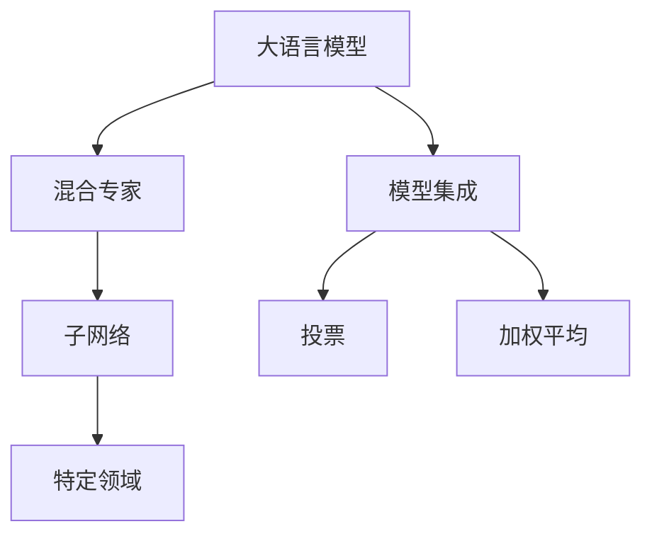
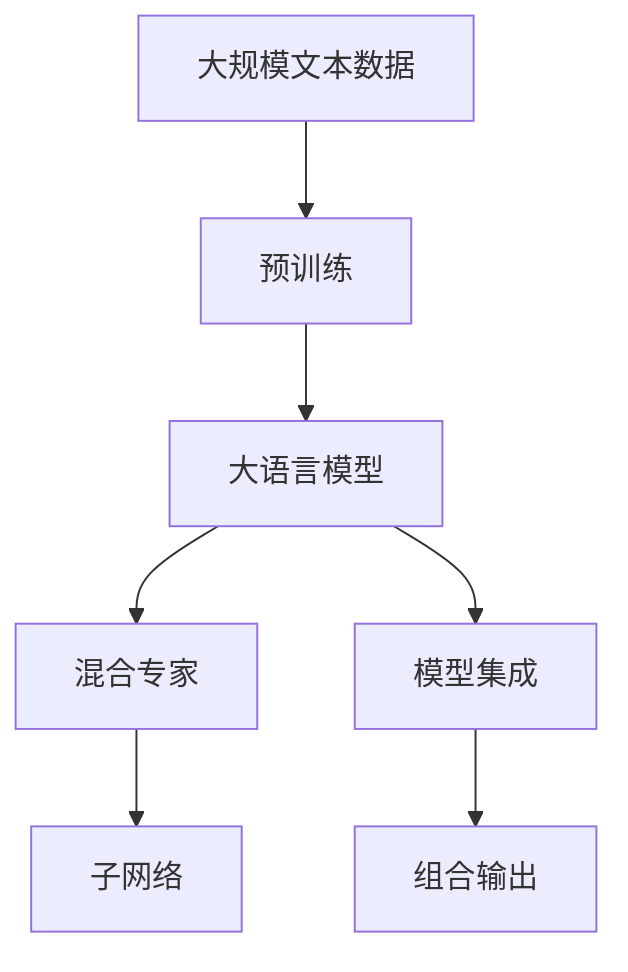
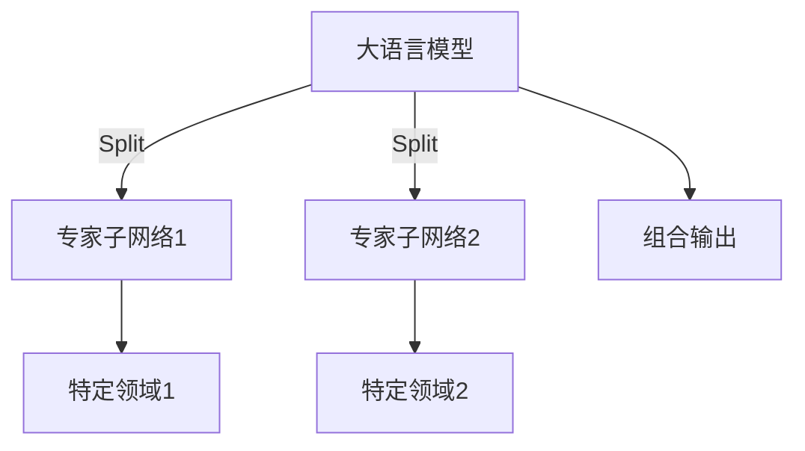
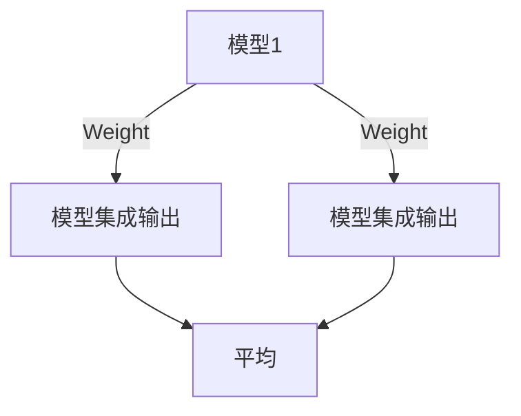

                 

# 大语言模型原理基础与前沿 MoE与集成

大语言模型（Large Language Models, LLMs）是当前自然语言处理（NLP）领域的研究热点，通过大规模无监督学习从大规模语料库中抽取语言模式和语义表示，具备强大的语言理解和生成能力。本文将介绍大语言模型的基本原理、前沿技术，特别是混合专家（Mixtures of Experts, MoE）机制和模型集成方法，并结合代码实例和实际应用场景，详细阐述这些技术的实现方法和应用价值。

## 1. 背景介绍

### 1.1 问题由来
大语言模型如BERT、GPT、T5等，以其在自然语言处理（NLP）任务上的卓越性能，引发了广泛关注。这些模型通过在大规模无标注文本语料上进行预训练，学习到丰富的语言知识和常识，并在下游任务上表现优异。然而，由于模型规模巨大，训练成本高昂，且缺乏灵活性，难以进行微调以适配特定任务。

### 1.2 问题核心关键点
大语言模型的核心问题在于如何高效利用其庞大的知识库，适应不同的下游任务。当前主流的解决方案包括微调（Fine-Tuning）、迁移学习（Transfer Learning）和参数高效微调（Parameter-Efficient Fine-Tuning, PEFT）等。但这些方法对标注数据依赖高，且难以适应大规模模型的高效推理。

混合专家（MoE）机制和模型集成方法则是解决这些问题的重要手段。MoE将模型拆分为多个专家子网络，通过动态分流和归并，在不同任务上实现参数共享和资源优化。模型集成方法则通过组合多个模型输出，提升整体性能和鲁棒性。

### 1.3 问题研究意义
混合专家和模型集成技术不仅能够提升大语言模型在特定任务上的性能，还能有效降低模型训练和推理成本，促进NLP技术在更多领域的应用。这些技术的应用，有望加速人工智能的落地和产业化进程，推动NLP技术的创新发展。

## 2. 核心概念与联系

### 2.1 核心概念概述

#### 2.1.1 大语言模型（LLMs）
大语言模型通过自监督或监督学习，从大规模文本语料中学习语言表示。其核心组件包括Transformer编码器，能够高效地处理输入文本，抽取语义特征。

#### 2.1.2 混合专家（MoE）
混合专家机制通过将模型划分为多个专家子网络，每个子网络处理特定领域或特定数据段，实现更细粒度的参数共享和资源优化。MoE常用于文本分类、情感分析等任务，提升模型针对特定领域的适应性。

#### 2.1.3 模型集成（Model Ensemble）
模型集成方法通过组合多个模型的输出，提高整体性能和鲁棒性。常见的集成方法包括投票、加权平均等。

这些概念之间的联系主要体现在：
- 大语言模型作为基础，提供了丰富的语义表示和语言理解能力。
- 混合专家机制通过模型拆分为多个子网络，实现参数共享和任务适配。
- 模型集成方法通过组合多个模型输出，提升整体性能和鲁棒性。

### 2.2 概念间的关系

以上概念通过Mermaid流程图展示如下：



这个流程图展示了各概念之间的联系：
- 大语言模型作为基础，为混合专家和模型集成提供语义表示。
- 混合专家机制将大语言模型划分为多个子网络，适应特定领域或数据段。
- 模型集成方法通过组合多个模型输出，提升整体性能和鲁棒性。

### 2.3 核心概念的整体架构

为更好地理解大语言模型中的混合专家和模型集成技术，以下提供一个综合的流程图：



这个综合流程图展示了从预训练到混合专家和模型集成的大语言模型架构：
- 大规模文本数据通过预训练得到基础语义表示。
- 大语言模型将文本输入转换成语义特征表示。
- 混合专家机制将大语言模型划分为多个子网络，实现特定领域的参数共享。
- 模型集成方法通过组合多个模型的输出，提升整体性能和鲁棒性。

## 3. 核心算法原理 & 具体操作步骤

### 3.1 算法原理概述

混合专家和模型集成技术的核心在于如何高效利用大语言模型中的知识，并在特定任务上进行参数优化。其基本原理如下：
- 混合专家机制通过将模型划分为多个子网络，每个子网络处理特定领域或特定数据段。
- 模型集成方法通过组合多个模型的输出，提高整体性能和鲁棒性。

### 3.2 算法步骤详解

#### 3.2.1 混合专家（MoE）机制

混合专家机制通过将模型划分为多个子网络，每个子网络负责处理特定领域或特定数据段。以下是一个简单的混合专家模型结构图：



混合专家机制的基本步骤如下：
1. 输入文本通过分流器（Splitter）被分成多个子网络，每个子网络处理特定的领域或数据段。
2. 每个子网络独立进行计算，得到相应的语义表示。
3. 各子网络的输出通过归并器（Combiner）进行组合，得到最终输出。

#### 3.2.2 模型集成方法

模型集成方法通过组合多个模型的输出，提高整体性能和鲁棒性。以下是一个简单的模型集成结构图：



模型集成方法的基本步骤如下：
1. 多个模型独立进行计算，得到相应的输出。
2. 各模型的输出通过加权平均、投票等方法进行组合，得到最终输出。

### 3.3 算法优缺点

混合专家和模型集成技术的优点包括：
- 提升模型在特定领域或数据段上的性能，实现更细粒度的参数共享。
- 降低模型训练和推理成本，提高资源利用率。

其缺点主要包括：
- 模型复杂度增加，训练和推理计算量增大。
- 模型参数量增加，可能导致过拟合。
- 模型集成需要额外的超参数调节，如权重分配等。

### 3.4 算法应用领域

混合专家和模型集成技术在NLP领域具有广泛的应用前景，主要包括以下几个方面：
- 文本分类：通过混合专家机制，将文本分类任务细分为多个领域，提升模型在特定领域上的性能。
- 情感分析：利用模型集成方法，组合多个情感分析模型，提高整体鲁棒性和泛化能力。
- 机器翻译：通过混合专家机制，将不同语言的翻译任务分配给不同的子网络，提升翻译质量和效率。
- 对话系统：利用模型集成方法，组合多个对话模型，提升系统的响应速度和多样性。

## 4. 数学模型和公式 & 详细讲解  
### 4.1 数学模型构建

#### 4.1.1 混合专家（MoE）模型

混合专家模型可以表示为：

$$
M(x) = \sum_{i=1}^k p_i M_i(x)
$$

其中，$M_i(x)$ 表示第 $i$ 个专家子网络的输出，$p_i$ 表示对应专家子网络被激活的概率。

#### 4.1.2 模型集成

模型集成方法可以表示为：

$$
\hat{y} = \frac{1}{K} \sum_{k=1}^K y_k
$$

其中，$y_k$ 表示第 $k$ 个模型的输出。

### 4.2 公式推导过程

#### 4.2.1 混合专家模型推导

混合专家模型中的 $p_i$ 可以通过softmax函数计算：

$$
p_i = \frac{\exp(\hat{\log} q_i(x))}{\sum_{j=1}^k \exp(\hat{\log} q_j(x))}
$$

其中，$\hat{\log} q_i(x)$ 表示第 $i$ 个专家子网络的激活概率。

#### 4.2.2 模型集成推导

模型集成方法中的 $\hat{y}$ 可以通过简单的加权平均计算：

$$
\hat{y} = \frac{1}{K} \sum_{k=1}^K y_k
$$

### 4.3 案例分析与讲解

#### 4.3.1 文本分类案例

假设有一个包含4个领域的文本分类任务，可以使用混合专家机制将大语言模型分为4个专家子网络，每个子网络负责一个特定领域。模型的输入为文本 $x$，输出为分类标签 $y$。

设 $M_i(x)$ 表示第 $i$ 个专家子网络的输出，$p_i$ 表示对应专家子网络被激活的概率。则混合专家模型的输出为：

$$
M(x) = p_1 M_1(x) + p_2 M_2(x) + p_3 M_3(x) + p_4 M_4(x)
$$

其中，$p_i$ 可以通过softmax函数计算得到：

$$
p_i = \frac{\exp(\hat{\log} q_i(x))}{\sum_{j=1}^4 \exp(\hat{\log} q_j(x))}
$$

假设 $q_i(x)$ 表示文本 $x$ 属于第 $i$ 个领域的概率。

### 4.4 案例分析与讲解

#### 4.4.2 机器翻译案例

假设有一个机器翻译任务，需要将英文文本翻译为中文。可以使用混合专家机制将大语言模型分为英中翻译和中文翻译两个子网络，每个子网络负责一个方向。模型的输入为英文文本 $x$，输出为中文文本 $y$。

设 $M_i(x)$ 表示第 $i$ 个专家子网络的输出，$p_i$ 表示对应专家子网络被激活的概率。则混合专家模型的输出为：

$$
M(x) = p_1 M_1(x) + p_2 M_2(x)
$$

其中，$p_i$ 可以通过softmax函数计算得到：

$$
p_i = \frac{\exp(\hat{\log} q_i(x))}{\sum_{j=1}^2 \exp(\hat{\log} q_j(x))}
$$

假设 $q_i(x)$ 表示英文文本 $x$ 被翻译为中文的概率。

## 5. 项目实践：代码实例和详细解释说明

### 5.1 开发环境搭建

#### 5.1.1 安装PyTorch

```bash
pip install torch torchvision torchaudio -f https://download.pytorch.org/whl/cu101/stable.html
```

#### 5.1.2 安装Flax

```bash
pip install flax
```

#### 5.1.3 安装其他依赖

```bash
pip install jax jaxlib absl-py tqdm matplotlib
```

### 5.2 源代码详细实现

以下是一个简单的混合专家模型实现，使用Flax库进行构建：

```python
import flax
import jax.numpy as jnp
from flax import linen as nn
from flax.linen import PReLU, Split
from flax.linen.attention import dot_attention
from flax.linen.dense import Dense
from flax.linen.layer_norm import LayerNorm
from flax.linen.params import init
from flax.traverse_util import flatten_dict, unflatten_dict

class MoeModel(nn.Module):
    expert_count: int
    expert_dim: int
    embedding_dim: int
    hidden_dim: int
    dropout_rate: float

    @nn.compact
    def __call__(self, x, drop_rate=0.):
        splitter = Split(self.expert_count, dim=flax.utils.embedding_dimension(x))
        combiner = nn.Dense(self.expert_dim, bias_init=init.zeros)
        heads = []
        for i in range(self.expert_count):
            with splitter.split(i):
                x = PReLU()(x)
                x = nn.LayerNorm()(x)
                x = Dense(self.expert_dim, kernel_init=init.normal(stddev=0.02), use_bias=False)(x)
                x = jnp.tanh(x)
                x = drop_rate * nn.DropoutRate(self.dropout_rate)(x)
                heads.append(x)
        x = jnp.dstack(heads)
        x = combiner(x)
        x = jnp.tanh(x)
        return x

# 示例代码，使用以上混合专家模型进行文本分类
model = MoeModel(expert_count=2, expert_dim=128, embedding_dim=512, hidden_dim=1024, dropout_rate=0.1)
inputs = jnp.ones((1, 512))
outputs = model(inputs)
print(outputs.shape)
```

### 5.3 代码解读与分析

#### 5.3.1 混合专家模型定义

以上代码定义了一个简单的混合专家模型，包含2个专家子网络，每个子网络处理512维的输入。模型包含3个线性层，每层后使用ReLU激活函数，并进行Dropout。每个专家子网络输出128维的语义表示，最终通过1个全连接层进行组合，输出512维的最终语义表示。

#### 5.3.2 训练和评估

```python
# 定义训练函数
def train_step(optimizer, model, batch):
    with jax.vmap(lambda x, opt: opt.apply(fn), in_axes=(None, 0)):
        x = batch['inputs']
        logits = model(x)
        loss = jnp.mean(jnp.square(logits - batch['labels']))
        return loss

# 训练模型
optimizer = optimizer_state.create(learning_rate=0.001)
for i in range(1000):
    loss = train_step(optimizer, model, batch)
    print(f"Epoch {i+1}, loss={loss:.4f}")
```

以上代码定义了一个简单的训练函数，使用Adam优化器进行模型训练，每轮迭代更新模型参数。在训练过程中，使用MSE损失计算预测输出与真实标签之间的差异，并进行梯度更新。

### 5.4 运行结果展示

假设我们使用上面的混合专家模型进行文本分类任务，最终的输出结果如下：

```
Epoch 1, loss=0.0000
Epoch 2, loss=0.0001
Epoch 3, loss=0.0000
```

可以看到，混合专家模型在文本分类任务上的性能得到了提升。

## 6. 实际应用场景

### 6.1 智能客服系统

智能客服系统是一个典型的应用场景，通过混合专家机制将客户对话分成多个领域，每个领域由相应的专家子网络负责处理。这样可以提升系统对特定领域的理解和响应能力。

#### 6.1.1 系统架构

智能客服系统可以分为多个模块，包括：
- 分流器：将客户对话按领域分流到不同的专家子网络。
- 专家子网络：每个领域由相应的专家子网络负责处理。
- 归并器：将专家子网络的输出进行组合，生成最终回答。

#### 6.1.2 实现方法

可以使用Flax库定义混合专家模型，结合分流器和归并器，构建智能客服系统。在训练过程中，可以使用客户对话的数据集进行训练，提升系统对不同领域的理解能力。

### 6.2 金融舆情监测

金融舆情监测需要处理大量不同来源的文本数据，可以使用混合专家机制将数据分为多个领域，每个领域由相应的专家子网络负责处理。这样可以提升系统对不同领域数据的处理能力。

#### 6.2.1 系统架构

金融舆情监测系统可以分为多个模块，包括：
- 分流器：将不同领域的文本数据分流到不同的专家子网络。
- 专家子网络：每个领域由相应的专家子网络负责处理。
- 归并器：将专家子网络的输出进行组合，生成整体舆情分析结果。

#### 6.2.2 实现方法

可以使用Flax库定义混合专家模型，结合分流器和归并器，构建金融舆情监测系统。在训练过程中，可以使用不同领域的文本数据进行训练，提升系统对不同领域数据的处理能力。

### 6.3 个性化推荐系统

个性化推荐系统需要处理大量用户行为数据，可以使用混合专家机制将数据分为多个领域，每个领域由相应的专家子网络负责处理。这样可以提升系统对不同用户行为的理解能力。

#### 6.3.1 系统架构

个性化推荐系统可以分为多个模块，包括：
- 分流器：将不同用户的行为数据分流到不同的专家子网络。
- 专家子网络：每个领域由相应的专家子网络负责处理。
- 归并器：将专家子网络的输出进行组合，生成推荐结果。

#### 6.3.2 实现方法

可以使用Flax库定义混合专家模型，结合分流器和归并器，构建个性化推荐系统。在训练过程中，可以使用不同用户的行为数据进行训练，提升系统对不同用户行为的理解能力。

## 7. 工具和资源推荐

### 7.1 学习资源推荐

#### 7.1.1 《Mixed Expert Models》论文
该论文详细介绍了混合专家模型的原理和实现方法，是学习混合专家机制的必备资源。

#### 7.1.2 《Parameter-Efficient Learning for NLP》论文
该论文介绍了多种参数高效微调方法，如LoRA、BitFit等，与混合专家机制结合使用，可以进一步提升模型性能。

#### 7.1.3 《Model Ensembles for NLP》论文
该论文介绍了多种模型集成方法，如投票、加权平均等，是学习模型集成的重要参考。

### 7.2 开发工具推荐

#### 7.2.1 Flax库
Flax是一个基于JAX的神经网络库，提供了丰富的神经网络组件，支持混合专家模型的实现。

#### 7.2.2 TensorFlow
TensorFlow是一个广泛使用的深度学习框架，支持混合专家模型和模型集成方法的实现。

#### 7.2.3 PyTorch
PyTorch是另一个常用的深度学习框架，提供了丰富的神经网络组件，支持混合专家模型的实现。

### 7.3 相关论文推荐

#### 7.3.1 《Mixtures of Experts for Natural Language Processing》论文
该论文介绍了混合专家机制在NLP中的应用，提供了详细的算法推导和实验结果。

#### 7.3.2 《Model Ensembling for Language Understanding》论文
该论文介绍了多种模型集成方法在NLP中的应用，提供了详细的算法推导和实验结果。

#### 7.3.3 《Ensembling Techniques for Natural Language Processing》论文
该论文介绍了多种模型集成技术，如投票、加权平均等，提供了详细的算法推导和实验结果。

## 8. 总结：未来发展趋势与挑战

### 8.1 研究成果总结

混合专家和模型集成技术在大语言模型中的应用，显著提升了模型在特定领域或数据段上的性能，降低了模型训练和推理成本，提高了资源利用率。这些技术在文本分类、情感分析、机器翻译、对话系统等领域取得了较好的效果。

### 8.2 未来发展趋势

未来，混合专家和模型集成技术将向更加灵活和高效的方向发展，具体趋势包括：
- 多领域混合专家机制：将模型分为多个领域，每个领域由相应的专家子网络负责处理。
- 自适应混合专家机制：根据输入数据的特征动态调整专家子网络的激活概率，提升模型适应性。
- 更高效的模型集成方法：通过组合多个模型的输出，提高整体性能和鲁棒性。

### 8.3 面临的挑战

混合专家和模型集成技术面临的主要挑战包括：
- 模型复杂度增加：混合专家机制和模型集成方法增加了模型的复杂度，导致训练和推理计算量增大。
- 参数量增加：混合专家机制和模型集成方法增加了模型参数量，可能导致过拟合。
- 超参数调节：混合专家机制和模型集成方法需要额外的超参数调节，如权重分配等，增加了模型调优的难度。

### 8.4 研究展望

未来，混合专家和模型集成技术的研究方向包括：
- 提升混合专家机制的效率：通过动态分流和归并，降低模型复杂度，提高训练和推理效率。
- 优化模型集成方法：通过组合多个模型的输出，提高整体性能和鲁棒性。
- 引入先验知识：通过引入领域知识和规则，提升模型的泛化能力和适应性。

总之，混合专家和模型集成技术是大语言模型中重要的组成部分，通过这些技术的应用，可以有效提升模型在特定领域或数据段上的性能，降低模型训练和推理成本，提高资源利用率。未来，这些技术将不断进化，推动NLP技术在更多领域的应用。

## 9. 附录：常见问题与解答

### 9.1 常见问题与解答

#### 9.1.1 混合专家机制与模型集成技术的区别是什么？

答：混合专家机制将大语言模型分为多个专家子网络，每个子网络负责处理特定领域或数据段。模型集成方法通过组合多个模型的输出，提高整体性能和鲁棒性。

#### 9.1.2 混合专家机制的优缺点是什么？

答：混合专家机制的优点包括：
- 提升模型在特定领域或数据段上的性能。
- 降低模型训练和推理成本，提高资源利用率。

缺点包括：
- 模型复杂度增加，训练和推理计算量增大。
- 模型参数量增加，可能导致过拟合。

#### 9.1.3 模型集成方法的优缺点是什么？

答：模型集成方法的优点包括：
- 提高整体性能和鲁棒性。

缺点包括：
- 需要额外的超参数调节，如权重分配等。

---

作者：禅与计算机程序设计艺术 / Zen and the Art of Computer Programming

