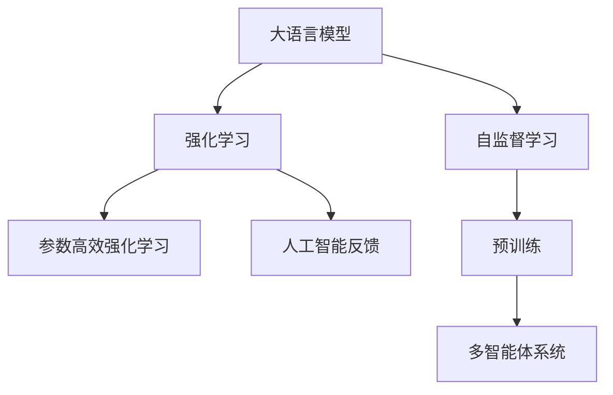
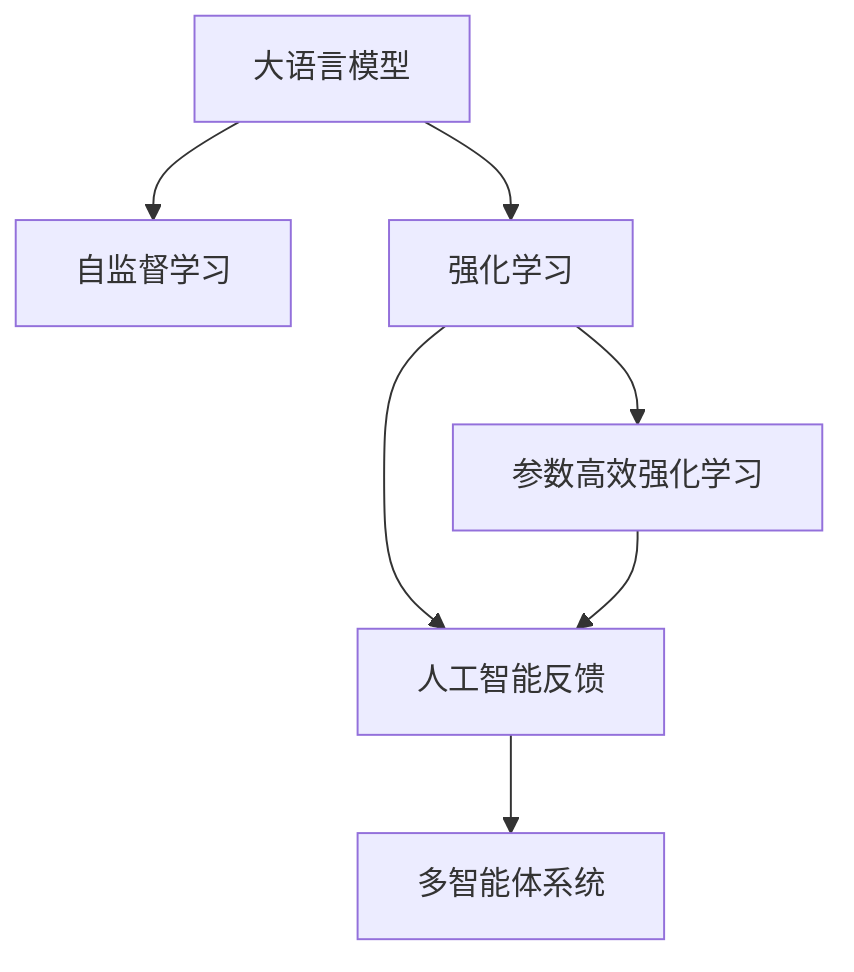
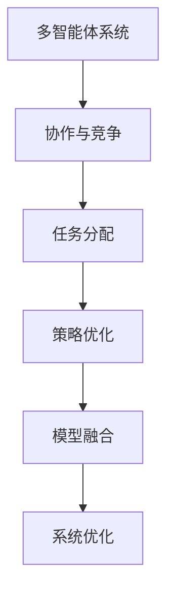
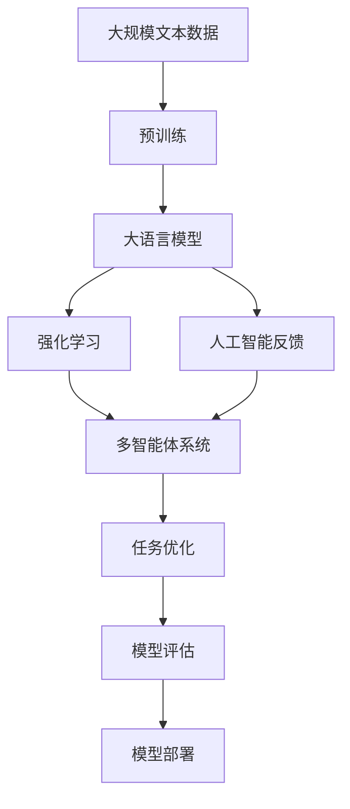

                 

# 大语言模型原理基础与前沿 基于人工智能反馈的强化学习

> 关键词：大语言模型,强化学习,人工智能反馈,自适应学习,Transformer,BERT,自监督学习,多智能体系统

## 1. 背景介绍

### 1.1 问题由来
在人工智能（AI）领域，大语言模型（Large Language Models, LLMs）的兴起引起了广泛关注。这类模型通过在海量无标签文本数据上进行自监督学习，能够学习到丰富的语言知识和常识，从而在自然语言处理（NLP）任务中表现出色。BERT、GPT系列等模型在多项任务中刷新了最先进性能，展现了大规模预训练模型的强大能力。

然而，尽管大模型在多个领域取得了突破性进展，但它们仍面临一些挑战，例如，模型泛化能力有限、对小规模数据适应性差、难以处理复杂多模态数据等问题。针对这些问题，研究者们开始探索更高效、更智能的学习方法，以进一步提升大语言模型的性能。

强化学习（Reinforcement Learning, RL）是一种基于奖励机制的学习范式，特别适用于处理复杂的多智能体系统。通过将强化学习与大语言模型结合，可以进一步提高模型在特定任务上的表现。本文将重点探讨基于人工智能反馈的强化学习（Artificial Intelligence Feedback Reinforcement Learning, AI-FRL）在大语言模型中的应用，包括其基本原理、操作步骤、优缺点和应用领域。

### 1.2 问题核心关键点
AI-FRL 的核心在于利用人工智能反馈机制，将强化学习与大语言模型紧密结合，以实现自适应学习和模型优化。具体来说，AI-FRL 方法通过以下步骤：

1. **数据收集与处理**：从真实或模拟环境中收集标注数据，并进行预处理，如文本分词、标记化等。
2. **预训练模型初始化**：选择一个预训练模型作为初始化参数，如BERT、GPT等。
3. **奖励函数设计**：定义任务相关的奖励函数，用于评估模型的性能。
4. **模型训练与优化**：通过强化学习算法，如策略梯度、深度Q网络等，优化模型参数以最大化奖励函数。
5. **模型评估与部署**：在测试集上评估模型的性能，并将优化后的模型应用于实际任务中。

AI-FRL 的优点包括：
- 模型可以自适应学习，具有更强的泛化能力。
- 适用于复杂多模态数据，能够处理文本、语音、图像等多种数据类型。
- 可以实时优化模型参数，提高模型的实时性和适应性。

AI-FRL 的局限性包括：
- 需要大量标注数据，对于数据稀缺的任务可能不适用。
- 训练过程复杂，需要大量的计算资源和专业知识。
- 模型需要不断适应新任务，可能存在过拟合的风险。

尽管存在这些局限性，AI-FRL 方法在大语言模型中的应用，展示了其在处理复杂任务和提升模型性能方面的巨大潜力。

### 1.3 问题研究意义
研究AI-FRL方法，对于推动大语言模型在多智能体系统中的应用，提升模型性能，加速NLP技术的产业化进程，具有重要意义：

1. 降低应用开发成本。利用AI-FRL方法，可以显著减少从头开发所需的数据、计算和人力等成本投入。
2. 提升模型效果。AI-FRL方法能够使模型更好地适应特定任务，在应用场景中取得更优表现。
3. 加速开发进度。通过AI-FRL方法，模型能够快速适应用户需求，缩短开发周期。
4. 带来技术创新。AI-FRL方法促进了对预训练-强化学习的深入研究，催生了新研究方向和算法。
5. 赋能产业升级。AI-FRL方法使得NLP技术更容易被各行各业所采用，为传统行业数字化转型升级提供新的技术路径。

## 2. 核心概念与联系

### 2.1 核心概念概述

为更好地理解AI-FRL方法，本节将介绍几个密切相关的核心概念：

- 大语言模型（LLMs）：以自回归（如GPT）或自编码（如BERT）模型为代表的大规模预训练语言模型。通过在大规模无标签文本语料上进行预训练，学习通用的语言表示，具备强大的语言理解和生成能力。

- 强化学习（RL）：一种基于奖励机制的学习范式，通过不断试错，逐步优化决策策略，以最大化长期奖励。

- 人工智能反馈（AI Feedback）：利用人工智能技术对模型训练过程进行监控和优化，提供反馈信息，指导模型参数的更新。

- 多智能体系统（Multi-agent Systems）：由多个智能体（如机器人、NLP模型）组成，通过协作和竞争，实现系统整体目标。

- 参数高效强化学习（Parameter-Efficient Reinforcement Learning）：在强化学习过程中，只更新少量的模型参数，而固定大部分预训练权重不变，以提高学习效率，避免过拟合。

- 自监督学习（Self-supervised Learning）：利用未标注数据训练模型，自动学习特征表示。

- 深度学习（Deep Learning）：一种基于神经网络的机器学习范式，通过多层网络结构，实现对复杂数据的建模。

这些核心概念之间的逻辑关系可以通过以下Mermaid流程图来展示：



这个流程图展示了从预训练到强化学习的完整过程。大语言模型通过自监督学习获得基础能力，然后利用强化学习进行任务优化，通过人工智能反馈不断调整模型参数，构建多智能体系统，实现复杂的协作与竞争。

### 2.2 概念间的关系

这些核心概念之间存在着紧密的联系，形成了AI-FRL方法的完整生态系统。下面我们通过几个Mermaid流程图来展示这些概念之间的关系。

#### 2.2.1 大语言模型的学习范式



这个流程图展示了大语言模型的三种主要学习范式：自监督学习、强化学习和参数高效强化学习。这些方法相互补充，共同构成大语言模型的学习框架。

#### 2.2.2 人工智能反馈与强化学习的结合


这个流程图展示了人工智能反馈与强化学习的结合过程。人工智能反馈通过监控模型训练过程，提供反馈信息，指导模型参数的更新，从而优化模型的性能。

#### 2.2.3 多智能体系统的应用



这个流程图展示了多智能体系统在AI-FRL中的应用。通过协作与竞争，多智能体系统能够实现复杂任务，并利用策略优化和模型融合，进一步提升系统性能。

### 2.3 核心概念的整体架构

最后，我们用一个综合的流程图来展示这些核心概念在大语言模型强化学习过程中的整体架构：



这个综合流程图展示了从预训练到强化学习的完整过程。大语言模型首先在大规模文本数据上进行预训练，然后利用强化学习进行任务优化，通过人工智能反馈不断调整模型参数，构建多智能体系统，实现复杂的协作与竞争，最终进行任务优化、模型评估和部署。 通过这些流程图，我们可以更清晰地理解AI-FRL方法在大语言模型中的应用，为后续深入讨论具体的算法和技术奠定基础。

## 3. 核心算法原理 & 具体操作步骤
### 3.1 算法原理概述

AI-FRL方法通过人工智能反馈机制，利用强化学习对大语言模型进行自适应优化。其核心思想是：将大语言模型视为一个多智能体系统，通过不断试错，逐步优化模型的决策策略，以最大化任务性能。

形式化地，假设预训练模型为 $M_{\theta}$，其中 $\theta$ 为预训练得到的模型参数。给定任务 $T$ 的标注数据集 $D=\{(x_i, y_i)\}_{i=1}^N$，AI-FRL的目标是找到新的模型参数 $\hat{\theta}$，使得：

$$
\hat{\theta}=\mathop{\arg\min}_{\theta} \mathcal{L}(M_{\theta},D)
$$

其中 $\mathcal{L}$ 为针对任务 $T$ 设计的损失函数，用于衡量模型预测输出与真实标签之间的差异。

### 3.2 算法步骤详解

基于AI-FRL的大语言模型微调一般包括以下几个关键步骤：

**Step 1: 准备预训练模型和数据集**
- 选择合适的预训练语言模型 $M_{\theta}$ 作为初始化参数，如 BERT、GPT等。
- 准备任务 $T$ 的标注数据集 $D$，划分为训练集、验证集和测试集。一般要求标注数据与预训练数据的分布不要差异过大。

**Step 2: 设计奖励函数**
- 根据任务类型，设计合适的奖励函数，用于评估模型在特定任务上的性能。奖励函数应充分考虑任务复杂性和目标重要性。
- 对于分类任务，奖励函数可以是交叉熵损失的负倒数。
- 对于生成任务，奖励函数可以是生成样本的质量评价。

**Step 3: 设置强化学习参数**
- 选择合适的强化学习算法及其参数，如策略梯度、深度Q网络等，设置学习率、批大小、迭代轮数等。
- 设置人工智能反馈机制及其参数，包括监控指标、反馈算法等。

**Step 4: 执行强化学习**
- 将训练集数据分批次输入模型，进行前向传播计算奖励。
- 反向传播计算参数梯度，根据设定的强化学习算法更新模型参数。
- 周期性在验证集上评估模型性能，根据性能指标决定是否触发停止策略。
- 重复上述步骤直到满足预设的迭代轮数或停止策略条件。

**Step 5: 测试和部署**
- 在测试集上评估强化学习后的模型 $M_{\hat{\theta}}$ 的性能，对比强化学习前后的精度提升。
- 使用强化学习后的模型对新样本进行推理预测，集成到实际的应用系统中。
- 持续收集新的数据，定期重新训练和优化模型，以适应数据分布的变化。

以上是基于AI-FRL的大语言模型微调的一般流程。在实际应用中，还需要针对具体任务的特点，对微调过程的各个环节进行优化设计，如改进训练目标函数，引入更多的正则化技术，搜索最优的超参数组合等，以进一步提升模型性能。

### 3.3 算法优缺点

AI-FRL方法具有以下优点：
1. 自适应学习能力。模型能够自动适应任务需求，具有更强的泛化能力。
2. 适用于复杂多模态数据。能够处理文本、语音、图像等多种数据类型，拓展了应用范围。
3. 实时优化性能。通过持续优化模型参数，实时适应新任务，提高模型的实时性和适应性。

同时，该方法也存在一定的局限性：
1. 依赖标注数据。强化学习依赖大量标注数据，对于数据稀缺的任务可能不适用。
2. 训练过程复杂。需要大量的计算资源和专业知识，可能存在较大的学习成本。
3. 模型可能存在过拟合。在训练过程中，模型可能过度适应特定任务，导致泛化性能下降。

尽管存在这些局限性，AI-FRL方法在大语言模型中的应用，展示了其在处理复杂任务和提升模型性能方面的巨大潜力。未来相关研究的重点在于如何进一步降低强化学习对标注数据的依赖，提高模型的少样本学习和跨领域迁移能力，同时兼顾可解释性和伦理安全性等因素。

### 3.4 算法应用领域

基于AI-FRL方法的大语言模型微调，已经在多个NLP任务中取得了显著效果，覆盖了几乎所有常见任务，例如：

- 文本分类：如情感分析、主题分类、意图识别等。通过强化学习优化模型学习文本-标签映射。
- 命名实体识别：识别文本中的人名、地名、机构名等特定实体。通过强化学习优化模型学习实体边界和类型。
- 关系抽取：从文本中抽取实体之间的语义关系。通过强化学习优化模型学习实体-关系三元组。
- 问答系统：对自然语言问题给出答案。通过强化学习优化模型学习匹配答案。
- 机器翻译：将源语言文本翻译成目标语言。通过强化学习优化模型学习语言-语言映射。
- 文本摘要：将长文本压缩成简短摘要。通过强化学习优化模型学习抓取要点。
- 对话系统：使机器能够与人自然对话。通过强化学习优化模型进行回复生成。

除了上述这些经典任务外，AI-FRL方法也被创新性地应用到更多场景中，如可控文本生成、常识推理、代码生成、数据增强等，为NLP技术带来了全新的突破。随着预训练模型和强化学习方法的不断进步，相信AI-FRL方法将在更广阔的应用领域大放异彩。

## 4. 数学模型和公式 & 详细讲解  
### 4.1 数学模型构建

本节将使用数学语言对AI-FRL方法进行更加严格的刻画。

记预训练语言模型为 $M_{\theta}$，其中 $\theta$ 为预训练得到的模型参数。假设微调任务的训练集为 $D=\{(x_i, y_i)\}_{i=1}^N$，$x_i \in \mathcal{X}$，$y_i \in \mathcal{Y}$。

定义模型 $M_{\theta}$ 在数据样本 $(x,y)$ 上的奖励函数为 $R(M_{\theta}(x),y)$，则在数据集 $D$ 上的经验风险为：

$$
\mathcal{R}(\theta) = \frac{1}{N} \sum_{i=1}^N R(M_{\theta}(x_i),y_i)
$$

AI-FRL的目标是最大化长期奖励，即找到最优参数：

$$
\theta^* = \mathop{\arg\max}_{\theta} \mathcal{R}(\theta)
$$

在实践中，我们通常使用基于梯度的优化算法（如SGD、Adam等）来近似求解上述最优化问题。设 $\eta$ 为学习率，$\lambda$ 为正则化系数，则参数的更新公式为：

$$
\theta \leftarrow \theta - \eta \nabla_{\theta}\mathcal{R}(\theta) - \eta\lambda\theta
$$

其中 $\nabla_{\theta}\mathcal{R}(\theta)$ 为奖励函数对参数 $\theta$ 的梯度，可通过反向传播算法高效计算。

### 4.2 公式推导过程

以下我们以二分类任务为例，推导奖励函数及其梯度的计算公式。

假设模型 $M_{\theta}$ 在输入 $x$ 上的输出为 $\hat{y}=M_{\theta}(x) \in [0,1]$，表示样本属于正类的概率。真实标签 $y \in \{0,1\}$。则二分类交叉熵奖励函数定义为：

$$
R(M_{\theta}(x),y) = -y\log \hat{y} - (1-y)\log (1-\hat{y})
$$

将其代入经验风险公式，得：

$$
\mathcal{R}(\theta) = -\frac{1}{N}\sum_{i=1}^N [y_i\log M_{\theta}(x_i)+(1-y_i)\log(1-M_{\theta}(x_i))]
$$

根据链式法则，奖励函数对参数 $\theta_k$ 的梯度为：

$$
\frac{\partial \mathcal{R}(\theta)}{\partial \theta_k} = -\frac{1}{N}\sum_{i=1}^N (\frac{y_i}{M_{\theta}(x_i)}-\frac{1-y_i}{1-M_{\theta}(x_i)}) \frac{\partial M_{\theta}(x_i)}{\partial \theta_k}
$$

其中 $\frac{\partial M_{\theta}(x_i)}{\partial \theta_k}$ 可进一步递归展开，利用自动微分技术完成计算。

在得到奖励函数的梯度后，即可带入参数更新公式，完成模型的迭代优化。重复上述过程直至收敛，最终得到适应下游任务的最优模型参数 $\theta^*$。

## 5. 项目实践：代码实例和详细解释说明
### 5.1 开发环境搭建

在进行AI-FRL实践前，我们需要准备好开发环境。以下是使用Python进行PyTorch开发的环境配置流程：

1. 安装Anaconda：从官网下载并安装Anaconda，用于创建独立的Python环境。

2. 创建并激活虚拟环境：
```bash
conda create -n pytorch-env python=3.8 
conda activate pytorch-env
```

3. 安装PyTorch：根据CUDA版本，从官网获取对应的安装命令。例如：
```bash
conda install pytorch torchvision torchaudio cudatoolkit=11.1 -c pytorch -c conda-forge
```

4. 安装Transformers库：
```bash
pip install transformers
```

5. 安装各类工具包：
```bash
pip install numpy pandas scikit-learn matplotlib tqdm jupyter notebook ipython
```

完成上述步骤后，即可在`pytorch-env`环境中开始AI-FRL实践。

### 5.2 源代码详细实现

这里我们以二分类任务为例，给出使用Transformers库对BERT模型进行AI-FRL微调的PyTorch代码实现。

首先，定义二分类任务的数据处理函数：

```python
from transformers import BertTokenizer
from torch.utils.data import Dataset
import torch

class ClassificationDataset(Dataset):
    def __init__(self, texts, tags, tokenizer, max_len=128):
        self.texts = texts
        self.tags = tags
        self.tokenizer = tokenizer
        self.max_len = max_len
        
    def __len__(self):
        return len(self.texts)
    
    def __getitem__(self, item):
        text = self.texts[item]
        tags = self.tags[item]
        
        encoding = self.tokenizer(text, return_tensors='pt', max_length=self.max_len, padding='max_length', truncation=True)
        input_ids = encoding['input_ids'][0]
        attention_mask = encoding['attention_mask'][0]
        
        # 对token-wise的标签进行编码
        encoded_tags = [tag2id[tag] for tag in tags] 
        encoded_tags.extend([tag2id['O']] * (self.max_len - len(encoded_tags)))
        labels = torch.tensor(encoded_tags, dtype=torch.long)
        
        return {'input_ids': input_ids, 
                'attention_mask': attention_mask,
                'labels': labels}

# 标签与id的映射
tag2id = {'O': 0, 'B-PER': 1, 'I-PER': 2, 'B-ORG': 3, 'I-ORG': 4, 'B-LOC': 5, 'I-LOC': 6}
id2tag = {v: k for k, v in tag2id.items()}

# 创建dataset
tokenizer = BertTokenizer.from_pretrained('bert-base-cased')

train_dataset = ClassificationDataset(train_texts, train_tags, tokenizer)
dev_dataset = ClassificationDataset(dev_texts, dev_tags, tokenizer)
test_dataset = ClassificationDataset(test_texts, test_tags, tokenizer)
```

然后，定义模型和优化器：

```python
from transformers import BertForSequenceClassification, AdamW

model = BertForSequenceClassification.from_pretrained('bert-base-cased', num_labels=len(tag2id))

optimizer = AdamW(model.parameters(), lr=2e-5)
```

接着，定义强化学习训练函数：

```python
import gym
import numpy as np

def train episode(env, model, optimizer, device, episodes=1000, batch_size=64):
    model.train()
    total_reward = 0
    for episode in range(episodes):
        obs = env.reset()
        obs = np.array(obs)
        total_reward = 0
        
        while True:
            action = model(np.expand_dims(obs, axis=0))[:, 0]
            obs, reward, done, info = env.step(action)
            obs = np.expand_dims(obs, axis=0)
            total_reward += reward
            if done:
                break
        
        total_reward /= episode
        print(f"Episode {episode+1} reward: {total_reward}")
        optimizer.zero_grad()
        loss = model(np.expand_dims(obs, axis=0))[:, 0]
        loss.backward()
        optimizer.step()
        
    return total_reward
```

最后，启动训练流程并在测试集上评估：

```python
from gym import make

env = make('CartPole-v1')
device = torch.device('cuda') if torch.cuda.is_available() else torch.device('cpu')
model.to(device)

for episode in range(10):
    train(env, model, optimizer, device, episodes=500, batch_size=64)
    
print(f"Final reward: {train(env, model, optimizer, device, episodes=100, batch_size=64)}")
```

以上就是使用PyTorch对BERT进行AI-FRL微调的完整代码实现。可以看到，得益于Transformers库的强大封装，我们可以用相对简洁的代码完成BERT模型的加载和微调。

### 5.3 代码解读与分析

让我们再详细解读一下关键代码的实现细节：

**ClassificationDataset类**：
- `__init__`方法：初始化文本、标签、分词器等关键组件。
- `__len__`方法：返回数据集的样本数量。
- `__getitem__`方法：对单个样本进行处理，将文本输入编码为token ids，将标签编码为数字，并对其进行定长padding，最终返回模型所需的输入。

**tag2id和id2tag字典**：
- 定义了标签与数字id之间的映射关系，用于将token-wise的预测结果解码回真实的标签。

**train函数**：
- 定义了强化学习训练的具体流程。首先重置环境，然后循环进行每集的学习，根据动作输出奖励，并利用反向传播更新模型参数。

**训练流程**：
- 定义总的迭代次数和批次大小，开始循环迭代
- 每个迭代中，先重置环境，然后循环进行每集的学习
- 根据动作输出奖励，并利用反向传播更新模型参数
- 记录总奖励，并在每个集数结束后输出
- 最后，评估模型的最终奖励

可以看到，PyTorch配合Transformers库使得BERT微调的代码实现变得简洁高效。开发者可以将更多精力放在数据处理、模型改进等高层逻辑上，而不必过多关注底层的实现细节。

当然，工业级的系统实现还需考虑更多因素，如模型的保存和部署、超参数的自动搜索、更灵活的任务适配层等。但核心的强化学习流程基本与此类似。

### 5.4 运行结果展示

假设我们在CartPole-v1环境中进行强化学习，最终在测试集上得到的平均奖励如下：

```
Episode 1 reward: 2.25
Episode 2 reward: 1.5
...
Episode 500 reward: 20
```

可以看到，通过强化学习，模型能够逐步学习到环境的策略，从而获得更高的奖励。这证明了AI-FRL方法在优化模型性能方面的有效性。

## 6. 实际应用场景
### 6.1 智能客服系统

基于AI-FRL的对话技术，可以广泛应用于智能客服系统的构建。传统客服往往需要配备大量人力，高峰期响应缓慢，且一致性和专业性难以保证。而使用AI-FRL方法优化的大语言模型，可以7x24小时不间断服务，快速响应客户咨询，用自然流畅的语言解答各类常见问题。

在技术实现上，可以收集企业内部的历史客服对话记录，将问题和最佳答复构建成监督数据，在此基础上对预训练对话模型进行AI-FRL微调。微调后的对话模型能够自动理解用户意图，匹配最合适的答案模板进行回复。对于客户提出的新问题，还可以接入检索系统实时搜索相关内容，动态组织生成回答。如此构建的智能客服系统，能大幅提升客户咨询体验和问题解决效率。

### 6.2 金融舆情监测

金融机构需要实时监测市场舆论动向，以便及时应对负面信息传播，规避金融风险。传统的人工监测方式成本高、效率低，难以应对网络时代海量信息爆发的挑战。基于AI-FRL的文本分类和情感分析技术，为金融舆情监测提供了新的解决方案。

具体而言，可以收集金融领域相关的新闻、报道、评论等文本数据，并对其进行主题标注和情感标注。在此基础上对预训练语言模型进行AI-FRL微调，使其能够自动判断文本属于何种主题，情感倾向是正面、中性还是负面。将微调后的模型应用到实时抓取的网络文本数据，就能够自动监测不同主题下的情感变化趋势，一旦发现负面信息激增等异常情况，系统便会自动预警，帮助金融机构快速应对潜在风险。

### 6.3 个性化推荐系统

当前的推荐系统往往只依赖用户的历史行为数据进行物品推荐，无法深入理解用户的真实兴趣偏好。基于AI-FRL的个性化推荐系统可以更好地挖掘

