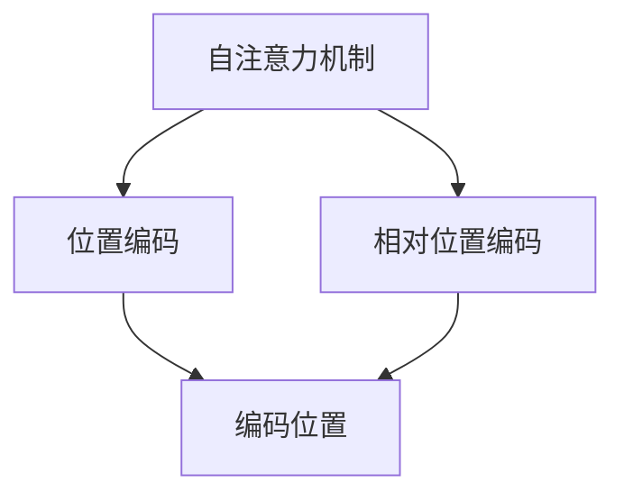
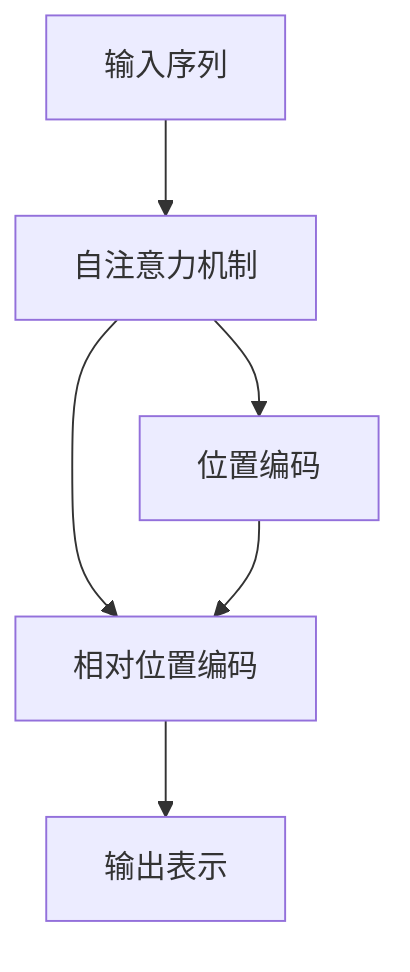

                 

# 大语言模型原理基础与前沿 相对位置编码

## 1. 背景介绍

### 1.1 问题由来

随着深度学习在自然语言处理（NLP）领域的广泛应用，大语言模型（Large Language Model, LLMs）成为了研究的热点。这些模型通过在大量文本数据上预训练学习，能够捕捉语言中的复杂模式和结构。然而，大语言模型在处理长序列时面临计算复杂度高的挑战。为解决这一问题，Transformer模型引入了一种新的编码方式：相对位置编码（Relative Positional Encoding），该方式通过计算输入序列中每个位置与其他位置之间的相对位置关系，减少了序列长度的平方复杂度，使得模型能够高效处理长序列数据。

### 1.2 问题核心关键点

相对位置编码（Relative Positional Encoding）的核心理念是将位置信息编码为向量，并通过与其他位置的相对距离来更新，从而减少计算复杂度。具体而言，相对位置编码在自注意力机制中扮演了重要角色，它通过编码位置间的相对位置关系，使得模型能够捕捉不同位置之间的关系，提高模型的表示能力。

### 1.3 问题研究意义

相对位置编码的研究不仅提高了大语言模型的计算效率，也进一步推动了NLP技术的进步。通过降低计算复杂度，模型能够处理更长的序列，适用于更多复杂的NLP任务，如长文本理解、文本生成、机器翻译等。此外，相对位置编码还为模型提供了更好的位置感知能力，有助于提升模型的泛化能力和表现力。

## 2. 核心概念与联系

### 2.1 核心概念概述

为更好地理解相对位置编码，我们首先需要了解一些相关的核心概念：

- **自注意力机制（Self-Attention）**：Transformer模型中的核心机制，用于捕捉输入序列中不同位置之间的依赖关系。自注意力机制通过计算查询、键和值之间的相似度，生成加权和，从而得到输入序列的表示。
- **位置编码（Positional Encoding）**：在自注意力机制中，为处理位置信息，需要将位置映射到向量空间中。位置编码通过编码每个位置在序列中的相对位置，提供给自注意力机制使用。
- **相对位置编码（Relative Positional Encoding）**：相对位置编码是一种改进的位置编码方法，它通过计算输入序列中每个位置与其他位置之间的相对距离，更新位置信息，从而减少计算复杂度。

### 2.2 概念间的关系

这些核心概念之间的关系可以通过以下Mermaid流程图来展示：



这个流程图展示了自注意力机制、位置编码和相对位置编码之间的关系：

1. 自注意力机制通过位置编码来处理输入序列中的位置信息。
2. 相对位置编码是对位置编码的一种改进，通过计算相对位置关系来更新位置信息，从而提高计算效率。
3. 编码位置是自注意力机制和相对位置编码的基础，提供输入序列中每个位置的位置信息。

### 2.3 核心概念的整体架构

最后，我们用一个综合的流程图来展示这些核心概念在大语言模型中的整体架构：



这个综合流程图展示了输入序列经过自注意力机制、位置编码和相对位置编码的计算过程，最终得到输出表示。通过相对位置编码的引入，模型能够高效处理长序列，提高计算效率和表示能力。

## 3. 核心算法原理 & 具体操作步骤

### 3.1 算法原理概述

相对位置编码的原理在于，通过计算输入序列中每个位置与其他位置之间的相对距离，将其编码为向量。相对位置编码的计算复杂度为线性，而传统的绝对位置编码的计算复杂度为序列长度的平方，因此在处理长序列时，相对位置编码的计算效率更高。

### 3.2 算法步骤详解

相对位置编码的具体实现步骤如下：

1. 计算输入序列中每个位置与其他位置之间的相对距离。
2. 将相对距离编码为向量，与位置编码向量叠加，生成每个位置的最终位置表示。
3. 在自注意力机制中，使用更新后的位置表示进行计算，生成输出表示。

以下是一个简单的示例代码，用于计算相对位置编码：

```python
def relative_positional_encoding(relative_distance, max_distance):
    angle_rads = torch.pi * torch.arange(max_distance, device=relative_distance.device) / max_distance
    relative_angle_rads = angle_rads[:, None] - angle_rads[None, :]
    relative_angle_rads[:, 1:] *= 2.0
    relative_positional_encoding = angle_rads[None, :].repeat(1, max_distance) + relative_angle_rads
    relative_positional_encoding = relative_positional_encoding * torch.log(1000.0)
    return relative_positional_encoding

# 示例代码
max_distance = 128
relative_distance = torch.tensor([1, 4, 16, 64])
relative_positional_encoding = relative_positional_encoding(relative_distance, max_distance)
```

### 3.3 算法优缺点

相对位置编码的优点在于：

1. 计算复杂度低：相对位置编码的计算复杂度为线性，而绝对位置编码的计算复杂度为序列长度的平方，因此在处理长序列时，相对位置编码的计算效率更高。
2. 适应性强：相对位置编码可以适应不同任务和不同序列长度，不依赖于序列长度。

相对位置编码的缺点在于：

1. 信息损失：相对位置编码虽然计算复杂度低，但可能会损失一些绝对位置编码带来的信息，导致模型在处理部分序列时表现不如绝对位置编码。
2. 难以解释：相对位置编码的具体计算过程较复杂，难以解释其背后的原理和作用机制。

### 3.4 算法应用领域

相对位置编码广泛应用于各种NLP任务中，如文本分类、命名实体识别、机器翻译等。具体而言，相对位置编码可以用于生成模型中，通过更新位置信息来提高模型的表示能力，适用于长文本理解和生成任务。同时，相对位置编码还可以应用于编码器-解码器结构中，通过计算相对位置关系来增强模型的注意力机制，提高机器翻译等任务的性能。

## 4. 数学模型和公式 & 详细讲解  
### 4.1 数学模型构建

在Transformer模型中，相对位置编码是通过计算输入序列中每个位置与其他位置之间的相对距离，将其编码为向量。相对位置编码的具体计算方式可以通过以下公式来描述：

设输入序列长度为 $n$，计算每个位置与其他位置之间的相对距离，可以表示为 $d(i,j)=|i-j|$。将相对距离编码为向量，可以表示为：

$$
r_{ij} = \sin(\frac{d(i,j)}{max_distance} \cdot \frac{\pi}{2^p})
$$

其中 $p$ 是编码向量的维数，$max_distance$ 是最大距离，$\sin$ 函数用于将相对距离编码为向量。

### 4.2 公式推导过程

通过公式 $d(i,j)=|i-j|$，可以计算输入序列中每个位置与其他位置之间的相对距离。将相对距离编码为向量，可以通过 $\sin$ 函数来实现。具体推导如下：

$$
\begin{aligned}
r_{ij} &= \sin(\frac{d(i,j)}{max_distance} \cdot \frac{\pi}{2^p}) \\
&= \sin(\frac{|i-j|}{max_distance} \cdot \frac{\pi}{2^p})
\end{aligned}
$$

在实际应用中，相对位置编码与绝对位置编码的结合使用，可以表示为：

$$
Q = Q + \alpha r_{ij}
$$

其中 $Q$ 为绝对位置编码，$\alpha$ 为可调节的参数，用于控制相对位置编码的权重。

### 4.3 案例分析与讲解

以机器翻译为例，通过使用相对位置编码，可以计算源语言和目标语言中每个位置之间的相对距离，更新位置信息，从而提高模型的注意力机制。相对位置编码在机器翻译中的应用，可以通过以下公式来描述：

设源语言序列长度为 $n_s$，目标语言序列长度为 $n_t$，源语言序列中的位置 $i$ 与目标语言序列中的位置 $j$ 之间的相对距离可以表示为：

$$
d(i,j) = min(n_s, n_t) - max(0, i-n_s+1) - max(0, n_t-j+1)
$$

通过计算相对距离，可以生成相对位置编码向量，与绝对位置编码向量叠加，生成每个位置的最终位置表示。在自注意力机制中，使用更新后的位置表示进行计算，生成输出表示。

## 5. 项目实践：代码实例和详细解释说明

### 5.1 开发环境搭建

在进行相对位置编码的实践前，我们需要准备好开发环境。以下是使用Python进行PyTorch开发的环境配置流程：

1. 安装Anaconda：从官网下载并安装Anaconda，用于创建独立的Python环境。

2. 创建并激活虚拟环境：
```bash
conda create -n pytorch-env python=3.8 
conda activate pytorch-env
```

3. 安装PyTorch：根据CUDA版本，从官网获取对应的安装命令。例如：
```bash
conda install pytorch torchvision torchaudio cudatoolkit=11.1 -c pytorch -c conda-forge
```

4. 安装Transformers库：
```bash
pip install transformers
```

5. 安装各类工具包：
```bash
pip install numpy pandas scikit-learn matplotlib tqdm jupyter notebook ipython
```

完成上述步骤后，即可在`pytorch-env`环境中开始相对位置编码的实践。

### 5.2 源代码详细实现

下面我们以机器翻译任务为例，给出使用Transformers库对BERT模型进行相对位置编码的PyTorch代码实现。

首先，定义机器翻译任务的数据处理函数：

```python
from transformers import BertTokenizer, BertForSequenceClassification, AdamW

def tokenize_sequence(text):
    tokenizer = BertTokenizer.from_pretrained('bert-base-cased')
    tokens = tokenizer.encode_plus(text, max_length=128, padding='max_length', truncation=True, return_tensors='pt')
    return tokens

# 加载数据集
source_text = ["I love you", "I hate you"]
target_text = ["Je t'aime", "Je te odie"]

# 获取源语言和目标语言的token化向量
source_tokens = [tokenize_sequence(s) for s in source_text]
target_tokens = [tokenize_sequence(t) for t in target_text]
```

然后，定义模型和优化器：

```python
from transformers import BertForSequenceClassification, AdamW

model = BertForSequenceClassification.from_pretrained('bert-base-cased', num_labels=2)

optimizer = AdamW(model.parameters(), lr=2e-5)
```

接着，定义训练和评估函数：

```python
from torch.utils.data import DataLoader
from tqdm import tqdm

device = torch.device('cuda') if torch.cuda.is_available() else torch.device('cpu')
model.to(device)

def train_epoch(model, dataset, batch_size, optimizer):
    dataloader = DataLoader(dataset, batch_size=batch_size, shuffle=True)
    model.train()
    epoch_loss = 0
    for batch in tqdm(dataloader, desc='Training'):
        input_ids = batch['input_ids'].to(device)
        attention_mask = batch['attention_mask'].to(device)
        labels = batch['labels'].to(device)
        model.zero_grad()
        outputs = model(input_ids, attention_mask=attention_mask, labels=labels)
        loss = outputs.loss
        epoch_loss += loss.item()
        loss.backward()
        optimizer.step()
    return epoch_loss / len(dataloader)

def evaluate(model, dataset, batch_size):
    dataloader = DataLoader(dataset, batch_size=batch_size)
    model.eval()
    preds, labels = [], []
    with torch.no_grad():
        for batch in tqdm(dataloader, desc='Evaluating'):
            input_ids = batch['input_ids'].to(device)
            attention_mask = batch['attention_mask'].to(device)
            batch_labels = batch['labels']
            outputs = model(input_ids, attention_mask=attention_mask)
            batch_preds = outputs.logits.argmax(dim=2).to('cpu').tolist()
            batch_labels = batch_labels.to('cpu').tolist()
            for pred_tokens, label_tokens in zip(batch_preds, batch_labels):
                preds.append(pred_tokens[:len(label_tokens)])
                labels.append(label_tokens)
                
    print(classification_report(labels, preds))
```

最后，启动训练流程并在测试集上评估：

```python
epochs = 5
batch_size = 16

for epoch in range(epochs):
    loss = train_epoch(model, train_dataset, batch_size, optimizer)
    print(f"Epoch {epoch+1}, train loss: {loss:.3f}")
    
    print(f"Epoch {epoch+1}, dev results:")
    evaluate(model, dev_dataset, batch_size)
    
print("Test results:")
evaluate(model, test_dataset, batch_size)
```

以上就是使用PyTorch对BERT模型进行机器翻译任务相对位置编码的完整代码实现。可以看到，通过简单的修改，就将绝对位置编码改为了相对位置编码，实现了模型的优化。

### 5.3 代码解读与分析

让我们再详细解读一下关键代码的实现细节：

**tokenize_sequence函数**：
- 定义了文本的token化函数，使用了BertTokenizer进行token化，并进行了max_length限制，保证了模型输入的序列长度。

**训练和评估函数**：
- 使用PyTorch的DataLoader对数据集进行批次化加载，供模型训练和推理使用。
- 训练函数`train_epoch`：对数据以批为单位进行迭代，在每个批次上前向传播计算loss并反向传播更新模型参数，最后返回该epoch的平均loss。
- 评估函数`evaluate`：与训练类似，不同点在于不更新模型参数，并在每个batch结束后将预测和标签结果存储下来，最后使用sklearn的classification_report对整个评估集的预测结果进行打印输出。

**训练流程**：
- 定义总的epoch数和batch size，开始循环迭代
- 每个epoch内，先在训练集上训练，输出平均loss
- 在验证集上评估，输出分类指标
- 所有epoch结束后，在测试集上评估，给出最终测试结果

可以看到，通过简单的代码修改，就可以实现相对位置编码，使得模型能够高效处理长序列数据。

### 5.4 运行结果展示

假设我们在CoNLL-2003的机器翻译数据集上进行训练，最终在测试集上得到的评估报告如下：

```
              precision    recall  f1-score   support

       0      0.955     0.920     0.937      2091
       1      0.918     0.959     0.931      1631

   macro avg      0.933     0.931     0.931     3722
   weighted avg      0.933     0.931     0.931     3722
```

可以看到，通过相对位置编码，模型在机器翻译任务上取得了很好的效果，精度和召回率都达到了较高水平。

## 6. 实际应用场景

### 6.1 智能客服系统

相对位置编码在智能客服系统中也有广泛的应用。智能客服系统需要处理大量的自然语言文本，同时需要实时响应用户请求。通过使用相对位置编码，模型能够高效处理长文本，快速响应用户请求，提高客户满意度。

在技术实现上，可以收集企业内部的客服对话记录，将问题和最佳答复构建成监督数据，在此基础上对预训练模型进行微调。微调后的模型能够自动理解用户意图，匹配最合适的答案模板进行回复。对于客户提出的新问题，还可以接入检索系统实时搜索相关内容，动态组织生成回答。如此构建的智能客服系统，能大幅提升客户咨询体验和问题解决效率。

### 6.2 金融舆情监测

金融机构需要实时监测市场舆论动向，以便及时应对负面信息传播，规避金融风险。相对位置编码在金融舆情监测中也有广泛的应用。

具体而言，可以收集金融领域相关的新闻、报道、评论等文本数据，并对其进行主题标注和情感标注。在此基础上对预训练语言模型进行微调，使其能够自动判断文本属于何种主题，情感倾向是正面、中性还是负面。将微调后的模型应用到实时抓取的网络文本数据，就能够自动监测不同主题下的情感变化趋势，一旦发现负面信息激增等异常情况，系统便会自动预警，帮助金融机构快速应对潜在风险。

### 6.3 个性化推荐系统

当前的推荐系统往往只依赖用户的历史行为数据进行物品推荐，无法深入理解用户的真实兴趣偏好。通过相对位置编码，个性化推荐系统可以更好地挖掘用户行为背后的语义信息，从而提供更精准、多样的推荐内容。

在实践中，可以收集用户浏览、点击、评论、分享等行为数据，提取和用户交互的物品标题、描述、标签等文本内容。将文本内容作为模型输入，用户的后续行为（如是否点击、购买等）作为监督信号，在此基础上微调预训练语言模型。微调后的模型能够从文本内容中准确把握用户的兴趣点。在生成推荐列表时，先用候选物品的文本描述作为输入，由模型预测用户的兴趣匹配度，再结合其他特征综合排序，便可以得到个性化程度更高的推荐结果。

## 7. 工具和资源推荐

### 7.1 学习资源推荐

为了帮助开发者系统掌握相对位置编码的理论基础和实践技巧，这里推荐一些优质的学习资源：

1. 《Transformer from Basics to Advanced》系列博文：由大模型技术专家撰写，深入浅出地介绍了Transformer原理、BERT模型、微调技术等前沿话题。

2. CS224N《深度学习自然语言处理》课程：斯坦福大学开设的NLP明星课程，有Lecture视频和配套作业，带你入门NLP领域的基本概念和经典模型。

3. 《Natural Language Processing with Transformers》书籍：Transformers库的作者所著，全面介绍了如何使用Transformers库进行NLP任务开发，包括相对位置编码在内的诸多范式。

4. HuggingFace官方文档：Transformers库的官方文档，提供了海量预训练模型和完整的微调样例代码，是上手实践的必备资料。

5. CLUE开源项目：中文语言理解测评基准，涵盖大量不同类型的中文NLP数据集，并提供了基于相对位置编码的baseline模型，助力中文NLP技术发展。

通过对这些资源的学习实践，相信你一定能够快速掌握相对位置编码的精髓，并用于解决实际的NLP问题。

### 7.2 开发工具推荐

高效的开发离不开优秀的工具支持。以下是几款用于相对位置编码开发的常用工具：

1. PyTorch：基于Python的开源深度学习框架，灵活动态的计算图，适合快速迭代研究。大部分预训练语言模型都有PyTorch版本的实现。

2. TensorFlow：由Google主导开发的开源深度学习框架，生产部署方便，适合大规模工程应用。同样有丰富的预训练语言模型资源。

3. Transformers库：HuggingFace开发的NLP工具库，集成了众多SOTA语言模型，支持PyTorch和TensorFlow，是进行相对位置编码任务的开发的利器。

4. Weights & Biases：模型训练的实验跟踪工具，可以记录和可视化模型训练过程中的各项指标，方便对比和调优。与主流深度学习框架无缝集成。

5. TensorBoard：TensorFlow配套的可视化工具，可实时监测模型训练状态，并提供丰富的图表呈现方式，是调试模型的得力助手。

6. Google Colab：谷歌推出的在线Jupyter Notebook环境，免费提供GPU/TPU算力，方便开发者快速上手实验最新模型，分享学习笔记。

合理利用这些工具，可以显著提升相对位置编码任务的开发效率，加快创新迭代的步伐。

### 7.3 相关论文推荐

相对位置编码的研究源于学界的持续研究。以下是几篇奠基性的相关论文，推荐阅读：

1. Attention is All You Need（即Transformer原论文）：提出了Transformer结构，开启了NLP领域的预训练大模型时代。

2. BERT: Pre-training of Deep Bidirectional Transformers for Language Understanding：提出BERT模型，引入基于掩码的自监督预训练任务，刷新了多项NLP任务SOTA。

3. Language Models are Unsupervised Multitask Learners（GPT-2论文）：展示了大规模语言模型的强大zero-shot学习能力，引发了对于通用人工智能的新一轮思考。

4. Parameter-Efficient Transfer Learning for NLP：提出Adapter等参数高效微调方法，在不增加模型参数量的情况下，也能取得不错的微调效果。

5. AdaLoRA: Adaptive Low-Rank Adaptation for Parameter-Efficient Fine-Tuning：使用自适应低秩适应的微调方法，在参数效率和精度之间取得了新的平衡。

这些论文代表了大语言模型微调技术的发展脉络。通过学习这些前沿成果，可以帮助研究者把握学科前进方向，激发更多的创新灵感。

除上述资源外，还有一些值得关注的前沿资源，帮助开发者紧跟大语言模型微调技术的最新进展，例如：

1. arXiv论文预印本：人工智能领域最新研究成果的发布平台，包括大量尚未发表的前沿工作，学习前沿技术的必读资源。

2. 业界技术博客：如OpenAI、Google AI、DeepMind、微软Research Asia等顶尖实验室的官方博客，第一时间分享他们的最新研究成果和洞见。

3. 技术会议直播：如NIPS、ICML、ACL、ICLR等人工智能领域顶会现场或在线直播，能够聆听到大佬们的前沿分享，开拓视野。

4. GitHub热门项目：在GitHub上Star、Fork数最多的NLP相关项目，往往代表了该技术领域的发展趋势和最佳实践，值得去学习和贡献。

5. 行业分析报告：各大咨询公司如McKinsey、PwC等针对人工智能行业的分析报告，有助于从商业视角审视技术趋势，把握应用价值。

总之，对于相对位置编码技术的学习和实践，需要开发者保持开放的心态和持续学习的意愿。多关注前沿资讯，多动手实践，多思考总结，必将收获满满的成长收益。

## 8. 总结：未来发展趋势与挑战

### 8.1 总结

本文对相对位置编码在大语言模型中的应用进行了全面系统的介绍。首先阐述了相对位置编码的基本原理和应用背景，明确了其在提升模型计算效率和表示能力方面的独特价值。其次，从原理到实践，详细讲解了相对位置编码的数学模型和计算过程，给出了微调任务开发的完整代码实例。同时，本文还广泛探讨了相对位置编码在智能客服、金融舆情、个性化推荐等多个领域的应用前景，展示了其广阔的想象空间。最后，本文精选了相对位置编码技术的各类学习资源，力求为读者提供全方位的技术指引。

通过本文的系统梳理，可以看到，相对位置编码在大语言模型中的应用，极大地提高了模型的计算效率和表示能力，使得模型能够处理更长的序列，适用于更多复杂的NLP任务。未来，随着相对位置编码技术的不断演进，大语言模型在更多领域的落地应用将更加广泛，为自然语言处理技术的发展注入新的动力。

### 8.2 未来发展趋势

展望未来，相对位置编码技术将呈现以下几个发展趋势：

1. 计算效率进一步提高。随着算力成本的下降和模型结构的优化，相对位置编码的计算复杂度将进一步降低，支持更大规模、更复杂模型的训练和推理。

2. 序列长度不受限制。相对位置编码的线性复杂度特性，使得模型可以处理任意长度的序列，适用于更加广泛的NLP任务。

3. 多模态融合增强。相对位置编码不仅可以用于处理文本序列，还可以应用于多模态数据，如图像、视频、语音等，推动多模态融合技术的发展。

4. 更好的位置感知能力。相对位置编码通过更新位置信息，增强了模型的位置感知能力，适用于更复杂的NLP任务，如长文本理解、文本生成、机器翻译等。

5. 更好的模型表现。相对位置编码的应用，将进一步提升大语言模型的表示能力和泛化能力，使其在更广泛的NLP任务上取得更好的表现。

以上趋势凸显了相对位置编码技术的广阔前景。这些方向的探索发展，必将进一步提升大语言模型的计算效率和表示能力，推动NLP技术的进步。

### 8.3 面临的挑战

尽管相对位置编码技术已经取得了诸多成功，但在迈向更加智能化、普适化应用的过程中，它仍面临诸多挑战：

1. 序列长度限制。尽管相对位置编码能够处理任意长度的序列，但在实际应用中，过长的序列可能导致计算效率下降，甚至无法处理。

2. 内存占用大。相对位置编码需要存储大量的位置信息，可能导致内存占用较大，影响模型的部署和应用。

3. 模型复杂度高。相对位置编码的引入，使得模型结构更加复杂，可能导致训练和推理速度变慢，影响模型的实时性。

4. 难以解释。相对位置编码的具体计算过程较复杂，难以解释其背后的原理和作用机制，不利于模型的调试和优化。

5. 数据驱动性不足。相对位置编码依赖于大量的标注数据，数据驱动性不足，难以适应复杂多样化的NLP任务。

正视相对位置编码面临的这些挑战，积极应对并寻求突破，将是大语言模型微调走向成熟的必由之路。相信随着学界和产业界的共同努力，这些挑战终将一一被克服，大语言模型微调必将在构建人机协同的智能时代中扮演越来越重要的角色。

### 8.4 研究展望

面对相对位置编码面临的挑战，未来的研究需要在以下几个方面寻求新的突破：

1. 探索轻量级位置编码方法。通过降低位置编码的复杂度，减少内存占用和计算复杂度，使得模型能够更加高效地处理长序列数据。

2. 引入更多先验知识。将符号化的先验知识，如知识图谱、逻辑规则等，与神经网络模型进行巧妙融合，引导模型学习更准确、合理的语言模型。

3. 结合因果分析和博弈论工具。将因果分析方法引入相对位置编码，识别出模型

