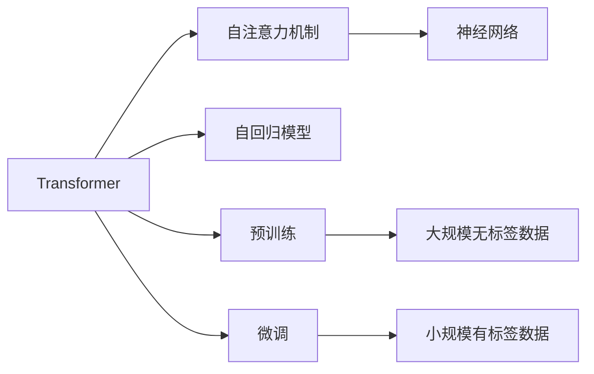
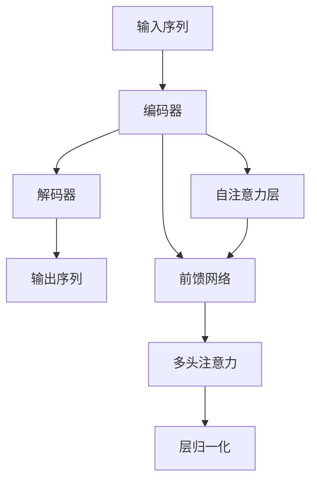
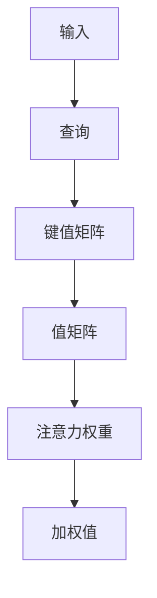
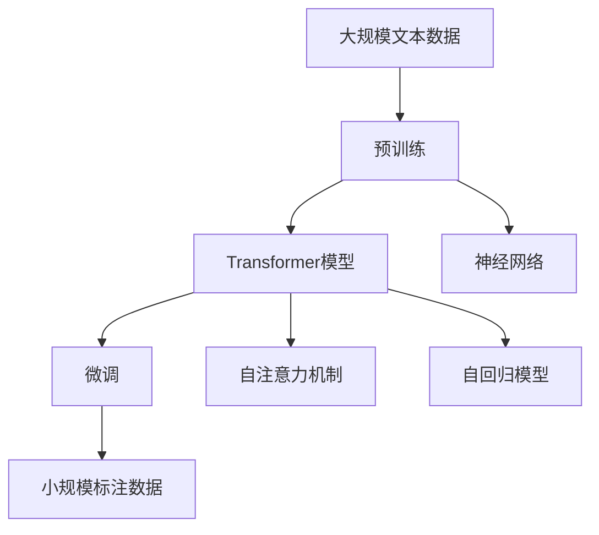

                 

# 大语言模型原理基础与前沿 简化Transformer

> 关键词：大语言模型, Transformer, 自注意力机制, 自回归模型, 预训练, 微调, 神经网络

## 1. 背景介绍

### 1.1 问题由来
近年来，深度学习技术在自然语言处理(Natural Language Processing, NLP)领域取得了显著的进展，尤其是Transformer架构的提出和大语言模型的成功，使得NLP研究进入了一个新的阶段。然而，尽管Transformer在各种任务中表现优异，但其背后的理论基础和计算原理依然不为人所熟知。本文将从Transformer模型出发，深入探讨其核心原理，同时概述其在NLP领域的应用，并展望其未来的发展趋势。

### 1.2 问题核心关键点
本文将重点讨论以下核心关键点：
- Transformer模型的核心机制和原理。
- 自注意力机制的数学表达和计算过程。
- Transformer在不同NLP任务中的应用案例。
- 大语言模型微调的技术要点和优化策略。

通过对这些核心概念的深入剖析，旨在帮助读者系统理解Transformer模型的设计和应用，同时探索其未来的发展和潜在挑战。

### 1.3 问题研究意义
研究Transformer模型及其应用，不仅能够提升NLP技术的实用性和效率，还能促进其在更多领域的应用，例如智慧医疗、智能客服、金融科技等。通过深入理解Transformer的原理，我们能够更好地应用于实际问题解决，提升模型的性能和适应性，从而加速人工智能技术的产业化进程。

## 2. 核心概念与联系

### 2.1 核心概念概述

为了更好地理解Transformer模型及其应用，本节将介绍几个密切相关的核心概念：

- **Transformer模型**：一种基于自注意力机制的神经网络结构，能够处理序列数据，广泛应用于自然语言处理任务。
- **自注意力机制**：Transformer模型的核心组成部分，通过计算序列中每个元素与其他元素的相对重要性，实现序列信息的交互和融合。
- **自回归模型**：一种常用的NLP模型，如GPT，通过利用历史信息预测未来，广泛应用于语言生成和理解任务。
- **预训练与微调**：在大规模无标签数据上进行预训练，然后在小规模标签数据上进行微调，以适应特定任务。
- **神经网络**：一种由多层非线性变换组成的计算模型，能够对复杂数据进行建模和预测。

这些核心概念之间的关系可以通过以下Mermaid流程图来展示：

这个流程图展示了Transformer模型及其相关概念的联系：

1. Transformer模型通过自注意力机制实现序列信息的交互和融合。
2. 自回归模型利用历史信息预测未来，如GPT。
3. 预训练在大规模无标签数据上训练模型，微调在小规模有标签数据上优化模型，以适应特定任务。
4. 神经网络作为Transformer的基础，能够对复杂数据进行建模和预测。

### 2.2 概念间的关系

这些核心概念之间存在着紧密的联系，形成了Transformer模型及其应用的核心生态系统。下面我通过几个Mermaid流程图来展示这些概念之间的关系。

#### 2.2.1 Transformer模型结构

这个流程图展示了Transformer模型的基本结构：

1. 输入序列通过编码器进行编码，得到一系列中间表示。
2. 编码器由多个自注意力层和前馈网络层组成。
3. 自注意力层通过计算序列中每个元素与其他元素的相对重要性，实现序列信息的交互和融合。
4. 前馈网络层对中间表示进行非线性变换，增强特征表达能力。
5. 解码器通过对编码器的输出进行解码，得到最终的输出序列。

#### 2.2.2 自注意力机制

这个流程图展示了自注意力机制的计算过程：

1. 输入经过线性变换得到查询向量、键值矩阵和值矩阵。
2. 计算查询向量与键值矩阵的点积，得到注意力权重。
3. 注意力权重对值矩阵进行加权，得到加权值。
4. 对加权值进行线性变换和激活函数，得到自注意力层的输出。

#### 2.2.3 预训练与微调

这个流程图展示了预训练与微调的基本过程：

1. 在预训练阶段，模型在大规模无标签数据上进行训练，学习通用的语言表示。
2. 在微调阶段，模型在特定任务的少量有标签数据上进行优化，以适应特定任务的需求。

### 2.3 核心概念的整体架构

最后，我用一个综合的流程图来展示这些核心概念在大语言模型微调过程中的整体架构：

这个综合流程图展示了从预训练到微调，再到自注意力机制的应用过程：

1. 在大规模文本数据上进行预训练，学习通用的语言表示。
2. 在预训练模型基础上，通过微调适应特定任务。
3. 在微调过程中，利用自注意力机制实现序列信息的交互和融合。
4. 利用自回归模型进行语言生成或理解任务。
5. 神经网络作为模型基础，实现复杂的特征表示和处理。

通过这些流程图，我们可以更清晰地理解Transformer模型的核心原理和应用逻辑，为后续深入讨论具体的微调方法和技术奠定基础。

## 3. 核心算法原理 & 具体操作步骤
### 3.1 算法原理概述

Transformer模型是一种基于自注意力机制的神经网络结构，其核心思想是通过计算序列中每个元素与其他元素的相对重要性，实现序列信息的交互和融合。在处理序列数据时，Transformer模型能够高效地捕捉长距离依赖，并在文本理解、生成等方面表现出色。

Transformer模型的基本结构包括编码器和解码器，其中编码器由多个自注意力层和前馈网络层组成，解码器通过对编码器的输出进行解码，得到最终的输出序列。自注意力机制通过计算查询向量、键值矩阵和值矩阵，得到每个元素的注意力权重，进而加权计算出最终的输出。

### 3.2 算法步骤详解

Transformer模型的训练和微调过程主要包括以下几个步骤：

**Step 1: 准备预训练模型和数据集**
- 选择合适的预训练模型（如BERT、GPT等）作为初始化参数。
- 准备下游任务（如分类、生成等）的少量标注数据集，划分为训练集、验证集和测试集。

**Step 2: 设计任务适配层**
- 根据任务类型，在预训练模型的顶层设计合适的输出层和损失函数。
- 对于分类任务，通常在顶层添加线性分类器和交叉熵损失函数。
- 对于生成任务，通常使用语言模型的解码器输出概率分布，并以负对数似然为损失函数。

**Step 3: 设置微调超参数**
- 选择合适的优化算法及其参数，如 AdamW、SGD 等，设置学习率、批大小、迭代轮数等。
- 设置正则化技术及强度，包括权重衰减、Dropout、Early Stopping 等。
- 确定冻结预训练参数的策略，如仅微调顶层，或全部参数都参与微调。

**Step 4: 执行梯度训练**
- 将训练集数据分批次输入模型，前向传播计算损失函数。
- 反向传播计算参数梯度，根据设定的优化算法和学习率更新模型参数。
- 周期性在验证集上评估模型性能，根据性能指标决定是否触发 Early Stopping。
- 重复上述步骤直到满足预设的迭代轮数或 Early Stopping 条件。

**Step 5: 测试和部署**
- 在测试集上评估微调后模型 $M_{\hat{\theta}}$ 的性能，对比微调前后的精度提升。
- 使用微调后的模型对新样本进行推理预测，集成到实际的应用系统中。
- 持续收集新的数据，定期重新微调模型，以适应数据分布的变化。

### 3.3 算法优缺点

Transformer模型及其微调方法具有以下优点：
1. 高效处理长距离依赖：Transformer通过自注意力机制能够高效地捕捉长距离依赖，适合处理长文本数据。
2. 可并行计算：Transformer的并行计算能力较强，能够在大规模数据集上快速训练和推理。
3. 自适应性强：Transformer模型能够适应各种不同的NLP任务，如分类、生成、翻译等。
4. 通用性高：预训练的Transformer模型可以迁移到不同的NLP任务中，提高模型的泛化能力。

同时，Transformer模型及其微调方法也存在一些缺点：
1. 计算复杂度高：Transformer模型的计算复杂度较高，需要较大的计算资源和内存。
2. 过拟合风险：由于模型规模较大，Transformer模型可能面临过拟合的风险。
3. 模型复杂度高：Transformer模型的结构较为复杂，难以理解和调试。
4. 微调成本高：微调需要较大的标注数据和计算资源，微调成本较高。

### 3.4 算法应用领域

Transformer模型及其微调方法在自然语言处理领域得到了广泛的应用，覆盖了多种NLP任务，例如：

- 文本分类：如情感分析、主题分类、意图识别等。通过微调使得模型学习文本-标签映射。
- 命名实体识别：识别文本中的人名、地名、机构名等特定实体。通过微调使模型掌握实体边界和类型。
- 关系抽取：从文本中抽取实体之间的语义关系。通过微调使模型学习实体-关系三元组。
- 问答系统：对自然语言问题给出答案。将问题-答案对作为微调数据，训练模型学习匹配答案。
- 机器翻译：将源语言文本翻译成目标语言。通过微调使模型学习语言-语言映射。
- 文本摘要：将长文本压缩成简短摘要。将文章-摘要对作为微调数据，使模型学习抓取要点。
- 对话系统：使机器能够与人自然对话。将多轮对话历史作为上下文，微调模型进行回复生成。

除了上述这些经典任务外，Transformer模型及其微调方法还被创新性地应用到更多场景中，如可控文本生成、常识推理、代码生成、数据增强等，为NLP技术带来了全新的突破。随着预训练模型和微调方法的不断进步，相信NLP技术将在更广阔的应用领域大放异彩。

## 4. 数学模型和公式 & 详细讲解 & 举例说明

### 4.1 数学模型构建

Transformer模型中的自注意力机制是其核心组成部分，通过计算查询向量、键值矩阵和值矩阵，得到每个元素的注意力权重，进而加权计算出最终的输出。下面我们将使用数学语言对自注意力机制的计算过程进行详细讲解。

记输入序列为 $x=\{x_i\}_{i=1}^N$，每个元素 $x_i$ 经过线性变换得到查询向量 $q_i$、键值矩阵 $k_i$ 和值矩阵 $v_i$。设 $d_k$ 和 $d_v$ 分别为键和值的维度，则查询向量和键值矩阵的计算公式如下：

$$
q_i = \text{W}_qx_i
$$

$$
k_i = \text{W}_kx_i
$$

$$
v_i = \text{W}_vx_i
$$

其中，$\text{W}_q$、$\text{W}_k$ 和 $\text{W}_v$ 分别为查询、键和值向量的线性变换矩阵。

自注意力机制的计算过程包括两个步骤：
1. 计算查询向量与键值矩阵的点积，得到注意力权重。
2. 根据注意力权重对值矩阵进行加权，得到加权值。

注意力权重 $\alpha_i$ 的计算公式如下：

$$
\alpha_i = \frac{\exp(e_i)}{\sum_{j=1}^Ne_j}
$$

其中，$e_i = \text{W}_e(q_i, k_j)$，$\text{W}_e$ 为注意力头的线性变换矩阵。注意力权重 $\alpha_i$ 对值矩阵 $v_i$ 进行加权，得到加权值 $h_i$：

$$
h_i = \text{W}_h\sum_{j=1}^N\alpha_ijv_j
$$

其中，$\text{W}_h$ 为加权值向量的线性变换矩阵。

通过多次计算和堆叠，Transformer模型能够实现多个注意力头的并行计算，最终得到整个序列的表示 $z$：

$$
z = \text{W}_o\text{softmax}(QK^T)V
$$

其中，$Q$、$K$ 和 $V$ 分别为查询向量、键值矩阵和值矩阵，$\text{softmax}(QK^T)$ 为注意力权重矩阵，$\text{W}_o$ 为输出向量的线性变换矩阵。

### 4.2 公式推导过程

为了更好地理解自注意力机制的计算过程，下面我将通过具体的例子来展示其推导过程。

假设输入序列 $x=[\text{Hello}, \text{world}, \text{I}, \text{am}, \text{AI}]$，设每个元素的维度为 $d=3$。设查询向量 $\text{W}_q$、键值矩阵 $\text{W}_k$ 和值矩阵 $\text{W}_v$ 的维度均为 $d$，每个元素的维度为 $d_k=d_v=1$。

计算查询向量、键值矩阵和值矩阵：

$$
q_i = \text{W}_qx_i
$$

$$
k_i = \text{W}_kx_i
$$

$$
v_i = \text{W}_vx_i
$$

其中，$x_i$ 表示序列中的每个元素。

假设 $\text{W}_q$、$\text{W}_k$ 和 $\text{W}_v$ 均为随机初始化，且满足正交性约束。例如，$\text{W}_q$、$\text{W}_k$ 和 $\text{W}_v$ 分别为：

$$
\text{W}_q = \begin{bmatrix} 1 & 0 & 0 \\ 0 & 1 & 0 \\ 0 & 0 & 1 \end{bmatrix}
$$

$$
\text{W}_k = \begin{bmatrix} 1 & 1 & 1 \\ 1 & 1 & 1 \\ 1 & 1 & 1 \end{bmatrix}
$$

$$
\text{W}_v = \begin{bmatrix} 1 & 1 & 1 \\ 1 & 1 & 1 \\ 1 & 1 & 1 \end{bmatrix}
$$

计算查询向量、键值矩阵和值矩阵：

$$
q_1 = \text{W}_q\text{Hello} = [1, 0, 0]
$$

$$
k_1 = \text{W}_k\text{Hello} = [1, 1, 1]
$$

$$
v_1 = \text{W}_v\text{Hello} = [1, 1, 1]
$$

$$
q_2 = \text{W}_q\text{world} = [0, 1, 0]
$$

$$
k_2 = \text{W}_k\text{world} = [1, 1, 1]
$$

$$
v_2 = \text{W}_v\text{world} = [1, 1, 1]
$$

$$
q_3 = \text{W}_q\text{I} = [0, 0, 1]
$$

$$
k_3 = \text{W}_k\text{I} = [1, 1, 1]
$$

$$
v_3 = \text{W}_v\text{I} = [1, 1, 1]
$$

$$
q_4 = \text{W}_q\text{am} = [0, 0, 1]
$$

$$
k_4 = \text{W}_k\text{am} = [1, 1, 1]
$$

$$
v_4 = \text{W}_v\text{am} = [1, 1, 1]
$$

$$
q_5 = \text{W}_q\text{AI} = [0, 0, 1]
$$

$$
k_5 = \text{W}_k\text{AI} = [1, 1, 1]
$$

$$
v_5 = \text{W}_v\text{AI} = [1, 1, 1]
$$

计算注意力权重 $\alpha_i$：

$$
\alpha_1 = \frac{\exp(\text{W}_e(q_1, k_1))}{\exp(\text{W}_e(q_1, k_1))+\exp(\text{W}_e(q_1, k_2))+\exp(\text{W}_e(q_1, k_3))+\exp(\text{W}_e(q_1, k_4))+\exp(\text{W}_e(q_1, k_5))}
$$

$$
\alpha_2 = \frac{\exp(\text{W}_e(q_2, k_1))}{\exp(\text{W}_e(q_1, k_1))+\exp(\text{W}_e(q_1, k_2))+\exp(\text{W}_e(q_1, k_3))+\exp(\text{W}_e(q_1, k_4))+\exp(\text{W}_e(q_1, k_5))}
$$

$$
\alpha_3 = \frac{\exp(\text{W}_e(q_3, k_1))}{\exp(\text{W}_e(q_1, k_1))+\exp(\text{W}_e(q_1, k_2))+\exp(\text{W}_e(q_1, k_3))+\exp(\text{W}_e(q_1, k_4))+\exp(\text{W}_e(q_1, k_5))}
$$

$$
\alpha_4 = \frac{\exp(\text{W}_e(q_4, k_1))}{\exp(\text{W}_e(q_1, k_1))+\exp(\text{W}_e(q_1, k_2))+\exp(\text{W}_e(q_1, k_3))+\exp(\text{W}_e(q_1, k_4))+\exp(\text{W}_e(q_1, k_5))}
$$

$$
\alpha_5 = \frac{\exp(\text{W}_e(q_5, k_1))}{\exp(\text{W}_e(q_1, k_1))+\exp(\text{W}_e(q_1, k_2))+\exp(\text{W}_e(q_1, k_3))+\exp(\text{W}_e(q_1, k_4))+\exp(\text{W}_e(q_1, k_5))}
$$

计算加权值 $h_i$：

$$
h_1 = \text{W}_h(\alpha_1v_1+\alpha_2v_2+\alpha_3v_3+\alpha_4v_4+\alpha_5v_5)
$$

$$
h_2 = \text{W}_h(\alpha_1v_1+\alpha_2v_2+\alpha_3v_3+\alpha_4v_4+\alpha_5v_5)
$$

$$
h_3 = \text{W}_h(\alpha_1v_1+\alpha_2v_2+\alpha_3v_3+\alpha_4v_4+\alpha_5v_5)
$$

$$
h_4 = \text{W}_h(\alpha_1v_1+\alpha_2v_2+\alpha_3v_3+\alpha_4v_4+\alpha_5v_5)
$$

$$
h_5 = \text{W}_h(\alpha_1v_1+\alpha_2v_2+\alpha_3v_3+\alpha_4v_4+\alpha_5v_5)
$$

通过上述计算，可以得到自注意力机制的输出 $z$：

$$
z = \text{W}_o\text{softmax}(QK^T)V
$$

其中，$Q$、$K$ 和 $V$ 分别为查询向量、键值矩阵和值矩阵，$\text{softmax}(QK^T)$ 为注意力权重矩阵，$\text{W}_o$ 为输出向量的线性变换矩阵。

### 4.3 案例分析与讲解

为了更好地理解自注意力机制的计算过程，下面我将通过一个具体的例子来展示其应用。

假设我们要对一句话进行情感分析，输入序列为 $x=[\text{I}, \text{am}, \text{happy}]$，设每个元素的维度为 $d=3$。设查询向量 $\text{W}_q$、键值矩阵 $\text{W}_k$ 和值矩阵 $\text{W}_v$ 的维度均为 $d$，每个元素的维度为 $d_k=d_v=1$。

计算查询向量、键值矩阵和值矩阵：

$$
q_i = \text{W}_qx_i
$$

$$
k_i = \text{W}_kx_i
$$

$$
v_i = \text{W}_vx_i
$$

其中，$x_i$ 表示序列中的每个元素。

假设 $\text{W}_q$、$\text{W}_k$ 和 $\text{W}_v$ 均为随机初始化，且满足正交性约束。例如，$\text{W}_q$、$\text{W}_k$ 和 $\text{W}_v$ 分别为：

$$
\text{W}_q = \begin{bmatrix} 1 & 0 & 0 \\ 0 & 1 & 0 \\ 0 & 0 & 1 \end{bmatrix}
$$

$$
\text{W}_k = \begin{bmatrix} 1 & 1 & 1 \\ 1 & 1 & 1 \\ 1 & 1 & 1 \end{bmatrix}
$$

$$
\text{W}_v = \begin{bmatrix} 1 & 1 & 1 \\ 1 & 1 & 1 \\ 1 & 1 & 1 \end{bmatrix}
$$

计算查询向量、键值矩阵和值矩阵：

$$
q_1 = \text{W}_q\text{I} = [1, 0, 0]
$$

$$
k_1 = \text{W}_k\text{I} = [1, 1, 1]
$$

$$
v_1 = \text{W}_v\text{I} = [1, 1, 1]
$$

$$
q_2 = \text{W}_q\text{am} = [0, 0, 1]
$$

$$
k_2 = \text{W}_k\text{am} = [1, 1, 1]
$$

$$
v_2 = \text{W}_v\text{am} = [1, 1, 1]
$$

$$
q_3 = \text{W}_q\text{happy} = [0, 0, 1]
$$

$$
k_3 = \text{W}_k\text{happy} = [1, 1, 1]
$$

$$
v_3 = \text{W}_v\text{happy} = [1, 1, 1]
$$

计算注意力权重 $\alpha_i$：

$$
\alpha_1 = \frac{\exp(\text{W}_e(q_1, k_1))}{\exp(\text{W}_e(q_1, k_1))+\exp(\text{W}_e(q_1, k_2))+\exp(\text{W}_e(q_1, k_3))+\exp(\text{W}_e(q_1, k_4))+\exp(\text{W}_e(q_1, k_5))}
$$

$$
\alpha_2 = \frac{\exp(\text{W}_e(q_2, k_1))}{\exp(\text{W}_e(q_1, k_1))+\exp(\text{W}_e(q_1, k_2))+\exp(\text{W}_e(q_1, k_3))+\exp(\text{W}_e(q_1, k_4))+\exp(\text{W}_e(q_

