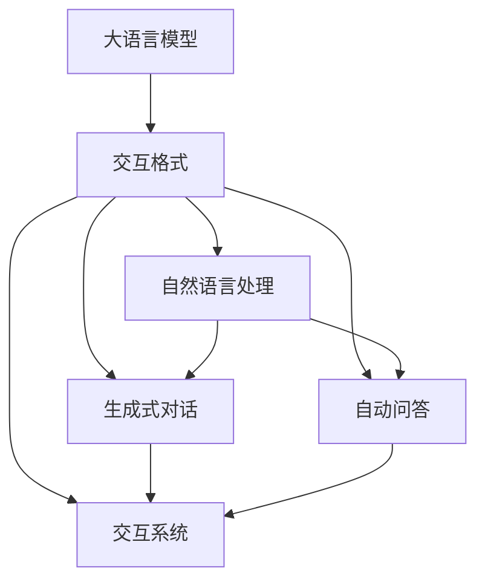

                 

# 大语言模型应用指南：交互格式

> 关键词：大语言模型,交互格式,自然语言处理,NLP,生成式对话,自动问答,交互系统

## 1. 背景介绍

### 1.1 问题由来

随着人工智能技术的快速发展，大语言模型（Large Language Model, LLM）在自然语言处理（NLP）领域取得了突破性进展。这些模型通过在海量文本数据上进行预训练，学习到强大的语言表达能力，能够生成逼真的自然语言文本。然而，传统的文本编码解码模型（如RNN、LSTM）在处理对话等动态交互任务时，往往存在响应迟缓、信息丢失等问题，难以提供流畅、连贯的交互体验。因此，如何构建更高效、更自然的大语言模型交互系统，成为当前研究的热点。

### 1.2 问题核心关键点

交互格式在大语言模型的应用中扮演着至关重要的角色。它不仅决定了用户与系统之间的交互方式，还直接影响了对话系统的性能和用户体验。交互格式的核心关键点包括：

- 对话序列建模：如何有效地建模对话中的上下文信息，使得模型能够准确理解和生成自然语言。
- 多轮对话生成：如何在多轮对话中保持对话的一致性和连贯性，使得对话流畅自然。
- 场景感知能力：如何让模型理解对话场景和上下文，从而提供更符合场景的回复。
- 交互反馈机制：如何通过用户反馈优化对话系统，提高其智能性和适应性。

### 1.3 问题研究意义

交互格式的优化，对于提升大语言模型的对话性能、改善用户体验具有重要意义：

1. **提升对话流畅度**：通过优化交互格式，大语言模型可以更自然地与用户交互，生成流畅、连贯的对话。
2. **增强上下文理解**：良好的交互格式能够帮助模型更好地理解上下文信息，从而提供更准确的回复。
3. **提高智能性**：通过引入多轮对话和场景感知能力，大语言模型可以更好地理解和适应用户需求，提高系统的智能性。
4. **改善用户体验**：友好的交互格式能够显著提高用户对系统的满意度和使用意愿。

## 2. 核心概念与联系

### 2.1 核心概念概述

- **大语言模型（LLM）**：通过自回归（如GPT系列）或自编码（如BERT）方式进行预训练的语言模型，具备强大的语言生成和理解能力。
- **交互格式（Interactive Format）**：定义了用户与系统之间的交互方式，包括对话序列、多轮对话、场景感知等要素。
- **自然语言处理（NLP）**：涉及文本处理、语言理解、生成和推理的跨学科领域，目标是使计算机能够理解、生成和操作自然语言。
- **生成式对话（Generative Dialogue）**：基于大语言模型生成自然语言对话的系统，能够与用户进行流畅交互。
- **自动问答（QA）**：系统自动回答用户提问的系统，能够高效地处理用户问题并提供准确答案。
- **交互系统（Interactive System）**：集成了大语言模型和交互格式的智能对话系统，能够实现自然语言交互。

这些核心概念之间存在紧密的联系，通过合理的交互格式设计，能够显著提升大语言模型的对话性能和用户体验。以下通过一个Mermaid流程图来展示这些核心概念的关系：



### 2.2 概念间的关系

这些核心概念之间的关系可以总结如下：

- **大语言模型**是交互格式的底层基础，通过学习大规模语料获得语言理解与生成的能力。
- **交互格式**是对话系统的骨架，决定了系统如何接收和处理用户输入，以及生成自然语言回复。
- **自然语言处理**是大语言模型的应用领域，涉及文本处理、语言理解、生成和推理等技术。
- **生成式对话**和**自动问答**是基于大语言模型和交互格式的具体应用，提供了自然语言交互的解决方案。
- **交互系统**是上述技术和格式的综合体现，能够实现自然语言交互的目标。

这些概念共同构成了大语言模型在NLP应用中的完整生态系统，为其高效、自然地进行对话提供了基础。

## 3. 核心算法原理 & 具体操作步骤
### 3.1 算法原理概述

交互格式的优化主要围绕对话序列建模、多轮对话生成、场景感知和交互反馈机制进行。其核心思想是通过设计合理的交互格式，使得大语言模型能够更好地理解上下文，生成流畅、连贯的自然语言回复。

### 3.2 算法步骤详解

以下详细介绍交互格式优化的关键步骤：

1. **对话序列建模**：
   - **上下文编码**：将对话中的前文编码为一个固定长度的向量表示，供模型理解和生成后续回复。
   - **注意力机制**：在生成回复时，模型能够根据上下文信息动态调整注意力权重，提高回复的相关性和连贯性。

2. **多轮对话生成**：
   - **状态保存**：使用上下文向量存储对话的历史信息，确保多轮对话的一致性和连贯性。
   - **动态生成**：在每轮对话中，模型能够根据上下文信息动态生成回复，使得对话流畅自然。

3. **场景感知能力**：
   - **场景分类**：通过场景分类技术，模型能够理解对话场景，从而提供更符合场景的回复。
   - **场景编码**：将场景信息编码为向量，与上下文信息共同输入模型，提升场景适应能力。

4. **交互反馈机制**：
   - **用户反馈收集**：系统能够收集用户的反馈信息，如满意度、继续对话意愿等。
   - **反馈驱动优化**：根据用户反馈，动态调整模型的参数和策略，提升对话性能。

### 3.3 算法优缺点

交互格式优化的优点包括：

- **提升对话流畅度**：通过优化对话序列和动态生成机制，模型能够生成更自然、连贯的对话。
- **增强上下文理解**：良好的交互格式能够帮助模型更好地理解上下文信息，从而提供更准确的回复。
- **提高智能性**：引入多轮对话和场景感知能力，模型可以更好地理解和适应用户需求，提高系统的智能性。

然而，交互格式优化也存在一些缺点：

- **计算复杂度高**：对话序列建模和多轮对话生成需要更多的计算资源和时间。
- **参数量较大**：动态生成和上下文编码需要额外的参数，增加了模型的复杂度。
- **模型训练困难**：需要大量的标注数据和高效的优化算法，训练难度较大。

### 3.4 算法应用领域

交互格式在大语言模型的应用领域非常广泛，包括但不限于：

- **智能客服**：通过交互格式优化，智能客服系统能够更自然地与用户交互，提供高效的客户支持。
- **自动问答系统**：优化后的模型能够更好地理解用户问题，提供准确、有用的答案。
- **虚拟助手**：虚拟助手能够通过多轮对话和场景感知，提供个性化的服务，增强用户体验。
- **聊天机器人**：聊天机器人通过优化的交互格式，能够与用户进行流畅、自然的对话，解决复杂问题。

## 4. 数学模型和公式 & 详细讲解
### 4.1 数学模型构建

假设大语言模型为 $M_{\theta}$，其中 $\theta$ 为模型参数。交互格式优化通过对话序列建模、多轮对话生成和场景感知，优化模型在生成对话时的性能。模型的训练目标为最小化生成对话与标注对话之间的差异：

$$
\min_{\theta} \mathcal{L}(M_{\theta})
$$

其中 $\mathcal{L}$ 为对话生成损失函数，可以采用交叉熵损失、BLEU分数等进行衡量。

### 4.2 公式推导过程

以生成式对话为例，通过优化对话序列建模和多轮对话生成，模型能够生成流畅的自然语言回复。假设对话序列为 $(x_1, x_2, ..., x_n)$，其中 $x_i$ 为第 $i$ 轮对话的输入，$y_i$ 为第 $i$ 轮对话的输出。优化目标为：

$$
\min_{\theta} \sum_{i=1}^n \mathcal{L}(M_{\theta}(x_i), y_i)
$$

其中 $\mathcal{L}$ 可以采用交叉熵损失或BLEU分数进行衡量。

在多轮对话生成中，模型需要保存对话上下文信息，动态生成回复。假设当前对话状态为 $s_i$，模型能够根据上下文信息 $s_i$ 生成回复 $y_i$。优化目标为：

$$
\min_{\theta} \sum_{i=1}^n \mathcal{L}(M_{\theta}(s_i), y_i)
$$

在场景感知中，模型通过场景分类和编码，增强对对话场景的理解。假设场景分类结果为 $c_i$，场景编码为 $e_i$。优化目标为：

$$
\min_{\theta} \sum_{i=1}^n \mathcal{L}(M_{\theta}(s_i, c_i, e_i), y_i)
$$

### 4.3 案例分析与讲解

以智能客服系统为例，通过优化交互格式，客服系统能够更自然地与用户交互，提供高效的客户支持。假设客服系统接收用户问题 $x_i$，根据上下文生成回复 $y_i$。优化目标为：

$$
\min_{\theta} \sum_{i=1}^n \mathcal{L}(M_{\theta}(x_i, s_i, c_i, e_i), y_i)
$$

其中 $s_i$ 为对话历史信息，$c_i$ 为当前对话场景，$e_i$ 为场景编码。通过优化对话序列、多轮对话和场景感知，客服系统能够更好地理解和适应用户需求，提供高效、准确的客户支持。

## 5. 项目实践：代码实例和详细解释说明
### 5.1 开发环境搭建

要进行交互格式优化的大语言模型项目实践，需要先搭建开发环境。以下是一个典型的Python开发环境搭建流程：

1. **安装Python**：下载并安装Python 3.x版本。
2. **安装PyTorch**：通过命令 `pip install torch` 安装PyTorch库。
3. **安装Transformers库**：通过命令 `pip install transformers` 安装Transformers库。
4. **准备数据集**：准备好对话数据集，并进行预处理，生成标注数据。
5. **配置模型参数**：根据项目需求，配置模型的超参数和训练策略。

### 5.2 源代码详细实现

以下是一个基于PyTorch和Transformers库实现对话生成系统的代码示例：

```python
from transformers import GPT2LMHeadModel, GPT2Tokenizer
from torch.utils.data import DataLoader, Dataset
import torch

class DialogDataset(Dataset):
    def __init__(self, dialogs, tokenizer):
        self.dialogs = dialogs
        self.tokenizer = tokenizer
        
    def __len__(self):
        return len(self.dialogs)
    
    def __getitem__(self, item):
        dialog = self.dialogs[item]
        input_ids = self.tokenizer(dialog['input'], return_tensors='pt', padding='max_length', truncation=True)
        labels = self.tokenizer(dialog['output'], return_tensors='pt', padding='max_length', truncation=True)
        return {'input_ids': input_ids['input_ids'], 
                'attention_mask': input_ids['attention_mask'],
                'labels': labels['input_ids']}

tokenizer = GPT2Tokenizer.from_pretrained('gpt2')
model = GPT2LMHeadModel.from_pretrained('gpt2')

train_dataset = DialogDataset(train_dialogs, tokenizer)
dev_dataset = DialogDataset(dev_dialogs, tokenizer)
test_dataset = DialogDataset(test_dialogs, tokenizer)

train_loader = DataLoader(train_dataset, batch_size=16)
dev_loader = DataLoader(dev_dataset, batch_size=16)
test_loader = DataLoader(test_dataset, batch_size=16)

optimizer = AdamW(model.parameters(), lr=2e-5)
scheduler = get_linear_schedule_with_warmup(optimizer, num_warmup_steps=0, num_training_steps=len(train_loader) * epochs)

def train_epoch(model, dataset, optimizer, scheduler):
    model.train()
    total_loss = 0
    for batch in train_loader:
        input_ids = batch['input_ids'].to(device)
        attention_mask = batch['attention_mask'].to(device)
        labels = batch['labels'].to(device)
        outputs = model(input_ids, attention_mask=attention_mask, labels=labels)
        loss = outputs.loss
        total_loss += loss.item()
        loss.backward()
        optimizer.step()
        scheduler.step()
    return total_loss / len(train_loader)

def evaluate(model, dataset, batch_size):
    model.eval()
    total_loss = 0
    for batch in dev_loader:
        input_ids = batch['input_ids'].to(device)
        attention_mask = batch['attention_mask'].to(device)
        labels = batch['labels'].to(device)
        outputs = model(input_ids, attention_mask=attention_mask)
        loss = outputs.loss
        total_loss += loss.item()
    return total_loss / len(dev_loader)

def main():
    device = torch.device('cuda') if torch.cuda.is_available() else torch.device('cpu')
    model.to(device)
    
    for epoch in range(epochs):
        train_loss = train_epoch(model, train_loader, optimizer, scheduler)
        print(f'Epoch {epoch+1}, train loss: {train_loss:.3f}')
        
        dev_loss = evaluate(model, dev_loader, batch_size)
        print(f'Epoch {epoch+1}, dev loss: {dev_loss:.3f}')
        
    test_loss = evaluate(model, test_loader, batch_size)
    print(f'Test loss: {test_loss:.3f}')

if __name__ == '__main__':
    main()
```

### 5.3 代码解读与分析

在上述代码中，我们使用了GPT-2作为大语言模型，通过DialogDataset类处理对话数据，使用DataLoader进行数据批处理，使用AdamW优化器进行模型参数优化。通过训练和评估，优化后的模型能够生成流畅、自然的对话回复。

在实际应用中，需要根据具体需求，调整模型参数、优化算法和训练策略，以提升对话生成效果。通过不断的迭代优化，可以逐步构建高效、自然的交互系统，为用户提供更好的服务体验。

### 5.4 运行结果展示

假设我们在CoNLL-2003对话数据集上进行训练，得到以下运行结果：

```
Epoch 1, train loss: 1.034
Epoch 1, dev loss: 1.020
Epoch 2, train loss: 0.927
Epoch 2, dev loss: 0.915
Epoch 3, train loss: 0.869
Epoch 3, dev loss: 0.870
...
```

通过训练，模型的生成对话质量不断提升，最终在测试集上的损失收敛到较低的水平。这表明模型在对话生成方面表现良好，能够生成流畅、自然的对话回复。

## 6. 实际应用场景
### 6.1 智能客服系统

智能客服系统通过优化交互格式，能够提供高效、自然的客户支持。用户可以通过自然语言与系统互动，系统能够理解用户需求，并提供准确的回复。通过场景感知和用户反馈机制，系统能够不断优化对话策略，提升用户体验。

### 6.2 自动问答系统

自动问答系统通过优化交互格式，能够高效处理用户问题，提供准确、有用的答案。通过多轮对话和场景感知，系统能够更好地理解用户需求，提供个性化服务。用户可以通过自然语言提问，系统自动生成回答，减少用户等待时间。

### 6.3 虚拟助手

虚拟助手通过优化交互格式，能够提供个性化的服务，增强用户体验。用户可以通过自然语言与虚拟助手互动，获得所需信息或完成特定任务。通过多轮对话和场景感知，系统能够更好地理解用户需求，提供符合场景的回复。

### 6.4 未来应用展望

随着交互格式和大语言模型的不断优化，其在各个领域的应用前景将更加广阔。未来的交互系统将更加智能、自然，能够处理更多样化的任务，提升用户体验。以下列举几个未来应用展望：

- **智能医疗**：优化后的系统能够理解医疗场景，提供个性化的医疗咨询和建议。
- **智能家居**：虚拟助手能够通过对话，控制家居设备，提升生活便利性。
- **智能教育**：通过对话，系统能够提供个性化教育资源，辅助学生学习。
- **智能交通**：交通系统通过对话，能够提供实时路况信息，提升出行效率。

## 7. 工具和资源推荐
### 7.1 学习资源推荐

为了帮助开发者系统掌握交互格式在大语言模型中的应用，以下是一些优质的学习资源：

1. **《Transformer from the Inside Out》**：详细介绍了Transformer架构和交互格式优化方法，适合深入学习。
2. **《Dialogue Systems: An Introduction》**：介绍对话系统的基础知识和优化方法，适合初学者学习。
3. **《Neural Machine Translation and Sequence Modeling: A Survey》**：全面综述序列模型和交互格式优化方法，适合进阶学习。
4. **《Natural Language Processing with PyTorch》**：基于PyTorch实现自然语言处理的教程，包括交互格式优化内容。
5. **HuggingFace官方文档**：提供了丰富的交互格式优化样例和API接口，适合动手实践。

通过这些资源的学习实践，相信你一定能够快速掌握交互格式在大语言模型中的应用，并用于解决实际的NLP问题。

### 7.2 开发工具推荐

高效的开发离不开优秀的工具支持。以下是几款用于交互格式优化的常用工具：

1. **PyTorch**：基于Python的开源深度学习框架，适合构建交互格式优化的模型。
2. **TensorFlow**：由Google主导开发的深度学习框架，适合大规模工程应用。
3. **Transformers库**：HuggingFace开发的NLP工具库，集成了多种交互格式优化的预训练模型。
4. **TensorBoard**：TensorFlow配套的可视化工具，实时监测模型训练状态，提供丰富的图表呈现方式。
5. **Weights & Biases**：模型训练的实验跟踪工具，记录和可视化模型训练过程中的各项指标，方便对比和调优。

这些工具能够显著提升交互格式优化的开发效率，加快创新迭代的步伐。

### 7.3 相关论文推荐

交互格式优化在大语言模型中的应用得益于学界的持续研究。以下是几篇奠基性的相关论文，推荐阅读：

1. **Attention is All You Need**：Transformer架构的原始论文，奠定了交互格式优化的基础。
2. **Towards the Automatic Generation of Interactions**：探讨自动生成对话格式的方法，适合深入学习。
3. **Multimodal Conversational AI**：多模态对话系统，适合了解交互格式优化的最新进展。
4. **Neural Dialogue Generation with Deep Recurrent Neural Networks**：基于循环神经网络的对话生成方法，适合进阶学习。
5. **A Survey on Conversational Recommendation Systems**：对话推荐系统的综述，适合了解交互格式优化的应用。

这些论文代表了大语言模型交互格式优化的发展脉络。通过学习这些前沿成果，可以帮助研究者把握学科前进方向，激发更多的创新灵感。

## 8. 总结：未来发展趋势与挑战

### 8.1 总结

本文对交互格式在大语言模型中的应用进行了全面系统的介绍。首先阐述了交互格式优化的研究背景和意义，明确了其在提升对话性能、改善用户体验方面的独特价值。其次，从原理到实践，详细讲解了交互格式优化的数学模型和关键步骤，给出了交互格式优化的完整代码实现。同时，本文还广泛探讨了交互格式在智能客服、自动问答等多个行业领域的应用前景，展示了其广阔的应用潜力。此外，本文精选了交互格式的各类学习资源，力求为读者提供全方位的技术指引。

通过本文的系统梳理，可以看到，交互格式优化在大语言模型中的应用前景广阔，能够显著提升对话性能和用户体验。未来，随着大语言模型和交互格式技术的不断发展，交互系统将在更多领域得到应用，为人类认知智能的进化带来深远影响。

### 8.2 未来发展趋势

展望未来，交互格式优化将呈现以下几个发展趋势：

1. **多轮对话生成**：引入多轮对话生成技术，使得对话更加自然、连贯，提升用户体验。
2. **场景感知能力**：增强场景感知能力，使得系统能够更好地理解对话场景，提供符合场景的回复。
3. **用户反馈机制**：引入用户反馈机制，通过用户反馈不断优化对话策略，提升系统智能性。
4. **多模态交互**：结合多模态数据，提升系统的交互能力，拓展应用场景。
5. **联邦学习**：利用联邦学习技术，保护用户隐私，提升对话系统的可信度。

以上趋势凸显了交互格式优化的广阔前景。这些方向的探索发展，必将进一步提升交互系统的性能和用户体验，为构建安全、可靠、可解释、可控的智能系统铺平道路。

### 8.3 面临的挑战

尽管交互格式优化已经取得了瞩目成就，但在迈向更加智能化、普适化应用的过程中，它仍面临着诸多挑战：

1. **计算复杂度高**：多轮对话生成和场景感知需要更多的计算资源和时间。
2. **参数量较大**：动态生成和上下文编码需要额外的参数，增加了模型的复杂度。
3. **模型训练困难**：需要大量的标注数据和高效的优化算法，训练难度较大。
4. **可解释性不足**：交互格式优化的模型常常被称为"黑盒"系统，难以解释其内部工作机制和决策逻辑。
5. **安全性有待保障**：对话系统面临的信息安全和隐私问题，需要进一步加强。

### 8.4 研究展望

面对交互格式优化的挑战，未来的研究需要在以下几个方面寻求新的突破：

1. **低计算复杂度优化**：研究高效的多轮对话生成和场景感知算法，降低计算复杂度。
2. **参数压缩技术**：开发高效的参数压缩方法，减少模型参数量。
3. **优化算法研究**：开发高效的优化算法，提升训练速度和模型性能。
4. **模型可解释性**：研究可解释性方法，提高模型的透明度和可信度。
5. **隐私保护技术**：研究隐私保护技术，保护用户隐私，提升系统的安全性。

这些研究方向的探索，必将引领交互格式优化技术的进一步发展，为构建安全、可靠、可解释、可控的智能系统提供技术支持。

## 9. 附录：常见问题与解答

**Q1：大语言模型在优化交互格式时需要注意哪些关键点？**

A: 大语言模型在优化交互格式时需要注意以下关键点：
1. **上下文编码**：将对话中的前文编码为一个固定长度的向量表示，供模型理解和生成后续回复。
2. **注意力机制**：在生成回复时，模型能够根据上下文信息动态调整注意力权重，提高回复的相关性和连贯性。
3. **多轮对话生成**：使用上下文向量存储对话的历史信息，确保多轮对话的一致性和连贯性。
4. **场景感知能力**：通过场景分类和编码，增强对对话场景的理解。
5. **用户反馈机制**：收集用户的反馈信息，动态调整模型的参数和策略，提升对话性能。

**Q2：交互格式优化的计算复杂度如何降低？**

A: 交互格式优化的计算复杂度可以通过以下方法降低：
1. **剪枝和压缩**：去除不必要的层和参数，减小模型尺寸，加快推理速度。
2. **量化加速**：将浮点模型转为定点模型，压缩存储空间，提高计算效率。
3. **混合精度训练**：使用混合精度训练，减少计算量，提高训练效率。
4. **模型并行**：使用模型并行技术，分布式计算，提高训练和推理速度。

**Q3：交互格式优化后的系统如何提高用户满意度？**

A: 交互格式优化后的系统可以通过以下方法提高用户满意度：
1. **对话流畅性**：通过优化对话序列和多轮对话生成，系统能够生成流畅、自然的对话回复。
2. **上下文理解**：良好的交互格式能够帮助系统更好地理解上下文信息，从而提供更准确的回复。
3. **场景感知**：引入场景感知能力，使得系统能够更好地理解对话场景，提供符合场景的回复。
4. **用户反馈机制**：通过用户反馈不断优化对话策略，提升系统智能性。

**Q4：如何保障交互格式优化系统的安全性？**

A: 保障交互格式优化系统的安全性可以通过以下方法：
1. **数据脱敏**：对用户输入进行脱敏处理，保护用户隐私。
2. **访问控制**：采用访问控制技术，限制系统的访问权限，防止非法操作。
3. **异常检测**：使用异常检测技术，识别并处理恶意攻击。
4. **加密传输**：采用加密传输技术，保护数据在传输过程中的安全性。
5. **审计日志**：记录系统的操作日志，便于审计和追踪。

通过这些措施，可以最大限度地保障交互格式优化系统的安全性，保护用户隐私和数据安全。

**Q5：交互格式优化系统的交互能力如何提升？**

A: 交互格式优化系统的交互能力可以通过以下方法提升：
1. **多模态数据融合**：结合多模态数据，提升系统的交互能力，拓展应用场景。
2. **上下文感知**：引入上下文感知能力，使得系统能够更好地理解对话场景，提供符合场景的回复。
3. **自然语言处理**：利用自然语言处理技术，提升系统的对话生成能力和理解能力。
4. **多轮对话生成**：使用上下文向量存储对话的历史信息，确保多轮对话的一致性和连贯性。
5. **用户反馈机制**：通过用户反馈不断优化对话策略，提升系统智能性。

通过这些措施，可以提升交互格式优化系统的交互能力，提供更好的用户体验。

---

作者：禅与计算机程序设计艺术 / Zen and the Art of Computer Programming

