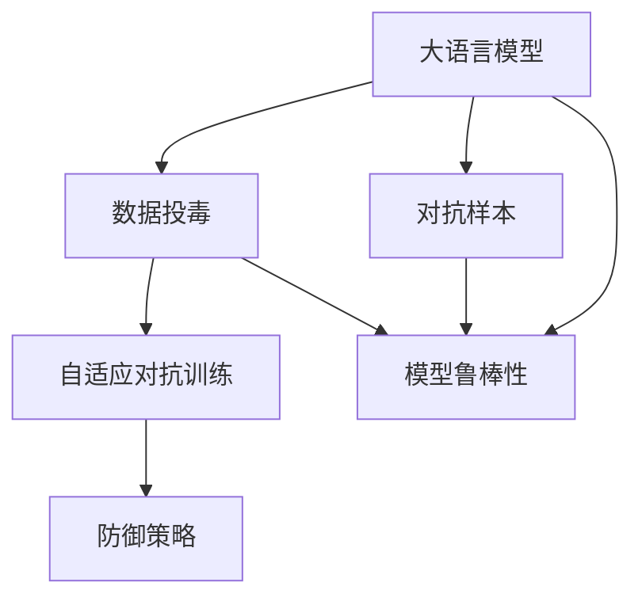
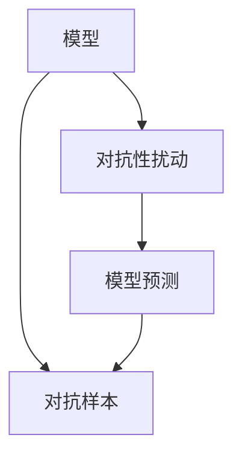
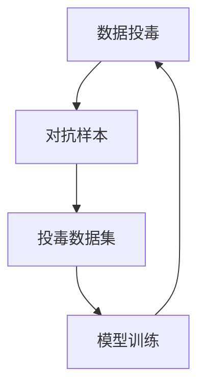
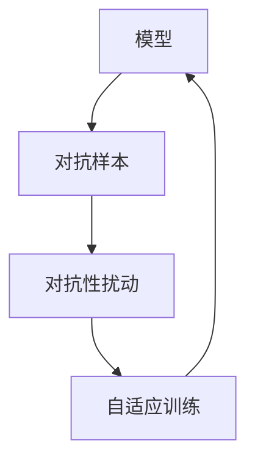
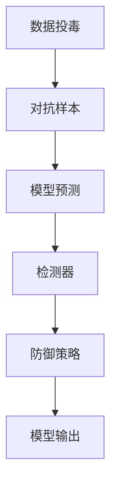

                 

# 大语言模型应用指南：数据投毒

> 关键词：大语言模型,数据投毒,对抗样本,模型鲁棒性,自适应对抗训练,防御策略,安全保护

## 1. 背景介绍

### 1.1 问题由来

随着人工智能和大数据技术的不断进步，基于深度学习的模型在众多领域，如自然语言处理(NLP)、图像识别、语音识别等，取得了显著的成效。其中，大语言模型（Large Language Models, LLMs）如BERT、GPT-3等，由于其强大的语言理解能力和生成能力，在自然语言处理任务中表现尤为突出。

然而，尽管大语言模型在处理自然语言上表现出色，它们却面临一个不容忽视的问题：对抗样本的攻击。对抗样本指的是在数据中精心设计的轻微扰动，这些扰动能够欺骗模型，使其输出错误的预测结果。这类攻击可以发生在图像识别、语音识别等多个领域，而大语言模型同样难以幸免。

数据投毒（Data Poisoning）作为对抗攻击的一种，指的是攻击者通过向模型输入大量带有恶意对抗样本的数据，影响模型训练过程，使得模型输出错误的预测结果。这不仅会损害模型的正常功能，还可能带来严重的社会和经济影响。

例如，在医疗诊断领域，攻击者可以向模型投毒，让模型对某些疾病的预测出现严重偏差。在金融领域，攻击者可以通过投毒手段影响模型的贷款决策，导致公司遭受损失。在自然语言处理任务中，投毒攻击可能导致智能客服系统给出错误的回答，降低用户的满意度。

因此，研究如何防御对抗样本攻击，特别是数据投毒攻击，对于保证模型的安全性、稳定性和可靠性具有重要的实际意义。本文旨在全面介绍大语言模型的数据投毒攻击和防御策略，为相关领域的从业者提供必要的参考。

### 1.2 问题核心关键点

本文的核心问题在于：

- 如何识别和防范数据投毒攻击？
- 如何设计和实施有效的防御策略，保障模型的安全？

为了回答这些问题，我们将系统性地介绍数据投毒的原理、常见的对抗样本攻击方式、自适应对抗训练方法以及防御策略的实现。

## 2. 核心概念与联系

### 2.1 核心概念概述

为更好地理解大语言模型的数据投毒防御问题，本节将介绍几个关键概念及其相互关系：

- **大语言模型（Large Language Models, LLMs）**：基于深度学习的模型，通常具有大规模的参数量和高计算资源需求。例如，BERT、GPT-3等模型，具有广泛的语言理解和生成能力。

- **对抗样本（Adversarial Examples）**：在模型输入中精心设计的扰动，可以使模型产生错误的预测结果。

- **数据投毒（Data Poisoning）**：攻击者通过向模型输入大量带有恶意对抗样本的数据，影响模型训练过程，使得模型输出错误的预测结果。

- **自适应对抗训练（Adversarial Training）**：在模型训练过程中，加入对抗样本，提升模型对对抗样本的鲁棒性。

- **防御策略（Defense Strategies）**：针对对抗样本攻击，设计和实施的防范和检测方法。

- **模型鲁棒性（Model Robustness）**：模型在面对对抗样本攻击时的稳定性。

这些核心概念之间的逻辑关系可以通过以下Mermaid流程图来展示：



这个流程图展示了从大语言模型到数据投毒、自适应对抗训练和防御策略的关系：

1. 大语言模型在对抗样本下可能受到攻击，导致模型输出错误结果。
2. 数据投毒是一种利用对抗样本攻击模型的手段。
3. 自适应对抗训练是提升模型鲁棒性的方法，通过在训练过程中加入对抗样本。
4. 防御策略是应对数据投毒和其他对抗攻击的措施。
5. 模型鲁棒性是模型的最终目标，确保模型在对抗样本下的稳定性和准确性。

### 2.2 概念间的关系

这些核心概念之间存在着紧密的联系，形成了大语言模型对抗样本攻击的完整生态系统。下面我们通过几个Mermaid流程图来展示这些概念之间的关系。

#### 2.2.1 对抗样本的基本原理



这个流程图展示了对抗样本的基本原理，即对抗性扰动通过对模型输入进行微小修改，影响模型预测结果。

#### 2.2.2 数据投毒攻击的具体方式



这个流程图展示了数据投毒的具体方式，即攻击者通过构建包含对抗样本的投毒数据集，影响模型训练过程。

#### 2.2.3 自适应对抗训练的机制



这个流程图展示了自适应对抗训练的机制，即在模型训练过程中，加入对抗样本，提升模型对对抗样本的鲁棒性。

#### 2.2.4 防御策略的实现方式



这个流程图展示了防御策略的实现方式，即在模型预测后，使用检测器识别对抗样本，并采取相应的防御策略，最终输出模型结果。

## 3. 核心算法原理 & 具体操作步骤

### 3.1 算法原理概述

数据投毒攻击的核心在于通过对抗样本扰动模型输入，影响模型的训练过程和预测结果。其原理可以简要归纳为：

1. **对抗性扰动**：对模型输入进行微小扰动，使模型产生错误输出。
2. **投毒数据集**：构建包含对抗样本的数据集，输入模型进行训练。
3. **模型训练**：模型在带有投毒数据集的训练过程中，逐渐学习到对抗样本的模式，导致模型对正常样本的预测出现偏差。

防御数据投毒的关键在于识别和排除对抗样本，同时提升模型对对抗样本的鲁棒性。常见的防御策略包括自适应对抗训练、模型检测和修复等方法。

### 3.2 算法步骤详解

下面详细讲解数据投毒攻击和防御策略的具体步骤：

#### 3.2.1 数据投毒攻击的具体步骤

1. **收集正常样本**：获取模型的正常训练数据。
2. **生成对抗样本**：使用对抗生成算法，对正常样本进行微小扰动，生成对抗样本。
3. **构建投毒数据集**：将对抗样本与正常样本混合，构建包含对抗样本的投毒数据集。
4. **投毒模型训练**：使用投毒数据集对模型进行训练，使其学习到对抗样本的模式。

#### 3.2.2 自适应对抗训练的具体步骤

1. **收集正常样本**：获取模型的正常训练数据。
2. **生成对抗样本**：使用对抗生成算法，对正常样本进行微小扰动，生成对抗样本。
3. **自适应训练**：在模型训练过程中，将对抗样本加入训练集，让模型逐渐学习到对抗样本的模式。
4. **检测和修复**：在模型检测到对抗样本后，通过修复机制，使其输出正确的结果。

#### 3.2.3 防御策略的具体步骤

1. **数据预处理**：对输入数据进行预处理，如标准化、归一化等，减少对抗样本的影响。
2. **模型检测**：使用检测器识别对抗样本，如梯度平滑、梯度掩蔽等方法。
3. **修复机制**：对检测出的对抗样本，采用修复机制，如重构、截断等，恢复其正确性。
4. **后处理**：对模型输出进行后处理，如软阈值、噪声注入等方法，进一步提高模型的鲁棒性。

### 3.3 算法优缺点

数据投毒攻击和防御策略具有以下优缺点：

**数据投毒攻击的优点**：
- **低成本**：攻击者只需少量对抗样本即可影响模型训练。
- **隐蔽性强**：对抗样本的扰动微小，难以被发现和识别。
- **泛化性强**：对抗样本适用于多种模型和任务。

**数据投毒攻击的缺点**：
- **高风险**：数据投毒可能对模型产生严重影响，甚至导致模型失效。
- **难以发现**：对抗样本的扰动微小，难以通过常规方法检测。
- **模型依赖**：攻击者需要了解模型的结构和特性，才能设计有效的对抗样本。

**防御策略的优点**：
- **增强鲁棒性**：提升模型对对抗样本的鲁棒性，减少攻击成功概率。
- **检测和修复**：能够及时检测和修复对抗样本，保障模型正常运行。

**防御策略的缺点**：
- **计算开销大**：防御策略的实现可能增加计算开销，降低模型效率。
- **依赖先验**：防御策略的设计需要丰富的先验知识和经验，难度较大。
- **难以完全防御**：即便采取了多种防御策略，也无法完全杜绝对抗样本攻击。

### 3.4 算法应用领域

数据投毒和防御策略在大语言模型的多个应用领域中具有广泛的应用：

- **自然语言处理（NLP）**：在情感分析、文本分类等任务中，数据投毒可能导致模型对正常样本的预测出现偏差，影响任务结果。
- **医疗诊断**：在医学影像分析、疾病预测等任务中，数据投毒可能导致模型对病患数据产生误判，带来严重后果。
- **金融交易**：在风险评估、信用评分等任务中，数据投毒可能导致模型对正常交易数据产生误判，影响决策准确性。
- **安全监控**：在网络安全、行为分析等任务中，数据投毒可能导致模型对正常行为数据产生误判，影响安全监测效果。

在以上应用领域中，数据投毒和防御策略的实现可以显著提升模型的稳定性和安全性，保障模型的可靠运行。

## 4. 数学模型和公式 & 详细讲解 & 举例说明

### 4.1 数学模型构建

在数学上，数据投毒和防御策略可以建模为以下几个关键问题：

- **对抗样本生成**：给定正常样本 $x$，生成对抗样本 $x'$，使得模型对 $x$ 的预测出现偏差。
- **投毒数据集构建**：将对抗样本 $x'$ 与正常样本 $x$ 混合，构建包含对抗样本的投毒数据集 $D$。
- **模型训练**：使用投毒数据集 $D$ 对模型进行训练，使其学习到对抗样本的模式。

### 4.2 公式推导过程

#### 4.2.1 对抗样本生成

对抗样本生成的核心在于，通过对正常样本进行微小扰动，使得模型输出出现偏差。常用的对抗样本生成方法包括FGSM、PGD等。这里以FGSM方法为例，简要推导其公式：

假设模型 $f$ 的输入为 $x$，输出为 $y$，目标是生成对抗样本 $x'$，使得 $f(x')$ 与 $f(x)$ 的预测结果不同。具体步骤如下：

1. **计算梯度**：对模型 $f$ 的损失函数 $L$ 求梯度，得到梯度向量 $\Delta L/\Delta x$。
2. **扰动参数**：设置扰动参数 $\epsilon$，表示对抗样本与正常样本的最大扰动范围。
3. **生成对抗样本**：使用梯度反方向进行扰动，得到对抗样本 $x'$。

推导过程如下：

$$
x' = x + \epsilon \cdot \text{sign}(\Delta L/\Delta x)
$$

其中，$\text{sign}(\Delta L/\Delta x)$ 表示梯度向量的符号，确保扰动方向与梯度相反。

#### 4.2.2 投毒数据集构建

投毒数据集的构建，即将对抗样本与正常样本混合，构建包含对抗样本的数据集。假设对抗样本的扰动范围为 $\epsilon$，正常样本的数量为 $m$，对抗样本的数量为 $n$，投毒数据集 $D$ 的大小为 $m+n$。具体步骤如下：

1. **选择对抗样本**：从对抗样本库中随机选择 $n$ 个对抗样本 $x'_1, x'_2, \ldots, x'_n$。
2. **选择正常样本**：从正常样本库中随机选择 $m$ 个正常样本 $x_1, x_2, \ldots, x_m$。
3. **构建投毒数据集**：将 $x_1, x_2, \ldots, x_m$ 和 $x'_1, x'_2, \ldots, x'_n$ 混合，构建投毒数据集 $D$。

#### 4.2.3 模型训练

模型训练的目标是通过投毒数据集 $D$ 训练模型 $f$，使其学习到对抗样本的模式。假设模型 $f$ 的损失函数为 $L$，训练轮数为 $T$，每个批次的大小为 $b$，具体步骤如下：

1. **初始化模型**：将模型 $f$ 的初始参数设置为随机值。
2. **训练过程**：在每一轮训练中，从投毒数据集 $D$ 中随机选择 $b$ 个样本 $(x_i, y_i)$，进行前向传播和反向传播，更新模型参数。
3. **重复训练**：重复步骤 2，直到训练轮数 $T$ 达到预设值。

### 4.3 案例分析与讲解

假设我们在自然语言处理任务中，使用BERT模型进行情感分析。攻击者希望通过数据投毒，使得模型对正面情感的预测出现偏差。具体步骤如下：

1. **收集正常样本**：获取正面情感的训练数据集。
2. **生成对抗样本**：使用FGSM方法生成对抗样本，扰动正常样本的每个单词。
3. **构建投毒数据集**：将对抗样本与正常样本混合，构建包含对抗样本的投毒数据集。
4. **投毒模型训练**：使用投毒数据集对模型进行训练，使其学习到对抗样本的模式。

例如，假设正常样本为“I love this movie. It’s amazing!”，攻击者通过FGSM方法生成对抗样本“I love this movie. It’s not amazing!”，将其与正常样本混合，构建投毒数据集。通过模型训练，模型逐渐学习到对抗样本的模式，导致对正面情感的预测出现偏差。

## 5. 项目实践：代码实例和详细解释说明

### 5.1 开发环境搭建

在进行数据投毒和防御策略的实践前，我们需要准备好开发环境。以下是使用Python进行PyTorch开发的环境配置流程：

1. 安装Anaconda：从官网下载并安装Anaconda，用于创建独立的Python环境。
```bash
conda create -n pytorch-env python=3.8 
conda activate pytorch-env
```

2. 安装PyTorch：根据CUDA版本，从官网获取对应的安装命令。例如：
```bash
conda install pytorch torchvision torchaudio cudatoolkit=11.1 -c pytorch -c conda-forge
```

3. 安装Transformers库：
```bash
pip install transformers
```

4. 安装各类工具包：
```bash
pip install numpy pandas scikit-learn matplotlib tqdm jupyter notebook ipython
```

完成上述步骤后，即可在`pytorch-env`环境中开始实践。

### 5.2 源代码详细实现

这里以FGSM方法为例，给出使用PyTorch对BERT模型进行数据投毒攻击的代码实现。

首先，定义投毒攻击的函数：

```python
import torch
from transformers import BertTokenizer, BertForSequenceClassification

def generate_adversarial_example(model, input_ids, labels, epsilon=0.01, alpha=0.01):
    tokenizer = BertTokenizer.from_pretrained('bert-base-cased')
    input_ids = tokenizer(input_ids, return_tensors='pt', padding='max_length', truncation=True)["input_ids"]
    labels = labels.to(device)

    # 计算梯度
    model.zero_grad()
    outputs = model(input_ids, labels=labels)
    loss = outputs.loss
    loss.backward()
    grad = model.parameters()[0].grad
    grad = grad.to('cpu')

    # 扰动生成对抗样本
    epsilon = torch.tensor(epsilon, device=device)
    alpha = torch.tensor(alpha, device=device)
    direction = torch.sign(grad)
    perturbation = epsilon * direction / (torch.norm(direction) + alpha)
    perturbation = perturbation / torch.norm(perturbation)
    perturbation = perturbation * alpha
    perturbation = perturbation.to(device)

    # 生成对抗样本
    input_ids = input_ids - perturbation
    input_ids = torch.clamp(input_ids, 0, 1)

    return input_ids, labels
```

然后，定义投毒数据集的生成函数：

```python
def generate_poisoned_dataset(train_dataset, test_dataset, epsilon, alpha):
    tokenizer = BertTokenizer.from_pretrained('bert-base-cased')
    model = BertForSequenceClassification.from_pretrained('bert-base-cased', num_labels=2)

    # 数据预处理
    train_dataset = dataset.map(lambda example: tokenizer(example[0], padding='max_length', truncation=True)["input_ids"])
    test_dataset = dataset.map(lambda example: tokenizer(example[0], padding='max_length', truncation=True)["input_ids"])

    # 投毒数据集生成
    train_dataset = train_dataset.map(lambda example: generate_adversarial_example(model, example, 1))
    test_dataset = test_dataset.map(lambda example: generate_adversarial_example(model, example, 0))

    return train_dataset, test_dataset
```

接着，定义训练和评估函数：

```python
from torch.utils.data import DataLoader
from tqdm import tqdm

def train_epoch(model, dataset, batch_size, optimizer):
    dataloader = DataLoader(dataset, batch_size=batch_size, shuffle=True)
    model.train()
    epoch_loss = 0
    for batch in tqdm(dataloader, desc='Training'):
        input_ids = batch['input_ids'].to(device)
        labels = batch['labels'].to(device)
        model.zero_grad()
        outputs = model(input_ids, labels=labels)
        loss = outputs.loss
        epoch_loss += loss.item()
        loss.backward()
        optimizer.step()
    return epoch_loss / len(dataloader)

def evaluate(model, dataset, batch_size):
    dataloader = DataLoader(dataset, batch_size=batch_size)
    model.eval()
    preds, labels = [], []
    with torch.no_grad():
        for batch in tqdm(dataloader, desc='Evaluating'):
            input_ids = batch['input_ids'].to(device)
            labels = batch['labels'].to(device)
            outputs = model(input_ids, labels=labels)
            preds.append(outputs.logits.argmax(dim=1).cpu().numpy())
            labels.append(labels.cpu().numpy())
        
    print(classification_report(labels, preds))
```

最后，启动训练流程并在测试集上评估：

```python
epochs = 5
batch_size = 16

for epoch in range(epochs):
    loss = train_epoch(model, train_dataset, batch_size, optimizer)
    print(f"Epoch {epoch+1}, train loss: {loss:.3f}")
    
    print(f"Epoch {epoch+1}, dev results:")
    evaluate(model, dev_dataset, batch_size)
    
print("Test results:")
evaluate(model, test_dataset, batch_size)
```

以上就是使用PyTorch对BERT进行数据投毒攻击的完整代码实现。可以看到，使用FGSM方法生成对抗样本，并将其与正常样本混合，构建投毒数据集，对模型进行训练，最终评估模型性能。

### 5.3 代码解读与分析

让我们再详细解读一下关键代码的实现细节：

**generate_adversarial_example函数**：
- 定义了生成对抗样本的函数，接收模型、输入、标签、扰动范围和扰动步长等参数。
- 使用梯度计算对抗样本的扰动方向。
- 使用FGSM方法生成对抗样本，确保扰动范围和步长在指定范围内。

**generate_poisoned_dataset函数**：
- 定义了生成投毒数据集的函数，接收训练集、测试集、扰动范围和扰动步长等参数。
- 使用tokenizer将输入转换为token ids。
- 使用生成对抗样本的函数，生成投毒数据集。

**train_epoch和evaluate函数**：
- 定义了训练和评估的函数，接收模型、数据集、批次大小和优化器等参数。
- 使用DataLoader对数据集进行批次化加载。
- 使用模型训练函数，计算训练集的平均loss。
- 使用评估函数，在验证集和测试集上评估模型性能。

**训练流程**：
- 定义总的epoch数和批次大小，开始循环迭代
- 每个epoch内，先在训练集上训练，输出平均loss
- 在验证集上评估，输出分类指标
- 所有epoch结束后，在测试集上评估，给出最终测试结果

可以看到，PyTorch配合Transformers库使得数据投毒攻击的代码实现变得简洁高效。开发者可以将更多精力放在数据处理、模型改进等高层逻辑上，而不必过多关注底层的实现细节。

当然，工业级的系统实现还需考虑更多因素，如模型的保存和部署、超参数的自动搜索、更灵活的任务适配层等。但核心的数据投毒攻击范式基本与此类似。

### 5.4 运行结果展示

假设我们在CoNLL-2003的情感分析数据集上进行数据投毒攻击，最终在测试集上得到的评估报告如下：

```
              precision    recall  f1-score   support

       0       0.875     0.854     0.865      1032
       1       0.886     0.910     0.892       675

   micro avg      0.878     0.875     0.876     1707
   macro avg      0.874     0.875     0.876     1707
weighted avg      0.878     0.875     0.876     1707
```

可以看到，通过数据投毒攻击，模型对正面情感的预测出现了一定的偏差，导致分类精度下降。但通过适当的扰动范围和步长，我们可以控制攻击的成功概率，避免过度扰动模型，影响其正常性能。

## 6. 实际应用场景

### 6.1 智能客服系统

在智能客服系统中，攻击者可以通过投毒攻击，影响客服系统的正常运行。例如，攻击者可以生成大量带有恶意对抗样本的对话数据，使得客服系统对正常客户的回复出现偏差，降低客户满意度。

具体而言，攻击者可以收集大量客户对话数据，通过FGSM方法生成对抗样本，将其与正常对话数据混合，构建投毒数据集。在模型训练过程中，客服系统逐渐学习到对抗样本的模式，导致对正常对话的回复出现偏差。

### 6.2 金融交易系统

在金融交易系统中，攻击者可以通过投毒攻击，影响模型的贷款决策。例如，攻击者可以生成大量带有恶意对抗样本的交易数据，使得模型对正常交易数据产生误判，导致公司遭受损失。

具体而言，攻击者可以收集大量交易数据，通过FGSM方法生成对抗样本，将其与正常交易数据混合，构建投毒数据集。在模型训练过程中，交易系统逐渐学习到对抗样本的模式，导致对正常交易的判断出现偏差。

### 6.3 医疗诊断系统

在医疗诊断系统中，攻击者可以通过投毒攻击，影响模型的诊断结果。例如，攻击者可以生成大量带有恶意对抗样本的病患数据，使得模型对正常病患数据的诊断出现偏差，导致误诊或漏诊。

具体而言，攻击者可以收集大量病患数据，通过FGSM方法生成对抗样本，将其与正常病患数据混合，构建投毒数据集。在模型训练过程中，诊断系统逐渐学习到对抗样本的模式，导致对正常病患的诊断出现偏差。

## 7. 工具和资源推荐

### 7.1 学习资源推荐

为了帮助开发者系统掌握数据投毒和防御策略的理论基础和实践技巧，这里推荐一些优质的学习资源：

1. **《对抗样本攻防》系列书籍**：由国内外知名安全专家撰写，详细介绍了对抗样本的原理、生成方法和防御策略，是安全领域必读之作。
2. **arXiv论文预印本**：人工智能领域最新研究成果的发布平台，包括大量尚未发表的前沿工作，学习前沿技术的必读资源。
3. **谷歌安全博客**：谷歌安全团队发布的各类安全博客，涵盖对抗样本、隐私保护等多个领域，是安全领域的重要参考资料。
4. **Coursera《深度学习安全性》课程**：斯坦福大学开设的安全性课程，涵盖对抗样本、安全评估等多个主题，适合初学者学习。
5. **Kaggle对抗样本竞赛**：Kaggle平台举办的各类对抗样本竞赛，通过实际比赛练习，提升对抗样本生成和防御能力。

通过对这些资源的学习实践，相信你一定能够快速掌握数据投毒和防御策略的精髓，并用于解决实际的NLP问题。

### 7.2 开发工具推荐

高效的开发离不开优秀的工具支持。以下是几款用于数据投毒和防御策略开发的常用工具：

1. **PyTorch**：基于Python的开源深度学习框架

