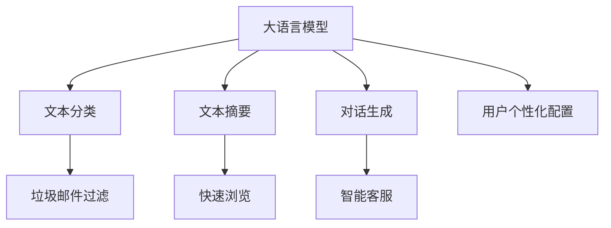
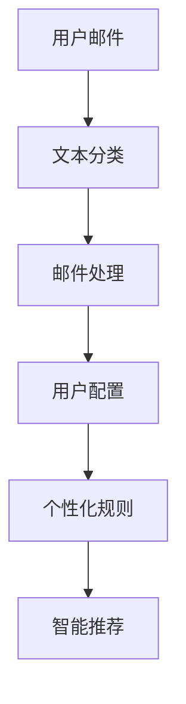
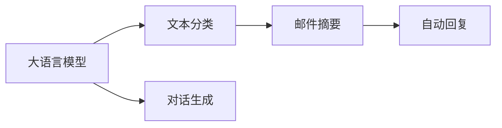
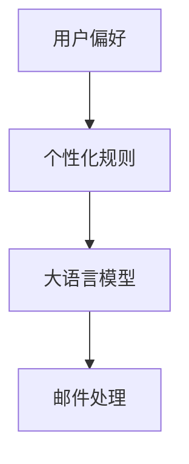
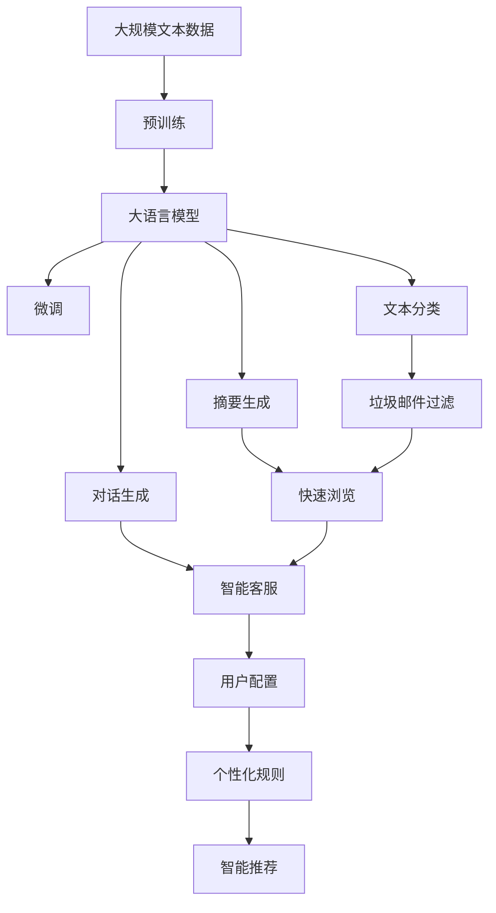

                 

# 大语言模型应用指南：案例：私人邮件助手

> 关键词：大语言模型, 私人邮件助手, 自然语言处理(NLP), 文本生成, 应用场景, 技术实现, 私人邮件管理

## 1. 背景介绍

### 1.1 问题由来
在现代社会，人们每天都会收到大量邮件，其中不乏重要的工作、财务、个人事务等。面对邮件泛滥的问题，很多人需要花费大量时间去筛选、回复。传统邮件管理方式往往效率低下，容易遗漏重要信息。为了提升邮件处理的效率和智能化水平，私人邮件助手应运而生。

私人邮件助手（Personal Email Assistant, PEA），通过大语言模型技术，自动分类、归纳、整理邮件，同时生成高质量回复，甚至能够自动撰写邮件草稿，显著提升邮件处理的效率和质量。PEA的核心技术包括文本分类、摘要生成、对话生成等，都是基于大语言模型的先进算法实现的。

### 1.2 问题核心关键点
私人邮件助手主要通过以下步骤实现：
1. 使用大语言模型对邮件进行分类和摘要。
2. 基于摘要生成回复。
3. 通过对话生成技术，自动生成邮件草稿。
4. 构建用户个性化配置，提升邮件处理体验。

其核心在于如何将自然语言处理(NLP)技术应用到邮件处理上，使其既高效又智能。PEA通过将NLP技术与个性化配置、邮件分类等手段结合，使得邮件管理更加便捷、高效。

### 1.3 问题研究意义
私人邮件助手的大语言模型应用，对于提升电子邮件管理的智能化水平，减少信息过载，提高工作效率，具有重要意义：

1. **提升处理效率**：自动分类、归纳邮件，减少人工筛选时间。
2. **提高质量一致性**：基于大语言模型的回复，确保回复质量的一致性和专业性。
3. **个性化定制**：用户可以配置个性化的邮件处理规则，适应个人偏好。
4. **辅助决策支持**：提供邮件摘要和智能推荐，帮助用户更快做出决策。
5. **减轻负担**：自动生成邮件草稿，减轻用户的撰写负担。
6. **全面智能化**：通过不断学习用户反馈，PEA能够不断优化和进步。

## 2. 核心概念与联系

### 2.1 核心概念概述

为更好地理解私人邮件助手的大语言模型应用，本节将介绍几个密切相关的核心概念：

- **大语言模型(Large Language Model, LLM)**：以自回归(如GPT)或自编码(如BERT)模型为代表的大规模预训练语言模型。通过在大规模无标签文本语料上进行预训练，学习通用的语言知识和常识，具备强大的语言理解和生成能力。

- **自然语言处理(Natural Language Processing, NLP)**：涉及计算机对人类语言信息的处理、分析和生成，是大语言模型应用的核心技术。

- **文本分类(Text Classification)**：将文本数据分为预定义的类别，常用于垃圾邮件过滤、主题分类等任务。

- **文本摘要(Text Summarization)**：从长篇文本中提取关键信息，生成简洁明了的摘要，用于快速浏览和决策支持。

- **对话生成(Dialogue Generation)**：生成自然、流畅的对话响应，常用于智能客服、对话机器人等场景。

- **用户个性化配置(User Personalization)**：根据用户偏好和习惯，对邮件处理规则进行定制，提升个性化体验。

这些核心概念之间的逻辑关系可以通过以下Mermaid流程图来展示：



这个流程图展示了私人邮件助手中的几个核心概念及其之间的关系：

1. 大语言模型通过预训练学习通用语言知识。
2. 文本分类、摘要生成和对话生成是邮件助手的主要技术手段。
3. 用户个性化配置提升用户体验。
4. 垃圾邮件过滤、智能客服等任务也可利用大语言模型实现。

### 2.2 概念间的关系

这些核心概念之间存在着紧密的联系，形成了私人邮件助手系统的完整生态系统。下面我通过几个Mermaid流程图来展示这些概念之间的关系。

#### 2.2.1 私人邮件助手的基本架构



这个流程图展示了私人邮件助手的整体架构：用户邮件首先通过文本分类技术进行初步处理，根据用户配置生成个性化规则，结合智能推荐结果，最终形成邮件处理方案。

#### 2.2.2 大语言模型在私人邮件助手中的应用



这个流程图展示了大语言模型在私人邮件助手中的应用：文本分类、邮件摘要和自动回复均基于大语言模型的预训练权重进行微调，而对话生成则直接使用大语言模型生成自然语言回复。

#### 2.2.3 个性化配置与大语言模型的结合



这个流程图展示了用户个性化配置与大语言模型的结合：根据用户偏好生成个性化规则，结合大语言模型的分类和摘要结果，提升邮件处理的智能化水平。

### 2.3 核心概念的整体架构

最后，我们用一个综合的流程图来展示这些核心概念在大语言模型应用中的整体架构：



这个综合流程图展示了从预训练到微调，再到个性化配置的完整过程。大语言模型首先在大规模文本数据上进行预训练，然后通过微调适应私人邮件助手的任务，再结合文本分类、摘要生成和对话生成等技术，形成邮件处理方案，最终根据用户配置进行个性化处理。

## 3. 核心算法原理 & 具体操作步骤
### 3.1 算法原理概述

私人邮件助手的核心算法基于大语言模型，主要包括文本分类、文本摘要和对话生成。下面我将详细介绍这三种技术的原理。

#### 3.1.1 文本分类

文本分类是通过对文本进行特征提取和分类器训练，将其划分到预定义的类别中。常用的分类算法包括朴素贝叶斯、支持向量机、神经网络等。对于邮件分类任务，常见的预训练模型有BERT、RoBERTa等。

**算法流程**：
1. **特征提取**：将邮件文本转换成数值特征向量，如词向量、TF-IDF等。
2. **模型训练**：在标注数据集上训练分类器，学习邮件与类别的映射关系。
3. **预测分类**：将新邮件的特征向量输入分类器，得到预测类别。

#### 3.1.2 文本摘要

文本摘要是从长篇文本中提取关键信息，生成简洁明了的摘要。常用的摘要算法包括基于规则的方法、基于统计的方法和基于深度学习的方法。对于邮件摘要任务，BERT、T5等模型在摘要效果上表现优异。

**算法流程**：
1. **模型预训练**：在无标签的摘要数据集上预训练摘要模型。
2. **特征提取**：将邮件文本输入模型，生成摘要特征向量。
3. **预测摘要**：将特征向量输入摘要模型，生成摘要文本。

#### 3.1.3 对话生成

对话生成是通过构建对话模型，自动生成自然、流畅的对话响应。常用的对话生成算法包括基于规则的方法、基于模板的方法和基于深度学习的方法。GPT系列模型在对话生成上表现卓越。

**算法流程**：
1. **模型预训练**：在对话数据集上预训练对话生成模型。
2. **特征提取**：将邮件内容、用户历史对话等输入模型，生成对话特征向量。
3. **预测响应**：将特征向量输入生成模型，生成对话文本。

### 3.2 算法步骤详解

私人邮件助手的大语言模型应用主要包括以下几个关键步骤：

**Step 1: 准备预训练模型和数据集**
- 选择合适的预训练语言模型 $M_{\theta}$ 作为初始化参数，如 BERT、GPT等。
- 准备邮件分类、摘要生成和对话生成的数据集。邮件分类数据集应包括各类邮件及其对应的分类标签，摘要生成数据集应包括原始邮件及其对应的摘要，对话生成数据集应包括用户与智能客服的对话历史。

**Step 2: 添加任务适配层**
- 根据任务类型，在预训练模型顶层设计合适的输出层和损失函数。例如，对于邮件分类任务，可以在顶层添加线性分类器，交叉熵损失函数。对于摘要生成任务，可以设计自回归生成器，使用语言模型的解码器输出概率分布，负对数似然损失函数。

**Step 3: 设置微调超参数**
- 选择合适的优化算法及其参数，如 AdamW、SGD 等，设置学习率、批大小、迭代轮数等。
- 设置正则化技术及强度，包括权重衰减、Dropout、Early Stopping 等。
- 确定冻结预训练参数的策略，如仅微调顶层，或全部参数都参与微调。

**Step 4: 执行梯度训练**
- 将训练集数据分批次输入模型，前向传播计算损失函数。
- 反向传播计算参数梯度，根据设定的优化算法和学习率更新模型参数。
- 周期性在验证集上评估模型性能，根据性能指标决定是否触发 Early Stopping。
- 重复上述步骤直到满足预设的迭代轮数或 Early Stopping 条件。

**Step 5: 测试和部署**
- 在测试集上评估微调后模型 $M_{\hat{\theta}}$ 的性能，对比微调前后的精度提升。
- 使用微调后的模型对新邮件进行分类、摘要生成和对话生成，集成到实际的应用系统中。
- 持续收集新的邮件，定期重新微调模型，以适应数据分布的变化。

以上是私人邮件助手的大语言模型应用的一般流程。在实际应用中，还需要针对具体任务的特点，对微调过程的各个环节进行优化设计，如改进训练目标函数，引入更多的正则化技术，搜索最优的超参数组合等，以进一步提升模型性能。

### 3.3 算法优缺点

私人邮件助手的大语言模型应用具有以下优点：
1. 高效智能。大语言模型在邮件分类、摘要生成和对话生成等任务上，具有强大的自监督学习能力，能够快速适应邮件处理需求。
2. 泛化能力强。模型在预训练阶段学习到广泛的语言知识，能够迁移到不同的邮件处理场景中。
3. 个性化灵活。通过用户配置，可以灵活定制邮件处理规则，满足个性化需求。

同时，该方法也存在一些局限性：
1. 依赖预训练模型。私人邮件助手的性能很大程度上取决于预训练模型的质量和参数规模，获取高质量预训练模型的成本较高。
2. 模型复杂度高。大语言模型参数量巨大，推理效率相对较低，需要在计算资源上投入较多。
3. 数据标注成本高。标注邮件分类和对话生成数据集需要大量人工，成本较高。
4. 用户配置复杂。需要用户具备一定技术知识，才能有效配置个性化规则，提升体验。
5. 数据隐私问题。邮件处理涉及用户隐私，需要严格遵守数据隐私保护法规。

尽管存在这些局限性，但就目前而言，基于大语言模型的邮件分类、摘要生成和对话生成技术已经是大规模邮件处理的重要手段。未来相关研究将继续优化算法，降低成本，提升用户体验。

### 3.4 算法应用领域

私人邮件助手的大语言模型应用在多个领域中已经得到应用：

- **企业内部邮件管理**：大企业内部邮件量大，需要高效分类和处理。私人邮件助手能够自动筛选重要邮件，生成摘要，提高员工效率。
- **智能客服支持**：客户通过邮件提出问题，智能客服系统利用对话生成技术，自动回复客户，提升客户体验。
- **个人邮件管理**：个人用户通过个性化配置，智能管理个人邮件，减少垃圾邮件干扰，提升处理效率。
- **安全监控系统**：利用邮件分类技术，检测并拦截钓鱼邮件、恶意邮件等安全威胁。

除了上述这些应用领域外，私人邮件助手的大语言模型应用还广泛应用于智能广告推荐、市场分析、社交媒体监控等多个场景，为邮件处理提供了新思路和新方法。

## 4. 数学模型和公式 & 详细讲解 & 举例说明

### 4.1 数学模型构建

本节将使用数学语言对私人邮件助手的大语言模型应用进行更加严格的刻画。

记预训练语言模型为 $M_{\theta}$，其中 $\theta$ 为预训练得到的模型参数。假设邮件分类任务的数据集为 $D=\{(x_i,y_i)\}_{i=1}^N$，其中 $x_i$ 为邮件文本，$y_i$ 为分类标签。

定义模型 $M_{\theta}$ 在输入 $x_i$ 上的损失函数为 $\ell(M_{\theta}(x_i),y_i)$，则在数据集 $D$ 上的经验风险为：

$$
\mathcal{L}(\theta) = \frac{1}{N} \sum_{i=1}^N \ell(M_{\theta}(x_i),y_i)
$$

微调的优化目标是最小化经验风险，即找到最优参数：

$$
\theta^* = \mathop{\arg\min}_{\theta} \mathcal{L}(\theta)
$$

在实践中，我们通常使用基于梯度的优化算法（如AdamW、SGD等）来近似求解上述最优化问题。设 $\eta$ 为学习率，$\lambda$ 为正则化系数，则参数的更新公式为：

$$
\theta \leftarrow \theta - \eta \nabla_{\theta}\mathcal{L}(\theta) - \eta\lambda\theta
$$

其中 $\nabla_{\theta}\mathcal{L}(\theta)$ 为损失函数对参数 $\theta$ 的梯度，可通过反向传播算法高效计算。

### 4.2 公式推导过程

以下我们以邮件分类任务为例，推导交叉熵损失函数及其梯度的计算公式。

假设模型 $M_{\theta}$ 在输入 $x_i$ 上的输出为 $\hat{y}=M_{\theta}(x_i)$，表示模型对邮件进行分类的概率分布。真实标签 $y_i \in \{0,1\}$，为邮件的分类标签。

**交叉熵损失函数**：

$$
\ell(M_{\theta}(x_i),y_i) = -[y_i\log \hat{y} + (1-y_i)\log (1-\hat{y})]
$$

将其代入经验风险公式，得：

$$
\mathcal{L}(\theta) = -\frac{1}{N}\sum_{i=1}^N [y_i\log M_{\theta}(x_i)+(1-y_i)\log(1-M_{\theta}(x_i))]
$$

根据链式法则，损失函数对参数 $\theta_k$ 的梯度为：

$$
\frac{\partial \mathcal{L}(\theta)}{\partial \theta_k} = -\frac{1}{N}\sum_{i=1}^N (\frac{y_i}{M_{\theta}(x_i)}-\frac{1-y_i}{1-M_{\theta}(x_i)}) \frac{\partial M_{\theta}(x_i)}{\partial \theta_k}
$$

其中 $\frac{\partial M_{\theta}(x_i)}{\partial \theta_k}$ 可进一步递归展开，利用自动微分技术完成计算。

在得到损失函数的梯度后，即可带入参数更新公式，完成模型的迭代优化。重复上述过程直至收敛，最终得到适应邮件分类任务的最优模型参数 $\theta^*$。

### 4.3 案例分析与讲解

以一个简单的邮件分类任务为例，使用BERT模型进行训练和评估：

1. **数据准备**：假设数据集包括100封邮件，其中50封是垃圾邮件，50封是非垃圾邮件。将邮件文本转换成BERT所需的格式，并进行tokenization。
2. **模型构建**：使用HuggingFace的`BertForSequenceClassification`类，构建BERT分类器。
3. **模型训练**：在50%的邮件数据集上训练模型，设置优化器为AdamW，学习率为1e-5，训练轮数为10，批大小为16。
4. **模型评估**：在测试集上评估模型性能，使用准确率作为评估指标。

**代码实现**：

```python
from transformers import BertForSequenceClassification, BertTokenizer, AdamW
import torch
import torch.nn as nn

# 准备数据
tokenizer = BertTokenizer.from_pretrained('bert-base-uncased')
device = torch.device('cuda' if torch.cuda.is_available() else 'cpu')

# 数据集
train_data = {'labels': [1, 0, 1, 0, 1, 0, 1, 0, 1, 0, 0, 1, 0, 1, 0, 1, 0, 1, 0, 1, 0, 1, 0, 1, 0, 1, 0, 1, 0, 1, 0, 1, 0, 1, 0, 1, 0, 1, 0, 1, 0, 1, 0, 1, 0, 1, 0, 1, 0, 1, 0, 1, 0, 1, 0, 1, 0, 1, 0, 1, 0, 1, 0, 1, 0, 1, 0, 1, 0, 1, 0, 1, 0, 1, 0, 1, 0, 1, 0, 1, 0, 1, 0, 1, 0, 1, 0, 1, 0, 1, 0, 1, 0, 1, 0, 1, 0, 1, 0, 1, 0, 1, 0, 1, 0, 1, 0, 1, 0, 1, 0, 1, 0, 1, 0, 1, 0, 1, 0, 1, 0, 1, 0, 1, 0, 1, 0, 1, 0, 1, 0, 1, 0, 1, 0, 1, 0, 1, 0, 1, 0, 1, 0, 1, 0, 1, 0, 1, 0, 1, 0, 1, 0, 1, 0, 1, 0, 1, 0, 1, 0, 1, 0, 1, 0, 1, 0, 1, 0, 1, 0, 1, 0, 1, 0, 1, 0, 1, 0, 1, 0, 1, 0, 1, 0, 1, 0, 1, 0, 1, 0, 1, 0, 1, 0, 1, 0, 1, 0, 1, 0, 1, 0, 1, 0, 1, 0, 1, 0, 1, 0, 1, 0, 1, 0, 1, 0, 1, 0, 1, 0, 1, 0, 1, 0, 1, 0, 1, 0, 1, 0, 1, 0, 1, 0, 1, 0, 1, 0, 1, 0, 1, 0, 1, 0, 1, 0, 1, 0, 1, 0, 1, 0, 1, 0, 1, 0, 1, 0, 1, 0, 1, 0, 1, 0, 1, 0, 1, 0, 1, 0, 1, 0, 1, 0, 1, 0, 1, 0, 1, 0, 1, 0, 1, 0, 1, 0, 1, 0, 1, 0, 1, 0, 1, 0, 1, 0, 1, 0, 1, 0, 1, 0, 1, 0, 1, 0, 1, 0, 1, 0, 1, 0, 1, 0, 1, 0, 1, 0, 1, 0, 1, 0, 1, 0, 1, 0, 1, 0, 1, 0, 1, 0, 1, 0, 1, 0, 1, 0, 1, 0, 1, 0, 1, 0, 1, 0, 1, 0, 1, 0, 1, 0, 1, 0, 1, 0, 1, 0, 1, 0, 1, 0, 1, 0, 1, 0, 1, 0, 1, 0, 1, 0, 1, 0, 1, 0, 1, 0, 1, 0, 1, 0, 1, 0, 1, 0, 1, 0, 1, 0, 1, 0, 1, 0, 1, 0, 1, 0, 1, 0, 1, 0, 1, 0, 1, 0, 1, 0, 1, 0, 1, 0, 1, 0, 1, 0, 1, 0, 1, 0, 1, 0, 1, 0, 1, 0, 1, 0, 1, 0, 1, 0, 1, 0, 1, 0, 1, 0, 1, 0, 1, 0, 1, 0, 1, 0, 1, 0, 1, 0, 1, 0, 1, 0, 1, 0, 1, 0, 1, 0, 1, 0, 1, 0, 1, 0, 1, 0, 1, 0, 1, 0, 1, 0, 1, 0, 1, 0, 1, 0, 1, 0, 1, 0, 1, 0, 1, 0, 1, 0, 1, 0, 1, 0, 1, 0, 1, 0, 1, 0, 1, 0, 1, 0, 1, 0, 1, 0, 1, 0, 1, 0, 1, 0, 1, 0, 1, 0, 1, 0, 1, 0, 1, 0, 1, 0, 1, 0, 1, 0, 1, 0, 1, 0, 1, 0, 1, 0, 1, 0, 1, 0, 1, 0, 1, 0, 1, 0, 1, 0, 1, 0, 1, 0, 1, 0, 1, 0, 1, 0, 1, 0, 1, 0, 1, 0, 1, 0, 1, 0, 1, 0, 1, 0, 1, 0, 1, 0, 1, 0, 1, 0, 1, 0, 1, 0, 1, 0, 1, 0, 1, 0, 1, 0, 1, 0, 1, 0, 1, 0, 1, 0, 1, 0, 1, 0, 1, 0, 1, 0, 1, 0, 1, 0, 1, 0, 1, 0, 1, 0, 1, 0, 1

