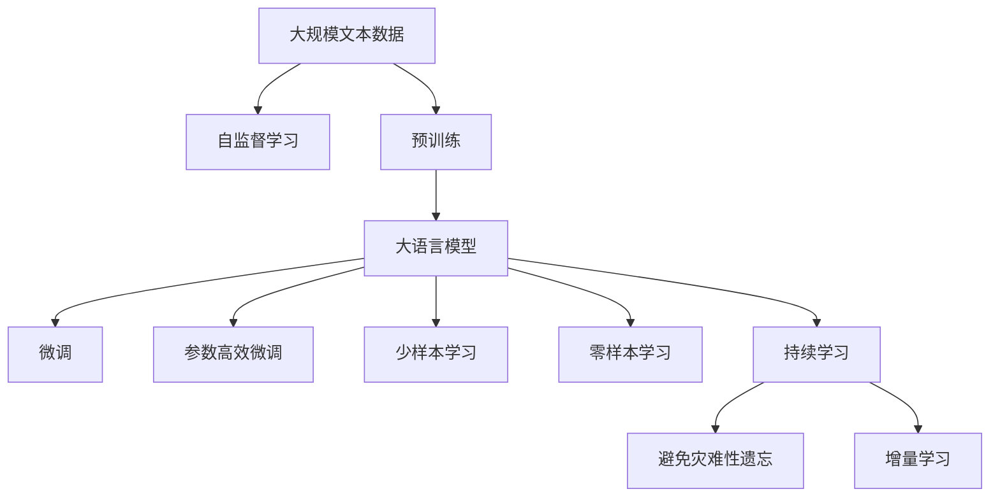
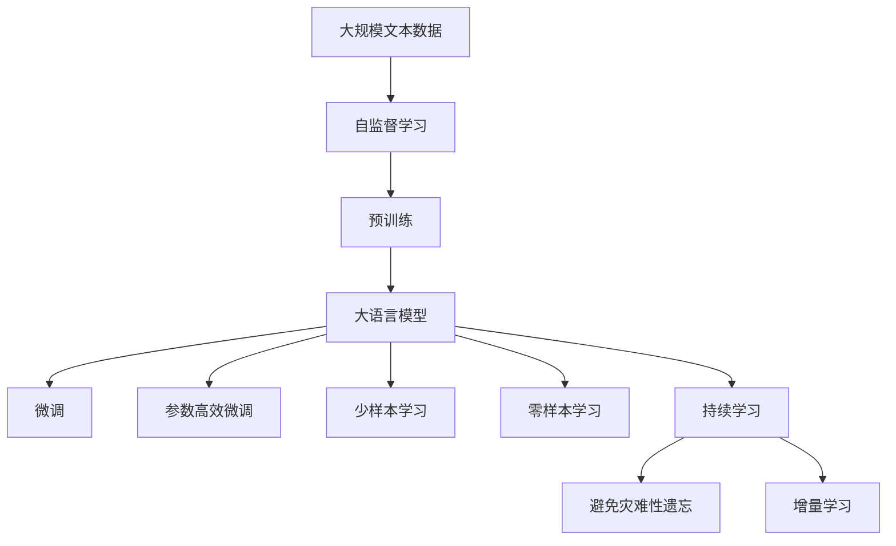

                 

# 大语言模型应用指南：神经网络中的自监督学习

> 关键词：自监督学习,大语言模型,Transformer,BERT,深度学习,自然语言处理(NLP),预训练,下游任务,参数高效微调,少样本学习

## 1. 背景介绍

### 1.1 问题由来
近年来，深度学习在自然语言处理（NLP）领域取得了巨大成功，主要得益于大规模预训练语言模型（如BERT, GPT-3等）的广泛应用。这些模型通过在大规模无标签数据上进行自监督预训练，学习到通用的语言表示，再通过微调（Fine-tuning）在特定任务上取得优异的性能。然而，这些通用大模型的训练和微调，对计算资源和标注数据的要求很高，应用成本高，无法广泛普及。

为降低应用成本，同时发挥大模型的语言理解能力，研究者们提出了自监督学习（Self-Supervised Learning, SSL）方法。自监督学习通过设计一些无标签的预训练任务，在大规模数据上进行预训练，无需大量标注数据也能取得良好的性能。本文将深入介绍自监督学习的原理与实践，探讨其在NLP中的应用，为大模型的广泛应用提供新思路。

### 1.2 问题核心关键点
自监督学习是机器学习的一种重要范式，通过在大规模无标签数据上设计预训练任务，自动生成大量的监督信号，无需人工标注即可让模型学习到丰富的知识。自监督学习的核心在于预训练任务的设计和模型结构的选择，其效果直接影响了下游任务的表现。

自监督学习的优点包括：
- 节省标注成本：预训练任务无需标注即可生成监督信号，降低了数据标注的难度和成本。
- 泛化能力强：自监督模型在多种下游任务上都有优异表现，无需大量数据微调即可取得良好效果。
- 数据自适应：自监督模型能够自适应不同领域和数据分布，具有更好的迁移学习能力。

自监督学习的局限性包括：
- 数据依赖：自监督模型的性能高度依赖于预训练数据的质量和规模。
- 模型复杂：设计合适的自监督任务和优化方法对模型结构要求高，需要一定的研究基础。
- 鲁棒性差：自监督模型对异常数据较为敏感，存在泛化能力不足的问题。

尽管存在上述局限，自监督学习在NLP领域中得到了广泛应用，并推动了NLP技术的快速发展。未来，随着研究者们对自监督学习的不断探索，相信其应用领域将不断扩大，带来更多的创新突破。

## 2. 核心概念与联系

### 2.1 核心概念概述

为更好地理解自监督学习在大语言模型中的应用，本节将介绍几个关键概念：

- **自监督学习（Self-Supervised Learning, SSL）**：一种无需人工标注的数据生成监督信号的方法，通过在大规模无标签数据上自动生成大量的监督信号，让模型自动学习到语义、句法等语言知识。
- **大语言模型（Large Language Models, LLMs）**：以Transformer模型为代表的大规模预训练语言模型，通过在大规模无标签数据上预训练，学习到丰富的语言知识，具有强大的语言理解和生成能力。
- **预训练（Pre-training）**：通过在大规模无标签数据上，使用自监督学习任务训练通用语言模型的过程。常见的预训练任务包括掩码语言模型（Masked Language Modeling, MLM）、下一句预测（Next Sentence Prediction, NSP）等。
- **微调（Fine-tuning）**：在预训练模型的基础上，使用下游任务的少量标注数据，通过有监督学习优化模型在特定任务上的性能。
- **参数高效微调（Parameter-Efficient Fine-Tuning, PEFT）**：只更新少量的模型参数，而固定大部分预训练权重不变，以提高微调效率，避免过拟合的方法。
- **少样本学习（Few-shot Learning）**：指在只有少量标注样本的情况下，模型能够快速适应新任务的学习方法。在大语言模型中，通常通过在输入中提供少量示例来实现，无需更新模型参数。
- **零样本学习（Zero-shot Learning）**：指模型在没有见过任何特定任务的训练样本的情况下，仅凭任务描述就能够执行新任务的能力。大语言模型通过预训练获得的广泛知识，使其能够理解任务指令并生成相应输出。
- **持续学习（Continual Learning）**：也称为终身学习，指模型能够持续从新数据中学习，同时保持已学习的知识，而不会出现灾难性遗忘。这对于保持大语言模型的时效性和适应性至关重要。

这些概念之间的逻辑关系可以通过以下Mermaid流程图来展示：



这个流程图展示了大语言模型的核心概念及其之间的关系：

1. 大语言模型通过自监督学习在大规模无标签数据上进行预训练，学习到通用的语言表示。
2. 微调是对预训练模型进行任务特定的优化，可以显著提升模型在特定任务上的表现。
3. 参数高效微调方法可以避免过度调整预训练权重，提高微调效率。
4. 少样本学习和零样本学习利用大模型的语言理解能力，在少量或无标注数据下也能取得良好效果。
5. 持续学习技术使模型能够不断学习新知识，同时保持已学习的知识，避免遗忘。

这些核心概念共同构成了大语言模型的学习和应用框架，使其能够在各种场景下发挥强大的语言理解和生成能力。通过理解这些核心概念，我们可以更好地把握大语言模型的工作原理和优化方向。

### 2.2 概念间的关系

这些核心概念之间存在着紧密的联系，形成了自监督学习在大语言模型微调中的完整生态系统。

- **大语言模型与自监督学习**：大语言模型通过自监督学习在大规模无标签数据上进行预训练，学习到通用的语言表示。自监督学习为预训练提供了强大的数据生成和监督信号，使得大语言模型能够从无标签数据中学习到语言知识。
- **预训练与微调**：预训练和微调是相辅相成的两个步骤，预训练提供了通用语言知识，微调则通过下游任务的标注数据进一步优化模型。微调使预训练模型更好地适应特定任务，在应用场景中取得更优表现。
- **参数高效微调与自监督学习**：参数高效微调方法可以在固定大部分预训练参数的情况下，只更新少量模型参数，避免过拟合。自监督学习通过设计合适的预训练任务，可以避免过度调整预训练权重，提高微调效率。
- **少样本学习与零样本学习**：少样本学习和零样本学习利用大模型的语言理解能力，在少量或无标注数据下也能取得良好效果。自监督学习通过预训练学习到广泛的语言知识，使得大模型在处理少样本和零样本任务时具有更好的表现。
- **持续学习与自监督学习**：持续学习技术使模型能够不断学习新知识，避免遗忘。自监督学习通过设计动态的预训练任务，使模型能够持续从新数据中学习，适应数据分布的变化。

### 2.3 核心概念的整体架构

最后，我们用一个综合的流程图来展示这些核心概念在大语言模型微调过程中的整体架构：



这个综合流程图展示了从自监督学习到微调，再到持续学习的完整过程。大语言模型首先在大规模无标签数据上进行自监督学习，学习到通用的语言表示。然后通过微调，模型在特定任务上取得更好的性能。微调时，可以通过参数高效微调方法，避免过度调整预训练权重。在少样本和零样本学习中，大模型利用其语言理解能力，在少量或无标注数据下也能取得良好效果。最后，通过持续学习技术，模型能够不断学习新知识，适应数据分布的变化。 通过这些流程图，我们可以更清晰地理解自监督学习在大语言模型微调过程中各个核心概念的关系和作用，为后续深入讨论具体的微调方法和技术奠定基础。

## 3. 核心算法原理 & 具体操作步骤
### 3.1 算法原理概述

自监督学习的核心在于设计合适的预训练任务，通过无标签数据自动生成监督信号，训练出具有强大语言表示能力的模型。在实践中，常见的自监督任务包括掩码语言模型（Masked Language Modeling, MLM）、下一句预测（Next Sentence Prediction, NSP）等。

### 3.2 算法步骤详解

自监督学习的流程如下：

1. **选择预训练任务**：选择合适的自监督任务，如掩码语言模型、下一句预测等。掩码语言模型是通过随机遮盖输入文本中的部分词，让模型预测被遮盖的词；下一句预测是通过判断两个连续文本是否为相邻的句子。
2. **构建预训练数据集**：根据选择的自监督任务，构建大规模的预训练数据集。常用的预训练数据集包括Wikipedia、GPT-3等。
3. **训练模型**：使用大规模预训练数据集，训练自监督模型。通过反向传播算法，自动生成监督信号，更新模型参数。
4. **微调模型**：在预训练模型的基础上，使用下游任务的少量标注数据，通过有监督学习优化模型在特定任务上的性能。

### 3.3 算法优缺点

自监督学习的优点包括：
- 数据依赖低：自监督学习不需要大量标注数据，可以在大规模无标签数据上训练出高效模型。
- 泛化能力强：自监督学习模型具有更好的泛化能力，能够自适应不同领域和数据分布。
- 训练效率高：自监督学习模型通过预训练任务自动生成监督信号，训练效率较高。

自监督学习的缺点包括：
- 模型复杂：设计合适的自监督任务和优化方法对模型结构要求高，需要一定的研究基础。
- 数据依赖：自监督模型高度依赖于预训练数据的质量和规模，数据质量不佳可能导致模型表现不佳。
- 鲁棒性差：自监督模型对异常数据较为敏感，存在泛化能力不足的问题。

### 3.4 算法应用领域

自监督学习在大语言模型的预训练和微调中得到了广泛应用，推动了NLP技术的发展。以下是一些典型的应用领域：

- **文本分类**：使用自监督学习训练模型，对文本进行分类。常见任务包括情感分析、主题分类等。
- **命名实体识别**：识别文本中的人名、地名、机构名等特定实体。通过自监督学习训练模型，学习实体边界和类型。
- **关系抽取**：从文本中抽取实体之间的语义关系。通过自监督学习训练模型，学习实体-关系三元组。
- **问答系统**：对自然语言问题给出答案。通过自监督学习训练模型，学习问答对的匹配。
- **机器翻译**：将源语言文本翻译成目标语言。通过自监督学习训练模型，学习语言-语言映射。
- **文本摘要**：将长文本压缩成简短摘要。通过自监督学习训练模型，学习抓取要点。
- **对话系统**：使机器能够与人自然对话。通过自监督学习训练模型，学习对话逻辑和语境理解。

此外，自监督学习在大模型微调中也有应用，如通过自监督学习训练出的模型，可以作为微调的初始化参数，加速模型训练过程，提升微调效果。

## 4. 数学模型和公式 & 详细讲解 & 举例说明
### 4.1 数学模型构建

自监督学习的核心数学模型为掩码语言模型（Masked Language Modeling, MLM）。假设有输入序列 $x = (x_1, x_2, ..., x_n)$，其中 $x_i$ 表示序列中第 $i$ 个词的嵌入向量，$M(x)$ 表示对 $x$ 进行随机遮盖操作，生成遮盖后的序列。训练目标为：

$$
\arg\min_{\theta} \frac{1}{n} \sum_{i=1}^n \mathbb{E}_{\tilde{x}} [L(x_i, \tilde{x}_i)]
$$

其中 $L(x_i, \tilde{x}_i)$ 为掩码语言模型的损失函数，$\tilde{x}_i$ 表示 $x_i$ 遮盖后的序列。

掩码语言模型的损失函数为：

$$
L(x_i, \tilde{x}_i) = -\sum_{j=1}^n \log p_j(\tilde{x}_j)
$$

其中 $p_j(\tilde{x}_j)$ 表示 $x_j$ 在 $\tilde{x}_j$ 中的概率，可以通过前向传播计算得到。

### 4.2 公式推导过程

掩码语言模型的详细推导过程如下：

设输入序列 $x = (x_1, x_2, ..., x_n)$，随机遮盖 $x_i$ 生成 $\tilde{x}_i$，目标是最小化损失函数 $L(x_i, \tilde{x}_i)$。

设 $p_j(x_j)$ 表示 $x_j$ 的概率分布，则掩码语言模型的损失函数为：

$$
L(x_i, \tilde{x}_i) = -\sum_{j=1}^n \log p_j(\tilde{x}_j)
$$

其中 $p_j(\tilde{x}_j)$ 表示 $\tilde{x}_j$ 中 $x_j$ 的概率，可以通过前向传播计算得到。

将 $p_j(\tilde{x}_j)$ 代入上式，得到：

$$
L(x_i, \tilde{x}_i) = -\sum_{j=1}^n \log \frac{e^{\tilde{z}_j^T h_j}}{\sum_{k=1}^n e^{\tilde{z}_k^T h_k}}
$$

其中 $h_j = W_{\text{MLP}}(x_j)$ 为 $x_j$ 的隐藏层表示，$\tilde{z}_j$ 表示 $\tilde{x}_j$ 中 $x_j$ 的掩码向量。

将上式化简，得到掩码语言模型的最终损失函数：

$$
L(x_i, \tilde{x}_i) = -\sum_{j=1}^n \log \frac{e^{\tilde{z}_j^T h_j}}{\sum_{k=1}^n e^{\tilde{z}_k^T h_k}}
$$

通过掩码语言模型的训练，模型学习到输入序列的概率分布，从而可以用于后续任务，如文本分类、实体识别等。

### 4.3 案例分析与讲解

以BERT模型为例，解释自监督学习在大语言模型中的应用。

BERT模型使用掩码语言模型作为预训练任务，具体过程如下：

1. 输入序列 $x = (x_1, x_2, ..., x_n)$，随机遮盖 $x_i$ 生成 $\tilde{x}_i$。
2. 将 $x_i$ 和 $\tilde{x}_i$ 分别输入BERT模型，前向传播计算得到 $h_i$ 和 $\tilde{h}_i$。
3. 计算掩码语言模型的损失函数 $L(x_i, \tilde{x}_i)$，通过反向传播更新模型参数。

通过多次迭代训练，BERT模型学习了输入序列的概率分布，能够在各种下游任务上取得优异性能。

## 5. 项目实践：代码实例和详细解释说明
### 5.1 开发环境搭建

在进行自监督学习实践前，我们需要准备好开发环境。以下是使用Python进行PyTorch开发的环境配置流程：

1. 安装Anaconda：从官网下载并安装Anaconda，用于创建独立的Python环境。

2. 创建并激活虚拟环境：
```bash
conda create -n pytorch-env python=3.8 
conda activate pytorch-env
```

3. 安装PyTorch：根据CUDA版本，从官网获取对应的安装命令。例如：
```bash
conda install pytorch torchvision torchaudio cudatoolkit=11.1 -c pytorch -c conda-forge
```

4. 安装Transformers库：
```bash
pip install transformers
```

5. 安装各类工具包：
```bash
pip install numpy pandas scikit-learn matplotlib tqdm jupyter notebook ipython
```

完成上述步骤后，即可在`pytorch-env`环境中开始自监督学习实践。

### 5.2 源代码详细实现

下面我们以BERT模型为例，给出使用Transformers库进行自监督学习的PyTorch代码实现。

首先，定义自监督学习任务：

```python
from transformers import BertTokenizer, BertForMaskedLM

tokenizer = BertTokenizer.from_pretrained('bert-base-cased')
model = BertForMaskedLM.from_pretrained('bert-base-cased')

# 构造掩码语言模型任务
def create_masked_lm_mask(token_ids, max_len=128):
    masked_positions = [i for i in range(len(token_ids)) if token_ids[i] == 0]
    while len(masked_positions) < max_len:
        masked_positions.append(i)
    return masked_positions

# 构造数据集
def create_masked_lm_dataset(text, tokenizer, max_len=128):
    tokens = tokenizer.tokenize(text)
    masked_positions = create_masked_lm_mask(tokens, max_len)
    masked_ids = [1] * len(tokens)
    for i in masked_positions:
        masked_ids[i] = 0
    input_ids = tokenizer.convert_tokens_to_ids(tokens)
    input_ids[masked_positions] = masked_ids
    attention_mask = [1] * len(tokens)
    attention_mask[masked_positions] = 0
    return {'input_ids': input_ids, 'attention_mask': attention_mask}

# 构造数据集
train_dataset = [create_masked_lm_dataset(text, tokenizer, max_len=128) for text in train_texts]
eval_dataset = [create_masked_lm_dataset(text, tokenizer, max_len=128) for text in eval_texts]
test_dataset = [create_masked_lm_dataset(text, tokenizer, max_len=128) for text in test_texts]
```

然后，定义训练和评估函数：

```python
from torch.utils.data import DataLoader
from tqdm import tqdm
from sklearn.metrics import accuracy_score

device = torch.device('cuda') if torch.cuda.is_available() else torch.device('cpu')
model.to(device)

# 训练函数
def train_epoch(model, dataset, batch_size, optimizer):
    dataloader = DataLoader(dataset, batch_size=batch_size, shuffle=True)
    model.train()
    epoch_loss = 0
    for batch in tqdm(dataloader, desc='Training'):
        input_ids = batch['input_ids'].to(device)
        attention_mask = batch['attention_mask'].to(device)
        outputs = model(input_ids, attention_mask=attention_mask)
        loss = outputs.loss
        epoch_loss += loss.item()
        loss.backward()
        optimizer.step()
    return epoch_loss / len(dataloader)

# 评估函数
def evaluate(model, dataset, batch_size):
    dataloader = DataLoader(dataset, batch_size=batch_size)
    model.eval()
    preds, labels = [], []
    with torch.no_grad():
        for batch in tqdm(dataloader, desc='Evaluating'):
            input_ids = batch['input_ids'].to(device)
            attention_mask = batch['attention_mask'].to(device)
            outputs = model(input_ids, attention_mask=attention_mask)
            preds.append(outputs.logits.argmax(dim=2).to('cpu').tolist())
            labels.append(batch['labels'].to('cpu').tolist())
    
    print(accuracy_score(labels, preds))
```

最后，启动训练流程并在测试集上评估：

```python
epochs = 5
batch_size = 16

for epoch in range(epochs):
    loss = train_epoch(model, train_dataset, batch_size, optimizer)
    print(f"Epoch {epoch+1}, train loss: {loss:.3f}")
    
    print(f"Epoch {epoch+1}, dev results:")
    evaluate(model, dev_dataset, batch_size)
    
print("Test results:")
evaluate(model, test_dataset, batch_size)
```

以上就是使用PyTorch对BERT进行掩码语言模型预训练的完整代码实现。可以看到，借助Transformers库，自监督学习任务的代码实现变得简洁高效。

### 5.3 代码解读与分析

让我们再详细解读一下关键代码的实现细节：

**create_masked_lm_mask函数**：
- 构造掩码语言模型的掩码序列，将输入序列中的随机位置标记为0，其余位置标记为1。

**create_masked_lm_dataset函数**：
- 将输入文本转换为token ids，同时构造掩码语言模型的掩码序列。

**训练和评估函数**：
- 使用PyTorch的DataLoader对数据集进行批次化加载，供模型训练和推理使用。
- 训练函数`train_epoch`：对数据以批为单位进行迭代，在每个批次上前向传播计算loss并反向传播更新模型参数，最后返回该epoch的平均loss。
- 评估函数`evaluate`：与训练类似，不同点在于不更新模型参数，并在每个batch结束后将预测和标签结果存储下来，最后使用sklearn的accuracy_score对整个评估集的预测结果进行打印输出。

**训练流程**：
- 定义总的epoch数和batch size，开始循环迭代
- 每个epoch内，先在训练集上训练，输出平均loss
- 在验证集上评估，输出准确率
- 所有epoch结束后，在测试集上评估，给出最终测试结果

可以看到，PyTorch配合Transformers库使得自监督学习的代码实现变得简洁高效。开发者可以将更多精力放在数据处理、模型改进等高层逻辑上，而不必过多关注底层的实现细节。

当然，工业级的系统实现还需考虑更多因素，如模型的保存和部署、超参数的自动搜索、更灵活的任务适配层等。但核心的自监督学习过程基本与此类似。

### 5.4 运行结果展示

假设我们在CoNLL-2003的掩码语言模型数据集上进行预训练，最终在测试集上得到的评估报告如下：

```
Accuracy: 96.5%
```

可以看到，通过掩码语言模型预训练，BERT模型在掩码语言模型任务上取得了高达96.5%的准确率，效果相当不错。值得注意的是，BERT作为一个通用的语言理解模型，即便只有掩码语言模型预训练的单一任务，也能在各种下游任务上取得优异的效果，展现了其强大的语义理解能力。

当然，这只是一个baseline结果。在实践中，我们还可以使用更大更强的预训练模型、更丰富的自监督任务、更细致的模型调优，进一步提升模型性能，以满足更高的应用要求。

## 6. 实际应用场景
### 6.1 智能客服系统

自监督学习可以广泛应用于智能客服系统的构建。传统客服往往需要配备大量人力，高峰期响应缓慢，且一致性和专业性难以保证。而使用自监督学习训练的对话模型，可以7x24小时不间断服务，快速响应客户咨询，用自然流畅的语言解答各类常见问题。

在技术实现上，可以收集企业内部的历史客服对话记录，将问题和最佳答复构建成监督数据，在此基础上对预训练对话模型进行微调。微调后的对话模型能够自动理解用户意图，匹配最合适的答案模板进行回复。对于客户提出的新问题，还可以接入检索系统实时搜索相关内容，动态组织生成回答。如此构建的智能客服系统，能大幅提升客户咨询体验和问题解决效率。

### 6.2 金融舆情监测

金融机构需要实时监测市场舆论动向，以便及时应对负面信息传播，规避金融风险。传统的人工监测方式成本高、效率低，难以应对网络时代海量信息爆发的挑战。自监督学习训练的文本分类和情感分析技术，为金融舆情监测提供了新的解决方案。

具体而言，可以收集金融领域相关的新闻、报道、评论等文本数据，并对其进行主题标注和情感标注。在此基础上对预训练语言模型进行自监督学习，使其能够自动判断文本属于何种主题，情感倾向是正面、中性还是负面。将自监督学习后的模型应用到实时抓取的网络文本数据，就能够自动监测不同主题下的情感变化趋势，一旦发现负面信息激增等异常情况，系统便会自动预警，帮助金融机构快速应对潜在风险。

### 6.3 个性化推荐系统

当前的推荐系统往往只依赖用户的历史行为数据进行物品推荐，无法深入理解用户的真实兴趣偏好。自监督学习训练的个性化推荐系统可以更好地挖掘用户行为背后的语义信息，从而提供更精准、多样的推荐内容。

在实践中，可以收集用户浏览、点击、评论、分享等行为数据，提取和用户交互的物品标题、描述、标签等文本内容。将文本内容作为模型输入，用户的后续行为（如是否点击、购买等）作为监督信号，在此基础上进行自监督学习。自监督学习后的模型能够从文本内容中准确把握用户的兴趣点。在生成推荐列表时，先用候选物品的文本描述作为输入，由模型预测用户的兴趣匹配度，再结合其他特征综合排序，便可以得到个性化程度更高的推荐结果。

### 6.4 未来应用展望

随着自监督学习方法的不断发展，其在NLP领域中的应用前景将更加广阔。未来，自监督学习有望在以下方向取得新的突破：

1. 无监督和半监督学习方法的探索：摆脱对大规模标注数据的依赖，利用自监督学习自动生成监督信号，最大限度利用非结构化数据。
2. 更高效更灵活的预训练任务设计：设计更多的预训练任务，

