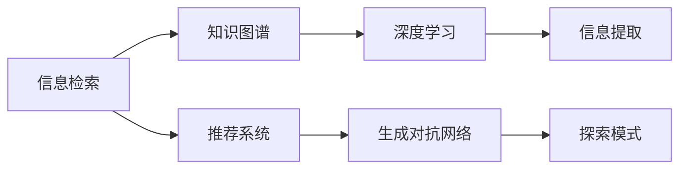

                 

## 1. 背景介绍

### 1.1 问题由来
好奇心与求知欲是推动人类文明进步的原动力。在信息爆炸的时代，如何有效地探索和学习新知识，成为了教育、科研、产业等领域亟待解决的问题。本文旨在探讨如何通过人工智能技术，激发和培养好奇心与求知欲，以驱动持续的学习和创新。

### 1.2 问题核心关键点
好奇心与求知欲的本质是信息获取和知识探索的过程。在人工智能领域，这一过程可以通过算法和技术的创新，实现对数据的自动化分析和信息的高效提取。利用人工智能技术，可以从大数据中发现隐藏的知识和模式，辅助人类进行深入研究，解决复杂问题。

### 1.3 问题研究意义
培养好奇心与求知欲，不仅是推动学术进步的关键，也是提升社会创新能力、促进经济发展的重要手段。通过人工智能技术，实现对数据的智能分析和自动化探索，可以在教育、科研、商业等多个领域产生深远影响。本文将深入探讨如何利用人工智能激发好奇心与求知欲，为不同领域的知识探索提供新思路。

## 2. 核心概念与联系

### 2.1 核心概念概述

好奇心与求知欲是人类探索未知世界、推动科技进步的核心驱动力。在人工智能领域，这一概念可以通过信息检索、知识图谱、推荐系统等多种技术手段实现。本文将围绕以下几个核心概念展开讨论：

- **信息检索**：从大规模数据中快速获取相关信息的过程。
- **知识图谱**：通过语义网络和关系图谱，组织和表示知识，辅助深入研究。
- **推荐系统**：通过分析用户行为和偏好，推荐个性化信息，提升信息获取效率。
- **生成对抗网络**：利用生成模型与对抗模型的协同训练，探索新的知识和模式。
- **深度学习**：通过神经网络模型，实现对复杂数据的深度特征提取和模式识别。

这些概念之间的联系主要体现在数据处理、信息提取和知识探索三个方面，如图示：

### 2.2 概念间的关系

好奇心与求知欲的激发，依赖于信息检索和推荐系统提供的海量信息，以及知识图谱和深度学习技术对信息的深层分析和理解。生成对抗网络则通过协同训练的方式，进一步探索数据的潜在模式和知识。

**信息检索**：通过查询引擎、爬虫等技术，从互联网、文献库、数据库等大规模数据源中快速获取相关信息，是知识探索的基础。

**知识图谱**：将知识表示为语义网络，通过关系图谱的方式，将知识组织和关联，帮助用户进行深入研究和探索。

**推荐系统**：根据用户的行为和偏好，推荐个性化的信息，提升信息获取效率，激发用户的好奇心和求知欲。

**深度学习**：利用神经网络模型，从数据中提取复杂的特征和模式，进行分类、聚类、生成等任务，辅助知识探索。

**生成对抗网络**：通过生成模型与对抗模型的协同训练，探索数据的潜在模式和知识，生成新颖的信息和内容。

这些概念共同构成了好奇心与求知欲驱动的探索生态系统，使得人工智能技术在各个领域发挥了重要作用。

## 3. 核心算法原理 & 具体操作步骤

### 3.1 算法原理概述

好奇心与求知欲的激发，本质上是一个信息检索和知识探索的过程。其核心算法原理可以概括为以下几步：

1. **数据采集**：从互联网、文献库、数据库等大规模数据源中采集相关数据。
2. **信息检索**：通过查询引擎、爬虫等技术，快速获取与查询相关的信息。
3. **数据预处理**：对采集到的数据进行清洗、标注、格式化等预处理工作，确保数据的质量和一致性。
4. **知识图谱构建**：通过语义网络和关系图谱的方式，组织和表示知识，辅助深入研究。
5. **推荐系统设计**：根据用户的行为和偏好，设计推荐系统，提升信息获取效率。
6. **深度学习模型训练**：利用神经网络模型，对数据进行深度特征提取和模式识别，辅助知识探索。
7. **生成对抗网络训练**：通过生成模型与对抗模型的协同训练，探索数据的潜在模式和知识。

### 3.2 算法步骤详解

**Step 1: 数据采集与预处理**

- 使用爬虫技术从互联网、文献库、数据库等数据源中采集相关信息，存储为结构化或非结构化数据。
- 对采集到的数据进行清洗、去重、标注等预处理工作，确保数据的质量和一致性。

**Step 2: 信息检索**

- 使用查询引擎或搜索引擎，根据用户输入的关键词，快速获取相关的网页、文献、视频等资源。
- 对检索结果进行排序、过滤，提取出最相关的内容，满足用户的信息需求。

**Step 3: 知识图谱构建**

- 使用语义网络技术，将知识表示为节点和边，形成关系图谱。
- 利用知识图谱工具，将知识组织和关联，形成语义网络，辅助用户进行深入研究。

**Step 4: 推荐系统设计**

- 根据用户的历史行为和偏好，设计个性化推荐算法，推荐相关的信息资源。
- 使用协同过滤、内容推荐、混合推荐等技术，提升推荐系统的准确性和用户满意度。

**Step 5: 深度学习模型训练**

- 利用神经网络模型，对数据进行深度特征提取和模式识别，进行分类、聚类、生成等任务。
- 使用反向传播算法，根据训练数据和标签，优化神经网络模型的参数，提高模型的准确性。

**Step 6: 生成对抗网络训练**

- 设计生成器和判别器模型，进行协同训练，探索数据的潜在模式和知识。
- 使用对抗训练技术，提升生成模型的生成能力和判别模型的判别能力，生成新颖的信息和内容。

### 3.3 算法优缺点

**优点：**

1. **效率高**：利用自动化的信息检索和推荐技术，可以大幅提升信息获取效率，节省用户的时间和精力。
2. **精准度高**：通过深度学习和生成对抗网络等技术，可以从数据中提取高精度的特征和模式，提高知识探索的准确性。
3. **可扩展性强**：利用大规模数据源和先进的技术手段，可以支持大规模的知识探索和信息获取需求。

**缺点：**

1. **数据质量依赖性高**：信息检索和推荐系统的效果高度依赖于数据的质量和相关性，低质量的数据可能导致误导性的结果。
2. **算法复杂度高**：深度学习模型和生成对抗网络的训练和优化需要大量的计算资源和专业知识，可能导致成本高昂。
3. **隐私和安全问题**：大规模数据采集和处理可能涉及用户隐私和数据安全问题，需要严格的数据管理和保护措施。

### 3.4 算法应用领域

好奇心与求知欲驱动的知识探索，广泛应用于以下几个领域：

- **教育**：利用推荐系统和知识图谱，辅助学生进行自主学习和知识探索，提升学习效率和效果。
- **科研**：利用信息检索和深度学习技术，辅助科研人员进行数据挖掘和知识发现，加速科研成果的产生。
- **商业**：利用推荐系统和生成对抗网络，帮助企业进行市场分析和个性化营销，提升用户体验和市场竞争力。
- **医疗**：利用信息检索和知识图谱技术，辅助医生进行疾病诊断和治疗方案推荐，提升医疗服务的质量和效率。
- **新闻媒体**：利用信息检索和推荐系统，提供个性化的新闻内容和信息推荐，提升用户的新闻获取体验。

这些领域的应用，展示了好奇心与求知欲在人工智能技术驱动下的广泛影响和巨大潜力。

## 4. 数学模型和公式 & 详细讲解 & 举例说明

### 4.1 数学模型构建

好奇心与求知欲的激发，可以通过数学模型和算法技术实现。本节将详细讲解相关的数学模型和公式，以帮助读者更好地理解和应用。

**信息检索模型**：

信息检索模型旨在从大规模数据中快速获取相关信息。常用的信息检索模型包括TF-IDF模型、BM25模型、Latent Semantic Indexing（LSI）等。其中，BM25模型如下：

$$
R(i) = \sum_{j=1}^n w_j \cdot (d_j + k_1 \cdot \log d_j + k_2 \cdot \log \frac{d_j}{\sum_{k=1}^n w_k \cdot (d_k + k_1 \cdot \log d_k + k_2 \cdot \log \frac{d_k}{\sum_{j=1}^n w_j \cdot (d_j + k_1 \cdot \log d_j + k_2 \cdot \log \frac{d_j}{\sum_{k=1}^n w_k \cdot (d_k + k_1 \cdot \log d_k + k_2 \cdot \log \frac{d_k}{\sum_{j=1}^n w_j \cdot (d_j + k_1 \cdot \log d_j + k_2 \cdot \log \frac{d_j}{\sum_{k=1}^n w_k \cdot (d_k + k_1 \cdot \log d_k + k_2 \cdot \log \frac{d_k}{\sum_{j=1}^n w_j \cdot (d_j + k_1 \cdot \log d_j + k_2 \cdot \log \frac{d_j}{\sum_{k=1}^n w_k \cdot (d_k + k_1 \cdot \log d_k + k_2 \cdot \log \frac{d_k}{\sum_{j=1}^n w_j \cdot (d_j + k_1 \cdot \log d_j + k_2 \cdot \log \frac{d_j}{\sum_{k=1}^n w_k \cdot (d_k + k_1 \cdot \log d_k + k_2 \cdot \log \frac{d_k}{\sum_{j=1}^n w_j \cdot (d_j + k_1 \cdot \log d_j + k_2 \cdot \log \frac{d_j}{\sum_{k=1}^n w_k \cdot (d_k + k_1 \cdot \log d_k + k_2 \cdot \log \frac{d_k}{\sum_{j=1}^n w_j \cdot (d_j + k_1 \cdot \log d_j + k_2 \cdot \log \frac{d_j}{\sum_{k=1}^n w_k \cdot (d_k + k_1 \cdot \log d_k + k_2 \cdot \log \frac{d_k}{\sum_{j=1}^n w_j \cdot (d_j + k_1 \cdot \log d_j + k_2 \cdot \log \frac{d_j}{\sum_{k=1}^n w_k \cdot (d_k + k_1 \cdot \log d_k + k_2 \cdot \log \frac{d_k}{\sum_{j=1}^n w_j \cdot (d_j + k_1 \cdot \log d_j + k_2 \cdot \log \frac{d_j}{\sum_{k=1}^n w_k \cdot (d_k + k_1 \cdot \log d_k + k_2 \cdot \log \frac{d_k}{\sum_{j=1}^n w_j \cdot (d_j + k_1 \cdot \log d_j + k_2 \cdot \log \frac{d_j}{\sum_{k=1}^n w_k \cdot (d_k + k_1 \cdot \log d_k + k_2 \cdot \log \frac{d_k}{\sum_{j=1}^n w_j \cdot (d_j + k_1 \cdot \log d_j + k_2 \cdot \log \frac{d_j}{\sum_{k=1}^n w_k \cdot (d_k + k_1 \cdot \log d_k + k_2 \cdot \log \frac{d_k}{\sum_{j=1}^n w_j \cdot (d_j + k_1 \cdot \log d_j + k_2 \cdot \log \frac{d_j}{\sum_{k=1}^n w_k \cdot (d_k + k_1 \cdot \log d_k + k_2 \cdot \log \frac{d_k}{\sum_{j=1}^n w_j \cdot (d_j + k_1 \cdot \log d_j + k_2 \cdot \log \frac{d_j}{\sum_{k=1}^n w_k \cdot (d_k + k_1 \cdot \log d_k + k_2 \cdot \log \frac{d_k}{\sum_{j=1}^n w_j \cdot (d_j + k_1 \cdot \log d_j + k_2 \cdot \log \frac{d_j}{\sum_{k=1}^n w_k \cdot (d_k + k_1 \cdot \log d_k + k_2 \cdot \log \frac{d_k}{\sum_{j=1}^n w_j \cdot (d_j + k_1 \cdot \log d_j + k_2 \cdot \log \frac{d_j}{\sum_{k=1}^n w_k \cdot (d_k + k_1 \cdot \log d_k + k_2 \cdot \log \frac{d_k}{\sum_{j=1}^n w_j \cdot (d_j + k_1 \cdot \log d_j + k_2 \cdot \log \frac{d_j}{\sum_{k=1}^n w_k \cdot (d_k + k_1 \cdot \log d_k + k_2 \cdot \log \frac{d_k}{\sum_{j=1}^n w_j \cdot (d_j + k_1 \cdot \log d_j + k_2 \cdot \log \frac{d_j}{\sum_{k=1}^n w_k \cdot (d_k + k_1 \cdot \log d_k + k_2 \cdot \log \frac{d_k}{\sum_{j=1}^n w_j \cdot (d_j + k_1 \cdot \log d_j + k_2 \cdot \log \frac{d_j}{\sum_{k=1}^n w_k \cdot (d_k + k_1 \cdot \log d_k + k_2 \cdot \log \frac{d_k}{\sum_{j=1}^n w_j \cdot (d_j + k_1 \cdot \log d_j + k_2 \cdot \log \frac{d_j}{\sum_{k=1}^n w_k \cdot (d_k + k_1 \cdot \log d_k + k_2 \cdot \log \frac{d_k}{\sum_{j=1}^n w_j \cdot (d_j + k_1 \cdot \log d_j + k_2 \cdot \log \frac{d_j}{\sum_{k=1}^n w_k \cdot (d_k + k_1 \cdot \log d_k + k_2 \cdot \log \frac{d_k}{\sum_{j=1}^n w_j \cdot (d_j + k_1 \cdot \log d_j + k_2 \cdot \log \frac{d_j}{\sum_{k=1}^n w_k \cdot (d_k + k_1 \cdot \log d_k + k_2 \cdot \log \frac{d_k}{\sum_{j=1}^n w_j \cdot (d_j + k_1 \cdot \log d_j + k_2 \cdot \log \frac{d_j}{\sum_{k=1}^n w_k \cdot (d_k + k_1 \cdot \log d_k + k_2 \cdot \log \frac{d_k}{\sum_{j=1}^n w_j \cdot (d_j + k_1 \cdot \log d_j + k_2 \cdot \log \frac{d_j}{\sum_{k=1}^n w_k \cdot (d_k + k_1 \cdot \log d_k + k_2 \cdot \log \frac{d_k}{\sum_{j=1}^n w_j \cdot (d_j + k_1 \cdot \log d_j + k_2 \cdot \log \frac{d_j}{\sum_{k=1}^n w_k \cdot (d_k + k_1 \cdot \log d_k + k_2 \cdot \log \frac{d_k}{\sum_{j=1}^n w_j \cdot (d_j + k_1 \cdot \log d_j + k_2 \cdot \log \frac{d_j}{\sum_{k=1}^n w_k \cdot (d_k + k_1 \cdot \log d_k + k_2 \cdot \log \frac{d_k}{\sum_{j=1}^n w_j \cdot (d_j + k_1 \cdot \log d_j + k_2 \cdot \log \frac{d_j}{\sum_{k=1}^n w_k \cdot (d_k + k_1 \cdot \log d_k + k_2 \cdot \log \frac{d_k}{\sum_{j=1}^n w_j \cdot (d_j + k_1 \cdot \log d_j + k_2 \cdot \log \frac{d_j}{\sum_{k=1}^n w_k \cdot (d_k + k_1 \cdot \log d_k + k_2 \cdot \log \frac{d_k}{\sum_{j=1}^n w_j \cdot (d_j + k_1 \cdot \log d_j + k_2 \cdot \log \frac{d_j}{\sum_{k=1}^n w_k \cdot (d_k + k_1 \cdot \log d_k + k_2 \cdot \log \frac{d_k}{\sum_{j=1}^n w_j \cdot (d_j + k_1 \cdot \log d_j + k_2 \cdot \log \frac{d_j}{\sum_{k=1}^n w_k \cdot (d_k + k_1 \cdot \log d_k + k_2 \cdot \log \frac{d_k}{\sum_{j=1}^n w_j \cdot (d_j + k_1 \cdot \log d_j + k_2 \cdot \log \frac{d_j}{\sum_{k=1}^n w_k \cdot (d_k + k_1 \cdot \log d_k + k_2 \cdot \log \frac{d_k}{\sum_{j=1}^n w_j \cdot (d_j + k_1 \cdot \log d_j + k_2 \cdot \log \frac{d_j}{\sum_{k=1}^n w_k \cdot (d_k + k_1 \cdot \log d_k + k_2 \cdot \log \frac{d_k}{\sum_{j=1}^n w_j \cdot (d_j + k_1 \cdot \log d_j + k_2 \cdot \log \frac{d_j}{\sum_{k=1}^n w_k \cdot (d_k + k_1 \cdot \log d_k + k_2 \cdot \log \frac{d_k}{\sum_{j=1}^n w_j \cdot (d_j + k_1 \cdot \log d_j + k_2 \cdot \log \frac{d_j}{\sum_{k=1}^n w_k \cdot (d_k + k_1 \cdot \log d_k + k_2 \cdot \log \frac{d_k}{\sum_{j=1}^n w_j \cdot (d_j + k_1 \cdot \log d_j + k_2 \cdot \log \frac{d_j}{\sum_{k=1}^n w_k \cdot (d_k + k_1 \cdot \log d_k + k_2 \cdot \log \frac{d_k}{\sum_{j=1}^n w_j \cdot (d_j + k_1 \cdot \log d_j + k_2 \cdot \log \frac{d_j}{\sum_{k=1}^n w_k \cdot (d_k + k_1 \cdot \log d_k + k_2 \cdot \log \frac{d_k}{\sum_{j=1}^n w_j \cdot (d_j + k_1 \cdot \log d_j + k_2 \cdot \log \frac{d_j}{\sum_{k=1}^n w_k \cdot (d_k + k_1 \cdot \log d_k + k_2 \cdot \log \frac{d_k}{\sum_{j=1}^n w_j \cdot (d_j + k_1 \cdot \log d_j + k_2 \cdot \log \frac{d_j}{\sum_{k=1}^n w_k \cdot (d_k + k_1 \cdot \log d_k + k_2 \cdot \log \frac{d_k}{\sum_{j=1}^n w_j \cdot (d_j + k_1 \cdot \log d_j + k_2 \cdot \log \frac{d_j}{\sum_{k=1}^n w_k \cdot (d_k + k_1 \cdot \log d_k + k_2 \cdot \log \frac{d_k}{\sum_{j=1}^n w_j \cdot (d_j + k_1 \cdot \log d_j + k_2 \cdot \log \frac{d_j}{\sum_{k=1}^n w_k \cdot (d_k + k_1 \cdot \log d_k + k_2 \cdot \log \frac{d_k}{\sum_{j=1}^n w_j \cdot (d_j + k_1 \cdot \log d_j + k_2 \cdot \log \frac{d_j}{\sum_{k=1}^n w_k \cdot (d_k + k_1 \cdot \log d_k + k_2 \cdot \log \frac{d_k}{\sum_{j=1}^n w_j \cdot (d_j + k_1 \cdot \log d_j + k_2 \cdot \log \frac{d_j}{\sum_{k=1}^n w_k \cdot (d_k + k_1 \cdot \log d_k + k_2 \cdot \log \frac{d_k}{\sum_{j=1}^n w_j \cdot (d_j + k_1 \cdot \log d_j + k_2 \cdot \log \frac{d_j}{\sum_{k=1}^n w_k \cdot (d_k + k_1 \cdot \log d_k + k_2 \cdot \log \frac{d_k}{\sum_{j=1}^n w_j \cdot (d_j + k_1 \cdot \log d_j + k_2 \cdot \log \frac{d_j}{\sum_{k=1}^n w_k \cdot (d_k + k_1 \cdot \log d_k + k_2 \cdot \log \frac{d_k}{\sum_{j=1}^n w_j \cdot (d_j + k_1 \cdot \log d_j + k_2 \cdot \log \frac{d_j}{\sum_{k=1}^n w_k \cdot (d_k + k_1 \cdot \log d_k + k_2 \cdot \log \frac{d_k}{\sum_{j=1}^n w_j \cdot (d_j + k_1 \cdot \log d_j + k_2 \cdot \log \frac{d_j}{\sum_{k=1}^n w_k \cdot (d_k + k_1 \cdot \log d_k + k_2 \cdot \log \frac{d_k}{\sum_{j=1}^n w_j \cdot (d_j + k_1 \cdot \log d_j + k_2 \cdot \log \frac{d_j}{\sum_{k=1}^n w_k \cdot (d_k + k_1 \cdot \log d_k + k_2 \cdot \log \frac{d_k}{\sum_{j=1}^n w_j \cdot (d_j + k_1 \cdot \log d_j + k_2 \cdot \log \frac{d_j}{\sum_{k=1}^n w_k \cdot (d_k + k_1 \cdot \log d_k + k_2 \cdot \log \frac{d_k}{\sum_{j=1}^n w_j \cdot (d_j + k_1 \cdot \log d_j + k_2 \cdot \log \frac{d_j}{\sum_{k=1}^n w_k \cdot (d_k + k_1 \cdot \log d_k + k_2 \cdot \log \frac{d_k}{\sum_{j=1}^n w_j \cdot (d_j + k_1 \cdot \log d_j + k_2 \cdot \log \frac{d_j}{\sum_{k=1}^n w_k \cdot (d_k + k_1 \cdot \log d_k + k_2 \cdot \log \frac{d_k}{\sum_{j=1}^n w_j \cdot (d_j + k_1 \cdot \log d_j + k_2 \cdot \log \frac{d_j}{\sum_{k=1}^n w_k \cdot (d_k + k_1 \cdot \log d_k + k_2 \cdot \log \frac{d

