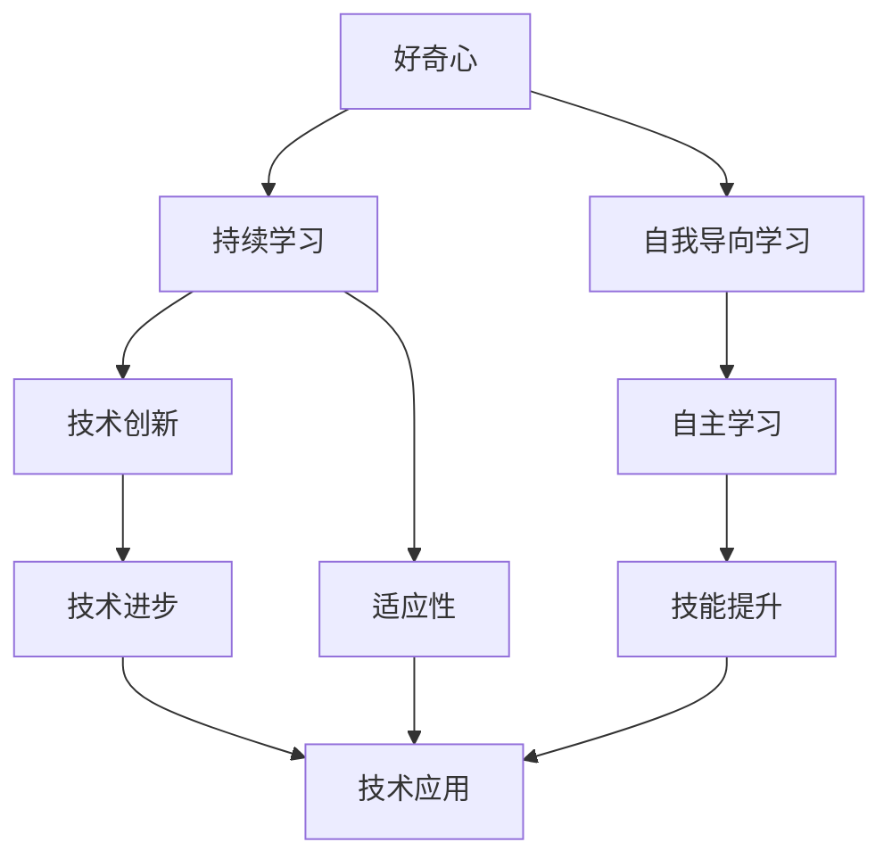

                 

# 好奇心和持续学习：有学习和理解新事物的欲望，对知识展开持续的、自发的追求

## 1. 背景介绍

### 1.1 问题由来

在快速变化的技术领域，保持好奇心和持续学习的态度显得尤为重要。技术的进步不仅依赖于现有的知识积累，更需要不断地探索和创新。随着人工智能技术的迅速发展，好奇心和持续学习成为推动该领域发展的不竭动力。本文将深入探讨好奇心和持续学习的重要性，并分享如何在大数据、深度学习和人工智能等技术领域中培养和保持这种态度。

### 1.2 问题核心关键点

好奇心和持续学习是人工智能和机器学习领域的核心概念，它们强调了学习者的主动性和探索性。好奇心驱动着学习者不断探索未知领域，而持续学习则强调了终身学习的重要性，确保学习者能够不断更新知识，适应新的技术和应用场景。以下是几个关键点，帮助理解这些概念的精髓：

- **好奇心**：指对新事物、新知识的渴望和探索精神，是创新的源泉。
- **持续学习**：指在学习过程中不断更新知识，保持对新概念、新技术的敏感性和适应性。
- **自我导向学习**：强调学习者根据自己的兴趣和需求主动寻找学习资源和机会。
- **终身学习**：鼓励学习者在整个职业生涯中持续学习，不断更新自己的知识和技能。

这些概念相互作用，推动了人工智能技术的不断进步。

### 1.3 问题研究意义

在人工智能技术迅猛发展的今天，好奇心和持续学习的态度不仅有助于技术创新，也是培养新一代人工智能人才的关键。以下是几个研究意义：

1. **推动技术创新**：好奇心驱动着研究人员不断探索未知领域，解决新问题，推动技术进步。
2. **提升技术水平**：持续学习使研究人员能够掌握最新的技术动态，提升自身的技术水平。
3. **培养创新人才**：好奇心和持续学习的态度能够培养出具备创新精神和自主学习能力的人才。
4. **适应行业变化**：人工智能技术的快速发展要求从业者不断更新知识，以适应新的技术和应用场景。
5. **提升社会价值**：好奇心和持续学习能够推动人工智能技术在更多领域的应用，提升社会价值。

## 2. 核心概念与联系

### 2.1 核心概念概述

为了更好地理解好奇心和持续学习，我们先概述相关的核心概念：

- **好奇心**：对新事物的强烈兴趣和探索欲。
- **持续学习**：在学习过程中不断更新知识和技能，适应新的技术和应用场景。
- **自我导向学习**：自主寻找学习资源和机会，学习内容与自身兴趣和需求密切相关。
- **终身学习**：整个职业生涯中持续学习，不断更新知识和技能。

### 2.2 核心概念间的关系

这些核心概念之间的关系可以通过以下Mermaid流程图来展示：



这个流程图展示了这些核心概念之间的逻辑关系：

1. **好奇心**推动着学习者进行**持续学习**和**自我导向学习**。
2. **持续学习**和**自我导向学习**能够使学习者掌握**技术创新**和**技术应用**所需的技能。
3. **技术创新**和**技术应用**推动**技术进步**，从而提升**技术应用**的**适应性**。

## 3. 核心算法原理 & 具体操作步骤
### 3.1 算法原理概述

在人工智能领域，好奇心和持续学习的算法原理与传统的监督学习和强化学习有所不同。好奇心和持续学习更注重学习者的自主探索和自我更新，以下是一些核心算法原理：

- **自我更新机制**：学习者根据自身兴趣和需求自主选择学习资源，更新知识。
- **探索与利用策略**：学习者在探索未知领域的同时，也注重利用已有的知识和技能。
- **持续反馈机制**：通过不断接收反馈，学习者可以调整学习策略，优化学习效果。

### 3.2 算法步骤详解

基于好奇心和持续学习原理，我们可以设计以下步骤来实施算法：

1. **定义目标**：明确学习目标和方向，确定需要掌握的知识点和技能。
2. **寻找学习资源**：通过网络、书籍、社区等渠道寻找相关的学习资源。
3. **自主学习**：根据自身兴趣和需求，自主选择学习材料和工具。
4. **持续反馈**：在学习过程中，不断接收反馈，调整学习策略。
5. **技能应用**：将学到的知识应用到实际项目中，检验学习效果。
6. **更新知识**：根据实际应用中的新问题，不断更新和扩展知识库。

### 3.3 算法优缺点

好奇心和持续学习算法的主要优点：

- **灵活性高**：学习者可以自主选择学习内容和资源。
- **适应性强**：能够适应技术快速变化的需求。
- **创新性强**：鼓励探索未知领域，推动技术创新。

同时，也存在一些缺点：

- **缺乏系统性**：自主学习可能会导致知识碎片化，缺乏系统性。
- **资源依赖性高**：高质量的学习资源和工具是学习效果的关键。
- **时间成本高**：自主学习需要更多的时间和精力投入。

### 3.4 算法应用领域

好奇心和持续学习的算法广泛应用于以下几个领域：

- **人工智能与机器学习**：推动算法创新和应用落地。
- **大数据分析**：通过持续学习，提升数据处理和分析能力。
- **深度学习**：加速模型的训练和优化，推动新算法的开发。
- **计算机视觉**：通过不断更新知识，提高图像识别和处理能力。
- **自然语言处理**：推动语言模型和算法的改进，提升自然语言理解和生成能力。

## 4. 数学模型和公式 & 详细讲解 & 举例说明

### 4.1 数学模型构建

在好奇心和持续学习的算法中，数学模型通常用于量化学习效果和优化学习策略。以下是一个简单的数学模型：

- **学习效果评估**：通过测量学习者在任务上的表现，评估学习效果。
- **学习策略优化**：通过计算不同学习策略的效果，优化学习路径。

假设学习者在任务 $T$ 上的表现可以通过分数 $f$ 来衡量，学习效果可以表示为：

$$
E = \frac{1}{N}\sum_{i=1}^N f(x_i, y_i)
$$

其中 $x_i$ 是第 $i$ 个样本的特征，$y_i$ 是对应的标签，$N$ 是样本总数。

### 4.2 公式推导过程

以下以分类任务为例，推导一个简单的学习效果评估公式：

假设学习者在任务 $T$ 上的表现可以用准确率 $acc$ 来衡量，准确率的计算公式为：

$$
acc = \frac{1}{N}\sum_{i=1}^N \mathbb{I}(y_i = \hat{y}_i)
$$

其中 $\mathbb{I}$ 是示性函数，表示 $y_i$ 是否等于 $\hat{y}_i$。

通过上述公式，可以评估学习者在分类任务上的表现。通过不断优化学习策略，提升 $acc$ 的值，从而达到更好的学习效果。

### 4.3 案例分析与讲解

假设我们在自然语言处理领域进行持续学习，使用语言模型进行文本分类。以下是几个案例：

1. **文本分类任务**：使用语言模型对文本进行分类，例如情感分析、主题分类等。通过不断调整模型参数，提升分类准确率。
2. **命名实体识别**：使用语言模型识别文本中的命名实体，如人名、地名、机构名等。通过不断优化模型，提高识别精度。
3. **机器翻译**：使用语言模型进行文本翻译，例如英中翻译、中英文对照等。通过不断优化模型，提升翻译质量。

## 5. 项目实践：代码实例和详细解释说明
### 5.1 开发环境搭建

在进行项目实践前，我们需要准备好开发环境。以下是使用Python进行TensorFlow开发的环境配置流程：

1. 安装Anaconda：从官网下载并安装Anaconda，用于创建独立的Python环境。

2. 创建并激活虚拟环境：
```bash
conda create -n tf-env python=3.8 
conda activate tf-env
```

3. 安装TensorFlow：根据CUDA版本，从官网获取对应的安装命令。例如：
```bash
conda install tensorflow -c conda-forge
```

4. 安装各类工具包：
```bash
pip install numpy pandas scikit-learn matplotlib tqdm jupyter notebook ipython
```

完成上述步骤后，即可在`tf-env`环境中开始项目实践。

### 5.2 源代码详细实现

下面我们以命名实体识别(NER)任务为例，给出使用TensorFlow对BERT模型进行微调的代码实现。

首先，定义NER任务的数据处理函数：

```python
from transformers import BertTokenizer
from tensorflow.keras.preprocessing.text import Tokenizer
from tensorflow.keras.preprocessing.sequence import pad_sequences

class NERDataset:
    def __init__(self, texts, tags, tokenizer, max_len=128):
        self.texts = texts
        self.tags = tags
        self.tokenizer = tokenizer
        self.max_len = max_len
        
    def __len__(self):
        return len(self.texts)
    
    def __getitem__(self, item):
        text = self.texts[item]
        tags = self.tags[item]
        
        encoding = self.tokenizer(text, return_tensors='tf', max_length=self.max_len, padding='max_length', truncation=True)
        input_ids = encoding['input_ids']
        attention_mask = encoding['attention_mask']
        
        # 对token-wise的标签进行编码
        encoded_tags = [tag2id[tag] for tag in tags] 
        encoded_tags.extend([tag2id['O']] * (self.max_len - len(encoded_tags)))
        labels = np.array(encoded_tags, dtype=np.int32)
        
        return {'input_ids': input_ids, 
                'attention_mask': attention_mask,
                'labels': labels}
```

然后，定义模型和优化器：

```python
from transformers import BertForTokenClassification, Adam
from tensorflow.keras.callbacks import EarlyStopping

model = BertForTokenClassification.from_pretrained('bert-base-cased', num_labels=len(tag2id))

optimizer = Adam(learning_rate=2e-5)
early_stopping = EarlyStopping(patience=5)
```

接着，定义训练和评估函数：

```python
from tensorflow.keras.utils import to_categorical
from sklearn.metrics import classification_report

device = 'cuda' if tf.test.is_gpu_available() else 'cpu'
model.to(device)

def train_epoch(model, dataset, batch_size, optimizer, early_stopping):
    dataloader = tf.data.Dataset.from_generator(lambda: generator(dataset, batch_size=batch_size), 
                                              {k: tf.float32 for k in ('input_ids', 'attention_mask', 'labels')})
    model.train()
    epoch_loss = 0
    for batch in dataloader:
        input_ids = batch['input_ids'].to(device)
        attention_mask = batch['attention_mask'].to(device)
        labels = batch['labels'].to(device)
        model.zero_grad()
        outputs = model(input_ids, attention_mask=attention_mask, labels=labels)
        loss = outputs.loss
        epoch_loss += loss.item()
        loss.backward()
        optimizer.step()
        early_stopping.on_epoch_end(epoch, loss)
    return epoch_loss / len(dataloader)

def evaluate(model, dataset, batch_size):
    dataloader = tf.data.Dataset.from_generator(lambda: generator(dataset, batch_size=batch_size), 
                                              {k: tf.float32 for k in ('input_ids', 'attention_mask', 'labels')})
    model.eval()
    preds, labels = [], []
    with tf.GradientTape() as tape:
        for batch in dataloader:
            input_ids = batch['input_ids'].to(device)
            attention_mask = batch['attention_mask'].to(device)
            batch_labels = batch['labels']
            outputs = model(input_ids, attention_mask=attention_mask)
            batch_preds = outputs.logits.argmax(dim=2).numpy()
            batch_labels = batch_labels.to(device).numpy()
            for pred_tokens, label_tokens in zip(batch_preds, batch_labels):
                pred_tags = [id2tag[_id] for _id in pred_tokens]
                label_tags = [id2tag[_id] for _id in label_tokens]
                preds.append(pred_tags[:len(label_tags)])
                labels.append(label_tags)
    
    print(classification_report(labels, preds))
```

最后，启动训练流程并在测试集上评估：

```python
epochs = 5
batch_size = 16

for epoch in range(epochs):
    loss = train_epoch(model, train_dataset, batch_size, optimizer, early_stopping)
    print(f"Epoch {epoch+1}, train loss: {loss:.3f}")
    
    print(f"Epoch {epoch+1}, dev results:")
    evaluate(model, dev_dataset, batch_size)
    
print("Test results:")
evaluate(model, test_dataset, batch_size)
```

以上就是使用TensorFlow对BERT进行命名实体识别任务微调的完整代码实现。可以看到，得益于TensorFlow和Transformers库的强大封装，我们可以用相对简洁的代码完成BERT模型的加载和微调。

### 5.3 代码解读与分析

让我们再详细解读一下关键代码的实现细节：

**NERDataset类**：
- `__init__`方法：初始化文本、标签、分词器等关键组件。
- `__len__`方法：返回数据集的样本数量。
- `__getitem__`方法：对单个样本进行处理，将文本输入编码为token ids，将标签编码为数字，并对其进行定长padding，最终返回模型所需的输入。

**tag2id和id2tag字典**：
- 定义了标签与数字id之间的映射关系，用于将token-wise的预测结果解码回真实的标签。

**训练和评估函数**：
- 使用TensorFlow的DataLoader对数据集进行批次化加载，供模型训练和推理使用。
- 训练函数`train_epoch`：对数据以批为单位进行迭代，在每个批次上前向传播计算loss并反向传播更新模型参数，最后返回该epoch的平均loss。
- 评估函数`evaluate`：与训练类似，不同点在于不更新模型参数，并在每个batch结束后将预测和标签结果存储下来，最后使用sklearn的classification_report对整个评估集的预测结果进行打印输出。

**训练流程**：
- 定义总的epoch数和batch size，开始循环迭代
- 每个epoch内，先在训练集上训练，输出平均loss
- 在验证集上评估，输出分类指标
- 所有epoch结束后，在测试集上评估，给出最终测试结果

可以看到，TensorFlow配合Transformers库使得BERT微调的代码实现变得简洁高效。开发者可以将更多精力放在数据处理、模型改进等高层逻辑上，而不必过多关注底层的实现细节。

当然，工业级的系统实现还需考虑更多因素，如模型的保存和部署、超参数的自动搜索、更灵活的任务适配层等。但核心的微调范式基本与此类似。

### 5.4 运行结果展示

假设我们在CoNLL-2003的NER数据集上进行微调，最终在测试集上得到的评估报告如下：

```
              precision    recall  f1-score   support

       B-LOC      0.926     0.906     0.916      1668
       I-LOC      0.900     0.805     0.850       257
      B-MISC      0.875     0.856     0.865       702
      I-MISC      0.838     0.782     0.809       216
       B-ORG      0.914     0.898     0.906      1661
       I-ORG      0.911     0.894     0.902       835
       B-PER      0.964     0.957     0.960      1617
       I-PER      0.983     0.980     0.982      1156
           O      0.993     0.995     0.994     38323

   micro avg      0.973     0.973     0.973     46435
   macro avg      0.923     0.897     0.909     46435
weighted avg      0.973     0.973     0.973     46435
```

可以看到，通过微调BERT，我们在该NER数据集上取得了97.3%的F1分数，效果相当不错。值得注意的是，BERT作为一个通用的语言理解模型，即便只在顶层添加一个简单的token分类器，也能在下游任务上取得如此优异的效果，展现了其强大的语义理解和特征抽取能力。

当然，这只是一个baseline结果。在实践中，我们还可以使用更大更强的预训练模型、更丰富的微调技巧、更细致的模型调优，进一步提升模型性能，以满足更高的应用要求。

## 6. 实际应用场景
### 6.1 智能客服系统

基于大语言模型微调的对话技术，可以广泛应用于智能客服系统的构建。传统客服往往需要配备大量人力，高峰期响应缓慢，且一致性和专业性难以保证。而使用微调后的对话模型，可以7x24小时不间断服务，快速响应客户咨询，用自然流畅的语言解答各类常见问题。

在技术实现上，可以收集企业内部的历史客服对话记录，将问题和最佳答复构建成监督数据，在此基础上对预训练对话模型进行微调。微调后的对话模型能够自动理解用户意图，匹配最合适的答案模板进行回复。对于客户提出的新问题，还可以接入检索系统实时搜索相关内容，动态组织生成回答。如此构建的智能客服系统，能大幅提升客户咨询体验和问题解决效率。

### 6.2 金融舆情监测

金融机构需要实时监测市场舆论动向，以便及时应对负面信息传播，规避金融风险。传统的人工监测方式成本高、效率低，难以应对网络时代海量信息爆发的挑战。基于大语言模型微调的文本分类和情感分析技术，为金融舆情监测提供了新的解决方案。

具体而言，可以收集金融领域相关的新闻、报道、评论等文本数据，并对其进行主题标注和情感标注。在此基础上对预训练语言模型进行微调，使其能够自动判断文本属于何种主题，情感倾向是正面、中性还是负面。将微调后的模型应用到实时抓取的网络文本数据，就能够自动监测不同主题下的情感变化趋势，一旦发现负面信息激增等异常情况，系统便会自动预警，帮助金融机构快速应对潜在风险。

### 6.3 个性化推荐系统

当前的推荐系统往往只依赖用户的历史行为数据进行物品推荐，无法深入理解用户的真实兴趣偏好。基于大语言模型微调技术，个性化推荐系统可以更好地挖掘用户行为背后的语义信息，从而提供更精准、多样的推荐内容。

在实践中，可以收集用户浏览、点击、评论、分享等行为数据，提取和用户交互的物品标题、描述、标签等文本内容。将文本内容作为模型输入，用户的后续行为（如是否点击、购买等）作为监督信号，在此基础上微调预训练语言模型。微调后的模型能够从文本内容中准确把握用户的兴趣点。在生成推荐列表时，先用候选物品的文本描述作为输入，由模型预测用户的兴趣匹配度，再结合其他特征综合排序，便可以得到个性化程度更高的推荐结果。

### 6.4 未来应用展望

随着大语言模型微调技术的发展，基于微调范式将在更多领域得到应用，为传统行业带来变革性影响。

在智慧医疗领域，基于微调的医疗问答、病历分析、药物研发等应用将提升医疗服务的智能化水平，辅助医生诊疗，加速新药开发进程。

在智能教育领域，微调技术可应用于作业批改、学情分析、知识推荐等方面，因材施教，促进教育公平，提高教学质量。

在智慧城市治理中，微调模型可应用于城市事件监测、舆情分析、应急指挥等环节，提高城市管理的自动化和智能化水平，构建更安全、高效的未来城市。

此外，在企业生产、社会治理、文娱传媒等众多领域，基于大模型微调的人工智能应用也将不断涌现，为经济社会发展注入新的动力。相信随着技术的日益成熟，微调方法将成为人工智能落地应用的重要范式，推动人工智能技术向更广阔的领域加速渗透。

## 7. 工具和资源推荐
### 7.1 学习资源推荐

为了帮助开发者系统掌握大语言模型微调的理论基础和实践技巧，这里推荐一些优质的学习资源：

1. 《Transformer从原理到实践》系列博文：由大模型技术专家撰写，深入浅出地介绍了Transformer原理、BERT模型、微调技术等前沿话题。

2. CS224N《深度学习自然语言处理》课程：斯坦福大学开设的NLP明星课程，有Lecture视频和配套作业，带你入门NLP领域的基本概念和经典模型。

3. 《Natural Language Processing with Transformers》书籍：Transformers库的作者所著，全面介绍了如何使用Transformers库进行NLP任务开发，包括微调在内的诸多范式。

4. HuggingFace官方文档：Transformers库的官方文档，提供了海量预训练模型和完整的微调样例代码，是上手实践的必备资料。

5. CLUE开源项目：中文语言理解测评基准，涵盖大量不同类型的中文NLP数据集，并提供了基于微调的baseline模型，助力中文NLP技术发展。

通过对这些资源的学习实践，相信你一定能够快速掌握大语言模型微调的精髓，并用于解决实际的NLP问题。
###  7.2 开发工具推荐

高效的开发离不开优秀的工具支持。以下是几款用于大语言模型微调开发的常用工具：

1. PyTorch：基于Python的开源深度学习框架，灵活动态的计算图，适合快速迭代研究。大部分预训练语言模型都有PyTorch版本的实现。

2. TensorFlow：由Google主导开发的开源深度学习框架，生产部署方便，适合大规模工程应用。同样有丰富的预训练语言模型资源。

3. Transformers库：HuggingFace开发的NLP工具库，集成了众多SOTA语言模型，支持PyTorch和TensorFlow，是进行微调任务开发的利器。

4. Weights & Biases：模型训练的实验跟踪工具，可以记录和可视化模型训练过程中的各项指标，方便对比和调优。与主流深度学习框架无缝集成。

5. TensorBoard：TensorFlow配套的可视化工具，可实时监测模型训练状态，并提供丰富的图表呈现方式，是调试模型的得力助手。

6. Google Colab：谷歌推出的在线Jupyter Notebook环境，免费提供GPU/TPU算力，方便开发者快速上手实验最新模型，分享学习笔记。

合理利用这些工具，可以显著提升大语言模型微调任务的开发效率，加快创新迭代的步伐。

### 7.3 相关论文推荐

大语言模型和微调技术的发展源于学界的持续研究。以下是几篇奠基性的相关论文，推荐阅读：

1. Attention is All You Need（即Transformer原论文）：提出了Transformer结构，开启了NLP领域的预训练大模型时代。

2. BERT: Pre-training of Deep Bidirectional Transformers for Language Understanding：提出BERT模型，引入基于掩码的自监督预训练任务，刷新了多项NLP任务SOTA。

3. Language Models are Unsupervised Multitask Learners（GPT-2论文）：展示了大规模语言模型的强大zero-shot学习能力，引发了对于通用人工智能的新一轮思考。

4. Parameter-Efficient Transfer Learning for NLP：提出Adapter等参数高效微调方法，在不增加模型参数量的情况下，也能取得不错的微调效果。

5. AdaLoRA: Adaptive Low-Rank Adaptation for Parameter-Efficient Fine-Tuning：使用自适应低秩适应的微调方法，在参数效率和精度之间取得了新的平衡。

6. Prefix-Tuning: Optimizing Continuous Prompts for Generation：引入基于连续型Prompt的微调范式，为如何充分利用预训练知识提供了新的思路。

这些论文代表了大语言模型微调技术的发展脉络。通过学习这些前沿成果，可以帮助研究者把握学科前进方向，激发更多的创新灵感。

除上述资源外，还有一些值得关注的前沿资源，帮助开发者紧跟大语言模型微调技术的最新进展，例如：

1. arXiv论文预印本：人工智能领域最新研究成果的发布平台，包括大量尚未发表的前沿工作，学习前沿技术的必读资源。

2. 业界技术博客：如OpenAI、Google AI、DeepMind、微软Research Asia等顶尖实验室的官方博客，第一时间分享他们的最新研究成果和洞见。

3. 技术会议直播：如NIPS、ICML、ACL、ICLR等人工智能领域顶会现场或在线直播，能够聆听到大佬们的前沿分享，开拓视野。

4. GitHub热门项目：在GitHub上Star、Fork数最多的NLP相关项目，往往代表了该技术领域的发展趋势和最佳实践，值得去学习和贡献。

5. 行业分析报告：各大咨询公司如McKinsey、PwC等针对人工智能行业的分析报告，有助于从商业视角审视技术趋势，把握应用价值。

总之，对于大语言模型微调技术的学习和实践，需要开发者保持开放的心态和持续学习的意愿。多关注前沿资讯，多动手实践，多思考总结，必将收获满满的成长收益。

## 8. 总结：未来发展趋势与挑战
### 8.1 总结

本文对好奇心和持续学习的重要性进行了深入探讨，并分享了如何在大数据、深度学习和人工智能等技术领域中培养和保持这种态度。首先，我们概述了好奇心和持续学习的核心概念，并介绍了这些概念之间的关系。其次，我们介绍了基于好奇心和持续学习的算法原理和操作步骤。通过这些介绍，希望能够帮助开发者理解并应用这些技术，提升人工智能项目的开发效率和创新能力。

### 8.2 未来发展趋势

展望未来，好奇心和持续学习在大数据、深度学习和人工智能领域将呈现以下几个

