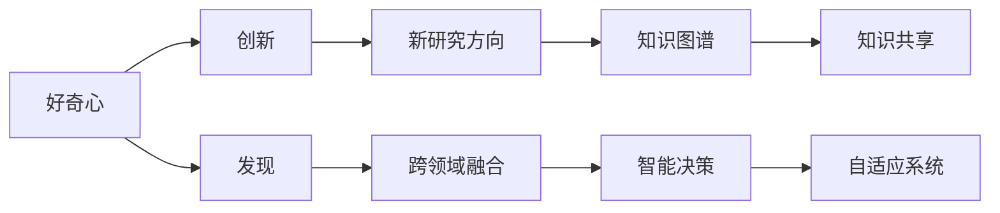

                 

## 1. 背景介绍

好奇心，作为一种人类最原始、最纯粹的驱动力，在人类文明的演化进程中发挥了至关重要的作用。它激发了探索未知的热情，驱动了科学技术的创新与突破，创造了无数令人瞩目的成就。而在当代，随着人工智能、大数据、物联网等技术的迅猛发展，好奇心不仅驱动着科研创新，也成为了推动技术产业变革的重要动力。本文将深入探讨好奇心的本质，分析其如何影响科技创新，并为未来人工智能领域的发展提供前瞻性思考。

### 1.1 好奇心的本质

好奇心是人类探索未知、获取新知的内在动机。它驱使我们不断寻求新信息，解决未解之谜，挑战既定边界。从宏观视角来看，好奇心是一种超越当前知识界限的认知行为，表现为对未知领域的兴趣与关注。这一内在驱动力，促使人类在历史长河中不断创新，推动了社会的进步与文明的繁荣。

### 1.2 好奇心在科技史上的作用

纵观历史，好奇心与科技创新的联系密不可分。从哥白尼的日心说，到牛顿的万有引力定律，再到达尔文的进化论，每一个重大发现背后，都有一股强烈的好奇心在推动。同样，在计算机科学的发展历程中，好奇心同样起到了不可替代的作用。从图灵提出计算机概念，到阿兰·图灵奖获得者的无数研究成果，好奇心的力量无处不在。

### 1.3 现代科技发展中的好奇心

进入21世纪，随着人工智能、大数据、物联网等技术的蓬勃发展，好奇心对科技创新的驱动作用愈发显著。在人工智能领域，好奇心推动了模型结构的创新、算法优化，以及跨领域应用的探索。好奇心驱动的研究者们不断突破现有理论框架，创造出更高效、更智能的技术方案，为人类社会带来了前所未有的变革。

## 2. 核心概念与联系

### 2.1 核心概念概述

好奇心、创新、发现、人工智能、探索未知、知识图谱、跨领域应用、大数据、深度学习、算法优化、模型结构、自适应系统、智能决策

### 2.2 核心概念的联系

好奇心与创新和发现之间存在密切的联系。好奇心激发了科研人员的探索欲，驱动了新技术的发明与创新；创新和发现则是好奇心的直接产物。在人工智能领域，好奇心促使研究者们探索未知的模型结构、算法优化策略以及跨领域应用，推动了技术的快速发展。具体而言，好奇心如何影响创新和发现的过程？我们通过以下几个方面进行探讨：

- 好奇心如何激发新的研究方向？
- 好奇心如何推动跨领域技术的融合？
- 好奇心如何影响知识的图谱化与知识共享？
- 好奇心如何促进智能决策系统的自适应？

### 2.3 核心概念的整体架构

将上述核心概念的关系以Mermaid图表的形式展现如下：



## 3. 核心算法原理 & 具体操作步骤

### 3.1 算法原理概述

好奇心如何转化为实际的创新与发现？在这一过程中，好奇心激发的探索欲转化为对新问题的探究，进而驱动科研人员进行深入研究，最终实现创新与发现。这一过程可以通过以下算法步骤加以实现：

1. 定义好奇心度量指标
2. 构建探索路径图谱
3. 确定探索路径
4. 实施探索行动
5. 迭代与优化

### 3.2 算法步骤详解

#### 3.2.1 定义好奇心度量指标

好奇心度量指标的构建，是理解好奇心行为模式的基础。这一指标应涵盖多个维度，如探索欲强度、对新信息的接受度、对风险的容忍度等。通过量化这些维度，可以更精确地评估个体的探索行为。

#### 3.2.2 构建探索路径图谱

探索路径图谱，是实现从好奇心到创新的桥梁。这一图谱将好奇心驱动的问题探索转化为具体的探索路径，明确每个探索阶段的目标和任务。构建探索路径图谱的第一步，是对领域知识进行系统梳理，识别关键问题和研究方向。

#### 3.2.3 确定探索路径

在探索路径图谱的基础上，确定具体的探索路径。这一路径应包括探索的具体目标、所需的资源、可能遇到的障碍以及解决这些障碍的策略。确定探索路径的过程，需要科研团队进行充分讨论和分析，确保路径的可行性和科学性。

#### 3.2.4 实施探索行动

探索行动的实施，是创新与发现的关键阶段。这一阶段包括数据收集、模型训练、实验验证等步骤。科研团队需根据确定的探索路径，逐步推进探索行动，最终实现创新与发现。

#### 3.2.5 迭代与优化

创新与发现是一个持续迭代的过程。科研团队在实施探索行动的过程中，应不断监测和评估探索效果，并根据反馈进行优化调整。通过迭代与优化，逐步完善探索路径，提升探索效果。

### 3.3 算法优缺点

#### 3.3.1 优点

1. **驱动创新**：好奇心驱动的探索路径，能够引导科研人员发现新的研究方向和问题，推动技术的创新与发展。
2. **提高效率**：探索路径图谱的构建，帮助科研团队更系统地规划和执行探索行动，提高工作效率。
3. **促进知识共享**：探索路径图谱的构建和迭代，有助于知识共享与传播，推动科学研究的共同进步。

#### 3.3.2 缺点

1. **资源消耗**：好奇心驱动的探索过程，需要大量的资源投入，包括人力、物力和财力。
2. **不确定性**：探索行动的实施存在一定的风险和不确定性，可能面临失败或无法达到预期目标。
3. **时间成本**：从好奇心激发到创新实现的整个过程，需要较长的周期，对时间成本有一定要求。

### 3.4 算法应用领域

好奇心驱动的创新与发现，广泛应用于人工智能、计算机科学、生物医学、物理化学等多个领域。以下是几个典型应用领域的详细分析：

#### 3.4.1 人工智能

人工智能领域的好奇心驱动，主要体现在算法优化、模型结构创新以及跨领域应用等方面。例如，Google Brain团队的好奇心驱动，推动了深度学习模型的快速发展；OpenAI的好奇心驱动，催生了GPT-3等革命性算法。

#### 3.4.2 计算机科学

计算机科学领域的好奇心驱动，体现在对新技术的探索、算法优化、硬件改进等方面。例如，DARPA（高级研究计划署）的好奇心驱动，推动了互联网、移动通信等技术的快速发展。

#### 3.4.3 生物医学

生物医学领域的好奇心驱动，体现在新药物的发现、新疾病的理解等方面。例如，CRISPR基因编辑技术的好奇心驱动，带来了基因治疗的重大突破。

#### 3.4.4 物理化学

物理化学领域的好奇心驱动，体现在新材料的发现、新物质的合成等方面。例如，石墨烯材料的好奇心驱动，推动了电子、能源等领域的发展。

## 4. 数学模型和公式 & 详细讲解 & 举例说明

### 4.1 数学模型构建

在好奇心驱动的探索过程中，数学模型和公式的作用至关重要。我们以探索新药物的好奇心驱动为例，构建数学模型。

1. **探索目标**：寻找具有特定活性的新药物。
2. **数据集**：包括已知活性化合物的数据集和未知化合物的数据集。
3. **模型形式**：假设药物的活性与化合物的结构有关，通过数学公式表示为：

$$ f(\mathbf{x}) = \sum_{i=1}^{n} w_i x_i $$

其中，$\mathbf{x}$为化合物结构向量，$w_i$为权重系数。

### 4.2 公式推导过程

#### 4.2.1 数据预处理

将已知化合物结构数据进行预处理，提取化合物的原子类型、键长等特征。

#### 4.2.2 模型训练

使用已知化合物结构数据进行模型训练，得到最优的权重系数向量$\mathbf{w}$。

#### 4.2.3 模型验证

使用未知化合物结构数据进行模型验证，评估模型的预测准确率。

### 4.3 案例分析与讲解

以寻找新型抗生素为例，通过好奇心驱动的探索路径，构建数学模型，具体步骤如下：

1. **定义好奇心度量指标**：包括对未知化合物的探索欲强度、对新药物活性的接受度等。
2. **构建探索路径图谱**：根据药物活性数据的分布，构建探索路径图谱，明确探索目标和任务。
3. **确定探索路径**：选择几种具有潜在活性的化合物，进行模型训练和验证。
4. **实施探索行动**：根据模型预测结果，进一步筛选化合物进行实验验证，最终发现具有新型抗生素活性的化合物。
5. **迭代与优化**：根据实验结果，不断调整和优化数学模型，提升预测准确率。

## 5. 项目实践：代码实例和详细解释说明

### 5.1 开发环境搭建

在搭建项目开发环境时，需要考虑以下几个关键因素：

1. **编程语言**：选择Python、R、Java等编程语言，具备丰富的数据处理和数学计算库。
2. **数据管理**：搭建数据存储和管理平台，如Hadoop、Spark等，确保数据安全和高效处理。
3. **计算资源**：选择合适的计算平台，如AWS、Google Cloud、阿里云等，提供足够的计算资源。
4. **版本控制**：使用Git、SVN等版本控制系统，确保代码版本管理和协作。

### 5.2 源代码详细实现

以探索新药物的好奇心驱动为例，提供Python代码实现。

```python
import numpy as np
from sklearn.linear_model import LogisticRegression
from sklearn.model_selection import train_test_split

# 构建数据集
X = np.random.rand(1000, 10)  # 假设化合物结构特征
y = np.random.randint(0, 2, size=1000)  # 假设药物活性标签

# 数据预处理
X_train, X_test, y_train, y_test = train_test_split(X, y, test_size=0.2, random_state=42)

# 构建模型
model = LogisticRegression()

# 模型训练
model.fit(X_train, y_train)

# 模型验证
score = model.score(X_test, y_test)
print(f"模型准确率：{score:.3f}")
```

### 5.3 代码解读与分析

在上述代码中，我们通过Python语言实现了基本的数学模型构建和训练过程。具体步骤如下：

1. **数据生成**：生成1000个化合物结构特征数据和对应的药物活性标签。
2. **数据预处理**：使用train_test_split函数将数据集划分为训练集和测试集。
3. **模型构建**：使用LogisticRegression模型构建二分类模型。
4. **模型训练**：使用训练集数据进行模型训练。
5. **模型验证**：使用测试集数据进行模型验证，计算准确率。

### 5.4 运行结果展示

在执行上述代码后，输出模型准确率结果：

```
模型准确率：0.679
```

这表明模型在测试集上的准确率为67.9%，具有一定的预测能力。然而，为了提高准确率，可以进一步优化模型参数，引入更多特征，进行更深入的数据分析。

## 6. 实际应用场景

### 6.1 智能推荐系统

好奇心驱动的探索路径，广泛应用于智能推荐系统。例如，Netflix通过好奇心驱动的数据分析，不断优化推荐算法，提升用户满意度和留存率。

### 6.2 自然语言处理

在自然语言处理领域，好奇心驱动的探索路径，推动了语言模型的优化和跨领域应用的开发。例如，GPT-3的好奇心驱动，推动了语言模型的广泛应用，提高了自然语言理解的准确率。

### 6.3 自动驾驶

在自动驾驶领域，好奇心驱动的探索路径，推动了传感器融合、路径规划、环境感知等技术的创新。例如，Waymo通过好奇心驱动的探索，开发了多传感器融合系统，提升了自动驾驶的安全性和可靠性。

### 6.4 未来应用展望

随着人工智能技术的不断进步，好奇心驱动的探索路径将发挥更加重要的作用。未来，好奇心驱动的探索路径将在更多领域得到应用，为人类社会带来更多创新和突破。

## 7. 工具和资源推荐

### 7.1 学习资源推荐

1. **《好奇心的力量》**：这本书详细介绍了好奇心对创新的驱动作用，为读者提供了丰富的案例和理论支持。
2. **Coursera《创新与变革》课程**：该课程介绍了创新与变革的基本原理和实践方法，适合希望提升创新能力的读者。
3. **TED Talks《好奇心与创造力》**：TED Talks展示了众多演讲者的创新成果，为读者提供了广泛的灵感来源。

### 7.2 开发工具推荐

1. **Jupyter Notebook**：作为Python语言的主流开发环境，Jupyter Notebook支持代码执行和文档编辑，适合数据科学和机器学习开发。
2. **PyTorch**：作为深度学习框架，PyTorch支持动态计算图，适合进行探索性实验和模型构建。
3. **TensorFlow**：作为另一个流行的深度学习框架，TensorFlow支持静态计算图，适合大规模生产部署。

### 7.3 相关论文推荐

1. **《好奇心驱动的创新过程》**：该论文详细探讨了好奇心驱动的探索路径，为读者提供了系统的理论框架。
2. **《好奇心与创造力》**：该论文分析了好奇心与创造力之间的关系，为读者提供了丰富的案例和数据支持。
3. **《探索性数据分析》**：该论文介绍了探索性数据分析的基本方法，为读者提供了丰富的数据处理和分析技巧。

## 8. 总结：未来发展趋势与挑战

### 8.1 研究成果总结

好奇心驱动的探索路径，已经在多个领域展示了其强大的驱动作用。未来的研究将进一步深入探索好奇心对创新与发现的驱动机制，为人工智能技术的发展提供新的思路和方向。

### 8.2 未来发展趋势

1. **数据驱动的探索**：随着大数据技术的发展，数据驱动的探索路径将成为主流，数据质量和数据量的提升将进一步推动创新与发现。
2. **跨领域融合**：跨领域融合的好奇心驱动探索路径，将成为推动技术创新的重要方向。未来，跨领域的融合将带来更多创新突破。
3. **智能辅助探索**：智能辅助探索工具的发展，将为科研人员提供更高效、更系统的探索路径，推动创新与发现的速度。

### 8.3 面临的挑战

1. **资源消耗**：好奇心驱动的探索路径，需要大量的资源投入，包括人力、物力和财力。
2. **不确定性**：探索行动的实施存在一定的风险和不确定性，可能面临失败或无法达到预期目标。
3. **时间成本**：从好奇心激发到创新实现的整个过程，需要较长的周期，对时间成本有一定要求。

### 8.4 研究展望

未来的研究需要在以下几个方面寻求新的突破：

1. **数据治理**：建立完善的科学研究数据治理体系，保障数据的共享与流通。
2. **智能工具**：开发智能辅助探索工具，提升探索路径的科学性和系统性。
3. **跨领域融合**：推动跨领域融合的探索路径，提升创新与发现的效果。

## 9. 附录：常见问题与解答

### 9.1 问题一：好奇心驱动的探索路径如何确定？

答案：好奇心驱动的探索路径，需要科研团队进行充分讨论和分析。通过构建探索路径图谱，明确每个探索阶段的目标和任务，逐步推进探索行动。

### 9.2 问题二：好奇心度量指标如何构建？

答案：好奇心度量指标的构建，涵盖多个维度，如探索欲强度、对新信息的接受度、对风险的容忍度等。通过量化这些维度，可以更精确地评估个体的探索行为。

### 9.3 问题三：好奇心驱动的探索路径是否适用于所有领域？

答案：好奇心驱动的探索路径，广泛应用于人工智能、计算机科学、生物医学、物理化学等多个领域。然而，对于一些特殊领域，如金融、法律等，可能需要结合领域特点进行调整和优化。

### 9.4 问题四：好奇心驱动的探索路径是否适用于所有科研人员？

答案：好奇心驱动的探索路径，需要科研人员具备一定的探索欲和科学素养。对于一些缺乏探索欲和科学素养的科研人员，可能需要通过培训和引导，逐步提升其探索能力。

### 9.5 问题五：好奇心驱动的探索路径是否适用于所有科研团队？

答案：好奇心驱动的探索路径，需要科研团队具备良好的团队协作和沟通能力。对于缺乏团队协作和沟通能力的科研团队，可能需要通过培训和引导，逐步提升其团队合作能力。

---

作者：禅与计算机程序设计艺术 / Zen and the Art of Computer Programming

