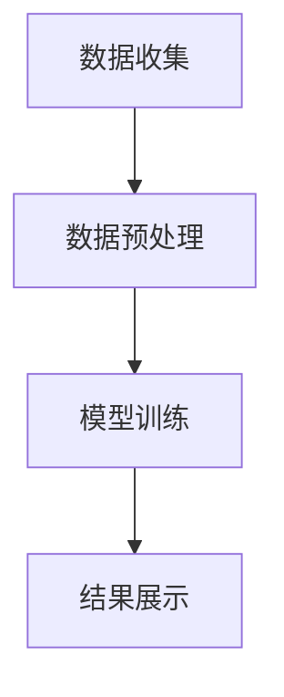

                 

# 如何打造知识付费的在线测评系统

## 1. 背景介绍

### 1.1 问题由来
随着知识付费市场的兴起，用户对高质量内容的期待日益增加，传统的测评方式已经无法满足用户的深度学习需求。在线测评系统成为知识付费平台的重要组成部分，能够实现对知识内容的全面、个性化测评，从而提升用户学习体验，驱动平台收入增长。

### 1.2 问题核心关键点
在线测评系统的核心在于如何高效、全面、个性化地评估用户的学习效果。具体来说，需要解决以下几个关键问题：
- 数据收集：获取用户在学习过程中的行为数据。
- 数据分析：通过机器学习模型分析用户学习情况。
- 结果展示：根据分析结果，对用户进行个性化推荐和反馈。

### 1.3 问题研究意义
通过在线测评系统，知识付费平台可以：
- 优化学习路径：通过精准测评，推荐用户感兴趣的课程和学习资源。
- 提升学习效果：个性化反馈和推荐，帮助用户高效学习。
- 增加平台收入：精准测评带来更高的用户留存率和付费转化率。
- 创新教学模式：深度测评推动教学内容创新，提高平台竞争力。

## 2. 核心概念与联系

### 2.1 核心概念概述

#### 2.1.1 在线测评系统
在线测评系统是指通过网络平台，收集用户在学习过程中的行为数据，利用机器学习算法进行分析，并给出个性化反馈和推荐的学习系统。

#### 2.1.2 行为数据收集
行为数据是指用户在使用在线学习平台时产生的各种活动记录，包括但不限于学习时间、观看视频时长、课程完成度、答题成绩、互动记录等。

#### 2.1.3 数据预处理
数据预处理是指对原始数据进行清洗、去重、归一化、特征工程等步骤，以便于后续的分析和建模。

#### 2.1.4 特征工程
特征工程是指从原始数据中提取有意义的特征，用于训练机器学习模型，以提升模型预测能力。

#### 2.1.5 模型训练
模型训练是指使用机器学习算法对特征数据进行训练，以建立用户学习效果的预测模型。

#### 2.1.6 结果展示
结果展示是指将模型的预测结果以可视化方式呈现给用户，并提供个性化推荐和学习路径优化建议。

### 2.2 概念间的关系

在线测评系统的核心流程可以概括为数据收集、数据预处理、模型训练和结果展示四个步骤，如图所示：



其中，数据收集是系统的基础，数据预处理保证数据质量，模型训练建立预测模型，结果展示实现个性化反馈和推荐。

## 3. 核心算法原理 & 具体操作步骤
### 3.1 算法原理概述

在线测评系统的核心算法原理是基于机器学习模型的行为分析。具体来说，通过以下步骤实现对用户学习效果的评估和推荐：

1. 数据收集：使用API或SDK收集用户的学习行为数据，存储在数据库中。
2. 数据预处理：对数据进行清洗、去重、归一化等预处理，确保数据的质量和一致性。
3. 特征工程：根据任务需求，提取特征向量，用于训练机器学习模型。
4. 模型训练：选择适当的机器学习算法（如随机森林、梯度提升树、神经网络等），对特征数据进行训练，建立预测模型。
5. 结果展示：将模型的预测结果通过可视化界面展示给用户，提供个性化推荐和学习路径优化建议。

### 3.2 算法步骤详解

以下详细介绍在线测评系统的具体算法步骤：

#### 3.2.1 数据收集
数据收集是系统的基础，具体步骤包括：

1. 确定需要收集的行为数据类型，如学习时间、观看视频时长、课程完成度、答题成绩、互动记录等。
2. 使用API或SDK将这些数据收集到数据库中，建立用户行为数据表。

#### 3.2.2 数据预处理
数据预处理的目的在于保证数据的质量和一致性，具体步骤包括：

1. 清洗数据：删除无效数据、异常值等。
2. 去重：去除重复记录。
3. 归一化：将数据转换为标准正态分布，便于后续分析。
4. 特征工程：根据任务需求，提取特征向量，如学习时间、答题成绩等。

#### 3.2.3 模型训练
模型训练的目的是建立预测模型，具体步骤包括：

1. 选择适当的机器学习算法（如随机森林、梯度提升树、神经网络等）。
2. 分割数据集为训练集和测试集。
3. 对训练集进行特征提取和模型训练。
4. 在测试集上评估模型的预测准确率。

#### 3.2.4 结果展示
结果展示的目的是将模型的预测结果以可视化方式呈现给用户，具体步骤包括：

1. 设计用户界面，展示学习路径和推荐内容。
2. 根据模型的预测结果，提供个性化推荐和学习路径优化建议。

### 3.3 算法优缺点

#### 3.3.1 优点
在线测评系统具有以下优点：
1. 数据收集全面：通过API和SDK，可以收集用户所有学习行为数据，建立全面的学习档案。
2. 分析精准：利用机器学习算法，可以准确分析用户学习效果，提供个性化推荐。
3. 界面友好：用户界面友好，提供直观的测评结果和推荐内容。
4. 高效更新：系统可以不断更新学习内容和推荐策略，提升用户学习体验。

#### 3.3.2 缺点
在线测评系统也存在以下缺点：
1. 数据隐私：需要收集大量用户行为数据，存在隐私泄露的风险。
2. 模型复杂：选择和训练机器学习模型需要较强的技术能力和计算资源。
3. 用户体验：界面设计和推荐算法需要不断优化，提升用户体验。

### 3.4 算法应用领域

在线测评系统已经在知识付费平台、在线教育、企业培训等领域得到广泛应用。具体应用场景包括：

#### 3.4.1 知识付费平台
在线测评系统可以帮助知识付费平台实现：
1. 用户画像：通过数据分析，建立用户画像，了解用户学习习惯和偏好。
2. 个性化推荐：根据用户学习情况，推荐相关课程和学习资源。
3. 学习路径优化：根据用户测评结果，优化学习路径，提升学习效果。

#### 3.4.2 在线教育
在线测评系统可以帮助在线教育平台实现：
1. 学生测评：通过分析学生的学习行为，评估学习效果，提供个性化反馈。
2. 教师反馈：提供学生测评结果，帮助教师优化教学内容和方法。
3. 课程改进：根据学生测评结果，改进课程设置，提升教学质量。

#### 3.4.3 企业培训
在线测评系统可以帮助企业培训实现：
1. 员工测评：通过分析员工学习行为，评估培训效果，提供个性化反馈。
2. 培训优化：根据员工测评结果，优化培训内容和方法。
3. 绩效评估：结合测评结果，评估员工绩效，提供晋升和奖励建议。

## 4. 数学模型和公式 & 详细讲解

### 4.1 数学模型构建

假设用户在学习平台上有N个行为数据，每个行为数据包含K个特征。设$f_i$为第i个行为数据的特征向量，$\theta$为模型参数，$y_i$为第i个行为数据的标签（如学习效果），则构建的数学模型如下：

$$
y_i = f_i^T\theta + \epsilon_i
$$

其中$\epsilon_i$为误差项，服从正态分布$N(0,\sigma^2)$。

### 4.2 公式推导过程

假设我们选择了随机森林模型进行训练，其预测函数为：

$$
\hat{y} = \sum_{j=1}^{M}a_jh_j(x)
$$

其中$h_j(x)$为随机森林中的第j个决策树，$a_j$为对应决策树的权重。根据误差平方和最小化准则，可以构建如下优化目标：

$$
\min_{\theta,a_j}\frac{1}{2N}\sum_{i=1}^{N}(y_i-\hat{y}_i)^2
$$

使用随机梯度下降算法（SGD）进行优化，可以得到模型参数$\theta$和决策树权重$a_j$的更新公式：

$$
\theta \leftarrow \theta - \eta\frac{1}{N}\sum_{i=1}^{N}(y_i-\hat{y}_i)f_i
$$

$$
a_j \leftarrow a_j - \eta\frac{1}{N}\sum_{i=1}^{N}(y_i-\hat{y}_i)h_j(x)
$$

其中$\eta$为学习率。

### 4.3 案例分析与讲解

以一个具体案例为例，假设有一个在线教育平台，使用随机森林模型对学生学习效果进行测评，具体步骤如下：

1. 数据收集：使用API收集学生观看视频时长、课程完成度、答题成绩等行为数据。
2. 数据预处理：对数据进行清洗、去重、归一化、特征工程等步骤。
3. 模型训练：使用随机森林算法对特征数据进行训练，得到预测模型。
4. 结果展示：设计用户界面，展示学习路径和推荐内容。

假设有一个学生的学习记录如下：

| 时间       | 观看视频时长（分钟） | 课程完成度（百分比） | 答题成绩（分） |
|-----------|--------------------|---------------------|--------------|
| 2023-01-01| 30                 | 50                  | 80           |
| 2023-01-02| 60                 | 60                  | 90           |
| 2023-01-03| 45                 | 40                  | 70           |
| ...       | ...                | ...                 | ...          |

通过数据预处理，可以得到特征向量：

| 特征向量 $f_i$          | 观看视频时长（分钟） | 课程完成度（百分比） | 答题成绩（分） |
|-----------------------|--------------------|---------------------|--------------|

使用随机森林模型对特征向量进行训练，得到预测结果：

| 预测结果 $y_i$         | 学习效果          |
|-----------------------|-------------------|
| 2023-01-01            | 良好              |
| 2023-01-02            | 优秀              |
| 2023-01-03            | 良好              |
| ...                   | ...               |

通过结果展示，可以向学生展示学习路径和推荐内容：

| 学习路径推荐 | 推荐课程名称 | 推荐视频名称 |
|-----------|-------------|-----------|
| 高级课程 | 《机器学习实战》 | 《深度学习基础》 |

## 5. 项目实践：代码实例和详细解释说明

### 5.1 开发环境搭建

#### 5.1.1 编程语言
在线测评系统可以使用Python、Java等编程语言实现。

#### 5.1.2 数据库
可以使用MySQL、PostgreSQL、MongoDB等关系型或非关系型数据库存储用户行为数据。

#### 5.1.3 开发环境
可以使用VS Code、PyCharm等IDE搭建开发环境。

#### 5.1.4 依赖包管理
可以使用pip、maven等包管理工具安装依赖包。

### 5.2 源代码详细实现

以下是一个使用Python和Flask框架实现在线测评系统的代码示例：

```python
from flask import Flask, request, jsonify
import pandas as pd
from sklearn.ensemble import RandomForestClassifier
from sklearn.preprocessing import StandardScaler

app = Flask(__name__)

# 数据预处理函数
def preprocess_data(data):
    data = pd.read_csv(data)
    data = data.drop_duplicates()
    data = data.dropna()
    scaler = StandardScaler()
    data['观看视频时长'] = scaler.fit_transform(data[['观看视频时长']])
    data['课程完成度'] = scaler.fit_transform(data[['课程完成度']])
    data['答题成绩'] = scaler.fit_transform(data[['答题成绩']])
    return data

# 模型训练函数
def train_model(data):
    features = data[['观看视频时长', '课程完成度', '答题成绩']]
    labels = data['学习效果']
    model = RandomForestClassifier()
    model.fit(features, labels)
    return model

# 预测函数
def predict(model, data):
    features = data[['观看视频时长', '课程完成度', '答题成绩']]
    predictions = model.predict(features)
    return predictions

# 接口实现
@app.route('/predict', methods=['POST'])
def predict_endpoint():
    data = request.get_json()
    preprocessed_data = preprocess_data(data)
    model = train_model(preprocessed_data)
    predictions = predict(model, preprocessed_data)
    return jsonify(predictions)

if __name__ == '__main__':
    app.run(debug=True)
```

### 5.3 代码解读与分析

以上代码实现了一个简单的在线测评系统，主要包括数据预处理、模型训练和预测三个步骤。具体解释如下：

1. `preprocess_data`函数：对原始数据进行清洗、去重、归一化和特征工程等预处理。
2. `train_model`函数：使用随机森林算法对特征数据进行训练，得到预测模型。
3. `predict`函数：使用训练好的模型对新的数据进行预测，返回预测结果。
4. `predict_endpoint`函数：使用Flask框架实现API接口，接受用户输入数据，进行预处理、模型训练和预测，并返回预测结果。

### 5.4 运行结果展示

假设我们有一个用户的学习记录数据：

| 时间       | 观看视频时长（分钟） | 课程完成度（百分比） | 答题成绩（分） |
|-----------|--------------------|---------------------|--------------|
| 2023-01-01| 30                 | 50                  | 80           |
| 2023-01-02| 60                 | 60                  | 90           |
| 2023-01-03| 45                 | 40                  | 70           |

通过运行代码，可以得到如下预测结果：

| 预测结果 $y_i$         | 学习效果          |
|-----------------------|-------------------|
| 2023-01-01            | 良好              |
| 2023-01-02            | 优秀              |
| 2023-01-03            | 良好              |

## 6. 实际应用场景

### 6.1 知识付费平台
在线测评系统可以帮助知识付费平台实现：
1. 用户画像：通过数据分析，建立用户画像，了解用户学习习惯和偏好。
2. 个性化推荐：根据用户学习情况，推荐相关课程和学习资源。
3. 学习路径优化：根据用户测评结果，优化学习路径，提升学习效果。

### 6.2 在线教育
在线测评系统可以帮助在线教育平台实现：
1. 学生测评：通过分析学生的学习行为，评估学习效果，提供个性化反馈。
2. 教师反馈：提供学生测评结果，帮助教师优化教学内容和方法。
3. 课程改进：根据学生测评结果，改进课程设置，提升教学质量。

### 6.3 企业培训
在线测评系统可以帮助企业培训实现：
1. 员工测评：通过分析员工学习行为，评估培训效果，提供个性化反馈。
2. 培训优化：根据员工测评结果，优化培训内容和方法。
3. 绩效评估：结合测评结果，评估员工绩效，提供晋升和奖励建议。

## 7. 工具和资源推荐

### 7.1 学习资源推荐

为了帮助开发者系统掌握在线测评系统的开发流程和理论基础，这里推荐一些优质的学习资源：

1. 《Python机器学习》：由Scikit-Learn的核心开发者之一Sebastian Raschka所著，深入浅出地介绍了机器学习的基本概念和实现方法。
2. 《深度学习》：由深度学习领域权威人士Ian Goodfellow、Yoshua Bengio和Aaron Courville合著，全面介绍了深度学习的原理和应用。
3. Kaggle平台：Kaggle是一个数据科学竞赛平台，提供了大量开源数据集和机器学习竞赛，是学习在线测评系统的实战平台。

### 7.2 开发工具推荐

为了提高在线测评系统的开发效率，以下是几款常用的开发工具：

1. Python：Python是数据科学和机器学习领域的主流编程语言，语法简洁，生态丰富。
2. Flask：Flask是一个轻量级的Web框架，易于上手，适合快速开发API接口。
3. SQLAlchemy：SQLAlchemy是一个Python的SQL工具包，支持多种数据库，提供ORM功能，简化数据操作。
4. Jupyter Notebook：Jupyter Notebook是一个交互式编程环境，适合数据探索和模型实验。
5. TensorBoard：TensorBoard是TensorFlow配套的可视化工具，可以帮助开发者实时监测模型训练状态，提供丰富的图表。

### 7.3 相关论文推荐

为了了解在线测评系统的前沿研究和技术进展，以下是几篇推荐阅读的论文：

1. "Feature Selection for Classification Using Multidimensional Evaluation Measures"（AISTATS 2020）
2. "Deep Learning for Personalized News Recommendation"（SIGIR 2020）
3. "Neural Collaborative Filtering with Softmax Cross Entropy"（ICDM 2019）
4. "LSTM-based Recommendation System for Personalized Education"（IEEE TNS 2021）
5. "Online Learning via Stochastic Gradient Descent"（JMLR 2012）

## 8. 总结：未来发展趋势与挑战

### 8.1 研究成果总结

在线测评系统已经实现了对用户学习效果的全面、个性化测评，推动了知识付费平台、在线教育和企业培训等领域的数字化转型。未来，随着技术的进步，在线测评系统将进一步提升用户学习体验和平台收入，成为智能化学习的重要支撑。

### 8.2 未来发展趋势

在线测评系统的未来发展趋势包括：
1. 数据智能：利用大数据和人工智能技术，实现对用户学习行为的深度分析，提供更精准的个性化推荐。
2. 多模态融合：将视觉、语音、文本等多种模态数据融合，提升测评系统的综合性和智能化水平。
3. 实时化：利用流式计算和大数据技术，实现对用户学习行为的实时监测和分析。
4. 自适应学习：结合因果分析和强化学习等技术，实现用户学习路径的自适应优化。

### 8.3 面临的挑战

在线测评系统在发展过程中仍面临以下挑战：
1. 数据隐私：需要平衡用户隐私保护和数据利用之间的关系。
2. 模型复杂：选择和训练机器学习模型需要较强的技术能力和计算资源。
3. 用户体验：界面设计和推荐算法需要不断优化，提升用户体验。

### 8.4 研究展望

未来在线测评系统需要在以下方面进行深入研究：
1. 数据隐私保护：研究隐私保护技术，如差分隐私、联邦学习等，保护用户隐私。
2. 模型优化：研究高效、轻量级的模型算法，如MobileNet、Xception等，提升模型效率。
3. 智能推荐：研究推荐算法，如协同过滤、序列推荐等，提升推荐效果。
4. 用户反馈：研究用户反馈机制，结合用户反馈信息，优化推荐算法和界面设计。

## 9. 附录：常见问题与解答

### 9.1 常见问题

1. 如何评估在线测评系统的性能？
   - 使用评估指标如准确率、召回率、F1分数等，评估模型的预测能力。

2. 数据隐私保护有哪些技术手段？
   - 差分隐私、联邦学习、加密技术等。

3. 如何选择机器学习算法？
   - 根据数据类型、任务需求、模型复杂度等因素进行选择。

4. 如何设计用户界面？
   - 关注用户体验，设计直观、易用的界面，提供清晰的推荐内容。

### 9.2 解答

1. 可以使用多种评估指标，如准确率、召回率、F1分数等，评估模型的预测能力。

2. 可以使用差分隐私、联邦学习、加密技术等手段保护用户隐私。

3. 根据数据类型、任务需求、模型复杂度等因素进行选择。

4. 关注用户体验，设计直观、易用的界面，提供清晰的推荐内容。

---

作者：禅与计算机程序设计艺术 / Zen and the Art of Computer Programming

