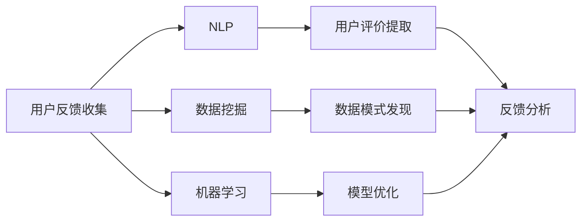

                 

# 如何进行有效的用户反馈收集

在快速发展的数字化时代，用户反馈变得至关重要。它能帮助企业洞察市场需求、优化产品体验，甚至发现潜在危机。然而，如何有效地收集和利用用户反馈，却是一项复杂而富有挑战性的任务。本文将深入探讨如何进行有效的用户反馈收集，通过理解核心概念、掌握关键技术和应用实例，为读者提供全面、实用的指导。

## 1. 背景介绍

### 1.1 问题由来

在互联网和移动应用的普及下，企业与用户之间的互动日益频繁。用户反馈不仅能帮助企业了解用户需求和满意度，还能提供数据驱动的产品迭代依据。传统的数据收集手段，如问卷调查、电话访谈等，已难以适应互联网时代海量数据的需求。因此，基于在线平台的用户反馈收集方法显得尤为重要。

### 1.2 问题核心关键点

用户反馈收集的关键点在于确保反馈信息的真实性、多样性和可用性。真实性确保反馈反映用户真实需求，多样性确保反馈涵盖不同用户群体的视角，可用性确保反馈能够被有效地分析和使用。此外，如何设计合适的收集工具和流程，以及如何分析处理收集到的反馈数据，同样重要。

## 2. 核心概念与联系

### 2.1 核心概念概述

在进行用户反馈收集时，以下几个概念是至关重要的：

- **用户反馈收集**：指通过在线问卷、评论、应用评分等方式，从用户处获取关于产品或服务的评价和建议。
- **自然语言处理(NLP)**：利用计算机技术处理、分析、理解人类语言，以提取有价值的信息。
- **数据挖掘**：从大量数据中自动发现模式、规律和知识，以支持决策。
- **机器学习**：通过算法使计算机系统能够自动学习和改进。
- **用户体验(UX)**：涉及产品的设计、交互和可用性，以提升用户满意度和使用体验。

这些概念之间的联系可以通过以下Mermaid流程图来展示：



这个流程图展示了用户反馈收集与NLP、数据挖掘和机器学习的紧密联系，以及如何将这些技术应用于反馈分析中。

### 2.2 概念间的关系

用户反馈收集涉及多学科知识，各个概念之间存在相互作用和影响。NLP技术能够自动化地从用户反馈中提取有用信息，数据挖掘技术则有助于发现用户反馈中的模式和趋势，而机器学习技术则可以优化反馈分析模型，提升用户体验。

## 3. 核心算法原理 & 具体操作步骤

### 3.1 算法原理概述

用户反馈收集的核心算法原理主要基于自然语言处理(NLP)和数据挖掘技术。NLP用于自动化处理和理解用户反馈文本，提取有价值的信息和情感倾向。数据挖掘则通过分析大量反馈数据，发现潜在的模式和趋势，为决策提供支持。

### 3.2 算法步骤详解

#### 3.2.1 收集反馈数据

1. **设计问卷**：根据产品特性和用户需求，设计简洁明了的问卷，涵盖关键功能、易用性、满意度等方面的问题。
2. **部署收集工具**：选择适合的反馈收集工具，如在线问卷平台、应用内评分系统等，部署到目标平台。
3. **发布和推广**：通过社交媒体、邮件等方式推广问卷或评分系统，鼓励用户参与反馈。

#### 3.2.2 数据预处理

1. **文本清洗**：去除无关信息、错误拼写等，提高数据质量。
2. **分词和标注**：利用NLP技术将文本分解为词汇，并进行情感极性标注，如积极、消极、中性等。
3. **特征提取**：从文本中提取关键词、短语等特征，用于后续分析。

#### 3.2.3 数据分析与模型训练

1. **情感分析**：使用机器学习模型（如情感分类器）对用户反馈进行情感分析，识别出积极和消极反馈。
2. **聚类分析**：通过数据挖掘技术对反馈数据进行聚类，发现用户群体的共同需求和问题。
3. **关联规则挖掘**：找出频繁出现的反馈主题和行为模式，如某类功能的使用频率等。

#### 3.2.4 结果展示与优化

1. **数据可视化**：将分析结果通过图表、报告等方式展示给决策者，直观地呈现用户反馈的趋势和重点。
2. **反馈循环**：根据分析结果，优化产品功能，并再次收集用户反馈，形成闭环改进。

### 3.3 算法优缺点

**优点**：
- **自动化处理**：通过NLP和机器学习技术，自动化处理和分析大量用户反馈，节省人力成本。
- **实时响应**：反馈收集和分析可以实时进行，快速响应用户需求和问题。
- **数据多样性**：在线平台收集的反馈数据多样，能够覆盖更多用户群体和视角。

**缺点**：
- **隐私保护**：收集用户反馈时需要考虑隐私保护问题，确保数据安全。
- **数据质量**：自动处理技术可能存在误差，需人工复核和校正。
- **模型依赖**：依赖于模型的选择和训练，需要持续优化模型性能。

### 3.4 算法应用领域

用户反馈收集技术在多个领域都有广泛应用，包括但不限于：

- **电商零售**：通过用户评分和评论分析，优化商品推荐和用户体验。
- **金融服务**：利用客户反馈分析，提升服务质量和客户满意度。
- **医疗健康**：收集患者反馈，优化医疗服务和产品质量。
- **教育培训**：分析学生反馈，改进教学方法和课程内容。

## 4. 数学模型和公式 & 详细讲解

### 4.1 数学模型构建

我们以情感分析为例，构建基于机器学习的情感分类模型。设用户反馈数据集为 $D=\{(x_i, y_i)\}_{i=1}^N$，其中 $x_i$ 为反馈文本，$y_i \in \{0, 1\}$ 表示情感极性（0为负面，1为正面）。情感分类问题可以转化为二分类问题，使用逻辑回归、支持向量机（SVM）、随机森林等算法进行建模。

假设使用逻辑回归模型，构建模型 $h_{\theta}(x_i) = \sigma(\theta^T x_i)$，其中 $\sigma$ 为sigmoid函数，$\theta$ 为模型参数。情感分类的目标是最小化损失函数：

$$
L(\theta) = -\frac{1}{N}\sum_{i=1}^N [y_i\log h_{\theta}(x_i) + (1-y_i)\log (1-h_{\theta}(x_i))]
$$

利用梯度下降算法更新参数 $\theta$：

$$
\theta \leftarrow \theta - \eta \nabla_{\theta}L(\theta)
$$

其中 $\eta$ 为学习率，$\nabla_{\theta}L(\theta)$ 为损失函数对参数 $\theta$ 的梯度。

### 4.2 公式推导过程

通过逻辑回归模型，将用户反馈分类为正面或负面。在训练过程中，模型会不断调整权重参数 $\theta$，使得预测结果更接近真实标签。具体推导过程如下：

1. **样本概率计算**：对于每个样本 $x_i$，计算模型预测的概率 $h_{\theta}(x_i)$。
2. **损失函数计算**：计算样本 $i$ 的损失函数值 $L_i(\theta)$。
3. **梯度计算**：计算损失函数对参数 $\theta$ 的梯度 $\nabla_{\theta}L(\theta)$。
4. **参数更新**：利用梯度下降算法更新参数 $\theta$，迭代优化模型性能。

### 4.3 案例分析与讲解

以电商平台的用户评分反馈为例，假设某电商平台的商品页面设有五星评分系统。从后台收集到1000条用户评分数据，每条评分对应一段简短的产品评价。我们使用逻辑回归模型对评分数据进行情感分析，步骤如下：

1. **数据预处理**：去除无关信息，对评分数据进行情感极性标注。
2. **特征提取**：从评价文本中提取关键词和短语，构建特征向量。
3. **模型训练**：利用逻辑回归算法，训练情感分类模型。
4. **结果验证**：在验证集上评估模型性能，调整模型参数，确保分类准确率。
5. **实际应用**：将模型应用于实时评分数据，分析用户情感变化趋势，优化商品推荐和用户体验。

## 5. 项目实践：代码实例和详细解释说明

### 5.1 开发环境搭建

在进行用户反馈收集项目时，需要搭建一个包含以下组件的开发环境：

1. **Python开发环境**：安装Python 3.7及以上版本，推荐使用Anaconda管理依赖包。
2. **数据处理工具**：安装Pandas、NumPy、Scikit-learn等数据处理库，用于数据清洗和特征提取。
3. **NLP处理库**：安装NLTK、SpaCy、TextBlob等NLP处理库，用于文本处理和情感分析。
4. **机器学习库**：安装scikit-learn、TensorFlow、PyTorch等机器学习库，用于模型训练和评估。

### 5.2 源代码详细实现

以下是一个使用Python和scikit-learn库进行情感分析的示例代码：

```python
from sklearn.feature_extraction.text import CountVectorizer
from sklearn.model_selection import train_test_split
from sklearn.linear_model import LogisticRegression
from sklearn.metrics import accuracy_score

# 加载数据
data = load_data('user_feedback.csv')

# 数据预处理
texts = data['text']
labels = data['label']

# 特征提取
vectorizer = CountVectorizer()
X = vectorizer.fit_transform(texts)

# 划分训练集和验证集
X_train, X_val, y_train, y_val = train_test_split(X, labels, test_size=0.2, random_state=42)

# 模型训练
model = LogisticRegression()
model.fit(X_train, y_train)

# 模型评估
y_pred = model.predict(X_val)
accuracy = accuracy_score(y_val, y_pred)
print(f'Validation accuracy: {accuracy:.2f}')
```

### 5.3 代码解读与分析

代码分为数据加载、数据预处理、特征提取、模型训练和模型评估五个步骤：

1. **数据加载**：使用Pandas库加载CSV格式的用户反馈数据。
2. **数据预处理**：对文本数据进行清洗和标注，构建特征向量。
3. **特征提取**：使用CountVectorizer将文本数据转换为向量形式，用于后续建模。
4. **模型训练**：使用LogisticRegression训练情感分类模型，并在验证集上评估模型性能。
5. **模型评估**：计算模型在验证集上的准确率，输出评估结果。

### 5.4 运行结果展示

假设在验证集上模型准确率为85%，这意味着模型正确分类的用户反馈比例为85%。后续可以使用类似的方法对其他类型的用户反馈（如评论、评分等）进行分析，发现用户需求和痛点，优化产品体验。

## 6. 实际应用场景

### 6.1 电商零售

在电商平台上，用户评论和评分是了解用户满意度和需求的重要来源。通过情感分析和聚类分析，电商平台可以及时发现用户反馈中的问题和需求，优化商品推荐和用户体验。例如，某电商平台发现用户对某类商品的评分普遍较低，可能意味着该商品存在质量问题，需要及时调整供应链策略。

### 6.2 金融服务

金融服务行业需要通过用户反馈了解客户满意度和需求，提升服务质量。例如，某银行通过分析用户投诉和建议，发现部分客户对线上服务的等待时间较长，于是优化了系统架构，提升了服务响应速度，客户满意度显著提高。

### 6.3 医疗健康

医疗机构通过患者反馈，了解治疗效果和医疗服务质量。例如，某医院收集了患者对诊疗服务的评价，发现某科室的满意度较低，进一步调查发现是医生沟通不足导致的，于是增加了患者与医生沟通的机会，提高了患者满意度。

### 6.4 教育培训

教育机构通过学生反馈，了解课程内容和学习体验。例如，某在线教育平台收集了学生对课程内容的评价，发现某门课程评价普遍较低，进一步调查发现是课程难度过大导致的，于是调整了课程难度和内容，提高了学生学习体验。

## 7. 工具和资源推荐

### 7.1 学习资源推荐

1. **《Python数据科学手册》**：详细介绍了Python在数据科学和机器学习中的应用，推荐给初学者。
2. **《自然语言处理综论》**：涵盖了NLP的基础理论和实用技术，适合进阶学习。
3. **Coursera《机器学习》课程**：由斯坦福大学教授Andrew Ng主讲的课程，讲解了机器学习的核心概念和算法。
4. **Kaggle平台**：提供了丰富的数据集和竞赛项目，适合实战练习。

### 7.2 开发工具推荐

1. **Jupyter Notebook**：轻量级的交互式开发环境，适合进行代码编写和数据分析。
2. **GitHub**：全球最大的代码托管平台，适合代码管理和版本控制。
3. **Google Colab**：免费的云平台，支持Python环境，适合进行大规模数据处理和模型训练。

### 7.3 相关论文推荐

1. **《情感分类算法综述》**：介绍了各种情感分类算法及其优缺点，适合了解情感分析的最新进展。
2. **《基于文本挖掘的客户满意度分析》**：介绍了如何利用文本挖掘技术，从用户反馈中提取有用的信息，提高客户满意度。

## 8. 总结：未来发展趋势与挑战

### 8.1 研究成果总结

本文介绍了用户反馈收集的基本原理和操作步骤，通过结合NLP和数据挖掘技术，实现了对用户反馈的自动化处理和分析。通过实际应用场景的展示，展示了用户反馈收集在电商、金融、医疗和教育等领域的重要性和应用价值。

### 8.2 未来发展趋势

未来，用户反馈收集技术将朝着以下方向发展：

1. **智能化提升**：利用自然语言生成(NLG)和自然语言理解(NLU)技术，提高反馈收集的智能化水平。
2. **实时化处理**：利用流式处理和分布式计算技术，实现实时收集和分析用户反馈。
3. **多模态融合**：结合文本、语音、图像等多模态数据，提升用户反馈的全面性和真实性。
4. **情感分析深化**：利用深度学习和神经网络技术，提升情感分析的准确性和细粒度。
5. **隐私保护加强**：通过匿名化处理和差分隐私技术，保护用户反馈的隐私安全。

### 8.3 面临的挑战

尽管用户反馈收集技术发展迅速，但仍面临以下挑战：

1. **数据隐私**：收集用户反馈需要考虑隐私保护问题，确保数据安全。
2. **数据质量**：自动处理技术可能存在误差，需人工复核和校正。
3. **模型依赖**：依赖于模型的选择和训练，需要持续优化模型性能。
4. **反馈收集成本**：大规模数据收集和处理需要投入大量资源。
5. **反馈利用效率**：如何将收集到的反馈转化为可操作的改进措施，仍需探索。

### 8.4 研究展望

未来，用户反馈收集技术的研究方向将涵盖以下几个方面：

1. **自动化反馈处理**：通过智能算法和自动化技术，减少人工干预，提升处理效率。
2. **多模态反馈收集**：结合语音、图像等多种数据源，全面了解用户需求和体验。
3. **隐私保护技术**：研究差分隐私、联邦学习等技术，保护用户隐私。
4. **情感分析深化**：利用深度学习和神经网络技术，提升情感分析的准确性和细粒度。
5. **反馈优化方法**：研究如何有效利用反馈数据，形成闭环反馈改进机制。

通过持续探索和创新，用户反馈收集技术将不断进步，为产品的优化和用户的满意度提升提供有力支持。

## 9. 附录：常见问题与解答

**Q1: 用户反馈收集的意义是什么？**

A: 用户反馈收集有助于企业了解用户需求和满意度，优化产品和服务，提升用户体验和满意度。它能够及时发现问题并改进，增强用户粘性，提升市场竞争力。

**Q2: 用户反馈数据如何预处理？**

A: 数据预处理是确保数据质量和分析结果准确性的重要步骤。预处理包括去除无关信息、纠正错误、分词和标注等。具体方法包括文本清洗、停用词过滤、词干提取等。

**Q3: 如何设计问卷问题？**

A: 问卷设计应简洁明了，涵盖关键功能和用户需求。问题应具有代表性，避免主观性和歧义性。同时，问卷应结合用户画像和业务目标，确保问题设计具有针对性。

**Q4: 如何评估反馈分析模型？**

A: 反馈分析模型的评估应综合考虑准确率、召回率、F1分数等指标。模型应在独立数据集上进行验证，确保泛化性能。同时，模型的应用效果应结合业务需求和用户反馈进行分析。

**Q5: 反馈分析结果如何应用？**

A: 反馈分析结果应转化为具体的改进措施，如产品优化、功能调整、服务改进等。同时，应建立反馈循环机制，持续收集和分析用户反馈，形成闭环改进。

---

作者：禅与计算机程序设计艺术 / Zen and the Art of Computer Programming

