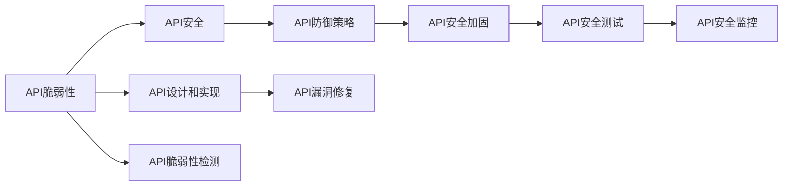
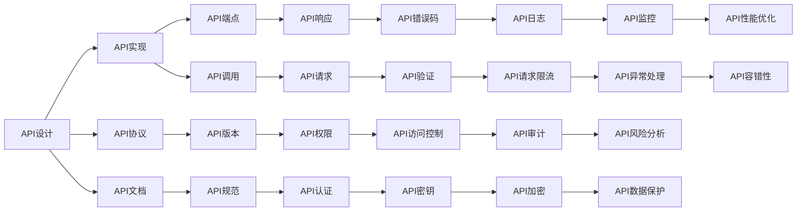
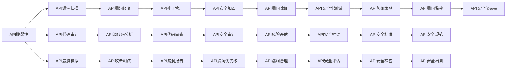

                 

# 定期检查 OWASP API 安全风险清单

> 关键词：API安全，API脆弱性，OWASP Top 10，API防御策略，API测试

## 1. 背景介绍

### 1.1 问题由来
随着API的广泛应用，API安全问题也日益凸显。特别是，很多企业通过API提供其核心业务功能，一旦这些API被攻击，可能会造成严重损失。据统计，80%的安全攻击都针对API，而大部分企业对于API的安全防范意识和技术手段不足，使得API成为网络攻击的重灾区。因此，系统性地识别API安全风险，并采取有效防御策略，成为当前亟待解决的问题。

### 1.2 问题核心关键点
本文聚焦于API安全风险的识别和防范，以OWASP的Top 10作为核心框架，详细阐述了API常见安全问题、脆弱性和防范策略，旨在帮助开发者提升API安全性，减少潜在风险。

### 1.3 问题研究意义
深入理解API安全风险，有助于企业构建安全、可靠的API服务体系，保护关键业务和数据，提升用户信任度和满意度。同时，持续监测API安全状况，可以及时发现并修补安全漏洞，保障业务连续性和安全性。

## 2. 核心概念与联系

### 2.1 核心概念概述

- API（Application Programming Interface）：应用程序接口，定义了软件组件之间如何交互的方式和规范。
- OWASP（Open Web Application Security Project）：开放网络应用安全项目，提供了一系列安全指南、工具和标准，帮助开发者构建安全的应用。
- OWASP Top 10：由OWASP社区定期发布的十大常见网络安全风险，包括身份验证、授权、敏感数据泄露等，是指导企业进行安全风险评估的重要参考。
- API脆弱性：API在设计和实现过程中，可能存在的安全漏洞和风险。
- API防御策略：针对API脆弱性的防范措施，包括技术手段和最佳实践。

这些概念之间的关系可以通过以下Mermaid流程图来展示：



这个流程图展示了大规模API应用中的关键安全环节，从API脆弱性的识别到防御策略的制定，再到测试、监控和修复的完整流程。

### 2.2 概念间的关系

这些核心概念之间存在着紧密的联系，形成了API安全的完整框架。下面我们通过几个Mermaid流程图来展示这些概念之间的关系。

#### 2.2.1 API设计和实现



这个流程图展示了API设计和实现过程中，需要考虑的安全要素和防范措施。API的设计和实现，包括API协议、版本、端点、文档、规范、权限、认证、密钥、错误码、验证、访问控制、加密、日志、限流、审计、异常处理、风险分析、数据保护、性能优化和容错性等。

#### 2.2.2 API脆弱性检测



这个流程图展示了API脆弱性检测和防范的流程。API脆弱性检测包括API漏洞扫描、代码审计、威胁模拟等，检测结果用于漏洞修复、补丁管理、安全加固、审计、风险评估等环节，最终形成API防御策略和安全规范。

#### 2.2.3 API防御策略

```mermaid
graph LR
    A[API脆弱性] --> B[API防御策略]
    A --> C[API身份验证]
    A --> D[API授权控制]
    B --> E[API认证机制]
    B --> F[API访问控制]
    B --> G[API安全审计]
    B --> H[API密钥管理]
    C --> I[API用户认证]
    C --> J[API角色管理]
    D --> K[API权限管理]
    D --> L[APIAPI代理]
    E --> M[APIOAuth2]
    E --> N[APISSO]
    F --> O[API权限验证]
    F --> P[API访问限制]
    G --> Q[API审计日志]
    H --> R[API密钥生命周期管理]
    I --> S[API多因素认证]
    J --> T[API角色授权]
    K --> U[API权限层级]
    L --> V[APIAPI网关]
    M --> W[APIOAuth2验证]
    M --> X[APIOAuth2刷新]
    N --> Y[APISSO登录]
    N --> Z[APISSO认证]
    O --> AA[API授权框架]
    P --> AB[API访问策略]
    Q --> AC[API审计策略]
    R --> AD[API密钥管理策略]
    S --> AE[API多因素认证策略]
    T --> AF[API角色授权策略]
    U --> AG[API权限管理策略]
    V --> AH[APIAPI网关配置]
    W --> AI[APIOAuth2授权]
    X --> AJ[APIOAuth2刷新机制]
    Y --> AK[APISSO身份验证]
    Y --> AL[APISSO认证机制]
    AA --> AM[API授权逻辑]
    AB --> AN[API访问策略实现]
    AC --> AO[API审计策略实现]
    AD --> AP[API密钥管理策略实现]
    AE --> AQ[API多因素认证策略实现]
    AF --> AR[API角色授权策略实现]
    AG --> AS[API权限管理策略实现]
    AH --> AT[APIAPI网关配置策略]
    AI --> AU[APIOAuth2授权策略]
    AJ --> AV[APIOAuth2刷新机制策略]
    AK --> AW[APISSO身份验证策略]
    AL --> AX[APISSO认证机制策略]
    AM --> AY[API授权机制]
    AN --> AZ[API访问策略实现]
    AO --> BA[API审计策略实现]
    AP --> BB[API权限管理策略实现]
    AQ --> BC[API多因素认证策略实现]
    AR --> BD[API角色授权策略实现]
    AS --> BE[API权限管理策略实现]
    AT --> BF[APIAPI网关配置策略]
    AU --> BG[APIOAuth2授权策略]
    AV --> BH[APIOAuth2刷新机制策略]
    AW --> BI[APISSO身份验证策略]
    AX --> BJ[APISSO认证机制策略]
    AY --> BM[API授权机制]
    AZ --> BN[API访问策略实现]
    BA --> BO[API审计策略实现]
    BB --> BP[API权限管理策略实现]
    BC --> BQ[API多因素认证策略实现]
    BD --> BR[API角色授权策略实现]
    BE --> BS[API权限管理策略实现]
    BF --> BT[APIAPI网关配置策略]
    BG --> BU[APIOAuth2授权策略]
    BH --> BV[APIOAuth2刷新机制策略]
    BI --> BW[APISSO身份验证策略]
    BJ --> BX[APISSO认证机制策略]
    BM --> BY[API授权机制]
    BN --> BZ[API访问策略实现]
    BO --> CA[API审计策略实现]
    BP --> CB[API权限管理策略实现]
    BQ --> CC[API多因素认证策略实现]
    BR --> CD[API角色授权策略实现]
    BS --> CE[API权限管理策略实现]
    BT --> CF[APIAPI网关配置策略]
    BU --> CV[APIOAuth2授权策略]
    BV --> CW[APIOAuth2刷新机制策略]
    BW --> DX[APISSO身份验证策略]
    BX --> DY[APISSO认证机制策略]
    BY --> EY[API授权机制]
    BZ --> EZ[API访问策略实现]
    CA --> EB[API审计策略实现]
    CB --> EC[API权限管理策略实现]
    CC --> ED[API多因素认证策略实现]
    CD --> EE[API角色授权策略实现]
    CE --> EF[API权限管理策略实现]
    CF --> EG[APIAPI网关配置策略]
    CV --> EH[APIOAuth2授权策略]
    CW --> EI[APIOAuth2刷新机制策略]
    DX --> EJ[APISSO身份验证策略]
    DY --> EK[APISSO认证机制策略]
    EY --> EM[API授权机制]
    EZ --> EN[API访问策略实现]
    EB --> EO[API审计策略实现]
    EC --> EP[API权限管理策略实现]
    ED --> EQ[API多因素认证策略实现]
    EE --> ER[API角色授权策略实现]
    EF --> ES[API权限管理策略实现]
    EG --> ET[APIAPI网关配置策略]
    EH --> EU[APIOAuth2授权策略]
    EI --> EV[APIOAuth2刷新机制策略]
    EJ --> EX[APISSO身份验证策略]
    EK --> EY[APISSO认证机制策略]
    EM --> EZ[API授权机制]
    EN --> EA[API访问策略实现]
    EO --> EB[API审计策略实现]
    EP --> EC[API权限管理策略实现]
    EQ --> ED[API多因素认证策略实现]
    ER --> EF[API角色授权策略实现]
    ES --> EH[API权限管理策略实现]
    ET --> EU[APIAPI网关配置策略]
    EU --> EV[APIOAuth2授权策略]
    EV --> EX[APIOAuth2刷新机制策略]
    EX --> EY[APISSO身份验证策略]
    EY --> EZ[APISSO认证机制策略]
    EZ --> EW[API访问策略实现]
    EA --> EB[API审计策略实现]
    EB --> EC[API权限管理策略实现]
    EC --> ED[API多因素认证策略实现]
    ED --> EE[API角色授权策略实现]
    EE --> EF[API权限管理策略实现]
    EF --> EG[APIAPI网关配置策略]
    EG --> EH[APIOAuth2授权策略]
    EH --> EI[APIOAuth2刷新机制策略]
    EI --> EJ[APISSO身份验证策略]
    EJ --> EK[APISSO认证机制策略]
    EK --> EL[API授权机制]
    EL --> EM[API访问策略实现]
    EM --> EN[API审计策略实现]
    EN --> EO[API权限管理策略实现]
    EO --> EP[API多因素认证策略实现]
    EP --> EQ[API角色授权策略实现]
    EQ --> ER[API权限管理策略实现]
    ER --> ES[API角色授权策略实现]
    ES --> ET[API权限管理策略实现]
    ET --> EU[APIAPI网关配置策略]
    EU --> EV[APIOAuth2授权策略]
    EV --> EX[APIOAuth2刷新机制策略]
    EX --> EY[APISSO身份验证策略]
    EY --> EZ[APISSO认证机制策略]
    EZ --> EW[API访问策略实现]
    EB --> EC[API审计策略实现]
    EC --> ED[API权限管理策略实现]
    ED --> EE[API多因素认证策略实现]
    EE --> EF[API角色授权策略实现]
    EF --> EG[API权限管理策略实现]
    EG --> EH[APIAPI网关配置策略]
    EH --> EU[APIOAuth2授权策略]
    EU --> EV[APIOAuth2刷新机制策略]
    EV --> EX[APIOAuth2授权策略]
    EX --> EY[APIOAuth2刷新机制策略]
    EY --> EZ[APIOAuth2刷新机制策略]
    EZ --> EW[API访问策略实现]
    EB --> EC[API审计策略实现]
    EC --> ED[API权限管理策略实现]
    ED --> EE[API多因素认证策略实现]
    EE --> EF[API角色授权策略实现]
    EF --> EG[API权限管理策略实现]
    EG --> EH[APIAPI网关配置策略]
    EH --> EU[APIOAuth2授权策略]
    EU --> EV[APIOAuth2刷新机制策略]
    EV --> EX[APIOAuth2授权策略]
    EX --> EY[APIOAuth2刷新机制策略]
    EY --> EZ[APIOAuth2刷新机制策略]
    EZ --> EW[API访问策略实现]
    EB --> EC[API审计策略实现]
    EC --> ED[API权限管理策略实现]
    ED --> EE[API多因素认证策略实现]
    EE --> EF[API角色授权策略实现]
    EF --> EG[API权限管理策略实现]
    EG --> EH[APIAPI网关配置策略]
    EH --> EU[APIOAuth2授权策略]
    EU --> EV[APIOAuth2刷新机制策略]
    EV --> EX[APIOAuth2授权策略]
    EX --> EY[APIOAuth2刷新机制策略]
    EY --> EZ[APIOAuth2刷新机制策略]
    EZ --> EW[API访问策略实现]
    EB --> EC[API审计策略实现]
    EC --> ED[API权限管理策略实现]
    ED --> EE[API多因素认证策略实现]
    EE --> EF[API角色授权策略实现]
    EF --> EG[API权限管理策略实现]
    EG --> EH[APIAPI网关配置策略]
    EH --> EU[APIOAuth2授权策略]
    EU --> EV[APIOAuth2刷新机制策略]
    EV --> EX[APIOAuth2授权策略]
    EX --> EY[APIOAuth2刷新机制策略]
    EY --> EZ[APIOAuth2刷新机制策略]
    EZ --> EW[API访问策略实现]
    EB --> EC[API审计策略实现]
    EC --> ED[API权限管理策略实现]
    ED --> EE[API多因素认证策略实现]
    EE --> EF[API角色授权策略实现]
    EF --> EG[API权限管理策略实现]
    EG --> EH[APIAPI网关配置策略]
    EH --> EU[APIOAuth2授权策略]
    EU --> EV[APIOAuth2刷新机制策略]
    EV --> EX[APIOAuth2授权策略]
    EX --> EY[APIOAuth2刷新机制策略]
    EY --> EZ[APIOAuth2刷新机制策略]
    EZ --> EW[API访问策略实现]
    EB --> EC[API审计策略实现]
    EC --> ED[API权限管理策略实现]
    ED --> EE[API多因素认证策略实现]
    EE --> EF[API角色授权策略实现]
    EF --> EG[API权限管理策略实现]
    EG --> EH[APIAPI网关配置策略]
    EH --> EU[APIOAuth2授权策略]
    EU --> EV[APIOAuth2刷新机制策略]
    EV --> EX[APIOAuth2授权策略]
    EX --> EY[APIOAuth2刷新机制策略]
    EY --> EZ[APIOAuth2刷新机制策略]
    EZ --> EW[API访问策略实现]
    EB --> EC[API审计策略实现]
    EC --> ED[API权限管理策略实现]
    ED --> EE[API多因素认证策略实现]
    EE --> EF[API角色授权策略实现]
    EF --> EG[API权限管理策略实现]
    EG --> EH[APIAPI网关配置策略]
    EH --> EU[APIOAuth2授权策略]
    EU --> EV[APIOAuth2刷新机制策略]
    EV --> EX[APIOAuth2授权策略]
    EX --> EY[APIOAuth2刷新机制策略]
    EY --> EZ[APIOAuth2刷新机制策略]
    EZ --> EW[API访问策略实现]
    EB --> EC[API审计策略实现]
    EC --> ED[API权限管理策略实现]
    ED --> EE[API多因素认证策略实现]
    EE --> EF[API角色授权策略实现]
    EF --> EG[API权限管理策略实现]
    EG --> EH[APIAPI网关配置策略]
    EH --> EU[APIOAuth2授权策略]
    EU --> EV[APIOAuth2刷新机制策略]
    EV --> EX[APIOAuth2授权策略]
    EX --> EY[APIOAuth2刷新机制策略]
    EY --> EZ[APIOAuth2刷新机制策略]
    EZ --> EW[API访问策略实现]
    EB --> EC[API审计策略实现]
    EC --> ED[API权限管理策略实现]
    ED --> EE[API多因素认证策略实现]
    EE --> EF[API角色授权策略实现]
    EF --> EG[API权限管理策略实现]
    EG --> EH[APIAPI网关配置策略]
    EH --> EU[APIOAuth2授权策略]
    EU --> EV[APIOAuth2刷新机制策略]
    EV --> EX[APIOAuth2授权策略]
    EX --> EY[APIOAuth2刷新机制策略]
    EY --> EZ[APIOAuth2刷新机制策略]
    EZ --> EW[API访问策略实现]
    EB --> EC[API审计策略实现]
    EC --> ED[API权限管理策略实现]
    ED --> EE[API多因素认证策略实现]
    EE --> EF[API角色授权策略实现]
    EF --> EG[API权限管理策略实现]
    EG --> EH[APIAPI网关配置策略]
    EH --> EU[APIOAuth2授权策略]
    EU --> EV[APIOAuth2刷新机制策略]
    EV --> EX[APIOAuth2授权策略]
    EX --> EY[APIOAuth2刷新机制策略]
    EY --> EZ[APIOAuth2刷新机制策略]
    EZ --> EW[API访问策略实现]
    EB --> EC[API审计策略实现]
    EC --> ED[API权限管理策略实现]
    ED --> EE[API多因素认证策略实现]
    EE --> EF[API角色授权策略实现]
    EF --> EG[API权限管理策略实现]
    EG --> EH[APIAPI网关配置策略]
    EH --> EU[APIOAuth2授权策略]
    EU --> EV[APIOAuth2刷新机制策略]
    EV --> EX[APIOAuth2授权策略]
    EX --> EY[APIOAuth2刷新机制策略]
    EY --> EZ[APIOAuth2刷新机制策略]
    EZ --> EW[API访问策略实现]
    EB --> EC[API审计策略实现]
    EC --> ED[API权限管理策略实现]
    ED --> EE[API多因素认证策略实现]
    EE --> EF[API角色授权策略实现]
    EF --> EG[API权限管理策略实现]
    EG --> EH[APIAPI网关配置策略]
    EH --> EU[APIOAuth2授权策略]
    EU --> EV[APIOAuth2刷新机制策略]
    EV --> EX[APIOAuth2授权策略]
    EX --> EY[APIOAuth2刷新机制策略]
    EY --> EZ[APIOAuth2刷新机制策略]
    EZ --> EW[API访问策略实现]
    EB --> EC[API审计策略实现]
    EC --> ED[API权限管理策略实现]
    ED --> EE[API多因素认证策略实现]
    EE --> EF[API角色授权策略实现]
    EF --> EG[API权限管理策略实现]
    EG --> EH[APIAPI网关配置策略]
    EH --> EU[APIOAuth2授权策略]
    EU --> EV[APIOAuth2刷新机制策略]
    EV --> EX[APIOAuth2授权策略]
    EX --> EY[APIOAuth2刷新机制策略]
    EY --> EZ[APIOAuth2刷新机制策略]
    EZ --> EW[API访问策略实现]
    EB --> EC[API审计策略实现]
    EC --> ED[API权限管理策略实现]
    ED --> EE[API多因素认证策略实现]
    EE --> EF[API角色授权策略实现]
    EF --> EG[API权限管理策略实现]
    EG --> EH[APIAPI网关配置策略]
    EH --> EU[APIOAuth2授权策略]
    EU --> EV[APIOAuth2刷新机制策略]
    EV --> EX[APIOAuth2授权策略]
    EX --> EY[APIOAuth2刷新机制策略]
    EY --> EZ[APIOAuth2刷新机制策略]
    EZ --> EW[API访问策略实现]
    EB --> EC[API审计策略实现]
    EC --> ED[API权限管理策略实现]
    ED --> EE[API多因素认证策略实现]
    EE --> EF[API角色授权策略实现]
    EF --> EG[API权限管理策略实现]
    EG --> EH[APIAPI网关配置策略]
    EH --> EU[APIOAuth2授权策略]
    EU --> EV[APIOAuth2刷新机制策略]
    EV --> EX[APIOAuth2授权策略]
    EX --> EY[APIOAuth2刷新机制策略]
    EY --> EZ[APIOAuth2刷新机制策略]
    EZ --> EW[API访问策略实现]
    EB --> EC[API审计策略实现]
    EC --> ED[API权限管理策略实现]
    ED --> EE[API多因素认证策略实现]
    EE --> EF[API角色授权策略实现]
    EF --> EG[API权限管理策略实现]
    EG --> EH[APIAPI网关配置策略]
    EH --> EU[APIOAuth2授权策略]
    EU --> EV[APIOAuth2刷新机制策略]
    EV --> EX[APIOAuth2授权策略]
    EX --> EY[APIOAuth2刷新机制策略]
    EY --> EZ[APIOAuth2刷新机制策略]
    EZ --> EW[API访问策略实现]
    EB --> EC[API审计策略实现]
    EC --> ED[API权限管理策略实现]
    ED --> EE[API多因素认证策略实现]
    EE --> EF[API角色授权策略实现]
    EF --> EG[API权限管理策略实现]
    EG --> EH[APIAPI网关配置策略]
    EH --> EU[APIOAuth2授权策略]
    EU --> EV[APIOAuth2刷新机制策略]
    EV --> EX[APIOAuth2授权策略]
    EX --> EY[APIOAuth2刷新机制策略]
    EY --> EZ[APIOAuth2刷新机制策略]
    EZ --> EW[API访问策略实现]
    EB --> EC[API审计策略实现]
    EC --> ED[API权限管理策略实现]
    ED --> EE[API多因素认证策略实现]
    EE --> EF[API角色授权策略实现]
    EF --> EG[API权限管理策略实现]
    EG --> EH[APIAPI网关配置策略]
    EH --> EU[APIOAuth2授权策略]
    EU --> EV[APIOAuth2刷新机制策略]
    EV --> EX[APIOAuth2授权策略]
    EX --> EY[APIOAuth2刷新机制策略]
    EY --> EZ[APIOAuth2刷新机制策略]
    EZ --> EW[API访问策略实现]
    EB --> EC[API审计策略实现]
    EC --> ED[API权限管理策略实现]
    ED --> EE[API多因素认证策略实现]
    EE --> EF[API角色授权策略实现]
    EF --> EG[API权限管理策略实现]
    EG --> EH[APIAPI网关配置策略]
    EH --> EU[APIOAuth2授权策略]
    EU --> EV[APIOAuth2刷新机制策略]
    EV --> EX[APIOAuth2授权策略]
    EX --> EY[APIOAuth2刷新机制策略]
    EY --> EZ[APIOAuth2刷新机制策略]
    EZ --> EW[API访问策略实现]
    EB --> EC[API审计策略实现]
    EC --> ED[API权限管理策略实现]
    ED --> EE[API多因素认证策略实现]
    EE --> EF[API角色授权策略实现]
    EF --> EG[API权限管理策略实现]
    EG --> EH[APIAPI网关配置策略]
    EH --> EU[APIOAuth2授权策略]
    EU --> EV[APIOAuth2刷新机制策略]
    EV --> EX[APIOAuth2授权策略]
    EX --> EY[APIOAuth2刷新机制策略]
    EY --> EZ[APIOAuth2刷新机制策略]
    EZ --> EW[API访问策略实现]
    EB --> EC[API审计策略实现]
    EC --> ED[API权限管理策略实现]
    ED --> EE[API多因素认证策略实现]
    EE --> EF[API角色授权策略实现]
    EF --> EG[API权限管理策略实现]
    EG --> EH[APIAPI网关配置策略]
    EH --> EU[APIOAuth2授权策略]
    EU --> EV[APIOAuth2刷新机制策略]
    EV --> EX[APIOAuth2授权策略]
    EX --> EY[APIOAuth2刷新机制策略]
    EY --> EZ[APIOAuth2刷新机制策略]
    EZ --> EW[API访问策略实现]
    EB --> EC[API审计策略实现]
    EC --> ED[API权限管理策略实现]
    ED

