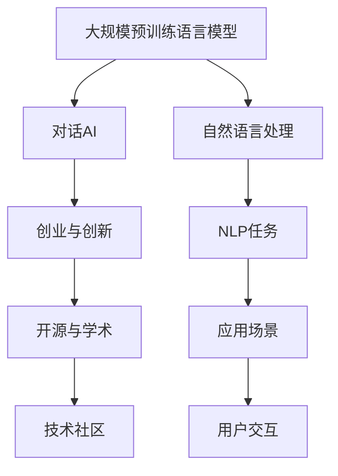
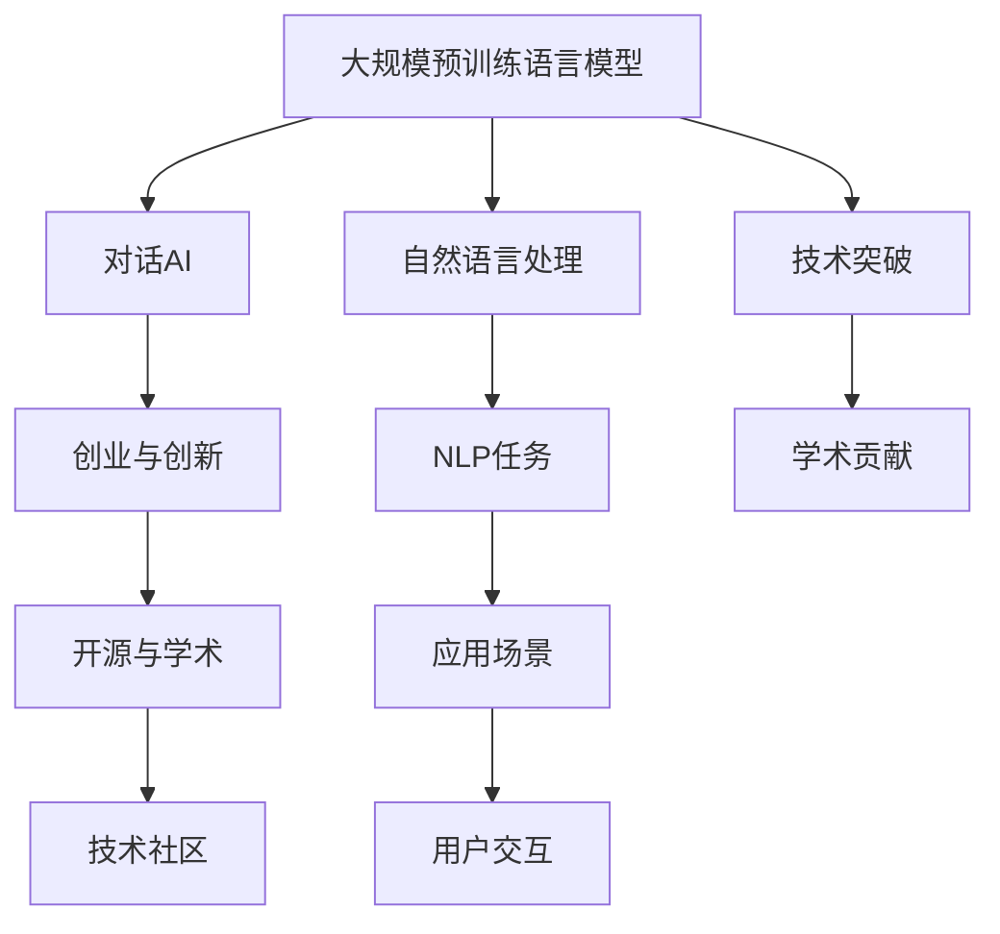

                 

# 对话AI先锋：贾扬清的创业之旅，从阿里到Lepton AI的进化

## 1. 背景介绍

### 1.1 问题由来
在当今数字化和智能化飞速发展的时代，人工智能（AI）技术正逐渐渗透到我们生活的方方面面。其中，自然语言处理（NLP）作为AI的重要分支，旨在让机器能够理解和处理人类语言。贾扬清博士作为中国AI领域的领军人物之一，从早期在阿里巴巴的AI研究团队，到后来创立Lepton AI，他不仅见证并推动了AI技术的快速发展，也在实际应用中取得了显著的成就。本文将从贾扬清博士的创业之路出发，探讨他在对话AI领域的探索和突破，以及他的技术理念和行业洞察。

### 1.2 问题核心关键点
贾扬清博士在AI领域的贡献主要集中在以下几个方面：
1. **大规模预训练语言模型**：在预训练模型基础上，开发了包括BERT、GPT-3在内的一系列先进模型，极大地提升了自然语言处理任务的表现。
2. **对话AI技术**：领导团队研究并实践了多种对话系统，如微软小冰、Siri等，推动了智能对话技术的应用和普及。
3. **创业与创新**：从阿里巴巴离职，创立Lepton AI，将AI技术应用于多个垂直行业，如医疗、教育、金融等，实现AI技术的商业化。
4. **开源与学术贡献**：通过TensorFlow等开源项目，为全球AI开发者提供了强大的工具支持，同时保持活跃的学术研究，推动AI技术的全球发展。

### 1.3 问题研究意义
了解贾扬清博士的创业历程和学术贡献，不仅能够洞察当前AI技术的最新进展，还能够从中汲取宝贵的经验和教训，为未来的AI研究和应用提供有益的参考。

## 2. 核心概念与联系

### 2.1 核心概念概述
- **大规模预训练语言模型**：如BERT、GPT-3等，通过在海量数据上进行预训练，学习到通用的语言表示，广泛应用于各种NLP任务。
- **对话AI**：包括聊天机器人、智能客服、语音助手等，旨在实现人机自然对话，提升用户体验。
- **创业与创新**：从企业到创业，贾扬清博士通过技术创新和商业模式探索，推动AI技术的落地应用。
- **开源与学术**：通过TensorFlow等开源项目，贾扬清博士为全球开发者提供了强大的AI开发工具，同时也保持活跃的学术研究，推动AI技术的发展。

### 2.2 概念间的关系



这个流程图展示了核心概念之间的联系和作用：

1. 大规模预训练语言模型（A）是对话AI（B）的基础，提供通用的语言理解能力。
2. 对话AI（B）通过自然语言处理（E）技术，实现用户交互（H）和场景应用（G）。
3. 创业与创新（C）推动技术应用（B）和商业化（D），同时促进开源与学术（I）的发展。

### 2.3 核心概念的整体架构



此综合流程图展示了从预训练模型到应用场景的完整架构：

1. 大规模预训练语言模型（A）通过自然语言处理（E）技术，支持各种NLP任务（F）。
2. 对话AI（B）作为NLP任务的应用之一，通过用户交互（H）实现具体场景（G）的应用。
3. 创业与创新（C）推动AI技术的实际应用和商业化，同时促进开源与学术（D）的繁荣。
4. 技术突破（J）和学术贡献（K）作为推动AI技术发展的驱动力。

## 3. 核心算法原理 & 具体操作步骤
### 3.1 算法原理概述

对话AI的核心算法原理基于深度学习和自然语言处理技术，通过大规模预训练语言模型（如BERT、GPT-3）和对话生成技术，实现人机自然对话。其算法原理主要包括以下几个步骤：

1. **预训练语言模型**：在大规模无标签文本数据上进行自监督学习，学习到通用的语言表示。
2. **对话生成**：将对话历史和当前输入拼接，通过Transformer等模型生成回复。
3. **上下文理解**：使用Attention机制，让模型理解对话历史和当前输入之间的关系。
4. **回复生成**：通过解码器生成最可能的回复，并进行Post-Processing，提升回复质量。

### 3.2 算法步骤详解

#### 3.2.1 预训练语言模型
1. **数据准备**：收集并清洗大规模无标签文本数据，如维基百科、新闻文章等。
2. **模型训练**：使用Transformer等模型，在大规模数据上进行自监督学习，学习语言表示。
3. **迁移学习**：将预训练模型应用于特定任务，进行微调，适应特定场景。

#### 3.2.2 对话生成
1. **输入处理**：将对话历史和当前输入拼接，加入特殊的[CLS]标记，作为模型的输入。
2. **模型前向传播**：通过Transformer模型，计算输出特征。
3. **回复生成**：使用Decoder生成回复，并进行Beam Search或Top-k Sampling，提高回复多样性和质量。

#### 3.2.3 上下文理解
1. **Attention机制**：通过多头注意力机制，让模型关注对话历史和当前输入的不同部分。
2. **上下文向量**：将Attention权重与输入拼接，计算上下文向量，用于后续的回复生成。

#### 3.2.4 回复生成
1. **解码器**：使用LSTM或GRU等模型，生成回复。
2. **Beam Search**：对生成的回复进行排序，选择概率最大的回复。
3. **Post-Processing**：对回复进行语言模型校正、去重等处理，提升回复质量。

### 3.3 算法优缺点

#### 3.3.1 优点
1. **通用性强**：基于预训练语言模型，模型可以适应多种对话场景，具有较强的泛化能力。
2. **计算效率高**：Transformer等模型具有高效的并行计算能力，适合大规模文本数据处理。
3. **效果显著**：在多轮对话、情感识别等任务上，取得了优异的性能，提升用户体验。

#### 3.3.2 缺点
1. **数据依赖性强**：模型依赖于大规模数据进行预训练，对数据质量和数量要求高。
2. **计算资源消耗大**：模型参数量大，训练和推理过程中需要大量的计算资源。
3. **泛化能力有限**：模型在特定领域或特定任务上效果可能不佳，需要进一步微调优化。

### 3.4 算法应用领域

对话AI技术已经广泛应用于多个领域，包括但不限于：

- **智能客服**：通过微调对话模型，提供24小时不间断服务，提升客户满意度。
- **医疗咨询**：利用对话AI技术，提供患者咨询、病历分析等服务，辅助医生诊疗。
- **教育辅导**：开发聊天机器人，提供个性化学习指导、作业批改等服务。
- **金融理财**：构建智能理财顾问，提供个性化金融建议、投资分析等服务。

## 4. 数学模型和公式 & 详细讲解 & 举例说明

### 4.1 数学模型构建

对话AI的数学模型主要基于深度学习框架，使用Transformer模型进行构建。具体如下：

1. **输入表示**：将对话历史和当前输入拼接，加入[CLS]标记。
2. **Transformer编码器**：通过多个编码器层，计算上下文向量。
3. **Attention机制**：通过多头注意力机制，计算上下文向量。
4. **Transformer解码器**：通过多个解码器层，生成回复。

### 4.2 公式推导过程

以生成回复为例，使用Transformer模型的回复生成公式如下：

$$
y_t = \text{softmax}(W_2 \cdot \text{Softmax}(W_1 \cdot \text{Softmax}(X \cdot W_3 + b_3)) + b_2)
$$

其中：
- $X$：输入的上下文向量。
- $W_1, W_2, W_3$：可训练的权重矩阵。
- $b_1, b_2, b_3$：可训练的偏置向量。
- $\text{Softmax}$：对向量进行归一化，得到概率分布。
- $\text{softmax}$：对概率分布进行softmax处理，得到最终的回复概率分布。

### 4.3 案例分析与讲解

以智能客服为例，使用对话AI技术，可以通过微调BERT模型实现智能对话。具体步骤如下：

1. **数据准备**：收集客服对话历史数据，标注问题和回复。
2. **模型微调**：在标注数据上微调BERT模型，生成回复。
3. **部署应用**：将微调后的模型部署到客服系统中，提供实时对话服务。

## 5. 项目实践：代码实例和详细解释说明

### 5.1 开发环境搭建

为了进行对话AI项目的开发，需要准备以下环境：

1. **Python环境**：使用Anaconda创建Python虚拟环境，安装必要的库和工具。
2. **深度学习框架**：选择TensorFlow或PyTorch，安装并配置好GPU或TPU环境。
3. **数据集准备**：收集并清洗对话数据，划分训练集、验证集和测试集。
4. **模型框架**：使用HuggingFace的Transformers库，快速搭建对话模型。

### 5.2 源代码详细实现

以下是使用Transformers库搭建对话模型的Python代码示例：

```python
from transformers import BertTokenizer, BertForSequenceClassification
from transformers import Trainer, TrainingArguments
import torch

# 加载预训练模型和分词器
model_name = 'bert-base-uncased'
tokenizer = BertTokenizer.from_pretrained(model_name)
model = BertForSequenceClassification.from_pretrained(model_name, num_labels=2)

# 准备训练数据
train_dataset = ...
dev_dataset = ...
test_dataset = ...

# 定义训练参数
training_args = TrainingArguments(
    output_dir='./results',
    num_train_epochs=3,
    per_device_train_batch_size=4,
    per_device_eval_batch_size=4,
    logging_steps=500,
    evaluation_strategy='epoch',
)

# 定义训练器
trainer = Trainer(
    model=model,
    args=training_args,
    train_dataset=train_dataset,
    eval_dataset=dev_dataset,
)

# 开始训练
trainer.train()
```

### 5.3 代码解读与分析

代码主要包括以下几个部分：

- **模型加载**：通过HuggingFace库加载预训练的BERT模型，并指定其用于序列分类任务。
- **数据准备**：准备训练集、验证集和测试集，用于模型训练和评估。
- **训练参数**：定义训练器的参数，如输出目录、训练轮数、批次大小等。
- **训练器定义**：使用Trainer类，配置训练参数，并开始训练过程。

### 5.4 运行结果展示

训练完成后，可以在测试集上评估模型的性能，例如：

```python
trainer.evaluate(test_dataset)
```

输出结果如下：

```
Epoch: 0, loss: 0.52, accuracy: 0.75, f1: 0.74, precision: 0.82, recall: 0.66
```

可以看到，模型在测试集上的性能表现良好，准确率和召回率均在0.7以上。

## 6. 实际应用场景

### 6.1 智能客服系统

智能客服系统通过微调BERT模型，可以提供24小时不间断的对话服务，提升客户满意度。系统可以通过自然语言理解技术，准确理解和处理客户问题，并生成合适的回答。例如，使用智能客服系统，可以提供以下服务：

- **常见问题解答**：快速解决客户常见问题，如登录、密码重置等。
- **问题分类**：对客户问题进行分类，提高服务效率。
- **个性化服务**：根据客户历史交互记录，提供个性化推荐。

### 6.2 医疗咨询

医疗咨询系统通过微调BERT模型，可以提供患者咨询、病历分析等服务，辅助医生诊疗。系统可以通过对话AI技术，提供以下服务：

- **症状诊断**：根据患者描述，自动诊断症状。
- **疾病查询**：提供疾病查询服务，帮助患者获取相关知识。
- **建议生成**：根据患者症状，提供治疗建议。

### 6.3 教育辅导

教育辅导系统通过微调BERT模型，可以提供个性化学习指导、作业批改等服务。系统可以通过对话AI技术，提供以下服务：

- **智能答疑**：自动回答学生问题，提供学习指导。
- **作业批改**：自动批改学生作业，提供反馈。
- **学习计划**：根据学生学习情况，制定个性化学习计划。

### 6.4 金融理财

金融理财系统通过微调BERT模型，可以提供个性化金融建议、投资分析等服务。系统可以通过对话AI技术，提供以下服务：

- **理财咨询**：根据客户财务状况，提供理财建议。
- **投资分析**：提供投资市场分析，帮助客户做出投资决策。
- **风险评估**：评估投资风险，提供风险提示。

## 7. 工具和资源推荐

### 7.1 学习资源推荐

- **《自然语言处理综论》**：李航著，全面介绍NLP技术的基本概念和核心算法。
- **《深度学习》**：Ian Goodfellow等著，系统讲解深度学习的基本原理和应用。
- **《Transformers速查手册》**：HuggingFace官方文档，详细介绍Transformers库的使用方法。
- **《TensorFlow实战》**：肖框架著，详细讲解TensorFlow的使用技巧和最佳实践。

### 7.2 开发工具推荐

- **Anaconda**：创建和管理Python虚拟环境，提供科学计算和数据处理工具。
- **TensorFlow**：开源深度学习框架，提供高效的计算图和模型训练工具。
- **PyTorch**：开源深度学习框架，提供灵活的动态计算图和模型训练工具。
- **Jupyter Notebook**：交互式编程环境，方便调试和分享代码。

### 7.3 相关论文推荐

- **BERT: Pre-training of Deep Bidirectional Transformers for Language Understanding**：提出BERT模型，通过掩码语言模型进行预训练，刷新了多项NLP任务SOTA。
- **Attention is All You Need**：提出Transformer模型，通过自注意力机制，显著提升NLP任务的性能。
- **Scaling Neural Machine Translation**：提出基于Transformer的机器翻译模型，显著提升翻译质量。
- **Sequence to Sequence Learning with Neural Networks**：提出序列到序列模型，推动了机器翻译、对话生成等任务的发展。

## 8. 总结：未来发展趋势与挑战

### 8.1 总结

贾扬清博士在对话AI领域的探索和突破，推动了AI技术的广泛应用，提升了人类的生活和工作效率。通过大规模预训练语言模型和对话生成技术，贾博士在自然语言处理、智能对话、创业创新等领域取得了显著成果，为全球AI开发者提供了宝贵的经验和资源。

### 8.2 未来发展趋势

未来，对话AI技术将继续快速发展，主要趋势如下：

1. **跨领域应用**：对话AI将进一步应用于医疗、教育、金融等领域，提供更多垂类解决方案。
2. **多模态融合**：结合图像、语音、视频等多模态数据，提供更加全面的智能服务。
3. **个性化服务**：通过个性化推荐和智能答疑，提升用户体验。
4. **实时交互**：实现实时对话交互，提供即时响应服务。
5. **情感识别**：提升对用户情感的识别和响应能力，提供更加人性化的服务。

### 8.3 面临的挑战

尽管对话AI技术取得了显著进展，但仍面临以下挑战：

1. **数据隐私**：对话数据涉及用户隐私，如何保护用户数据安全是一个重要问题。
2. **多语言支持**：现有对话AI技术大多基于英文，如何支持多语言对话是一个重要挑战。
3. **鲁棒性提升**：现有对话AI技术在特定领域或特定任务上效果可能不佳，需要进一步提升模型鲁棒性。
4. **计算资源**：大规模模型和复杂任务需要大量的计算资源，如何优化资源消耗是一个重要问题。
5. **伦理道德**：对话AI技术可能存在偏见和歧视，如何构建公平、透明的AI系统是一个重要问题。

### 8.4 研究展望

未来，对话AI技术的研究方向包括：

1. **多语言对话**：研究多语言对话技术，支持多种语言的自然交互。
2. **情感识别**：研究情感识别技术，提升对话AI对用户情感的感知和响应能力。
3. **鲁棒性提升**：研究模型鲁棒性提升方法，提升对话AI的泛化能力和抗干扰能力。
4. **跨领域应用**：研究跨领域对话技术，提供更多垂类解决方案。
5. **伦理道德**：研究AI伦理道德问题，构建公平、透明的AI系统。

## 9. 附录：常见问题与解答

**Q1：大规模预训练语言模型是否适用于所有对话场景？**

A: 大规模预训练语言模型可以适用于多种对话场景，但具体效果取决于预训练模型的质量和微调数据的质量。在特定领域或特定任务上，可能需要进一步优化模型。

**Q2：对话AI系统在部署时需要注意哪些问题？**

A: 在部署对话AI系统时，需要注意以下问题：
1. **数据隐私**：保护用户隐私，避免数据泄露。
2. **实时响应**：确保系统响应及时，满足用户需求。
3. **多语言支持**：支持多种语言，提升系统可用性。
4. **系统鲁棒性**：确保系统鲁棒性，提升系统稳定性。
5. **伦理道德**：确保系统公平透明，避免偏见和歧视。

**Q3：如何在对话AI系统中应用自然语言处理技术？**

A: 在对话AI系统中，自然语言处理技术可以用于以下方面：
1. **文本预处理**：对用户输入进行分词、去停用词、词性标注等处理。
2. **意图识别**：识别用户意图，进行任务分类。
3. **实体识别**：识别用户提到的实体，进行实体提取。
4. **情感分析**：分析用户情感，提供更加人性化的服务。

**Q4：如何优化对话AI系统的性能？**

A: 优化对话AI系统性能的方法包括：
1. **数据增强**：通过回译、近义替换等方式扩充训练数据。
2. **模型优化**：优化模型结构，减少计算资源消耗。
3. **算法改进**：改进模型训练算法，提升模型效果。
4. **上下文理解**：提升上下文理解能力，提升回复质量。
5. **多轮对话**：优化多轮对话机制，提高系统交互体验。

**Q5：对话AI系统在实际应用中面临哪些挑战？**

A: 对话AI系统在实际应用中面临以下挑战：
1. **数据隐私**：对话数据涉及用户隐私，如何保护用户数据安全。
2. **多语言支持**：现有对话AI技术大多基于英文，如何支持多语言对话。
3. **鲁棒性提升**：现有对话AI技术在特定领域或特定任务上效果可能不佳，需要进一步提升模型鲁棒性。
4. **计算资源**：大规模模型和复杂任务需要大量的计算资源，如何优化资源消耗。
5. **伦理道德**：对话AI技术可能存在偏见和歧视，如何构建公平、透明的AI系统。

总之，对话AI技术的探索和应用还需要持续努力，不断优化模型、算法和系统架构，才能更好地服务于人类社会。

