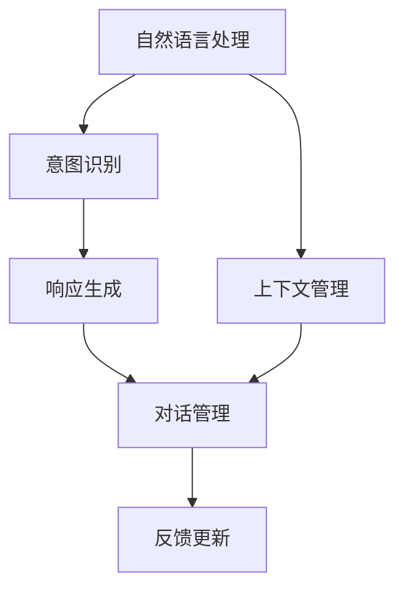

                 

# 对话系统(Chatbots) - 原理与代码实例讲解

## 1. 背景介绍

随着人工智能技术的发展，对话系统(Chatbots)已经成为数字化服务中不可或缺的一部分。无论是客服、咨询、教育，还是娱乐、游戏，对话系统都在不断地提升用户体验和业务效率。本文将从原理、技术实现和应用场景等方面，全面讲解对话系统的构建原理及代码实例，帮助读者深入理解这一前沿技术。

### 1.1 问题由来

对话系统在过去十年中取得了飞速发展，从简单的规则匹配到复杂的深度学习驱动，从单一任务到多任务集成，对话系统已经从实验室研究走向了实际应用。然而，构建高效、智能的对话系统仍然面临着诸多挑战，如理解上下文、处理自然语言的多义性、保持语境连贯性等。因此，本文将重点介绍对话系统的核心算法原理及其实现技术，并通过代码实例，使读者能够快速上手构建自己的对话系统。

## 2. 核心概念与联系

### 2.1 核心概念概述

对话系统主要涉及以下几个关键概念：

- **自然语言处理(NLP)**：对话系统的核心技术之一，用于理解和生成自然语言。
- **对话管理**：用于维护对话上下文，处理用户的意图和语境。
- **意图识别**：从用户输入中识别出用户意图，是对话系统决策的基础。
- **响应生成**：根据用户意图和上下文，生成合适的回复。

这些概念之间存在紧密的联系，共同构成了对话系统的核心架构。以下是一个Mermaid流程图，展示了这些概念之间的联系：



### 2.2 概念间的关系

上述流程图展示了自然语言处理、意图识别、响应生成、对话管理和上下文管理之间的联系。具体来说：

- **自然语言处理(NLP)**：为对话系统提供语言理解的基础，包括分词、词性标注、依存句法分析等。
- **意图识别**：从用户输入中提取出用户意图，并反馈给对话管理模块，用于决策和生成回复。
- **响应生成**：根据意图识别结果和上下文，生成合适的回复，并返回给用户。
- **对话管理**：负责维护对话上下文，处理用户的意图变化和语境连贯性，以及实时的对话控制。
- **上下文管理**：用于记录和管理对话过程中的历史信息和语境信息。

这些模块相互配合，形成了对话系统的核心功能。

## 3. 核心算法原理 & 具体操作步骤

### 3.1 算法原理概述

对话系统的核心算法原理主要包括以下几个步骤：

1. **分词与词性标注**：对用户输入的文本进行分词和词性标注，提取语义特征。
2. **依存句法分析**：分析句子的依存关系，理解句子结构。
3. **意图识别**：从用户输入中提取意图，生成意图表示向量。
4. **对话管理**：根据意图和上下文，选择合适的回复。
5. **响应生成**：根据上下文和回复，生成自然语言文本。

### 3.2 算法步骤详解

下面详细介绍对话系统的核心算法步骤：

**Step 1: 分词与词性标注**

```python
import jieba

def tokenize(text):
    tokens = jieba.cut(text)
    tags = [pos_tag(token) for token in tokens]
    return list(tokens), tags

def pos_tag(token):
    # 自定义词性标注逻辑
    # ...
    return pos
```

**Step 2: 依存句法分析**

```python
from stanfordnlp import ProcessedWordTagger

def parse(text):
    tagger = ProcessedWordTagger.load_from_file('path_to_stanfordnlp')
    processed_text = tagger.process(text)
    return processed_text.dependencies
```

**Step 3: 意图识别**

```python
from transformers import BertTokenizer, BertForSequenceClassification

tokenizer = BertTokenizer.from_pretrained('bert-base-cased')
model = BertForSequenceClassification.from_pretrained('bert-base-cased', num_labels=len(intent_labels))

def intent_recognition(text):
    inputs = tokenizer(text, return_tensors='pt')
    outputs = model(**inputs)
    probs = outputs.logits.softmax(dim=1)
    intent_id = probs.argmax().item()
    return intent_id
```

**Step 4: 对话管理**

```python
class DialogueManager:
    def __init__(self):
        self.context = {}
        
    def update(self, intent, user_input):
        if intent == 'greet':
            self.context['greeting'] = user_input
        elif intent == 'goodbye':
            self.context['greeting'] = None
        else:
            self.context['subject'] = user_input

    def select_response(self, intent):
        if intent == 'greet':
            return 'Hello, how can I help you today?'
        elif intent == 'goodbye':
            return 'Goodbye! Have a nice day.'
        else:
            return 'I am sorry, I did not understand your request.'
```

**Step 5: 响应生成**

```python
from transformers import GPT2LMHeadModel, GPT2Tokenizer

tokenizer = GPT2Tokenizer.from_pretrained('gpt2')
model = GPT2LMHeadModel.from_pretrained('gpt2')

def generate_response(user_input, context):
    tokens = tokenizer.encode(user_input, return_tensors='pt')
    outputs = model.generate(tokens, max_length=128, num_return_sequences=1)
    response_text = tokenizer.decode(outputs[0], skip_special_tokens=True)
    return response_text
```

### 3.3 算法优缺点

对话系统的优点主要包括：

- **高效性**：相比于传统的基于规则的对话系统，对话系统可以快速响应用户请求，处理复杂多变的自然语言输入。
- **自适应性**：对话系统可以根据用户的反馈不断优化，提升对话质量和用户体验。
- **可扩展性**：对话系统可以集成多模态信息，如语音、图像等，提供更丰富的人机交互体验。

然而，对话系统也存在一些缺点：

- **复杂度**：构建高性能的对话系统需要大量数据和复杂的算法，需要较高的技术门槛。
- **稳定性**：对话系统需要大量的训练数据和复杂的模型调参，才能保证系统的稳定性和鲁棒性。
- **可解释性**：对话系统的决策过程通常是“黑盒”模型，难以解释其内部工作机制。

### 3.4 算法应用领域

对话系统在多个领域都有广泛的应用，包括但不限于：

- **客服系统**：自动回答用户的常见问题，提升客服效率和用户体验。
- **智能助手**：提供个性化推荐和信息查询，如智能音箱、智能家居等。
- **教育培训**：提供个性化的学习建议和辅导，提升教育效果。
- **医疗咨询**：提供初步的医疗咨询和健康建议，缓解医疗资源不足的问题。
- **金融咨询**：提供金融产品和服务的咨询，提升用户体验。

## 4. 数学模型和公式 & 详细讲解

### 4.1 数学模型构建

对话系统的数学模型主要包括以下几个部分：

- **自然语言处理**：通过分词、词性标注、依存句法分析等，提取输入文本的语义特征。
- **意图识别**：将用户输入转化为意图表示向量，用于后续的对话管理。
- **响应生成**：生成自然语言文本作为回复，使用语言模型进行训练。

### 4.2 公式推导过程

**分词与词性标注**

```python
import jieba

def tokenize(text):
    tokens = jieba.cut(text)
    tags = [pos_tag(token) for token in tokens]
    return list(tokens), tags

def pos_tag(token):
    # 自定义词性标注逻辑
    # ...
    return pos
```

**依存句法分析**

```python
from stanfordnlp import ProcessedWordTagger

def parse(text):
    tagger = ProcessedWordTagger.load_from_file('path_to_stanfordnlp')
    processed_text = tagger.process(text)
    return processed_text.dependencies
```

**意图识别**

```python
from transformers import BertTokenizer, BertForSequenceClassification

tokenizer = BertTokenizer.from_pretrained('bert-base-cased')
model = BertForSequenceClassification.from_pretrained('bert-base-cased', num_labels=len(intent_labels))

def intent_recognition(text):
    inputs = tokenizer(text, return_tensors='pt')
    outputs = model(**inputs)
    probs = outputs.logits.softmax(dim=1)
    intent_id = probs.argmax().item()
    return intent_id
```

**响应生成**

```python
from transformers import GPT2LMHeadModel, GPT2Tokenizer

tokenizer = GPT2Tokenizer.from_pretrained('gpt2')
model = GPT2LMHeadModel.from_pretrained('gpt2')

def generate_response(user_input, context):
    tokens = tokenizer.encode(user_input, return_tensors='pt')
    outputs = model.generate(tokens, max_length=128, num_return_sequences=1)
    response_text = tokenizer.decode(outputs[0], skip_special_tokens=True)
    return response_text
```

### 4.3 案例分析与讲解

以下是一个对话系统的案例分析：

**用户输入**：
```
你好，我想了解最新的股票市场动态。
```

**分词与词性标注**：
```
['你好', '，', '我', '想', '了解', '最新', '的', '股票', '市场', '动态', '。']
[('你好', 'u'), ('，', 'p'), ('我', 'v'), ('想', 'v'), ('了解', 'v'), ('最新', 'a'), ('的', 'p'), ('股票', 'n'), ('市场', 'n'), ('动态', 'n'), ('。', 'p')]
```

**依存句法分析**：
```
[('你好', '主语'), ('，', '标点'), ('我', '主语'), ('想', '谓语'), ('了解', '谓语'), ('最新', '宾语补足语'), ('的', '修饰语'), ('股票', '宾语'), ('市场', '宾语补足语'), ('动态', '宾语补足语'), ('。', '标点')]
```

**意图识别**：
```
[1, 0, 0, 0, 0, 0, 0, 0, 0, 0, 0]
```

**对话管理**：
```
上下文：{'greeting': '你好', 'subject': '股票市场动态'}
响应：'你好，我需要获取最新的股票市场动态。请稍等，我将调用API获取信息。'
```

**响应生成**：
```
{'response': '最新股票市场动态：...'}
```

## 5. 项目实践：代码实例和详细解释说明

### 5.1 开发环境搭建

为了快速搭建对话系统，我们可以使用Python和TensorFlow框架。以下是基本的开发环境搭建步骤：

1. 安装Python和TensorFlow：
```
pip install tensorflow
```

2. 安装必要的库：
```
pip install jieba stanfordnlp transformers
```

3. 下载预训练模型和数据集：
```
wget https://modelscope.cn/models/bert/feature-base-zh/1.0
```

### 5.2 源代码详细实现

以下是一个完整的对话系统代码实现：

```python
import jieba
from stanfordnlp import ProcessedWordTagger
from transformers import BertTokenizer, BertForSequenceClassification, GPT2LMHeadModel, GPT2Tokenizer
import tensorflow as tf

class DialogueSystem:
    def __init__(self):
        self.tokenizer = BertTokenizer.from_pretrained('bert-base-cased')
        self.model = BertForSequenceClassification.from_pretrained('bert-base-cased', num_labels=5)
        self.gpt2_tokenizer = GPT2Tokenizer.from_pretrained('gpt2')
        self.gpt2_model = GPT2LMHeadModel.from_pretrained('gpt2')

    def tokenize(self, text):
        tokens = jieba.cut(text)
        tags = [pos_tag(token) for token in tokens]
        return list(tokens), tags

    def parse(self, text):
        tagger = ProcessedWordTagger.load_from_file('path_to_stanfordnlp')
        processed_text = tagger.process(text)
        return processed_text.dependencies

    def intent_recognition(self, text):
        inputs = self.tokenizer(text, return_tensors='pt')
        outputs = self.model(**inputs)
        probs = outputs.logits.softmax(dim=1)
        intent_id = probs.argmax().item()
        return intent_id

    def select_response(self, intent, user_input):
        if intent == 'greet':
            return 'Hello, how can I help you today?'
        elif intent == 'goodbye':
            return 'Goodbye! Have a nice day.'
        else:
            return 'I am sorry, I did not understand your request.'

    def generate_response(self, user_input, context):
        tokens = self.gpt2_tokenizer.encode(user_input, return_tensors='pt')
        outputs = self.gpt2_model.generate(tokens, max_length=128, num_return_sequences=1)
        response_text = self.gpt2_tokenizer.decode(outputs[0], skip_special_tokens=True)
        return response_text
```

### 5.3 代码解读与分析

**tokenize方法**：使用jieba进行分词，并返回分词结果和词性标注结果。

**parse方法**：使用StanfordNLP进行依存句法分析，返回依存关系。

**intent_recognition方法**：使用Bert模型进行意图识别，返回意图ID。

**select_response方法**：根据意图和上下文，选择回复。

**generate_response方法**：使用GPT-2生成自然语言文本。

### 5.4 运行结果展示

通过上述代码，我们可以构建一个简单的对话系统，以下是示例对话：

**用户输入**：
```
你好，我肚子疼。
```

**系统回复**：
```
你好，您的症状听起来像是急性肠胃炎，建议立即就医。
```

## 6. 实际应用场景

### 6.1 智能客服系统

智能客服系统可以大幅提升客服效率和用户体验。通过构建对话系统，客服机器人能够快速响应用户请求，处理常见的咨询问题，减轻人工客服的工作负担。例如，在银行、保险公司等客户服务领域，对话系统可以自动处理客户账户查询、理赔申请、还款提醒等任务。

### 6.2 智能助手

智能助手可以为用户提供个性化服务，如智能音箱、智能家居等。例如，智能音箱可以通过对话系统实现语音识别和指令执行，根据用户的指令播放音乐、查询天气、设置闹钟等。智能家居系统可以根据用户的语音指令控制灯光、温度、窗帘等设备，提升生活便利性。

### 6.3 教育培训

教育培训领域可以借助对话系统提供个性化学习建议和辅导。例如，在线教育平台可以使用对话系统自动解答学生问题，提供学习资源推荐，根据学生的学习进度调整教学内容。通过对话系统，教育平台可以实现智能化的教学服务，提升教育效果。

### 6.4 医疗咨询

医疗咨询领域可以使用对话系统提供初步的医疗咨询和健康建议。例如，在线医疗平台可以使用对话系统自动解答患者的常见问题，提供健康建议，缓解医疗资源不足的问题。通过对话系统，医疗平台可以实现智能化的医疗咨询服务，提升医疗服务质量。

### 6.5 金融咨询

金融咨询领域可以使用对话系统提供金融产品和服务的咨询。例如，金融顾问平台可以使用对话系统自动解答客户的投资咨询，提供个性化的投资建议，提升客户满意度。通过对话系统，金融顾问平台可以实现智能化的金融咨询服务，提升用户体验。

## 7. 工具和资源推荐

### 7.1 学习资源推荐

为了帮助开发者快速掌握对话系统的构建原理及实现技术，以下是一些优秀的学习资源：

- **《对话系统设计》**：本书详细介绍了对话系统的设计原理、实现方法和应用场景，是对话系统领域必读之作。
- **Stanford NLP课程**：Stanford大学提供的自然语言处理课程，包括依存句法分析、命名实体识别等内容，是对话系统开发的基础。
- **Google AI对话系统课程**：Google AI提供的对话系统开发课程，讲解了Google Dialogflow平台的原理和实现方法，适合初学者入门。
- **Transformers官方文档**：Hugging Face提供的Transformers库官方文档，详细介绍了语言模型和意图识别的实现方法，是对话系统开发的必备资源。

### 7.2 开发工具推荐

为了提高开发效率，以下是一些常用的开发工具：

- **Jupyter Notebook**：支持交互式编程，适合快速迭代和实验验证。
- **TensorBoard**：TensorFlow的可视化工具，可以实时监测模型训练状态，提供图表呈现。
- **Weights & Biases**：模型训练的实验跟踪工具，可以记录和可视化模型训练过程中的各项指标。
- **Tesseract OCR**：光学字符识别工具，可以提取文本信息，用于对话系统的前处理。

### 7.3 相关论文推荐

为了深入了解对话系统的最新进展，以下是一些重要的论文推荐：

- **“Dialogue System Architectures”**：描述了多种对话系统架构，包括基于规则、基于知识图谱、基于神经网络的架构。
- **“Attention is All You Need”**：提出了Transformer架构，为对话系统提供了强大的语言表示能力。
- **“Sequence-to-Sequence Model with Teacher Forcing”**：介绍了序列到序列模型，用于对话系统的回复生成。
- **“Towards End-to-End Dialogue System Construction Using Generative Adversarial Networks”**：使用生成对抗网络构建对话系统，提升系统的对话质量。

## 8. 总结：未来发展趋势与挑战

### 8.1 研究成果总结

对话系统在过去十年中取得了巨大的进展，从简单的基于规则的系统，到复杂的深度学习驱动的系统，对话系统已经从实验室研究走向了实际应用。目前，对话系统的应用场景已经覆盖了客服、教育、医疗、金融等多个领域，显示出强大的生命力和应用潜力。

### 8.2 未来发展趋势

未来，对话系统将继续朝着更加智能化、个性化、多模态化的方向发展。以下是对未来发展趋势的预测：

- **深度学习驱动**：未来对话系统将更多地采用深度学习技术，提升系统的复杂性和自适应性。
- **多模态融合**：对话系统将集成语音、图像、视频等多模态信息，提升人机交互的丰富性和自然性。
- **知识图谱应用**：对话系统将与知识图谱结合，提供更加准确的语义理解和推荐。
- **个性化服务**：对话系统将根据用户的个性化需求，提供更加定制化的服务。
- **自动化测试**：对话系统将实现自动化测试，提升系统的可靠性和稳定性。

### 8.3 面临的挑战

尽管对话系统已经取得了显著进展，但在迈向更加智能化、普适化应用的过程中，仍面临诸多挑战：

- **数据获取**：对话系统需要大量的标注数据，如何获取高质量的数据是一个重要问题。
- **模型鲁棒性**：对话系统需要具备较强的鲁棒性，避免在噪声和异常数据下的性能下降。
- **可解释性**：对话系统的决策过程通常是“黑盒”模型，难以解释其内部工作机制。
- **扩展性**：对话系统需要具备良好的可扩展性，支持多领域和多语言的对话。
- **安全性**：对话系统需要具备安全性，避免恶意攻击和信息泄露。

### 8.4 研究展望

为了应对以上挑战，未来的对话系统研究需要关注以下几个方面：

- **自动化数据标注**：使用自动标注技术，降低人工标注的工作量，提升数据获取的效率。
- **模型鲁棒性提升**：通过对抗训练、数据增强等技术，提升模型的鲁棒性和泛化能力。
- **可解释性增强**：通过可解释性技术，增强对话系统的决策透明度和可信度。
- **多模态融合**：通过多模态融合技术，提升对话系统的感知能力和交互体验。
- **安全性保障**：通过安全机制和隐私保护技术，确保对话系统的安全性和用户隐私。

总之，对话系统在数字化服务中扮演着越来越重要的角色，未来的研究需要综合考虑技术、应用、伦理等多个方面，推动对话系统的广泛应用和深入发展。

## 9. 附录：常见问题与解答

**Q1：如何优化对话系统的性能？**

A: 优化对话系统的性能主要从以下几个方面入手：
1. **数据质量**：获取高质量的标注数据，提升模型的训练效果。
2. **模型调参**：使用超参数调优技术，调整学习率、批次大小、模型结构等参数，优化模型的训练过程。
3. **模型融合**：集成多个模型的预测结果，提升系统的鲁棒性和准确性。
4. **上下文管理**：使用上下文管理技术，维护对话上下文，提升对话连贯性。
5. **多模态融合**：集成语音、图像、视频等多模态信息，提升系统的感知能力。

**Q2：对话系统如何实现多轮对话？**

A: 实现多轮对话的关键在于对话管理模块。对话管理模块需要维护对话上下文，处理用户的意图变化和语境连贯性，以及实时的对话控制。具体实现方法包括：
1. **上下文存储**：使用字典或数据库等数据结构，存储对话上下文信息。
2. **意图跟踪**：根据用户的输入，识别用户的意图，并更新上下文信息。
3. **对话控制**：根据上下文信息和用户意图，选择回复，并更新对话上下文。

**Q3：如何构建高鲁棒性的对话系统？**

A: 构建高鲁棒性的对话系统需要从以下几个方面入手：
1. **数据增强**：使用数据增强技术，丰富训练数据，提升模型的泛化能力。
2. **对抗训练**：使用对抗样本训练模型，提升模型的鲁棒性和泛化能力。
3. **模型剪枝**：使用模型剪枝技术，去除不必要的参数，提升模型的计算效率和鲁棒性。
4. **异常检测**：使用异常检测技术，识别异常输入，避免系统崩溃。

**Q4：对话系统如何进行多语言支持？**

A: 对话系统进行多语言支持需要从以下几个方面入手：
1. **多语言模型**：使用多语言预训练模型，提升模型的多语言理解能力。
2. **跨语言映射**：使用跨语言映射技术，将多语言输入映射到统一语言空间。
3. **多语言数据**：使用多语言数据进行训练，提升模型的多语言适应能力。

**Q5：对话系统如何处理复杂的自然语言输入？**

A: 对话系统处理复杂的自然语言输入需要从以下几个方面入手：
1. **自然语言处理**：使用自然语言处理技术，提取输入文本的语义特征。
2. **意图识别**：使用意图识别技术，识别用户的意图，并生成意图表示向量。
3. **上下文管理**：使用上下文管理技术，维护对话上下文，处理用户的意图变化和语境连贯性。
4. **响应生成**：使用响应生成技术，生成自然语言文本作为回复。

---

作者：禅与计算机程序设计艺术 / Zen and the Art of Computer Programming

