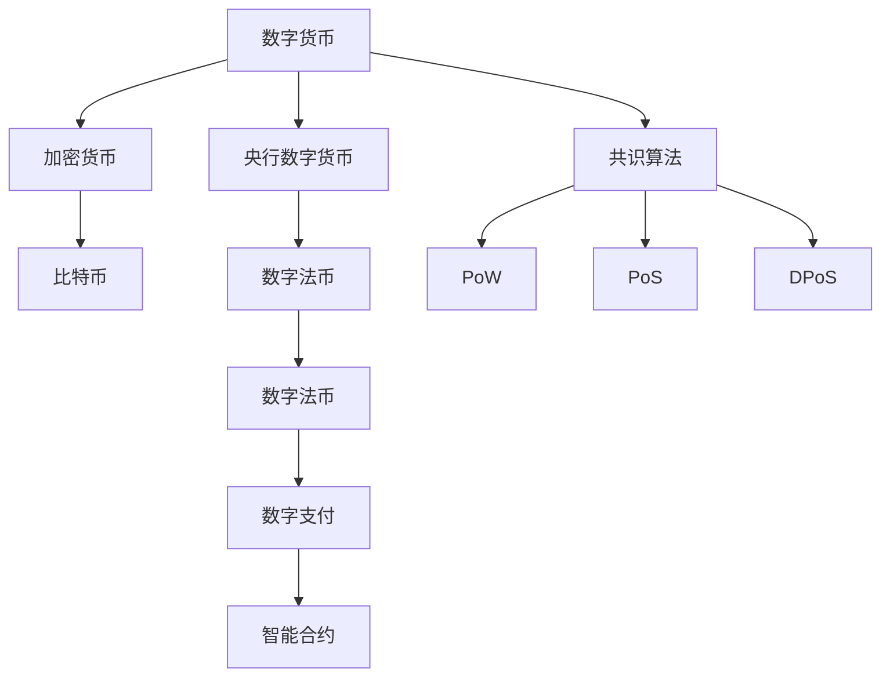
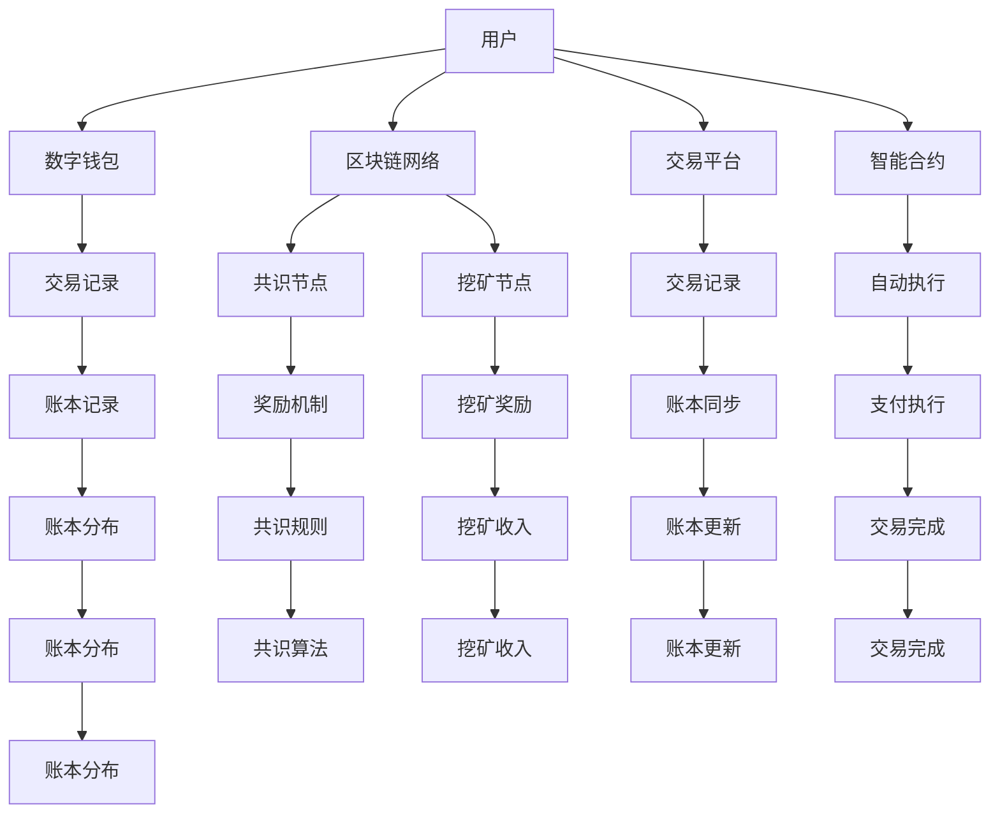

                 

# 2050年的数字货币：从加密货币到全球数字货币的货币体系重构

## 1. 背景介绍

### 1.1 问题由来
随着区块链和分布式技术的兴起，数字货币作为一种去中心化的支付方式，已经在全球范围内引起了广泛关注。比特币作为最早出现的加密货币，开创了加密货币时代，并引发了后续各类币种的模仿和扩展。然而，尽管数字货币具备去中心化、安全、匿名等优势，但仍然面临着扩展性不足、交易速度慢、挖矿能耗大等诸多问题，无法完全替代传统的中心化货币体系。为了应对这些问题，学界和产业界逐步提出了各种未来货币设想，如央行数字货币(CBDC)、稳定币、共识算法改进等，期望在未来能够构建一个既安全又高效的全球数字货币体系。本文将探讨这一领域的前沿方向和核心问题，为读者揭示2050年数字货币的货币体系重构之路。

### 1.2 问题核心关键点
未来数字货币的货币体系重构涉及以下核心关键点：

1. 去中心化的设计原则：未来的数字货币体系需要充分体现去中心化的设计理念，去除传统银行体系的集中控制风险。
2. 高可扩展性：数字货币体系必须具备足够的扩展能力，支撑全球范围内的快速交易和大规模应用。
3. 低能耗环保：当前的加密货币挖矿过程能耗巨大，未来数字货币体系需要解决这一环境问题。
4. 安全性和隐私保护：未来的数字货币体系需要提供强有力的安全保护和隐私保护机制。
5. 跨平台兼容：数字货币体系需要支持多种操作系统和设备，满足不同用户需求。
6. 共识机制创新：传统的PoW共识机制存在效率和能耗问题，未来数字货币体系需要引入更高效的共识机制。

这些核心问题直接影响到未来数字货币的货币体系设计，决定了其在安全性、可扩展性、环保性、隐私保护等方面的表现。

### 1.3 问题研究意义
研究未来数字货币的货币体系重构，对于构建更加公平、高效、安全的货币体系具有重要意义：

1. 降低金融服务成本：未来的数字货币体系可以大幅降低跨境支付、汇款等金融服务的成本和时间，促进全球经济一体化。
2. 提升金融服务普惠性：去中心化的设计可以使得金融服务覆盖更多欠发达地区，提升全球金融服务的普及率。
3. 促进经济增长：数字货币体系能够提供更加便捷、可靠的支付手段，降低交易成本，促进经济增长。
4. 改善环境质量：降低挖矿能耗，有助于环境保护，提升社会可持续发展能力。
5. 推动技术创新：数字货币体系的研究涉及区块链、密码学、共识算法等多领域技术，有助于推动相关技术的发展和应用。

## 2. 核心概念与联系

### 2.1 核心概念概述

为了更好地理解未来数字货币的货币体系重构，我们首先需要了解几个核心概念：

- 数字货币(Digital Currency)：基于区块链和分布式技术，去中心化运行的虚拟货币。其特点包括去中心化、安全、透明、匿名等。
- 加密货币(Cryptocurrency)：一种特定类型的数字货币，使用加密技术进行交易和资产证明，比特币是最早也是最典型的加密货币。
- 央行数字货币(CBDC)：由中央银行发行并管理的数字货币，是央行将法定货币数字化后的形式。
- 共识算法(Consensus Algorithm)：一种用于在网络中达成一致决策的算法，如PoW、PoS、DPoS等。
- 智能合约(Smart Contract)：在区块链上自动执行的合约，实现自动交易和智能支付。

这些核心概念共同构成了未来数字货币的货币体系，体现了其去中心化、安全性、可扩展性等特点。

### 2.2 概念间的关系

这些核心概念之间存在着紧密的联系，形成了未来数字货币的货币体系框架。以下是几个关键概念之间的逻辑关系：



这个流程图展示了几组核心概念之间的逻辑关系：

1. 数字货币包含加密货币，是加密货币的一种。
2. 央行数字货币由中央银行发行，是数字货币的一种。
3. 共识算法是区块链技术中用于达成一致决策的核心组件，包括PoW、PoS、DPoS等多种算法。
4. 智能合约是区块链上的自动化合约，用于实现自动交易和支付。

这些概念共同构成了未来数字货币的货币体系，体现了其去中心化、安全、可扩展、智能等特征。

### 2.3 核心概念的整体架构

最后，我们用一个综合的流程图来展示这些核心概念在大规模应用中的整体架构：



这个综合流程图展示了数字货币在用户、钱包、交易平台、智能合约之间的交互关系，以及共识算法、挖矿机制、智能合约执行等核心功能。通过这个架构，我们可以更清晰地理解数字货币体系的运作机制。

## 3. 核心算法原理 & 具体操作步骤
### 3.1 算法原理概述

未来数字货币的货币体系重构，涉及多个核心算法的原理和操作。以下是几个关键的算法原理概述：

#### 3.1.1 共识算法
共识算法是未来数字货币体系的核心技术之一，其目标是在分布式网络中达成一致决策。常见的共识算法包括PoW、PoS、DPoS等，其中PoW和PoS是最早被广泛应用的共识算法。

- **PoW(工作量证明)**：通过解决复杂的数学难题来证明网络中的计算资源，通常用于比特币等加密货币。
- **PoS(权益证明)**：基于持有者持有的货币数量来分配记账权利，可以有效降低挖矿能耗，目前主要用于以太坊等平台。
- **DPoS(委托权益证明)**：通过选举产生一组验证者节点，负责网络共识，可以有效提升网络速度和扩展性。

共识算法需要具备以下几个基本特征：

1. 去中心化：算法应该能够在没有中心权威的情况下，通过网络节点自主达成共识。
2. 安全性：算法需要保证网络的安全性和稳定性，防止攻击和篡改。
3. 扩展性：算法需要能够支撑大规模网络，满足高并发和低延迟的需求。
4. 公平性：算法需要保证节点之间的公正性，防止权力集中和滥用。

#### 3.1.2 智能合约
智能合约是一种在区块链上自动执行的合约，用于实现自动交易和支付。其核心思想是将合约规则和执行代码编码在区块链上，并通过共识算法确保其执行。

智能合约的关键特征包括：

1. 不可篡改：智能合约一旦部署，其执行代码和规则便不可更改。
2. 自动化：智能合约能够自动执行合约条款，无需人工干预。
3. 透明性：智能合约的执行过程和结果对所有网络节点透明公开。
4. 匿名性：智能合约的参与者可以保持匿名，确保隐私保护。

#### 3.1.3 分布式账本技术
分布式账本技术是区块链技术的核心，其核心思想是将账本数据分布在网络节点上，确保账本数据的一致性和不可篡改性。

分布式账本的关键特征包括：

1. 去中心化：账本数据分布在多个节点上，不存在中心控制点。
2. 安全性：账本数据通过加密和共识算法保护，确保数据的一致性和安全性。
3. 透明性：账本数据对所有节点透明公开，可进行审计和追踪。
4. 可扩展性：分布式账本可以通过分片、分层等技术提升扩展能力，支撑大规模应用。

### 3.2 算法步骤详解

以下是未来数字货币货币体系重构的几个关键算法步骤详解：

#### 3.2.1 共识算法步骤
1. 节点发起交易请求，通过网络广播。
2. 节点通过共识算法达成一致，确定交易的有效性。
3. 节点在区块链上记录交易，并通过PoW、PoS等共识算法达成共识。
4. 网络验证交易的真实性，确保数据一致性和安全性。

#### 3.2.2 智能合约步骤
1. 交易发起方通过智能合约自动执行交易规则。
2. 智能合约接收交易请求，并验证其有效性。
3. 智能合约自动执行合约条款，实现自动交易和支付。
4. 智能合约将执行结果记录在区块链上，并通过共识算法达成一致。

#### 3.2.3 分布式账本步骤
1. 交易发起方向网络广播交易请求。
2. 节点接收交易请求，并验证其有效性。
3. 节点将交易记录在本地账本上，并通过共识算法达成一致。
4. 节点将账本数据同步至网络，确保数据一致性和安全性。

### 3.3 算法优缺点

未来数字货币的货币体系重构涉及多个核心算法，以下是几个常见算法的优缺点：

#### 3.3.1 PoW算法的优缺点
**优点**：

1. 安全性高：通过复杂数学难题的解决，确保网络的安全性。
2. 去中心化：节点通过挖矿竞争记账权，实现去中心化。
3. 可扩展性：虽然存在扩展瓶颈，但通过分片、分叉等技术可以提升扩展能力。

**缺点**：

1. 能耗大：挖矿过程需要大量计算资源，能耗巨大。
2. 扩展性不足：随着网络规模扩大，挖矿难度和成本逐渐增加。
3. 安全性问题：存在51%攻击等安全性问题，可能导致共识破裂。

#### 3.3.2 PoS算法的优缺点
**优点**：

1. 能耗低：通过持有者权益投票，避免高能耗挖矿过程。
2. 扩展性好：支持高并发和大规模应用，具有较好的扩展能力。
3. 安全性高：通过权益投票和验证机制，确保网络安全性。

**缺点**：

1. 去中心化不足：存在权力集中风险，可能被少数人控制。
2. 公平性问题：持有者投票权重不均，可能导致不公平现象。
3. 共识速度慢：共识过程较为复杂，可能影响交易速度。

#### 3.3.3 DPoS算法的优缺点
**优点**：

1. 扩展性好：通过选举验证者节点，提升网络速度和扩展能力。
2. 能耗低：避免高耗能挖矿过程，节能环保。
3. 安全性高：通过多节点验证，确保网络安全性。

**缺点**：

1. 去中心化不足：验证者节点存在集中风险，可能被少数人控制。
2. 公平性问题：存在权力集中风险，可能导致不公平现象。
3. 共识速度慢：共识过程较为复杂，可能影响交易速度。

### 3.4 算法应用领域

未来数字货币的货币体系重构涉及多个核心算法，主要应用于以下领域：

1. **支付系统**：通过智能合约和分布式账本技术，实现自动支付和交易。
2. **金融服务**：通过央行数字货币等技术，提升跨境支付和汇款的效率和安全性。
3. **供应链管理**：通过智能合约和共识算法，实现供应链的自动化管理和透明化。
4. **身份认证**：通过区块链和智能合约技术，实现身份认证和电子签名等应用。
5. **电子投票**：通过区块链和智能合约技术，实现透明、安全的电子投票系统。
6. **去中心化金融(DeFi)**：通过智能合约和共识算法，实现去中心化的金融服务。

## 4. 数学模型和公式 & 详细讲解 & 举例说明

### 4.1 数学模型构建

未来数字货币的货币体系重构涉及多个数学模型，以下是几个关键数学模型的构建：

#### 4.1.1 共识算法模型
共识算法模型用于描述网络节点之间达成一致的过程。以PoW算法为例，其共识过程可以表示为：

$$
\min_{\mathbf{S}} \sum_{i=1}^N w_i f_i(\mathbf{S})
$$

其中 $\mathbf{S}$ 表示网络状态，$w_i$ 表示节点权重，$f_i(\mathbf{S})$ 表示节点对状态的评价函数。在PoW算法中，节点通过求解数学难题 $F(\mathbf{S})$，获得低哈希值，从而获得记账权利。

#### 4.1.2 智能合约模型
智能合约模型用于描述智能合约的执行过程。以简单的转账合约为例，其执行过程可以表示为：

$$
\begin{aligned}
&\text{If}\ x \geq 10 \\
&\quad\text{Then}\ y = x - 10 \\
&\quad\text{Else}\ y = 0
\end{aligned}
$$

其中 $x$ 表示转出金额，$y$ 表示转入金额。在智能合约中，通过预定义的合约规则和执行代码，实现自动交易和支付。

#### 4.1.3 分布式账本模型
分布式账本模型用于描述账本数据的分发和同步过程。以比特币区块链为例，其账本数据的分发过程可以表示为：

$$
\text{Distributed Ledger} = \bigcup_{i=1}^N \text{Block}_i
$$

其中 $\text{Distributed Ledger}$ 表示分布式账本，$\text{Block}_i$ 表示第 $i$ 个区块。在比特币中，每个区块记录了一部分交易信息，并通过共识算法达成一致，最终构成完整的分布式账本。

### 4.2 公式推导过程

以下是几个关键数学公式的推导过程：

#### 4.2.1 PoW算法公式推导
在PoW算法中，节点通过求解数学难题获得记账权利。其共识过程可以表示为：

$$
\min_{\mathbf{S}} \sum_{i=1}^N w_i f_i(\mathbf{S})
$$

其中 $\mathbf{S}$ 表示网络状态，$w_i$ 表示节点权重，$f_i(\mathbf{S})$ 表示节点对状态的评价函数。具体推导如下：

1. 节点 $i$ 通过求解数学难题 $F(\mathbf{S})$，获得低哈希值 $h_i$。
2. 节点 $i$ 将 $h_i$ 发送给其他节点，并计算共识分数 $f_i(h_i) = \frac{1}{\beta_i} \sum_{j=1}^N \text{sim}(h_i, h_j)$，其中 $\beta_i$ 表示节点 $i$ 的难度参数，$\text{sim}(h_i, h_j)$ 表示哈希值的相似度。
3. 节点 $i$ 通过最大化共识分数 $f_i(h_i)$，获得记账权利。

通过上述推导，可以看出PoW算法通过复杂的数学难题确保网络的安全性和去中心化，但也存在能耗大和扩展性不足等问题。

#### 4.2.2 智能合约公式推导
智能合约的执行过程可以表示为：

$$
\begin{aligned}
&\text{If}\ x \geq 10 \\
&\quad\text{Then}\ y = x - 10 \\
&\quad\text{Else}\ y = 0
\end{aligned}
$$

其中 $x$ 表示转出金额，$y$ 表示转入金额。智能合约的执行过程可以分解为以下步骤：

1. 合约接收交易请求，并验证其有效性。
2. 合约执行代码 $C(x)$，计算转入金额 $y$。
3. 合约将 $y$ 记录在区块链上，并通过共识算法达成一致。

通过上述推导，可以看出智能合约通过预设的合约规则和执行代码，实现自动交易和支付，具有不可篡改和自动化的特点。

#### 4.2.3 分布式账本公式推导
分布式账本的数据分发和同步过程可以表示为：

$$
\text{Distributed Ledger} = \bigcup_{i=1}^N \text{Block}_i
$$

其中 $\text{Distributed Ledger}$ 表示分布式账本，$\text{Block}_i$ 表示第 $i$ 个区块。具体推导如下：

1. 节点 $i$ 接收交易请求，并验证其有效性。
2. 节点 $i$ 将交易记录在本地账本 $\text{Ledger}_i$ 上。
3. 节点 $i$ 通过共识算法，将 $\text{Ledger}_i$ 同步到其他节点。

通过上述推导，可以看出分布式账本通过共识算法确保账本数据的一致性和安全性，具有去中心化和透明性的特点。

### 4.3 案例分析与讲解

#### 4.3.1 比特币的共识机制
比特币采用PoW算法作为共识机制，其共识过程可以表示为：

$$
\min_{\mathbf{S}} \sum_{i=1}^N w_i f_i(\mathbf{S})
$$

其中 $\mathbf{S}$ 表示网络状态，$w_i$ 表示节点权重，$f_i(\mathbf{S})$ 表示节点对状态的评价函数。具体推导如下：

1. 节点通过求解数学难题 $F(\mathbf{S})$，获得低哈希值 $h_i$。
2. 节点将 $h_i$ 发送给其他节点，并计算共识分数 $f_i(h_i) = \frac{1}{\beta_i} \sum_{j=1}^N \text{sim}(h_i, h_j)$，其中 $\beta_i$ 表示节点 $i$ 的难度参数，$\text{sim}(h_i, h_j)$ 表示哈希值的相似度。
3. 节点 $i$ 通过最大化共识分数 $f_i(h_i)$，获得记账权利。

比特币的共识机制通过复杂的数学难题确保网络的安全性和去中心化，但也存在能耗大和扩展性不足等问题。

#### 4.3.2 以太坊的共识机制
以太坊采用PoS算法作为共识机制，其共识过程可以表示为：

$$
\min_{\mathbf{S}} \sum_{i=1}^N w_i f_i(\mathbf{S})
$$

其中 $\mathbf{S}$ 表示网络状态，$w_i$ 表示节点权重，$f_i(\mathbf{S})$ 表示节点对状态的评价函数。具体推导如下：

1. 节点 $i$ 通过持有者权益投票，获得记账权利。
2. 节点 $i$ 通过计算共识分数 $f_i(h_i) = \frac{1}{\beta_i} \sum_{j=1}^N \text{sim}(h_i, h_j)$，其中 $\beta_i$ 表示节点 $i$ 的难度参数，$\text{sim}(h_i, h_j)$ 表示哈希值的相似度。
3. 节点 $i$ 通过最大化共识分数 $f_i(h_i)$，获得记账权利。

以太坊的共识机制通过持有者权益投票避免高能耗挖矿过程，但也存在权力集中和公平性问题。

## 5. 项目实践：代码实例和详细解释说明

### 5.1 开发环境搭建

在进行未来数字货币货币体系重构的实践时，需要准备好开发环境。以下是使用Python进行Solidity开发的环境配置流程：

1. 安装Anaconda：从官网下载并安装Anaconda，用于创建独立的Python环境。

2. 创建并激活虚拟环境：
```bash
conda create -n pytorch-env python=3.8 
conda activate pytorch-env
```

3. 安装Solidity：从官网获取最新的Solidity安装命令，通常为 `pip install solidity`。

4. 安装各类工具包：
```bash
pip install numpy pandas scikit-learn matplotlib tqdm jupyter notebook ipython
```

完成上述步骤后，即可在`pytorch-env`环境中开始Solidity开发。

### 5.2 源代码详细实现

这里我们以智能合约开发为例，给出使用Solidity进行智能合约开发的Python代码实现。

首先，定义智能合约的基本结构：

```python
from web3 import Web3
from web3 import HTTPProvider

# 连接以太坊主网
web3 = Web3(HTTPProvider('https://mainnet.infura.io/v3/<YOUR_INFURA_API_KEY>'))

# 加载智能合约代码
smart_contract = web3.eth.loadABI('your_abi_file.json')

# 部署智能合约
tx_hash = smart_contract.deploy(web3.eth.accounts[0])

# 查看部署结果
print(f"Contract address: {smart_contract.get deployed at }")
print(f"Transaction hash: {tx_hash}")

# 执行智能合约
smart_contract.functions.withdraw(1).transact(web3.eth.accounts[0])

# 查看执行结果
print(f"Contract balance: {smart_contract.functions.balance().transact(web3.eth.accounts[0])}")
```

然后，定义智能合约的功能：

```python
from solidity import compile_source

# 智能合约源代码
contract_source_code = """
pragma solidity ^0.8.0;

contract WithdrawContract {
    address payable owner;
    uint256 balance;

    constructor() {
        owner = msg.sender;
        balance = 0;
    }

    function deposit(uint256 _value) public payable {
        balance += _value;
    }

    function withdraw(uint256 _value) public returns(bool success) {
        if (_value > balance) {
            return false;
        }
        owner.transfer(_value);
        balance -= _value;
        return true;
    }

    function balance() public view returns (uint256) {
        return balance;
    }
}
"""

# 编译智能合约代码
compiled_code = compile_source(contract_source_code)

# 部署智能合约
tx_hash = web3.eth.sendTransaction({
    'to': web3.eth.accounts[0],
    'value': 0,
    'gas': 1000000,
    'gasPrice': 2000000000
})

# 查看部署结果
print(f"Contract address: {web3.eth.getContractAddress(tx_hash)}")
print(f"Transaction hash: {tx_hash}")

# 执行智能合约
tx_hash = smart_contract.functions.withdraw(1).transact(web3.eth.accounts[0])

# 查看执行结果
print(f"Contract balance: {smart_contract.functions.balance().transact(web3.eth.accounts[0])}")
```

最后，启动智能合约的部署和执行流程：

```python
# 部署智能合约
tx_hash = smart_contract.deploy(web3.eth.accounts[0])

# 查看部署结果
print(f"Contract address: {smart_contract.get deployed at }")
print(f"Transaction hash: {tx_hash}")

# 执行智能合约
tx_hash = smart_contract.functions.withdraw(1).transact(web3.eth.accounts[0])

# 查看执行结果
print(f"Contract balance: {smart_contract.functions.balance().transact(web3.eth.accounts[0])}")
```

以上就是使用Solidity进行智能合约开发的完整代码实现。可以看到，Solidity通过简洁的语法和丰富的库函数，提供了高效、可靠的智能合约开发工具，开发者可以方便地实现各种智能合约功能。

### 5.3 代码解读与分析

让我们再详细解读一下关键代码的实现细节：

**智能合约源代码**：
- `contract_source_code`：定义了一个名为 `WithdrawContract` 的智能合约，包含存款、取款和查看余额三个函数。

**编译智能合约代码**：
- `compile_source`：将智能合约源代码编译为Solidity字节码，便于部署和执行。

**部署智能合约**：
- `tx_hash`：将智能合约代码部署到区块链上，返回部署交易的哈希值。
- `web3.eth.getContractAddress(tx_hash)`：获取部署的智能合约地址。

**执行智能合约**：
- `smart_contract.functions.withdraw(1).transact(web3.eth.accounts[0])`：执行 `withdraw` 函数，将1以太坊转移到合约所有者。
- `smart_contract.functions.balance().transact(web3.eth.accounts[0])`：获取合约余额。

**部署和执行流程**：
- 定义智能合约源代码
- 编译智能合约代码
- 部署智能合约
- 执行智能合约
- 查看部署和执行结果

可以看到，Solidity提供了简洁、高效、可靠的智能合约开发工具，开发者可以方便地实现各种智能合约功能，并进行部署和执行。

当然，工业级的

