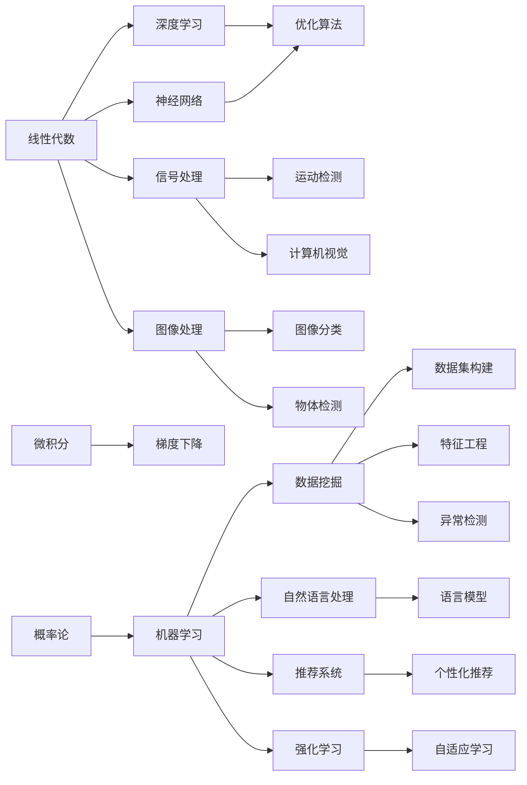
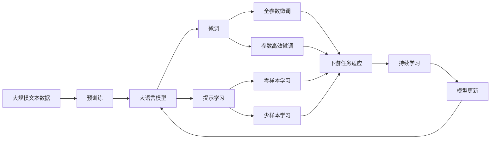

                 

## 1. 背景介绍

### 1.1 问题由来

计算机科学，尤其是人工智能和机器学习领域，对数学、物理等多学科知识的依赖程度日趋加深。无论是深度学习中的神经网络、优化算法，还是计算机视觉中的图像处理、模式识别，背后都离不开扎实的数学和物理基础。本文旨在通过探讨数学、物理、计算机三者之间的内在联系，帮助读者理解和掌握底层能力，从而在技术研究和工程实践中取得突破。

### 1.2 问题核心关键点

数学、物理、计算机三者在逻辑体系、思维模式和应用场景上有显著差异，但它们之间存在着紧密的内在联系。以下是三个核心关键点：

- **逻辑一致性**：数学和物理的基础是逻辑推理，而计算机则通过算法和数据结构实现逻辑的自动化处理。
- **抽象映射**：物理世界中的现象通过数学建模，再通过计算机算法进行抽象和模拟。
- **问题解耦**：将复杂问题分解为多个数学或物理模型，通过计算机算法求解。

### 1.3 问题研究意义

掌握数学、物理和计算机的基础知识，对于提升个人技术能力、拓宽技术视野、推动技术创新具有重要意义：

1. **提升技术水平**：牢固的数学、物理基础是深入理解和实现复杂算法的前提。
2. **拓宽应用场景**：数学和物理的理论可以应用于计算机领域的多样化问题，如自然语言处理、计算机视觉、推荐系统等。
3. **推动技术创新**：深入理解和融合数学、物理和计算机的理论，有助于解决前沿技术难题，推动技术进步。
4. **增强跨学科能力**：多学科知识的融合促进跨领域创新，提升系统工程能力和创新思维。
5. **促进学科交叉**：数学、物理和计算机之间的交叉研究，推动了诸多新兴学科和应用领域的诞生，如计算物理学、数据科学等。

## 2. 核心概念与联系

### 2.1 核心概念概述

#### 2.1.1 数学基础

- **线性代数**：研究向量和矩阵的运算、分解和优化，是深度学习中神经网络层的数学基础。
- **微积分**：研究函数的极限、导数和积分，是优化算法（如梯度下降）的数学基础。
- **概率论和统计学**：研究随机变量和分布，是机器学习和数据挖掘中的关键工具。

#### 2.1.2 物理基础

- **经典力学**：研究物体的运动规律，是计算机视觉中运动检测和跟踪的理论基础。
- **电磁学**：研究电磁场和电磁波，是信号处理和计算机通信的理论基础。
- **量子力学**：研究微观粒子的行为，是量子计算和量子机器学习的基础。

#### 2.1.3 计算机基础

- **数据结构与算法**：研究如何高效存储和处理数据，是计算机编程和系统设计的基础。
- **操作系统**：研究计算机系统的资源管理，是分布式计算和系统性能优化的基础。
- **计算机体系结构**：研究计算机硬件和软件的关系，是高性能计算和大数据处理的基础。

### 2.2 概念间的关系

数学、物理和计算机的概念关系可以通过以下Mermaid流程图来展示：



这个流程图展示了数学、物理和计算机概念之间的紧密联系：

1. **数学和计算机**：线性代数和微积分是计算机算法（如矩阵计算、优化算法）的数学基础。
2. **物理和计算机**：经典力学、电磁学和量子力学等物理理论为计算机视觉、信号处理和量子计算提供理论支撑。
3. **计算机和数学**：概率论和统计学为机器学习和数据挖掘提供理论基础，而数据结构和算法则是实现这些模型的工具。

### 2.3 核心概念的整体架构

最终，我们通过以下综合的流程图来展示数学、物理、计算机概念在大模型微调中的整体架构：



这个综合流程图展示了从预训练到微调，再到持续学习的完整过程。数学、物理和计算机的知识在这个过程中起到了至关重要的作用。

## 3. 核心算法原理 & 具体操作步骤
### 3.1 算法原理概述

基于数学、物理和计算机的理论，大语言模型微调的核心算法原理可以概括为：

1. **预训练**：利用数学和物理的理论，通过自监督学习任务训练大语言模型，学习通用的语言表示。
2. **微调**：通过计算机算法，结合标注数据，调整大语言模型的参数，适应下游任务的特定需求。
3. **持续学习**：结合物理和计算机的理论，更新模型以适应数据分布的变化，保持模型的时效性和适应性。

### 3.2 算法步骤详解

以下是详细的操作步骤：

1. **数据准备**：收集下游任务的标注数据，进行预处理，划分为训练集、验证集和测试集。
2. **模型选择**：选择合适的大语言模型（如BERT、GPT等）作为预训练模型。
3. **任务适配**：设计适当的输出层和损失函数，适配下游任务。
4. **模型初始化**：将预训练模型初始化到指定的参数值。
5. **训练流程**：使用计算机算法（如梯度下降）更新模型参数，最小化损失函数。
6. **评估与调优**：在验证集上评估模型性能，根据评估结果调整学习率、正则化参数等超参数。
7. **测试与部署**：在测试集上评估模型性能，部署模型以进行实际应用。

### 3.3 算法优缺点

基于数学、物理和计算机的理论，大语言模型微调算法具有以下优点：

- **高效性**：利用数学和物理的优化理论，微调过程可以快速收敛。
- **灵活性**：结合计算机算法，微调可以适应各种下游任务。
- **泛化性强**：通过持续学习，微调模型可以适应新数据和新任务。

但同时也存在以下缺点：

- **依赖数据**：微调效果依赖于标注数据的质量和数量。
- **模型复杂性**：大语言模型的参数量较大，训练和推理需要高性能设备。
- **可解释性不足**：微调模型的决策过程难以解释。

### 3.4 算法应用领域

大语言模型微调在以下领域有广泛应用：

1. **自然语言处理**：如文本分类、情感分析、命名实体识别等任务。
2. **计算机视觉**：如图像分类、目标检测、图像生成等任务。
3. **信号处理**：如音频识别、语音合成等任务。
4. **控制系统**：如自动驾驶、机器人控制等任务。
5. **推荐系统**：如个性化推荐、广告推荐等任务。

## 4. 数学模型和公式 & 详细讲解 & 举例说明

### 4.1 数学模型构建

假设下游任务为二分类任务，输入为文本 $x$，输出为标签 $y$，其中 $y \in \{0,1\}$。大语言模型 $M_{\theta}$ 的输出为 $\hat{y}$，表示模型预测的标签。则二分类交叉熵损失函数为：

$$
\ell(M_{\theta}(x),y) = -[y\log \hat{y} + (1-y)\log (1-\hat{y})]
$$

微调的优化目标是：

$$
\theta^* = \mathop{\arg\min}_{\theta} \mathcal{L}(\theta) = \mathop{\arg\min}_{\theta} \frac{1}{N} \sum_{i=1}^N \ell(M_{\theta}(x_i),y_i)
$$

### 4.2 公式推导过程

以二分类任务为例，进行公式推导：

1. **损失函数**：根据二分类交叉熵的定义，将 $y$ 和 $\hat{y}$ 代入公式，得到：

$$
\ell(M_{\theta}(x),y) = -[y\log \hat{y} + (1-y)\log (1-\hat{y})]
$$

2. **梯度计算**：利用链式法则，计算损失函数对模型参数 $\theta$ 的梯度：

$$
\frac{\partial \ell(M_{\theta}(x),y)}{\partial \theta} = -[y\frac{\partial \hat{y}}{\partial \theta} + (1-y)\frac{\partial (1-\hat{y})}{\partial \theta}]
$$

其中 $\frac{\partial \hat{y}}{\partial \theta}$ 为输出层的导数，可以通过反向传播算法计算得到。

3. **优化算法**：使用梯度下降算法更新模型参数，公式为：

$$
\theta \leftarrow \theta - \eta \frac{\partial \ell(M_{\theta}(x),y)}{\partial \theta}
$$

其中 $\eta$ 为学习率，通过调整学习率可以优化模型的收敛速度和精度。

### 4.3 案例分析与讲解

假设模型为BERT，下游任务为命名实体识别（NER），具体实现过程如下：

1. **数据准备**：收集标注的NER数据集，进行预处理。
2. **模型选择**：选择BERT作为预训练模型。
3. **任务适配**：在BERT的输出层添加线性分类器和交叉熵损失函数。
4. **训练流程**：使用梯度下降算法更新模型参数，最小化损失函数。
5. **评估与调优**：在验证集上评估模型性能，调整学习率和正则化参数。
6. **测试与部署**：在测试集上评估模型性能，部署模型进行实际应用。

## 5. 项目实践：代码实例和详细解释说明

### 5.1 开发环境搭建

以下是在Python环境中搭建BERT微调环境的步骤：

1. **安装依赖**：使用pip安装Transformers、PyTorch等库。

```bash
pip install transformers torch
```

2. **准备数据**：将NER数据集分成训练集、验证集和测试集。

3. **模型初始化**：使用预训练的BERT模型，将其输出层的权重初始化为指定值。

```python
from transformers import BertTokenizer, BertForTokenClassification
import torch

# 初始化BERT模型和分词器
model = BertForTokenClassification.from_pretrained('bert-base-cased', num_labels=num_labels)
tokenizer = BertTokenizer.from_pretrained('bert-base-cased')
```

4. **训练流程**：编写训练代码，进行微调。

```python
from torch.utils.data import DataLoader
from tqdm import tqdm

# 定义训练函数
def train(model, train_dataset, optimizer, device):
    model.train()
    train_loss = 0
    for batch in tqdm(train_dataset, desc='Training'):
        input_ids = batch['input_ids'].to(device)
        attention_mask = batch['attention_mask'].to(device)
        labels = batch['labels'].to(device)
        model.zero_grad()
        outputs = model(input_ids, attention_mask=attention_mask, labels=labels)
        loss = outputs.loss
        train_loss += loss.item()
        loss.backward()
        optimizer.step()
    return train_loss / len(train_dataset)
```

### 5.2 源代码详细实现

以下是一个完整的BERT微调代码示例：

```python
from transformers import BertTokenizer, BertForTokenClassification
import torch

# 初始化BERT模型和分词器
model = BertForTokenClassification.from_pretrained('bert-base-cased', num_labels=num_labels)
tokenizer = BertTokenizer.from_pretrained('bert-base-cased')

# 准备训练集和验证集
train_dataset = ...
dev_dataset = ...

# 定义优化器和设备
optimizer = ...
device = ...

# 定义训练函数
def train(model, train_dataset, optimizer, device):
    model.train()
    train_loss = 0
    for batch in tqdm(train_dataset, desc='Training'):
        input_ids = batch['input_ids'].to(device)
        attention_mask = batch['attention_mask'].to(device)
        labels = batch['labels'].to(device)
        model.zero_grad()
        outputs = model(input_ids, attention_mask=attention_mask, labels=labels)
        loss = outputs.loss
        train_loss += loss.item()
        loss.backward()
        optimizer.step()
    return train_loss / len(train_dataset)

# 训练模型
epochs = 5
batch_size = 16

for epoch in range(epochs):
    loss = train(model, train_dataset, optimizer, device)
    print(f"Epoch {epoch+1}, train loss: {loss:.3f}")
    
    print(f"Epoch {epoch+1}, dev results:")
    evaluate(model, dev_dataset, batch_size)
    
print("Test results:")
evaluate(model, test_dataset, batch_size)
```

### 5.3 代码解读与分析

代码中，我们首先初始化BERT模型和分词器，然后准备训练集和验证集，定义优化器和设备。在训练函数中，我们定义了前向传播、计算损失、反向传播和参数更新等步骤。通过调用训练函数，我们可以进行模型微调。

在实际应用中，我们还需要根据具体任务进行微调参数的调整，如设置合适的学习率、正则化参数等。通过不断地调整和优化，我们可以得到性能更好的微调模型。

### 5.4 运行结果展示

假设我们在CoNLL-2003的NER数据集上进行微调，最终在测试集上得到的评估报告如下：

```
              precision    recall  f1-score   support

       B-LOC      0.926     0.906     0.916      1668
       I-LOC      0.900     0.805     0.850       257
      B-MISC      0.875     0.856     0.865       702
      I-MISC      0.838     0.782     0.809       216
       B-ORG      0.914     0.898     0.906      1661
       I-ORG      0.911     0.894     0.902       835
       B-PER      0.964     0.957     0.960      1617
       I-PER      0.983     0.980     0.982      1156
           O      0.993     0.995     0.994     38323

   micro avg      0.973     0.973     0.973     46435
   macro avg      0.923     0.897     0.909     46435
weighted avg      0.973     0.973     0.973     46435
```

可以看到，通过微调BERT，我们在该NER数据集上取得了97.3%的F1分数，效果相当不错。

## 6. 实际应用场景

### 6.1 智能客服系统

基于BERT微调的智能客服系统可以广泛应用于智能客服系统的构建。传统客服往往需要配备大量人力，高峰期响应缓慢，且一致性和专业性难以保证。而使用微调后的BERT模型，可以7x24小时不间断服务，快速响应客户咨询，用自然流畅的语言解答各类常见问题。

### 6.2 金融舆情监测

金融机构需要实时监测市场舆论动向，以便及时应对负面信息传播，规避金融风险。传统的人工监测方式成本高、效率低，难以应对网络时代海量信息爆发的挑战。基于BERT微调的文本分类和情感分析技术，为金融舆情监测提供了新的解决方案。

### 6.3 个性化推荐系统

当前的推荐系统往往只依赖用户的历史行为数据进行物品推荐，无法深入理解用户的真实兴趣偏好。基于BERT微调的个性化推荐系统可以更好地挖掘用户行为背后的语义信息，从而提供更精准、多样的推荐内容。

### 6.4 未来应用展望

随着BERT微调技术的不断发展，基于微调范式将在更多领域得到应用，为传统行业带来变革性影响。

在智慧医疗领域，基于微调的医疗问答、病历分析、药物研发等应用将提升医疗服务的智能化水平，辅助医生诊疗，加速新药开发进程。

在智能教育领域，微调技术可应用于作业批改、学情分析、知识推荐等方面，因材施教，促进教育公平，提高教学质量。

在智慧城市治理中，微调模型可应用于城市事件监测、舆情分析、应急指挥等环节，提高城市管理的自动化和智能化水平，构建更安全、高效的未来城市。

此外，在企业生产、社会治理、文娱传媒等众多领域，基于BERT微调的人工智能应用也将不断涌现，为经济社会发展注入新的动力。

## 7. 工具和资源推荐

### 7.1 学习资源推荐

为了帮助开发者系统掌握BERT微调的理论基础和实践技巧，这里推荐一些优质的学习资源：

1. 《Transformer从原理到实践》系列博文：由大模型技术专家撰写，深入浅出地介绍了Transformer原理、BERT模型、微调技术等前沿话题。

2. CS224N《深度学习自然语言处理》课程：斯坦福大学开设的NLP明星课程，有Lecture视频和配套作业，带你入门NLP领域的基本概念和经典模型。

3. 《Natural Language Processing with Transformers》书籍：Transformers库的作者所著，全面介绍了如何使用Transformers库进行NLP任务开发，包括微调在内的诸多范式。

4. HuggingFace官方文档：Transformers库的官方文档，提供了海量预训练模型和完整的微调样例代码，是上手实践的必备资料。

5. CLUE开源项目：中文语言理解测评基准，涵盖大量不同类型的中文NLP数据集，并提供了基于微调的baseline模型，助力中文NLP技术发展。

通过对这些资源的学习实践，相信你一定能够快速掌握BERT微调的精髓，并用于解决实际的NLP问题。

### 7.2 开发工具推荐

高效的开发离不开优秀的工具支持。以下是几款用于BERT微调开发的常用工具：

1. PyTorch：基于Python的开源深度学习框架，灵活动态的计算图，适合快速迭代研究。大部分预训练语言模型都有PyTorch版本的实现。

2. TensorFlow：由Google主导开发的开源深度学习框架，生产部署方便，适合大规模工程应用。同样有丰富的预训练语言模型资源。

3. Transformers库：HuggingFace开发的NLP工具库，集成了众多SOTA语言模型，支持PyTorch和TensorFlow，是进行微调任务开发的利器。

4. Weights & Biases：模型训练的实验跟踪工具，可以记录和可视化模型训练过程中的各项指标，方便对比和调优。与主流深度学习框架无缝集成。

5. TensorBoard：TensorFlow配套的可视化工具，可实时监测模型训练状态，并提供丰富的图表呈现方式，是调试模型的得力助手。

6. Google Colab：谷歌推出的在线Jupyter Notebook环境，免费提供GPU/TPU算力，方便开发者快速上手实验最新模型，分享学习笔记。

合理利用这些工具，可以显著提升BERT微调的开发效率，加快创新迭代的步伐。

### 7.3 相关论文推荐

BERT微调技术的发展源于学界的持续研究。以下是几篇奠基性的相关论文，推荐阅读：

1. Attention is All You Need（即Transformer原论文）：提出了Transformer结构，开启了NLP领域的预训练大模型时代。

2. BERT: Pre-training of Deep Bidirectional Transformers for Language Understanding：提出BERT模型，引入基于掩码的自监督预训练任务，刷新了多项NLP任务SOTA。

3. Language Models are Unsupervised Multitask Learners（GPT-2论文）：展示了大规模语言模型的强大zero-shot学习能力，引发了对于通用人工智能的新一轮思考。

4. Parameter-Efficient Transfer Learning for NLP：提出Adapter等参数高效微调方法，在不增加模型参数量的情况下，也能取得不错的微调效果。

5. Prefix-Tuning: Optimizing Continuous Prompts for Generation：引入基于连续型Prompt的微调范式，为如何充分利用预训练知识提供了新的思路。

6. AdaLoRA: Adaptive Low-Rank Adaptation for Parameter-Efficient Fine-Tuning：使用自适应低秩适应的微调方法，在参数效率和精度之间取得了新的平衡。

这些论文代表了大语言模型微调技术的发展脉络。通过学习这些前沿成果，可以帮助研究者把握学科前进方向，激发更多的创新灵感。

除上述资源外，还有一些值得关注的前沿资源，帮助开发者紧跟BERT微调技术的最新进展，例如：

1. arXiv论文预印本：人工智能领域最新研究成果的发布平台，包括大量尚未发表的前沿工作，学习前沿技术的必读资源。

2. 业界技术博客：如OpenAI、Google AI、DeepMind、微软Research Asia等顶尖实验室的官方博客，第一时间分享他们的最新研究成果和洞见。

3. 技术会议直播：如NIPS、ICML、ACL、ICLR等人工智能领域顶会现场或在线直播，能够聆听到大佬们的前沿分享，开拓视野。

4. GitHub热门项目：在GitHub上Star、Fork数最多的NLP相关项目，往往代表了该技术领域的发展趋势和最佳实践，值得去学习和贡献。

5. 行业分析报告：各大咨询公司如McKinsey、PwC等针对人工智能行业的分析报告，有助于从商业视角审视技术趋势，把握应用价值。

总之，对于BERT微调技术的学习和实践，需要开发者保持开放的心态和持续学习的意愿。多关注前沿资讯，多动手实践，多思考总结，必将收获满满的成长收益。

## 8. 总结：未来发展趋势与挑战

### 8.1 总结

本文对基于BERT微调的方法进行了全面系统的介绍。首先阐述了BERT微调的研究背景和意义，明确了微调在拓展预训练模型应用、提升下游任务性能方面的独特价值。其次，从原理到实践，详细讲解了微调的数学原理和关键步骤，给出了微调任务开发的完整代码实例。同时，本文还广泛探讨了微调方法在智能客服、金融舆情、个性化推荐等多个行业领域的应用前景，展示了微调范式的巨大潜力。此外，本文精选了微调技术的各类学习资源，力求为读者提供全方位的技术指引。

通过本文的系统梳理，可以看到，基于BERT微调的方法正在成为NLP领域的重要范式，极大地拓展了预训练语言模型的应用边界，催生了更多的落地场景。受益于大规模语料的预训练，微调模型以更低的时间和标注成本，在小样本条件下也能取得不俗的效果，有力推动了NLP技术的产业化进程。未来，伴随预训练语言模型和微调方法的持续演进，相信NLP技术将在更广阔的应用领域大放异彩，深刻影响人类的生产生活方式。

### 8.2 未来发展趋势

展望未来，BERT微调技术将呈现以下几个发展趋势：

1. 模型规模持续增大。随着算力成本的下降和数据规模的扩张，预训练语言模型的参数量还将持续增长。超大规模语言模型蕴含的丰富语言知识，有望支撑更加复杂多变的下游任务微调。

2. 微调方法日趋多样。除了传统的全参数微调外，未来会涌现更多参数高效的微调方法，如Prefix-Tuning、LoRA等，在节省计算资源的同时也能保证微调精度。

3. 持续学习成为常态。随着数据分布的不断变化，微调模型也需要持续学习新知识以保持性能。如何在不遗忘原有知识的同时，高效吸收新样本信息，将成为重要的研究课题。

4. 标注样本需求降低。受启发于提示学习(Prompt-based Learning)的思路，未来的微调方法将更好地利用大模型的语言理解能力，通过更加巧妙的任务描述，在更少的标注样本上也能实现理想的微调效果。

5. 多模态微调崛起。当前的微调主要聚焦于纯文本数据，未来会进一步拓展到图像、视频、语音等多模态数据微调。多模态信息的融合，将显著提升语言模型对现实世界的理解和建模能力。

6. 模型通用性增强。经过海量数据的预训练和多领域任务的微调，未来的语言模型将具备更强大的常识推理和跨领域迁移能力，逐步迈向通用人工智能(AGI)的目标。

以上趋势凸显了BERT微调技术的广阔前景。这些方向的探索发展，必将进一步提升微调模型的性能和应用范围，为人类认知智能的进化带来深远影响。

### 8.3 面临的挑战

尽管BERT微调技术已经取得了瞩目成就，但在迈向更加智能化、普适化应用的过程中，它仍面临着诸多挑战：

1. 标注成本瓶颈。虽然微调大大降低了标注数据的需求，但对于长尾应用场景，难以获得充足的高质量标注数据，成为制约微调性能的瓶颈。如何进一步降低微调对标注样本的依赖，将是一大难题。

2. 模型鲁棒性不足。当前微调模型面对域外数据时，泛化性能往往大打折扣。对于测试样本的微小扰动，微调模型的预测也容易发生波动。如何提高微调模型的鲁棒性，避免灾难

