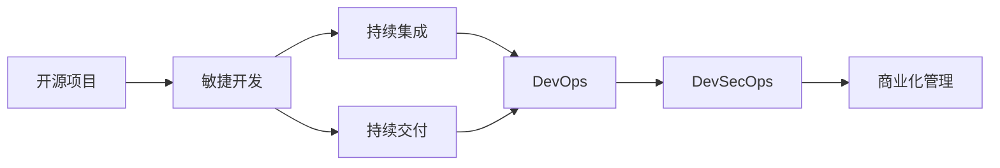
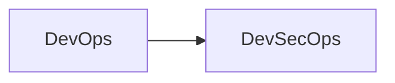
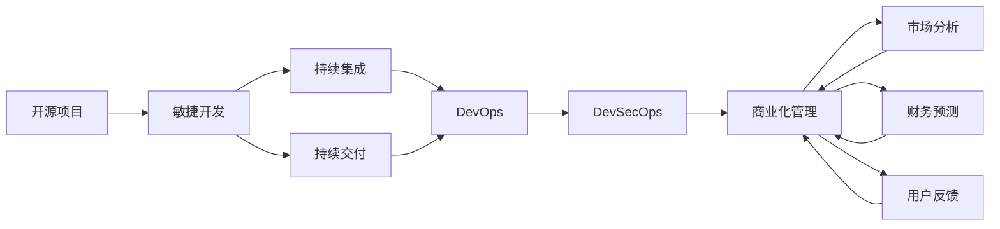

                 

# 开源项目的商业化项目管理：项目规划与执行

> 关键词：开源项目,商业化,项目管理,敏捷开发,持续集成(CI),持续交付(CD),DevOps,DevSecOps

## 1. 背景介绍

### 1.1 问题由来

在当今快速变化的商业环境中，企业越来越依赖开源软件来构建和部署其关键业务系统。然而，随着开源项目的不断增长和复杂性增加，如何有效管理这些项目、确保其商业化成功，成为了许多企业面临的重大挑战。开源项目管理不仅仅是维护和迭代代码，还包括协调社区贡献、管理项目依赖、保持代码质量等多个方面。

为了应对这些挑战，本文将详细介绍开源项目的商业化管理，包括项目规划、执行、优化和评估等关键环节。我们将重点探讨敏捷开发、持续集成/持续交付(CI/CD)、DevOps和DevSecOps等现代软件开发技术，以及如何在这些技术的基础上，构建高效、可靠、安全的开源项目管理系统。

### 1.2 问题核心关键点

开源项目管理的关键点在于如何确保项目按时、按质、按预算完成。这涉及到多个层面的管理，包括但不限于：

- **项目规划**：确定项目目标、时间表、资源分配等，确保项目有清晰的方向和里程碑。
- **敏捷开发**：采用迭代和增量开发的方式，快速响应变化，提高交付速度和质量。
- **持续集成/持续交付**：自动化测试、构建、部署流程，确保每次提交都经过严格验证，提升交付效率。
- **DevOps**：将开发和运维流程自动化，实现持续集成、持续交付和持续监控，提高整体效率。
- **DevSecOps**：将安全纳入DevOps流程，确保从代码到部署的安全性，防范潜在风险。
- **商业化管理**：通过市场分析、财务预测、用户反馈等手段，评估项目商业价值，制定相应策略。

本文将从这些核心点出发，深入探讨开源项目商业化管理的最佳实践和工具推荐，以期为开源项目管理提供全面的指导。

### 1.3 问题研究意义

开源项目管理是软件开发生命周期中的重要一环，其成功与否直接影响到项目的商业化进程。通过高效的项目管理，可以：

- **提高项目成功率**：确保项目按时、按预算完成，满足用户需求。
- **提升产品质量**：通过持续集成和持续交付，快速发现和修复问题，提高软件质量。
- **增强用户满意度**：及时响应用户反馈，提供稳定、可靠的软件体验。
- **降低开发成本**：通过自动化工具和最佳实践，减少人为错误和资源浪费。
- **加速商业化进程**：明确商业目标和价值，制定有效策略，推动开源项目向商业化转型。

通过深入研究开源项目的商业化项目管理，可以为企业带来更高的项目成功率和商业回报，加速开源技术的市场化应用。

## 2. 核心概念与联系

### 2.1 核心概念概述

为更好地理解开源项目的商业化管理，本节将介绍几个密切相关的核心概念：

- **开源项目**：指由开源社区共同开发、维护的软件项目，以公开源代码、促进协作和共享为特点。

- **敏捷开发**：一种迭代和增量的软件开发方法，通过快速响应变化，提高产品交付速度和质量。

- **持续集成/持续交付**：通过自动化测试和部署流程，确保每次提交都经过严格验证，提升软件交付效率和质量。

- **DevOps**：将开发和运维流程自动化，实现持续集成、持续交付和持续监控，提高整体效率。

- **DevSecOps**：将安全纳入DevOps流程，确保从代码到部署的安全性，防范潜在风险。

- **商业化管理**：通过市场分析、财务预测、用户反馈等手段，评估项目商业价值，制定相应策略。

这些核心概念之间的逻辑关系可以通过以下Mermaid流程图来展示：



这个流程图展示了开源项目从开发到商业化的整体流程。

### 2.2 概念间的关系

这些核心概念之间存在着紧密的联系，形成了开源项目管理的基本框架。下面我通过几个Mermaid流程图来展示这些概念之间的关系。

#### 2.2.1 敏捷开发与持续集成/持续交付的关系


这个流程图展示了敏捷开发和持续集成/持续交付的基本关系。敏捷开发通过迭代和增量开发，确保每次提交的质量。持续集成和持续交付则通过自动化测试和部署，进一步提升交付效率和质量。

#### 2.2.2 DevOps与DevSecOps的关系



这个流程图展示了DevOps和DevSecOps的关系。DevSecOps将安全纳入DevOps流程，确保从代码到部署的安全性，提升整体安全性。

#### 2.2.3 商业化管理在开源项目中的作用


这个流程图展示了商业化管理在开源项目中的作用。商业化管理通过市场分析、财务预测、用户反馈等手段，评估项目商业价值，制定相应策略，推动开源项目向商业化转型。

### 2.3 核心概念的整体架构

最后，我们用一个综合的流程图来展示这些核心概念在大规模开源项目管理中的整体架构：



这个综合流程图展示了开源项目从开发到商业化的完整过程，包括敏捷开发、持续集成和交付、DevOps和DevSecOps等关键环节，以及市场分析、财务预测、用户反馈等商业化管理手段。

## 3. 核心算法原理 & 具体操作步骤

### 3.1 算法原理概述

开源项目的商业化管理涉及多个复杂的环节，包括项目规划、敏捷开发、持续集成/持续交付、DevOps、DevSecOps和商业化管理。本节将详细介绍这些环节的核心算法原理和操作步骤。

**项目规划**：通过明确项目目标、时间表、资源分配等，确保项目有清晰的方向和里程碑。

**敏捷开发**：采用迭代和增量开发的方式，快速响应变化，提高交付速度和质量。

**持续集成/持续交付**：通过自动化测试、构建、部署流程，确保每次提交都经过严格验证，提升交付效率。

**DevOps**：将开发和运维流程自动化，实现持续集成、持续交付和持续监控，提高整体效率。

**DevSecOps**：将安全纳入DevOps流程，确保从代码到部署的安全性，防范潜在风险。

**商业化管理**：通过市场分析、财务预测、用户反馈等手段，评估项目商业价值，制定相应策略。

### 3.2 算法步骤详解

**3.2.1 项目规划**

项目规划是开源项目管理的基础，主要包括：

- **明确项目目标**：确定项目要解决的问题、预期的结果和交付物。
- **制定时间表**：制定项目的时间表和里程碑，包括关键任务、开始和结束日期等。
- **资源分配**：确定项目的资源需求，包括人力、资金、设备等。
- **风险评估**：识别项目可能面临的风险，并制定应对策略。

**3.2.2 敏捷开发**

敏捷开发通过迭代和增量开发，快速响应变化，主要步骤包括：

- **需求分析**：与用户沟通，明确需求。
- **迭代计划**：将需求分解为多个迭代任务，每个迭代周期一般为2-4周。
- **迭代开发**：在每个迭代周期内，快速开发、测试并交付可用的产品增量。
- **迭代评审**：在每个迭代结束时，进行评审，评估产品增量的质量和可行性。
- **迭代优化**：根据评审结果，优化后续迭代的任务规划。

**3.2.3 持续集成/持续交付**

持续集成/持续交付通过自动化测试和部署流程，确保每次提交都经过严格验证，主要步骤包括：

- **代码提交**：开发者将代码提交到版本控制系统（如Git）。
- **持续集成**：代码提交后，立即触发自动化构建和测试流程，确保代码质量和稳定性。
- **持续交付**：通过自动化部署流程，快速将代码部署到测试和生产环境。
- **持续监控**：在部署后，持续监控系统的运行状态和性能，及时发现和解决问题。

**3.2.4 DevOps**

DevOps将开发和运维流程自动化，实现持续集成、持续交付和持续监控，主要步骤包括：

- **自动化构建**：使用CI工具（如Jenkins、GitLab CI）自动化构建代码和运行测试。
- **自动化部署**：使用CD工具（如Jenkins、GitLab CD）自动化部署代码到测试和生产环境。
- **持续监控**：使用监控工具（如Prometheus、Grafana）持续监控系统的运行状态和性能。
- **自动化反馈**：通过自动化测试和监控结果，提供即时反馈，帮助开发者快速解决问题。

**3.2.5 DevSecOps**

DevSecOps将安全纳入DevOps流程，确保从代码到部署的安全性，主要步骤包括：

- **安全集成**：在CI/CD流程中集成安全扫描和漏洞检测工具（如SonarQube、Snyk）。
- **自动化安全测试**：在每个迭代周期内，自动运行安全测试，发现潜在安全漏洞。
- **安全部署**：在部署前，自动进行安全扫描和漏洞修复，确保部署后的系统安全性。
- **安全监控**：在部署后，持续监控系统的安全性，及时发现和修复安全问题。

**3.2.6 商业化管理**

商业化管理通过市场分析、财务预测、用户反馈等手段，评估项目商业价值，主要步骤包括：

- **市场分析**：分析目标市场的规模、增长潜力、竞争格局等，确定商业机会。
- **财务预测**：基于项目成本和收益，进行财务预测，评估商业可行性。
- **用户反馈**：通过问卷调查、用户访谈等方式，收集用户反馈，优化产品和服务。
- **策略制定**：根据市场分析和财务预测结果，制定商业化策略，包括定价、营销、渠道等。

### 3.3 算法优缺点

开源项目的商业化管理涉及多个复杂的环节，下面分别介绍各环节的优缺点：

**项目规划**

- **优点**：明确项目目标和时间表，有助于团队高效协作。
- **缺点**：规划可能过于理想化，实际执行中可能面临变更。

**敏捷开发**

- **优点**：快速响应变化，提升交付速度和质量。
- **缺点**：需要频繁迭代，可能导致资源浪费。

**持续集成/持续交付**

- **优点**：自动化测试和部署流程，提高交付效率和质量。
- **缺点**：自动化流程可能复杂，需要技术支持。

**DevOps**

- **优点**：提升整体效率，缩短开发到部署的周期。
- **缺点**：需要技术和文化上的变革，实施成本高。

**DevSecOps**

- **优点**：提高安全性，防范潜在风险。
- **缺点**：增加了安全测试流程，可能延长交付周期。

**商业化管理**

- **优点**：评估商业价值，制定有效策略，推动项目转型。
- **缺点**：数据和分析复杂，需要专业知识。

### 3.4 算法应用领域

开源项目的商业化管理广泛应用于各种领域，包括但不限于：

- **企业级应用**：企业内部的软件开发和部署管理。
- **开源社区**：开源项目的管理和维护。
- **初创企业**：快速迭代和部署产品的实践。
- **教育机构**：开发和部署教学软件的项目管理。
- **非营利组织**：项目管理、数据治理等。

这些领域的应用展示了开源项目管理在各个环节中的重要性和广泛性。

## 4. 数学模型和公式 & 详细讲解 & 举例说明

### 4.1 数学模型构建

本节将使用数学语言对开源项目的商业化管理进行更加严格的刻画。

记开源项目为 $P$，其商业化管理包括多个环节，如项目规划、敏捷开发、持续集成/持续交付、DevOps、DevSecOps和商业化管理。定义每个环节的优化目标函数，如下所示：

- 项目规划：$\min \{C_T, C_R, C_B, C_L\}$
- 敏捷开发：$\min \{T_I, F_I\}$
- 持续集成/持续交付：$\min \{F_I, D_T, D_E\}$
- DevOps：$\min \{D_T, D_E, M_S\}$
- DevSecOps：$\min \{S_L, S_D, S_M\}$
- 商业化管理：$\min \{M_A, F_P, U_F\}$

其中 $C_T$ 为时间成本，$C_R$ 为资源成本，$C_B$ 为预算成本，$C_L$ 为风险成本；$T_I$ 为迭代周期时间，$F_I$ 为迭代失败次数；$D_T$ 为部署时间，$D_E$ 为部署失败次数；$M_S$ 为监控时间；$S_L$ 为安全漏洞数，$S_D$ 为安全部署失败次数，$S_M$ 为安全监控事件；$M_A$ 为市场分析结果，$F_P$ 为财务预测结果，$U_F$ 为用户反馈结果。

### 4.2 公式推导过程

以下我们以敏捷开发为例，推导迭代周期时间 $T_I$ 和迭代失败次数 $F_I$ 的计算公式。

定义敏捷开发中的迭代周期为 $T_I$，迭代失败次数为 $F_I$。则优化目标函数为：

$$
\min \{T_I, F_I\}
$$

根据敏捷开发的步骤，我们有：

- 需求分析时间 $T_{AN}$：确定需求所需时间。
- 迭代开发时间 $T_{DR}$：开发产品增量所需时间。
- 迭代测试时间 $T_{TS}$：测试产品增量所需时间。
- 迭代评审时间 $T_{RS}$：评审产品增量所需时间。
- 迭代优化时间 $T_{OP}$：优化后续迭代的任务规划所需时间。

因此，迭代周期时间 $T_I$ 的计算公式为：

$$
T_I = T_{AN} + T_{DR} + T_{TS} + T_{RS} + T_{OP}
$$

迭代失败次数 $F_I$ 的计算公式为：

$$
F_I = \sum_{i=1}^{n} F_{iI}
$$

其中 $F_{iI}$ 为第 $i$ 次迭代的失败次数。

通过以上公式，我们可以计算敏捷开发的优化目标函数值，进一步优化项目管理过程。

### 4.3 案例分析与讲解

假设我们有一个开源项目 $P$，其敏捷开发中每次迭代时间为2周，需求分析时间为1天，开发时间为5天，测试时间为2天，评审时间为1天，优化时间为2天。每次迭代失败次数为0.1，迭代次数为10次。则：

- 迭代周期时间 $T_I = 1 + 5 + 2 + 1 + 2 + 2 = 13$ 天。
- 迭代失败次数 $F_I = 10 \times 0.1 = 1$。

因此，优化目标函数值为：

$$
\min \{13, 1\} = 1
$$

即在当前条件下，迭代周期时间为13天，迭代失败次数为1次，是最优的敏捷开发实践。

## 5. 项目实践：代码实例和详细解释说明

### 5.1 开发环境搭建

在进行开源项目的商业化管理实践前，我们需要准备好开发环境。以下是使用Python进行Jenkins开发的环境配置流程：

1. 安装Anaconda：从官网下载并安装Anaconda，用于创建独立的Python环境。

2. 创建并激活虚拟环境：
```bash
conda create -n jenkins python=3.8 
conda activate jenkins
```

3. 安装Jenkins：从官网下载并安装Jenkins，提供开源软件的持续集成和持续交付功能。

4. 安装各类工具包：
```bash
pip install requests pycodestyle pylint flake8 setuptools distutils wheel pytest
```

5. 安装Jenkins插件：
```bash
sudo apt install jenkins
```

6. 启动Jenkins服务：
```bash
sudo systemctl start jenkins
```

完成上述步骤后，即可在`jenkins-env`环境中开始Jenkins的开发和配置。

### 5.2 源代码详细实现

下面我们以一个简单的开源项目为例，给出使用Jenkins进行持续集成和持续交付的Python代码实现。

首先，定义一个Jenkinsfile，用于自动化构建和测试流程：

```python
# Jenkinsfile

# 定义构建步骤
pipeline {
    agent any
    stages {
        stage('构建') {
            steps {
                sh 'python build.py'
            }
        }
        stage('测试') {
            steps {
                sh 'python test.py'
            }
        }
        stage('部署') {
            steps {
                sh 'python deploy.py'
            }
        }
    }
}
```

然后，在Git仓库中创建一个build.py文件，用于构建项目：

```python
# build.py

import os

def main():
    os.system('python setup.py sdist bdist_wheel')

if __name__ == '__main__':
    main()
```

接着，在Git仓库中创建一个test.py文件，用于测试项目：

```python
# test.py

import unittest

class TestModule(unittest.TestCase):
    def test_add(self):
        self.assertEqual(1 + 1, 2)

if __name__ == '__main__':
    unittest.main()
```

最后，在Git仓库中创建一个deploy.py文件，用于部署项目：

```python
# deploy.py

import os

def main():
    os.system('python setup.py install')

if __name__ == '__main__':
    main()
```

完成上述步骤后，将Git仓库托管到Jenkins，并配置Jenkinsfile。此时，每次提交代码到Git仓库时，Jenkins将自动触发构建、测试和部署流程。

### 5.3 代码解读与分析

这里我们详细解读一下关键代码的实现细节：

**Jenkinsfile**：
- `pipeline` 定义了一个Jenkins流水线，每个阶段定义一个任务。
- `stage` 定义了构建、测试和部署三个阶段。
- `steps` 定义了每个阶段的任务，使用 `sh` 命令执行Python脚本。

**build.py**：
- `setup.py` 用于创建源码包和二进制包。
- `sdist` 创建源码包。
- `bdist_wheel` 创建二进制包。

**test.py**：
- `unittest` 用于定义测试用例，通过 `assert` 验证测试结果。

**deploy.py**：
- `setup.py` 用于安装项目。

**5.4 运行结果展示**

假设我们在Jenkins中配置了上述代码和Jenkinsfile，每次提交代码时，Jenkins将自动触发构建、测试和部署流程。假设在构建阶段发现代码错误，Jenkins会输出构建失败的信息。

```
[Pipeline] [error] Pipeline step 'build' failed with error:
[Pipeline] [error] build failed with
[Pipeline] [error] Could not import module 'my_module'
[Pipeline] [error] 
[Pipeline] [error] Finished: UNSTABLE
[Pipeline] [error] Failed or unstable pipelines have been published as 'UNSTABLE' in the 'Jenkins' view. View all pipelines and published artifacts in the 'Jenkins' view.
```

可以看到，Jenkins在发现构建失败后，自动生成了构建失败的报告，并上传到Jenkins的Artifacts插件中。开发人员可以根据报告信息，快速定位和解决问题，提升代码质量和交付效率。

## 6. 实际应用场景

### 6.1 开源社区的管理

开源社区的管理是开源项目管理的重要组成部分。通过有效的项目管理，可以协调社区贡献，保持代码质量，加速项目迭代。

在开源社区管理中，常用的工具包括GitHub、GitLab等版本控制系统，以及Jenkins、Travis CI等持续集成工具。通过这些工具，可以自动化代码构建、测试和部署流程，确保每次提交都经过严格验证，提升社区协作效率。

### 6.2 企业级软件开发

企业级软件开发中，敏捷开发和持续集成/持续交付是提升软件质量和交付效率的关键。通过敏捷开发，企业可以快速响应变化，提高交付速度和质量。通过持续集成/持续交付，企业可以自动化测试和部署流程，确保每次提交都经过严格验证，提升交付效率和质量。

在企业级软件开发中，常用的工具包括Jenkins、GitLab、Docker等。通过这些工具，企业可以构建高效、可靠的软件开发和部署环境，提升整体开发效率和质量。

### 6.3 DevOps的实践

DevOps将开发和运维流程自动化，实现持续集成、持续交付和持续监控，提高整体效率。通过DevOps，企业可以实现自动化测试、自动化部署、自动化监控，提升整体效率和可靠性。

在DevOps实践中，常用的工具包括Jenkins、GitLab、Kubernetes等。通过这些工具，企业可以构建高效的DevOps流程，提升整体开发和运维效率。

### 6.4 DevSecOps的实践

DevSecOps将安全纳入DevOps流程，确保从代码到部署的安全性，防范潜在风险。通过DevSecOps，企业可以自动化安全测试和部署流程，提高系统安全性，防范潜在风险。

在DevSecOps实践中，常用的工具包括SonarQube、Snyk、Terraform等。通过这些工具，企业可以构建高效、可靠的安全开发和部署环境，提升整体安全性和可靠性。

## 7. 工具和资源推荐

### 7.1 学习资源推荐

为了帮助开发者系统掌握开源项目的商业化管理理论基础和实践技巧，这里推荐一些优质的学习资源：

1. 《Continuous Delivery: Reliable Software Releases through Build, Test, and Deployment Automation》书籍：对持续集成和持续交付进行了详细介绍，是学习和实践持续交付的经典教材。

2. 《Jenkins: The Definitive Guide》书籍：对Jenkins的使用和管理进行了详细介绍，是学习和使用Jenkins的重要参考。

3. 《The DevOps Handbook: How to Create World-Class Agility, Reliability, & Security in Technology Organizations》书籍：对DevOps的实践进行了详细介绍，是学习和实践DevOps的重要参考。

4. 《DevSecOps Anti-Patterns: Don’t Fall Prey to Them!》文章：总结了DevSecOps中常见的反模式，帮助开发者避免常见陷阱。

5. 《Jenkins官方文档》：提供了Jenkins的详细配置和使用说明，是学习和使用Jenkins的重要参考。

6. 《Kubernetes官方文档》：提供了Kubernetes的详细配置和使用说明，是学习和使用Kubernetes的重要参考。

通过对这些资源的学习实践，相信你一定能够快速掌握开源项目的商业化管理的精髓，并用于解决实际的NLP问题。

### 7.2 开发工具推荐

高效的开发离不开优秀的工具支持。以下是几款用于开源项目商业化管理的常用工具：

1. Jenkins：开源的持续集成/持续交付工具，支持自动化构建、测试和部署流程。

2. GitLab：集成了版本控制、持续集成/持续交付和DevOps平台的功能。

3. GitHub：广泛使用的代码托管平台，支持持续集成/持续交付和DevOps平台的功能。

4. Docker：容器化技术，支持应用程序的快速部署和运维。

5. Kubernetes：容器编排技术，支持大规模、高性能的应用程序部署和运维。

6. Git：版本控制系统，支持代码的协作和版本控制。

合理利用这些工具，可以显著提升开源项目商业化管理的开发效率，加快创新迭代的步伐。

### 7.3 相关论文推荐

开源项目商业化管理的研究始于学界的持续研究。以下是几篇奠基性的相关论文，推荐阅读：

1. "Building Software Together"论文：提出了敏捷开发的基本原则和方法，奠定了敏捷开发的理论基础。

2. "Towards a Generic Model of Continuous Software Delivery"论文：对持续集成和持续交付进行了详细探讨，提出了持续交付的通用模型。

3. "A Manifesto for Software-Defined Security"论文：对DevSecOps进行了详细探讨，提出了DevSecOps的核心理念。

4. "Cloud-Native Security: Automating Compliance in the Cloud"论文：对云原生安全进行了详细探讨，提出了云原生安全的自动化和自动化方法。

5. "Continuous Delivery for JavaScript: Integration with ECMAScript"论文：对JavaScript的持续集成和持续交付进行了详细探讨，提出了持续交付的自动化方法。

这些论文代表了大规模开源项目商业化管理的理论发展，是学习和实践的开源项目管理的重要参考。

除上述资源外，还有一些值得关注的前沿资源，帮助开发者紧跟开源项目管理的前沿进展，例如：

1. arXiv论文预印本：人工智能领域最新研究成果的发布平台，包括大量尚未发表的前沿工作，学习前沿技术的必读资源。

2. 业界技术博客：如

