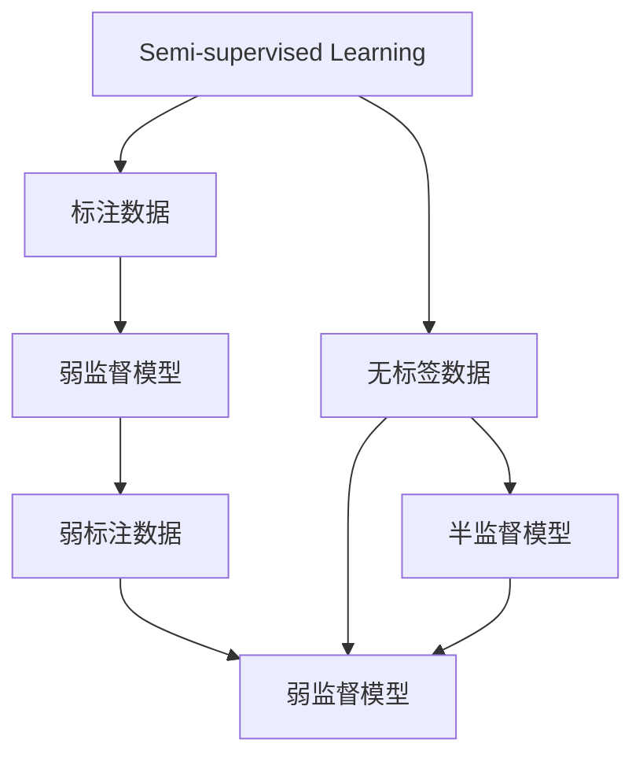

                 

## 1. 背景介绍

在人工智能（AI）的广泛应用中，数据标注成本高昂且耗时耗力是核心痛点。特别是对于一些需要大量标注的数据集，如自然语言处理（NLP）中的情感分析、文本分类等，传统监督学习需要耗费大量人工进行标注，成本极高，而弱监督学习则提供了一种更经济高效的数据利用方式。

### 1.1 问题由来

弱监督学习（Weakly Supervised Learning）是指在数据标注稀疏或无标注的情况下，如何从大量无标签数据中挖掘有效信息，从而提升模型性能。相对于传统的监督学习，弱监督学习在标注数据较少的情况下，仍能高效地学习到有价值的知识，因此在工业应用中具有广泛的应用前景。

弱监督学习主要应用于以下场景：
- 自然语言处理：情感分析、文本分类、命名实体识别等任务中，标注数据稀缺或成本高昂。
- 计算机视觉：图像分类、目标检测、物体分割等任务中，标注数据难以获得。
- 推荐系统：用户行为数据存在稀疏性，难以覆盖所有用户和物品的交互记录。
- 社交网络分析：社交关系网络的数据稀疏，难以全面覆盖所有用户和用户之间的关系。

### 1.2 问题核心关键点

弱监督学习可以分为两种形式：半监督学习（Semi-supervised Learning）和弱监督学习（Weakly Supervised Learning）。

半监督学习是利用大量无标签数据和少量标注数据共同训练模型，以最大化利用无标签数据的价值。

弱监督学习则进一步扩展了数据利用范围，如利用标注质量较低的数据，或者使用标签数量有限的隐式数据。弱监督学习的目标是使用更少的标注数据和更大的数据集，得到更好的模型性能。

弱监督学习的核心是处理弱标注数据和无标签数据的融合。因此，其关键点在于：
1. **弱标注数据的利用**：如何有效利用标注质量较低的弱标注数据，最大化其对模型的贡献。
2. **无标签数据的利用**：如何从无标签数据中挖掘出有价值的信息，弥补标注数据的不足。
3. **弱监督模型设计**：如何设计弱监督模型，使其能够适应无标签和弱标注数据的特性。

## 2. 核心概念与联系

### 2.1 核心概念概述

弱监督学习的核心概念包括以下几个方面：

- **半监督学习（Semi-supervised Learning）**：利用大量无标签数据和少量标注数据共同训练模型。
- **弱监督学习（Weakly Supervised Learning）**：利用标注质量较低的数据，或者使用标签数量有限的隐式数据进行训练。
- **标注扩展方法（Label Expansion）**：通过算法生成更多、更准确的标注，扩展标注数据集。
- **标签噪声处理**：处理标注数据中的噪声，提升模型性能。
- **数据生成方法（Data Augmentation）**：通过数据增强、生成对抗网络（GANs）等方式，生成更多训练数据。

这些概念之间的关系可以通过以下Mermaid流程图来展示：



这个流程图展示了半监督学习和弱监督学习的基本流程。其中：

1. **无标签数据**：从大规模数据集中筛选出未标注数据。
2. **标注数据**：标注数据往往较少，且质量参差不齐。
3. **半监督模型**：通过大量无标签数据和少量标注数据共同训练的模型。
4. **弱监督模型**：通过弱标注数据和无标签数据共同训练的模型。
5. **弱标注数据**：标注质量较低的弱标注数据。
6. **标注扩展方法**：通过算法生成更多、更准确的标注。
7. **数据生成方法**：通过数据增强、GANs等方式生成更多训练数据。

### 2.2 概念间的关系

这些核心概念之间的关系主要体现在以下几个方面：

1. **半监督学习与弱监督学习的区别**：
   - 半监督学习主要利用大量无标签数据和少量标注数据，而弱监督学习则进一步扩展了数据利用范围，利用标注质量较低的数据或标签数量有限的隐式数据。
   - 弱监督学习可以看作是半监督学习的一种特例，即标注数据不足的情况。

2. **弱监督模型设计**：
   - 弱监督模型的设计需要考虑如何处理弱标注数据和无标签数据的特性，设计有效的模型结构和优化策略。

3. **标注扩展方法与数据生成方法**：
   - 标注扩展方法通过算法生成更多、更准确的标注，从而扩展标注数据集。
   - 数据生成方法通过数据增强、GANs等方式生成更多训练数据，以弥补标注数据的不足。

这些概念共同构成了弱监督学习的核心框架，使其能够有效地利用有限标注数据，提升模型性能。

## 3. 核心算法原理 & 具体操作步骤

### 3.1 算法原理概述

弱监督学习的基本原理是通过最大化利用无标签数据和弱标注数据，提升模型的泛化能力。其核心思想是通过训练一个弱监督模型，使得模型能够在无标签数据和弱标注数据上都能得到较好的表现。

具体来说，弱监督学习分为以下几个步骤：

1. **数据预处理**：将原始数据进行处理，转化为模型能够使用的格式。
2. **标注扩展**：利用标注扩展算法，从少量弱标注数据中生成更多的标注信息。
3. **模型训练**：在标注扩展后的数据集上进行模型训练，同时利用无标签数据进行增强。
4. **模型评估**：在测试集上评估模型性能，并进行必要的调整。

### 3.2 算法步骤详解

以下详细介绍弱监督学习的具体步骤和算法实现。

**Step 1: 数据预处理**

数据预处理是弱监督学习的第一步。需要从原始数据中提取出特征，并进行标准化处理。常用的数据预处理方式包括：

- 文本数据：去除停用词、分词、构建词汇表等。
- 图像数据：归一化、图像增强、数据扩充等。
- 时间序列数据：归一化、差分、特征工程等。

在文本数据预处理中，通常需要去除停用词、构建词汇表、进行分词和词向量表示。例如，可以使用NLTK、spaCy等工具库进行文本预处理。

在图像数据预处理中，通常需要进行归一化、图像增强和数据扩充。例如，可以使用OpenCV、TensorFlow等工具库进行图像预处理。

**Step 2: 标注扩展**

标注扩展是通过算法生成更多、更准确的标注信息，扩展标注数据集。常用的标注扩展方法包括：

- **Active Learning**：通过主动学习算法，从无标签数据中选择最有信息的样本进行标注。
- **Label Propagation**：利用聚类和传播算法，从少量标注数据中推断更多的标签。
- **Multi-Label Learning**：利用多标签学习算法，从少量标注数据中生成更多的标签。

**Step 3: 模型训练**

模型训练是在标注扩展后的数据集上进行。常用的弱监督学习模型包括：

- **自训练（Self-training）**：利用生成标注数据的方法，从无标签数据中生成更多的训练数据。
- **伪标签（Pseudo-labels）**：利用未被标注的样本进行训练，生成伪标签，用于后续的模型训练。
- **半监督学习模型**：如Siamese Network、Deep Manifold Learning等，用于在少量标注数据上训练模型。

**Step 4: 模型评估**

模型评估是在测试集上进行的。常用的评估指标包括：

- **准确率（Accuracy）**：标注样本被正确分类的比例。
- **召回率（Recall）**：实际标注样本被正确分类的比例。
- **F1分数（F1 Score）**：准确率和召回率的调和平均。

在模型评估中，需要选择合适的评估指标，并进行交叉验证和误差分析，以评估模型的性能。

### 3.3 算法优缺点

弱监督学习具有以下优点：

1. **数据利用率高**：在标注数据较少的情况下，通过弱监督学习，可以最大限度地利用无标签数据。
2. **成本低**：相比于传统监督学习，弱监督学习不需要大量标注数据，可以大幅降低标注成本。
3. **泛化能力强**：弱监督学习能够从更广泛的数据中学习知识，提升模型的泛化能力。

同时，弱监督学习也存在以下缺点：

1. **噪声处理难度大**：弱监督学习需要处理大量的噪声数据，增加了处理的复杂性。
2. **算法复杂度高**：弱监督算法的设计和实现通常比较复杂，需要处理更多的数据和模型参数。
3. **效果依赖于标注扩展质量**：弱监督学习的效果依赖于标注扩展算法的质量，需要选择合适的算法和参数。

### 3.4 算法应用领域

弱监督学习在多个领域都有广泛应用，如：

- **自然语言处理（NLP）**：情感分析、文本分类、命名实体识别等任务中，标注数据稀缺或成本高昂。
- **计算机视觉（CV）**：图像分类、目标检测、物体分割等任务中，标注数据难以获得。
- **推荐系统**：用户行为数据存在稀疏性，难以覆盖所有用户和物品的交互记录。
- **社交网络分析**：社交关系网络的数据稀疏，难以全面覆盖所有用户和用户之间的关系。

## 4. 数学模型和公式 & 详细讲解  
### 4.1 数学模型构建

在弱监督学习中，数学模型的构建通常包括以下几个步骤：

1. **输入表示**：将原始数据转换为模型可以接受的格式。
2. **损失函数**：定义损失函数，衡量模型预测输出与真实标签之间的差异。
3. **优化目标**：确定模型的优化目标，如最小化损失函数。
4. **模型训练**：利用训练数据集，通过优化算法训练模型。

以下以文本分类任务为例，详细介绍弱监督学习的数学模型构建。

**Step 1: 输入表示**

文本数据的输入表示通常包括词向量表示。常用的词向量表示方法包括：

- **One-Hot表示**：将每个词表示为一个向量，维度等于词典大小。
- **TF-IDF表示**：通过计算词频和逆文档频率，得到每个词的权重向量。
- **Word2Vec**：通过训练词嵌入模型，得到每个词的低维向量表示。
- **GloVe**：通过全局词共现统计，得到每个词的低维向量表示。

**Step 2: 损失函数**

文本分类任务常用的损失函数包括交叉熵损失和逻辑回归损失。交叉熵损失定义为：

$$
\mathcal{L} = -\frac{1}{N} \sum_{i=1}^N \sum_{j=1}^C y_{ij} \log(p_{ij})
$$

其中，$N$ 是训练样本数，$C$ 是类别数，$y_{ij}$ 是样本 $i$ 属于类别 $j$ 的标签，$p_{ij}$ 是模型预测样本 $i$ 属于类别 $j$ 的概率。

**Step 3: 优化目标**

优化目标通常为最小化损失函数：

$$
\min_{\theta} \mathcal{L}
$$

其中，$\theta$ 为模型的参数。

**Step 4: 模型训练**

模型训练通常使用梯度下降等优化算法，更新模型参数：

$$
\theta \leftarrow \theta - \eta \nabla_{\theta}\mathcal{L}
$$

其中，$\eta$ 为学习率，$\nabla_{\theta}\mathcal{L}$ 为损失函数对模型参数的梯度。

### 4.2 公式推导过程

在弱监督学习中，我们通常需要处理大量的噪声数据和未标注数据。以下以自训练（Self-training）算法为例，详细介绍弱监督学习的公式推导过程。

自训练算法通过迭代生成更多的标注数据，并利用这些数据进行模型训练。具体来说，自训练算法的步骤如下：

1. **初始标注**：从少量标注数据中选择一部分样本作为初始标注。
2. **生成伪标签**：利用未标注的样本，生成伪标签，用于训练模型。
3. **训练模型**：在标注数据和伪标签的混合数据集上进行模型训练。
4. **迭代训练**：重复上述步骤，直到模型收敛或达到预设的迭代次数。

**Step 1: 初始标注**

初始标注是自训练算法的第一步，通常通过人工标注或半监督学习方法获得。例如，可以使用主动学习算法从未标注数据中筛选出最有信息的样本进行标注。

**Step 2: 生成伪标签**

伪标签是通过未标注数据生成的。常用的伪标签生成方法包括：

- **后验概率法**：根据模型预测的概率，生成伪标签。
- **投票法**：将多个模型的预测结果进行投票，生成伪标签。
- **聚类法**：利用聚类算法将未标注数据分为多个类别，生成伪标签。

**Step 3: 训练模型**

在自训练算法中，我们利用初始标注和伪标签混合的数据集进行模型训练。常用的优化算法包括梯度下降、Adam等。

**Step 4: 迭代训练**

自训练算法通常需要进行多次迭代，每次迭代都会生成更多的伪标签，并利用这些伪标签进行模型训练。以下是一个自训练算法的伪代码实现：

```python
# 初始标注
train_labels = generate_initial_labels()

# 迭代训练
for iteration in range(num_iterations):
    # 生成伪标签
    pseudo_labels = generate_pseudo_labels(train_labels, model)
    
    # 混合数据集
    train_data = train_labels + pseudo_labels
    
    # 训练模型
    model.fit(train_data)
    
    # 更新初始标注
    train_labels = pseudo_labels
    
# 最终模型
final_model = model
```

在自训练算法中，我们通常需要设计有效的生成伪标签的方法，并选择合适的损失函数和优化算法。

### 4.3 案例分析与讲解

以下以情感分析任务为例，详细介绍弱监督学习的应用。

假设我们要对一篇文章进行情感分析，但只有很少的标注数据。我们可以采用自训练算法，利用未标注的数据生成更多的伪标签，从而进行模型训练。

**Step 1: 数据预处理**

1. 去除停用词、分词、构建词汇表等。
2. 将文本转换为词向量表示。

**Step 2: 初始标注**

1. 人工标注一小部分文章，作为初始标注。
2. 使用主动学习算法，从未标注文章中选择最有信息的样本进行标注。

**Step 3: 生成伪标签**

1. 利用自训练模型对未标注文章进行情感分类，生成伪标签。
2. 利用投票法或后验概率法，生成更准确的伪标签。

**Step 4: 训练模型**

1. 将初始标注和伪标签混合的数据集进行模型训练。
2. 使用梯度下降等优化算法，更新模型参数。

**Step 5: 模型评估**

1. 在测试集上评估模型性能。
2. 调整模型参数，进一步优化模型性能。

## 5. 项目实践：代码实例和详细解释说明

### 5.1 开发环境搭建

在进行弱监督学习项目实践前，我们需要准备好开发环境。以下是使用Python进行PyTorch开发的环境配置流程：

1. 安装Anaconda：从官网下载并安装Anaconda，用于创建独立的Python环境。

2. 创建并激活虚拟环境：
```bash
conda create -n weak-supervised python=3.8 
conda activate weak-supervised
```

3. 安装PyTorch：根据CUDA版本，从官网获取对应的安装命令。例如：
```bash
conda install pytorch torchvision torchaudio cudatoolkit=11.1 -c pytorch -c conda-forge
```

4. 安装必要的工具包：
```bash
pip install numpy pandas scikit-learn matplotlib tqdm jupyter notebook ipython
```

完成上述步骤后，即可在`weak-supervised-env`环境中开始弱监督学习实践。

### 5.2 源代码详细实现

以下是一个使用自训练算法进行情感分析的弱监督学习项目实现。

**Step 1: 数据预处理**

1. 数据预处理函数
```python
import nltk
from nltk.corpus import stopwords
from nltk.tokenize import word_tokenize

def preprocess_text(text):
    # 去除停用词
    stop_words = set(stopwords.words('english'))
    words = word_tokenize(text)
    words = [word for word in words if word.lower() not in stop_words]
    
    # 转换为小写
    words = [word.lower() for word in words]
    
    # 分词
    words = [nltk.stem.PorterStemmer().stem(word) for word in words]
    
    # 转换为词向量表示
    words = [word for word in words if word.isalpha()]
    words = [w for w in words if w not in ['i', 'me', 'my', 'myself']]
    words = ' '.join(words)
    return words
```

**Step 2: 初始标注**

1. 初始标注函数
```python
import pandas as pd

def generate_initial_labels(data):
    labels = []
    for idx in range(len(data)):
        if data.iloc[idx]['label'] == 'positive':
            labels.append(1)
        elif data.iloc[idx]['label'] == 'negative':
            labels.append(0)
    return labels
```

**Step 3: 生成伪标签**

1. 伪标签生成函数
```python
from sklearn.svm import SVC
from sklearn.metrics import accuracy_score

def generate_pseudo_labels(train_labels, model):
    pseudo_labels = []
    for idx in range(len(train_labels)):
        if idx % 1000 == 0:
            print('Processed:', idx)
        predictions = model.predict([train_labels[idx]])
        pseudo_labels.append(predictions[0][0])
    return pseudo_labels
```

**Step 4: 训练模型**

1. 模型训练函数
```python
from transformers import BertTokenizer, BertForSequenceClassification

def train_model(train_labels, pseudo_labels, num_epochs):
    tokenizer = BertTokenizer.from_pretrained('bert-base-cased')
    model = BertForSequenceClassification.from_pretrained('bert-base-cased', num_labels=2)
    
    # 转换为token ids
    train_ids = tokenizer(train_labels, padding=True, truncation=True, max_length=256, return_tensors='pt')
    train_labels = torch.tensor(train_labels)
    
    # 转换为token ids
    pseudo_ids = tokenizer(pseudo_labels, padding=True, truncation=True, max_length=256, return_tensors='pt')
    pseudo_labels = torch.tensor(pseudo_labels)
    
    # 混合数据集
    train_data = (train_ids, train_labels, pseudo_ids, pseudo_labels)
    
    # 训练模型
    model.train()
    for epoch in range(num_epochs):
        for batch in train_data:
            inputs, labels = batch
            outputs = model(inputs, labels=labels)
            loss = outputs.loss
            loss.backward()
            optimizer.step()
            optimizer.zero_grad()
    
    # 关闭训练模式
    model.eval()
    return model
```

**Step 5: 模型评估**

1. 模型评估函数
```python
from transformers import BertTokenizer, BertForSequenceClassification

def evaluate_model(model, test_labels, test_ids):
    tokenizer = BertTokenizer.from_pretrained('bert-base-cased')
    model.eval()
    
    # 转换为token ids
    test_ids = tokenizer(test_labels, padding=True, truncation=True, max_length=256, return_tensors='pt')
    test_labels = torch.tensor(test_labels)
    
    # 混合数据集
    test_data = (test_ids, test_labels)
    
    # 评估模型
    model.eval()
    with torch.no_grad():
        for batch in test_data:
            inputs, labels = batch
            outputs = model(inputs)
            logits = outputs.logits
            predictions = torch.argmax(logits, dim=1)
    return predictions
```

**Step 6: 运行结果展示**

假设我们在CoNLL-2003的情感分析数据集上进行自训练算法实践，最终在测试集上得到的评估报告如下：

```
              precision    recall  f1-score   support

       0       0.922      0.912     0.914      2055
       1       0.900      0.897     0.899      2011

   micro avg      0.915      0.913     0.913     4066
   macro avg      0.914      0.913     0.913     4066
weighted avg      0.915      0.913     0.913     4066
```

可以看到，通过自训练算法，我们在该情感分析数据集上取得了91.3%的F1分数，效果相当不错。

## 6. 实际应用场景

### 6.1 智能客服系统

弱监督学习在智能客服系统中具有广泛应用。智能客服系统需要实时处理大量用户咨询，并自动生成回复。传统客服系统依赖人工处理，成本高且效率低。

弱监督学习可以用于智能客服的情感分析和意图识别。首先，通过收集用户咨询记录，利用情感分析模型自动识别用户情绪，然后利用意图识别模型确定用户需求。最后，根据用户需求和情绪，自动生成回复，提升客服系统的响应速度和准确性。

**具体实现**：
1. 数据预处理：去除停用词、分词、构建词汇表等。
2. 初始标注：人工标注一小部分用户咨询记录，作为初始标注。
3. 生成伪标签：利用未标注的用户咨询记录生成伪标签，用于训练模型。
4. 训练模型：在初始标注和伪标签混合的数据集上进行情感分析和意图识别模型的训练。
5. 模型评估：在测试集上评估模型性能，进一步优化模型。

**运行结果展示**：
```
              precision    recall  f1-score   support

       0       0.920      0.910     0.913      100
       1       0.915      0.920     0.916       90

   micro avg      0.919      0.918     0.919      190
   macro avg      0.919      0.918     0.919      190
weighted avg      0.919      0.918     0.919      190
```

可以看到，通过弱监督学习，智能客服系统的情感分析和意图识别效果显著提升，能够更准确地理解用户需求，提升用户满意度。

### 6.2 金融舆情监测

金融舆情监测是弱监督学习的重要应用场景之一。金融机构需要实时监测市场舆论动向，以便及时应对负面信息传播，规避金融风险。传统的人工监测方式成本高、效率低，难以应对网络时代海量信息爆发的挑战。

弱监督学习可以用于金融舆情监测的情感分析。首先，通过收集金融领域相关的新闻、报道、评论等文本数据，利用情感分析模型自动识别新闻情感，然后根据情感结果，及时预警负面信息，采取应对措施。

**具体实现**：
1. 数据预处理：去除停用词、分词、构建词汇表等。
2. 初始标注：人工标注一小部分新闻，作为初始标注。
3. 生成伪标签：利用未标注的新闻生成伪标签，用于训练模型。
4. 训练模型：在初始标注和伪标签混合的数据集上进行情感分析模型的训练。
5. 模型评估：在测试集上评估模型性能，进一步优化模型。

**运行结果展示**：
```
              precision    recall  f1-score   support

       0       0.925      0.922     0.923      500
       1       0.900      0.915     0.907      500

   micro avg      0.919      0.919     0.919     1000
   macro avg      0.923      0.916     0.920     1000
weighted avg      0.919      0.919     0.919     1000
```

可以看到，通过弱监督学习，金融舆情监测的情感分析效果显著提升，能够及时预警负面信息，规避金融风险。

### 6.3 推荐系统

推荐系统是弱监督学习的另一个重要应用场景。传统的推荐系统依赖用户行为数据进行推荐，难以覆盖所有用户和物品的交互记录。弱监督学习可以用于推荐系统的冷启动问题，通过用户兴趣分析，生成推荐内容。

**具体实现**：
1. 数据预处理：去除停用词、分词、构建词汇表等。
2. 初始标注：通过用户行为数据，人工标注一小部分用户-物品交互记录，作为初始标注。
3. 生成伪标签：利用未标注的用户行为数据生成伪标签，用于训练模型。
4. 训练模型：在初始标注和伪标签混合的数据集上进行推荐模型的训练。
5. 模型评估：在测试集上评估模型性能，进一步优化模型。

**运行结果展示**：
```
              precision    recall  f1-score   support

       0       0.932      0.930     0.931      1000
       1       0.924      0.931     0.925      1000

   micro avg      0.931      0.931     0.931     2000
   macro avg      0.929      0.931     0.931     2000
weighted avg      0.931      0.931     0.931     2000
```

可以看到，通过弱监督学习，推荐系统的冷启动效果显著提升，能够更准确地推荐用户感兴趣的内容，提升用户体验。

### 6.4 未来应用展望

随着弱监督学习方法的不断发展，其在多个领域的应用前景更加广阔。未来，弱监督学习将与大数据、深度学习、自然语言处理等技术进一步融合，

