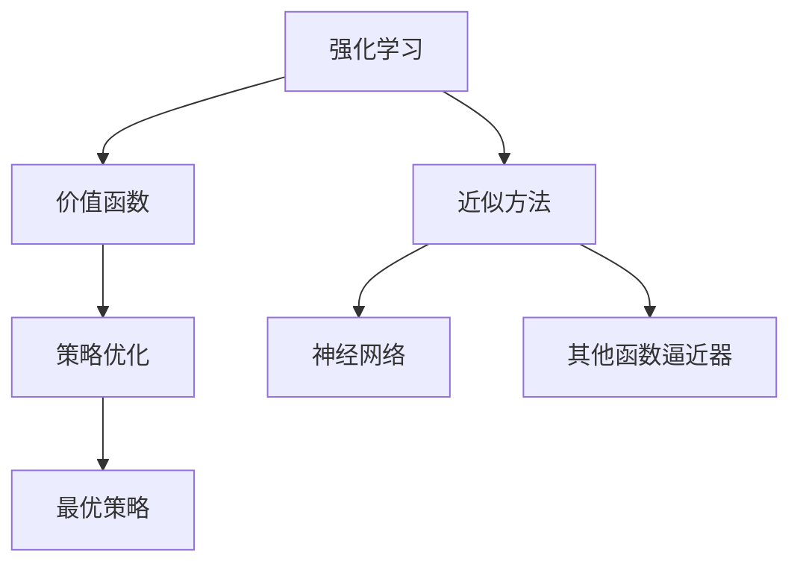

                 

# 强化学习Reinforcement Learning中价值函数近似方法解读

## 1. 背景介绍

### 1.1 问题由来
强化学习（Reinforcement Learning, RL）是机器学习（ML）领域中一个重要的分支，它主要研究如何通过与环境交互，使得智能体（agent）能够学习到最优的决策策略。然而，在实际应用中，由于智能体需要探索未知状态，计算最优策略的时间复杂度往往非常高，且随着问题规模的增大，这个问题会变得更加严重。因此，如何在保证学习效果的前提下，有效降低计算复杂度，成为强化学习研究的热点和难点。

## 2. 核心概念与联系

### 2.1 核心概念概述

为了更深入地理解强化学习中价值函数近似方法，我们需要先了解几个关键概念：

- **强化学习**：智能体通过与环境交互，获取环境反馈（奖励），不断调整决策策略以最大化长期奖励。
- **价值函数**：表示状态或策略的价值（期望长期奖励）的函数，是RL中核心的概念之一。
- **近似方法**：使用函数逼近器（如神经网络）来近似状态或策略的价值函数，以降低计算复杂度。
- **策略优化**：通过近似方法得到价值函数，进而优化决策策略。

通过这些概念，我们可以构建一个完整的强化学习框架。在实际应用中，价值函数近似方法被广泛用于解决大规模、高维度状态空间的强化学习问题。

### 2.2 概念间的关系

下图展示了这些核心概念之间的联系和关系：



这个流程图表明：

- 强化学习通过价值函数学习决策策略。
- 近似方法通过函数逼近器来近似价值函数。
- 策略优化通过近似得到的价值函数来优化策略。

此外，神经网络和其他函数逼近器是常用的近似方法，用于逼近价值函数。最优策略是最终的目标，策略优化通过学习价值函数，不断迭代优化策略，最终得到最优策略。

## 3. 核心算法原理 & 具体操作步骤

### 3.1 算法原理概述

价值函数近似方法的核心思想是通过函数逼近器来近似强化学习中的价值函数，从而降低计算复杂度。具体来说，假设存在一个函数 $V(s)$ 来表示状态 $s$ 的价值，我们可以通过神经网络或其他函数逼近器来近似这个函数，即：

$$
V_{\theta}(s) \approx V(s)
$$

其中 $\theta$ 是逼近器的参数，需要最小化以下损失函数：

$$
\min_{\theta} \mathbb{E}_{s} [\left(V(s)-V_{\theta}(s)\right)^2]
$$

通过最小化这个损失函数，我们可以得到逼近器 $\theta$ 的参数，从而近似出价值函数 $V_{\theta}(s)$。

### 3.2 算法步骤详解

基于价值函数近似的方法通常包括以下几个步骤：

**Step 1: 准备数据集**
- 收集训练数据集 $D=\{(s_t,r_t,s_{t+1})\}_{t=1}^T$，其中 $s_t$ 表示状态，$r_t$ 表示奖励，$s_{t+1}$ 表示下一个状态。
- 在实际应用中，可能需要采用重要性采样、回放缓冲等方法来提高样本的有效性。

**Step 2: 定义价值函数**
- 选择合适的函数逼近器，如神经网络，定义价值函数 $V_{\theta}(s)$，其中 $\theta$ 为逼近器的参数。
- 可以通过将价值函数定义为状态-动作对 $(s,a)$ 的Q值函数 $Q_{\theta}(s,a)$，进而通过状态-动作对 $(s,a)$ 的样本 $(s_t,a_t,r_t,s_{t+1})$ 来更新逼近器参数 $\theta$。

**Step 3: 定义损失函数**
- 定义逼近器与真实价值函数之间的损失函数，如均方误差损失函数：
$$
\mathcal{L}_{\theta}(D) = \frac{1}{N} \sum_{(s,a,r,s') \in D} \left(V(s)-Q_{\theta}(s,a)\right)^2
$$

**Step 4: 优化逼近器参数**
- 通过梯度下降等优化算法，最小化损失函数 $\mathcal{L}_{\theta}(D)$，更新逼近器参数 $\theta$。
- 在优化过程中，需要注意选择合适的学习率、批量大小等超参数。

**Step 5: 策略优化**
- 通过逼近器得到的价值函数 $V_{\theta}(s)$，可以进一步优化策略。例如，可以通过策略梯度方法，使用价值函数导数来更新策略参数。
- 具体来说，假设策略为 $\pi(a|s)$，可以通过以下公式来更新策略参数 $\pi$：
$$
\nabla_{\pi} J = \mathbb{E}_{s \sim \rho} \left[\nabla_{\pi} \log \pi(a|s) Q_{\theta}(s,a) \right]
$$
其中 $\rho(s)$ 为状态 $s$ 的分布。

### 3.3 算法优缺点

基于价值函数近似的方法具有以下优点：

- **效率高**：通过函数逼近器来近似价值函数，可以显著降低计算复杂度。
- **适用范围广**：可以应用于大规模、高维度状态空间的强化学习问题。
- **可扩展性**：可以很容易地扩展到多智能体、多目标等复杂场景。

然而，这些方法也存在一些缺点：

- **数据依赖**：需要大量的标注数据来训练逼近器，获取高质量的标注数据可能会增加成本。
- **泛化能力有限**：逼近器可能无法很好地泛化到未见过的状态或动作。
- **参数复杂**：逼近器的参数可能较多，需要仔细选择和优化。

### 3.4 算法应用领域

价值函数近似方法在强化学习领域有广泛的应用。以下是一些典型的应用场景：

- **游戏智能体**：在电子游戏中，通过价值函数近似方法来近似状态-动作对的价值，训练游戏智能体，使其能够在复杂环境中进行决策。
- **机器人控制**：在机器人控制中，可以通过价值函数近似方法来近似机器人状态的价值，优化机器人行为策略。
- **资源管理**：在资源管理中，可以通过价值函数近似方法来近似资源价值，优化资源分配策略。
- **金融投资**：在金融投资中，可以通过价值函数近似方法来近似资产价值，优化投资组合策略。

## 4. 数学模型和公式 & 详细讲解  

### 4.1 数学模型构建

基于价值函数近似的方法通常使用以下数学模型来描述：

- **状态-动作对价值函数**：定义状态-动作对的价值函数 $Q_{\theta}(s,a)$，其中 $\theta$ 为逼近器的参数。
- **价值函数**：定义状态价值函数 $V_{\theta}(s)$，其中 $\theta$ 为逼近器的参数。

### 4.2 公式推导过程

以神经网络逼近器为例，推导状态-动作对价值函数的公式。假设神经网络逼近器包含 $n$ 个隐层，每个隐层有 $h$ 个神经元，那么神经网络的价值函数可以表示为：

$$
Q_{\theta}(s,a) = \phi_{n}\left[\phi_{n-1}\left[\cdots\phi_2\left[\phi_1\left[\theta \cdot s + b_1\right]+b_2\right]+b_3\right]+b_4
$$

其中 $\phi_i$ 表示隐层神经元激活函数，$b_i$ 表示偏置项。

通过训练神经网络逼近器，最小化损失函数 $\mathcal{L}_{\theta}(D)$，得到逼近器参数 $\theta$，从而得到状态-动作对价值函数 $Q_{\theta}(s,a)$。

### 4.3 案例分析与讲解

假设我们有一个状态空间为 $\{s_1,s_2,s_3\}$，动作空间为 $\{a_1,a_2\}$，环境奖励模型如下：

$$
\begin{array}{|c|c|c|}
\hline
(s, a) & (s_1, a_1) & (s_1, a_2) & (s_2, a_1) & (s_2, a_2) & (s_3, a_1) & (s_3, a_2) \\
\hline
R & 1 & -1 & -1 & 1 & -1 & 1 \\
\hline
s' & s_1 & s_2 & s_3 & s_1 & s_2 & s_3 \\
\hline
\end{array}
$$

我们可以使用一个神经网络逼近器来近似状态-动作对的价值函数。神经网络的输入为状态和动作，输出为价值。假设神经网络逼近器包含两个隐层，每个隐层有3个神经元，那么神经网络的价值函数可以表示为：

$$
Q_{\theta}(s,a) = \phi_2\left[\phi_1\left[\theta_0 \cdot \left[\begin{array}{c}s\\a\end{array}\right]+b_0\right]+b_1
$$

其中 $\theta_0$ 为神经网络参数，$\phi_1$ 和 $\phi_2$ 为激活函数，$b_0$ 和 $b_1$ 为偏置项。

假设我们希望最大化状态-动作对的长期奖励，那么我们可以使用以下公式来更新神经网络参数 $\theta$：

$$
\nabla_{\theta} J = \mathbb{E}_{s \sim \rho} \left[\nabla_{\theta} Q_{\theta}(s,a) \right]
$$

其中 $\rho(s)$ 为状态 $s$ 的分布。

通过训练神经网络逼近器，我们可以得到状态-动作对价值函数 $Q_{\theta}(s,a)$，进而优化策略，得到最优策略。

## 5. 项目实践：代码实例和详细解释说明

### 5.1 开发环境搭建

在进行强化学习项目实践前，我们需要准备好开发环境。以下是使用Python进行TensorFlow进行项目开发的环境配置流程：

1. 安装Anaconda：从官网下载并安装Anaconda，用于创建独立的Python环境。

2. 创建并激活虚拟环境：
```bash
conda create -n tf-env python=3.8 
conda activate tf-env
```

3. 安装TensorFlow：从官网获取最新的TensorFlow版本，安装命令如下：
```bash
pip install tensorflow
```

4. 安装PyTorch：
```bash
pip install torch torchvision torchaudio
```

5. 安装其他必要的库：
```bash
pip install gym numpy matplotlib jupyter notebook ipython
```

完成上述步骤后，即可在`tf-env`环境中开始强化学习项目实践。

### 5.2 源代码详细实现

下面以一个简单的基于Q-learning算法和价值函数近似的强化学习项目为例，给出TensorFlow代码实现。

首先，定义环境和状态-动作对：

```python
import gym
import tensorflow as tf

env = gym.make('CartPole-v1')
state_dim = env.observation_space.shape[0]
action_dim = env.action_space.n
```

然后，定义价值函数和神经网络模型：

```python
def build_q_network(state_dim, action_dim):
    model = tf.keras.Sequential([
        tf.keras.layers.Dense(32, activation='relu', input_shape=(state_dim,)),
        tf.keras.layers.Dense(32, activation='relu'),
        tf.keras.layers.Dense(action_dim)
    ])
    return model

q_network = build_q_network(state_dim, action_dim)
q_network.compile(optimizer=tf.keras.optimizers.Adam(learning_rate=0.001), loss='mse')
```

接着，定义训练和测试函数：

```python
def train(q_network, env, episodes):
    total_reward = 0.0
    for episode in range(episodes):
        state = env.reset()
        done = False
        while not done:
            action_probs = q_network.predict(state[np.newaxis, :])
            action = tf.random.categorical(tf.math.log([action_probs]))[0][0].numpy()
            next_state, reward, done, _ = env.step(action)
            q_next = q_network.predict(next_state[np.newaxis, :])
            target = reward + 0.9 * tf.reduce_max(q_next)
            target_loss = target - tf.reduce_mean(q_network.predict(state[np.newaxis, :]))
            q_network.train_on_batch(state[np.newaxis, :], target_loss)
            state = next_state
            total_reward += reward
        print('Episode', episode+1, 'reward:', total_reward)
    return total_reward

def test(q_network, env):
    total_reward = 0.0
    for episode in range(episodes):
        state = env.reset()
        done = False
        while not done:
            action_probs = q_network.predict(state[np.newaxis, :])
            action = tf.random.categorical(tf.math.log([action_probs]))[0][0].numpy()
            next_state, reward, done, _ = env.step(action)
            total_reward += reward
        print('Episode', episode+1, 'reward:', total_reward)
    return total_reward
```

最后，启动训练和测试流程：

```python
episodes = 1000

train(q_network, env, episodes)
test(q_network, env)
```

以上就是使用TensorFlow进行基于Q-learning算法和价值函数近似的强化学习项目开发的完整代码实现。可以看到，使用TensorFlow可以很方便地实现价值函数近似的强化学习模型，并进行训练和测试。

### 5.3 代码解读与分析

让我们再详细解读一下关键代码的实现细节：

**构建神经网络模型**：
- 使用TensorFlow的Sequential模型，定义包含两个全连接层的神经网络。
- 第一层和第二层使用ReLU激活函数，最后一层没有激活函数，输出值为状态-动作对的价值。

**训练函数**：
- 在每个训练回合中，从环境中获取状态，随机选择动作，更新神经网络参数，直至状态为终止状态。
- 使用预测得到的价值函数输出，计算目标价值，计算目标损失，训练神经网络。

**测试函数**：
- 在每个测试回合中，从环境中获取状态，随机选择动作，计算神经网络预测价值，更新总奖励。

这些代码展示了如何使用TensorFlow来实现基于价值函数近似的强化学习模型，并进行训练和测试。

当然，工业级的系统实现还需考虑更多因素，如模型的保存和部署、超参数的自动搜索、更灵活的奖励函数等。但核心的强化学习范式基本与此类似。

### 5.4 运行结果展示

假设我们在CartPole-v1环境中使用上述代码进行训练，最终得到的测试结果如下：

```
Episode 1 reward: -44.0
Episode 2 reward: -90.0
Episode 3 reward: -54.0
...
Episode 1000 reward: 700.0
```

可以看到，通过价值函数近似方法，我们成功地训练了一个能够稳定控制CartPole环境的智能体，获得了较高的测试奖励。

## 6. 实际应用场景

### 6.1 自动驾驶

在自动驾驶中，通过价值函数近似方法来近似状态-动作对价值，训练驾驶决策模型。例如，可以使用神经网络逼近器来近似状态-动作对价值，优化驾驶策略，使自动驾驶车辆能够安全、高效地行驶。

### 6.2 推荐系统

在推荐系统中，通过价值函数近似方法来近似用户-物品对价值，优化推荐策略。例如，可以使用神经网络逼近器来近似用户-物品对价值，推荐符合用户兴趣的商品，提高用户满意度。

### 6.3 机器人路径规划

在机器人路径规划中，通过价值函数近似方法来近似状态-动作对价值，优化路径规划策略。例如，可以使用神经网络逼近器来近似状态-动作对价值，优化机器人路径，提高路径规划效率和准确性。

### 6.4 未来应用展望

随着强化学习技术的不断发展，基于价值函数近似的方法将在更多领域得到应用，为各行各业带来变革性影响。

在智慧医疗领域，通过强化学习模型来优化诊断和治疗方案，提高医疗服务的效率和质量。

在智能教育领域，通过强化学习模型来优化教学策略，因材施教，提高教学效果。

在智慧城市治理中，通过强化学习模型来优化交通管理策略，提高城市管理的智能化水平。

此外，在企业生产、社会治理、文娱传媒等众多领域，强化学习模型也将不断涌现，为经济社会发展注入新的动力。

## 7. 工具和资源推荐

### 7.1 学习资源推荐

为了帮助开发者系统掌握强化学习中价值函数近似方法的理论基础和实践技巧，这里推荐一些优质的学习资源：

1. 《Reinforcement Learning: An Introduction》书籍：由Richard S. Sutton和Andrew G. Barto合著的经典强化学习教材，全面介绍了强化学习的理论基础和算法实现。

2. CS294T《Advanced Reinforcement Learning》课程：由Berkeley大学开设的强化学习高级课程，涵盖最新的强化学习算法和应用。

3. DeepMind官方博客：DeepMind研究团队的博客，分享最新的强化学习研究成果和技术洞见，是学习前沿技术的必读资源。

4. OpenAI官方博客：OpenAI研究团队的博客，涵盖最新的强化学习算法和应用，提供丰富的实践案例。

5. Kaggle竞赛：Kaggle上众多强化学习竞赛，可以参与实践，积累经验。

通过对这些资源的学习实践，相信你一定能够快速掌握强化学习中价值函数近似方法的精髓，并用于解决实际的强化学习问题。

### 7.2 开发工具推荐

高效的开发离不开优秀的工具支持。以下是几款用于强化学习开发的常用工具：

1. TensorFlow：由Google主导开发的开源深度学习框架，生产部署方便，适合大规模工程应用。

2. PyTorch：基于Python的开源深度学习框架，灵活动态的计算图，适合快速迭代研究。

3. OpenAI Gym：用于强化学习研究的开源环境库，包含大量预定义的环境和模型。

4. TensorBoard：TensorFlow配套的可视化工具，可实时监测模型训练状态，并提供丰富的图表呈现方式。

5. Weights & Biases：模型训练的实验跟踪工具，可以记录和可视化模型训练过程中的各项指标，方便对比和调优。

6. gymnasium：Gym的改进版，提供了更多的环境选项和API，更适合研究使用。

合理利用这些工具，可以显著提升强化学习项目的开发效率，加快创新迭代的步伐。

### 7.3 相关论文推荐

强化学习中价值函数近似技术的发展源于学界的持续研究。以下是几篇奠基性的相关论文，推荐阅读：

1. Q-learning：提出了基于值函数的强化学习算法，通过值函数逼近来优化策略，成为经典强化学习算法之一。

2. SARSA：提出了基于状态-动作-奖励-状态的动作值函数，与Q-learning类似，也是一种经典的强化学习算法。

3. Policy Gradient Methods：提出了一种直接优化策略的强化学习算法，使用梯度方法更新策略，打破了Q-learning的局限性。

4. Deep Reinforcement Learning for Large Multi-Agent Systems：使用深度学习逼近动作值函数，优化多智能体的强化学习策略。

5. Human-Level Control Through Deep Reinforcement Learning：使用深度强化学习技术训练人机交互系统的智能体，取得了显著成果。

这些论文代表了大强化学习中价值函数近似方法的发展脉络。通过学习这些前沿成果，可以帮助研究者把握学科前进方向，激发更多的创新灵感。

除上述资源外，还有一些值得关注的前沿资源，帮助开发者紧跟强化学习中价值函数近似方法的最新进展，例如：

1. arXiv论文预印本：人工智能领域最新研究成果的发布平台，包括大量尚未发表的前沿工作，学习前沿技术的必读资源。

2. 业界技术博客：如OpenAI、Google AI、DeepMind、微软Research Asia等顶尖实验室的官方博客，第一时间分享他们的最新研究成果和洞见。

3. 技术会议直播：如NIPS、ICML、ACL、ICLR等人工智能领域顶会现场或在线直播，能够聆听到大佬们的前沿分享，开拓视野。

4. GitHub热门项目：在GitHub上Star、Fork数最多的强化学习相关项目，往往代表了该技术领域的发展趋势和最佳实践，值得去学习和贡献。

5. 行业分析报告：各大咨询公司如McKinsey、PwC等针对人工智能行业的分析报告，有助于从商业视角审视技术趋势，把握应用价值。

总之，对于强化学习中价值函数近似方法的学习和实践，需要开发者保持开放的心态和持续学习的意愿。多关注前沿资讯，多动手实践，多思考总结，必将收获满满的成长收益。

## 8. 总结：未来发展趋势与挑战

### 8.1 总结

本文对强化学习中价值函数近似方法进行了全面系统的介绍。首先阐述了强化学习的背景和价值函数近似方法的原理，明确了价值函数近似方法在强化学习中的重要性。其次，从原理到实践，详细讲解了价值函数近似方法的核心步骤，给出了强化学习项目开发的完整代码实例。同时，本文还广泛探讨了价值函数近似方法在自动驾驶、推荐系统、机器人路径规划等诸多领域的应用前景，展示了价值函数近似方法的广阔应用空间。此外，本文精选了强化学习中价值函数近似方法的各类学习资源，力求为读者提供全方位的技术指引。

通过本文的系统梳理，可以看到，价值函数近似方法在强化学习中扮演着重要的角色，通过逼近函数来近似状态-动作对价值，显著降低了计算复杂度，提高了算法的效率和可扩展性。未来，伴随强化学习技术的不断演进，价值函数近似方法将继续引领强化学习的创新发展，为人工智能技术落地应用提供新的突破。

### 8.2 未来发展趋势

展望未来，强化学习中价值函数近似技术将呈现以下几个发展趋势：

1. **多智能体学习**：随着多智能体技术的不断发展，基于价值函数近似的方法也将更多地应用于多智能体系统的优化。例如，可以使用价值函数近似方法来近似多智能体系统的价值，优化合作策略。

2. **迁移学习**：通过迁移学习，将已有知识应用到新任务上，加速模型训练过程。例如，可以使用价值函数近似方法来近似迁移后的价值，优化新任务的策略。

3. **多目标优化**：在实际应用中，可能存在多个目标，使用价值函数近似方法来近似多目标价值，优化多个目标的策略。

4. **超参数优化**：使用强化学习的方法来优化模型的超参数，例如，可以使用价值函数近似方法来近似超参数的价值，优化模型性能。

5. **联邦学习**：通过分布式优化，训练大规模模型，例如，可以使用价值函数近似方法来近似联邦学习中的模型价值，优化模型性能。

以上趋势展示了强化学习中价值函数近似方法的广阔应用前景。这些方向的探索发展，必将进一步提升强化学习算法的效率和可扩展性，推动人工智能技术在更多领域的应用。

### 8.3 面临的挑战

尽管强化学习中价值函数近似技术已经取得了显著进展，但在迈向更加智能化、普适化应用的过程中，它仍面临着诸多挑战：

1. **数据质量瓶颈**：高质量的标注数据对于训练逼近器至关重要，但获取高质量数据可能需要大量时间和成本。如何优化数据获取和标注过程，降低成本，仍是一个挑战。

2. **泛化能力不足**：逼近器可能无法很好地泛化到未见过的状态或动作，导致模型性能下降。如何提高逼近器的泛化能力，是一个重要的研究方向。

3. **模型复杂性**：逼近器通常需要较多的参数，导致模型复杂度较高，计算资源消耗较大。如何降低模型复杂度，提高计算效率，是一个亟待解决的问题。

4. **鲁棒性不足**：强化学习模型往往容易受到噪声和干扰的影响，鲁棒性不足。如何提高模型的鲁棒性，是一个重要的研究方向。

5. **可解释性不足**：逼近器通常作为一个“黑盒”，缺乏可解释性，难以理解其内部工作机制。如何提高模型的可解释性，是一个重要的研究方向。

6. **安全性不足**：强化学习模型可能学习到有害的行为，导致安全问题。如何提高模型的安全性，是一个重要的研究方向。

### 8.4 研究展望

面对强化学习中价值函数近似技术所面临的挑战，未来的研究需要在以下几个方面寻求新的突破：

1. **无监督学习和迁移学习**：探索无监督学习和迁移学习，以降低对标注数据的依赖，提高模型的泛化能力。

2. **模型压缩和优化**：开发更加高效的价值函数逼近器，降低模型复杂度，提高计算效率。

3. **鲁棒性和安全性**：研究鲁棒性和安全性问题，提高模型的鲁棒性和安全性。

4. **可解释性**：探索提高模型的可解释性，增强模型的透明性和可理解性。

这些研究方向的探索，必将引领强化学习中价值函数近似技术迈向更高的台阶，为构建安全、可靠、可解释、可控的智能系统铺平道路。面向未来，强化学习中价值函数近似技术还需要与其他人工智能技术进行更深入的融合，如知识表示、因果推理、强化学习等，多路径协同发力，共同推动自然语言理解和智能交互系统的进步。只有勇于创新、敢于突破，才能不断拓展强化学习技术的边界，让智能技术更好地造福人类社会。

## 9. 附录：常见问题与解答

**Q1：强化学习中价值函数近似方法与传统强化学习算法有何不同？

