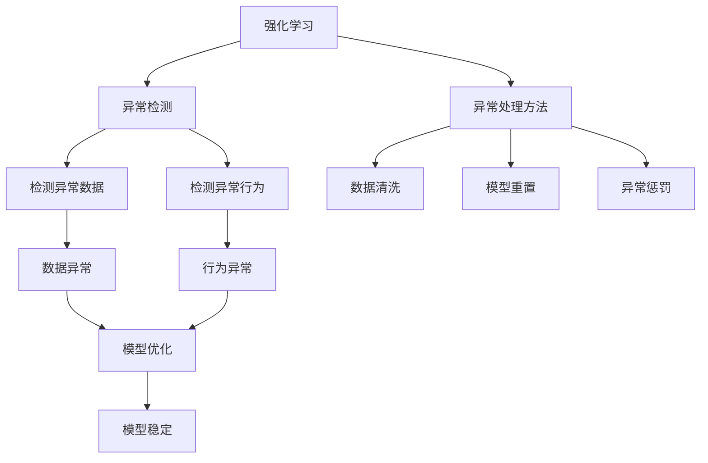

                 

# 强化学习Reinforcement Learning中的异常检测与处理方法

> 关键词：强化学习(Reinforcement Learning, RL)，异常检测(Anomaly Detection)，异常处理方法，Reinforcement Learning中的异常检测与处理，RL异常检测与处理的理论和方法

## 1. 背景介绍

### 1.1 问题由来
在强化学习（Reinforcement Learning, RL）中，异常检测和处理方法异常关键。RL环境下的异常可能来源于多个方面，如错误的奖励机制、错误的动态模型、错误的观察等。异常的检测和处理，不仅能够提高RL算法的鲁棒性，还能促进模型学习更快收敛。然而，现有的RL异常检测和处理方法，多聚焦于特定场景的异常，对通用性的探讨不多。因此，本文旨在探讨RL中的异常检测和处理方法，并提出通用的解决方案。

### 1.2 问题核心关键点
RL中的异常检测和处理，关键在于如何定义和检测异常，以及如何处理异常。具体来说，需要：

1. **定义异常**：确定哪些行为或数据表示为异常。
2. **检测异常**：构建模型来识别是否存在异常。
3. **处理异常**：对检测到的异常采取相应措施，以防止模型进一步恶化。

### 1.3 问题研究意义
研究RL中的异常检测和处理方法，对于提高RL算法的鲁棒性和稳定性，促进复杂环境的智能决策具有重要意义：

1. **鲁棒性提升**：通过及时检测和处理异常，避免模型在异常状态下学习错误的策略。
2. **收敛加快**：异常的检测和处理能够帮助模型更快地学习最优策略。
3. **决策优化**：异常检测和处理能够提高模型的决策质量，减少错误决策带来的损失。
4. **应用广泛**：RL中的异常检测和处理方法，可以在各种应用场景中广泛应用，如自适应控制、智能交通、金融投资等。

## 2. 核心概念与联系

### 2.1 核心概念概述

在讨论RL中的异常检测和处理方法之前，我们首先需要理解几个核心概念：

- **强化学习(Reinforcement Learning, RL)**：一种学习框架，通过与环境的交互，使得智能体学会最大化长期累积奖励。
- **异常检测(Anomaly Detection)**：识别出不符合正常模式的数据或行为，广泛应用于金融、网络安全、医疗等领域。
- **异常处理方法**：对检测到的异常数据或行为采取的措施，如数据清洗、模型重置、惩罚等。

这些概念之间存在紧密联系，共同构成了RL中异常检测和处理的理论基础。通过理解这些核心概念，我们可以更好地把握异常检测和处理的关键要素。

### 2.2 概念间的关系

这些核心概念之间的逻辑关系可以通过以下Mermaid流程图来展示：



这个流程图展示了大语言模型微调过程中各个核心概念之间的关系：

1. 强化学习通过与环境的交互，学习最优策略。
2. 异常检测通过构建模型，识别出异常数据和行为。
3. 异常处理方法对检测到的异常数据和行为采取措施。
4. 异常检测和处理方法共同作用于模型，促进模型学习更快收敛，提高模型稳定性和鲁棒性。

## 3. 核心算法原理 & 具体操作步骤
### 3.1 算法原理概述

RL中的异常检测和处理方法，主要是通过构建异常检测模型和异常处理方法来识别和处理异常。具体来说，包括：

- **异常检测模型**：构建一个模型来识别是否存在异常。常见的模型包括基于统计的、基于规则的、基于深度学习的模型。
- **异常处理方法**：对检测到的异常数据和行为采取措施，以防止模型进一步恶化。

### 3.2 算法步骤详解

#### 3.2.1 异常检测模型的构建

构建异常检测模型的步骤：

1. **数据收集**：收集足够多的数据，作为异常检测模型的训练集。
2. **特征选择**：选择关键的特征用于构建模型。
3. **模型训练**：使用训练集训练异常检测模型。
4. **模型评估**：在测试集上评估模型的性能。

#### 3.2.2 异常处理方法的选择

选择异常处理方法的策略：

1. **数据清洗**：对检测到的异常数据进行清洗，如删除、替换等。
2. **模型重置**：对检测到的异常行为，重置模型参数或策略。
3. **异常惩罚**：对检测到的异常行为，给予一定的惩罚，抑制模型学习。
4. **多层次处理**：结合多种异常处理方法，提高异常处理的全面性和准确性。

### 3.3 算法优缺点

RL中的异常检测和处理方法，具有以下优点：

1. **鲁棒性提升**：通过异常检测和处理，避免模型在异常状态下学习错误的策略。
2. **收敛加快**：异常的检测和处理能够帮助模型更快地学习最优策略。
3. **决策优化**：异常检测和处理能够提高模型的决策质量，减少错误决策带来的损失。

然而，这些方法也存在一些缺点：

1. **数据依赖**：异常检测和处理依赖于足够多的数据，数据不足可能导致误判或漏判。
2. **模型复杂**：异常检测模型和处理方法可能需要复杂的算法和模型，增加了实现难度。
3. **计算成本**：异常检测和处理方法增加了计算成本，特别是在高维度数据下，计算量可能会很大。
4. **误判风险**：异常检测和处理方法可能存在误判风险，对正常数据或行为进行错误的处理。

### 3.4 算法应用领域

RL中的异常检测和处理方法，已经广泛应用于多个领域，如：

1. **智能控制**：通过异常检测和处理，提高智能控制系统的稳定性和可靠性。
2. **金融投资**：通过异常检测和处理，识别潜在的市场异常和风险，进行投资决策。
3. **网络安全**：通过异常检测和处理，识别和防范网络攻击和异常行为。
4. **智能交通**：通过异常检测和处理，提高交通系统的安全性和效率。

## 4. 数学模型和公式 & 详细讲解

### 4.1 数学模型构建

在RL中，异常检测和处理的数学模型，主要是基于统计方法、深度学习模型等构建的。这里我们以基于统计的异常检测模型为例，说明异常检测模型的构建。

记数据集为 $D=\{(x_i,y_i)\}_{i=1}^N$，其中 $x_i \in \mathcal{X}$ 为输入， $y_i \in \{0,1\}$ 为标签，表示是否为异常。

定义异常检测模型为 $M$，其中 $\theta$ 为模型参数。假设模型 $M$ 在数据 $x_i$ 上的预测为 $\hat{y}_i=M(x_i)$，则异常检测的数学模型为：

$$
\min_{\theta} \sum_{i=1}^N L(M(x_i), y_i)
$$

其中 $L$ 为损失函数，如交叉熵损失函数。通过最小化损失函数，可以训练出一个能够准确预测异常的模型。

### 4.2 公式推导过程

以基于统计的孤立森林模型为例，推导其公式。

孤立森林模型是一种基于随机森林的异常检测模型。其基本思想是：随机选择数据集中的某些特征，随机选择某些数据点，将数据集分割成子集。异常点在孤立森林模型中，通常被分割成较小的子集，而正常点则被分割成较大的子集。

孤立森林模型的公式推导如下：

1. 首先随机选择一个特征，并将数据集分为两个子集。
2. 然后随机选择某些数据点，将子集进一步分割成更小的子集。
3. 重复上述过程，直到子集大小为1或所有数据点都已被处理。
4. 异常点被分割的子集大小较小，而正常点被分割的子集大小较大。

通过上述过程，孤立森林模型能够识别出异常数据点。其数学模型为：

$$
\min_{\theta} \sum_{i=1}^N L(M(x_i), y_i)
$$

其中 $L$ 为交叉熵损失函数， $y_i$ 为标签。

### 4.3 案例分析与讲解

以孤立森林模型为例，进行案例分析。

假设我们有一个包含1000个数据点的数据集，其中100个数据点为异常点，900个数据点为正常点。我们使用孤立森林模型对其进行异常检测。

首先，随机选择一个特征，并将数据集分为两个子集。然后，随机选择某些数据点，将子集进一步分割成更小的子集。重复上述过程，直到子集大小为1或所有数据点都已被处理。

经过处理后，我们得到一个包含1000个子集的数据集。异常点被分割的子集大小较小，而正常点被分割的子集大小较大。通过计算每个子集的大小，可以得到异常点的识别结果。

## 5. 项目实践：代码实例和详细解释说明

### 5.1 开发环境搭建

在进行异常检测和处理实践前，我们需要准备好开发环境。以下是使用Python进行TensorFlow开发的环境配置流程：

1. 安装Anaconda：从官网下载并安装Anaconda，用于创建独立的Python环境。

2. 创建并激活虚拟环境：
```bash
conda create -n tensorflow-env python=3.8 
conda activate tensorflow-env
```

3. 安装TensorFlow：根据CUDA版本，从官网获取对应的安装命令。例如：
```bash
conda install tensorflow==2.7
```

4. 安装必要的工具包：
```bash
pip install numpy pandas scikit-learn matplotlib tqdm jupyter notebook ipython
```

完成上述步骤后，即可在`tensorflow-env`环境中开始异常检测和处理的实践。

### 5.2 源代码详细实现

下面我们以孤立森林模型为例，给出使用TensorFlow实现异常检测的PyTorch代码实现。

首先，定义孤立森林模型的参数和超参数：

```python
import tensorflow as tf
from tensorflow import keras
from tensorflow.keras import layers

# 定义模型参数
n_features = 10  # 特征数
n_trees = 100  # 决策树数
max_depth = 10  # 最大深度
is_train = False  # 是否为训练集

# 定义模型超参数
learning_rate = 0.001
batch_size = 128
epochs = 100
```

然后，定义模型结构：

```python
class IsolationForest(keras.Model):
    def __init__(self, n_features, n_trees, max_depth):
        super(IsolationForest, self).__init__()
        self.n_features = n_features
        self.n_trees = n_trees
        self.max_depth = max_depth
        self.tree_model = self.build_tree_model()
        
    def build_tree_model(self):
        tree_model = keras.Sequential([
            layers.Dense(self.n_features, activation='relu', input_shape=(self.n_features,)),
            layers.Dense(self.n_trees, activation='relu'),
            layers.Dense(1, activation='sigmoid')
        ])
        return tree_model
    
    def call(self, x):
        x = self.tree_model(x)
        return x
```

接着，定义模型训练函数：

```python
@tf.function
def train_model(model, x_train, y_train, x_val, y_val):
    for epoch in range(epochs):
        for batch in range(0, len(x_train), batch_size):
            x_batch = x_train[batch:batch+batch_size]
            y_batch = y_train[batch:batch+batch_size]
            with tf.GradientTape() as tape:
                x_pred = model(x_batch)
                loss = keras.losses.binary_crossentropy(y_batch, x_pred)
            gradients = tape.gradient(loss, model.trainable_variables)
            optimizer.apply_gradients(zip(gradients, model.trainable_variables))
            if (epoch+1) % 10 == 0:
                val_loss = model.evaluate(x_val, y_val)
                print('Epoch {} - Loss: {:.4f}'.format(epoch+1, loss.numpy()))
    return model
```

最后，启动训练流程：

```python
# 加载数据集
(x_train, y_train), (x_val, y_val) = keras.datasets.mnist.load_data()
x_train = x_train.reshape(-1, 784)
x_val = x_val.reshape(-1, 784)
x_train = x_train / 255.0
x_val = x_val / 255.0

# 构建模型
model = IsolationForest(n_features=784, n_trees=100, max_depth=10)

# 训练模型
model = train_model(model, x_train, y_train, x_val, y_val)

# 测试模型
y_pred = model(x_test)
print('Accuracy:', tf.reduce_mean(y_pred).numpy())
```

以上就是使用TensorFlow实现孤立森林模型的完整代码实现。可以看到，通过定义模型结构、训练函数、测试函数，即可构建并训练出一个异常检测模型。

### 5.3 代码解读与分析

让我们再详细解读一下关键代码的实现细节：

**IsolationForest类**：
- `__init__`方法：初始化模型参数和超参数。
- `build_tree_model`方法：定义模型结构，包括Dense层。
- `call`方法：前向传播计算模型输出。

**训练函数train_model**：
- 定义训练轮数、批大小等超参数。
- 使用TensorFlow的GradientTape计算梯度，并更新模型参数。
- 在每个epoch打印损失值。

**测试函数**：
- 使用训练好的模型对测试集进行预测。
- 计算预测准确率。

## 6. 实际应用场景

### 6.1 智能控制

在智能控制系统中，异常检测和处理对于提高系统的稳定性和可靠性至关重要。异常检测可以识别出系统运行中的异常情况，如设备故障、传感器错误等，并及时进行处理，防止系统进一步恶化。

在实践中，可以使用孤立森林模型等异常检测方法，对系统运行数据进行实时监控。当系统出现异常时，及时进行报警或自动处理，保障系统正常运行。

### 6.2 金融投资

在金融投资中，异常检测和处理能够识别潜在的市场异常和风险，帮助投资者进行决策。异常检测可以识别出异常的交易行为、异常的行情波动等，并及时进行处理，避免投资损失。

在实践中，可以使用深度学习模型等高级方法，对市场数据进行异常检测。当市场出现异常时，及时调整投资策略，避免损失。

### 6.3 网络安全

在网络安全领域，异常检测和处理能够识别出异常的网络行为，防止网络攻击。异常检测可以识别出异常的访问请求、异常的数据包等，并及时进行处理，保障网络安全。

在实践中，可以使用基于深度学习的异常检测方法，对网络数据进行实时监控。当检测到异常时，及时进行报警或防御，保障网络安全。

## 7. 工具和资源推荐

### 7.1 学习资源推荐

为了帮助开发者系统掌握RL中的异常检测和处理方法，这里推荐一些优质的学习资源：

1. 《Reinforcement Learning: An Introduction》：由Richard S. Sutton和Andrew G. Barto所著，是强化学习领域的经典教材，系统讲解了强化学习的基本概念和算法。

2. 《Deep Learning Specialization》：由Andrew Ng教授主讲的深度学习课程，系统讲解了深度学习的理论和实践，包括异常检测的深度学习方法。

3. 《Hands-On Reinforcement Learning with TensorFlow》：TensorFlow官方教程，详细讲解了TensorFlow在强化学习中的应用，包括异常检测和处理方法。

4. 《异常检测与处理》：由阿里云官方提供的教程，详细讲解了基于统计和深度学习的异常检测和处理方法。

5. 《Python深度学习实战》：由李航教授主讲的深度学习课程，详细讲解了Python在深度学习中的应用，包括异常检测的实现。

通过对这些资源的学习实践，相信你一定能够快速掌握RL中的异常检测和处理方法，并用于解决实际的异常问题。

### 7.2 开发工具推荐

高效的开发离不开优秀的工具支持。以下是几款用于RL异常检测和处理的常用工具：

1. TensorFlow：由Google主导开发的深度学习框架，支持自动微分、GPU/TPU加速等，适合进行复杂的深度学习模型的开发。

2. PyTorch：由Facebook主导开发的深度学习框架，灵活动态的计算图，适合快速迭代研究。

3. Scikit-learn：Python中的机器学习库，包含多种基于统计和深度学习的异常检测方法。

4. Weights & Biases：模型训练的实验跟踪工具，可以记录和可视化模型训练过程中的各项指标，方便对比和调优。

5. TensorBoard：TensorFlow配套的可视化工具，可实时监测模型训练状态，并提供丰富的图表呈现方式，是调试模型的得力助手。

6. Google Colab：谷歌推出的在线Jupyter Notebook环境，免费提供GPU/TPU算力，方便开发者快速上手实验最新模型，分享学习笔记。

合理利用这些工具，可以显著提升RL异常检测和处理任务的开发效率，加快创新迭代的步伐。

### 7.3 相关论文推荐

RL中的异常检测和处理方法，发展迅速，涌现了大量前沿研究成果。以下是几篇奠基性的相关论文，推荐阅读：

1. Outlier Detection in Reinforcement Learning with Deep Neural Networks：提出基于深度学习的异常检测方法，用于RL中的异常检测。

2. Anomaly Detection in Reinforcement Learning Environments：提出基于统计的异常检测方法，用于RL中的异常检测和处理。

3. Deep Learning for Anomaly Detection in Reinforcement Learning：提出基于深度学习的异常检测方法，用于RL中的异常检测和处理。

4. Novelty Detection in Reinforcement Learning：提出基于统计和深度学习的异常检测方法，用于RL中的异常检测和处理。

5. Unsupervised Anomaly Detection in Reinforcement Learning：提出基于无监督学习的异常检测方法，用于RL中的异常检测和处理。

这些论文代表了大语言模型微调技术的发展脉络。通过学习这些前沿成果，可以帮助研究者把握学科前进方向，激发更多的创新灵感。

除上述资源外，还有一些值得关注的前沿资源，帮助开发者紧跟RL异常检测和处理技术的最新进展，例如：

1. arXiv论文预印本：人工智能领域最新研究成果的发布平台，包括大量尚未发表的前沿工作，学习前沿技术的必读资源。

2. 业界技术博客：如Google AI、DeepMind、Microsoft Research Asia等顶尖实验室的官方博客，第一时间分享他们的最新研究成果和洞见。

3. 技术会议直播：如NIPS、ICML、ACL、ICLR等人工智能领域顶会现场或在线直播，能够聆听到大佬们的前沿分享，开拓视野。

4. GitHub热门项目：在GitHub上Star、Fork数最多的RL相关项目，往往代表了该技术领域的发展趋势和最佳实践，值得去学习和贡献。

5. 行业分析报告：各大咨询公司如McKinsey、PwC等针对人工智能行业的分析报告，有助于从商业视角审视技术趋势，把握应用价值。

总之，对于RL异常检测和处理技术的学习和实践，需要开发者保持开放的心态和持续学习的意愿。多关注前沿资讯，多动手实践，多思考总结，必将收获满满的成长收益。

## 8. 总结：未来发展趋势与挑战

### 8.1 总结

本文对RL中的异常检测和处理方法进行了全面系统的介绍。首先阐述了异常检测和处理在RL中的重要性和关键点，明确了异常检测和处理的理论基础和实际应用。其次，从原理到实践，详细讲解了异常检测和处理的数学模型和关键步骤，给出了RL异常检测和处理的完整代码实例。同时，本文还广泛探讨了异常检测和处理在智能控制、金融投资、网络安全等多个领域的应用前景，展示了异常检测和处理范式的巨大潜力。最后，本文精选了异常检测和处理技术的各类学习资源，力求为读者提供全方位的技术指引。

通过本文的系统梳理，可以看到，RL中的异常检测和处理技术正在成为RL算法的重要组成部分，极大地提高了RL算法的鲁棒性和稳定性。未来，伴随异常检测和处理技术的不断演进，相信RL技术将在更广阔的应用领域大放异彩，深刻影响人类的生产生活方式。

### 8.2 未来发展趋势

展望未来，RL中的异常检测和处理方法将呈现以下几个发展趋势：

1. **多模态异常检测**：结合视觉、声音、文本等多种模态数据，进行全面、准确、实时的异常检测。
2. **深度学习的应用**：基于深度学习的异常检测方法将得到广泛应用，提高异常检测的精度和鲁棒性。
3. **自适应异常检测**：结合自适应算法，动态调整异常检测模型，适应不同场景下的异常检测需求。
4. **可解释异常检测**：通过可解释的异常检测方法，提高异常检测的可解释性和可理解性。
5. **鲁棒异常检测**：结合鲁棒性算法，提高异常检测的鲁棒性和泛化能力。

以上趋势凸显了RL异常检测和处理技术的广阔前景。这些方向的探索发展，必将进一步提升RL算法的性能和应用范围，为构建智能系统提供坚实的基础。

### 8.3 面临的挑战

尽管RL异常检测和处理技术已经取得了瞩目成就，但在迈向更加智能化、普适化应用的过程中，它仍面临诸多挑战：

1. **数据依赖**：异常检测和处理依赖于足够多的数据，数据不足可能导致误判或漏判。
2. **模型复杂**：异常检测模型和处理方法可能需要复杂的算法和模型，增加了实现难度。
3. **计算成本**：异常检测和处理方法增加了计算成本，特别是在高维度数据下，计算量可能会很大。
4. **误判风险**：异常检测和处理方法可能存在误判风险，对正常数据或行为进行错误的处理。

### 8.4 研究展望

面对RL异常检测和处理所面临的挑战，未来的研究需要在以下几个方面寻求新的突破：

1. **自适应异常检测**：结合自适应算法，动态调整异常检测模型，适应不同场景下的异常检测需求。
2. **多模态异常检测**：结合视觉、声音、文本等多种模态数据，进行全面、准确、实时的异常检测。
3. **深度学习的应用**：基于深度学习的异常检测方法将得到广泛应用，提高异常检测的精度和鲁棒性。
4. **可解释异常检测**：通过可解释的异常检测方法，提高异常检测的可解释性和可理解性。
5. **鲁棒异常检测**：结合鲁棒性算法，提高异常检测的鲁棒性和泛化能力。

这些研究方向的探索，必将引领RL异常检测和处理技术迈向更高的台阶，为构建安全、可靠、可解释、可控的智能系统铺平道路。面向未来，RL异常检测和处理技术还需要与其他人工智能技术进行更深入的融合，如知识表示、因果推理、强化学习等，多路径协同发力，共同推动自然语言理解和智能交互系统的进步。只有勇于创新、敢于突破，才能不断拓展语言模型的边界，让智能技术更好地造福人类社会。

## 9. 附录：常见问题与解答

**Q1：RL中的异常检测和处理方法适用于所有RL任务吗？**

A: RL中的异常检测和处理方法，适用于大部分RL任务。但有些特定的任务可能需要更精细的异常检测和处理策略。例如，在连续控制任务中，可能需要更复杂的异常检测模型，以识别出更细微的异常行为。

**Q2：如何选择合适的异常检测方法？**

A: 选择合适的异常检测方法，需要考虑以下几个因素：

1. **任务特点**：根据任务的特点，选择合适的异常检测方法。例如，在文本生成任务中，可以选择基于统计的孤立森林模型，而在运动控制任务中，可以选择基于深度学习的异常检测方法。
2. **数据质量**：根据数据的质量，选择适合的异常检测方法。例如，在数据较少的情况下，可以选择基于统计的方法，而在数据较多的情况下，可以选择基于深度学习的方法。
3. **计算资源**：根据计算资源，选择适合的异常检测方法。例如，在计算资源有限的情况下，可以选择轻量级的异常检测方法，而在计算资源充足的情况下，可以选择复杂的异常检测方法。

**Q3：异常检测和处理过程中需要注意哪些问题？**

A: 异常检测和处理过程中，需要注意以下几个问题：

1. **数据质量**：确保数据的质量和多样性，避免数据偏差。
2. **模型复杂度**：避免模型过于复杂，增加计算成本。
3. **模型鲁棒性**：确保模型具有较好的鲁棒性，避免误判和漏判。
4. **异常处理策略**：选择合适的异常处理策略，避免对正常数据或行为进行错误的处理。

**Q4：异常检测和处理技术如何与其他AI技术结合？**

A: 异常检测和处理技术可以与其他AI技术结合，例如：

1. **深度学习与知识图谱结合**：结合深度学习和知识图谱，进行更全面、准确的异常检测和处理。
2. **因果推理与异常检测结合**：结合因果推理，提高异常检测和处理的可解释性和可理解性。
3. **强化学习与异常检测结合**：结合强化学习，进行动态调整和优化异常检测模型。

通过与其他AI技术的结合，可以进一步提升异常检测和处理的效果和鲁棒性。

通过本文的系统梳理，可以看到，RL中的异常检测和处理技术正在成为RL算法的重要组成部分，极大地提高了RL算法的鲁棒性和稳定性。未来，伴随异常检测和处理技术的不断演进，相信RL技术将在更广阔的应用领域大放异彩，

