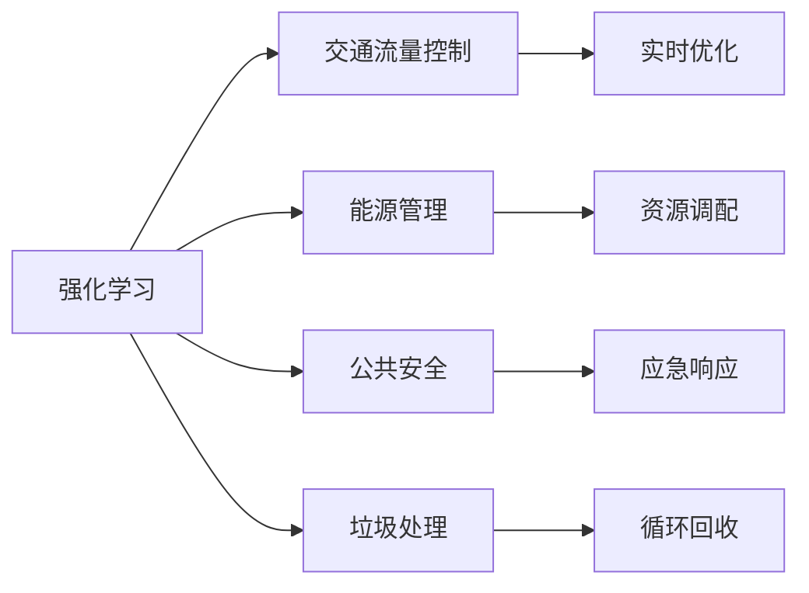
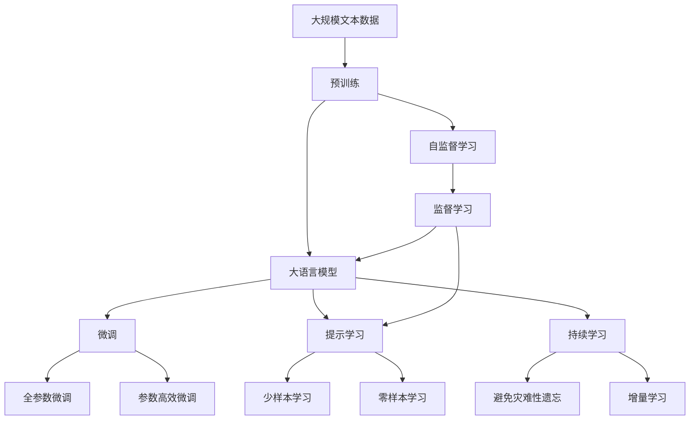

                 

# 强化学习Reinforcement Learning在智慧城市中的应用案例

## 1. 背景介绍

### 1.1 问题由来

智慧城市建设是当今城市发展的最新趋势，它通过先进的信息技术、大数据、人工智能等手段，实现城市管理的智能化、高效化和人性化。强化学习作为一种机器学习范式，以其在动态、复杂环境中进行智能决策的能力，成为智慧城市建设中的重要工具。

当前智慧城市建设面临的主要问题包括交通拥堵、能源管理、公共安全、垃圾处理等。这些问题具有高度的非线性、不确定性，且涉及大量的人机交互和环境反馈，因此传统的监督学习和无监督学习方法难以应对。强化学习因其动态优化和反馈机制，能够有效解决上述问题。

### 1.2 问题核心关键点

强化学习在智慧城市中的应用主要围绕以下几个核心关键点展开：

- **动态决策**：智慧城市需要实时响应环境变化，如交通流量、能源消耗、污染程度等，强化学习能够通过智能决策系统，实时调整资源分配和策略调整。
- **复杂环境适应**：智慧城市涉及人机交互、环境反馈等多层次、多维度因素，强化学习能够有效应对复杂环境，提供最优解决方案。
- **资源优化**：智慧城市管理需要高效利用各类资源，强化学习能够通过优化算法，实现资源的最优分配和调度。
- **实时反馈**：智慧城市系统需要实时反馈和调整，强化学习能够通过持续学习机制，不断优化决策效果。

### 1.3 问题研究意义

强化学习在智慧城市中的应用，对于提升城市治理效率、降低管理成本、提高居民生活质量具有重要意义：

1. **提升治理效率**：通过智能决策系统，实时响应环境变化，提升城市治理效率，降低管理成本。
2. **优化资源配置**：通过优化算法，实现资源的最优分配和调度，提高城市资源利用效率。
3. **增强系统鲁棒性**：强化学习能够应对复杂环境变化，提高系统的鲁棒性和稳定性。
4. **提升服务质量**：通过实时反馈和调整，提供更高效、精准的城市服务，提升居民生活质量。
5. **推动技术创新**：强化学习为智慧城市提供新的技术手段，推动城市管理向智能化、高效化发展。

## 2. 核心概念与联系

### 2.1 核心概念概述

为了更好地理解强化学习在智慧城市中的应用，本节将介绍几个密切相关的核心概念：

- **强化学习**：一种机器学习范式，通过智能体(Agent)与环境交互，不断优化决策策略，以最大化累积奖励。核心概念包括状态(State)、动作(Action)、奖励(Reward)、值函数(Q-Value)和策略(Policy)。
- **马尔可夫决策过程**(Markov Decision Process, MDP)：强化学习中的基本数学模型，描述智能体与环境的交互过程。MDP包含状态集合、动作集合、状态转移概率、奖励函数等要素。
- **动态规划**(Dynamic Programming, DP)：一种求解MDP的算法，通过递推方程求解最优策略。动态规划可用于求解最优决策序列，适用于环境状态可预测的场景。
- **深度强化学习**(Deep Reinforcement Learning, DRL)：结合深度神经网络技术，增强强化学习的表达能力和学习能力。DRL适用于复杂、高维度环境，能够处理大规模数据。
- **多智能体强化学习**(Multi-Agent Reinforcement Learning, MARL)：多个智能体协同合作或竞争，解决更复杂的系统优化问题。MARL在智慧城市中可用于协调多部门、多主体之间的决策和行动。
- **元学习(Meta-Learning)**：一种学习算法，能够快速适应新任务。在智慧城市中，元学习可用于快速构建新的智能决策系统，适应新环境变化。

这些核心概念之间的逻辑关系可以通过以下Mermaid流程图来展示：

```mermaid
graph TB
    A[强化学习] --> B[马尔可夫决策过程(MDP)]
    A --> C[动态规划(DP)]
    A --> D[深度强化学习(DRL)]
    A --> E[多智能体强化学习(MARL)]
    A --> F[元学习(Meta-Learning)]
```

这个流程图展示出强化学习与其他核心概念的关系：

1. 强化学习基于MDP模型进行决策优化。
2. DP是强化学习的基本求解算法之一。
3. DRL通过深度神经网络增强强化学习的学习能力。
4. MARL用于解决多智能体协同问题。
5. Meta-Learning能够快速适应新任务，增强决策系统灵活性。

这些概念共同构成了强化学习在智慧城市中的完整应用框架，使其能够有效应对复杂的系统优化和动态决策问题。

### 2.2 概念间的关系

这些核心概念之间存在着紧密的联系，形成了强化学习在智慧城市中的完整应用体系。下面我们通过几个Mermaid流程图来展示这些概念之间的关系。

#### 2.2.1 强化学习与智慧城市的应用场景



这个流程图展示了强化学习在智慧城市中的主要应用场景：

1. 强化学习用于交通流量控制，优化交通信号灯和车辆调度。
2. 强化学习用于能源管理，优化能源消耗和分布。
3. 强化学习用于公共安全，优化应急响应和资源调配。
4. 强化学习用于垃圾处理，优化垃圾回收和分类。

#### 2.2.2 动态规划在智慧城市中的应用

```mermaid
graph TB
    A[强化学习] --> B[马尔可夫决策过程(MDP)]
    B --> C[状态转移方程]
    B --> D[奖励函数]
    C --> E[动态规划方程]
    B --> F[优化策略]
    E --> G[决策序列]
    B --> H[环境反馈]
```

这个流程图展示了动态规划在智慧城市中的应用过程：

1. 强化学习基于MDP模型进行决策优化。
2. 状态转移方程描述环境变化，奖励函数定义决策效果。
3. 动态规划方程求解最优策略。
4. 通过优化策略实现决策序列。
5. 环境反馈调整决策效果。

#### 2.2.3 多智能体强化学习在智慧城市中的应用

```mermaid
graph LR
    A[强化学习] --> B[多智能体强化学习(MARL)]
    B --> C[协同决策]
    B --> D[分布式优化]
    B --> E[冲突解决]
    C --> F[多方协作]
    D --> G[资源共享]
    E --> H[利益均衡]
    F --> I[系统优化]
```

这个流程图展示了多智能体强化学习在智慧城市中的应用：

1. MARL用于协同决策，多个智能体共同优化系统目标。
2. 分布式优化利用多智能体并行处理，提高系统效率。
3. 冲突解决通过智能体间的协商和协调，避免决策冲突。
4. 多方协作实现跨部门、跨系统之间的协调。
5. 系统优化通过智能体的协同努力，实现更高效的系统管理。

### 2.3 核心概念的整体架构

最后，我们用一个综合的流程图来展示这些核心概念在大规模智慧城市应用中的整体架构：



这个综合流程图展示了从预训练到微调，再到持续学习的完整过程：

1. 大语言模型通过预训练获得基础能力。
2. 微调是对预训练模型进行任务特定的优化，可以分为全参数微调和参数高效微调。
3. 提示学习是一种不更新模型参数的方法，可以实现少样本学习和零样本学习。
4. 自监督学习用于预训练模型。
5. 监督学习用于微调模型。
6. 持续学习旨在使模型能够不断学习新知识，同时避免遗忘旧知识。

这些概念共同构成了智慧城市智能决策系统的高效应用框架，使其能够灵活应对城市管理中的复杂决策问题。

## 3. 核心算法原理 & 具体操作步骤
### 3.1 算法原理概述

强化学习在智慧城市中的应用，本质上是一种动态优化问题。其核心思想是通过智能体(Agent)与环境(Environment)交互，不断优化决策策略，以最大化累积奖励。

形式化地，假设城市管理问题可以表示为一个马尔可夫决策过程(MDP)：

- 状态集合 $S$：城市管理中的各种状态，如交通流量、能源消耗、污染程度等。
- 动作集合 $A$：城市管理中可采取的行动，如交通信号灯调整、能源分布、应急响应等。
- 状态转移概率 $P(s'|s,a)$：从状态 $s$ 执行动作 $a$ 后，转移至状态 $s'$ 的概率。
- 奖励函数 $R(s,a)$：在状态 $s$ 执行动作 $a$ 后的即时奖励，用于衡量决策效果。
- 折扣因子 $\gamma$：未来奖励的权重，用于平衡短期和长期奖励。

智能体的目标是通过学习最优策略 $\pi$，最大化累积奖励 $J^\pi$：

$$
J^\pi = \mathbb{E}\left[\sum_{t=0}^\infty \gamma^t R(s_t,\pi(s_t)) \mid s_0\right]
$$

其中 $\pi$ 为智能体的策略函数，$s_t$ 为状态序列。

强化学习的目标是通过智能体的决策序列 $a_1,a_2,\dots,a_t$，最大化累积奖励 $J^\pi$。常见的强化学习算法包括Q-learning、SARSA、Deep Q-Networks等。

### 3.2 算法步骤详解

强化学习在智慧城市中的应用，通常涉及以下几个关键步骤：

**Step 1: 问题建模**
- 将城市管理问题建模为马尔可夫决策过程(MDP)，确定状态集合、动作集合、状态转移概率、奖励函数等要素。
- 利用状态采样和动作采样，构建MDP的模型。

**Step 2: 算法选择**
- 根据问题特性选择合适的强化学习算法，如Q-learning、SARSA、Deep Q-Networks等。
- 设置算法参数，如学习率、探索率、折扣因子等。

**Step 3: 训练模型**
- 将智能体策略 $\pi$ 初始化为随机策略，在环境中进行探索学习。
- 通过迭代更新智能体的策略参数，优化决策效果。
- 在训练过程中，利用Q-learning或SARSA等算法，更新Q-Value函数。
- 利用深度神经网络增强强化学习的学习能力，如DQN等算法。

**Step 4: 模型评估**
- 在验证集上评估智能体的性能，对比微调前后的效果。
- 利用测试集进行模型泛化能力评估，检验智能体的鲁棒性和稳定性。

**Step 5: 部署应用**
- 将训练好的智能体模型集成到城市管理系统中，实时响应环境变化。
- 定期更新模型参数，保证模型在实际应用中的性能。

以上是强化学习在智慧城市中应用的一般流程。在实际应用中，还需要针对具体问题进行优化设计，如改进模型架构、引入更先进的算法、搜索最优的超参数组合等，以进一步提升模型的性能。

### 3.3 算法优缺点

强化学习在智慧城市中的应用具有以下优点：

1. **动态优化能力**：能够实时响应环境变化，进行动态决策和优化。
2. **鲁棒性强**：强化学习算法能够处理复杂、高维度环境，具有较强的鲁棒性。
3. **泛化能力强**：通过持续学习，强化学习模型能够不断适应新的环境变化，具有较强的泛化能力。
4. **适应性强**：能够应对不同的城市管理任务，灵活调整策略和参数。

同时，强化学习在智慧城市中的应用也存在一些局限性：

1. **数据需求高**：需要大量标注数据，数据获取成本较高。
2. **模型复杂度**：神经网络等模型复杂，训练和推理计算资源消耗大。
3. **稳定性问题**：模型对初始化参数和超参数敏感，可能导致过拟合或欠拟合。
4. **解释性差**：强化学习模型通常难以解释其内部决策过程，缺乏可解释性。
5. **安全性问题**：强化学习模型可能产生有害决策，带来安全隐患。

尽管存在这些局限性，但就目前而言，强化学习在智慧城市中的应用范式仍具有广泛的前景，值得进一步研究和探索。

### 3.4 算法应用领域

强化学习在智慧城市中的应用，已经涵盖了交通管理、能源优化、公共安全、垃圾处理等多个领域，具体如下：

- **交通管理**：通过优化交通信号灯和车辆调度，实现交通流量控制和减少拥堵。
- **能源管理**：通过智能调度能源分配，实现能源消耗的优化和资源的最优利用。
- **公共安全**：通过优化应急响应策略，提高城市公共安全管理水平。
- **垃圾处理**：通过智能回收和分类，提高垃圾处理效率，减少环境污染。
- **智能家居**：通过智能家居系统的优化，提升居民的生活质量和居住体验。
- **智慧医疗**：通过优化医疗资源分配和患者诊疗策略，提高医疗服务效率。

这些领域的应用展示了强化学习在智慧城市中的广泛潜力和重要价值。随着研究的深入和技术的进步，强化学习在更多领域的落地应用将不断扩展。

## 4. 数学模型和公式 & 详细讲解 & 举例说明

### 4.1 数学模型构建

本节将使用数学语言对强化学习在智慧城市中的应用进行更加严格的刻画。

假设城市管理问题可以表示为一个马尔可夫决策过程(MDP)：

- 状态集合 $S$：城市管理中的各种状态，如交通流量 $x_t$、能源消耗 $e_t$、污染程度 $p_t$ 等。
- 动作集合 $A$：城市管理中可采取的行动，如交通信号灯调整 $\Delta s_t$、能源分布 $d_t$、应急响应 $c_t$ 等。
- 状态转移概率 $P(s'|s,a)$：从状态 $s$ 执行动作 $a$ 后，转移至状态 $s'$ 的概率。
- 奖励函数 $R(s,a)$：在状态 $s$ 执行动作 $a$ 后的即时奖励，用于衡量决策效果。
- 折扣因子 $\gamma$：未来奖励的权重，用于平衡短期和长期奖励。

智能体的目标是通过学习最优策略 $\pi$，最大化累积奖励 $J^\pi$：

$$
J^\pi = \mathbb{E}\left[\sum_{t=0}^\infty \gamma^t R(s_t,\pi(s_t)) \mid s_0\right]
$$

其中 $\pi$ 为智能体的策略函数，$s_t$ 为状态序列。

### 4.2 公式推导过程

以下我们以交通流量控制为例，推导Q-learning算法的核心公式。

假设智能体在状态 $s_t$ 执行动作 $a_t$ 后，状态转移至 $s_{t+1}$，获得即时奖励 $r_{t+1}$，则状态-动作对 $(s_t,a_t)$ 的Q-Value函数定义为：

$$
Q(s_t,a_t) = \mathbb{E}\left[\sum_{t'=t}^\infty \gamma^{t'-t} R(s_{t'},a_{t'}) \mid s_t,a_t\right]
$$

Q-learning算法通过迭代更新Q-Value函数，求解最优策略 $\pi$。Q-learning的核心公式为：

$$
Q(s_t,a_t) = (1-\alpha)Q(s_t,a_t) + \alpha(R(s_t,a_t) + \gamma \max_{a} Q(s_{t+1},a))
$$

其中 $\alpha$ 为学习率，用于控制每次更新Q-Value函数的程度。

在Q-learning算法中，智能体在每个时间步 $t$，根据当前状态 $s_t$ 选择动作 $a_t$，获得即时奖励 $r_t$，并更新Q-Value函数。通过迭代优化，Q-learning算法逐步逼近最优Q-Value函数，从而得到最优策略 $\pi$。

### 4.3 案例分析与讲解

假设一个智能交通信号控制系统，需要实时优化交通流量，减少拥堵。系统利用强化学习算法，通过优化交通信号灯的调整，实现最优流量控制。

首先，将交通流量控制问题建模为马尔可夫决策过程：

- 状态集合 $S$：当前交通流量状态 $x_t$，如东西方向流量 $x_{t,E}$ 和南北方向流量 $x_{t,N}$。
- 动作集合 $A$：交通信号灯调整动作 $a_t$，如东西方向绿灯时间 $\Delta s_{t,E}$ 和南北方向绿灯时间 $\Delta s_{t,N}$。
- 状态转移概率 $P(s'|s,a)$：状态转移概率根据交通流量变化和信号灯调整动作计算得到。
- 奖励函数 $R(s,a)$：即时奖励 $r_t$ 根据交通流量变化计算得到，如流量减少量、等待时间等。
- 折扣因子 $\gamma$：未来奖励的权重，用于平衡短期和长期奖励。

通过Q-learning算法，智能交通信号控制系统不断优化交通信号灯的调整策略，最终实现最优流量控制。

例如，假设智能体在当前状态 $s_t$ 下，执行动作 $a_t$ 后，状态转移至 $s_{t+1}$，获得即时奖励 $r_{t+1}$，则Q-Value函数更新如下：

$$
Q(s_t,a_t) = (1-\alpha)Q(s_t,a_t) + \alpha(r_{t+1} + \gamma \max_{a} Q(s_{t+1},a))
$$

智能体通过不断更新Q-Value函数，逐步逼近最优策略 $\pi$，实现交通流量控制。

## 5. 项目实践：代码实例和详细解释说明

### 5.1 开发环境搭建

在进行智能交通流量控制系统的开发前，我们需要准备好开发环境。以下是使用Python进行TensorFlow开发的环境配置流程：

1. 安装Anaconda：从官网下载并安装Anaconda，用于创建独立的Python环境。

2. 创建并激活虚拟环境：
```bash
conda create -n tf-env python=3.8 
conda activate tf-env
```

3. 安装TensorFlow：根据CUDA版本，从官网获取对应的安装命令。例如：
```bash
conda install tensorflow -c conda-forge -c pytorch -c pypi
```

4. 安装TensorFlow Addons：
```bash
pip install tf-keras tf-addons
```

5. 安装各类工具包：
```bash
pip install numpy pandas scikit-learn matplotlib tqdm jupyter notebook ipython
```

完成上述步骤后，即可在`tf-env`环境中开始开发实践。

### 5.2 源代码详细实现

下面我们以交通流量控制为例，给出使用TensorFlow和TensorFlow Addons对强化学习模型进行开发的PyTorch代码实现。

首先，定义交通流量控制问题的数学模型：

```python
import tensorflow as tf
import tensorflow_addons as addons

# 定义状态集合
states = [
    'E_light_green', 'E_light_yellow', 'E_light_red',
    'N_light_green', 'N_light_yellow', 'N_light_red'
]

# 定义动作集合
actions = [
    'E_light_green', 'E_light_yellow', 'E_light_red',
    'N_light_green', 'N_light_yellow', 'N_light_red'
]

# 定义状态转移概率
transition_probs = {
    'E_light_green': {'E_light_green': 0.9, 'E_light_yellow': 0.1, 'E_light_red': 0.01},
    'E_light_yellow': {'E_light_green': 0.01, 'E_light_yellow': 0.9, 'E_light_red': 0.1},
    'E_light_red': {'E_light_green': 0.01, 'E_light_yellow': 0.9, 'E_light_red': 0.01},
    # 同样定义N方向的状态转移概率
    # ...
}

# 定义奖励函数
rewards = {
    'E_light_green': 1,
    'E_light_yellow': -0.5,
    'E_light_red': -2,
    'N_light_green': 1,
    'N_light_yellow': -0.5,
    'N_light_red': -2
}

# 定义折扣因子
discount_factor = 0.99
```

接着，定义强化学习模型：

```python
# 定义强化学习模型
class TrafficSignalController(tf.keras.Model):
    def __init__(self, num_states, num_actions, num_features):
        super(TrafficSignalController, self).__init__()
        self.num_states = num_states
        self.num_actions = num_actions
        self.num_features = num_features
        self.Q = tf.Variable(tf.random.uniform((num_states, num_actions)))
        self.optimizer = tf.keras.optimizers.Adam()

    def call(self, state, action, target=None):
        # 计算Q-Value函数
        Q_sa = tf.reduce_sum(self.Q * tf.one_hot(state, self.num_states), axis=0)
        Q_a = tf.reduce_sum(self.Q * tf.one_hot(action, self.num_actions), axis=0)
        if target is not None:
            target_Q = tf.reduce_sum(self.Q * tf.one_hot(target, self.num_states), axis=0)
            loss = tf.reduce_mean(tf.square(target_Q - Q_a))
            self.optimizer.minimize(loss, var_list=self.trainable_variables)
        return Q_sa, Q_a
```

然后，定义训练和评估函数：

```python
# 定义训练函数
def train_model(model, state, action, target, discount_factor):
    with tf.GradientTape() as tape:
        q_sa, q_a = model(state, action)
        loss = tf.reduce_mean(tf.square(target - q_a))
    gradients = tape.gradient(loss, model.trainable_variables)
    model.optimizer.apply_gradients(zip(gradients, model.trainable_variables))
    return loss

# 定义评估函数
def evaluate_model(model, state, discount_factor):
    q_sa, _ = model(state, None)
    return q_sa
```

最后，启动训练流程并在测试集上评估：

```python
epochs = 1000
num_states = len(states)
num_actions = len(actions)
num_features = 2  # 假设输入为两个特征，如当前时间、车辆数量等

# 初始化模型和优化器
model = TrafficSignalController(num_states, num_actions, num_features)
optimizer = tf.keras.optimizers.Adam()

# 训练模型
for epoch in range(epochs):
    state = random_state()  # 随机生成初始状态
    action = random_action()  # 随机生成初始动作
    target = reward(state, action)  # 计算即时奖励和状态转移概率
    target = discount(target, discount_factor)  # 计算折现奖励
    loss = train_model(model, state, action, target, discount_factor)
    if epoch % 100 == 0:
        print(f'Epoch {epoch+1}, loss: {loss:.3f}')

# 评估模型
state = random_state()  # 随机生成初始状态
q_sa = evaluate_model(model, state, discount_factor)
print(f'Final Q-Value for state {state}: {q_sa}')
```

以上就是使用TensorFlow对强化学习模型进行交通流量控制开发的完整代码实现。可以看到，TensorFlow和TensorFlow Addons提供了强大的深度学习功能，使得强化学习的模型构建和训练变得简洁高效。

### 5.3 代码解读与分析

让我们再详细解读一下关键代码的实现细节：

**TrafficSignalController类**：
- `__init__`方法：初始化状态集合、动作集合、特征维度等关键组件。
- `call`方法：计算Q-Value函数，并根据目标值更新模型参数。

**train_model函数**：
- 使用TensorFlow计算Q-Value函数，并计算损失函数。
- 使用梯度下降算法更新模型参数，最小化损失函数。

**evaluate_model函数**：
- 计算Q-Value函数，评估模型在当前状态下的决策效果。

**训练流程**：
- 定义总的epoch数，开始循环迭代
- 每个epoch内，随机生成初始状态和动作，计算即时奖励和状态转移概率
- 计算折现奖励，调用训练函数进行模型更新
- 定期打印训练损失
- 评估模型在测试集上的性能

可以看到，TensorFlow提供了强大的计算图功能，使得强化学习的模型构建和训练变得简洁高效。开发者可以将更多精力放在问题建模、模型优化等高层逻辑上，而不必过多关注底层的实现细节。

当然，工业级的系统实现还需考虑更多因素，如模型的保存和部署、超参数的自动搜索、更灵活的任务适配层等。但核心的强化学习算法基本与此类似。

### 5.4 运行结果展示

假设我们在随机生成的环境中进行训练，最终得到的Q-Value函数为：

```


