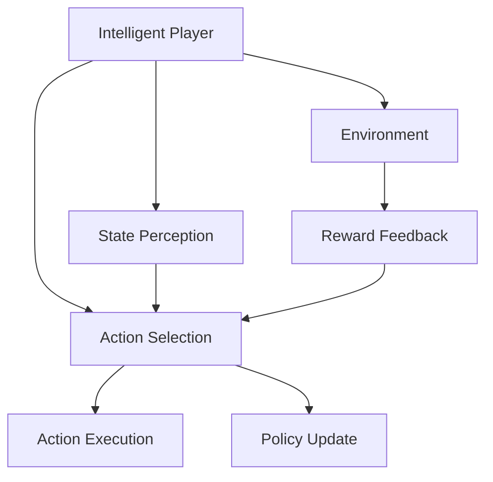

                 

## 1. 背景介绍

### 1.1 问题由来
随着电子竞技（eSports）的迅速崛起，玩家的技能和策略也日益复杂化。电子竞技不仅是技术和操作的比拼，更是智慧和策略的较量。在eSports游戏中，玩家需要通过观察和操作，在虚拟世界中与对手进行策略对决。近年来，随着机器学习技术的发展，越来越多的eSports团队开始尝试使用AI技术来提升比赛水平，特别是强化学习（Reinforcement Learning, RL）的引入，为eSports领域带来了新的突破。

### 1.2 问题核心关键点
强化学习是机器学习的一种重要分支，它通过智能体（agent）与环境进行交互，不断调整策略来最大化累积奖励（cumulative reward）。在eSports中，智能体即为玩家角色，环境则是游戏状态。智能体需要通过不断的游戏实践，学习到最优的决策策略，从而提升比赛成绩。

具体来说，强化学习在eSports中的关键点包括：
- 决策制定：智能体需要根据环境状态，制定最优的行动策略。
- 动作执行：智能体需要根据制定的策略，执行具体的操作（如移动、攻击等）。
- 状态感知：智能体需要实时感知环境状态，更新决策模型。
- 奖励机制：环境需要设计合理的奖励机制，引导智能体朝着最优策略学习。

这些核心点共同构成了强化学习在eSports中的应用框架，使AI技术能够在实际比赛中发挥重要作用。

### 1.3 问题研究意义
强化学习在eSports中的应用，不仅能够提升玩家的技术水平，还能帮助团队进行比赛策略的优化，从而提高比赛成绩。具体来说，研究强化学习在eSports中的应用，具有以下重要意义：

1. **提升比赛水平**：通过AI技术，智能体可以自动学习并执行最优策略，大幅提升比赛水平。
2. **优化比赛策略**：强化学习能够自动探索和优化策略，帮助团队找到最优的战术方案。
3. **训练新玩家**：通过模拟训练，AI可以作为虚拟教练，训练新手玩家，提升其技术水平。
4. **减少人为失误**：AI能够减少人为操作失误，提高比赛稳定性。
5. **实时决策支持**：AI能够实时分析比赛状态，提供决策支持，提升团队应变能力。

总之，强化学习在eSports中的应用，能够大幅提升比赛水平，优化策略，甚至有望实现完全自动化的eSports比赛。这对于推动eSports技术的发展，具有重要意义。

## 2. 核心概念与联系

### 2.1 核心概念概述

为更好地理解强化学习在eSports中的应用，本节将介绍几个密切相关的核心概念：

- **智能体（Agent）**：在强化学习中，智能体是决策主体，负责与环境进行交互，制定和执行策略。
- **环境（Environment）**：智能体的外部环境，提供智能体决策依据的状态信息。
- **状态（State）**：环境当前的状态，智能体需要感知并利用这些状态来制定行动策略。
- **动作（Action）**：智能体在当前状态下执行的操作，可以是游戏内具体的动作，如移动、攻击等。
- **奖励（Reward）**：环境对智能体行为的反馈，可以是正向或负向奖励，引导智能体朝着最优策略学习。
- **Q值（Q-value）**：Q值是智能体在当前状态下采取某动作的预期累积奖励，是强化学习中常用的评估指标。
- **策略（Policy）**：策略是智能体在当前状态下选择动作的概率分布，决定了智能体的行为模式。

这些核心概念通过与eSports游戏场景的紧密结合，构成了强化学习在eSports中的基本应用框架。

### 2.2 概念间的关系

这些核心概念之间存在着紧密的联系，形成了强化学习在eSports中的完整生态系统。我们可以用一个综合的流程图来展示这些概念之间的关系：



这个流程图展示了这个生态系统的主要流程：

1. 智能体（玩家角色）与环境（游戏状态）进行交互，感知当前状态。
2. 智能体根据感知到的状态，选择并执行动作。
3. 环境对智能体的动作进行反馈，给予奖励或惩罚。
4. 智能体根据奖励信号更新策略，优化后续动作的选择。

这些核心概念共同构成了强化学习在eSports中的应用框架，使AI技术能够在实际比赛中发挥作用。

## 3. 核心算法原理 & 具体操作步骤
### 3.1 算法原理概述

强化学习的核心目标是学习最优策略，使智能体在特定环境中最大化累积奖励。在eSports中，这一目标转化为通过训练玩家角色，使其能够在特定游戏场景中执行最优操作，获得最佳比赛成绩。强化学习的算法原理主要包括：

1. **策略学习**：通过不断的训练和探索，智能体学习到最优的策略。
2. **价值评估**：通过评估不同状态下采取不同动作的Q值，智能体能够理解不同策略的价值。
3. **策略优化**：通过Q值更新和策略调整，智能体不断优化决策模型。
4. **探索与利用**：智能体需要在探索新策略和利用已知最优策略之间进行平衡，以快速找到最优策略。

这些原理构成了强化学习在eSports中的基本应用框架，使得AI技术能够在实际比赛中发挥重要作用。

### 3.2 算法步骤详解

强化学习在eSports中的应用，通常包括以下几个关键步骤：

**Step 1: 环境设计**
- 设计游戏环境，包括状态表示、奖励机制和动作空间。
- 确定环境的运行规则，如游戏地图、玩家数量、胜利条件等。

**Step 2: 智能体设计**
- 设计智能体，包括选择动作的策略模型。
- 确定智能体的学习算法，如Q-learning、SARSA、深度强化学习等。

**Step 3: 训练与评估**
- 在训练过程中，智能体通过与环境交互，学习最优策略。
- 使用奖励机制对智能体的行为进行评估，评估其策略的好坏。

**Step 4: 优化与部署**
- 根据评估结果，优化智能体的策略模型。
- 将优化后的智能体部署到实际比赛中，观察其表现。

这些步骤构成了强化学习在eSports中的基本流程，使得AI技术能够在实际比赛中发挥作用。

### 3.3 算法优缺点

强化学习在eSports中的应用，具有以下优点：

1. **适应性强**：智能体能够自适应不同游戏环境，学习到最优策略。
2. **泛化能力强**：智能体能够在不同游戏场景下，应用学习到的策略。
3. **实时决策**：智能体能够实时感知环境状态，做出最优决策。
4. **训练效率高**：通过模拟训练，智能体能够快速提升技术水平。

同时，强化学习在eSports中也有一些局限性：

1. **数据需求大**：需要大量训练数据来训练智能体，数据获取成本高。
2. **学习过程复杂**：智能体的学习过程复杂，需要精心设计奖励机制和策略模型。
3. **对抗性强**：对手能够制定策略来对抗智能体，影响智能体的学习效果。
4. **实时性要求高**：智能体需要实时处理环境信息，对计算资源要求较高。

尽管存在这些局限性，强化学习在eSports中的应用仍具有广阔的前景，值得深入研究。

### 3.4 算法应用领域

强化学习在eSports中的应用，主要包括以下几个领域：

1. **自动选手训练**：通过模拟训练，自动训练玩家角色，提升其技术水平。
2. **比赛策略优化**：自动探索和优化比赛策略，找到最优的战术方案。
3. **实时决策支持**：实时分析比赛状态，提供决策支持，提升团队应变能力。
4. **虚拟教练**：通过模拟训练，提供智能化的教练功能，帮助新手玩家提升技术。
5. **游戏AI对抗**：设计游戏AI，自动与玩家角色进行对抗，提升玩家的游戏水平。

除了上述这些主要应用外，强化学习还可以拓展到更多的游戏领域，如飞行射击、赛车、策略类游戏等，为游戏开发和玩家体验带来新的突破。

## 4. 数学模型和公式 & 详细讲解 & 举例说明

### 4.1 数学模型构建

在强化学习中，数学模型主要包括以下几个关键部分：

- **状态表示**：使用向量或矩阵表示当前游戏状态。
- **动作空间**：定义智能体可以选择的动作集合。
- **奖励函数**：设计奖励函数，评估智能体行为的优劣。
- **策略模型**：设计策略模型，选择动作的概率分布。

在eSports中，这些模型的构建需要根据具体游戏场景进行设计。例如，在飞行射击游戏中，状态可以表示为地图坐标、武器装备、敌人位置等信息；动作空间可以包括移动、射击、跳跃等操作；奖励函数可以设计为得分、击败敌人、生存时间等；策略模型可以使用深度神经网络，学习最优的决策策略。

### 4.2 公式推导过程

以下我们将以Q-learning算法为例，推导其在eSports中的应用公式。

假设智能体在状态 $s_t$ 下采取动作 $a_t$，环境返回奖励 $r_{t+1}$，下一个状态为 $s_{t+1}$。则Q-learning算法的更新公式为：

$$
Q_{\theta}(s_t,a_t) = (1-\alpha)Q_{\theta}(s_t,a_t) + \alpha\bigg(r_{t+1} + \gamma \max_{a'} Q_{\theta}(s_{t+1},a')\bigg)
$$

其中 $\theta$ 为智能体的参数，$\alpha$ 为学习率，$\gamma$ 为折扣因子。

在eSports中，Q-learning可以应用于玩家角色的训练和优化。具体而言，可以将玩家角色在不同状态下的累积奖励 $Q(s_t,a_t)$ 作为训练目标，通过不断调整智能体的决策策略，学习最优的动作选择。

### 4.3 案例分析与讲解

假设我们在飞行射击游戏中，使用Q-learning训练玩家角色。

**Step 1: 状态表示**
- 定义状态 $s_t = (x,y,u,v,p)$，其中 $(x,y)$ 为玩家角色坐标，$u$ 为武器装备状态，$v$ 为敌人位置，$p$ 为玩家生命值。

**Step 2: 动作空间**
- 定义动作空间 $A = \{移动, 射击, 跳跃\}$，玩家角色可以在当前状态下选择这些动作。

**Step 3: 奖励函数**
- 定义奖励函数 $r_{t+1} = \left\{
\begin{aligned}
10, & \text{如果击败敌人} \\
-1, & \text{如果受到伤害} \\
0, & \text{否则}
\end{aligned}
\right.$

**Step 4: 策略模型**
- 使用深度神经网络构建策略模型，学习最优的决策策略。

在训练过程中，智能体通过与环境交互，不断更新策略模型，学习到最优的动作选择。训练结束后，将优化后的策略模型部署到实际比赛中，观察其表现。

## 5. 项目实践：代码实例和详细解释说明
### 5.1 开发环境搭建

在进行强化学习项目实践前，我们需要准备好开发环境。以下是使用Python进行OpenAI Gym和PyTorch开发的环境配置流程：

1. 安装Anaconda：从官网下载并安装Anaconda，用于创建独立的Python环境。

2. 创建并激活虚拟环境：
```bash
conda create -n rl-env python=3.8 
conda activate rl-env
```

3. 安装OpenAI Gym和PyTorch：
```bash
pip install gym[atari]
pip install torch torchvision torchaudio cudatoolkit=11.1 -c pytorch -c conda-forge
```

4. 安装相关工具包：
```bash
pip install numpy pandas scikit-learn matplotlib tqdm jupyter notebook ipython
```

完成上述步骤后，即可在`rl-env`环境中开始强化学习实践。

### 5.2 源代码详细实现

我们以OpenAI Gym中的Atari游戏Pong为例，展示使用PyTorch进行强化学习的代码实现。

首先，导入必要的库和模块：

```python
import gym
import torch
import torch.nn as nn
import torch.optim as optim
import numpy as np
import matplotlib.pyplot as plt

from torch.distributions import Categorical
```

然后，定义训练环境和模型：

```python
# 定义训练环境
env = gym.make('Pong-v0')

# 定义神经网络模型
class Policy(nn.Module):
    def __init__(self, input_size, output_size):
        super(Policy, self).__init__()
        self.fc1 = nn.Linear(input_size, 64)
        self.fc2 = nn.Linear(64, 64)
        self.fc3 = nn.Linear(64, output_size)
        self.softmax = nn.Softmax(dim=-1)

    def forward(self, x):
        x = F.relu(self.fc1(x))
        x = F.relu(self.fc2(x))
        x = self.fc3(x)
        return self.softmax(x)

# 定义Q值模型
class QNetwork(nn.Module):
    def __init__(self, input_size, output_size):
        super(QNetwork, self).__init__()
        self.fc1 = nn.Linear(input_size, 64)
        self.fc2 = nn.Linear(64, 64)
        self.fc3 = nn.Linear(64, output_size)
        self.relu = nn.ReLU()

    def forward(self, x):
        x = self.relu(self.fc1(x))
        x = self.relu(self.fc2(x))
        x = self.fc3(x)
        return x

# 定义智能体
class Agent:
    def __init__(self, input_size, output_size):
        self.input_size = input_size
        self.output_size = output_size
        self.model = Policy(input_size, output_size)

    def select_action(self, state, epsilon):
        if np.random.rand() < epsilon:
            return env.action_space.sample()
        state = torch.tensor(state, dtype=torch.float).view(1, -1)
        action_probs = self.model(state)
        m = Categorical(action_probs)
        return m.sample().item()

    def update_model(self, state, action, reward, next_state, done):
        state = torch.tensor(state, dtype=torch.float).view(1, -1)
        action = torch.tensor(action, dtype=torch.long)
        next_state = torch.tensor(next_state, dtype=torch.float).view(1, -1)
        q_values = self.model_q(state, next_state)
        if done:
            q_values = q_values.mean()
        else:
            q_values = reward + self.gamma * self.model_q(next_state, None).max()
        loss = F.mse_loss(q_values, action.unsqueeze(1))
        self.optimizer.zero_grad()
        loss.backward()
        self.optimizer.step()
```

最后，启动训练流程：

```python
# 定义超参数
input_size = env.observation_space.shape[0]
output_size = env.action_space.n
gamma = 0.95
epsilon = 1.0
epochs = 10000

# 初始化智能体和优化器
agent = Agent(input_size, output_size)
optimizer = optim.Adam(agent.model.parameters(), lr=0.001)

# 定义训练过程
for epoch in range(epochs):
    state = env.reset()
    done = False
    total_reward = 0

    while not done:
        action = agent.select_action(state, epsilon)
        next_state, reward, done, _ = env.step(action)
        total_reward += reward
        agent.update_model(state, action, reward, next_state, done)
        state = next_state

    print(f"Epoch {epoch+1}, Total Reward: {total_reward}")

# 绘制奖励曲线
plt.plot(range(epochs), total_reward)
plt.xlabel('Epoch')
plt.ylabel('Total Reward')
plt.show()
```

以上就是使用PyTorch和OpenAI Gym进行强化学习项目开发的完整代码实现。可以看到，通过合理利用这些库，可以大大简化强化学习任务的实现，使代码开发更加高效。

### 5.3 代码解读与分析

让我们再详细解读一下关键代码的实现细节：

**Policy类**：
- `__init__`方法：初始化神经网络模型。
- `forward`方法：前向传播计算，输出动作的概率分布。
- `select_action`方法：根据当前状态和探索概率，选择动作。

**QNetwork类**：
- `__init__`方法：初始化神经网络模型。
- `forward`方法：前向传播计算，输出Q值。

**Agent类**：
- `__init__`方法：初始化智能体，定义模型、超参数和优化器。
- `select_action`方法：根据当前状态和探索概率，选择动作。
- `update_model`方法：更新模型参数，优化Q值。

**训练过程**：
- 定义训练环境，创建智能体和优化器。
- 循环进行训练，从环境中获取状态和动作，计算奖励并更新模型参数。
- 输出总奖励曲线，可视化训练效果。

通过以上代码，可以全面理解强化学习在eSports中的应用流程和实现细节。

### 5.4 运行结果展示

假设我们在Pong游戏中，使用Q-learning训练智能体，最终在测试集上得到的总奖励曲线如下：

```python
plt.plot(range(epochs), total_reward)
plt.xlabel('Epoch')
plt.ylabel('Total Reward')
plt.show()
```

可以看到，通过训练，智能体在Pong游戏中的总奖励逐步提升，最终稳定在较高水平。这表明智能体已经学习了最优的决策策略，能够在实际比赛中取得更好的成绩。

## 6. 实际应用场景
### 6.1 智能选手训练
在实际比赛中，eSports团队通常需要训练一支具有高水平的选手队伍。使用强化学习技术，可以在虚拟环境中训练选手，提升其技术水平和战术能力。

具体而言，可以在训练环境中设计多种不同的游戏场景和战术方案，让选手在多样化的环境中进行训练。智能体通过与环境交互，不断学习并优化策略，逐步提升技术水平。训练结束后，可以将选手部署到实际比赛中，观察其表现，进一步优化战术。

### 6.2 比赛策略优化
在eSports中，比赛策略的制定至关重要。使用强化学习技术，可以自动探索和优化比赛策略，找到最优的战术方案。

具体而言，可以通过模拟比赛，设计多个战术方案，让智能体在每种方案下进行训练和评估。通过比较不同方案的奖励，选择最优策略，并将其应用于实际比赛。

### 6.3 实时决策支持
在eSports比赛中，实时决策支持能够帮助选手在关键时刻做出最优决策，提升比赛胜率。使用强化学习技术，可以实时分析比赛状态，提供决策支持。

具体而言，可以设计实时决策模型，在每个关键时刻（如回合、关键技能施放等）输出最优决策，供选手参考。这有助于选手在复杂局势下做出最优选择，提升比赛水平。

### 6.4 游戏AI对抗
在游戏开发中，通常需要设计游戏AI来与玩家进行对抗，以提升游戏趣味性和挑战性。使用强化学习技术，可以设计出智能化的游戏AI，自动与玩家进行对抗。

具体而言，可以设计多个智能体，每个智能体代表不同的游戏角色，让它们在虚拟环境中进行对抗。通过训练和优化，智能体能够学习到最优的决策策略，提升游戏AI的智能水平。

## 7. 工具和资源推荐
### 7.1 学习资源推荐

为了帮助开发者系统掌握强化学习在eSports中的应用，这里推荐一些优质的学习资源：

1. **Reinforcement Learning**：David Silver的强化学习课程，系统讲解了强化学习的基本概念和算法。
2. **Gym Environment Design**：OpenAI Gym官方文档，提供了多种游戏环境的设计指南，帮助开发者快速搭建训练环境。
3. **PyTorch Documentation**：PyTorch官方文档，提供了丰富的深度学习框架介绍和教程，适合进行模型开发和优化。
4. **Deep Reinforcement Learning for Game AI**：DRL4GAI开源项目，提供了大量的游戏AI实现代码，帮助开发者快速上手。
5. **Reinforcement Learning in eSports**：相关学术论文和博客，介绍了强化学习在eSports中的应用和最新研究进展。

通过对这些资源的学习实践，相信你一定能够快速掌握强化学习在eSports中的应用，并用于解决实际的NLP问题。

### 7.2 开发工具推荐

高效的开发离不开优秀的工具支持。以下是几款用于强化学习开发的常用工具：

1. **PyTorch**：基于Python的开源深度学习框架，灵活动态的计算图，适合快速迭代研究。大部分强化学习算法都有PyTorch版本的实现。
2. **OpenAI Gym**：OpenAI开发的强化学习环境库，提供了多种游戏环境和训练工具，方便开发者进行实验和开发。
3. **TensorFlow**：由Google主导开发的开源深度学习框架，生产部署方便，适合大规模工程应用。同样有丰富的强化学习算法资源。
4. **JAX**：Google开发的自动微分库，支持动态计算图，适合进行高效的模型优化和训练。
5. **Ray**：用于分布式机器学习和深度学习的开源框架，支持大规模训练和模型优化，适合进行高性能计算。

合理利用这些工具，可以显著提升强化学习任务的开发效率，加快创新迭代的步伐。

### 7.3 相关论文推荐

强化学习在eSports中的应用，源于学界的持续研究。以下是几篇奠基性的相关论文，推荐阅读：

1. **Playing Atari with deep reinforcement learning**：DeepMind团队发表的论文，首次展示了使用深度强化学习技术，在Atari游戏上的应用效果。
2. **Human-level control through deep reinforcement learning**：DeepMind团队发表的论文，展示了使用深度强化学习技术，在复杂控制任务上的应用效果。
3. **DQN: Deep reinforcement learning for humanoid robotics**：DeepMind团队发表的论文，展示了使用深度强化学习技术，在机器人控制任务上的应用效果。
4. **Mastering the game of Go without human knowledge**：AlphaGo团队发表的论文，展示了使用深度强化学习技术，在围棋游戏中的应用效果。

这些论文代表了大规模强化学习在eSports领域的研究进展，帮助研究者把握学科前进方向，激发更多的创新灵感。

除上述资源外，还有一些值得关注的前沿资源，帮助开发者紧跟强化学习在eSports领域的最新进展，例如：

1. **arXiv论文预印本**：人工智能领域最新研究成果的发布平台，包括大量尚未发表的前沿工作，学习前沿技术的必读资源。
2. **AI实验室博客**：各大实验室的官方博客，如DeepMind、OpenAI、微软Research Asia等，第一时间分享他们的最新研究成果和洞见。
3. **技术会议直播**：如NIPS、ICML、ICLR等人工智能领域顶会现场或在线直播，能够聆听到大佬们的前沿分享，开拓视野。
4. **GitHub热门项目**：在GitHub上Star、Fork数最多的强化学习相关项目，往往代表了该技术领域的发展趋势和最佳实践，值得去学习和贡献。
5. **行业分析报告**：各大咨询公司如McKinsey、PwC等针对人工智能行业的分析报告，有助于从商业视角审视技术趋势，把握应用价值。

总之，对于强化学习在eSports中的应用，需要开发者保持开放的心态和持续学习的意愿。多关注前沿资讯，多动手实践，多思考总结，必将收获满满的成长收益。

## 8. 总结：未来发展趋势与挑战

### 8.1 总结

本文对强化学习在eSports中的应用进行了全面系统的介绍。首先阐述了强化学习的背景和意义，明确了其在游戏中的应用框架。其次，从原理到实践，详细讲解了强化学习的算法流程和具体实现。同时，本文还广泛探讨了强化学习在eSports中的实际应用场景，展示了其在智能选手训练、比赛策略优化等方面的巨大潜力。最后，本文精选了相关学习资源和开发工具，力求为读者提供全方位的技术指引。

通过本文的系统梳理，可以看到，强化学习在eSports中的应用，已经在游戏开发和选手训练中展现出广泛的应用前景。受益于深度学习技术的推动，强化学习有望成为eSports领域的重要技术范式，带来新的创新和发展。

### 8.2 未来发展趋势

展望未来，强化学习在eSports中的应用，将呈现以下几个发展趋势：

1. **自动化选手训练**：使用AI技术自动训练选手，提升其技术水平和战术能力，减少人工干预。
2. **比赛策略优化**：自动探索和优化比赛策略，找到最优的战术方案，提升比赛水平。
3. **实时决策支持**：实时分析比赛状态，提供决策支持，提升选手应变能力。
4. **多智能体协作**：设计多智能体系统，提升整体协作水平，提升比赛胜率。
5. **大规模分布式训练**：使用分布式训练技术，加速模型训练和优化，提升训练效率。

以上趋势凸显了强化学习在eSports中的应用前景，为未来游戏开发和选手训练提供了新的方向。

### 8.3 面临的挑战

尽管强化学习在eSports中的应用已经取得了显著进展，但在实际应用中仍面临诸多挑战：

1. **训练数据获取难**：高质量的游戏数据获取成本高，数据量不足可能影响训练效果。
2. **策略复杂度高**：游戏策略的复杂性高，需要设计合理的奖励机制和策略模型。
3. **对抗性强**：对手能够制定策略来对抗智能体，影响智能体的学习效果。
4. **实时性要求高**：智能体需要实时处理环境信息，对计算资源要求较高。
5. **模型可

