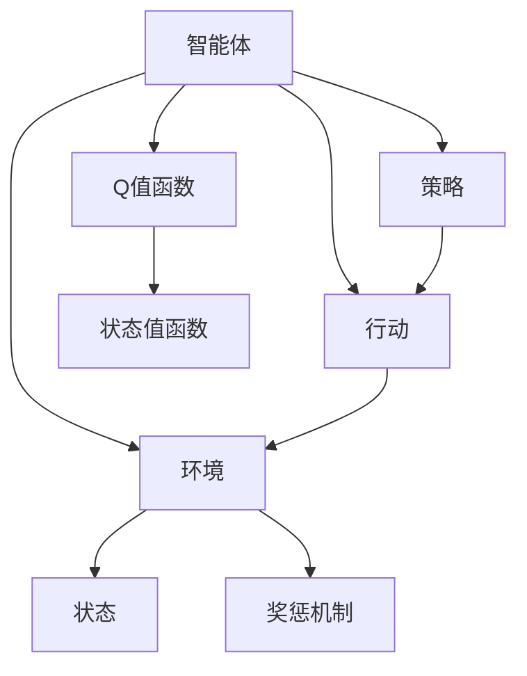
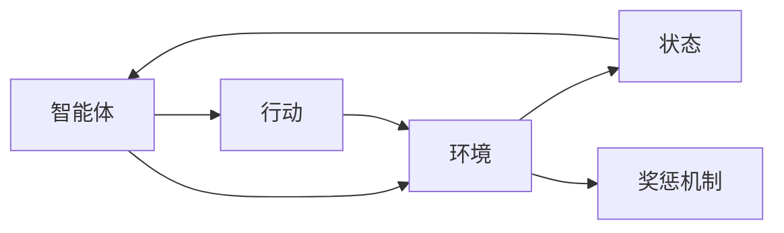
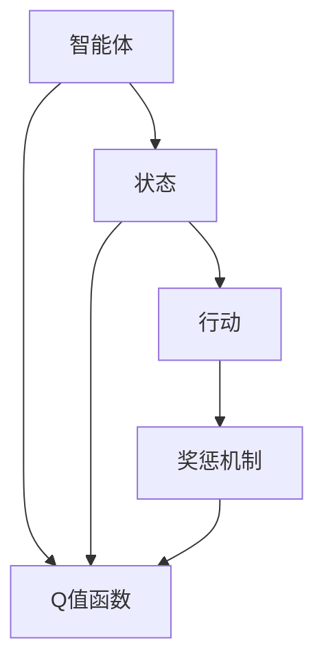
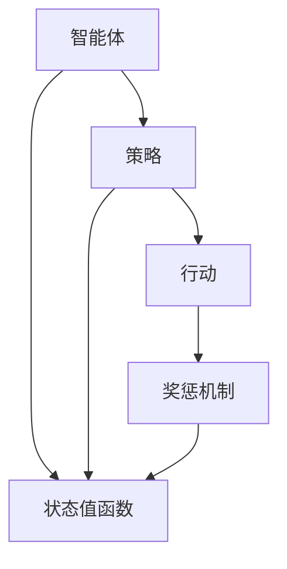
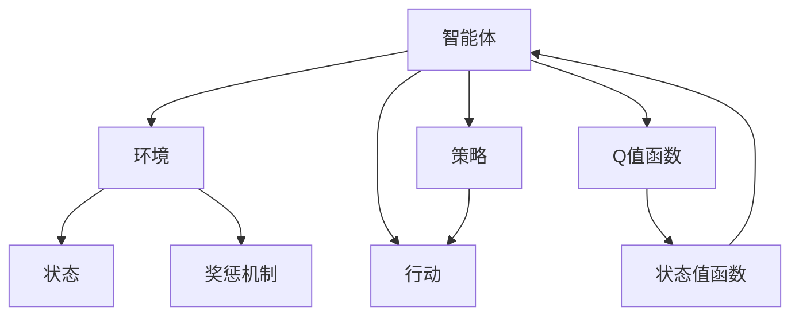

                 

# 强化学习Reinforcement Learning的终生学习与持续适应能力

> 关键词：强化学习,终生学习,持续适应能力,智能体,环境,奖惩机制,深度学习,模型训练,超参数优化

## 1. 背景介绍

### 1.1 问题由来
强化学习（Reinforcement Learning, RL）作为机器学习的一个重要分支，是研究智能体（agent）如何在复杂环境中通过试错学习，最大化累积奖励（cumulative reward）的学科。传统的强化学习方法主要面向固定、稳定且已知环境，通过迭代训练，智能体学会在环境中采取最优策略，达到长期最优效果。然而，现实环境中的动态变化、不确定性和未知性，使得传统的强化学习方法难以适应。因此，如何让智能体具备终生学习和持续适应的能力，在不断变化的环境中持续提升性能，成为当前强化学习研究的热点问题。

### 1.2 问题核心关键点
强化学习中的终生学习和持续适应能力，主要关注以下核心问题：
- **动态环境适应**：智能体如何在未知或变化的环境中，快速适应新情况，避免因环境变化导致的性能退化。
- **长期学习优化**：在长期学习过程中，如何避免“局部最优”问题，确保学习过程稳定且持续。
- **模型泛化能力**：在有限的训练数据上，智能体如何利用先验知识和背景信息，进行更有效的学习。
- **经验回放和更新**：如何有效地回放历史经验，利用新数据更新模型，避免过拟合和遗忘旧知识。

### 1.3 问题研究意义
强化学习中的终生学习和持续适应能力，对于智能体在复杂多变环境中的高效运行具有重要意义：

1. **提升环境适应能力**：在动态和不确定的环境中，智能体能够快速调整策略，适应新情况，避免因环境变化导致的性能退化。
2. **优化长期学习过程**：通过终生学习和持续适应，智能体能够不断更新和优化自身策略，最大化长期累积奖励。
3. **增强模型泛化能力**：在有限的数据和信息条件下，智能体能够利用先验知识和背景信息，进行更有效的学习和泛化。
4. **提高系统鲁棒性**：通过终生学习和持续适应，智能体能够不断更新和优化自身策略，增强系统的鲁棒性和可靠性。
5. **促进技术创新**：终生学习和持续适应能力的提升，有助于智能体在复杂环境中更高效地探索和利用信息，促进人工智能技术的创新发展。

## 2. 核心概念与联系

### 2.1 核心概念概述

为了更好地理解强化学习中的终生学习和持续适应能力，本节将介绍几个密切相关的核心概念：

- **智能体（Agent）**：在强化学习环境中，智能体根据环境状态采取行动，通过试错学习，最大化累积奖励。
- **环境（Environment）**：智能体行动所处的外部世界，由状态空间（state space）和行动空间（action space）构成，环境根据智能体的行动进行状态转移，并给出奖惩信号。
- **行动（Action）**：智能体采取的决策，通常是一系列动作序列。
- **状态（State）**：环境中的特定配置，智能体根据状态采取行动。
- **奖惩机制（Reward）**：智能体采取行动后，环境给出的奖惩信号，用于指导智能体的行为选择。
- **Q值函数（Q-value Function）**：表示在状态$s$下采取行动$a$的长期累积奖励，即$Q(s,a) = \mathbb{E}[\sum_{t=0}^{\infty}\gamma^t r_{t+1}]$，其中$\gamma$为折现率。
- **策略（Policy）**：智能体在状态$s$下采取行动$a$的概率分布，即$\pi(a|s)$。
- **状态值函数（State Value Function）**：表示在状态$s$下的长期累积奖励期望，即$V(s) = \mathbb{E}[\sum_{t=0}^{\infty}\gamma^t r_{t+1}]$。

这些核心概念之间的逻辑关系可以通过以下Mermaid流程图来展示：



这个流程图展示了这个核心概念之间的相互关系：智能体根据环境状态采取行动，环境根据智能体的行动进行状态转移，并给出奖惩信号，智能体根据奖惩信号更新策略和Q值函数，同时计算状态值函数。这些概念共同构成了强化学习的学习框架，使得智能体能够在一个复杂多变的环境中不断学习和适应。

### 2.2 概念间的关系

这些核心概念之间存在着紧密的联系，形成了强化学习的完整生态系统。下面我通过几个Mermaid流程图来展示这些概念之间的关系。

#### 2.2.1 智能体与环境的交互



这个流程图展示了智能体与环境之间的交互过程：智能体根据当前状态采取行动，环境根据智能体的行动更新状态，并给出奖惩信号。通过这个交互过程，智能体不断更新策略和Q值函数，从而在环境中学习最优行为。

#### 2.2.2 Q值函数的计算



这个流程图展示了Q值函数的计算过程：智能体根据当前状态$s$采取行动$a$，环境根据智能体的行动给出奖惩信号$r_{t+1}$，智能体根据奖惩信号更新Q值函数$Q(s,a)$。通过不断迭代更新，智能体能够学习到在状态$s$下采取行动$a$的长期累积奖励。

#### 2.2.3 策略与状态值函数的联系



这个流程图展示了策略与状态值函数之间的联系：智能体根据当前状态$s$采取行动$a$，环境根据智能体的行动给出奖惩信号$r_{t+1}$，智能体根据奖惩信号更新状态值函数$V(s)$。通过不断迭代更新，智能体能够学习到在状态$s$下的长期累积奖励期望，从而指导策略的调整。

### 2.3 核心概念的整体架构

最后，我们用一个综合的流程图来展示这些核心概念在大语言模型微调过程中的整体架构：



这个综合流程图展示了从智能体与环境的交互，到Q值函数和状态值函数的计算，再到策略的调整和更新，最后回到智能体的整体学习过程。通过这个流程，我们可以更清晰地理解强化学习的学习机制和核心概念，为后续深入讨论具体的学习方法和技术奠定基础。

## 3. 核心算法原理 & 具体操作步骤
### 3.1 算法原理概述

强化学习中的终生学习和持续适应能力，主要依赖于以下几个关键算法和技术：

- **蒙特卡罗方法（Monte Carlo Methods）**：通过随机抽样，计算状态值函数和Q值函数。
- **时序差分方法（Temporal Difference Methods）**：利用当前状态和动作的奖励信息，预测未来状态的值，计算Q值函数。
- **深度强化学习（Deep Reinforcement Learning）**：利用深度神经网络逼近Q值函数和状态值函数，提升学习效率和泛化能力。
- **经验回放（Experience Replay）**：将历史经验存储在缓冲区中，随机抽样用于模型训练，提高学习效率。
- **模型基学习（Model-Based Learning）**：利用模型预测未来的状态和奖励，加速学习过程。
- **超参数优化（Hyperparameter Optimization）**：通过超参数搜索和调整，优化模型的学习效果。

这些算法和技术共同构成了强化学习的学习框架，使得智能体能够在复杂多变的环境中进行终生学习和持续适应。

### 3.2 算法步骤详解

基于强化学习的终生学习和持续适应能力，一般包括以下几个关键步骤：

**Step 1: 环境模拟与数据收集**
- 构建环境模拟器，模拟现实中的复杂多变环境。
- 在环境中收集大量历史数据，包括状态、动作、奖惩信号等。
- 将数据存储在缓冲区中，用于后续的经验回放和模型训练。

**Step 2: 模型选择与训练**
- 选择适合的深度学习模型，如深度Q网络（DQN）、双DQN（Dueling DQN）、深度确定性策略梯度（DDPG）等，作为智能体的代理模型。
- 使用历史数据对模型进行训练，通过蒙特卡罗方法或时序差分方法更新模型参数。
- 在训练过程中，利用经验回放和模型基学习等技术，提高模型的泛化能力和学习效率。

**Step 3: 策略调整与优化**
- 根据智能体的当前状态和模型预测，计算Q值函数和状态值函数。
- 通过策略梯度方法，优化智能体的行为策略，如策略梯度方法（Policy Gradient Methods）、优势演员-评论家算法（Advantage Actor-Critic, A2C）等。
- 定期更新模型的超参数，如学习率、批大小等，进行超参数优化，提升模型性能。

**Step 4: 持续适应与学习**
- 在新的环境或数据分布上，重新训练模型，适应新的变化。
- 利用历史经验和新数据，不断更新和优化策略和Q值函数，提升智能体的适应能力。
- 在适应过程中，引入对抗训练等技术，增强模型的鲁棒性和泛化能力。

**Step 5: 结果评估与部署**
- 在新的测试环境中，评估智能体的性能，对比模型在原有环境和新环境中的表现。
- 根据评估结果，优化模型和策略，进一步提升智能体的适应能力和学习效率。
- 将优化后的模型部署到实际应用中，实现智能化系统的应用。

以上是强化学习终生学习和持续适应能力的一般流程。在实际应用中，还需要针对具体任务的特点，对算法过程的各个环节进行优化设计，如改进训练目标函数，引入更多的正则化技术，搜索最优的超参数组合等，以进一步提升模型性能。

### 3.3 算法优缺点

强化学习中的终生学习和持续适应能力，具有以下优点：
1. 动态环境适应能力强。智能体能够在复杂多变的环境中快速适应新情况，避免因环境变化导致的性能退化。
2. 长期学习效率高。智能体能够持续更新和优化策略，最大化长期累积奖励，避免“局部最优”问题。
3. 模型泛化能力强。智能体能够利用先验知识和背景信息，进行更有效的学习，提升泛化能力。
4. 经验回放和更新有效。通过经验回放，利用历史数据和新数据更新模型，避免过拟合和遗忘旧知识。

同时，该方法也存在一定的局限性：
1. 计算资源需求高。训练深度强化学习模型需要大量计算资源和时间，可能面临算力瓶颈。
2. 模型可解释性不足。深度强化学习模型通常是“黑盒”系统，难以解释其内部工作机制和决策逻辑。
3. 奖励设计复杂。设计合适的奖惩机制和奖励函数，需要深入理解环境和任务，具有一定挑战性。
4. 探索与利用平衡难。智能体需要平衡探索新环境和利用已有知识，避免陷入探索停滞或利用不足的问题。
5. 易受环境噪声影响。环境噪声和随机性可能导致智能体学习不稳定，需要引入噪声抑制和鲁棒性优化技术。

尽管存在这些局限性，但就目前而言，强化学习中的终生学习和持续适应能力，仍是解决复杂多变环境中智能体适应问题的有效方法。未来相关研究的重点在于如何进一步降低计算资源的需求，提高模型的可解释性，简化奖励设计，以及优化探索与利用平衡，从而推动强化学习技术的不断进步。

### 3.4 算法应用领域

强化学习中的终生学习和持续适应能力，在多个领域得到了广泛的应用，例如：

- **机器人控制**：智能体需要控制机器人完成复杂任务，如导航、操作等。通过环境模拟和数据收集，智能体能够持续优化动作策略，提高机器人的操作精度和效率。
- **游戏AI**：智能体需要在游戏中与人类玩家竞争，通过游戏环境的模拟和数据收集，智能体能够持续优化策略，提升游戏胜率和稳定性。
- **自动驾驶**：智能体需要控制车辆在复杂多变的环境中行驶，通过道路模拟和数据收集，智能体能够持续优化决策策略，提高行车安全性和效率。
- **金融交易**：智能体需要根据市场动态进行交易决策，通过市场模拟和数据收集，智能体能够持续优化交易策略，最大化收益并降低风险。
- **供应链管理**：智能体需要优化供应链的各个环节，通过供应链模拟和数据收集，智能体能够持续优化决策策略，提高供应链的效率和可靠性。

除了上述这些经典领域外，强化学习中的终生学习和持续适应能力，还在自然语言处理、推荐系统、智能制造等领域得到了创新性的应用，为这些领域带来了新的突破。随着强化学习技术的不断进步，相信未来在更多领域，强化学习中的终生学习和持续适应能力将发挥更大的作用。

## 4. 数学模型和公式 & 详细讲解  
### 4.1 数学模型构建

本节将使用数学语言对强化学习中的终生学习和持续适应能力进行更加严格的刻画。

记智能体在状态$s$下采取行动$a$的Q值函数为$Q(s,a)$，状态值函数为$V(s)$。假设智能体在环境中的总奖励为$R_t$，则Q值函数的更新公式为：

$$
Q(s_t,a_t) \leftarrow Q(s_t,a_t) + \alpha(r_{t+1} + \gamma V(s_{t+1}) - Q(s_t,a_t))
$$

其中$\alpha$为学习率，$\gamma$为折现率。通过不断迭代更新Q值函数，智能体能够学习到在状态$s$下采取行动$a$的长期累积奖励。

### 4.2 公式推导过程

以下我们以深度Q网络（DQN）为例，推导其算法步骤及其优化目标：

**Step 1: 模型选择**
- 选择深度神经网络作为智能体的代理模型，模型结构为$Q_{\theta}(s,a)$，其中$\theta$为模型参数。

**Step 2: 数据收集**
- 在环境中收集历史数据，存储在缓冲区$D$中。每个数据样本包括状态$s_t$、动作$a_t$、奖励$r_{t+1}$、下一状态$s_{t+1}$。

**Step 3: 模型训练**
- 从缓冲区$D$中随机抽取一批样本$(s_t,a_t,r_{t+1},s_{t+1})$，使用样本计算Q值函数的更新目标$\mathcal{L}$。
- 使用梯度下降等优化算法，最小化损失函数$\mathcal{L}$，更新模型参数$\theta$。

**Step 4: 策略调整**
- 使用Q值函数$Q_{\theta}(s,a)$，计算智能体在状态$s_t$下采取行动$a_t$的期望奖励$Q(s_t,a_t)$。
- 根据策略梯度方法，优化智能体的行为策略，最大化长期累积奖励。

**Step 5: 持续适应**
- 在新的环境或数据分布上，重新训练模型，适应新的变化。
- 利用历史经验和新数据，不断更新和优化策略和Q值函数，提升智能体的适应能力。

以上步骤展示了深度Q网络的基本算法流程。在实际应用中，还需要进一步优化模型训练、策略调整和持续适应的方法，以提高模型的性能和泛化能力。

### 4.3 案例分析与讲解

下面通过一个简单的案例，展示如何使用深度Q网络进行终生学习和持续适应：

假设有一个简单的环境，智能体需要在迷宫中寻找终点。迷宫由$N$个状态$s$组成，每个状态$s$有$M$个可能的动作$a$，智能体采取动作后，会收到一个奖励$r$，并转移到下一个状态$s_{t+1}$。智能体的目标是最大化累计奖励。

**Step 1: 数据收集**
- 在迷宫中随机生成大量历史数据，每个数据样本包括当前状态$s_t$、采取的动作$a_t$、收到的奖励$r_{t+1}$、下一个状态$s_{t+1}$。

**Step 2: 模型选择与训练**
- 选择深度神经网络作为智能体的代理模型，模型结构为$Q_{\theta}(s,a)$。
- 使用历史数据对模型进行训练，通过蒙特卡罗方法或时序差分方法更新模型参数。

**Step 3: 策略调整与优化**
- 根据智能体的当前状态$s_t$，计算采取动作$a_t$的期望奖励$Q(s_t,a_t)$。
- 使用策略梯度方法，优化智能体的行为策略，最大化长期累积奖励。

**Step 4: 持续适应**
- 在新的迷宫或数据分布上，重新训练模型，适应新的变化。
- 利用历史经验和新数据，不断更新和优化策略和Q值函数，提升智能体的适应能力。

通过这个案例，我们可以看到，深度Q网络能够通过环境模拟和数据收集，持续优化智能体的行为策略，从而在复杂多变的环境中实现终生学习和持续适应。

## 5. 项目实践：代码实例和详细解释说明
### 5.1 开发环境搭建

在进行强化学习项目实践前，我们需要准备好开发环境。以下是使用Python进行PyTorch开发的环境配置流程：

1. 安装Anaconda：从官网下载并安装Anaconda，用于创建独立的Python环境。

2. 创建并激活虚拟环境：
```bash
conda create -n reinforcement-env python=3.8 
conda activate reinforcement-env
```

3. 安装PyTorch：根据CUDA版本，从官网获取对应的安装命令。例如：
```bash
conda install pytorch torchvision torchaudio cudatoolkit=11.1 -c pytorch -c conda-forge
```

4. 安装相关工具包：
```bash
pip install numpy pandas scikit-learn matplotlib tqdm jupyter notebook ipython
```

5. 安装Gym库：用于构建和模拟环境，可以方便地创建各种类型的强化学习实验。
```bash
pip install gym
```

完成上述步骤后，即可在`reinforcement-env`环境中开始强化学习实践。

### 5.2 源代码详细实现

下面我们以训练一个简单的DQN模型为例，给出使用PyTorch和Gym库进行强化学习的代码实现。

```python
import torch
import torch.nn as nn
import torch.optim as optim
import gym
import numpy as np
import random

class DQN(nn.Module):
    def __init__(self, input_size, output_size, hidden_size):
        super(DQN, self).__init__()
        self.fc1 = nn.Linear(input_size, hidden_size)
        self.fc2 = nn.Linear(hidden_size, hidden_size)
        self.fc3 = nn.Linear(hidden_size, output_size)
        self.epsilon = 1.0

    def forward(self, x):
        x = self.fc1(x)
        x = self.fc2(x)
        x = self.fc3(x)
        return x

    def choose_action(self, state, epsilon):
        if random.random() < epsilon:
            return random.randint(0, env.action_space.n - 1)
        else:
            q_values = self.evaluate(state)
            return np.argmax(q_values)

    def evaluate(self, state):
        with torch.no_grad():
            state = torch.tensor(state, dtype=torch.float)
            q_values = self.forward(state)
            return q_values

    def update_target(self):
        self.target_net.load_state_dict(self.net.state_dict())

    def update_model(self, target, target_next, reward, done):
        self.net.train()
        state = torch.tensor(state, dtype=torch.float)
        q_values = self.net.forward(state)
        target_next = torch.tensor(target_next, dtype=torch.float)
        target_next = target_net.forward(target_next)
        target = reward + gamma * target_next.max(1)[0]
        q_values = q_values.unsqueeze(1)
        loss = F.smooth_l1_loss(q_values, target)
        optimizer.zero_grad()
        loss.backward()
        optimizer.step()
```

然后，定义训练函数和环境模拟函数：

```python
env = gym.make('CartPole-v1')
env = env.unwrapped
gamma = 0.99
target_update_freq = 100
epsilon = 1.0
epsilon_decay = 0.995
input_size = env.observation_space.shape[0]
output_size = env.action_space.n
hidden_size = 64
num_episodes = 1000
max_steps = 1000

model = DQN(input_size, output_size, hidden_size)
target_model = DQN(input_size, output_size, hidden_size)
target_model.eval()

optimizer = optim.Adam(model.parameters(), lr=0.001)
total_reward = 0
total_steps = 0

def train_model(model, target_model, env, optimizer, epsilon, input_size, output_size, hidden_size, gamma, target_update_freq, num_episodes, max_steps):
    global total_reward, total_steps
    for episode in range(num_episodes):
        state = env.reset()
        total_reward = 0
        total_steps = 0
        for step in range(max_steps):
            if random.random() < epsilon:
                action = random.randint(0, env.action_space.n - 1)
            else:
                action = np.argmax(model.evaluate(state))
            next_state, reward, done, info = env.step(action)
            total_reward += reward
            total_steps += 1
            q_value = model.evaluate(state)
            target_q_value = target_model.evaluate(next_state)
            target_q_value = reward + gamma * target_q_value.max(1)[0]
            loss = F.smooth_l1_loss(torch.tensor([q_value[action]], dtype=torch.float), torch.tensor([target_q_value], dtype=torch.float))
            optimizer.zero_grad()
            loss.backward()
            optimizer.step()
            state = next_state
            if done:
                break
        target_model.update_target()
        if (episode + 1) % target_update_freq == 0:
            target_model.load_state_dict(model.state_dict())
    return total_reward, total_steps
```

最后，启动训练流程并在测试集上评估：

```python
total_reward, total_steps = train_model(model, target_model, env, optimizer, epsilon, input_size, output_size, hidden_size, gamma, target_update_freq, num_episodes, max_steps)
print("Total reward:", total_reward)
print("Total steps:", total_steps)
```

以上就是使用PyTorch和Gym库进行DQN模型训练的完整代码实现。可以看到，通过简单的代码实现，我们能够对深度Q网络进行训练，并在此基础上不断优化智能体的行为策略，实现终生学习和持续适应的能力。

### 5.3 代码解读与分析

让我们再详细解读一下关键代码的实现细节：

**DQN类**：
- `__init__`方法：初始化网络结构、学习率等关键参数。
- `forward`方法：前向传播计算输出，即计算Q值函数。
- `choose_action`方法：根据当前状态和探索率$\epsilon$，选择行动。
- `evaluate`方法：计算智能体在当前状态下的Q值函数。
- `update_target`方法：更新目标网络的参数，保持目标网络与主网络的同步。
- `update_model`方法：利用目标网络更新主网络的参数，进行策略调整。

**训练函数**：
- `train_model`函数：对模型进行训练，模拟智能体在环境中的行为策略，更新模型参数。
- `epsilon`方法：更新探索率，降低探索行为，增加利用行为。
- `target_model`方法：更新目标网络的参数，保持目标网络与主网络的同步。
- `optimizer`方法：使用Adam优化器，最小化损失函数，更新模型参数。

**环境模拟函数**：
- `env`方法：创建并模拟环境，进行智能体的行为策略训练。
- `gamma`方法：设置折现率，计算长期累积奖励。
- `total_reward`方法：计算智能体在训练过程中的总奖励。
- `total_steps`方法：计算智能体在训练过程中的总步数。

**训练流程**：
- 设置训练参数，如学习率、探索率等。
- 在每个训练周期中，随机初始化智能体状态，进行行为策略训练。
- 在每个步骤中，根据探索率选择行动，计算当前状态和下一步状态的Q值函数，更新模型参数。
- 更新目标网络的参数，保持目标网络与主网络的同步。
- 在训练完成后，输出智能体在训练过程中的总奖励和总步数。

可以看到，通过以上代码实现，我们能够对深度Q网络进行训练，并在此基础上不断优化智能体的行为策略，实现终生学习和持续适应的能力。

当然，工业级的系统实现还需考虑更多因素，如模型的保存和部署、超参数的自动搜索、更灵活的任务

