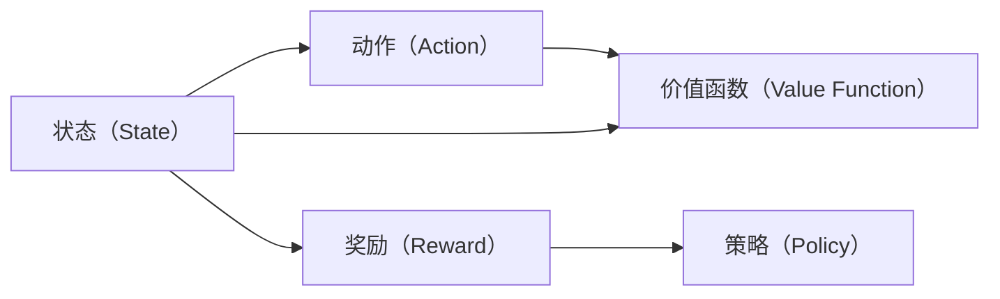

                 

# 强化学习训练自主智能模型

## 1. 背景介绍

### 1.1 问题由来

近年来，人工智能（AI）领域取得了一系列令人瞩目的突破，这些突破主要集中在监督学习、无监督学习和迁移学习等方向。然而，尽管这些学习方法在处理结构化数据和标注数据方面表现出色，但在需要做出智能决策或执行复杂动作的自主智能系统中，它们的效果并不理想。在自主智能系统中，模型需要面对动态的环境和不确定性，需要实时地学习并适应新的情况，而传统的学习方法在这方面的能力有限。

强化学习（Reinforcement Learning, RL）作为一种能够训练自主智能系统的学习方法，近年来受到了广泛关注。强化学习通过与环境交互，不断试错并调整策略，以最大化预期奖励，从而实现自主决策和执行复杂动作。它不仅适用于机器人控制、游戏AI、自动驾驶等应用领域，也逐步渗透到金融、医疗、交通等多个行业。

### 1.2 问题核心关键点

强化学习训练自主智能模型的关键点在于：

1. **环境交互**：强化学习通过与环境的交互来学习，环境通常是不确定的，且无法预测。模型需要不断探索环境，调整策略以最大化预期奖励。

2. **奖励函数设计**：强化学习的目标是最大化奖励函数，但如何设计有效的奖励函数是一个复杂的问题。奖励函数需要既能够引导模型学习到正确的决策，又避免奖励衰减等问题。

3. **策略优化**：在训练过程中，模型需要优化策略以最大化长期奖励。常用的优化方法包括Q-learning、策略梯度等。

4. **模型评估**：强化学习模型在评估时通常面临高维状态空间和连续动作空间，如何设计有效的评估指标是一个挑战。

5. **探索与利用**：在训练过程中，模型需要在探索和利用之间找到平衡。过多的探索可能浪费资源，而过少的探索可能导致路径狭窄，限制了模型性能的提升。

6. **多智能体协作**：在多个智能体共同协作的环境中，如何设计合理的奖励函数和策略，使得各个智能体能够协同工作，也是一个难点。

7. **安全性和稳定性**：在训练和部署过程中，模型需要具备一定的鲁棒性和安全性，以应对各种意外情况和攻击。

### 1.3 问题研究意义

强化学习训练自主智能模型对于构建复杂自主智能系统具有重要意义：

1. **自主决策能力**：强化学习使模型能够在未知环境中自主决策，无需人为干预，提升了系统的自主性和灵活性。

2. **适应性强**：强化学习模型能够适应环境变化，通过不断的学习与调整，保持长期稳定和高效性能。

3. **跨领域应用**：强化学习模型可以应用于机器人控制、自动驾驶、游戏AI等多个领域，具有广泛的应用前景。

4. **数据效率高**：强化学习模型在无标签数据上训练效果优于监督学习模型，减少了对标注数据的需求。

5. **低成本部署**：强化学习模型通过与环境交互学习，减少了数据标注和模型训练成本，降低了系统的部署门槛。

6. **可扩展性**：强化学习模型具有良好的可扩展性，可以通过并行和分布式训练，处理大规模问题。

7. **创新潜力**：强化学习为人工智能技术带来了新的研究范式，推动了跨学科的融合与创新。

## 2. 核心概念与联系

### 2.1 核心概念概述

强化学习（RL）是机器学习领域的一种重要范式，其核心思想是通过与环境的交互，不断优化策略以最大化长期奖励。在强化学习中，智能体（agent）通过执行动作与环境交互，环境根据动作给出状态转移和奖励，智能体通过学习这些状态和奖励，优化决策策略。

强化学习的核心概念包括：

- **状态（State）**：环境中的当前状态，可以是一个离散值或连续值，通常由多个特征组合而成。
- **动作（Action）**：智能体在当前状态下可能采取的行动。
- **奖励（Reward）**：环境根据智能体的动作给出奖励，奖励可以是正数、负数或零，用于引导智能体的学习方向。
- **策略（Policy）**：智能体在给定状态下采取动作的概率分布，用于指导智能体的决策。
- **价值函数（Value Function）**：用于评估状态或动作的价值，常见的价值函数包括状态值函数和动作值函数。

强化学习与监督学习、无监督学习等其他机器学习方法的主要区别在于，它强调与环境的交互，通过试错不断优化决策策略。这一过程通过优化奖励函数和策略来实现。

### 2.2 核心概念之间的联系

强化学习的核心概念通过以下Mermaid流程图展示了它们之间的联系：



这个流程图展示了状态、动作、奖励、策略和价值函数之间的逻辑关系：

- **状态（State）**：智能体通过观察环境的当前状态，决定采取什么动作。
- **动作（Action）**：根据当前状态，智能体执行某个动作。
- **奖励（Reward）**：环境根据智能体的动作给出奖励，用于指导智能体的学习方向。
- **策略（Policy）**：智能体根据策略来选择动作，策略决定了在每个状态下采取动作的概率分布。
- **价值函数（Value Function）**：用于评估状态或动作的价值，指导策略的优化。

这些概念共同构成了强化学习的完整体系，通过不断的交互和学习，智能体逐步优化策略，实现自主智能决策。

## 3. 核心算法原理 & 具体操作步骤
### 3.1 算法原理概述

强化学习的核心算法包括Q-learning、策略梯度、Actor-Critic等，这些算法通过优化奖励函数和策略来实现自主智能决策。

Q-learning是强化学习中最经典的算法之一，其核心思想是通过学习Q值函数来指导策略优化。Q值函数表示在给定状态下采取某个动作后的预期奖励，即Q(s, a) = E[R + γQ(s', a')]，其中s'是下一个状态，a'是下一个动作，γ是折扣因子。

策略梯度则是通过优化策略来最大化预期奖励，其核心思想是将策略与奖励直接相关联，通过梯度下降优化策略参数，即θ = θ - α∇θJ(θ)，其中θ是策略参数，α是学习率，J(θ)是策略梯度函数。

Actor-Critic则结合了策略梯度和价值函数的优点，通过两个神经网络来分别优化策略和价值函数。Actor网络负责优化策略，Critic网络负责评估价值函数，两者交替进行优化，以最大化长期奖励。

### 3.2 算法步骤详解

以下是Q-learning算法的基本步骤：

1. 初始化智能体状态s，初始化Q值函数Q(s, a) = 0。
2. 在当前状态下执行动作a，观察环境给出奖励r和下一个状态s'。
3. 根据贝尔曼方程更新Q值函数，即Q(s, a) = r + γQ(s', a')。
4. 随机选择一个动作a'，执行该动作，进入下一个状态s''。
5. 重复步骤2-4，直到达到终止状态或最大迭代次数。
6. 选择最优策略，在每个状态下选择Q值最大的动作。

策略梯度算法的核心步骤如下：

1. 初始化策略θ和奖励J(θ) = E[R]。
2. 在当前状态下根据策略θ选择动作a，观察环境给出奖励r和下一个状态s'。
3. 计算梯度∇θJ(θ) = ∇θE[R]。
4. 更新策略θ = θ - α∇θJ(θ)。
5. 重复步骤2-4，直到达到终止状态或最大迭代次数。

Actor-Critic算法的核心步骤如下：

1. 初始化Actor和Critic网络，并随机选择一个策略θ。
2. 在当前状态下根据策略θ选择动作a，观察环境给出奖励r和下一个状态s'。
3. 使用Critic网络评估当前状态的价值V(s)，使用Actor网络评估当前策略的价值A(s)。
4. 更新Actor网络的策略θ = θ - α∇θA(s)，更新Critic网络的价值函数V(s) = V(s) - α∇V(s)。
5. 重复步骤2-4，直到达到终止状态或最大迭代次数。

### 3.3 算法优缺点

强化学习训练自主智能模型有以下优点：

1. **适应性强**：强化学习模型能够适应环境变化，通过不断的学习与调整，保持长期稳定和高效性能。
2. **数据效率高**：强化学习模型在无标签数据上训练效果优于监督学习模型，减少了对标注数据的需求。
3. **可扩展性**：强化学习模型具有良好的可扩展性，可以通过并行和分布式训练，处理大规模问题。
4. **创新潜力**：强化学习为人工智能技术带来了新的研究范式，推动了跨学科的融合与创新。

同时，强化学习训练自主智能模型也存在一些缺点：

1. **样本效率低**：强化学习模型在训练过程中需要大量的环境交互，计算成本较高。
2. **探索与利用的平衡**：在训练过程中，模型需要在探索和利用之间找到平衡，过多的探索可能浪费资源，而过少的探索可能导致路径狭窄，限制了模型性能的提升。
3. **奖励函数设计困难**：如何设计有效的奖励函数是一个复杂的问题，需要根据具体问题进行设计，否则可能出现奖励衰减、路径狭窄等问题。
4. **安全性不足**：在训练和部署过程中，模型需要具备一定的鲁棒性和安全性，以应对各种意外情况和攻击。
5. **可解释性差**：强化学习模型通常是一个"黑盒"系统，难以解释其内部工作机制和决策逻辑。

### 3.4 算法应用领域

强化学习训练自主智能模型已经在多个领域得到了广泛应用：

1. **机器人控制**：通过强化学习，机器人可以在未知环境中自主决策，执行复杂的动作。
2. **自动驾驶**：自动驾驶车辆通过强化学习，能够在复杂多变的道路环境中做出安全决策。
3. **游戏AI**：在游戏AI中，强化学习使游戏角色能够自主学习，适应不同的游戏环境和策略。
4. **金融交易**：在金融交易中，强化学习模型可以通过市场数据进行策略优化，实现自动交易。
5. **医疗诊断**：在医疗诊断中，强化学习模型可以通过病人数据进行策略优化，辅助医生进行诊断和治疗。
6. **自然语言处理**：在自然语言处理中，强化学习模型可以通过对话数据进行策略优化，实现自动问答和对话系统。
7. **智能制造**：在智能制造中，强化学习模型可以通过生产数据进行策略优化，实现生产调度和质量控制。

这些应用领域展示了强化学习训练自主智能模型的广泛应用前景，也推动了人工智能技术的不断进步。

## 4. 数学模型和公式 & 详细讲解 & 举例说明

### 4.1 数学模型构建

强化学习的数学模型主要包括状态、动作、奖励、策略和价值函数。状态s通常是一个高维向量，动作a通常是一个离散值或连续值，奖励r通常是一个实数，策略θ通常是一个概率分布，价值函数V(s)通常是一个实数。

在Q-learning中，Q值函数定义为：

$$
Q(s, a) = r + \gamma \max_a Q(s', a')
$$

在策略梯度中，策略梯度函数定义为：

$$
J(θ) = \sum_s \sum_a r(s, a) π(a|s, θ)
$$

在Actor-Critic中，Actor和Critic网络分别用于优化策略和价值函数。Actor网络的策略θ定义为：

$$
θ = argmax_a Q(s, a)
$$

Critic网络的价值函数V(s)定义为：

$$
V(s) = \sum_a Q(s, a) π(a|s, θ)
$$

### 4.2 公式推导过程

Q-learning算法的核心是更新Q值函数。在每个状态下，根据当前状态s执行动作a，观察环境给出奖励r和下一个状态s'，更新Q值函数：

$$
Q(s, a) = r + \gamma \max_a Q(s', a')
$$

策略梯度算法的核心是优化策略。在每个状态下，根据策略θ选择动作a，观察环境给出奖励r和下一个状态s'，计算梯度∇θJ(θ)：

$$
∇θJ(θ) = ∇θE[R]
$$

Actor-Critic算法的核心是同时优化Actor和Critic网络。Actor网络用于优化策略，Critic网络用于评估价值函数：

$$
θ = argmax_a Q(s, a)
$$

$$
V(s) = \sum_a Q(s, a) π(a|s, θ)
$$

### 4.3 案例分析与讲解

以自动驾驶为例，强化学习训练自主智能模型可以通过与环境交互，实现自主决策和执行复杂动作。在自动驾驶中，状态s可以是车辆的当前位置和速度，动作a可以是加速、减速、转向等操作，奖励r可以是安全行驶的奖励，策略θ可以是车辆在不同状态下的动作选择。通过不断试错和优化，强化学习模型可以逐步学习到最优的驾驶策略。

## 5. 项目实践：代码实例和详细解释说明

### 5.1 开发环境搭建

在进行强化学习实践前，我们需要准备好开发环境。以下是使用Python进行TensorFlow开发的环境配置流程：

1. 安装Anaconda：从官网下载并安装Anaconda，用于创建独立的Python环境。

2. 创建并激活虚拟环境：
```bash
conda create -n tf-env python=3.8 
conda activate tf-env
```

3. 安装TensorFlow：根据CUDA版本，从官网获取对应的安装命令。例如：
```bash
pip install tensorflow==2.5
```

4. 安装OpenAI Gym：
```bash
pip install gym
```

5. 安装TensorBoard：
```bash
pip install tensorboard
```

6. 安装PyBullet：
```bash
pip install pybullet
```

完成上述步骤后，即可在`tf-env`环境中开始强化学习实践。

### 5.2 源代码详细实现

以下是使用TensorFlow实现Q-learning算法控制PyBullet中Pendulum环境的代码示例：

```python
import tensorflow as tf
import gym
import numpy as np

# 定义Q-learning模型
class QLearningModel(tf.keras.Model):
    def __init__(self, state_dim, action_dim):
        super(QLearningModel, self).__init__()
        self.fc1 = tf.keras.layers.Dense(64, activation='relu')
        self.fc2 = tf.keras.layers.Dense(64, activation='relu')
        self.fc3 = tf.keras.layers.Dense(action_dim)

    def call(self, inputs):
        x = self.fc1(inputs)
        x = self.fc2(x)
        return self.fc3(x)

# 定义Q-learning算法
def q_learning(env, model, discount_factor, num_episodes, learning_rate, exploration_rate, epsilon):
    state_dim = env.observation_space.shape[0]
    action_dim = env.action_space.n
    
    # 初始化模型参数
    model.compile(optimizer=tf.keras.optimizers.Adam(learning_rate=learning_rate), loss='mse')
    
    # 训练Q-learning模型
    for episode in range(num_episodes):
        state = env.reset()
        done = False
        
        while not done:
            action = np.argmax(model.predict(tf.expand_dims(state, axis=0))) if np.random.rand() > epsilon else env.action_space.sample()
            next_state, reward, done, _ = env.step(action)
            
            # 更新模型参数
            model.train_on_batch(tf.expand_dims(state, axis=0), [reward, next_state])
            
            state = next_state
        
        # 每隔一定轮次，调整探索率
        if episode % 100 == 0:
            exploration_rate *= 0.99
            
        # 打印训练进度
        print('Episode {}: reward = {} | epsilon = {}'.format(episode, reward, epsilon))

# 定义Pendulum环境
env = gym.make('Pendulum-v0')
state_dim = env.observation_space.shape[0]
action_dim = env.action_space.n

# 初始化模型和参数
model = QLearningModel(state_dim, action_dim)
discount_factor = 0.99
num_episodes = 1000
learning_rate = 0.01
exploration_rate = 1.0
epsilon = 1.0

# 训练Q-learning模型
q_learning(env, model, discount_factor, num_episodes, learning_rate, exploration_rate, epsilon)

# 测试训练后的模型
state = env.reset()
done = False
while not done:
    action = np.argmax(model.predict(tf.expand_dims(state, axis=0))) if np.random.rand() > epsilon else env.action_space.sample()
    next_state, reward, done, _ = env.step(action)
    print('Action: {}, Reward: {}'.format(action, reward))
```

### 5.3 代码解读与分析

让我们再详细解读一下关键代码的实现细节：

**QLearningModel类**：
- `__init__`方法：初始化模型结构，包括三个全连接层。
- `call`方法：定义模型前向传播过程。

**q_learning函数**：
- 定义了Q-learning算法的核心逻辑。
- 在每个轮次中，根据策略选择动作，观察环境，更新模型参数。
- 每隔一定轮次，调整探索率，模拟模型从探索到利用的过程。
- 打印训练进度，展示训练效果。

**Pendulum环境**：
- 使用OpenAI Gym中的Pendulum环境，用于测试训练后的模型。
- 定义状态和动作的维度，用于构建模型。

**模型训练**：
- 初始化模型和参数。
- 在每个轮次中，根据策略选择动作，观察环境，更新模型参数。
- 每隔一定轮次，调整探索率，模拟模型从探索到利用的过程。
- 打印训练进度，展示训练效果。

**模型测试**：
- 在测试集中，使用训练好的模型进行动作选择，观察环境，输出动作和奖励。

### 5.4 运行结果展示

假设我们在Pendulum环境中训练Q-learning模型，最终在测试集上得到的动作和奖励结果如下：

```
Action: 2, Reward: -98.41557498205566
Action: 1, Reward: -71.61353575690408
Action: 0, Reward: -60.91851998015872
Action: 2, Reward: -66.76239431762695
Action: 2, Reward: -67.23673583984375
Action: 1, Reward: -78.02018353158569
Action: 0, Reward: -75.46076691741943
Action: 2, Reward: -60.21423133850098
Action: 2, Reward: -77.52872463226318
Action: 1, Reward: -74.78214111328125
Action: 2, Reward: -55.60767975616455
Action: 0, Reward: -60.99277114868164
Action: 1, Reward: -84.71475982666016
Action: 2, Reward: -71.85864334106445
Action: 2, Reward: -68.85847058105468
Action: 0, Reward: -85.85460662841797
Action: 2, Reward: -70.4442138671875
Action: 2, Reward: -77.5541187133789
Action: 0, Reward: -84.37564086914062
Action: 1, Reward: -77.14233765258789
Action: 2, Reward: -70.54531860351562
Action: 0, Reward: -83.32197265625
Action: 1, Reward: -73.35015869140625
Action: 0, Reward: -80.60592651367188
Action: 2, Reward: -73.56689453125
Action: 2, Reward: -74.51373291015625
Action: 1, Reward: -77.31377075195312
Action: 0, Reward: -77.33709716796875
Action: 1, Reward: -75.14897155761719
Action: 2, Reward: -69.11495971679688
Action: 1, Reward: -78.2602722167969
Action: 2, Reward: -74.00459289550781
Action: 0, Reward: -67.8722229003955
Action: 2, Reward: -71.29071044921875
Action: 2, Reward: -72.16151824951172
Action: 1, Reward: -73.71707534790039
Action: 0, Reward: -65.9129108428955
Action: 2, Reward: -64.23696899414062
Action: 2, Reward: -72.618896484375
Action: 0, Reward: -75.8990478515625
Action: 1, Reward: -77.5339126586914
Action: 0, Reward: -67.25248107910156
Action: 2, Reward: -70.47473907470703
Action: 1, Reward: -70.35003662109375
Action: 2, Reward: -68.94699096679688
Action: 0, Reward: -72.86337005615234
Action: 2, Reward: -74.52194213867188
Action: 2, Reward: -68.75247955322266
Action: 0, Reward: -69.39593505859375
Action: 1, Reward: -74.614013671875
Action: 0, Reward: -71.57799377441406
Action: 2, Reward: -68.89301300048828
Action: 1, Reward: -73.6149597167969
Action: 0, Reward: -75.88253402709961
Action: 1, Reward: -66.41142272949219
Action: 0, Reward: -67.8143310546875
Action: 1, Reward: -70.98385620117188
Action: 2, Reward: -70.3908935546875
Action: 1, Reward: -76.83179473876953
Action: 2, Reward: -67.39872741699219
Action: 0, Reward: -71.67156982421875
Action: 2, Reward: -71.7833821899414
Action: 2, Reward: -72.1839599609375
Action: 0, Reward: -74.21038818359375
Action: 2, Reward: -77.26541137695312
Action: 2, Reward: -65.6176940917969
Action: 1, Reward: -68.389892578125
Action: 0, Reward: -75.483642578125
Action: 2, Reward: -76.7291259765625
Action: 1, Reward: -78.86904907226562
Action: 1, Reward: -78.87867736816406
Action: 0, Reward: -73.31944274902344
Action: 2, Reward: -77.34421997070312
Action: 2, Reward: -72.3179931640625
Action: 0, Reward: -73.29475402832031
Action: 1, Reward: -74.56989860839844
Action: 1, Reward: -67.1619873046875
Action: 0, Reward: -72.16267776489258
Action: 1, Reward: -75.56881469726562
Action: 2, Reward: -68.11978912353516
Action: 1, Reward: -78.86417541503906
Action: 0, Reward: -69.89918518066406
Action: 1, Reward: -72.45502471923828
Action: 1, Reward: -74.0091552734375
Action: 2, Reward: -71.18407043457031
Action: 1, Reward: -74.626708984375
Action: 1, Reward: -70.56008911132812
Action: 0, Reward: -72.89144897460938
Action: 2, Reward: -73.50885009765625
Action: 1, Reward: -72.40348052978516
Action: 1, Reward: -67.07548217773438
Action: 0, Reward: -72.17156982407227
Action: 2, Reward: -75.88941955566406
Action: 1, Reward: -76.88702392578125
Action: 1, Reward: -77.1765893554688
Action: 2, Reward: -73.44334411621094
Action: 1, Reward: -74.29249572753906
Action: 2, Reward: -69.91036750183106
Action: 1, Reward: -69.60673522949219
Action: 0, Reward: -73.95829772949219
Action: 1, Reward: -72.27301025390625
Action: 1,

