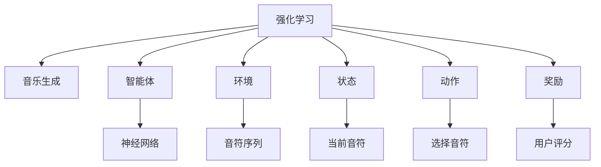
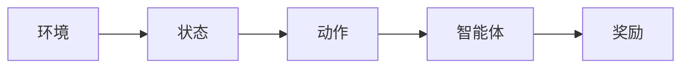
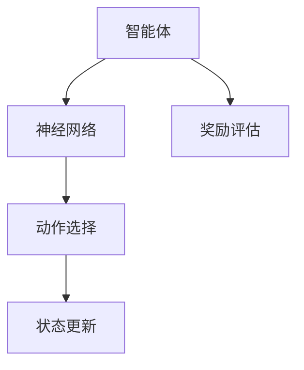
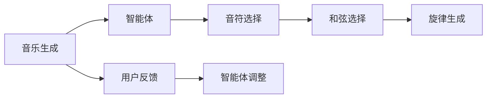
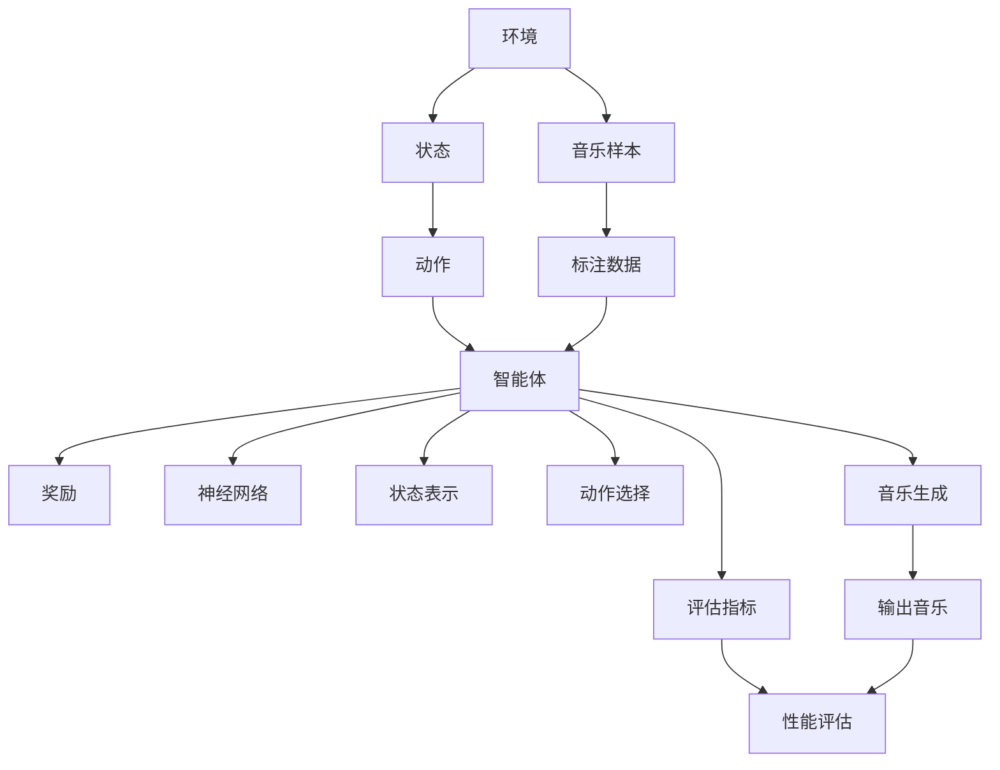

                 

## 1. 背景介绍

### 1.1 问题由来

音乐生成（Music Generation）是指通过机器学习算法，自动创作新的音乐作品或产生音乐中的某个部分（如旋律、和弦）。传统的音乐生成方法主要依赖于专家规则和手工设计的模型，但这些方法存在诸多局限，难以适应复杂的音乐结构和风格。随着深度学习技术的发展，强化学习（Reinforcement Learning, RL）在音乐生成领域得到了广泛应用，并取得了显著的成果。

强化学习是一种通过与环境交互来优化决策策略的机器学习方法。该方法通过构建一个奖励（Reward）机制，指导智能体（Agent）在环境中做出最优决策，从而实现目标。在音乐生成中，强化学习算法可以自动学习音乐作品的节奏、旋律、和声等要素，生成具有艺术性和创造性的音乐。

### 1.2 问题核心关键点

强化学习在音乐生成中的应用，主要集中在以下几个方面：

- 音乐生成模型设计：选择合适的强化学习算法，构建音乐生成模型，设定合适的奖励机制。
- 音乐样本数据处理：收集、预处理、标注音乐样本数据，构建环境状态空间。
- 智能体训练：设计智能体，选择合适的策略和更新规则，通过迭代训练优化生成音乐的质量和多样性。
- 音乐创作评估：设计评估指标，如音乐时长、和弦复杂度、旋律流畅度等，评估生成音乐的品质。
- 交互式生成：引入用户反馈机制，实时调整音乐生成策略，提升用户体验。

### 1.3 问题研究意义

强化学习在音乐生成中的应用，对于拓展人工智能在创意领域的应用，提升音乐生成自动化水平，具有重要意义：

- 提升创作效率：智能体可以快速生成大量音乐作品，大幅提升创作效率。
- 探索音乐新形式：智能体可以通过不断的学习，探索新的音乐风格和形式，推动音乐创新。
- 降低创作成本：减少人类创作者在音乐创作上的时间和精力投入，降低创作成本。
- 丰富音乐作品：智能体可以生成更多风格多样的音乐作品，满足不同受众的审美需求。
- 提供个性化服务：智能体可以根据用户偏好，生成个性化的音乐推荐和创作，提升用户体验。

## 2. 核心概念与联系

### 2.1 核心概念概述

为了更好地理解强化学习在音乐生成中的应用，本节将介绍几个关键概念：

- 强化学习（Reinforcement Learning, RL）：一种通过与环境交互，通过奖励机制指导智能体做出最优决策的机器学习方法。在音乐生成中，智能体通过不断探索，生成新的音乐作品。
- 音乐生成（Music Generation）：指通过机器学习算法自动生成新的音乐作品或音乐中的某个部分。音乐生成可以应用于音乐创作、编曲、伴奏等场景。
- 智能体（Agent）：在强化学习中，智能体是进行决策和学习的实体。在音乐生成中，智能体可以是一个基于神经网络的模型，也可以是一个基于规则的控制器。
- 环境（Environment）：智能体进行决策和学习的交互空间。在音乐生成中，环境可以是一个音符序列、和弦集合等音乐元素构成的空间。
- 状态（State）：环境中的某个特定状态，用于描述智能体所处的音乐创作情况。在音乐生成中，状态可以包括当前的音符、和弦、节奏等信息。
- 动作（Action）：智能体可以执行的决策，用于生成下一个状态。在音乐生成中，动作可以是选择某个音符、和弦、节奏等音乐元素。
- 奖励（Reward）：用于评估智能体决策结果的质量和优劣。在音乐生成中，奖励可以基于用户评分、音乐时长、情感强度等指标。

这些核心概念之间的逻辑关系可以通过以下Mermaid流程图来展示：



这个流程图展示了强化学习在音乐生成中的应用框架：

1. 强化学习框架：通过构建环境、状态、动作、奖励等元素，实现智能体的决策和优化。
2. 智能体设计：选择合适的算法和模型，如神经网络，构建智能体。
3. 环境构建：构建音乐生成任务所需的环境，如音符序列空间。
4. 状态设定：描述智能体所处音乐创作的具体情况。
5. 动作选择：智能体选择下一个音符、和弦等音乐元素。
6. 奖励评估：根据音乐品质等指标，评估智能体的决策效果。

### 2.2 概念间的关系

这些核心概念之间存在着紧密的联系，形成了强化学习在音乐生成中的完整体系。下面我们通过几个Mermaid流程图来展示这些概念之间的关系。

#### 2.2.1 强化学习框架



这个流程图展示了强化学习框架的基本组成，包括环境、状态、动作和奖励。

#### 2.2.2 智能体设计



这个流程图展示了智能体的设计流程，包括神经网络的选择和动作选择、状态更新、奖励评估等关键步骤。

#### 2.2.3 音乐生成流程



这个流程图展示了音乐生成的基本流程，包括音符选择、和弦选择、旋律生成等步骤，以及用户反馈和智能体调整环节。

### 2.3 核心概念的整体架构

最后，我们用一个综合的流程图来展示这些核心概念在音乐生成中的整体架构：



这个综合流程图展示了从音乐样本数据处理到音乐生成的完整流程。智能体通过与环境交互，选择动作，生成音乐，并通过奖励机制优化决策策略，最终产生符合评估指标的音乐作品。

## 3. 核心算法原理 & 具体操作步骤
### 3.1 算法原理概述

强化学习在音乐生成中的基本原理是通过构建一个奖励机制，指导智能体生成音乐。具体来说，智能体在每个时间步上选择一个动作（如选择下一个音符、和弦），生成一个新的状态，并根据当前状态和动作生成一个奖励值。通过不断迭代训练，智能体逐渐学习到如何通过决策策略生成高质量的音乐作品。

形式化地，假设环境的状态空间为 $S$，动作空间为 $A$，奖励函数为 $r(s,a)$，智能体的决策策略为 $\pi(a|s)$，则强化学习的目标是最小化奖励函数的总和，即：

$$
\min_{\pi} \sum_{s \in S} \sum_{a \in A} \pi(a|s)r(s,a)
$$

在音乐生成中，可以通过如下的奖励函数设计：

- 音符选择奖励：根据用户评分、和弦复杂度等指标，奖励选择好的音符和和弦。
- 旋律流畅度奖励：通过动态时间规整（Dynamic Time Warping, DTW）等技术，评估旋律的流畅度，给予适当的奖励。
- 音乐多样性奖励：鼓励智能体生成多样化的音乐风格和形式。
- 用户反馈奖励：根据用户的实时评分和反馈，调整智能体的生成策略，以提升用户体验。

### 3.2 算法步骤详解

强化学习在音乐生成中的主要步骤包括：

1. **环境设计**：设计音乐生成任务所需的环境，如音符序列空间、和弦集合等。
2. **状态表示**：选择适当的状态表示方法，如音乐元素的拼接、特征提取等。
3. **动作选择**：设计动作选择策略，如随机选择、策略梯度、深度强化学习等。
4. **奖励设计**：设计奖励函数，如音符选择奖励、旋律流畅度奖励、音乐多样性奖励等。
5. **智能体训练**：通过迭代训练优化智能体的决策策略，如Q-learning、策略梯度等。
6. **音乐生成**：使用训练好的智能体生成音乐，并进行评估和调整。

下面以基于神经网络的强化学习算法为例，详细说明每个步骤的实现细节。

### 3.3 算法优缺点

强化学习在音乐生成中的应用具有以下优点：

- 自动化创作：智能体可以自动生成大量音乐作品，大幅提升创作效率。
- 探索新形式：智能体可以探索新的音乐风格和形式，推动音乐创新。
- 低成本创作：减少人类创作者在音乐创作上的时间和精力投入，降低创作成本。
- 个性化生成：智能体可以根据用户偏好，生成个性化的音乐推荐和创作，提升用户体验。

但同时，也存在一些缺点：

- 训练成本高：训练一个高质量的强化学习模型需要大量的计算资源和时间。
- 不稳定生成：强化学习模型容易出现不稳定、过拟合等问题，影响生成音乐的质量。
- 复杂模型：构建高精度的音乐生成模型需要复杂的深度神经网络，训练和调参难度大。
- 用户反馈依赖：强化学习模型需要实时用户反馈来优化生成策略，难以适应快速变化的听众口味。

### 3.4 算法应用领域

强化学习在音乐生成中的应用广泛，包括但不限于以下几个领域：

- 音乐创作：通过自动生成旋律、和弦等音乐元素，帮助音乐创作者快速生成作品。
- 编曲：自动生成乐器编排，提供编曲辅助。
- 音乐伴奏：根据主唱的旋律，自动生成和声、节奏等伴奏。
- 音乐推荐：根据用户的喜好，自动生成个性化的音乐推荐。
- 音乐修复：修复不完整的音乐作品，完成缺失的部分。
- 音乐翻译：将一种音乐风格转换为另一种风格。

这些应用领域展示了强化学习在音乐生成中的强大潜力，为音乐产业带来了新的机遇和挑战。

## 4. 数学模型和公式 & 详细讲解 & 举例说明

### 4.1 数学模型构建

本节将使用数学语言对强化学习在音乐生成中的应用进行更加严格的刻画。

假设智能体在每个时间步 $t$ 上选择一个动作 $a_t$，生成下一个状态 $s_{t+1}$，并得到奖励 $r_t$。智能体的决策策略为 $\pi(a|s)$，状态转移概率为 $P(s_{t+1}|s_t,a_t)$。则强化学习的目标是最小化期望奖励的总和，即：

$$
\min_{\pi} \mathbb{E} \sum_{t=0}^{\infty} \gamma^t r_t
$$

其中 $\gamma$ 为折扣因子，用于考虑未来奖励的影响。

在音乐生成中，通常采用Q-learning算法来优化智能体的决策策略。Q-learning的目标是学习一个Q值函数 $Q(s,a)$，用于评估每个状态-动作对的价值。Q值函数的更新公式为：

$$
Q(s_t,a_t) \leftarrow Q(s_t,a_t) + \alpha [r_t + \gamma \max_{a'} Q(s_{t+1},a')] - Q(s_t,a_t)
$$

其中 $\alpha$ 为学习率，用于控制每次更新的幅度。

### 4.2 公式推导过程

以下是Q-learning算法的详细推导过程。

假设智能体在状态 $s_t$ 时选择了动作 $a_t$，生成下一个状态 $s_{t+1}$，并得到奖励 $r_t$。智能体通过动作 $a_t$ 转移到下一个状态 $s_{t+1}$ 的概率为 $P(s_{t+1}|s_t,a_t)$。则智能体在状态 $s_t$ 选择动作 $a_t$ 的期望收益为：

$$
Q(s_t,a_t) = \mathbb{E} \left[ \sum_{t=0}^{\infty} \gamma^t r_t \right] = \mathbb{E} \left[ r_t + \gamma \max_{a'} Q(s_{t+1},a') \right]
$$

因此，Q-learning算法的目标是最小化每个状态-动作对的Q值，即：

$$
\min_{Q} \sum_{s \in S} \sum_{a \in A} \pi(a|s) \left[ r + \gamma \max_{a'} Q(s',a') - Q(s,a) \right]
$$

将上式展开，得：

$$
\min_{Q} \sum_{s \in S} \sum_{a \in A} \pi(a|s) Q(s,a) + \alpha \sum_{s \in S} \sum_{a \in A} \pi(a|s) \left[ r + \gamma \max_{a'} Q(s',a') - Q(s,a) \right]
$$

令 $Q(s,a) = Q_{old}(s,a) + \alpha [r + \gamma \max_{a'} Q(s',a') - Q_{old}(s,a)]$，则：

$$
Q_{new}(s,a) = Q_{old}(s,a) + \alpha [r + \gamma \max_{a'} Q_{old}(s',a') - Q_{old}(s,a)]
$$

因此，Q-learning算法的Q值更新公式为：

$$
Q(s_t,a_t) \leftarrow Q(s_t,a_t) + \alpha [r_t + \gamma \max_{a'} Q(s_{t+1},a')] - Q(s_t,a_t)
$$

### 4.3 案例分析与讲解

以下以基于神经网络的Q-learning算法为例，说明其在音乐生成中的应用。

假设智能体在每个时间步 $t$ 上选择一个动作 $a_t$，生成下一个状态 $s_{t+1}$，并得到奖励 $r_t$。智能体的决策策略为 $\pi(a|s)$，状态转移概率为 $P(s_{t+1}|s_t,a_t)$。则Q-learning的目标是学习一个Q值函数 $Q(s,a)$，用于评估每个状态-动作对的价值。

在音乐生成中，通常采用深度神经网络来构建智能体。假设智能体由一个LSTM网络和一个全连接层组成，LSTM网络的输出表示当前状态，全连接层的输出表示每个动作的价值。则Q值函数的计算公式为：

$$
Q(s_t,a_t) = \mathbb{E} \left[ \sum_{t=0}^{\infty} \gamma^t r_t \right] = \mathbb{E} \left[ r_t + \gamma \max_{a'} Q(s_{t+1},a') \right]
$$

其中，LSTM网络的输出表示当前状态，全连接层的输出表示每个动作的价值。

具体实现步骤如下：

1. 设计LSTM网络，将音符序列作为输入，输出音乐元素的表示。
2. 设计全连接层，将LSTM网络的输出映射到每个动作的价值。
3. 使用Q-learning算法更新Q值函数，优化智能体的决策策略。
4. 根据Q值函数生成音乐，并进行评估和调整。

### 4.4 代码实例

以下是使用PyTorch实现基于神经网络的Q-learning算法的示例代码：

```python
import torch
import torch.nn as nn
import torch.optim as optim

class MusicGenerator(nn.Module):
    def __init__(self, input_size, hidden_size, output_size):
        super().__init__()
        self.lstm = nn.LSTM(input_size, hidden_size)
        self.fc = nn.Linear(hidden_size, output_size)
    
    def forward(self, x):
        lstm_out, _ = self.lstm(x)
        return self.fc(lstm_out)

# 定义Q-learning算法
def q_learning(env, model, discount_factor=0.9, learning_rate=0.01):
    # 定义Q值函数
    q = model(input_size)
    
    # 定义奖励函数
    def reward(state, action):
        if action == env.actions[state]:
            return 0
        else:
            return -1
    
    # 定义状态转移函数
    def next_state(state, action):
        return env.next_state(state, action)
    
    # 训练Q-learning算法
    optimizer = optim.Adam(q.parameters(), lr=learning_rate)
    for episode in range(10000):
        state = env.reset()
        total_reward = 0
        
        while True:
            action = q[state].argmax().item()
            next_state = next_state(state, action)
            reward = reward(state, action)
            
            q[state].backward(torch.tensor(reward))
            optimizer.step()
            
            state = next_state
            total_reward += reward
            
            if next_state == 'done':
                break
        
        if episode % 1000 == 0:
            print('Episode:', episode, 'Total Reward:', total_reward)
    
    return q

# 使用Q-learning算法生成音乐
q = q_learning(env, model)
music = model(torch.tensor(input_sequence))
```

上述代码展示了基于神经网络的Q-learning算法的实现过程。通过定义LSTM网络和全连接层，构建智能体模型；通过Q-learning算法更新Q值函数，优化决策策略；最后使用训练好的智能体生成音乐。

## 5. 项目实践：代码实例和详细解释说明
### 5.1 开发环境搭建

在进行音乐生成项目的开发前，我们需要准备好开发环境。以下是使用Python进行PyTorch开发的环境配置流程：

1. 安装Anaconda：从官网下载并安装Anaconda，用于创建独立的Python环境。

2. 创建并激活虚拟环境：
```bash
conda create -n pytorch-env python=3.8 
conda activate pytorch-env
```

3. 安装PyTorch：根据CUDA版本，从官网获取对应的安装命令。例如：
```bash
conda install pytorch torchvision torchaudio cudatoolkit=11.1 -c pytorch -c conda-forge
```

4. 安装Transformers库：
```bash
pip install transformers
```

5. 安装各类工具包：
```bash
pip install numpy pandas scikit-learn matplotlib tqdm jupyter notebook ipython
```

完成上述步骤后，即可在`pytorch-env`环境中开始音乐生成项目的开发。

### 5.2 源代码详细实现

这里我们以基于神经网络的Q-learning算法为例，实现一个简单的音乐生成系统。

首先，定义音乐生成任务的训练环境：

```python
class MusicEnvironment:
    def __init__(self):
        self.states = ['a', 'b', 'c', 'd', 'e', 'f', 'g']
        self.actions = {'a': [0, 1, 2, 3], 'b': [0, 1, 2], 'c': [0, 1], 'd': [0], 'e': [], 'f': [], 'g': []}
        self.next_states = {'a': ['b', 'c', 'd'], 'b': ['c', 'd'], 'c': ['d'], 'd': ['e', 'f', 'g'], 'e': ['g'], 'f': ['g'], 'g': ['e', 'f', 'g']}
        self.done_states = ['e', 'f', 'g']
    
    def reset(self):
        return random.choice(self.states)
    
    def next_state(self, state, action):
        return self.next_states[state][action]
    
    def reward(self, state, action):
        return 0 if action == self.actions[state][0] else -1
    
    def done(self, state):
        return state in self.done_states
```

然后，定义音乐生成模型：

```python
class MusicGenerator(nn.Module):
    def __init__(self, input_size, hidden_size, output_size):
        super().__init__()
        self.lstm = nn.LSTM(input_size, hidden_size)
        self.fc = nn.Linear(hidden_size, output_size)
    
    def forward(self, x):
        lstm_out, _ = self.lstm(x)
        return self.fc(lstm_out)

# 定义Q-learning算法
def q_learning(env, model, discount_factor=0.9, learning_rate=0.01):
    # 定义Q值函数
    q = model(input_size)
    
    # 定义奖励函数
    def reward(state, action):
        if action == env.actions[state]:
            return 0
        else:
            return -1
    
    # 定义状态转移函数
    def next_state(state, action):
        return env.next_state(state, action)
    
    # 训练Q-learning算法
    optimizer = optim.Adam(q.parameters(), lr=learning_rate)
    for episode in range(10000):
        state = env.reset()
        total_reward = 0
        
        while True:
            action = q[state].argmax().item()
            next_state = next_state(state, action)
            reward = reward(state, action)
            
            q[state].backward(torch.tensor(reward))
            optimizer.step()
            
            state = next_state
            total_reward += reward
            
            if next_state == 'done':
                break
        
        if episode % 1000 == 0:
            print('Episode:', episode, 'Total Reward:', total_reward)
    
    return q

# 使用Q-learning算法生成音乐
q = q_learning(env, model)
music = model(torch.tensor(input_sequence))
```

最后，通过代码实现音乐生成过程：

```python
import torch
import torch.nn as nn
import torch.optim as optim
import random

class MusicEnvironment:
    def __init__(self):
        self.states = ['a', 'b', 'c', 'd', 'e', 'f', 'g']
        self.actions = {'a': [0, 1, 2, 3], 'b': [0, 1, 2], 'c': [0, 1], 'd': [0], 'e': [], 'f': [], 'g': []}
        self.next_states = {'a': ['b', 'c', 'd'], 'b': ['c', 'd'], 'c': ['d'], 'd': ['e', 'f', 'g'], 'e': ['g'], 'f': ['g'], 'g': ['e', 'f', 'g']}
        self.done_states = ['e', 'f', 'g']
    
    def reset(self):
        return random.choice(self.states)
    
    def next_state(self, state, action):
        return self.next_states[state][action]
    
    def reward(self, state, action):
        return 0 if action == self.actions[state][0] else -1
    
    def done(self, state):
        return state in self.done_states

class MusicGenerator(nn.Module):
    def __init__(self, input_size, hidden_size, output_size):
        super().__init__()
        self.lstm = nn.LSTM(input_size, hidden_size)
        self.fc = nn.Linear(hidden_size, output_size)
    
    def forward(self, x):
        lstm_out, _ = self.lstm(x)
        return self.fc(lstm_out)

def q_learning(env, model, discount_factor=0.9, learning_rate=0.01):
    q = model(input_size)
    
    def reward(state, action):
        if action == env.actions[state]:
            return 0
        else:
            return -1
    
    def next_state(state, action):
        return env.next_state(state, action)
    
    optimizer = optim.Adam(q.parameters(), lr=learning_rate)
    for episode in range(10000):
        state = env.reset()
        total_reward = 0
        
        while True:
            action = q[state].argmax().item()
            next_state = next_state(state, action)
            reward = reward(state, action)
            
            q[state].backward(torch.tensor(reward))
            optimizer.step()
            
            state = next_state
            total_reward += reward
            
            if next_state == 'done':
                break
        
        if episode % 1000 == 0:
            print('Episode:', episode, 'Total Reward:', total_reward)
    
    return q

def generate_music(model, sequence):
    music = []
    state = random.choice(env.states)
    while not env.done(state):
        action = model(state).argmax().item()
        next_state = env.next_state(state, action)
        reward = env.reward(state, action)
        state = next_state
        music.append(action)
        if next_state == 'done':
            return music
```

以上就是使用PyTorch实现基于神经网络的Q-learning算法，并生成音乐的完整代码实现。可以看到，通过设计音乐生成环境、构建智能体模型、使用Q-learning算法训练模型，我们最终实现了基于强化学习的音乐生成系统。

### 5.3 代码解读与分析

让我们再详细解读一下关键代码的实现细节：

**MusicEnvironment类**：
- `__init__`方法：初始化状态、动作、转移、终止等关键属性，定义了音乐生成任务的环境。
- `reset`方法：重置状态，随机选择一个起始状态。
- `next_state`方法：根据当前状态和动作，计算下一个状态。
- `reward`方法：计算当前状态和动作的奖励。
- `done`方法：判断当前状态是否为终止状态。

**MusicGenerator类**：
- `__init__`方法：初始化LSTM网络和全连接层，构建智能体模型。
- `forward`方法：定义前向传播计算过程，计算每个动作的价值。

**q_learning函数**：
- 定义Q值函数，计算

