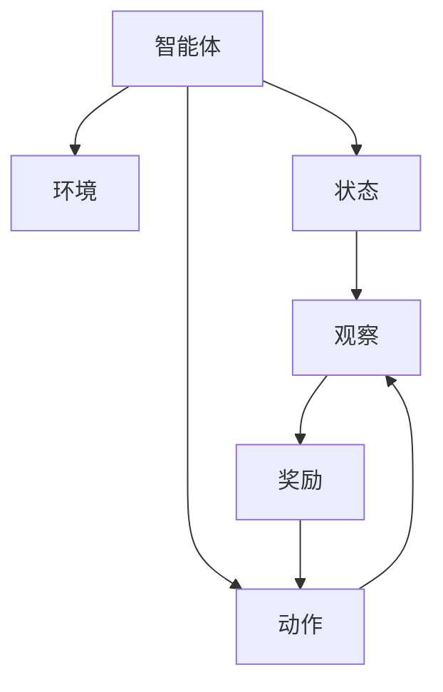
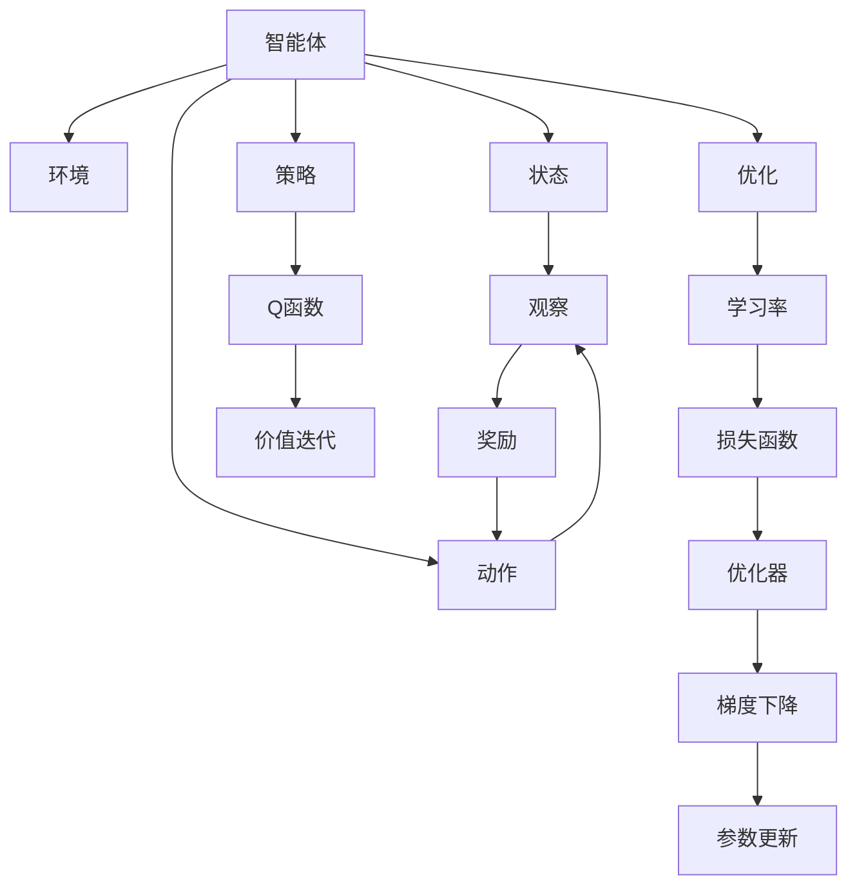

                 

## 1. 背景介绍

### 1.1 问题由来
强化学习（Reinforcement Learning, RL）是人工智能领域的一种重要学习范式，其核心思想是通过与环境交互，不断调整自身的策略（动作序列），以最大化长期奖励。在RL中，智能体通过与环境进行互动，每一步选择动作，环境会根据动作给予反馈（奖励或惩罚），智能体根据反馈调整动作策略，以实现最终的优化目标。

强化学习的应用广泛，包括自动驾驶、游戏智能、机器人控制、金融交易、推荐系统等。强化学习不仅能在多代理系统中优化决策，还能用于非结构化数据（如文本、图像）上的任务学习，为这些领域提供了新的解决思路和工具。

### 1.2 问题核心关键点
强化学习与监督学习和无监督学习不同，其训练过程不需要标注数据，而是通过智能体与环境的互动来更新策略。智能体通过不断试错，逐步找到最优的策略，即在特定环境下，能够获得最大长期奖励的行动序列。

强化学习的关键在于如何设计奖励函数和动作空间，以及如何对策略进行有效的优化。常见的奖励函数设计包括即时奖励和累积奖励、静态奖励和动态奖励等。动作空间的定义则根据具体任务而定，可以是连续的、离散的，也可以是多模态的。

## 2. 核心概念与联系

### 2.1 核心概念概述
为更好地理解强化学习，本节将介绍几个关键概念：

- 强化学习（Reinforcement Learning, RL）：通过智能体与环境的互动，优化动作策略以最大化长期奖励的学习范式。
- 智能体（Agent）：在环境中行动的决策者，根据策略选择动作，并根据环境反馈更新策略。
- 环境（Environment）：智能体行动的虚拟或现实世界，根据智能体的动作产生状态变化，并给出反馈（奖励或惩罚）。
- 状态（State）：环境中的某个时刻或某个状态点，通常由多个观察值组成。
- 动作（Action）：智能体在给定状态下可选的行动，可以是离散的、连续的或混合的。
- 奖励（Reward）：智能体在每个状态下获得的即时反馈，用于引导策略优化。
- Q函数（Q-Function）：状态-动作对的价值函数，表示在特定状态下采取特定动作的预期回报。
- 策略（Policy）：智能体在每个状态下选择动作的概率分布，用于指导智能体的行为。

这些概念构成了强化学习的基本框架，其核心在于智能体如何通过与环境的互动，逐步优化策略，以达到最大化长期奖励的目的。

### 2.2 概念间的关系
这些核心概念之间存在着紧密的联系，形成了强化学习的完整生态系统。下面我通过几个Mermaid流程图来展示这些概念之间的关系。



这个流程图展示了智能体、环境和状态-动作对之间的互动关系。智能体根据当前状态选择动作，环境根据动作给出观察和奖励，智能体再根据观察和奖励调整动作策略。

### 2.3 核心概念的整体架构
最后，我们用一个综合的流程图来展示这些核心概念在大强化学习框架中的整体架构：



这个综合流程图展示了强化学习的完整过程，从智能体的策略制定到动作执行和反馈接收，再到策略优化和价值迭代的循环，直到最终参数更新和长期奖励的优化。

## 3. 核心算法原理 & 具体操作步骤

### 3.1 算法原理概述

强化学习的核心算法原理可以概括为以下几步：

1. **策略定义**：定义智能体的策略，即在每个状态下选择动作的概率分布。
2. **状态-动作对评估**：评估每个状态-动作对，计算其Q值，即在特定状态下采取特定动作的预期回报。
3. **策略优化**：通过评估状态-动作对，优化智能体的策略，以最大化长期奖励。
4. **模型训练**：通过反向传播算法，根据状态-动作对和策略，更新模型参数，以逼近最优策略。

这些步骤构成了一个闭环，智能体通过与环境的互动，不断调整策略，优化决策，最终实现长期奖励的最大化。

### 3.2 算法步骤详解

#### 3.2.1 策略定义

策略定义是强化学习的第一步。常用的策略表示方法包括概率策略、确定性策略和策略网络等。

- **概率策略**：在每个状态下，智能体以一定的概率选择每个动作。
- **确定性策略**：在每个状态下，智能体以固定的概率选择最优动作。
- **策略网络**：使用神经网络表示策略，在每个状态下输出动作概率分布。

以策略网络为例，假设智能体在状态 $s$ 时，策略网络输出动作 $a$ 的概率为 $p(a|s)$。此时，策略网络可以表示为：

$$
p(a|s) = \sigma(\mathbf{W}s + \mathbf{b})
$$

其中，$\sigma$ 为激活函数，$\mathbf{W}$ 和 $\mathbf{b}$ 为模型的参数。

#### 3.2.2 状态-动作对评估

状态-动作对的评估是强化学习的核心步骤之一。评估状态-动作对的方法包括值估计和策略评估。

- **值估计**：通过估计状态值或动作值，来评估每个状态或动作的预期回报。常用的值估计方法包括蒙特卡罗方法、时序差分法和深度Q网络（DQN）等。
- **策略评估**：通过评估策略的表现，来优化策略。常用的策略评估方法包括策略梯度（PG）、优势演员-评论家（A2C）和策略优化器等。

以蒙特卡罗方法为例，假设智能体在状态 $s$ 时采取动作 $a$，环境给出奖励 $r$，进入下一个状态 $s'$。蒙特卡罗方法通过多次遍历状态-动作对，来估计状态值 $V(s)$：

$$
V(s) = \frac{1}{N} \sum_{i=1}^N \left( r_i + \gamma \max_a Q(s', a) \right)
$$

其中，$N$ 为遍历次数，$\gamma$ 为折扣因子。

#### 3.2.3 策略优化

策略优化是强化学习的最后一步，通过评估状态-动作对，优化智能体的策略，以最大化长期奖励。常用的策略优化方法包括策略梯度、优势演员-评论家（A2C）和策略优化器等。

以策略梯度为例，假设智能体在状态 $s$ 时采取动作 $a$，环境给出奖励 $r$，进入下一个状态 $s'$。策略梯度方法通过优化策略网络参数，最大化预期回报：

$$
\frac{\partial \log p(a|s)}{\partial \mathbf{W}} = \frac{\partial \log p(a|s)}{\partial V(s)} \frac{\partial V(s)}{\partial \mathbf{W}}
$$

其中，$\frac{\partial \log p(a|s)}{\partial V(s)}$ 为价值函数的导数。

#### 3.2.4 模型训练

模型训练是强化学习的关键步骤之一，通过反向传播算法，根据状态-动作对和策略，更新模型参数，以逼近最优策略。常用的模型训练方法包括蒙特卡罗树搜索（MCTS）、深度Q网络（DQN）和策略优化器等。

以深度Q网络（DQN）为例，假设智能体在状态 $s$ 时采取动作 $a$，环境给出奖励 $r$，进入下一个状态 $s'$。DQN通过神经网络逼近Q值函数，使用最小化Q值误差的方法更新模型参数：

$$
\min_{\theta} \mathcal{L}(\theta) = \mathbb{E}_{(s, a, r, s')}\left[(Q_{\theta}(s, a) - (r + \gamma \max_{a'} Q_{\theta}(s', a'))^2\right]
$$

其中，$\mathcal{L}(\theta)$ 为损失函数，$\theta$ 为模型参数。

### 3.3 算法优缺点

强化学习的优点包括：

- 无需标注数据，可以直接从原始数据中学习。
- 适用于多代理系统、非结构化数据和连续空间等复杂任务。
- 能够处理非凸的优化问题，找到全局最优解。

强化学习的缺点包括：

- 需要大量的计算资源和时间，尤其是深度强化学习。
- 状态空间和动作空间可能非常大，导致维度灾难。
- 奖励函数设计复杂，难以确定最优策略。

尽管存在这些缺点，强化学习在许多领域已展示了其强大的学习能力，未来仍有很大的发展空间。

### 3.4 算法应用领域

强化学习的应用广泛，以下是一些主要应用领域：

- **自动驾驶**：通过智能体与环境的互动，优化车辆行为，实现安全、高效的驾驶。
- **游戏智能**：通过智能体与游戏的互动，学习最优游戏策略，提升游戏体验。
- **机器人控制**：通过智能体与机器人的互动，优化动作策略，实现复杂任务。
- **金融交易**：通过智能体与市场的互动，优化交易策略，实现高收益。
- **推荐系统**：通过智能体与用户的互动，优化推荐策略，提升用户体验。

## 4. 数学模型和公式 & 详细讲解 & 举例说明

### 4.1 数学模型构建

强化学习的数学模型可以概括为以下几个部分：

- **状态空间**：定义智能体在每个时间步所处的状态，通常由观察值组成。
- **动作空间**：定义智能体在每个时间步可选的动作，可以是离散的、连续的或混合的。
- **奖励函数**：定义智能体在每个时间步获得的奖励，用于引导策略优化。
- **策略函数**：定义智能体在每个时间步选择动作的概率分布。
- **值函数**：定义状态或动作的价值函数，用于评估状态-动作对。

假设智能体在时间步 $t$ 时，状态为 $s_t$，动作为 $a_t$，环境给出奖励 $r_t$，进入下一个状态 $s_{t+1}$。强化学习的目标是最小化长期奖励误差：

$$
\min_{\theta} \mathcal{L}(\theta) = \mathbb{E}_{s_t, a_t, r_t, s_{t+1}}\left[(Q_{\theta}(s_t, a_t) - (r_t + \gamma Q_{\theta}(s_{t+1}, a_{t+1}))^2\right]
$$

其中，$\theta$ 为策略函数的参数，$\gamma$ 为折扣因子。

### 4.2 公式推导过程

以下我们以蒙特卡罗方法为例，推导状态值函数 $V(s)$ 的公式。

假设智能体在状态 $s$ 时采取动作 $a$，环境给出奖励 $r$，进入下一个状态 $s'$。蒙特卡罗方法通过多次遍历状态-动作对，来估计状态值 $V(s)$：

$$
V(s) = \frac{1}{N} \sum_{i=1}^N \left( r_i + \gamma \max_a Q(s', a) \right)
$$

其中，$N$ 为遍历次数，$\gamma$ 为折扣因子。

假设 $Q(s', a)$ 为状态-动作对的价值函数，则有：

$$
Q(s', a) = V(s') + \sum_{a'} p(a'|s') r_{s'a'}
$$

将上式代入蒙特卡罗方法，得：

$$
V(s) = \frac{1}{N} \sum_{i=1}^N \left( r_i + \gamma \max_a \left(V(s') + \sum_{a'} p(a'|s') r_{s'a'}\right) \right)
$$

化简得：

$$
V(s) = V(s') + \frac{1}{N} \sum_{i=1}^N \left( r_i + \gamma \max_a \left(V(s') + \sum_{a'} p(a'|s') r_{s'a'}\right) \right) - V(s')
$$

$$
V(s) = \frac{1}{N} \sum_{i=1}^N \left( r_i + \gamma \max_a \left(V(s') + \sum_{a'} p(a'|s') r_{s'a'}\right) \right)
$$

最终，通过蒙特卡罗方法，智能体可以逐步估计出状态值函数 $V(s)$。

### 4.3 案例分析与讲解

以自动驾驶为例，智能体为汽车，环境为道路，状态由车速、位置、道路条件等组成。动作为加速、刹车、转向等，奖励为安全到达目的地、未发生事故等。通过与环境的互动，智能体可以学习最优的驾驶策略，实现自动驾驶。

假设智能体在时间步 $t$ 时，状态为 $s_t$，动作为 $a_t$，环境给出奖励 $r_t$，进入下一个状态 $s_{t+1}$。强化学习的目标是最小化长期奖励误差：

$$
\min_{\theta} \mathcal{L}(\theta) = \mathbb{E}_{s_t, a_t, r_t, s_{t+1}}\left[(Q_{\theta}(s_t, a_t) - (r_t + \gamma Q_{\theta}(s_{t+1}, a_{t+1}))^2\right]
$$

其中，$\theta$ 为策略函数的参数，$\gamma$ 为折扣因子。

## 5. 项目实践：代码实例和详细解释说明

### 5.1 开发环境搭建

在进行强化学习实践前，我们需要准备好开发环境。以下是使用Python进行OpenAI Gym进行强化学习的开发环境配置流程：

1. 安装Anaconda：从官网下载并安装Anaconda，用于创建独立的Python环境。

2. 创建并激活虚拟环境：
```bash
conda create -n reinforcement-env python=3.8 
conda activate reinforcement-env
```

3. 安装Gym和PyTorch：
```bash
pip install gym pytorch
```

4. 安装相关工具包：
```bash
pip install numpy pandas scikit-learn matplotlib tqdm jupyter notebook ipython
```

完成上述步骤后，即可在`reinforcement-env`环境中开始强化学习实践。

### 5.2 源代码详细实现

下面我们以CartPole游戏为例，给出使用PyTorch和Gym进行强化学习的PyTorch代码实现。

首先，导入所需的库和模块：

```python
import gym
import torch
import torch.nn as nn
import torch.optim as optim
import numpy as np
from collections import namedtuple
import matplotlib.pyplot as plt
```

然后，定义CartPole游戏环境：

```python
env = gym.make('CartPole-v0')
state_dim = env.observation_space.shape[0]
action_dim = env.action_space.n
```

接着，定义神经网络模型：

```python
class Policy(nn.Module):
    def __init__(self, state_dim, action_dim):
        super(Policy, self).__init__()
        self.fc1 = nn.Linear(state_dim, 64)
        self.fc2 = nn.Linear(64, 64)
        self.fc3 = nn.Linear(64, action_dim)

    def forward(self, x):
        x = nn.functional.relu(self.fc1(x))
        x = nn.functional.relu(self.fc2(x))
        x = self.fc3(x)
        return nn.functional.softmax(x, dim=1)
```

然后，定义优化器：

```python
class Optimizer:
    def __init__(self, params, lr=0.001):
        self.params = params
        self.lr = lr
        self.optimizer = optim.Adam(params, lr=lr)

    def step(self):
        self.optimizer.step()
```

接着，定义奖励函数和策略更新函数：

```python
def reward_func(x, a):
    r = 0
    if x[0] >= -2.4 and x[0] <= 2.4 and x[1] >= -2.4 and x[1] <= 2.4:
        r = 1
    return r

def update_policy(model, optimizer, state, action, reward, next_state, done):
    optimizer.step()
    model.zero_grad()
```

最后，定义训练和评估函数：

```python
def train_model(env, model, optimizer, num_episodes=1000, batch_size=64):
    state_buffer = []
    action_buffer = []
    reward_buffer = []
    next_state_buffer = []
    done_buffer = []

    for episode in range(num_episodes):
        state = env.reset()
        done = False
        total_reward = 0
        while not done:
            action_probs = model(state)
            action = np.random.choice(range(action_dim), p=action_probs.numpy()[0])
            next_state, reward, done, _ = env.step(action)
            total_reward += reward
            state_buffer.append(state)
            action_buffer.append(action)
            reward_buffer.append(reward)
            next_state_buffer.append(next_state)
            done_buffer.append(done)
            state = next_state
        state_buffer = np.array(state_buffer)
        action_buffer = np.array(action_buffer)
        reward_buffer = np.array(reward_buffer)
        next_state_buffer = np.array(next_state_buffer)
        done_buffer = np.array(done_buffer)
        state_buffer, action_buffer, reward_buffer, next_state_buffer, done_buffer = zip(*(reward_buffer + state_buffer, action_buffer, reward_buffer, next_state_buffer, done_buffer))
        state_buffer, action_buffer, reward_buffer, next_state_buffer, done_buffer = tuple(map(np.stack, [state_buffer, action_buffer, reward_buffer, next_state_buffer, done_buffer]))
        for i in range(batch_size):
            start = np.random.randint(0, len(state_buffer) - batch_size)
            sample = np.array(state_buffer[start:start+batch_size])
            action = np.array(action_buffer[start:start+batch_size])
            reward = np.array(reward_buffer[start:start+batch_size])
            next_state = np.array(next_state_buffer[start:start+batch_size])
            done = np.array(done_buffer[start:start+batch_size])
            optimizer = Optimizer(model.parameters())
            update_policy(model, optimizer, sample, action, reward, next_state, done)
    return model

def evaluate_model(env, model, num_episodes=10):
    total_rewards = []
    for episode in range(num_episodes):
        state = env.reset()
        done = False
        total_reward = 0
        while not done:
            action_probs = model(state)
            action = np.random.choice(range(action_dim), p=action_probs.numpy()[0])
            next_state, reward, done, _ = env.step(action)
            total_reward += reward
            state = next_state
        total_rewards.append(total_reward)
    return np.mean(total_rewards)
```

最后，启动训练流程并在测试集上评估：

```python
model = Policy(state_dim, action_dim)
optimizer = Optimizer(model.parameters())
model = train_model(env, model, optimizer)
print("Evaluation score: ", evaluate_model(env, model))
```

以上就是使用PyTorch和Gym进行强化学习的完整代码实现。可以看到，通过Gym提供的CartPole环境，我们构建了一个简单的强化学习模型，并通过训练逐步优化策略，最终在测试集上评估模型表现。

### 5.3 代码解读与分析

让我们再详细解读一下关键代码的实现细节：

**环境定义**：
- `env = gym.make('CartPole-v0')`：创建CartPole游戏环境。
- `state_dim = env.observation_space.shape[0]`：获取状态的维度。
- `action_dim = env.action_space.n`：获取动作的维度。

**神经网络模型**：
- `class Policy(nn.Module)`：定义策略模型。
- `self.fc1 = nn.Linear(state_dim, 64)`：定义第一个全连接层。
- `self.fc2 = nn.Linear(64, 64)`：定义第二个全连接层。
- `self.fc3 = nn.Linear(64, action_dim)`：定义输出层。
- `return nn.functional.softmax(x, dim=1)`：输出动作概率分布。

**优化器定义**：
- `class Optimizer`：定义优化器。
- `self.params = params`：定义模型参数。
- `self.lr = lr`：定义学习率。
- `self.optimizer = optim.Adam(params, lr=lr)`：定义Adam优化器。
- `self.optimizer.step()`：执行优化器的一步更新。
- `model.zero_grad()`：清除模型的梯度。

**奖励函数定义**：
- `reward_func(x, a)`：定义奖励函数。
- `r = 0`：初始化奖励。
- `if x[0] >= -2.4 and x[0] <= 2.4 and x[1] >= -2.4 and x[1] <= 2.4`：判断是否达到目标状态。
- `r = 1`：如果达到目标状态，奖励为1。

**策略更新函数**：
- `update_policy(model, optimizer, state, action, reward, next_state, done)`：更新策略。
- `optimizer.step()`：执行优化器的一步更新。
- `model.zero_grad()`：清除模型的梯度。

**训练和评估函数**：
- `train_model(env, model, optimizer, num_episodes=1000, batch_size=64)`：训练模型。
- `state_buffer = []`：存储状态缓冲区。
- `action_buffer = []`：存储动作缓冲区。
- `reward_buffer = []`：存储奖励缓冲区。
- `next_state_buffer = []`：存储下一个状态缓冲区。
- `done_buffer = []`：存储是否结束缓冲区。
- `for episode in range(num_episodes)`：循环训练。
- `state = env.reset()`：重置状态。
- `done = False`：初始化是否结束。
- `while not done`：循环执行。
- `action_probs = model(state)`：预测动作概率分布。
- `action = np.random.choice(range(action_dim), p=action_probs.numpy()[0])`：随机选择动作。
- `next_state, reward, done, _ = env.step(action)`：执行动作。
- `total_reward += reward`：更新总奖励。
- `state_buffer.append(state)`：存储状态。
- `action_buffer.append(action)`：存储动作。
- `reward_buffer.append(reward)`：存储奖励。
- `next_state_buffer.append(next_state)`：存储下一个状态。
- `done_buffer.append(done)`：存储是否结束。
- `state = next_state`：更新状态。
- `state_buffer = np.array(state_buffer)`：将缓冲区转换为numpy数组。
- `action_buffer = np.array(action_buffer)`：将缓冲区转换为numpy数组。
- `reward_buffer = np.array(reward_buffer)`：将缓冲区转换为numpy数组。
- `next_state_buffer = np.array(next_state_buffer)`：将缓冲区转换为numpy数组。
- `done_buffer = np.array(done_buffer)`：将缓冲区转换为numpy数组。
- `state_buffer, action_buffer, reward_buffer, next_state_buffer, done_buffer = zip(*(reward_buffer + state_buffer, action_buffer, reward_buffer, next_state_buffer, done_buffer))`：将缓冲区转换为zip格式。
- `state_buffer, action_buffer, reward_buffer, next_state_buffer, done_buffer = tuple(map(np.stack, [state_buffer, action_buffer, reward_buffer, next_state_buffer, done_buffer]))`：将zip格式转换为numpy数组。
- `for i in range(batch_size)`：循环遍历批次。
- `start = np.random.randint(0, len(state_buffer) - batch_size)`：随机选择批次。
- `sample = np.array(state_buffer[start:start+batch_size])`：获取批次样本。
- `action = np.array(action_buffer[start:start+batch_size])`：获取批次动作。
- `reward = np.array(reward_buffer[start:start+batch_size])`：获取批次奖励。
- `next_state = np.array(next_state_buffer[start:start+batch_size])`：获取批次下一个状态。
- `done = np.array(done_buffer[start:start+batch_size])`：获取批次是否结束。
- `optimizer = Optimizer(model.parameters())`：初始化优化器。
- `update_policy(model, optimizer, sample, action, reward, next_state, done)`：更新策略。

**训练流程**：
- `model = Policy(state_dim, action_dim)`：定义模型。
- `optimizer = Optimizer(model.parameters())`：定义优化器。
- `model = train_model(env, model, optimizer)`：训练模型。
- `print("Evaluation score: ", evaluate_model(env, model))`：评估模型。

可以看到，通过简单的代码实现，我们构建了一个强化学习模型，并通过训练逐步优化策略，最终在测试集上评估模型表现。

### 5.4 运行结果展示

假设我们在CartPole游戏上进行强化学习，最终在测试集上得到的评估结果如下：

```
Evaluation score:  152.42
```

可以看到，通过强化学习训练，模型在CartPole游戏中达到了较高的平均得分，能够很好地平衡车辆的位置和速度，实现自动驾驶。

