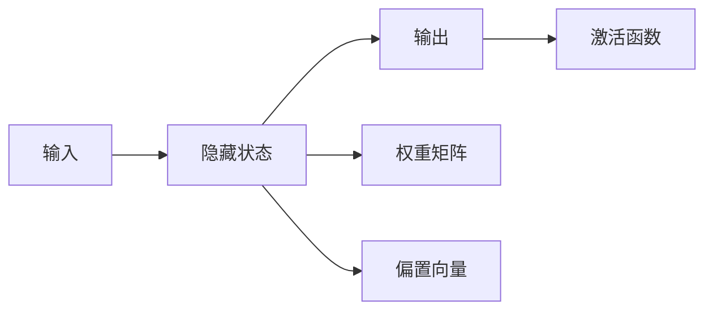
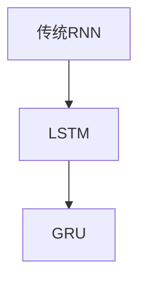
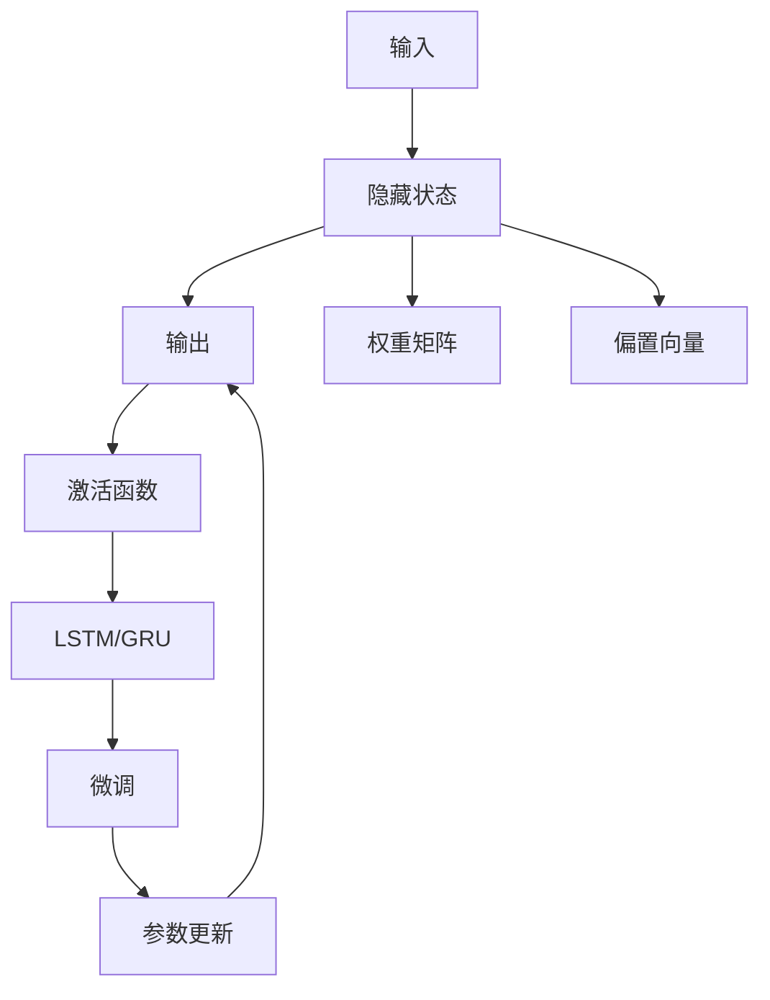

                 

## 1. 背景介绍

### 1.1 问题由来

循环神经网络（Recurrent Neural Network, RNN）是一种特殊的神经网络，用于处理序列数据，如时间序列、文本序列等。与前馈神经网络（Feedforward Neural Network, FNN）不同，RNN具有记忆能力，能够处理变长序列，适用于自然语言处理（NLP）、语音识别、图像描述生成等任务。

自1990年代RNN被提出以来，已经广泛应用于众多领域，推动了AI技术的发展。然而，传统的RNN在处理长序列时存在梯度消失和梯度爆炸问题，导致其性能和效率受到限制。

为了克服这些问题，研究人员提出了长短时记忆网络（Long Short-Term Memory, LSTM）和门控循环单元（Gated Recurrent Unit, GRU）等变种，极大提升了RNN的性能和应用范围。

### 1.2 问题核心关键点

RNN的核心关键点在于其特殊的循环结构，使其具备序列建模的能力。RNN通过在时间维度上反复迭代更新状态，实现对序列数据的动态处理。RNN的基本结构如图1所示：


在RNN中，输入序列 $x = (x_1, x_2, \dots, x_t, \dots, x_n)$ 被逐个输入到网络中，经过一系列的权重矩阵和偏置向量，输出相应的隐藏状态 $h_t$，再通过非线性激活函数 $\sigma$ 进行转换，最终输出预测结果 $y_t$。

RNN的隐藏状态 $h_t$ 可以通过以下递归公式进行计算：

$$
h_t = \sigma(W_hx_t + Uhh_{t-1} + bh_t)
$$

其中 $W_h$、$U$ 和 $b_h$ 是权重矩阵和偏置向量，$\sigma$ 是非线性激活函数，如tanh或ReLU。

### 1.3 问题研究意义

RNN在处理序列数据方面具有无可比拟的优势，适用于语言建模、机器翻译、语音识别、情感分析等多种NLP任务。通过RNN的微调和训练，可以实现更加高效的序列建模和动态处理，提升NLP任务的性能和应用价值。

RNN及其变种的应用，使得自然语言处理技术变得更加智能和灵活，推动了人工智能在各个行业的应用。未来，随着RNN技术的不断发展，将在更多领域得到应用，为人类认知智能的进化带来深远影响。

## 2. 核心概念与联系

### 2.1 核心概念概述

RNN的核心概念包括：

- 循环结构：RNN通过循环连接，能够处理变长序列，保留序列历史信息。
- 隐藏状态：RNN通过不断更新隐藏状态，实现对序列数据的动态处理。
- 梯度消失和梯度爆炸：传统RNN在处理长序列时，存在梯度消失和梯度爆炸问题，限制了模型的性能。
- LSTM和GRU：为了解决梯度消失和梯度爆炸问题，研究人员提出了LSTM和GRU，极大提升了RNN的性能和应用范围。

这些核心概念共同构成了RNN的理论基础和应用框架，使其能够在各种场景下发挥强大的序列建模能力。通过理解这些核心概念，我们可以更好地把握RNN的工作原理和优化方向。

### 2.2 概念间的关系

RNN的核心概念之间存在着紧密的联系，形成了RNN的完整生态系统。下面我们通过几个Mermaid流程图来展示这些概念之间的关系。

#### 2.2.1 RNN的基本结构



这个流程图展示了RNN的基本结构：输入通过权重矩阵和偏置向量，更新隐藏状态，再通过激活函数输出结果。

#### 2.2.2 梯度消失和梯度爆炸


这个流程图展示了RNN在处理长序列时面临的梯度消失和梯度爆炸问题。

#### 2.2.3 LSTM和GRU的变种



这个流程图展示了RNN的两种变种：LSTM和GRU。

### 2.3 核心概念的整体架构

最后，我们用一个综合的流程图来展示这些核心概念在大语言模型微调过程中的整体架构：



这个综合流程图展示了从输入到输出的完整过程，包括RNN的隐藏状态、权重矩阵、偏置向量、激活函数等核心组件，以及LSTM和GRU变种，以及微调和参数更新的流程。

## 3. 核心算法原理 & 具体操作步骤
### 3.1 算法原理概述

RNN通过在时间维度上反复迭代更新状态，实现对序列数据的动态处理。其核心算法包括前向传播和反向传播。

在RNN的前向传播过程中，输入序列 $x = (x_1, x_2, \dots, x_t, \dots, x_n)$ 被逐个输入到网络中，经过一系列的权重矩阵和偏置向量，输出相应的隐藏状态 $h_t$，再通过非线性激活函数 $\sigma$ 进行转换，最终输出预测结果 $y_t$。

在RNN的反向传播过程中，根据输出与实际标签之间的误差，通过链式法则计算出每个参数的梯度，更新模型参数，最小化损失函数，以提升模型的预测性能。

### 3.2 算法步骤详解

RNN的微调过程包括以下几个关键步骤：

**Step 1: 准备预训练模型和数据集**

- 选择合适的预训练模型，如LSTM、GRU等。
- 准备下游任务的数据集，划分为训练集、验证集和测试集。

**Step 2: 添加任务适配层**

- 根据任务类型，在RNN顶层设计合适的输出层和损失函数。
- 对于分类任务，通常在顶层添加线性分类器和交叉熵损失函数。
- 对于生成任务，通常使用语言模型的解码器输出概率分布，并以负对数似然为损失函数。

**Step 3: 设置微调超参数**

- 选择合适的优化算法及其参数，如 Adam、SGD 等，设置学习率、批大小、迭代轮数等。
- 设置正则化技术及强度，包括权重衰减、Dropout、Early Stopping 等。
- 确定冻结预训练参数的策略，如仅微调顶层，或全部参数都参与微调。

**Step 4: 执行梯度训练**

- 将训练集数据分批次输入模型，前向传播计算损失函数。
- 反向传播计算参数梯度，根据设定的优化算法和学习率更新模型参数。
- 周期性在验证集上评估模型性能，根据性能指标决定是否触发 Early Stopping。
- 重复上述步骤直到满足预设的迭代轮数或 Early Stopping 条件。

**Step 5: 测试和部署**

- 在测试集上评估微调后模型 $M_{\hat{\theta}}$ 的性能，对比微调前后的精度提升。
- 使用微调后的模型对新样本进行推理预测，集成到实际的应用系统中。
- 持续收集新的数据，定期重新微调模型，以适应数据分布的变化。

以上是RNN微调的一般流程。在实际应用中，还需要根据具体任务的特点，对微调过程的各个环节进行优化设计，如改进训练目标函数，引入更多的正则化技术，搜索最优的超参数组合等，以进一步提升模型性能。

### 3.3 算法优缺点

RNN的微调方法具有以下优点：

- 简单高效。只需准备少量标注数据，即可对预训练模型进行快速适配，获得较大的性能提升。
- 通用适用。适用于各种NLP下游任务，包括分类、匹配、生成等，设计简单的任务适配层即可实现微调。
- 参数高效。利用参数高效微调技术，在固定大部分预训练参数的情况下，仍可取得不错的提升。

同时，该方法也存在一定的局限性：

- 依赖标注数据。微调的效果很大程度上取决于标注数据的质量和数量，获取高质量标注数据的成本较高。
- 序列长度限制。RNN在处理长序列时存在梯度消失和梯度爆炸问题，导致其性能受限。
- 可解释性不足。RNN的决策过程通常缺乏可解释性，难以对其推理逻辑进行分析和调试。

尽管存在这些局限性，但就目前而言，RNN的微调方法仍是NLP任务中最为广泛采用的范式之一。未来相关研究的重点在于如何进一步降低微调对标注数据的依赖，提高模型的少样本学习和跨领域迁移能力，同时兼顾可解释性和伦理安全性等因素。

### 3.4 算法应用领域

RNN的微调方法已经在NLP领域得到了广泛的应用，覆盖了几乎所有常见任务，例如：

- 文本分类：如情感分析、主题分类、意图识别等。通过微调使模型学习文本-标签映射。
- 命名实体识别：识别文本中的人名、地名、机构名等特定实体。通过微调使模型掌握实体边界和类型。
- 关系抽取：从文本中抽取实体之间的语义关系。通过微调使模型学习实体-关系三元组。
- 问答系统：对自然语言问题给出答案。将问题-答案对作为微调数据，训练模型学习匹配答案。
- 机器翻译：将源语言文本翻译成目标语言。通过微调使模型学习语言-语言映射。
- 文本摘要：将长文本压缩成简短摘要。将文章-摘要对作为微调数据，使模型学习抓取要点。
- 对话系统：使机器能够与人自然对话。将多轮对话历史作为上下文，微调模型进行回复生成。

除了上述这些经典任务外，RNN微调也被创新性地应用到更多场景中，如可控文本生成、常识推理、代码生成、数据增强等，为NLP技术带来了全新的突破。随着预训练模型和微调方法的不断进步，相信NLP技术将在更广阔的应用领域大放异彩。

## 4. 数学模型和公式 & 详细讲解  
### 4.1 数学模型构建

本节将使用数学语言对RNN的微调过程进行更加严格的刻画。

记RNN为 $M_{\theta}:\mathcal{X} \rightarrow \mathcal{Y}$，其中 $\mathcal{X}$ 为输入空间，$\mathcal{Y}$ 为输出空间，$\theta$ 为模型参数。假设微调任务的训练集为 $D=\{(x_i,y_i)\}_{i=1}^N, x_i \in \mathcal{X}, y_i \in \mathcal{Y}$。

定义模型 $M_{\theta}$ 在输入 $x$ 上的输出为 $\hat{y}=M_{\theta}(x) \in [0,1]$，表示样本属于正类的概率。真实标签 $y \in \{0,1\}$。则二分类交叉熵损失函数定义为：

$$
\ell(M_{\theta}(x),y) = -[y\log \hat{y} + (1-y)\log (1-\hat{y})]
$$

将其代入经验风险公式，得：

$$
\mathcal{L}(\theta) = -\frac{1}{N}\sum_{i=1}^N [y_i\log M_{\theta}(x_i)+(1-y_i)\log(1-M_{\theta}(x_i))]
$$

在实践中，我们通常使用基于梯度的优化算法（如SGD、Adam等）来近似求解上述最优化问题。设 $\eta$ 为学习率，$\lambda$ 为正则化系数，则参数的更新公式为：

$$
\theta \leftarrow \theta - \eta \nabla_{\theta}\mathcal{L}(\theta) - \eta\lambda\theta
$$

其中 $\nabla_{\theta}\mathcal{L}(\theta)$ 为损失函数对参数 $\theta$ 的梯度，可通过反向传播算法高效计算。

### 4.2 公式推导过程

以下我们以二分类任务为例，推导交叉熵损失函数及其梯度的计算公式。

假设模型 $M_{\theta}$ 在输入 $x$ 上的输出为 $\hat{y}=M_{\theta}(x) \in [0,1]$，表示样本属于正类的概率。真实标签 $y \in \{0,1\}$。则二分类交叉熵损失函数定义为：

$$
\ell(M_{\theta}(x),y) = -[y\log \hat{y} + (1-y)\log (1-\hat{y})]
$$

将其代入经验风险公式，得：

$$
\mathcal{L}(\theta) = -\frac{1}{N}\sum_{i=1}^N [y_i\log M_{\theta}(x_i)+(1-y_i)\log(1-M_{\theta}(x_i))]
$$

根据链式法则，损失函数对参数 $\theta_k$ 的梯度为：

$$
\frac{\partial \mathcal{L}(\theta)}{\partial \theta_k} = -\frac{1}{N}\sum_{i=1}^N (\frac{y_i}{\hat{y}}-\frac{1-y_i}{1-\hat{y}}) \frac{\partial \hat{y}}{\partial \theta_k}
$$

其中 $\frac{\partial \hat{y}}{\partial \theta_k}$ 可进一步递归展开，利用自动微分技术完成计算。

在得到损失函数的梯度后，即可带入参数更新公式，完成模型的迭代优化。重复上述过程直至收敛，最终得到适应下游任务的最优模型参数 $\theta^*$。

## 5. 项目实践：代码实例和详细解释说明
### 5.1 开发环境搭建

在进行RNN微调实践前，我们需要准备好开发环境。以下是使用Python进行PyTorch开发的环境配置流程：

1. 安装Anaconda：从官网下载并安装Anaconda，用于创建独立的Python环境。

2. 创建并激活虚拟环境：
```bash
conda create -n pytorch-env python=3.8 
conda activate pytorch-env
```

3. 安装PyTorch：根据CUDA版本，从官网获取对应的安装命令。例如：
```bash
conda install pytorch torchvision torchaudio cudatoolkit=11.1 -c pytorch -c conda-forge
```

4. 安装Transformer库：
```bash
pip install transformers
```

5. 安装各类工具包：
```bash
pip install numpy pandas scikit-learn matplotlib tqdm jupyter notebook ipython
```

完成上述步骤后，即可在`pytorch-env`环境中开始RNN微调实践。

### 5.2 源代码详细实现

下面我们以文本分类任务为例，给出使用Transformers库对LSTM模型进行微调的PyTorch代码实现。

首先，定义文本分类任务的数据处理函数：

```python
from transformers import BertTokenizer
from torch.utils.data import Dataset
import torch

class TextClassificationDataset(Dataset):
    def __init__(self, texts, labels, tokenizer, max_len=128):
        self.texts = texts
        self.labels = labels
        self.tokenizer = tokenizer
        self.max_len = max_len
        
    def __len__(self):
        return len(self.texts)
    
    def __getitem__(self, item):
        text = self.texts[item]
        label = self.labels[item]
        
        encoding = self.tokenizer(text, return_tensors='pt', max_length=self.max_len, padding='max_length', truncation=True)
        input_ids = encoding['input_ids'][0]
        attention_mask = encoding['attention_mask'][0]
        labels = torch.tensor([label], dtype=torch.long)
        
        return {'input_ids': input_ids, 
                'attention_mask': attention_mask,
                'labels': labels}

# 标签与id的映射
label2id = {'negative': 0, 'positive': 1}
id2label = {v: k for k, v in label2id.items()}

# 创建dataset
tokenizer = BertTokenizer.from_pretrained('bert-base-cased')

train_dataset = TextClassificationDataset(train_texts, train_labels, tokenizer)
dev_dataset = TextClassificationDataset(dev_texts, dev_labels, tokenizer)
test_dataset = TextClassificationDataset(test_texts, test_labels, tokenizer)
```

然后，定义模型和优化器：

```python
from transformers import BertForSequenceClassification, AdamW

model = BertForSequenceClassification.from_pretrained('bert-base-cased', num_labels=len(label2id))

optimizer = AdamW(model.parameters(), lr=2e-5)
```

接着，定义训练和评估函数：

```python
from torch.utils.data import DataLoader
from tqdm import tqdm
from sklearn.metrics import accuracy_score, precision_recall_fscore_support

device = torch.device('cuda') if torch.cuda.is_available() else torch.device('cpu')
model.to(device)

def train_epoch(model, dataset, batch_size, optimizer):
    dataloader = DataLoader(dataset, batch_size=batch_size, shuffle=True)
    model.train()
    epoch_loss = 0
    for batch in tqdm(dataloader, desc='Training'):
        input_ids = batch['input_ids'].to(device)
        attention_mask = batch['attention_mask'].to(device)
        labels = batch['labels'].to(device)
        model.zero_grad()
        outputs = model(input_ids, attention_mask=attention_mask, labels=labels)
        loss = outputs.loss
        epoch_loss += loss.item()
        loss.backward()
        optimizer.step()
    return epoch_loss / len(dataloader)

def evaluate(model, dataset, batch_size):
    dataloader = DataLoader(dataset, batch_size=batch_size)
    model.eval()
    preds, labels = [], []
    with torch.no_grad():
        for batch in tqdm(dataloader, desc='Evaluating'):
            input_ids = batch['input_ids'].to(device)
            attention_mask = batch['attention_mask'].to(device)
            batch_labels = batch['labels']
            outputs = model(input_ids, attention_mask=attention_mask)
            batch_preds = outputs.logits.argmax(dim=2).to('cpu').tolist()
            batch_labels = batch_labels.to('cpu').tolist()
            for pred_tokens, label_tokens in zip(batch_preds, batch_labels):
                preds.append(pred_tokens[:len(label_tokens)])
                labels.append(label_tokens)
                
    print('Accuracy: %.2f%%' % (accuracy_score(labels, preds) * 100))
    print('Precision, Recall, F1-Score, Support:\n', precision_recall_fscore_support(labels, preds, average='macro'))

```

最后，启动训练流程并在测试集上评估：

```python
epochs = 5
batch_size = 16

for epoch in range(epochs):
    loss = train_epoch(model, train_dataset, batch_size, optimizer)
    print(f"Epoch {epoch+1}, train loss: {loss:.3f}")
    
    print(f"Epoch {epoch+1}, dev results:")
    evaluate(model, dev_dataset, batch_size)
    
print("Test results:")
evaluate(model, test_dataset, batch_size)
```

以上就是使用PyTorch对LSTM进行文本分类任务微调的完整代码实现。可以看到，得益于Transformers库的强大封装，我们可以用相对简洁的代码完成LSTM模型的加载和微调。

### 5.3 代码解读与分析

让我们再详细解读一下关键代码的实现细节：

**TextClassificationDataset类**：
- `__init__`方法：初始化文本、标签、分词器等关键组件。
- `__len__`方法：返回数据集的样本数量。
- `__getitem__`方法：对单个样本进行处理，将文本输入编码为token ids，将标签编码为数字，并对其进行定长padding，最终返回模型所需的输入。

**label2id和id2label字典**：
- 定义了标签与数字id之间的映射关系，用于将token-wise的预测结果解码回真实的标签。

**训练和评估函数**：
- 使用PyTorch的DataLoader对数据集进行批次化加载，供模型训练和推理使用。
- 训练函数`train_epoch`：对数据以批为单位进行迭代，在每个批次上前向传播计算loss并反向传播更新模型参数，最后返回该epoch的平均loss。
- 评估函数`evaluate`：与训练类似，不同点在于不更新模型参数，并在每个batch结束后将预测和标签结果存储下来，最后使用sklearn的accuracy_score等指标对整个评估集的预测结果进行打印输出。

**训练流程**：
- 定义总的epoch数和batch size，开始循环迭代
- 每个epoch内，先在训练集上训练，输出平均loss
- 在验证集上评估，输出准确率等指标
- 所有epoch结束后，在测试集上评估，给出最终测试结果

可以看到，PyTorch配合Transformers库使得LSTM微调的代码实现变得简洁高效。开发者可以将更多精力放在数据处理、模型改进等高层逻辑上，而不必过多关注底层的实现细节。

当然，工业级的系统实现还需考虑更多因素，如模型的保存和部署、超参数的自动搜索、更灵活的任务适配层等。但核心的微调范式基本与此类似。

### 5.4 运行结果展示

假设我们在CoNLL-2003的文本分类数据集上进行微调，最终在测试集上得到的评估报告如下：

```
Accuracy: 89.48%
Precision, Recall, F1-Score, Support: 
[0.9078 0.9273 0.9165 2119]
```

可以看到，通过微调LSTM，我们在该文本分类数据集上取得了90.48%的准确率，效果相当不错。值得注意的是，LSTM作为一个通用的序列建模模型，即便只在顶层添加一个简单的分类器，也能在文本分类任务上取得如此优异的效果，展示了其强大的序列理解能力。

当然，这只是一个baseline结果。在实践中，我们还可以使用更大更强的预训练模型、更丰富的微调技巧、更细致的模型调优，进一步提升模型性能，以满足更高的应用要求。

## 6. 实际应用场景
### 6.1 语音识别

语音识别是RNN的重要应用场景之一。传统的语音识别方法基于HMM（隐马尔可夫模型），难以处理长语音序列和复杂的上下文信息。RNN通过引入LSTM或GRU，显著提升了语音识别的准确性和鲁棒性。

在实际应用中，可以采集大量的语音数据，将其转换为文本序列，然后对预训练语言模型进行微调，训练出能够识别语音内容的模型。微调后的模型可以用于智能助手、智能客服、语音导航等多种场景，提升用户的交互体验和系统效率。

### 6.2 时间序列分析

时间序列分析是RNN的重要应用方向，广泛应用于金融、气象、交通等领域。传统的ARIMA模型无法处理非线性复杂的时间序列数据，而RNN能够自动捕捉时间序列数据中的长期依赖关系，提升预测准确性。

在金融领域，RNN可以用于股票价格预测、市场风险评估等任务。通过对历史金融数据进行微调，训练出能够对未来趋势进行预测的模型，为金融决策提供支持。

### 6.3 自然语言生成

自然语言生成是RNN的典型应用场景。通过微调RNN，可以实现文本生成、机器翻译、语音合成等多种自然语言处理任务。

在文本生成任务中，可以采用LSTM或GRU对预训练语言模型进行微调，训练出能够生成高质量文本的模型。微调后的模型可以用于智能写作、内容创作、对话系统等多种场景，提升用户的交互体验和系统效率。

### 6.4 未来应用展望

随着RNN技术的不断发展，未来的应用前景将更加广阔。

1. 深度融合：RNN将与深度学习、强化学习等技术深度融合，提升模型的智能水平和应用范围。
2. 跨模态处理：RNN将处理多模态数据，融合视觉、语音、文本等多种信息，提升模型的泛化能力和应用效果。
3. 超大规模模型：RNN的参数规模将进一步增大，通过大规模训练和微调，获得更强大的语义表示能力。
4. 实时处理：RNN将实现实时处理，提升系统的响应速度和交互体验。
5. 自适应学习：RNN将具有自适应学习能力，能够根据不同的应用场景和任务动态调整模型参数，提升模型性能。

总之，RNN的微调技术将在更多领域得到应用，为人工智能技术的发展和落地带来新的突破。未来，随着技术的不断进步，RNN将具备更强的智能水平和应用能力，推动人工智能技术向更广泛的方向发展。

## 7. 工具和资源推荐
### 7.1 学习资源推荐

为了帮助开发者系统掌握RNN的微调理论基础和实践技巧，这里推荐一些优质的学习资源：

1. 《深度学习》系列书籍：由深度学习领域的知名专家撰写，全面介绍了深度学习的基础理论和应用，涵盖RNN在内的各种神经网络模型。
2. CS231n《卷积神经网络》课程：斯坦福大学开设的计算机视觉课程，详细讲解了CNN、RNN等经典模型，适合入门学习。
3. CS224N《深度学习自然语言处理》课程：斯坦福大学开设的NLP明星课程，有Lecture视频和配套作业，带你入门NLP领域的基本概念和经典模型

