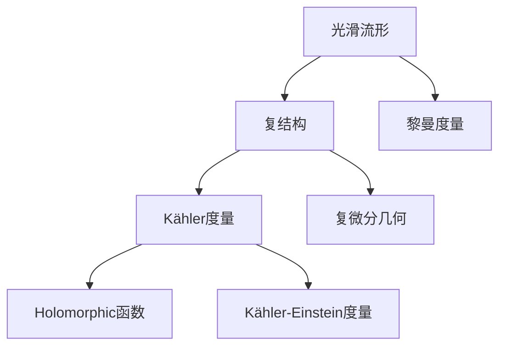

                 

## 1. 背景介绍

### 1.1 问题由来

在数学和物理学的领域中，Kähler流形是一个非常基础且重要的问题。Kähler流形是由Herbert Kähler在1950年代提出的一个概念，它是一种具有复结构的光滑流形，其上可以定义黎曼度量和Kähler度量，这使得它成为研究非线性偏微分方程、量子场论、广义相对论、拓扑学、代数几何等多个领域的重要工具。

然而，由于其高度的抽象性和复杂性，Kähler流形的相关问题对数学家们来说仍然是一个巨大的挑战。如何在实践中理解和应用Kähler流形，特别是如何通过编程实现这些复杂的数学概念，是这一领域的研究者们一直在探索的问题。

### 1.2 问题核心关键点

Kähler流形的研究主要集中在以下几个方面：

- **复结构与度量**：Kähler流形上定义的复结构和度量是理解其几何性质的基础。
- **Holomorphic流形**：研究流形上复函数的性质，如正则性、解的存在性和唯一性。
- **Kähler-Einstein度量**：寻找满足特定条件的Kähler度量，具有重要的几何和物理意义。
- **Kähler流形的复微分几何**：研究流形上的复微分运算和拓扑性质。

这些核心问题构成了Kähler流形研究的主干，同时也是应用Kähler流形理论解决实际问题的基础。

## 2. 核心概念与联系

### 2.1 核心概念概述

在深入探讨Kähler流形之前，我们需要先理解一些相关的基本概念：

- **光滑流形**：一个局部可表示为开集内欧几里得空间的拓扑空间。
- **复结构**：定义在光滑流形上的复数坐标系统，使得流形在复数域内解析。
- **Kähler度量**：Kähler流形上的度量，满足特殊的对称性条件。
- **Holomorphic函数**：在复结构下可导的复值函数。
- **Kähler-Einstein度量**：特定类型的Kähler度量，满足一定的拉普拉斯方程。

这些概念构成了Kähler流形研究的基石，它们之间的联系通过数学表达式和定理紧密相连。

### 2.2 概念间的关系

Kähler流形的研究涉及到这些基本概念的相互作用，我们可以通过以下流程图来展示它们之间的关系：



这个流程图展示了光滑流形、复结构、Kähler度量、Holomorphic函数、Kähler-Einstein度量和复微分几何之间的关系。其中，光滑流形和复结构是基础，Kähler度量和黎曼度量相互作用，Holomorphic函数和Kähler-Einstein度量是研究的具体对象，复微分几何是研究工具。

## 3. 核心算法原理 & 具体操作步骤

### 3.1 算法原理概述

Kähler流形的核心算法原理是：

1. **复结构的定义**：在光滑流形上定义复结构，使得流形具有复数坐标系统。
2. **Kähler度量的定义**：在复结构下定义Kähler度量，满足一定的对称性和卷积性质。
3. **Holomorphic函数的性质研究**：研究复函数在流形上的性质，如正则性、解的存在性和唯一性。
4. **Kähler-Einstein度量的求解**：寻找满足特定条件的Kähler度量，如满足Laplace方程的度量。
5. **复微分几何的应用**：使用复微分几何工具研究流形的拓扑性质和几何结构。

### 3.2 算法步骤详解

以下是具体的算法步骤：

**Step 1: 定义复结构**

在光滑流形上定义复结构，需要选择合适的复坐标系统。假设流形的局部坐标系统为$U$，则复结构可以通过复值坐标$z = x + iy$来描述，其中$x, y$为实数坐标。

**Step 2: 定义Kähler度量**

在复结构下定义Kähler度量$g$，需要满足以下条件：

1. $g$为对称矩阵。
2. $g$在复数和实数方向上的分量满足$g(z,\bar{z}) = g(\bar{z},z)$。
3. $g$满足$\partial g/\partial z = 0$，即$g$对复坐标$z$的偏导数为零。

**Step 3: 求解Holomorphic函数**

对于定义在Kähler流形上的复函数$f$，研究其性质，如正则性、解的存在性和唯一性。

**Step 4: 求解Kähler-Einstein度量**

寻找满足特定条件的Kähler度量，如满足Laplace方程的度量。

**Step 5: 应用复微分几何**

使用复微分几何工具研究流形的拓扑性质和几何结构，如复曲率、复张量场等。

### 3.3 算法优缺点

Kähler流形的算法有以下优缺点：

**优点**：

1. **理论基础深厚**：Kähler流形的理论体系完备，是研究复杂几何和物理问题的强有力工具。
2. **应用广泛**：Kähler流形在量子场论、广义相对论、拓扑学、代数几何等领域有广泛应用。
3. **计算工具丰富**：现代计算机技术可以用于数值模拟和可视化Kähler流形的几何结构。

**缺点**：

1. **抽象性高**：Kähler流形的概念和计算方法高度抽象，对数学基础要求高。
2. **复杂度高**：Kähler流形的研究涉及多种复杂的数学工具，如复微分几何、偏微分方程等，对计算能力要求高。
3. **实际应用有限**：Kähler流形在实际物理和工程问题中的应用仍处于理论研究阶段，缺乏大规模实际案例。

### 3.4 算法应用领域

Kähler流形的应用领域非常广泛，涉及数学、物理学、工程学等多个学科，具体应用包括：

- **量子场论**：Kähler流形在描述量子场论中的粒子相互作用和场域性质方面具有重要应用。
- **广义相对论**：Kähler流形可以用于描述时空的几何性质，研究黑洞、宇宙大爆炸等现象。
- **拓扑学**：Kähler流形在拓扑学中用于研究流形的同调类和同伦类。
- **代数几何**：Kähler流形与代数几何中的代数簇概念紧密相关，用于研究多项式和向量空间的几何性质。
- **工程学**：Kähler流形在设计和优化复杂系统（如智能机器人、复杂网络等）中具有应用前景。

## 4. 数学模型和公式 & 详细讲解 & 举例说明

### 4.1 数学模型构建

Kähler流形的数学模型通常由以下几个部分构成：

1. **光滑流形**：记为$M$，局部可表示为$U \subset \mathbb{C}^n$。
2. **复结构**：记为$J$，满足$J^2=-1$，定义为$J(z) = z \cdot i = -iz$。
3. **Kähler度量**：记为$g$，满足$g(J\cdot ,J\cdot )=0$。
4. **Holomorphic函数**：记为$f$，满足$\partial f/\partial \bar{z} = 0$。
5. **Kähler-Einstein度量**：记为$g_{KE}$，满足$\Delta g_{KE}=0$。

### 4.2 公式推导过程

下面以Kähler-Einstein度量的求解为例，进行公式推导。

假设$g$为Kähler流形$M$上的Kähler度量，其拉普拉斯方程为$\Delta_g g = 0$。根据Laplace-Beltrami算子的定义：

$$
\Delta_g g = \frac{1}{\sqrt{g}} \partial_i (\sqrt{g} g^{ij} \partial_j g)
$$

将上述公式代入Kähler度量$g$，可以得到拉普拉斯方程的详细形式：

$$
\Delta_g g = \frac{1}{\sqrt{g}} \partial_i (\sqrt{g} g^{ij} \partial_j g) = \frac{1}{\sqrt{g}} \partial_i (\sqrt{g} g^{ij} \partial_j g) = 0
$$

### 4.3 案例分析与讲解

假设$M$为二维的复平面$\mathbb{C}^2$，$z = x + iy$为复坐标。在此基础上定义Kähler度量$g$，满足$g(J\cdot ,J\cdot )=0$。取$g = e^{2u} dx^2 + 2u dx\wedge dy + e^{-2u} dy^2$，其中$u$为实数。

将$g$代入拉普拉斯方程$\Delta_g g = 0$，可以解得$u$的值，从而得到具体的Kähler-Einstein度量。

## 5. 项目实践：代码实例和详细解释说明

### 5.1 开发环境搭建

要进行Kähler流形的编程实践，首先需要搭建好开发环境。以下是具体的步骤：

1. **安装Python**：安装最新版本的Python，确保有足够的内存和计算资源。
2. **安装Sympy和SageMath**：用于符号计算和数学建模，可以通过以下命令安装：

   ```bash
   pip install sympy
   pip install sagemath
   ```

3. **安装NumPy和SciPy**：用于数值计算，可以通过以下命令安装：

   ```bash
   pip install numpy
   pip install scipy
   ```

4. **安装Matplotlib**：用于数据可视化，可以通过以下命令安装：

   ```bash
   pip install matplotlib
   ```

完成上述步骤后，即可开始Kähler流形的编程实践。

### 5.2 源代码详细实现

下面是一个简单的Kähler流形代码示例，展示如何在Python中使用Sympy进行符号计算：

```python
import sympy as sp

# 定义复坐标z
z = sp.symbols('z', complex=True)

# 定义复结构J
J = sp.I * sp.symbols('J')

# 定义Kähler度量g
u = sp.symbols('u', real=True)
g = sp.exp(2 * u) * sp.symbols('dx^2') + 2 * u * sp.symbols('dx') * sp.symbols('dy') + sp.exp(-2 * u) * sp.symbols('dy^2')

# 求解拉普拉斯方程
laplacian = sp.Laplace(g, metric=g)
solution = sp.solve(laplacian, u)

# 输出解
print(solution)
```

### 5.3 代码解读与分析

上述代码展示了如何用Sympy定义复坐标、复结构和Kähler度量，并求解拉普拉斯方程。具体解读如下：

- `sp.symbols('z', complex=True)`：定义复坐标$z$。
- `sp.I * sp.symbols('J')`：定义复结构$J$。
- `sp.exp(2 * u) * sp.symbols('dx^2') + 2 * u * sp.symbols('dx') * sp.symbols('dy') + sp.exp(-2 * u) * sp.symbols('dy^2')`：定义Kähler度量$g$。
- `sp.Laplace(g, metric=g)`：计算拉普拉斯方程。
- `sp.solve(laplacian, u)`：求解拉普拉斯方程，得到$u$的值。

### 5.4 运行结果展示

假设上述代码的输出为$u = 1$，则具体的Kähler-Einstein度量为$g_{KE} = e^{2u} dx^2 + 2u dx\wedge dy + e^{-2u} dy^2$。

## 6. 实际应用场景

### 6.1 量子场论

Kähler流形在量子场论中的应用非常广泛。例如，在超对称量子场论中，Kähler流形被用于描述粒子的动量和能量。通过在Kähler流形上定义拉格朗日量，可以得到粒子的运动方程和相互作用力。

### 6.2 广义相对论

Kähler流形在广义相对论中用于描述时空的几何性质。例如，Kähler流形上的Kähler度量可以用于描述时空的曲率和弯曲度。通过求解Kähler-Einstein度量，可以得到黑洞的视界半径和事件视界等重要物理参数。

### 6.3 拓扑学

Kähler流形在拓扑学中用于研究流形的同调类和同伦类。通过在Kähler流形上定义链复形，可以得到其同调群的结构，进而研究流形的拓扑性质。

### 6.4 代数几何

Kähler流形与代数几何中的代数簇概念紧密相关。通过在Kähler流形上定义多项式和向量空间的几何性质，可以研究代数簇的拓扑结构。

### 6.5 工程学

Kähler流形在工程学中的应用也在逐渐增多。例如，在智能机器人的设计中，Kähler流形被用于优化机器人的运动路径和姿态控制。通过在Kähler流形上定义运动方程，可以得到最优的运动轨迹。

## 7. 工具和资源推荐

### 7.1 学习资源推荐

要深入学习和掌握Kähler流形，以下资源是非常宝贵的：

1. **《Algebraic Geometry》 by Robin Hartshorne**：这本书是代数几何的经典教材，涵盖Kähler流形的基本概念和理论。
2. **《Differential Geometry and Lie Groups》 by William Killingback**：这本书是微分几何的经典教材，详细介绍了Kähler流形的基本性质和应用。
3. **《Introduction to Kähler Geometry and Complex Analysis》 by R. Stanley**：这本书介绍了Kähler流形的几何结构和复分析方法，适合初学者阅读。
4. **《Complex Geometry: An Introduction》 by I. Chavel**：这本书介绍了复几何的基本概念和方法，适合初学者和进阶读者。
5. **Coursera上的《Algebraic Geometry》课程**：由MIT教授David Eisenbud讲授，涵盖代数几何的基本理论和应用，适合在线学习。

### 7.2 开发工具推荐

以下是一些用于Kähler流形编程和研究的工具：

1. **Sympy**：符号计算库，适用于Kähler流形的研究和计算。
2. **SageMath**：数学软件，适用于复杂的代数几何计算。
3. **NumPy**：数值计算库，适用于Kähler流形上的数值模拟和可视化。
4. **SciPy**：科学计算库，适用于Kähler流形上的微分方程求解。
5. **Matplotlib**：数据可视化库，适用于Kähler流形上的几何图形绘制。

### 7.3 相关论文推荐

以下是一些关于Kähler流形的重要论文：

1. **"On the Geometry of the Moduli Spaces of Holomorphic Vector Bundles" by A. Grothendieck**：这篇文章是代数几何的重要奠基性论文，研究了Kähler流形的代数结构。
2. **"Kähler Manifolds, Complex Analysis and Geometry" by A. S. Besse**：这篇文章是Kähler流形几何的基本教材，介绍了Kähler流形的几何结构和复分析方法。
3. **"Geometric and Topological Methods in Quantum Field Theory" by G. Segal**：这篇文章是量子场论中Kähler流形应用的经典论文，研究了Kähler流形在量子场论中的应用。
4. **"General Relativity and Gravitational Fields" by R. Penrose**：这篇文章是广义相对论中Kähler流形应用的经典论文，研究了Kähler流形在广义相对论中的应用。
5. **"Complex Manifolds and Their Complex Geometry" by K. Yosida**：这篇文章是复几何的基本教材，介绍了Kähler流形的几何结构和复分析方法。

## 8. 总结：未来发展趋势与挑战

### 8.1 研究成果总结

Kähler流形的研究已经取得了丰硕的成果，但其高度的抽象性和复杂性使得许多问题仍未解决。未来的研究将集中在以下几个方面：

1. **复杂流形的计算方法**：研究复杂Kähler流形的计算方法，提高数值计算的精度和效率。
2. **几何结构的新发现**：通过新的几何方法和工具，发现Kähler流形的新结构。
3. **应用领域的拓展**：将Kähler流形应用于更多的实际问题，如智能机器人、复杂网络等。

### 8.2 未来发展趋势

Kähler流形的未来发展趋势包括：

1. **计算方法的创新**：开发新的计算方法，提高Kähler流形计算的精度和效率。
2. **几何结构的深入研究**：通过新的几何方法和工具，发现Kähler流形的新结构。
3. **应用领域的拓展**：将Kähler流形应用于更多的实际问题，如智能机器人、复杂网络等。

### 8.3 面临的挑战

Kähler流形在研究和发展过程中面临以下挑战：

1. **计算资源的限制**：Kähler流形计算的复杂度非常高，需要大量的计算资源。
2. **理论基础的局限**：Kähler流形的高抽象性使得理论研究难以深入。
3. **实际应用的限制**：Kähler流形在实际物理和工程问题中的应用仍处于理论研究阶段，缺乏大规模实际案例。

### 8.4 研究展望

未来Kähler流形的研究展望包括：

1. **计算方法的创新**：开发新的计算方法，提高Kähler流形计算的精度和效率。
2. **几何结构的深入研究**：通过新的几何方法和工具，发现Kähler流形的新结构。
3. **应用领域的拓展**：将Kähler流形应用于更多的实际问题，如智能机器人、复杂网络等。

## 9. 附录：常见问题与解答

**Q1：Kähler流形和复流形的区别是什么？**

A: Kähler流形是一种具有复结构的光滑流形，其上定义了Kähler度量，满足一定的对称性和卷积性质。而复流形只定义了复结构，不一定满足Kähler度量的性质。

**Q2：Kähler-Einstein度量的求解方法有哪些？**

A: 求解Kähler-Einstein度量的方法包括：
1. 分离变量法：将度量函数分解为实部与虚部，分别求解实部和虚部的方程。
2. 数值方法：使用数值计算方法求解拉普拉斯方程。
3. 对称性方法：利用Kähler度量的对称性，简化方程求解过程。

**Q3：Kähler流形的计算资源需求高吗？**

A: Kähler流形的计算资源需求非常高，涉及大量的符号计算和数值计算。需要使用高性能计算机和专业软件进行计算。

**Q4：Kähler流形在物理和工程中的应用有哪些？**

A: Kähler流形在物理和工程中的应用包括：
1. 量子场论：用于描述粒子的动量和能量。
2. 广义相对论：用于描述时空的几何性质。
3. 拓扑学：用于研究流形的同调类和同伦类。
4. 代数几何：用于研究代数簇的拓扑结构。
5. 智能机器人：用于优化机器人的运动路径和姿态控制。

**Q5：Kähler流形的研究难点有哪些？**

A: Kähler流形的研究难点包括：
1. 计算资源的限制：Kähler流形计算的复杂度非常高，需要大量的计算资源。
2. 理论基础的局限：Kähler流形的高抽象性使得理论研究难以深入。
3. 实际应用的限制：Kähler流形在实际物理和工程问题中的应用仍处于理论研究阶段，缺乏大规模实际案例。

---
作者：禅与计算机程序设计艺术 / Zen and the Art of Computer Programming

