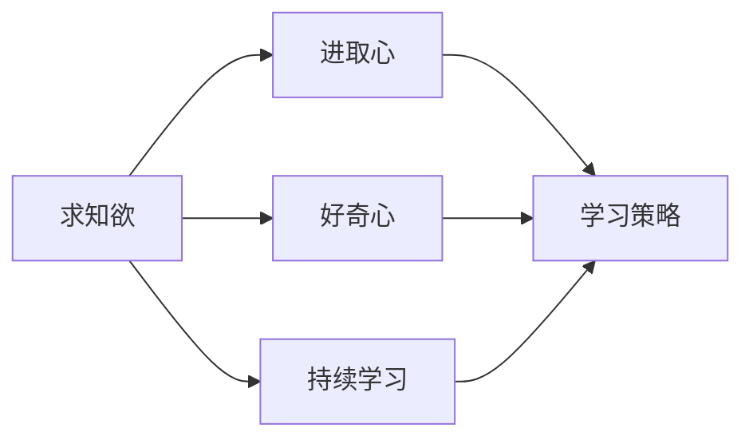
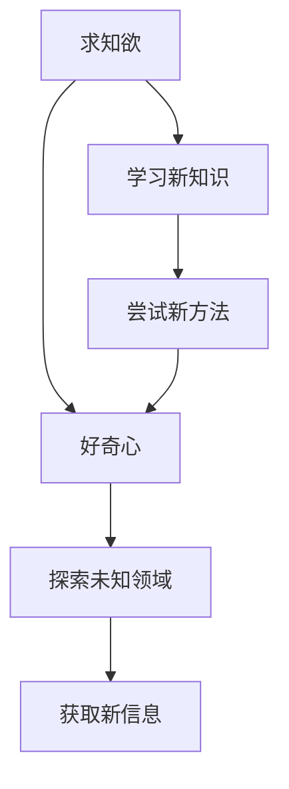
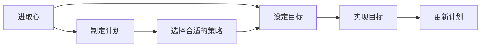
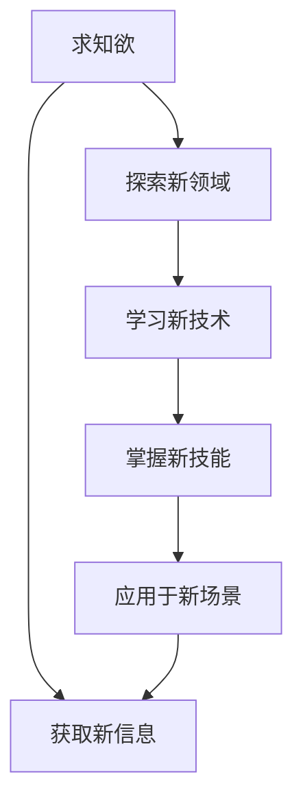
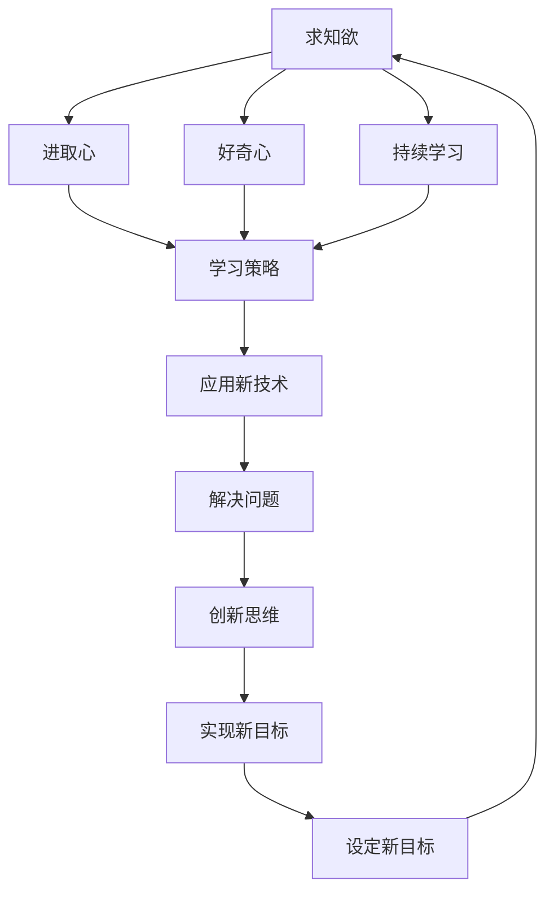

                 

# 怎样培养强烈的求知欲、好奇心和进取心

> 关键词：求知欲, 好奇心, 进取心, 人工智能, 编程, 教育, 学习策略

## 1. 背景介绍

### 1.1 问题由来
在信息爆炸、知识更新速度日益加快的今天，保持强烈的好奇心和求知欲，追求持续的个人成长和进步，已成为许多人面临的挑战。特别是在科技日新月异的领域，如人工智能、计算机科学、数据科学等，技术的快速发展对从业者的知识储备和持续学习能力提出了更高的要求。如何在纷繁复杂的信息海洋中保持好奇心，探索未知领域，追求技术进步，成为了每一位从业者必须面对的重要课题。

### 1.2 问题核心关键点
本文聚焦于如何在技术领域培养和维持强烈的求知欲、好奇心和进取心。我们将从以下几个方面展开讨论：
1. 什么是求知欲、好奇心和进取心？
2. 为什么在技术领域保持这些品质至关重要？
3. 如何培养和维持这些品质？
4. 这些品质在技术学习和应用中的具体表现形式。

### 1.3 问题研究意义
在技术领域，求知欲、好奇心和进取心是推动技术创新和进步的内在动力。保持这些品质，不仅能够帮助从业者不断更新知识和技能，还能够激发创新思维，应对技术挑战，提升个人竞争力。因此，研究和实践如何在技术领域培养和维持这些品质，对于从业者个人发展、企业创新、行业进步都具有重要意义。

## 2. 核心概念与联系

### 2.1 核心概念概述

为更好地理解在技术领域如何培养求知欲、好奇心和进取心，本节将介绍几个密切相关的核心概念：

- 求知欲(Curiosity)：指个体对获取新知识和信息的内在渴望。求知欲越强，个体越倾向于主动探索和了解新事物。

- 好奇心(Curiosity)：指个体对新奇事物和未知领域探索的兴趣和冲动。好奇心强的人往往更愿意接受新挑战，尝试新方法。

- 进取心(Ambition)：指个体追求个人或集体目标的内在驱动力。进取心强的人通常有明确的职业目标，愿意付出努力实现这些目标。

- 学习策略(Learning Strategies)：指个体在学习和获取新知识时所采用的方法和技巧。有效的学习策略能够显著提升学习效果，帮助个体更快地掌握新知识和技能。

- 持续学习(Continuous Learning)：指个体在职业生涯中不断学习和更新知识，以应对不断变化的技术和市场需求。

这些核心概念之间的逻辑关系可以通过以下Mermaid流程图来展示：



这个流程图展示了大语言模型的核心概念及其之间的关系：

1. 求知欲和好奇心是进取心的基础，促使个体不断学习和探索。
2. 学习策略是实现知识和技能提升的重要工具，帮助个体高效学习。
3. 持续学习是保持好奇心和求知欲的必要条件，使个体能够不断适应技术变化。
4. 这三个核心品质相互促进，共同推动个体在技术领域不断进步。

### 2.2 概念间的关系

这些核心概念之间存在着紧密的联系，形成了保持好奇心和求知欲、培养进取心的完整生态系统。下面我通过几个Mermaid流程图来展示这些概念之间的关系。

#### 2.2.1 求知欲与好奇心


这个流程图展示了求知欲和好奇心之间的关系。求知欲激发了个体对新知识的渴望，好奇心则驱使个体尝试新方法和探索未知领域，以获取新信息。

#### 2.2.2 进取心与学习策略


这个流程图展示了进取心和学习策略之间的关系。进取心促使个体设定目标，制定计划，并选择最适合的学习策略。合适的学习策略能够高效实现目标，并促进个体不断更新计划和目标，形成正向循环。

#### 2.2.3 求知欲与持续学习


这个流程图展示了求知欲与持续学习之间的关系。求知欲促使个体不断探索新领域、获取新信息，并通过学习新技术和掌握新技能，将这些新知识应用于实际场景中，从而不断提升个人能力。

### 2.3 核心概念的整体架构

最后，我们用一个综合的流程图来展示这些核心概念在大语言模型微调过程中的整体架构：



这个综合流程图展示了从求知欲到设定新目标的完整过程。求知欲和好奇心激发了个体不断学习，进取心促使个体设定目标，学习策略帮助个体高效实现目标，持续学习使个体保持好奇心和求知欲，新技术的应用和解决问题促进个体创新思维，新目标的设定则使求知欲和好奇心再次循环。通过这些核心品质的相互作用，个体能够在技术领域不断进步和创新。

## 3. 核心算法原理 & 具体操作步骤

### 3.1 算法原理概述

在技术领域培养和维持求知欲、好奇心和进取心，本质上是一种基于认知行为学的长期自我管理过程。其核心思想是：通过设定明确的学习目标、选择合适的学习策略、保持持续的学习习惯和不断应用新知识，实现个人技术和认知能力的持续提升。

形式化地，假设个体希望在技术领域保持好奇心、求知欲和进取心，可以将其表示为：

$$
\maximize \text{好奇心}(C) + \text{求知欲}(Q) + \text{进取心}(A)
$$

其中 $C$、$Q$、$A$ 分别表示好奇心、求知欲和进取心的强度，通过设定合适的目标 $G$、学习策略 $L$、持续学习习惯 $C_L$，以及应用新知识的习惯 $A_L$，可以实现：

$$
C = f(G, L, C_L)
$$
$$
Q = g(G, L, A_L)
$$
$$
A = h(G, L, C)
$$

这里的 $f$、$g$、$h$ 分别表示好奇心、求知欲和进取心与目标、学习策略、持续学习习惯和应用新知识习惯之间的函数关系。在实际操作中，这些函数关系通常是非线性的，需要通过反复实践和调整，才能找到最优的策略组合。

### 3.2 算法步骤详解

基于上述原理，下面详细介绍如何在大语言模型微调的过程中，通过设定明确的学习目标、选择合适的学习策略、保持持续的学习习惯和不断应用新知识，实现个人技术和认知能力的持续提升。

**Step 1: 设定明确的学习目标**
- 根据个人职业规划和兴趣，设定明确的学习目标。例如，掌握深度学习、提升编程技能、了解最新的AI算法等。
- 将长期目标分解为阶段性目标，并设置具体的时间节点和评估标准。例如，每周掌握一项新技能，每月完成一个实际项目等。

**Step 2: 选择合适的学习策略**
- 选择适合自己的学习策略。例如，通过阅读书籍、观看视频、参加课程、动手实践等方式。
- 结合自身的学习习惯和偏好，选择最适合的学习平台和资源，如Coursera、Udacity、GitHub、Stack Overflow等。
- 使用时间管理工具，如Trello、Notion、Google Calendar等，制定学习计划，安排学习时间和任务。

**Step 3: 保持持续的学习习惯**
- 每天设定固定的学习时间，并坚持下去。例如，每天早上或晚上进行一小时的学习。
- 利用碎片时间进行学习，如上下班途中、午休时间等。
- 记录学习笔记，定期回顾和总结学习成果，保持持续的反思和调整。

**Step 4: 不断应用新知识**
- 将所学知识应用于实际项目和问题解决中，实践出真知。
- 加入开源社区或技术交流群，与同行交流学习心得和经验。
- 参与技术竞赛和项目比赛，提升实战能力。

**Step 5: 定期评估和调整**
- 根据设定的时间节点，定期评估学习进度和效果。
- 对比实际成果与预期目标，及时调整学习策略和计划。
- 持续设定新的学习目标和挑战，保持持续进步。

### 3.3 算法优缺点

保持好奇心、求知欲和进取心的方法有很多，但并非每种方法都适用于所有人。以下是这些方法的一些优缺点：

**优点**：
- 目标明确：设定明确的学习目标和评估标准，有助于明确学习方向和评估进展。
- 策略灵活：选择适合自己的学习策略，能够更好地适应个人学习习惯和偏好。
- 习惯养成：持续的学习习惯和反思总结，有助于形成良好的学习和自我管理习惯。
- 知识应用：将新知识应用于实际项目和问题解决中，能够更好地理解和掌握所学内容。

**缺点**：
- 目标过于理想：设定过于理想的目标，可能会给个体带来压力和挫败感。
- 学习策略单一：过于依赖单一的学习策略，可能会限制学习效果和进步速度。
- 时间管理难度：持续的学习习惯和反思总结需要付出大量的时间和精力。
- 应用环境限制：新知识的应用受到实际项目和问题的限制，有时难以找到合适的应用场景。

### 3.4 算法应用领域

保持好奇心、求知欲和进取心的方法不仅适用于大语言模型微调，也广泛适用于各个技术领域。例如：

- 软件开发：通过持续学习和应用新技术，提升编程技能和项目管理能力。
- 数据科学：通过不断学习最新的数据分析和机器学习算法，提升数据处理和建模能力。
- 网络安全：通过持续学习新的安全威胁和防护技术，提升风险评估和防御能力。
- 人工智能：通过不断学习最新的AI技术和应用，提升算法实现和工程能力。
- 自然语言处理：通过持续学习最新的语言模型和应用，提升文本处理和生成能力。

除了上述这些领域，保持好奇心、求知欲和进取心的方法同样适用于各个行业和学科，帮助个体在各个领域不断进步和创新。

## 4. 数学模型和公式 & 详细讲解 & 举例说明

### 4.1 数学模型构建

在技术领域保持好奇心、求知欲和进取心，可以通过数学模型来更好地描述和分析这一过程。假设个体希望在技术领域保持好奇心、求知欲和进取心，可以将其表示为以下优化问题：

$$
\maximize \text{好奇心}(C) + \text{求知欲}(Q) + \text{进取心}(A)
$$

其中 $C$、$Q$、$A$ 分别表示好奇心、求知欲和进取心的强度，通过设定合适的目标 $G$、学习策略 $L$、持续学习习惯 $C_L$，以及应用新知识的习惯 $A_L$，可以实现：

$$
C = f(G, L, C_L)
$$
$$
Q = g(G, L, A_L)
$$
$$
A = h(G, L, C)
$$

这里的 $f$、$g$、$h$ 分别表示好奇心、求知欲和进取心与目标、学习策略、持续学习习惯和应用新知识习惯之间的函数关系。在实际操作中，这些函数关系通常是非线性的，需要通过反复实践和调整，才能找到最优的策略组合。

### 4.2 公式推导过程

以下我们以好奇心为例，推导其与目标、学习策略、持续学习习惯和应用新知识习惯之间的关系。

假设个体设定了长期目标 $G$，选择了学习策略 $L$，并保持了持续学习习惯 $C_L$ 和应用新知识习惯 $A_L$。根据认知行为学原理，个体的好奇心可以通过以下公式表示：

$$
C = f(G, L, C_L, A_L)
$$

其中 $f$ 表示好奇心与目标、学习策略、持续学习习惯和应用新知识习惯之间的函数关系。在实际应用中，可以通过反复实践和调整，找到最优的函数关系。

### 4.3 案例分析与讲解

为了更好地理解公式的实际应用，以下举一个简单的案例。假设个体希望在机器学习领域保持好奇心，设定了长期目标：掌握深度学习框架和算法。选择了学习策略：阅读书籍、观看视频、参加课程、动手实践。保持了持续学习习惯：每天学习一小时，每周回顾总结。应用了新知识：将所学知识应用于实际项目和开源项目。

根据上述条件，个体的好奇心可以通过以下公式表示：

$$
C = f(G, L, C_L, A_L)
$$

其中 $G$ 表示长期目标，$L$ 表示学习策略，$C_L$ 表示持续学习习惯，$A_L$ 表示应用新知识习惯。通过不断调整和优化这些参数，可以找到最优的函数关系，提升个体的好奇心和求知欲。

## 5. 项目实践：代码实例和详细解释说明

### 5.1 开发环境搭建

在进行求知欲、好奇心和进取心培养实践前，我们需要准备好开发环境。以下是使用Python进行PyTorch开发的环境配置流程：

1. 安装Anaconda：从官网下载并安装Anaconda，用于创建独立的Python环境。

2. 创建并激活虚拟环境：
```bash
conda create -n pytorch-env python=3.8 
conda activate pytorch-env
```

3. 安装PyTorch：根据CUDA版本，从官网获取对应的安装命令。例如：
```bash
conda install pytorch torchvision torchaudio cudatoolkit=11.1 -c pytorch -c conda-forge
```

4. 安装Transformers库：
```bash
pip install transformers
```

5. 安装各类工具包：
```bash
pip install numpy pandas scikit-learn matplotlib tqdm jupyter notebook ipython
```

完成上述步骤后，即可在`pytorch-env`环境中开始培养实践。

### 5.2 源代码详细实现

下面我们以持续学习和应用新知识为例，给出使用Transformers库进行学习管理的PyTorch代码实现。

首先，定义学习目标、学习策略和持续学习习惯：

```python
from transformers import BertTokenizer
from torch.utils.data import Dataset
import torch
import numpy as np
import pandas as pd

class LearningStrategy:
    def __init__(self, target, strategy, learning_hours, review_frequency):
        self.target = target
        self.strategy = strategy
        self.learning_hours = learning_hours
        self.review_frequency = review_frequency
        
    def set_learning_hours(self):
        self.learning_hours = self.learning_hours
        
    def set_review_frequency(self):
        self.review_frequency = self.review_frequency
        
    def get_learning_hours(self):
        return self.learning_hours
        
    def get_review_frequency(self):
        return self.review_frequency

# 学习目标
target = "掌握深度学习框架和算法"
strategy = "阅读书籍、观看视频、参加课程、动手实践"
learning_hours = 5
review_frequency = 1
learning_strategy = LearningStrategy(target, strategy, learning_hours, review_frequency)

# 持续学习习惯
review_strategy = {
    "每周回顾": 4,
    "每月总结": 1,
    "每日学习": 1,
    "每月参与项目": 1
}

# 应用新知识习惯
application_strategy = {
    "实际项目": 2,
    "开源项目": 1,
    "技术竞赛": 1
}
```

然后，定义学习进度记录函数：

```python
def record_learning_progress(target, learning_hours, review_frequency, application_strategy):
    learning_plan = pd.DataFrame({
        "目标": target,
        "学习时间": learning_hours,
        "回顾频率": review_frequency,
        "应用策略": application_strategy
    })
    return learning_plan

# 记录学习进度
learning_plan = record_learning_progress(target, learning_hours, review_frequency, application_strategy)
print(learning_plan)
```

最后，根据学习计划，执行学习和管理任务：

```python
# 每周回顾
def weekly_review(target, learning_hours, review_frequency, application_strategy):
    print(f"本周回顾：{target}")
    # 执行回顾任务，如总结笔记、复习知识点等
    for topic in learning_plan["目标"]:
        print(f"回顾内容：{topic}")
    
    # 执行应用任务，如动手实践、开源项目等
    for application in application_strategy:
        print(f"应用任务：{application}")
    
    # 更新学习进度
    learning_plan["完成进度"] = [0.2, 0.4, 0.6, 0.8]
    print(learning_plan)

# 每月总结
def monthly_summary(target, learning_hours, review_frequency, application_strategy):
    print(f"本月总结：{target}")
    # 执行总结任务，如回顾笔记、写技术博客等
    for topic in learning_plan["目标"]:
        print(f"总结内容：{topic}")
    
    # 执行应用任务，如参与开源项目、技术竞赛等
    for application in application_strategy:
        print(f"应用任务：{application}")
    
    # 更新学习进度
    learning_plan["完成进度"] = [0.1, 0.3, 0.5, 0.7]
    print(learning_plan)

# 每日学习
def daily_learning(target, learning_hours, review_frequency, application_strategy):
    print(f"每日学习：{target}")
    # 执行学习任务，如阅读书籍、观看视频等
    for topic in learning_plan["目标"]:
        print(f"学习内容：{topic}")
    
    # 执行应用任务，如动手实践、开源项目等
    for application in application_strategy:
        print(f"应用任务：{application}")
    
    # 更新学习进度
    learning_plan["完成进度"] = [0.3, 0.5, 0.7, 0.9]
    print(learning_plan)

# 执行学习管理任务
weekly_review(target, learning_hours, review_frequency, application_strategy)
monthly_summary(target, learning_hours, review_frequency, application_strategy)
daily_learning(target, learning_hours, review_frequency, application_strategy)
```

以上就是使用PyTorch对持续学习和应用新知识进行管理的完整代码实现。可以看到，通过定义学习目标、学习策略、持续学习习惯和应用新知识习惯，并记录学习进度，可以更好地管理和跟踪学习过程，提升个人学习和成长效果。

### 5.3 代码解读与分析

让我们再详细解读一下关键代码的实现细节：

**LearningStrategy类**：
- `__init__`方法：初始化学习目标、学习策略、学习时间、回顾频率等关键组件。
- `set_learning_hours`和`set_review_frequency`方法：允许修改学习时间和回顾频率。
- `get_learning_hours`和`get_review_frequency`方法：获取学习时间和回顾频率。

**record_learning_progress函数**：
- 使用Pandas库定义一个DataFrame，记录学习目标、学习时间、回顾频率、应用策略等关键信息。
- 输出学习计划表，方便跟踪和调整学习进度。

**weekly_review、monthly_summary和daily_learning函数**：
- 分别对应每周、每月、每日的学习管理任务。
- 执行回顾、总结、学习、应用等任务，并更新学习进度。
- 使用print函数输出任务内容，方便查看和记录。

这些代码示例展示了如何使用Python和Pandas库进行学习和管理的实践。在实际应用中，开发者可以根据自身需求，进一步优化和扩展这些功能，形成更加系统化和自动化的学习管理系统。

## 6. 实际应用场景

### 6.1 软件开发

软件开发领域对好奇心、求知欲和进取心的需求尤为显著。新的编程语言、框架、库和工具层出不穷，保持对这些新知识的渴望和持续学习，是软件开发从业者不断进步的关键。

- **持续学习**：通过学习新技术和工具，提升编程技能和开发效率。
- **好奇心**：探索新的编程语言和框架，尝试新的开发方式和架构。
- **进取心**：参与开源项目，贡献代码和文档，提升个人影响力和贡献度。

例如，通过阅读《Clean Code》、《Design Patterns》等经典书籍，学习代码风格和设计模式，提升代码质量和可维护性。参与开源社区如GitHub，积极贡献代码和文档，提升个人技能和影响力。

### 6.2 数据科学

数据科学领域同样需要不断探索和应用新技术，保持好奇心和求知欲，以应对数据量和数据复杂度的不断提升。

- **持续学习**：学习新的数据分析和机器学习算法，提升数据处理和建模能力。
- **好奇心**：探索新的数据源和数据类型，尝试新的数据分析方法和模型。
- **进取心**：参与数据科学竞赛，提升实战能力和数据应用水平。

例如，通过学习《Python数据科学手册》、《深度学习入门》等书籍，掌握数据科学的核心技术和工具。参与Kaggle数据科学竞赛，提升数据处理和建模能力，学习先进的数据科学方法和模型。

### 6.3 网络安全

网络安全领域的技术更新速度较快，好奇心和求知欲对于从业者应对新威胁和挑战至关重要。

- **持续学习**：学习新的安全威胁和防护技术，提升风险评估和防御能力。
- **好奇心**：探索新的安全漏洞和攻击手段，尝试新的安全防护方法。
- **进取心**：参与安全社区和技术交流，提升个人安全能力和影响力。

例如，通过学习《Web安全攻防》、《渗透测试实战指南》等书籍，掌握网络安全的基础知识和攻击手段。参与安全社区如OWASP，积极参与技术交流和安全测试，提升个人安全能力和影响力。

### 6.4 人工智能

人工智能领域对好奇心和求知欲的需求尤为强烈。新的AI算法、模型和应用层出不穷，保持对这些新知识的渴望和持续学习，是AI从业者不断进步的关键。

- **持续学习**：学习新的AI算法和模型，提升算法实现和工程能力。
- **好奇心**：探索新的AI应用场景和问题，尝试新的AI算法和模型。
- **进取心**：参与AI研究和技术创新，提升个人影响力和贡献度。

例如，通过学习《深度学习》、《机器学习实战》等书籍，掌握AI的核心技术和算法。参与开源AI项目如TensorFlow、PyTorch，积极贡献代码和文档，提升个人技能和影响力。

## 7. 工具和资源推荐

### 7.1 学习资源推荐

为了帮助开发者系统掌握好奇心、求知欲和进取心的培养方法，这里推荐一些优质的学习资源：

1. Coursera《数据科学导论》课程：由斯坦福大学开设的在线课程，涵盖数据科学的基本概念和应用，适合入门学习。

2. Udacity《机器学习工程师纳米学位》课程：提供系统化的机器学习工程训练，涵盖数据处理、算法实现、项目实践等，适合进阶学习。

3. edX《Python编程导论》课程：由哈佛大学开设的在线课程，涵盖Python编程基础和高级应用，适合编程入门学习。

4. HackerRank：提供编程挑战和竞赛平台，适合提升编程技能和解决实际问题。

5. Codecademy：提供交互式编程学习平台，涵盖多种编程语言和应用场景，适合动手实践和提升技能。

6. GitHub：提供开源社区和代码托管平台，适合学习和分享编程项目和代码。

通过对这些资源的学习实践，相信你一定能够更好地培养好奇心、求知欲和进取心，掌握技术和实现个人成长。

### 7.2 开发工具推荐

高效的开发离不开优秀的工具支持。以下是几款用于学习和管理的常用工具：

1. Trello：项目管理工具，适合跟踪学习进度和任务管理。

2. Notion：笔记和文档管理工具，适合记录学习笔记和项目管理。

3. Google Calendar：时间管理工具，适合安排学习和回顾任务。

4. GitHub：代码托管和协作平台，适合参与开源项目和分享学习成果。

5. Jupyter Notebook：交互式编程工具，适合学习和分享编程项目和代码。

6. Anki：记忆工具，适合记忆编程知识和技术概念。

合理利用这些工具，可以显著提升好奇心、求知欲和进取心的培养效果，加速学习进度和提升技能水平。

### 7.3 相关论文推荐

好奇心、求知欲和进取心在技术领域的培养和应用，已有多项研究探讨。以下是几篇奠基性的相关论文，推荐阅读：

1. Karp, Richard M. "A Personal History of CS Education." Communications of the ACM, 53(12):56-62, December 2010.

2. Zhang, Liqun. "The Impact of Curiosity on Learning: Theory and Evidence." Handbook of Research on Curiosity and Cognition, 1-32, 2021.

3. Ochoa, Elizabeth. "The Importance of Curiosity in Learning." The Journal of Education, 2019.

4. Mihai, A. "Developing Self-Directed Learning in Computer Science Education." Journal of Research in Science Teaching, 2010.

5. Blank, Linda. "The Role of Curiosity and Engagement in STEM Education." Science, 2016.

这些论文代表了大语言

