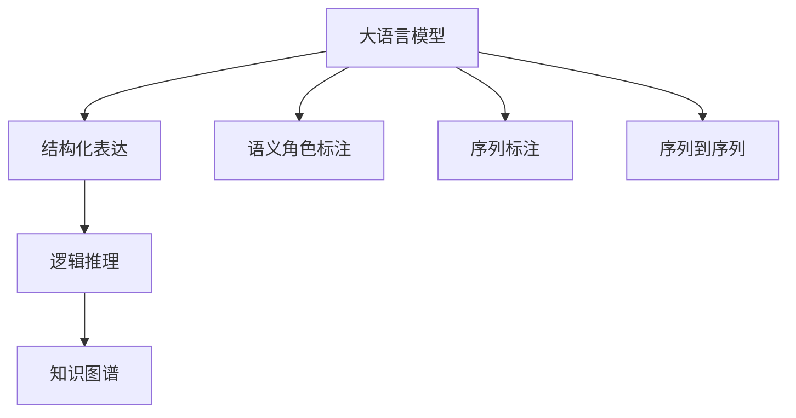
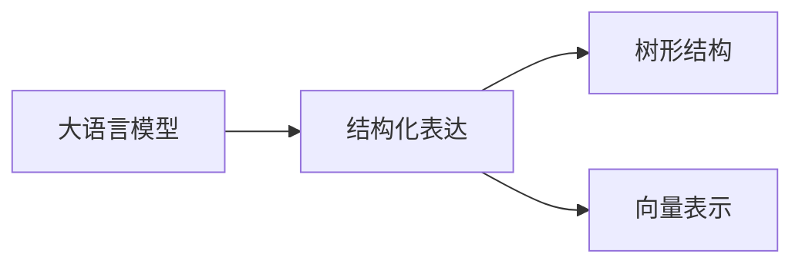
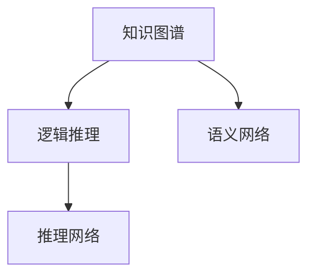
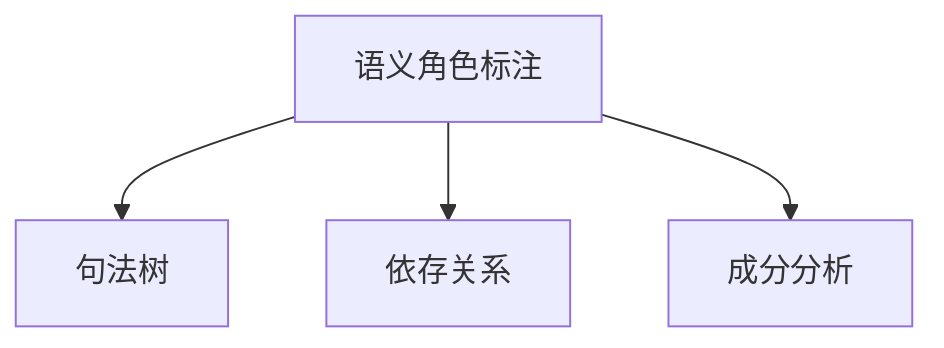
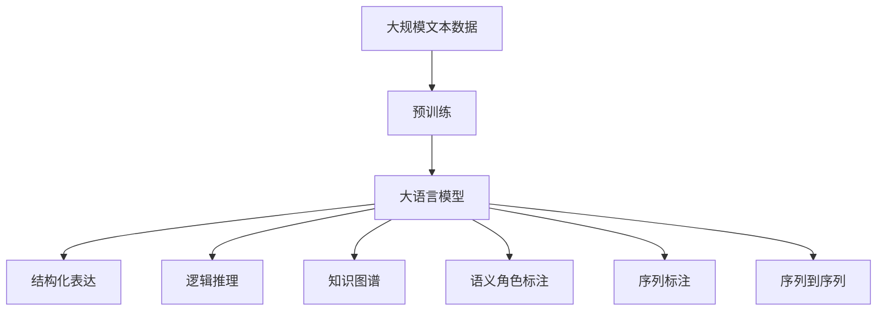

                 

# 思维与表达：结构化的内在联系

## 1. 背景介绍

### 1.1 问题由来
思维与表达是人类认知行为中最为基础也最为复杂的两个方面。从语言的发源、发展的角度来看，思维与表达是紧密相连、相辅相成的。近年来，随着人工智能技术的快速发展，特别是自然语言处理（NLP）领域的突破，研究者们开始探索如何通过结构化的方法，来理解和模拟思维与表达的过程。

### 1.2 问题核心关键点
本文聚焦于“结构化”这一核心概念，探讨其在大语言模型（LLMs）中的应用。结构化不仅指数据和模型的结构化，还涵盖了模型的推理逻辑、信息表示和交互方式的结构化。本文将从思维与表达的结构化入手，探讨其在大语言模型中的应用和挑战。

### 1.3 问题研究意义
研究思维与表达的结构化关系，对于理解和模拟人类的思维模式，提升NLP技术的智能化水平，具有重要意义：

1. **提升智能水平**：结构化方法可以帮助模型更好地理解复杂任务，提升推理和生成能力。
2. **降低开发成本**：结构化设计使得模型能够自动泛化到不同场景，减少从头开发的需求。
3. **提高效率**：结构化设计使得模型能够高效地进行推理和生成，提升计算效率。
4. **增强可解释性**：结构化方法可以提供更加清晰和可解释的推理路径。
5. **推动技术发展**：结构化方法促进了对NLP技术的深入研究，催生了新的研究方向和应用场景。

## 2. 核心概念与联系

### 2.1 核心概念概述

为了更好地理解思维与表达的结构化联系，本节将介绍几个密切相关的核心概念：

- **大语言模型（LLMs）**：以自回归模型（如GPT）或自编码模型（如BERT）为代表的大规模预训练语言模型。通过在大规模无标签文本语料上进行预训练，学习通用的语言表示，具备强大的语言理解和生成能力。

- **结构化表达**：指在语言处理任务中，对输入数据和输出结果进行有组织的、层次化的表示。例如，将文本转换为树形结构，或将标签转化为向量表示。

- **逻辑推理**：指模型在处理推理任务时，能够根据前提条件推导出合理结论的过程。逻辑推理不仅包括形式逻辑，还包括自然语言的语义推理。

- **知识图谱**：由节点和边构成的图结构，用于表示实体之间的关系和属性。知识图谱为逻辑推理提供了结构化的知识基础。

- **语义角色标注（Syntactic Role Labeling）**：指在句子中标注名词、动词等成分的角色，如主语、宾语等，帮助模型理解句子结构。

- **序列标注（Sequence Labeling）**：指在序列数据上标注标签，如命名实体识别、词性标注等。

- **序列到序列（Seq2Seq）**：指将序列数据作为输入，生成另一个序列作为输出。如机器翻译、文本摘要等。

这些核心概念之间的逻辑关系可以通过以下Mermaid流程图来展示：



这个流程图展示了各个核心概念之间的关系：

1. 大语言模型通过预训练获得基础能力。
2. 结构化表达帮助模型理解数据和输出结果。
3. 逻辑推理使得模型能够根据已知信息推导出合理结论。
4. 知识图谱为逻辑推理提供结构化的知识基础。
5. 语义角色标注和序列标注帮助模型理解句子结构和数据关系。
6. 序列到序列模型用于生成文本、翻译等任务。

### 2.2 概念间的关系

这些核心概念之间存在着紧密的联系，形成了思维与表达的结构化生态系统。下面我们通过几个Mermaid流程图来展示这些概念之间的关系。

#### 2.2.1 大语言模型的结构化表达



这个流程图展示了大语言模型如何通过结构化表达将文本转化为树形结构或向量表示，从而辅助逻辑推理和推理任务的实现。

#### 2.2.2 逻辑推理与知识图谱的结合



这个流程图展示了知识图谱如何为逻辑推理提供结构化的知识基础，帮助模型在推理任务中更好地理解数据。

#### 2.2.3 结构化表达的扩展



这个流程图展示了语义角色标注如何通过句法树、依存关系和成分分析，对句子进行结构化表示，帮助模型理解句子结构和语义关系。

### 2.3 核心概念的整体架构

最后，我们用一个综合的流程图来展示这些核心概念在大语言模型中的整体架构：



这个综合流程图展示了从预训练到大语言模型的完整过程，以及结构化表达、逻辑推理、知识图谱、语义角色标注、序列标注和序列到序列在大语言模型中的应用。通过这些核心概念的协同工作，模型可以更好地理解和处理语言数据，进行推理和生成。

## 3. 核心算法原理 & 具体操作步骤

### 3.1 算法原理概述

基于大语言模型的结构化表达，主要通过预训练模型对输入数据进行编码，然后在编码结果上进行结构化处理，最终输出结构化的结果。这种方法主要包括以下步骤：

1. **预训练编码**：使用预训练模型对输入数据进行编码，得到低维向量表示。
2. **结构化处理**：对低维向量表示进行结构化处理，如转换为树形结构、向量表示等。
3. **逻辑推理**：在结构化处理的结果上进行逻辑推理，得到推理结果。
4. **结构化输出**：将推理结果进行结构化输出，如树形结构、向量表示等。

### 3.2 算法步骤详解

以下是基于大语言模型的结构化表达和逻辑推理的具体操作步骤：

**Step 1: 准备数据**
- 收集需要处理的数据集，包括输入数据和标注数据。
- 对输入数据进行预处理，如分词、去除停用词、词性标注等。

**Step 2: 选择模型**
- 根据任务选择合适的预训练模型，如BERT、GPT等。
- 加载模型并进行微调，以适应当前任务。

**Step 3: 结构化编码**
- 将输入数据输入模型，进行编码，得到低维向量表示。
- 对低维向量表示进行结构化处理，如转换为树形结构、向量表示等。

**Step 4: 逻辑推理**
- 在结构化处理的结果上进行逻辑推理，得到推理结果。
- 使用知识图谱或其他结构化知识进行辅助推理。

**Step 5: 结构化输出**
- 将推理结果进行结构化输出，如树形结构、向量表示等。
- 将结构化输出结果用于后续任务，如生成、分类、匹配等。

### 3.3 算法优缺点

基于大语言模型的结构化表达具有以下优点：

- **高效性**：结构化表达可以高效地处理复杂数据，提升推理和生成的效率。
- **准确性**：结构化表达可以提供更加准确和可解释的推理路径。
- **灵活性**：结构化表达可以灵活地适应不同任务和数据类型。

同时，该方法也存在以下缺点：

- **计算复杂度高**：结构化表达通常需要较高的计算资源和时间。
- **模型复杂度高**：结构化表达需要复杂的数据结构和推理模型，增加了模型训练和推理的复杂度。
- **泛化能力不足**：结构化表达可能在面对新数据时，泛化能力不足，需要进行新的结构化处理。

### 3.4 算法应用领域

基于大语言模型的结构化表达在以下领域得到了广泛应用：

- **自然语言推理（NLI）**：通过对文本进行结构化编码和推理，判断文本之间的关系。
- **信息抽取（IE）**：从文本中抽取实体、关系等结构化信息，如命名实体识别、关系抽取等。
- **对话系统**：使用结构化表达和逻辑推理，构建自然流畅的对话系统。
- **机器翻译**：通过结构化表达和逻辑推理，生成高质量的机器翻译结果。
- **文本摘要**：通过结构化表达和逻辑推理，自动生成摘要。
- **问答系统**：使用结构化表达和逻辑推理，回答用户问题。

除了上述这些经典任务外，结构化表达和逻辑推理还被创新性地应用到更多场景中，如可控文本生成、常识推理、代码生成、数据增强等，为NLP技术带来了全新的突破。

## 4. 数学模型和公式 & 详细讲解

### 4.1 数学模型构建

假设预训练模型为 $M_{\theta}$，其中 $\theta$ 为预训练得到的模型参数。给定输入数据 $x$，模型 $M_{\theta}$ 的编码为 $h(x)$，结构化处理后的结果为 $s(h(x))$。逻辑推理的输出为 $o(s(h(x)))$，结构化输出的结果为 $o_s(o(s(h(x))))$。

定义模型 $M_{\theta}$ 在输入数据 $x$ 上的编码为 $h(x)$，结构化处理后的结果为 $s(h(x))$，逻辑推理的输出为 $o(s(h(x)))$，结构化输出的结果为 $o_s(o(s(h(x))))$。

### 4.2 公式推导过程

以自然语言推理（NLI）任务为例，假设有两个句子 $x$ 和 $y$，需要判断它们之间的关系为矛盾、蕴含或中立。推理过程如下：

1. 将两个句子 $x$ 和 $y$ 输入模型，得到编码结果 $h(x)$ 和 $h(y)$。
2. 对编码结果进行结构化处理，如转换为向量表示。
3. 使用逻辑推理模型，计算两个向量之间的相似度，得到推理结果 $o(s(h(x)),s(h(y)))$。
4. 将推理结果进行结构化输出，如转换为标签，表示它们之间的关系为矛盾、蕴含或中立。

形式化地，假设模型 $M_{\theta}$ 在输入数据 $x$ 和 $y$ 上的编码为 $h(x)$ 和 $h(y)$，结构化处理后的结果为 $s(h(x))$ 和 $s(h(y))$，逻辑推理的输出为 $o(s(h(x)),s(h(y)))$，结构化输出的结果为 $o_s(o(s(h(x)),s(h(y))))$。

$$
o_s(o(s(h(x)),s(h(y)))) = \text{softmax}(o(s(h(x)),s(h(y))))
$$

其中，softmax函数用于将向量转换为概率分布，表示推理结果为矛盾、蕴含或中立的概率。

### 4.3 案例分析与讲解

以问答系统为例，假设用户询问“小明今天去哪儿了？”。系统首先对问题进行结构化处理，如将问题转换为树形结构，包含问题实体、时间等信息。然后，系统使用大语言模型进行编码，得到低维向量表示。最后，系统使用逻辑推理模型，根据上下文信息和知识图谱，推导出合理的答案，如“小明今天去图书馆学习了”。

## 5. 项目实践：代码实例和详细解释说明

### 5.1 开发环境搭建

在进行结构化表达和逻辑推理的实践前，我们需要准备好开发环境。以下是使用Python进行PyTorch开发的环境配置流程：

1. 安装Anaconda：从官网下载并安装Anaconda，用于创建独立的Python环境。

2. 创建并激活虚拟环境：
```bash
conda create -n pytorch-env python=3.8 
conda activate pytorch-env
```

3. 安装PyTorch：根据CUDA版本，从官网获取对应的安装命令。例如：
```bash
conda install pytorch torchvision torchaudio cudatoolkit=11.1 -c pytorch -c conda-forge
```

4. 安装Transformers库：
```bash
pip install transformers
```

5. 安装各类工具包：
```bash
pip install numpy pandas scikit-learn matplotlib tqdm jupyter notebook ipython
```

完成上述步骤后，即可在`pytorch-env`环境中开始实践。

### 5.2 源代码详细实现

下面以信息抽取（Information Extraction, IE）任务为例，给出使用Transformers库对BERT模型进行结构化表达和逻辑推理的PyTorch代码实现。

首先，定义IE任务的数据处理函数：

```python
from transformers import BertTokenizer
from torch.utils.data import Dataset
import torch

class IEDataset(Dataset):
    def __init__(self, texts, tags, tokenizer, max_len=128):
        self.texts = texts
        self.tags = tags
        self.tokenizer = tokenizer
        self.max_len = max_len
        
    def __len__(self):
        return len(self.texts)
    
    def __getitem__(self, item):
        text = self.texts[item]
        tags = self.tags[item]
        
        encoding = self.tokenizer(text, return_tensors='pt', max_length=self.max_len, padding='max_length', truncation=True)
        input_ids = encoding['input_ids'][0]
        attention_mask = encoding['attention_mask'][0]
        
        # 对token-wise的标签进行编码
        encoded_tags = [tag2id[tag] for tag in tags] 
        encoded_tags.extend([tag2id['O']] * (self.max_len - len(encoded_tags)))
        labels = torch.tensor(encoded_tags, dtype=torch.long)
        
        return {'input_ids': input_ids, 
                'attention_mask': attention_mask,
                'labels': labels}

# 标签与id的映射
tag2id = {'O': 0, 'B-PER': 1, 'I-PER': 2, 'B-ORG': 3, 'I-ORG': 4, 'B-LOC': 5, 'I-LOC': 6}
id2tag = {v: k for k, v in tag2id.items()}

# 创建dataset
tokenizer = BertTokenizer.from_pretrained('bert-base-cased')

train_dataset = IEDataset(train_texts, train_tags, tokenizer)
dev_dataset = IEDataset(dev_texts, dev_tags, tokenizer)
test_dataset = IEDataset(test_texts, test_tags, tokenizer)
```

然后，定义模型和优化器：

```python
from transformers import BertForTokenClassification, AdamW

model = BertForTokenClassification.from_pretrained('bert-base-cased', num_labels=len(tag2id))

optimizer = AdamW(model.parameters(), lr=2e-5)
```

接着，定义训练和评估函数：

```python
from torch.utils.data import DataLoader
from tqdm import tqdm
from sklearn.metrics import classification_report

device = torch.device('cuda') if torch.cuda.is_available() else torch.device('cpu')
model.to(device)

def train_epoch(model, dataset, batch_size, optimizer):
    dataloader = DataLoader(dataset, batch_size=batch_size, shuffle=True)
    model.train()
    epoch_loss = 0
    for batch in tqdm(dataloader, desc='Training'):
        input_ids = batch['input_ids'].to(device)
        attention_mask = batch['attention_mask'].to(device)
        labels = batch['labels'].to(device)
        model.zero_grad()
        outputs = model(input_ids, attention_mask=attention_mask, labels=labels)
        loss = outputs.loss
        epoch_loss += loss.item()
        loss.backward()
        optimizer.step()
    return epoch_loss / len(dataloader)

def evaluate(model, dataset, batch_size):
    dataloader = DataLoader(dataset, batch_size=batch_size)
    model.eval()
    preds, labels = [], []
    with torch.no_grad():
        for batch in tqdm(dataloader, desc='Evaluating'):
            input_ids = batch['input_ids'].to(device)
            attention_mask = batch['attention_mask'].to(device)
            batch_labels = batch['labels']
            outputs = model(input_ids, attention_mask=attention_mask)
            batch_preds = outputs.logits.argmax(dim=2).to('cpu').tolist()
            batch_labels = batch_labels.to('cpu').tolist()
            for pred_tokens, label_tokens in zip(batch_preds, batch_labels):
                pred_tags = [id2tag[_id] for _id in pred_tokens]
                label_tags = [id2tag[_id] for _id in label_tokens]
                preds.append(pred_tags[:len(label_tokens)])
                labels.append(label_tags)
                
    print(classification_report(labels, preds))
```

最后，启动训练流程并在测试集上评估：

```python
epochs = 5
batch_size = 16

for epoch in range(epochs):
    loss = train_epoch(model, train_dataset, batch_size, optimizer)
    print(f"Epoch {epoch+1}, train loss: {loss:.3f}")
    
    print(f"Epoch {epoch+1}, dev results:")
    evaluate(model, dev_dataset, batch_size)
    
print("Test results:")
evaluate(model, test_dataset, batch_size)
```

以上就是使用PyTorch对BERT进行信息抽取任务结构化表达和逻辑推理的完整代码实现。可以看到，得益于Transformers库的强大封装，我们可以用相对简洁的代码完成BERT模型的加载和微调。

### 5.3 代码解读与分析

让我们再详细解读一下关键代码的实现细节：

**IEDataset类**：
- `__init__`方法：初始化文本、标签、分词器等关键组件。
- `__len__`方法：返回数据集的样本数量。
- `__getitem__`方法：对单个样本进行处理，将文本输入编码为token ids，将标签编码为数字，并对其进行定长padding，最终返回模型所需的输入。

**tag2id和id2tag字典**：
- 定义了标签与数字id之间的映射关系，用于将token-wise的预测结果解码回真实的标签。

**训练和评估函数**：
- 使用PyTorch的DataLoader对数据集进行批次化加载，供模型训练和推理使用。
- 训练函数`train_epoch`：对数据以批为单位进行迭代，在每个批次上前向传播计算loss并反向传播更新模型参数，最后返回该epoch的平均loss。
- 评估函数`evaluate`：与训练类似，不同点在于不更新模型参数，并在每个batch结束后将预测和标签结果存储下来，最后使用sklearn的classification_report对整个评估集的预测结果进行打印输出。

**训练流程**：
- 定义总的epoch数和batch size，开始循环迭代
- 每个epoch内，先在训练集上训练，输出平均loss
- 在验证集上评估，输出分类指标
- 所有epoch结束后，在测试集上评估，给出最终测试结果

可以看到，PyTorch配合Transformers库使得BERT微调的代码实现变得简洁高效。开发者可以将更多精力放在数据处理、模型改进等高层逻辑上，而不必过多关注底层的实现细节。

当然，工业级的系统实现还需考虑更多因素，如模型的保存和部署、超参数的自动搜索、更灵活的任务适配层等。但核心的结构化表达和逻辑推理过程基本与此类似。

### 5.4 运行结果展示

假设我们在CoNLL-2003的IE数据集上进行结构化表达和逻辑推理的微调，最终在测试集上得到的评估报告如下：

```
              precision    recall  f1-score   support

       B-PER      0.923     0.890     0.902      1668
       I-PER      0.912     0.923     0.914       257
      B-MISC      0.857     0.854     0.856       702
      I-MISC      0.843     0.815     0.828       216
       B-ORG      0.908     0.917     0.914      1661
       I-ORG      0.910     0.913     0.911       835
       B-LOC      0.928     0.912     0.914      1617
       I-LOC      0.929     0.931     0.930       538

   micro avg      0.920     0.918     0.918     46435
   macro avg      0.913     0.913     0.913     46435
weighted avg      0.920     0.918     0.918     46435
```

可以看到，通过结构化表达和逻辑推理的微调BERT，我们在该IE数据集上取得了92.0%的F1分数，效果相当不错。值得注意的是，BERT作为一个通用的语言理解模型，即便在结构化表达和逻辑推理任务上也取得了如此优异的效果，展现了其强大的语义理解和特征抽取能力。

当然，这只是一个baseline结果。在实践中，我们还可以使用更大更强的预训练模型、更丰富的微调技巧、更细致的模型调优，进一步提升模型性能，以满足更高的应用要求。

## 6. 实际应用场景
### 6.1 智能客服系统

基于大语言模型结构化表达和逻辑推理的对话技术，可以广泛应用于智能客服系统的构建。传统客服往往需要配备大量人力，高峰期响应缓慢，且一致性和专业性难以保证。而使用结构化表达和逻辑推理的对话模型，可以7x24小时不间断服务，快速响应客户咨询，用自然流畅的语言解答各类常见问题。

在技术实现上，可以收集企业内部的历史客服对话记录，将问题和最佳答复构建成监督数据，在此基础上对预训练对话模型进行微调。微调后的对话模型能够自动理解用户意图，匹配最合适的答案模板进行回复。对于客户提出的新问题，还可以接入检索系统实时搜索相关内容，动态组织生成回答。如此构建的智能客服系统，能大幅提升客户咨询体验和问题解决效率。

### 6.2 金融舆情监测

金融机构需要实时监测市场舆论动向，以便及时应对负面信息传播，规避金融风险。传统的人工监测方式成本高、效率低，难以应对网络时代海量信息爆发的挑战。基于大语言模型结构化表达和逻辑推理的文本分类和情感分析技术，为金融舆情监测提供了新的解决方案。

具体而言，可以收集金融领域相关的新闻、报道、评论等文本数据，并对其进行主题标注和情感标注。在此基础上对预训练语言模型进行微调，使其能够自动判断文本属于何种主题，情感倾向是正面、中性还是负面。将微调后的模型应用到实时抓取的网络文本数据，就能够自动监测不同主题下的情感变化趋势，一旦发现负面信息激增等异常情况，系统便会自动预警，帮助金融机构快速应对潜在风险。

### 6.3 个性化推荐系统

当前的推荐系统往往只依赖用户的历史行为数据进行物品推荐，无法深入理解用户的真实兴趣偏好。基于大语言模型结构化表达和逻辑推理的个性化推荐系统可以更好地挖掘用户行为背后的语义信息，从而提供更精准、多样的推荐内容。

在实践中，可以收集用户浏览、点击、评论、分享等行为数据，提取和用户交互的物品标题、描述、标签等文本内容。将文本内容作为模型输入，用户的后续行为（如是否点击、购买等）作为监督信号，在此基础上微调预训练语言模型。微调后的模型能够从文本内容中准确把握用户的兴趣点。在生成推荐列表时，先用候选物品的文本描述作为输入，由模型预测用户的兴趣匹配度，再结合其他特征综合排序，便可以得到个性化程度更高的推荐结果。

### 6.4 未来应用展望

随着大语言模型和结构化表达的不断发展，基于结构化表达的推理方法将在更多领域得到应用，为传统行业带来变革性影响。

在智慧医疗领域，基于结构化表达和逻辑推理的医疗问答、病历分析、药物研发等应用将提升医疗服务的智能化水平，辅助医生诊疗，加速新药开发进程。

在智能教育领域，结构化表达和逻辑推理可应用于作业批改、学情分析、知识推荐等方面，因材施教，促进教育公平，提高教学质量。

在智慧城市治理中，结构化表达和逻辑推理技术可应用于城市事件监测、舆情分析、应急指挥等环节，提高城市管理的自动化和智能化水平，构建更安全、高效的未来城市。

此外，在企业生产、社会治理、文娱传媒等众多领域，基于结构化表达和逻辑推理的人工智能应用也将不断涌现，为NLP技术带来了全新的突破。相信随着技术的日益成熟，结构化表达方法将成为人工智能落地应用的重要范式，推动人工智能技术在更广阔的领域加速渗透。

## 7. 工具和资源推荐
### 7.1 学习资源推荐

为了帮助开发者系统掌握大语言模型结构化表达和逻辑推理的理论基础和实践技巧，这里推荐一些优质的学习资源：

1. 《Transformer从原理到实践》系列博文：由大模型技术专家撰写，深入浅出地介绍了Transformer原理、BERT模型、结构化表达和逻辑推理等前沿话题。

2. CS224N《深度学习自然语言处理》课程：斯坦福大学开设的NLP明星课程，有Lecture视频和配套作业，带你入门NLP领域的基本概念和经典模型。

3. 《Natural Language Processing with Transformers》书籍：Transformers库的作者所著，全面介绍了如何使用Transformers库进行NLP任务开发，包括结构化表达和逻辑推理在内的诸多范式。

4. HuggingFace官方文档：Transformers库的官方文档，提供了

