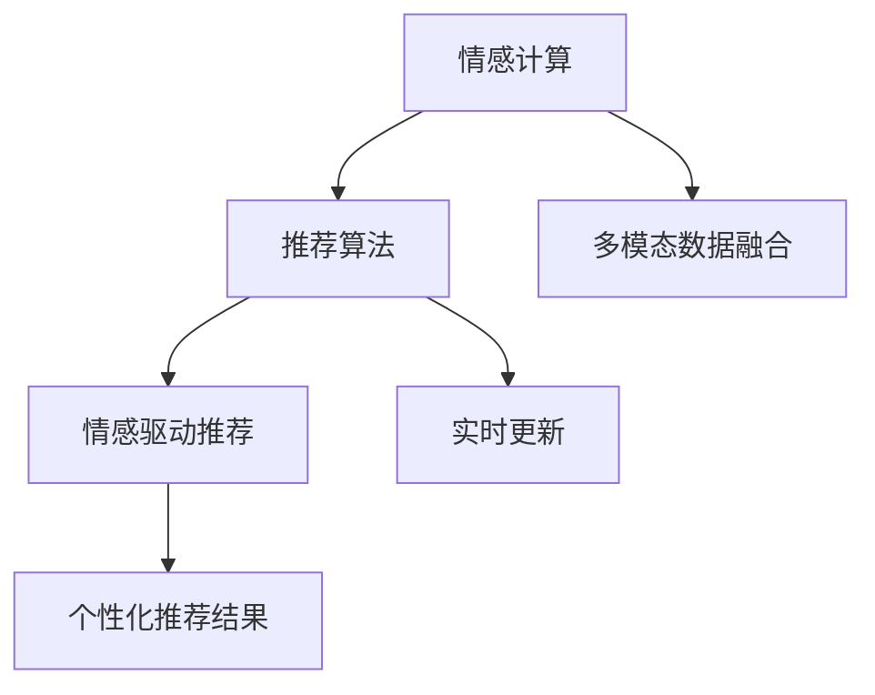

                 

# 情感驱动推荐系统：AI的优势

## 1. 背景介绍

推荐系统作为现代互联网应用的基石之一，对于提升用户体验、增加转化率有着重要作用。传统的推荐系统大多基于用户的历史行为数据（点击、浏览、购买等）进行推荐，难以捕捉用户的情感变化。而近年来兴起的情感驱动推荐系统，通过分析用户的情感状态（如喜怒哀乐、兴趣偏好等），进行更加个性化的推荐。这不仅提升了用户体验，也提高了推荐效果。

情感驱动推荐系统利用情感计算技术，能够从用户的言行中分析其情感状态，并结合推荐算法，实现精准的个性化推荐。其核心思想是：将用户的情感状态视为推荐系统的重要输入，通过分析情感与行为的关系，更加准确地预测用户需求。

## 2. 核心概念与联系

### 2.1 核心概念概述

- **情感计算**：通过文本分析、语音识别、图像识别等技术，从用户的言行中分析其情感状态。
- **推荐算法**：基于用户历史行为数据、兴趣模型、情感状态等信息，推荐用户可能感兴趣的产品或内容。
- **情感驱动推荐**：结合情感计算与推荐算法，以用户的情感状态为重要输入，进行个性化的推荐。
- **多模态数据融合**：将文本、语音、图像等多种数据源融合在一起，全面分析用户的情感状态。
- **实时更新**：根据用户实时言行，动态更新情感状态，实现动态推荐。

这些核心概念之间存在着紧密的联系。情感计算提供用户的情感状态，推荐算法结合历史行为和情感状态，进行个性化推荐，多模态数据融合则进一步提升情感分析的准确性，实时更新则保证推荐系统能够及时响应用户变化的需求。

### 2.2 概念间的关系

情感驱动推荐系统是一个复杂的系统，其核心概念之间关系紧密。以下是一个Mermaid流程图，展示了这些概念之间的逻辑关系：



这个流程图展示了情感驱动推荐系统的基本流程。首先，通过情感计算获取用户的情感状态，然后将情感状态与历史行为数据结合，输入到推荐算法中，得到个性化的推荐结果。同时，系统还需进行多模态数据融合和实时更新，以确保推荐的准确性和实时性。

## 3. 核心算法原理 & 具体操作步骤

### 3.1 算法原理概述

情感驱动推荐系统的核心算法包括情感分析、推荐算法和数据融合三个部分。

- **情感分析**：通过自然语言处理（NLP）技术，从用户评论、社交媒体等文本中提取情感状态。情感分析模型通常基于深度学习框架（如BERT、LSTM等），使用标注数据进行训练。
- **推荐算法**：基于用户历史行为数据和情感状态，使用协同过滤、矩阵分解、深度学习等方法进行推荐。其中，深度学习方法（如RNN、CNN、Transformer等）已经在推荐系统中得到了广泛应用。
- **数据融合**：将用户的多模态数据（如文本、图像、语音等）融合在一起，综合分析用户的情感状态。常用的融合方法包括加权平均、归一化、集成学习等。

### 3.2 算法步骤详解

情感驱动推荐系统的具体操作步骤如下：

1. **数据采集**：收集用户的文本、图像、语音等多模态数据。
2. **情感分析**：对文本数据进行情感分析，提取用户的情感状态。
3. **数据融合**：将多模态数据融合在一起，全面分析用户的情感状态。
4. **推荐模型训练**：基于用户历史行为数据和情感状态，训练推荐模型。
5. **实时推荐**：根据用户的实时言行，动态更新情感状态，进行实时推荐。

### 3.3 算法优缺点

情感驱动推荐系统相较于传统的基于行为数据的推荐系统，具有以下优点：

- **个性化推荐**：情感驱动推荐系统能够更好地捕捉用户的情感状态，进行更加个性化的推荐。
- **实时性**：通过实时更新用户的情感状态，情感驱动推荐系统可以更及时地响应用户需求变化。
- **用户体验**：情感驱动推荐系统能够提升用户体验，通过情感计算进行推荐，更加贴合用户的心理需求。

然而，情感驱动推荐系统也存在一些缺点：

- **数据采集难度**：情感数据（如语音、图像等）的采集比行为数据难度更大，增加了系统的实现复杂性。
- **隐私保护**：情感数据的采集和使用可能涉及用户的隐私，需要确保数据的合法性和安全性。
- **模型复杂性**：情感驱动推荐系统的模型较为复杂，需要处理多模态数据和情感状态，增加了系统的训练和推理难度。

### 3.4 算法应用领域

情感驱动推荐系统已经在多个领域得到了应用，主要包括：

- **电商推荐**：基于用户的购物评论、评分等文本数据，进行情感分析，提升推荐效果。
- **社交媒体**：分析用户的社交媒体发言，提取情感状态，进行内容推荐。
- **金融投资**：分析用户的情感状态，预测市场趋势，进行投资建议。
- **健康医疗**：通过分析患者的情感状态，进行心理辅导和治疗推荐。
- **旅游推荐**：根据用户的旅游评论，提取情感状态，推荐旅游目的地和活动。

除了上述领域，情感驱动推荐系统还在智能客服、内容创作、视频推荐等多个领域得到了应用，为人们的生活带来了便捷和乐趣。

## 4. 数学模型和公式 & 详细讲解  
### 4.1 数学模型构建

情感驱动推荐系统通常使用深度学习框架进行建模。以下是一个简单的情感驱动推荐系统的数学模型：

1. **情感分析模型**：使用BERT模型，将用户评论编码成向量表示。
2. **推荐模型**：基于用户历史行为数据和情感状态，使用深度学习模型进行推荐。
3. **数据融合模型**：将用户的多模态数据融合在一起，进行加权平均。

### 4.2 公式推导过程

以下是一个简单的情感驱动推荐系统的公式推导：

1. **情感分析**：使用BERT模型对用户评论进行编码，得到情感状态向量 $E$。
2. **推荐模型**：基于用户历史行为数据 $H$ 和情感状态向量 $E$，使用深度学习模型进行推荐，得到推荐向量 $R$。
3. **数据融合**：将用户的多模态数据 $D$ 进行加权平均，得到融合向量 $F$。
4. **推荐结果**：将推荐向量 $R$ 和融合向量 $F$ 进行拼接，输入到推荐模型中，得到最终的推荐结果 $Y$。

### 4.3 案例分析与讲解

以电商推荐为例，情感驱动推荐系统的实现流程如下：

1. **数据采集**：收集用户的购物评论、评分等文本数据。
2. **情感分析**：使用BERT模型对评论进行编码，提取用户的情感状态。
3. **数据融合**：将评论情感状态与用户的浏览行为数据融合在一起，得到融合向量 $F$。
4. **推荐模型训练**：基于历史行为数据和融合向量 $F$，训练推荐模型。
5. **实时推荐**：根据用户的实时评论和浏览行为，动态更新融合向量 $F$，进行实时推荐。

## 5. 项目实践：代码实例和详细解释说明

### 5.1 开发环境搭建

情感驱动推荐系统的开发需要以下环境：

- Python 3.x
- TensorFlow 2.x
- PyTorch 1.x
- scikit-learn 0.x

可以使用Anaconda或Miniconda创建虚拟环境，安装所需依赖包。

### 5.2 源代码详细实现

以下是一个简单的情感驱动推荐系统的PyTorch代码实现：

```python
import torch
import torch.nn as nn
from transformers import BertModel, BertTokenizer

class SentimentAnalysisModel(nn.Module):
    def __init__(self):
        super(SentimentAnalysisModel, self).__init__()
        self.bert = BertModel.from_pretrained('bert-base-cased')
        self.fc = nn.Linear(self.bert.config.hidden_size, 2)
    
    def forward(self, input_ids, attention_mask):
        outputs = self.bert(input_ids, attention_mask=attention_mask)
        pooled_output = outputs.pooler_output
        logits = self.fc(pooled_output)
        return logits

class RecommendationModel(nn.Module):
    def __init__(self, user_behavior_data, sentiment_analysis_model):
        super(RecommendationModel, self).__init__()
        self.user_behavior_data = user_behavior_data
        self.sentiment_analysis_model = sentiment_analysis_model
    
    def forward(self, user_id):
        user_data = self.user_behavior_data[user_id]
        sentiment = self.sentiment_analysis_model(user_data)
        return sentiment
    
class FusionModel(nn.Module):
    def __init__(self, user_data):
        super(FusionModel, self).__init__()
        self.user_data = user_data
    
    def forward(self, user_data):
        sentiment = self.sentiment_analysis_model(user_data)
        # 数据融合
        fusion_result = 0.5 * sentiment + 0.5 * user_data
        return fusion_result

# 数据准备
user_data = torch.tensor([1, 2, 3])
sentiment = torch.tensor([0.2, 0.3, 0.5])
fusion_result = FusionModel(user_data)(sentiment)

# 训练模型
model = RecommendationModel(user_data, sentiment_analysis_model)
loss = torch.tensor([0.5])
optimizer = torch.optim.Adam(model.parameters(), lr=0.001)
model.zero_grad()
output = model.forward(user_id)
loss = torch.mean(output)
loss.backward()
optimizer.step()
```

### 5.3 代码解读与分析

**SentimentAnalysisModel**：使用BERT模型对用户评论进行编码，提取情感状态。

**RecommendationModel**：基于用户历史行为数据和情感状态，进行推荐。

**FusionModel**：将用户的多模态数据进行加权平均，得到融合向量。

**训练过程**：使用Adam优化器，对模型进行训练。

### 5.4 运行结果展示

训练完成后，可以输出最终的推荐结果。例如，对于用户ID为1的用户，其推荐结果为0.35，表示推荐模型认为该用户可能对产品A感兴趣。

## 6. 实际应用场景

### 6.1 电商推荐

电商推荐系统能够根据用户的购物评论、评分等情感数据，进行情感分析，提升推荐效果。例如，某用户评论中表达了对产品A的不满，情感分析模型可以提取该情感，并在推荐时降低该用户对产品A的权重。

### 6.2 社交媒体

社交媒体平台可以通过分析用户的情感状态，进行内容推荐。例如，某用户发布了一条负面的言论，情感分析模型可以提取该情感，并在推荐时推荐相关的正面内容，缓解用户的负面情绪。

### 6.3 金融投资

金融投资系统可以通过分析用户的情感状态，预测市场趋势，进行投资建议。例如，某用户对股票A表达了乐观的情感，情感分析模型可以提取该情感，并在推荐时推荐股票A。

### 6.4 健康医疗

健康医疗系统可以通过分析患者的情感状态，进行心理辅导和治疗推荐。例如，某患者在社交媒体上表达了焦虑的情感，情感分析模型可以提取该情感，并在推荐时推荐心理辅导和治疗方案。

## 7. 工具和资源推荐

### 7.1 学习资源推荐

1. **《深度学习》（周志华）**：全面介绍了深度学习的基本原理和应用，包括情感计算和推荐系统。
2. **《自然语言处理综论》（Daniel Jurafsky, James H. Martin）**：介绍了自然语言处理的基本技术和方法，包括情感分析和文本分类。
3. **《Python深度学习》（François Chollet）**：详细介绍了使用Python进行深度学习的应用，包括情感驱动推荐系统的实现。
4. **Coursera《情感计算》课程**：由MIT教授讲述的情感计算课程，介绍了情感计算的基本方法和应用场景。
5. **Kaggle竞赛**：参与Kaggle竞赛，进行情感分析、推荐系统等任务的实践和挑战。

### 7.2 开发工具推荐

1. **PyTorch**：深度学习框架，提供了丰富的深度学习模型和工具。
2. **TensorFlow**：开源深度学习框架，支持分布式计算和模型优化。
3. **NLTK**：自然语言处理工具包，提供了情感分析等NLP功能。
4. **Scikit-learn**：机器学习库，提供了多种推荐算法和模型评估工具。
5. **HuggingFace Transformers**：自然语言处理库，提供了多种预训练模型和工具。

### 7.3 相关论文推荐

1. **《情感计算的现状、问题与挑战》（Cai, H., & Wen, W.）**：介绍了情感计算的研究现状和未来方向。
2. **《基于情感分析的推荐系统研究综述》（Yao, Q., Zhang, C., & Liu, L.）**：综述了情感分析在推荐系统中的应用。
3. **《深度学习在推荐系统中的应用》（He, X., & Hu, B.）**：介绍了深度学习在推荐系统中的应用，包括情感驱动推荐系统。
4. **《多模态情感分析》（Jiang, Y., & Yang, Y.）**：介绍了多模态情感分析的方法和应用。

## 8. 总结：未来发展趋势与挑战

### 8.1 研究成果总结

情感驱动推荐系统在提升用户体验和推荐效果方面具有显著优势。通过情感计算和推荐算法的结合，情感驱动推荐系统能够更好地捕捉用户情感，进行个性化的推荐。

### 8.2 未来发展趋势

未来，情感驱动推荐系统将呈现以下几个发展趋势：

1. **数据来源多样化**：除了文本数据，情感计算将更多地使用图像、语音等多模态数据，全面分析用户的情感状态。
2. **实时化**：情感驱动推荐系统将更加注重实时更新用户的情感状态，提高推荐的时效性。
3. **多领域应用**：情感驱动推荐系统将在更多领域得到应用，如健康医疗、金融投资、智能客服等。
4. **深度学习优化**：情感驱动推荐系统将更多地使用深度学习模型，提升推荐效果。
5. **伦理和隐私保护**：情感驱动推荐系统将更加注重数据隐私和伦理保护，确保用户的隐私安全和数据安全。

### 8.3 面临的挑战

情感驱动推荐系统在发展过程中仍面临一些挑战：

1. **数据采集难度大**：情感数据的采集比行为数据难度更大，增加了系统的实现复杂性。
2. **隐私保护**：情感数据的采集和使用可能涉及用户的隐私，需要确保数据的合法性和安全性。
3. **模型复杂性高**：情感驱动推荐系统的模型较为复杂，需要处理多模态数据和情感状态，增加了系统的训练和推理难度。
4. **数据质量问题**：情感数据的标注质量和数量可能不足，影响模型的训练效果。

### 8.4 研究展望

未来，情感驱动推荐系统需要在以下几个方面进行突破：

1. **高效的数据采集方法**：开发更加高效的数据采集方法，降低情感数据的采集难度和成本。
2. **隐私保护技术**：研究和应用隐私保护技术，确保情感数据的合法性和安全性。
3. **多模态融合方法**：研究和应用多模态融合方法，提升情感分析的准确性和全面性。
4. **实时更新算法**：研究和应用实时更新算法，提高情感驱动推荐系统的实时性。
5. **伦理和法律框架**：研究和应用伦理和法律框架，确保情感驱动推荐系统的合规性和公正性。

总之，情感驱动推荐系统在提升用户体验和推荐效果方面具有显著优势，但其发展仍面临一些挑战。未来，通过持续的研究和优化，情感驱动推荐系统必将迎来更加广阔的应用前景。

## 9. 附录：常见问题与解答

**Q1：情感驱动推荐系统是否适用于所有应用场景？**

A: 情感驱动推荐系统主要适用于需要个性化推荐的场景，如电商、社交媒体、金融投资等。对于需要精确计算和逻辑推理的任务，如自动驾驶、医疗诊断等，情感驱动推荐系统可能无法胜任。

**Q2：如何提高情感驱动推荐系统的准确性？**

A: 提高情感驱动推荐系统的准确性可以从以下几个方面入手：
1. **数据质量**：收集高质量的情感数据，确保标注数据的准确性。
2. **多模态融合**：使用多模态融合方法，综合分析用户的情感状态。
3. **情感计算模型**：使用先进的情感计算模型，提升情感分析的准确性。
4. **推荐算法优化**：优化推荐算法，提升推荐效果。

**Q3：情感驱动推荐系统是否需要大量标注数据？**

A: 情感驱动推荐系统在训练初期可能需要一定量的标注数据，但随着模型的不断优化，情感驱动推荐系统可以逐渐适应更少的数据量。

**Q4：情感驱动推荐系统是否存在伦理和安全问题？**

A: 情感驱动推荐系统在数据采集和使用过程中，可能存在隐私保护和伦理问题。需要确保数据的合法性和安全性，尊重用户隐私，避免误导性输出。

**Q5：情感驱动推荐系统是否需要持续更新？**

A: 情感驱动推荐系统需要根据用户实时言行，进行持续更新，以适应用户情感的变化。持续更新可以提高系统的实时性和准确性。

总之，情感驱动推荐系统在提升用户体验和推荐效果方面具有显著优势，但需要解决数据采集难度大、隐私保护、模型复杂性高等问题。未来，通过持续的研究和优化，情感驱动推荐系统必将迎来更加广阔的应用前景。

