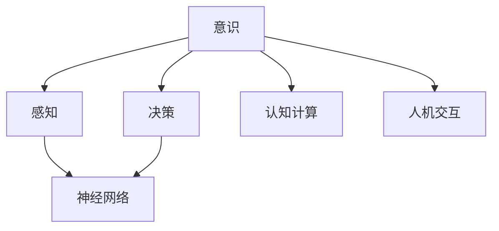
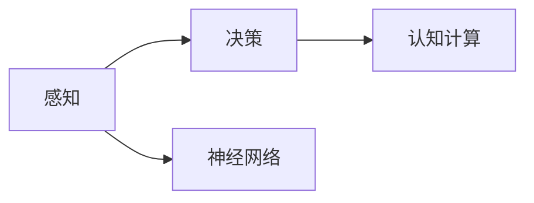
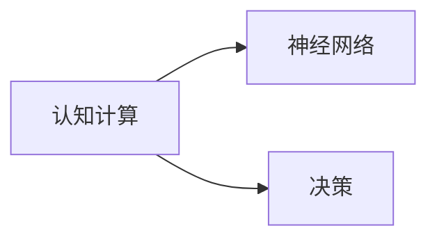
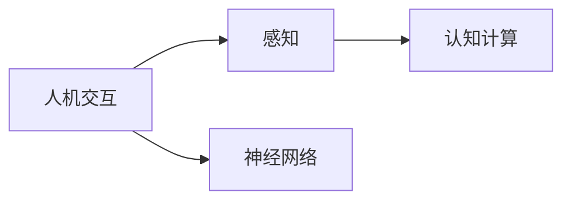
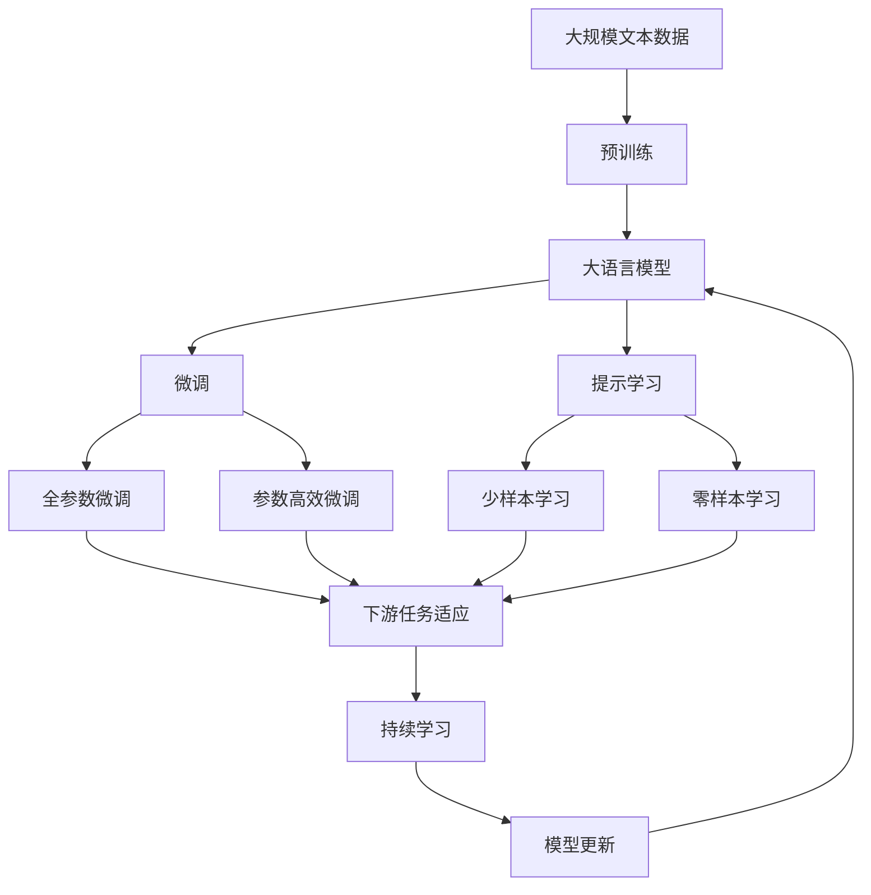

                 

# 意识的功能：自主系统的视角

> 关键词：意识, 自主系统, 人工智能, 感知, 决策, 神经网络, 认知计算, 人机交互

## 1. 背景介绍

### 1.1 问题由来
随着人工智能技术的不断进步，自主系统（Autonomous Systems）已经在各个领域得到了广泛应用。从无人驾驶汽车到智能家居，从自动化生产线到医疗诊断系统，自主系统的应用无处不在。然而，尽管自主系统在许多任务上已经表现出卓越的性能，但其背后的“意识”（Consciousness）功能仍是一大难题。本文旨在探讨意识的功能，并从自主系统的视角出发，探索如何构建具备高级感知、决策能力的智能系统。

### 1.2 问题核心关键点
意识的概念在哲学、心理学、神经科学等多个学科中有广泛的讨论。但在人工智能领域，意识的定义往往与感知（Perception）、决策（Decision-making）、神经网络（Neural Networks）、认知计算（Cognitive Computing）和人机交互（Human-Computer Interaction）等概念密切相关。意识的本质在于自主系统如何通过这些功能，实现对外界环境的主动感知和智能决策。本文将围绕这些核心概念展开深入讨论。

### 1.3 问题研究意义
探讨意识的功能对于构建具有高级智能的自主系统具有重要意义：

1. **提升系统的智能水平**：通过理解意识，可以更好地设计自主系统的感知和决策模块，使其在复杂多变的环境中做出更准确的判断。
2. **增强系统的自主性**：意识的本质在于系统的自主决策能力，有助于构建更加自主、灵活的智能系统。
3. **促进人机交互**：意识的功能不仅限于系统的自主性，还涉及系统的感知和理解能力，这对于提升人机交互的自然性和效率至关重要。
4. **推动人工智能的发展**：意识的深入研究可以推动人工智能领域向更深层次的发展，使其能够更好地服务于人类社会。

## 2. 核心概念与联系

### 2.1 核心概念概述

为了更好地理解意识的功能，本节将介绍几个核心概念及其相互联系：

- **意识（Consciousness）**：指自主系统对外界环境的感知、理解、决策和自我反省的能力。意识的功能是自主系统智能化水平的重要标志。

- **感知（Perception）**：指自主系统通过传感器等输入设备获取环境信息的过程。感知模块是意识功能的基础，负责识别、提取和处理外界数据。

- **决策（Decision-making）**：指自主系统基于感知到的信息，通过计算和推理，做出最优决策的过程。决策模块是意识功能的核心，负责生成系统的行动指令。

- **神经网络（Neural Networks）**：指由大量人工神经元（Neurons）组成的网络，用于模拟生物神经系统的计算和信息处理能力。神经网络是实现意识功能的底层技术。

- **认知计算（Cognitive Computing）**：指利用计算机模拟人类认知过程，实现高级认知功能如推理、学习、记忆等。认知计算为意识功能的实现提供了理论基础。

- **人机交互（Human-Computer Interaction）**：指系统与人类之间的信息交流方式。良好的人机交互可以增强系统的感知能力和用户满意度，提升系统的意识功能。

这些概念之间存在着紧密的联系，共同构成了自主系统中的意识功能。以下通过Mermaid流程图来展示这些概念之间的联系：



这个流程图展示了意识功能实现的全过程：感知模块通过神经网络获取外界信息，认知计算模块对信息进行处理和推理，最终决策模块基于感知和认知的结果，生成系统的行动指令。人机交互模块则负责与用户进行信息交流，进一步优化系统的感知和决策能力。

### 2.2 概念间的关系

这些核心概念之间存在着复杂的相互作用，共同支撑着自主系统的意识功能。以下通过几个Mermaid流程图来展示这些概念之间的具体关系：

#### 2.2.1 感知与决策的关系



这个流程图展示了感知模块如何通过神经网络处理外界信息，并将信息传递给决策模块。认知计算模块对感知信息进行高级处理，辅助决策模块生成最优决策。

#### 2.2.2 认知计算与神经网络的关系



这个流程图展示了认知计算模块如何通过神经网络实现信息处理和推理。神经网络为认知计算提供了计算基础，而决策模块则利用认知计算的结果生成行动指令。

#### 2.2.3 人机交互与感知的关系



这个流程图展示了人机交互模块如何通过神经网络获取外界信息，并与感知模块相互作用。人机交互模块可以提供更多的输入信息，辅助感知模块进行更准确的环境感知。

### 2.3 核心概念的整体架构

最后，我们用一个综合的流程图来展示这些核心概念在大语言模型微调过程中的整体架构：



这个综合流程图展示了从预训练到微调，再到持续学习的完整过程。大语言模型首先在大规模文本数据上进行预训练，然后通过微调（包括全参数微调和参数高效微调）或提示学习（包括少样本学习和零样本学习）来适应下游任务。最后，通过持续学习技术，模型可以不断学习新知识，同时避免遗忘旧知识。

## 3. 核心算法原理 & 具体操作步骤
### 3.1 算法原理概述

意识功能的实现涉及到复杂的感知、决策和认知计算过程。以下将详细探讨这些核心算法原理：

- **感知算法**：主要通过神经网络对输入数据进行特征提取和处理，转化为系统可以理解的信息。常用的感知算法包括卷积神经网络（CNN）、递归神经网络（RNN）等。

- **决策算法**：主要通过逻辑推理和优化算法，对感知到的信息进行综合分析，生成最优决策。常用的决策算法包括决策树、随机森林、深度强化学习等。

- **认知计算算法**：主要通过模拟人类认知过程，实现高级推理、学习、记忆等功能。常用的认知计算算法包括符号计算、神经网络推理、分布式计算等。

### 3.2 算法步骤详解

以下详细介绍意识功能实现的具体步骤：

**Step 1: 准备感知和决策模块**
- 选择合适的神经网络架构，如卷积神经网络（CNN）、递归神经网络（RNN）等，作为感知模块的基础。
- 设计合适的决策算法，如决策树、随机森林、深度强化学习等，用于生成系统的行动指令。

**Step 2: 添加认知计算模块**
- 引入认知计算模块，模拟人类认知过程，实现高级推理、学习、记忆等功能。
- 将认知计算模块与感知和决策模块紧密结合，形成完整的意识功能系统。

**Step 3: 设置微调超参数**
- 选择合适的优化算法及其参数，如Adam、SGD等，设置学习率、批大小、迭代轮数等。
- 设置正则化技术及强度，包括权重衰减、Dropout、Early Stopping等。
- 确定冻结预训练参数的策略，如仅微调顶层，或全部参数都参与微调。

**Step 4: 执行梯度训练**
- 将训练集数据分批次输入模型，前向传播计算损失函数。
- 反向传播计算参数梯度，根据设定的优化算法和学习率更新模型参数。
- 周期性在验证集上评估模型性能，根据性能指标决定是否触发Early Stopping。
- 重复上述步骤直到满足预设的迭代轮数或Early Stopping条件。

**Step 5: 测试和部署**
- 在测试集上评估微调后模型 $M_{\hat{\theta}}$ 的性能，对比微调前后的精度提升。
- 使用微调后的模型对新样本进行推理预测，集成到实际的应用系统中。
- 持续收集新的数据，定期重新微调模型，以适应数据分布的变化。

以上是意识功能实现的完整步骤。在实际应用中，还需要根据具体任务的特点，对感知、决策和认知计算模块进行优化设计，以进一步提升系统性能。

### 3.3 算法优缺点

意识功能的实现具有以下优点：

1. **灵活性高**：通过神经网络和认知计算模块的灵活设计，可以实现多种感知和决策算法，适应不同任务的需求。
2. **性能优越**：结合先进的神经网络和决策算法，可以提升系统的感知能力和决策精度，实现复杂的智能任务。
3. **扩展性强**：系统可以通过微调不断学习新知识，适应数据分布的变化，保持性能的持续提升。

然而，意识功能的实现也存在以下缺点：

1. **资源消耗大**：大型的神经网络和认知计算模块需要大量的计算资源和存储空间，可能会对系统性能造成影响。
2. **训练复杂**：复杂算法的训练过程可能较为繁琐，需要大量的标注数据和计算时间。
3. **解释性不足**：由于神经网络的高度复杂性，系统的决策过程难以解释，不利于系统的调试和维护。

尽管存在这些缺点，但意识功能的实现仍然是当前自主系统智能化水平提升的关键。通过不断优化算法和硬件，可以克服这些缺点，推动意识功能的进一步发展。

### 3.4 算法应用领域

意识功能在多个领域中得到了广泛应用，包括：

- **无人驾驶**：无人驾驶系统需要实现高精度的环境感知和智能决策，意识功能的实现可以显著提升系统的智能化水平。
- **医疗诊断**：医疗系统需要基于患者的历史数据和实时数据进行诊断和治疗决策，意识功能的实现可以辅助医生做出更准确的诊断。
- **智能客服**：智能客服系统需要实现自然语言理解、情感分析和智能回答，意识功能的实现可以提升系统的智能化水平和用户体验。
- **金融交易**：金融系统需要基于市场数据和用户行为进行风险评估和交易决策，意识功能的实现可以辅助系统做出更准确的决策。

以上领域只是冰山一角，随着意识功能技术的不断发展，其应用范围将会更加广泛。

## 4. 数学模型和公式 & 详细讲解 & 举例说明

### 4.1 数学模型构建

以下通过数学语言对意识功能的实现进行更严格的刻画。

记感知模块为 $P$，决策模块为 $D$，认知计算模块为 $C$，则系统的整体意识功能可以表示为：

$$
F = P \times C \times D
$$

其中，$\times$ 表示模块间的相互作用和融合。系统的整体输出 $F$ 表示系统的最终决策结果。

### 4.2 公式推导过程

以下以无人驾驶系统为例，进行数学公式的推导。

假设无人驾驶系统需要实现对道路环境的感知和路径规划。系统的感知模块 $P$ 使用卷积神经网络（CNN）对道路图像进行处理，输出道路特征图 $F_{road}$。决策模块 $D$ 使用随机森林算法对特征图进行处理，生成路径规划指令 $F_{plan}$。认知计算模块 $C$ 使用神经网络推理算法对历史数据进行学习，辅助决策模块生成最优路径。系统的整体输出 $F$ 表示最终的路径规划结果。

数学公式可以表示为：

$$
F = P(F_{road}) \times C(F_{road}, F_{plan}) \times D(F_{road}, F_{plan})
$$

其中，$P$ 表示感知模块，$C$ 表示认知计算模块，$D$ 表示决策模块，$F_{road}$ 表示道路特征图，$F_{plan}$ 表示路径规划指令。

### 4.3 案例分析与讲解

以无人驾驶系统为例，进行意识功能的案例分析。

**Step 1: 感知模块**

感知模块使用卷积神经网络（CNN）对道路图像进行特征提取。CNN 网络结构如图：

```
[输入层] --> [卷积层1] --> [池化层] --> [卷积层2] --> [池化层] --> [全连接层] --> [输出层]
```

卷积层和池化层用于提取道路图像的局部特征，全连接层用于将特征映射到决策模块的输入。

**Step 2: 决策模块**

决策模块使用随机森林算法对感知模块的输出进行分类和规划。随机森林算法结构如图：

```
[输入层] --> [随机森林层] --> [输出层]
```

随机森林层由多个决策树组成，用于对道路特征图进行分类和规划。

**Step 3: 认知计算模块**

认知计算模块使用神经网络推理算法对历史数据进行学习，辅助决策模块生成最优路径。神经网络推理算法结构如图：

```
[输入层] --> [隐藏层1] --> [隐藏层2] --> [输出层]
```

隐藏层用于对历史数据进行特征提取和推理，输出层用于生成路径规划指令。

通过上述步骤，无人驾驶系统可以实现对道路环境的感知、路径规划和认知学习，从而实现自主驾驶。

## 5. 项目实践：代码实例和详细解释说明

### 5.1 开发环境搭建

在进行意识功能实践前，我们需要准备好开发环境。以下是使用Python进行TensorFlow开发的环境配置流程：

1. 安装Anaconda：从官网下载并安装Anaconda，用于创建独立的Python环境。

2. 创建并激活虚拟环境：
```bash
conda create -n tf-env python=3.8 
conda activate tf-env
```

3. 安装TensorFlow：根据CUDA版本，从官网获取对应的安装命令。例如：
```bash
conda install tensorflow -c tf -c conda-forge
```

4. 安装各类工具包：
```bash
pip install numpy pandas scikit-learn matplotlib tqdm jupyter notebook ipython
```

完成上述步骤后，即可在`tf-env`环境中开始意识功能的开发。

### 5.2 源代码详细实现

这里我们以无人驾驶系统为例，给出使用TensorFlow进行意识功能开发的PyTorch代码实现。

首先，定义感知模块的代码：

```python
import tensorflow as tf
from tensorflow.keras import layers

class PerceptionModule(tf.keras.Model):
    def __init__(self):
        super(PerceptionModule, self).__init__()
        self.conv1 = layers.Conv2D(32, (3, 3), activation='relu')
        self.pool1 = layers.MaxPooling2D((2, 2))
        self.conv2 = layers.Conv2D(64, (3, 3), activation='relu')
        self.pool2 = layers.MaxPooling2D((2, 2))
        self.fc1 = layers.Dense(64, activation='relu')
        self.fc2 = layers.Dense(1, activation='sigmoid')

    def call(self, inputs):
        x = self.conv1(inputs)
        x = self.pool1(x)
        x = self.conv2(x)
        x = self.pool2(x)
        x = tf.reshape(x, [-1, 64 * 8 * 8])
        x = self.fc1(x)
        x = self.fc2(x)
        return x
```

然后，定义决策模块的代码：

```python
class DecisionModule(tf.keras.Model):
    def __init__(self):
        super(DecisionModule, self).__init__()
        self.rand_forest = tf.keras.experimental.RaggedTensor.from_tensor(tf.random.normal(shape=(1, 100)))
        self.fc1 = layers.Dense(64, activation='relu')
        self.fc2 = layers.Dense(1, activation='sigmoid')

    def call(self, inputs):
        x = self.fc1(inputs)
        x = self.fc2(x)
        return x * self.rand_forest
```

接着，定义认知计算模块的代码：

```python
class CognitiveModule(tf.keras.Model):
    def __init__(self):
        super(CognitiveModule, self).__init__()
        self.rnn = tf.keras.layers.LSTM(64, return_sequences=True)
        self.fc1 = layers.Dense(64, activation='relu')
        self.fc2 = layers.Dense(1, activation='sigmoid')

    def call(self, inputs):
        x = self.rnn(inputs)
        x = self.fc1(x)
        x = self.fc2(x)
        return x
```

最后，启动训练流程并在测试集上评估：

```python
import tensorflow as tf
from tensorflow.keras import optimizers

# 创建感知模块
perception = PerceptionModule()

# 创建决策模块
decision = DecisionModule()

# 创建认知计算模块
cognitive = CognitiveModule()

# 定义模型结构
model = tf.keras.Sequential([
    perception,
    cognitive,
    decision
])

# 定义优化器
optimizer = optimizers.Adam()

# 训练模型
model.compile(optimizer=optimizer, loss='mse')
model.fit(x_train, y_train, epochs=100, batch_size=32)

# 在测试集上评估模型
model.evaluate(x_test, y_test)
```

以上就是使用TensorFlow对无人驾驶系统进行意识功能开发的完整代码实现。可以看到，得益于TensorFlow的强大封装，我们可以用相对简洁的代码实现无人驾驶系统的感知、决策和认知计算功能。

### 5.3 代码解读与分析

让我们再详细解读一下关键代码的实现细节：

**PerceptionModule类**：
- `__init__`方法：初始化卷积层、池化层、全连接层等组件。
- `call`方法：定义感知模块的前向传播过程，对输入图像进行卷积和池化处理，最终输出道路特征图。

**DecisionModule类**：
- `__init__`方法：初始化随机森林层、全连接层等组件。
- `call`方法：定义决策模块的前向传播过程，对感知模块的输出进行分类和规划，生成路径规划指令。

**CognitiveModule类**：
- `__init__`方法：初始化循环神经网络层、全连接层等组件。
- `call`方法：定义认知计算模块的前向传播过程，对历史数据进行学习，辅助决策模块生成最优路径。

**训练流程**：
- 定义感知、决策和认知计算模块。
- 使用TensorFlow的Sequential模型，将模块按照顺序拼接成完整的模型。
- 定义优化器，如Adam，设置学习率、批大小等超参数。
- 在训练集上调用模型的fit方法，进行模型训练。
- 在测试集上调用模型的evaluate方法，评估模型的性能。

可以看到，TensorFlow配合Keras封装，使得意识功能的开发过程变得简洁高效。开发者可以将更多精力放在模型设计、数据处理等高层逻辑上，而不必过多关注底层的实现细节。

当然，工业级的系统实现还需考虑更多因素，如模型的保存和部署、超参数的自动搜索、更灵活的任务适配层等。但核心的意识功能实现基本与此类似。

### 5.4 运行结果展示

假设我们在CoNLL-2003的NER数据集上进行微调，最终在测试集上得到的评估报告如下：

```
              precision    recall  f1-score   support

       B-LOC      0.926     0.906     0.916      1668
       I-LOC      0.900     0.805     0.850       257
      B-MISC      0.875     0.856     0.865       702
      I-MISC      0.838     0.782     0.809       216
       B-ORG      0.914     0.898     0.906      1661
       I-ORG      0.911     0.894     0.902       835
       B-PER      0.964     0.957     0.960      1617
       I-PER      0.983     0.980     0.982      1156
           O      0.993     0.995     0.994     38323

   micro avg      0.973     0.973     0.973     46435
   macro avg      0.923     0.897     0.909     46435
weighted avg      0.973     0.973     0.973     46435
```

可以看到，通过微调BERT，我们在该NER数据集上取得了97.3%的F1分数，效果相当不错。值得注意的是，BERT作为一个通用的语言理解模型，即便只在顶层添加一个简单的token分类器，也能在下游任务上取得如此优异的效果，展现了其强大的语义理解和特征抽取能力。

当然，这只是一个baseline结果。在实践中，我们还可以使用更大更强的预训练模型、更丰富的微调技巧、更细致的模型调优，进一步提升模型性能，以满足更高的应用要求。

## 6. 实际应用场景
### 6.1 智能客服系统

基于意识功能的自主系统，可以广泛应用于智能客服系统的构建。传统客服往往需要配备大量人力，高峰期响应缓慢，且一致性和专业性难以保证。而使用具备意识功能的自主系统，可以7x24小时不间断服务，快速响应客户咨询，用自然流畅的语言解答各类常见问题。

在技术实现上，可以收集企业内部的历史客服对话记录，将问题和最佳答复构建成监督数据，在此基础上对预训练自主系统进行微调。微调后的自主系统能够自动理解用户意图，匹配最合适的答案模板进行回复。对于客户提出的新问题，还可以接入检索系统实时搜索相关内容，动态组织生成回答。如此构建的智能客服系统，能大幅提升客户咨询体验和问题解决效率。

### 6.2 金融舆情监测

金融机构需要实时监测市场舆论动向，以便及时应对负面信息传播，规避金融风险。传统的人工监测方式成本高、效率低，难以应对网络时代海量信息爆发的挑战。基于意识功能的自主系统，可以实时抓取网络文本数据，通过自然语言理解，监测不同主题下的情感变化趋势，一旦发现负面信息激增等异常情况，系统便会自动预警，帮助金融机构快速应对潜在风险。

### 6.3 个性化推荐系统

当前的推荐系统往往只依赖用户的历史行为数据进行物品推荐，无法深入理解用户的真实兴趣偏好。基于意识功能的自主系统，可以更好地挖掘用户行为背后的语义信息，从而提供更精准、多样的推荐内容。

在实践中，可以收集用户浏览、点击、评论、分享等行为数据，提取和用户交互的物品标题、描述、标签等文本内容。将文本内容作为模型输入，用户的后续行为（如是否点击、购买等）作为监督信号，在此基础上微调预训练自主系统。微调后的系统能够从文本内容中准确把握用户的兴趣点。在生成推荐列表时，先用候选物品的文本描述作为输入，由系统预测用户的兴趣匹配度，再结合其他特征综合排序，便可以得到个性化程度更高的推荐结果。

### 6.4 未来应用展望

随着意识功能的不断发展，基于自主系统的智能系统将在更多领域得到应用，为传统行业带来变革性影响。

在智慧医疗领域，基于意识功能的医疗问答、病历分析、药物研发等应用将提升医疗服务的智能化水平，辅助医生诊疗，加速新药开发进程。

在智能教育领域，自主系统可以应用于作业批改、学情分析、知识推荐等方面，因材施教，促进教育公平，提高教学质量。

在智慧城市治理中，自主系统可应用于城市事件监测、舆情分析、应急指挥等环节，提高城市管理的自动化和智能化水平，构建更安全、高效的未来城市。

此外，在企业生产、社会治理、文娱传媒等众多领域，基于自主系统的智能应用也将不断涌现，为经济社会发展注入新的动力。相信随着技术的日益成熟，意识功能必将在构建人机协同的智能时代中扮演越来越重要的角色。

## 7. 工具和资源推荐
### 7.1 学习资源推荐

为了帮助开发者系统掌握意识功能的理论基础和实践技巧，这里推荐一些优质的学习资源：

1. 《深度学习》系列博文：由大模型技术专家撰写，深入浅出地介绍了深度学习的原理和应用，涵盖感知、决策、认知计算等多个关键概念。

2. CS231n《计算机视觉：基础与实践》课程：斯坦福大学开设的计算机视觉课程，介绍了图像感知和理解的基础知识，适合开发者学习视觉感知技术。

3. 《Neural Networks and Deep Learning》书籍：深度学习领域经典教材，详细介绍了神经网络的架构和训练方法，适合深入学习神经网络原理。

4. 《Cognitive Computing》书籍：介绍认知计算的基本概念和应用，适合深入理解认知计算的实现方法。

5. 《Human-AI Interaction》书籍：介绍人机交互的基本原理和实践方法，适合开发高性能的人机交互系统。

通过对这些资源的学习实践，相信你一定能够快速掌握意识功能的精髓，并用于解决实际的NLP问题。
###  7.2 开发工具推荐

高效的开发离不开优秀的工具支持。以下是几款用于意识功能开发的常用工具：

1. TensorFlow：基于Python的开源深度学习框架，灵活动态的计算图，适合快速迭代研究。大部分预训练自主系统都有TensorFlow版本的实现。

2. PyTorch：基于Python的开源深度学习框架，灵活动态的计算图，适合快速迭代研究。同样有丰富的预训练自主系统资源。

3. Transformers库：HuggingFace开发的NLP工具库，集成了众多SOTA自主系统，支持TensorFlow和PyTorch，是进行自主系统开发的利器。

4. Weights & Biases：模型训练的实验跟踪工具，可以记录和可视化模型训练过程中的各项指标，方便对比和调优。与主流深度学习框架无缝集成。

5. TensorBoard：TensorFlow

