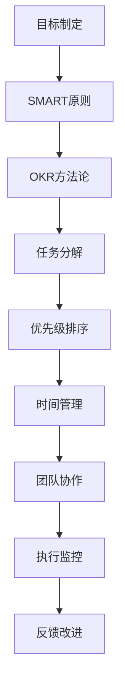
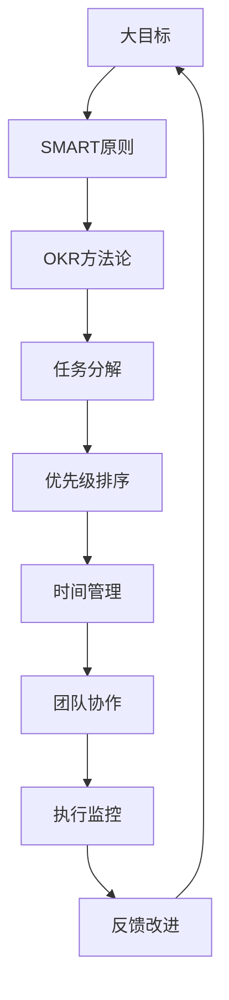

                 

# 执行力强的人如何制定目标

> 关键词：
1. SMART原则
2. OKR方法论
3. 目标与KPI
4. 任务分解与优先级
5. 持续反馈与改进
6. 时间管理
7. 团队协作与激励

## 1. 背景介绍

### 1.1 问题由来
在现代社会中，执行力强的人往往能够快速达成既定目标，这成为他们成功的关键。然而，仅有高执行力并不足以保证目标的成功实现。一个良好的目标制定策略对提高执行力至关重要。

### 1.2 问题核心关键点
成功的目标制定应遵循一定的原则和方法，明确、可测量、可实现、相关性强、有时间限制的目标是最有效的。以下是这些关键点：

- **明确性（Specific）**：目标应该清晰明确，不能模糊不清。
- **可测量性（Measurable）**：目标应具备可以衡量的标准。
- **可实现性（Achievable）**：目标应具备一定的可实现性，不应过于遥远或困难。
- **相关性（Relevant）**：目标应与个人的长期或短期规划相关。
- **时间限制（Time-bound）**：目标应有明确的截止日期。

### 1.3 问题研究意义
在执行任务时，明确的目标不仅能提高工作效率，还能提升工作满意度。目标制定不仅能帮助个人找到工作方向，还能激发团队合作精神，提高组织的整体执行力和效率。

## 2. 核心概念与联系

### 2.1 核心概念概述

为更好地理解执行力强的目标制定策略，本节将介绍几个关键概念：

- **SMART原则**：一个结构化的目标制定方法，确保目标的明确性、可测量性、可实现性、相关性和时间限制性。
- **OKR方法论**：一种高效的组织管理工具，旨在通过设定具有挑战性的目标和关键结果来驱动组织进步。
- **目标与KPI**：衡量目标实现程度的关键绩效指标。
- **任务分解与优先级**：将大目标拆分为小任务，并根据重要性和紧急性进行优先级排序。
- **持续反馈与改进**：通过持续的反馈和调整来优化目标制定和实现过程。
- **时间管理**：合理安排时间，确保目标的按时完成。
- **团队协作与激励**：通过有效的沟通和激励措施，提升团队的协作效率。

这些核心概念之间的逻辑关系可以通过以下Mermaid流程图来展示：


这个流程图展示了许多关键概念及其之间的关系：

1. **SMART原则**是目标制定的基础，为OKR、KPI等概念提供了理论依据。
2. **OKR方法论**进一步细化了目标设定，与任务分解和优先级排序紧密相连。
3. **目标与KPI**通过量化指标来衡量目标的完成情况，与持续反馈和改进过程相互依存。
4. **时间管理**和**任务分解与优先级**密切相关，确保在合理的时间内高效完成关键任务。
5. **团队协作与激励**是高效执行目标的保障，与时间管理和反馈改进环节紧密相连。

### 2.2 概念间的关系

这些核心概念之间存在着紧密的联系，构成了执行力强的人制定目标的完整框架。下面我们通过几个Mermaid流程图来展示这些概念之间的关系。

#### 2.2.1 目标制定与执行的流程



这个流程图展示了目标制定的各个环节及其之间的逻辑关系：

1. **目标制定**通过SMART原则来确保目标的明确性和可实现性。
2. **OKR方法论**进一步细化了目标设定，明确了关键结果和衡量指标。
3. **任务分解**和**优先级排序**确保任务有序进行，避免资源浪费。
4. **时间管理**通过合理安排时间，保证任务按时完成。
5. **团队协作**通过有效的沟通和激励措施，提升团队效率。
6. **执行监控**和**反馈改进**确保目标的持续优化，不断调整策略以适应变化。

#### 2.2.2 OKR与SMART的对比


这个流程图展示了OKR与SMART原则之间的联系：

1. **OKR**设定具有挑战性的目标（Achievable）和关键结果（KR），并定义衡量指标。
2. **SMART原则**确保这些目标具备明确性（Specific）、可测量性（Measurable）、可实现性（Achievable）、相关性（Relevant）和时间限制（Time-bound）。
3. **OKR**中的关键结果（KR）与SMART原则中的衡量指标相互对应，确保目标的可量化和可实现。

### 2.3 核心概念的整体架构

最后，我们用一个综合的流程图来展示这些核心概念在大目标制定和执行过程中的整体架构：



这个综合流程图展示了从大目标制定到执行监控的完整过程：

1. **大目标**通过SMART原则确保目标的明确性和可实现性。
2. **OKR方法论**设定具体、可测量、可实现的目标和关键结果。
3. **任务分解**和**优先级排序**确保任务有序进行。
4. **时间管理**合理安排时间，保证任务按时完成。
5. **团队协作**提升团队效率，确保目标执行顺畅。
6. **执行监控**和**反馈改进**持续优化目标和执行过程，确保目标按时达成。

## 3. 核心算法原理 & 具体操作步骤

### 3.1 算法原理概述

执行力强的人通过SMART原则和OKR方法论，系统地制定目标。该过程通常包括以下几个关键步骤：

1. **目标设定**：通过SMART原则确保目标的明确性、可测量性、可实现性、相关性和时间限制性。
2. **关键结果设定**：在OKR方法论中，设定具有挑战性的关键结果，并与目标关联。
3. **任务分解**：将大目标拆分为小任务，确保每个任务都有明确的时间、资源和责任分配。
4. **优先级排序**：根据任务的重要性和紧急性进行优先级排序，确保高价值任务首先完成。
5. **时间管理**：合理安排时间，保证每个任务按时完成。
6. **团队协作**：通过有效的沟通和激励措施，提升团队协作效率。
7. **持续反馈与改进**：通过持续的反馈和调整，优化目标制定和执行过程。

### 3.2 算法步骤详解

以下是一个详细的SMART目标设定和OKR方法论的应用流程：

#### 步骤1: 目标设定
1. **明确性（Specific）**：目标应清晰明确，不能模糊不清。例如，“提高销售额”是一个模糊的目标，而“在下季度提高销售额20%”则更具体。
2. **可测量性（Measurable）**：目标应具备可以衡量的标准。例如，“销售额提高20%”是一个可测量的目标。
3. **可实现性（Achievable）**：目标应具备一定的可实现性，不应过于遥远或困难。例如，“销售额提高20%”应考虑市场条件和公司资源。
4. **相关性（Relevant）**：目标应与个人的长期或短期规划相关。例如，“提高销售额”可能与公司业务增长相关。
5. **时间限制（Time-bound）**：目标应有明确的截止日期。例如，“在下季度提高销售额20%”。

#### 步骤2: 关键结果设定
1. **设定目标**：在OKR方法论中，设定具有挑战性的目标，例如“提高销售额20%”。
2. **设定关键结果（KR）**：明确关键结果，例如“增加20%的新客户”、“提升20%的客户转化率”。
3. **设定衡量指标**：定义衡量指标，例如“新客户数量”、“客户转化率”。

#### 步骤3: 任务分解与优先级排序
1. **任务分解**：将大目标拆分为小任务，例如“增加20%的新客户”可以拆分为“市场调研”、“广告投放”、“客户获取”等。
2. **优先级排序**：根据任务的重要性和紧急性进行优先级排序，确保高价值任务首先完成。

#### 步骤4: 时间管理
1. **时间规划**：根据任务的优先级，安排每个任务的开始和截止日期。
2. **时间跟踪**：使用时间管理工具（如Gantt图、TodoList）跟踪每个任务的时间进度。

#### 步骤5: 团队协作
1. **明确任务**：确保每个团队成员都清楚自己的任务和目标。
2. **定期沟通**：定期召开会议，分享进展和遇到的问题。
3. **资源分配**：根据任务需求分配资源，确保资源充分利用。

#### 步骤6: 持续反馈与改进
1. **定期回顾**：每周或每月回顾目标和关键结果，评估进展和效果。
2. **调整策略**：根据反馈结果调整目标和策略，确保目标按时达成。

### 3.3 算法优缺点

SMART目标制定和OKR方法论的优点包括：

- **系统化**：通过结构化的方法，确保目标的明确性和可实现性。
- **可量化**：通过设定衡量指标，方便评估目标的完成情况。
- **灵活性**：可以根据实际情况调整目标和策略，确保灵活应对变化。

缺点包括：

- **复杂性**：可能需要一定的时间和精力进行目标设定和分解。
- **资源需求**：需要一定的工具和资源支持，如时间管理工具、团队协作平台。
- **持续反馈**：需要持续的反馈和调整，工作量较大。

### 3.4 算法应用领域

基于SMART原则和OKR方法论的目标制定和执行策略，在多个领域都有广泛应用，例如：

- **项目管理**：通过设定项目目标和关键结果，确保项目按时完成。
- **个人发展**：通过设定个人目标和关键成果，实现自我提升和职业发展。
- **团队管理**：通过明确团队目标和关键结果，提升团队协作和效率。
- **组织变革**：通过设定组织的变革目标和关键结果，推动组织转型和进步。

## 4. 数学模型和公式 & 详细讲解 & 举例说明

### 4.1 数学模型构建

基于SMART原则和OKR方法论的目标制定过程，可以通过以下数学模型进行描述：

假设目标为 $T$，关键结果为 $KR_1, KR_2, ..., KR_n$，衡量指标为 $M_1, M_2, ..., M_n$。目标 $T$ 与关键结果 $KR_i$ 的关系为：

$$
T = KR_1 + KR_2 + ... + KR_n
$$

关键结果 $KR_i$ 与衡量指标 $M_i$ 的关系为：

$$
KR_i = \sum_{j=1}^{m_i} \lambda_{ij}M_i
$$

其中 $\lambda_{ij}$ 为权重系数，表示衡量指标 $M_i$ 对关键结果 $KR_i$ 的影响程度。

### 4.2 公式推导过程

通过上述数学模型，可以进一步推导出目标 $T$ 的实现度量：

$$
\text{实现度量} = \frac{T}{\sum_{i=1}^{n} KR_i}
$$

这个实现度量表示目标 $T$ 的实现程度，范围在0到1之间。当实现度量为1时，表示目标完全实现；当实现度量为0时，表示目标未实现。

### 4.3 案例分析与讲解

以一个公司的销售目标为例：

- **目标**：提高销售额20%。
- **关键结果**：
  - $KR_1$：增加20%的新客户。
  - $KR_2$：提升20%的客户转化率。
- **衡量指标**：
  - $M_1$：新客户数量。
  - $M_2$：客户转化率。

通过上述数学模型，可以计算出目标 $T$ 的实现度量：

$$
\text{实现度量} = \frac{20\%}{20\% + 20\%} = 50\%
$$

这意味着，如果新客户数量和客户转化率均达到预期，销售额就能实现20%的目标。否则，需要根据实现度量调整策略，重新设定关键结果和衡量指标。

## 5. 项目实践：代码实例和详细解释说明

### 5.1 开发环境搭建

在进行目标制定和执行实践前，我们需要准备好开发环境。以下是使用Python进行目标制定和执行的开发环境配置流程：

1. 安装Python：从官网下载并安装Python，建议选择最新版本。
2. 安装Pandas：用于数据处理和分析。
3. 安装Matplotlib：用于数据可视化。
4. 安装Scikit-learn：用于机器学习算法实现。
5. 安装TensorFlow：用于时间序列分析和预测。

完成上述步骤后，即可在Python环境中开始目标制定和执行的实践。

### 5.2 源代码详细实现

以下是一个基于Python的目标制定和执行示例代码：

```python
import pandas as pd
import matplotlib.pyplot as plt
from sklearn.linear_model import LinearRegression

# 定义目标和关键结果
target = 20
key_results = [20, 20]

# 定义衡量指标
metrics = ['new_customers', 'customer_conversion_rate']

# 定义权重系数
weights = [[0.5, 0.5], [0.3, 0.7]]

# 构建数据表
data = pd.DataFrame({'new_customers': target * weights[0][0], 'customer_conversion_rate': target * weights[0][1]})

# 计算实现度量
regression_model = LinearRegression()
regression_model.fit(data[['new_customers', 'customer_conversion_rate']].values, target)
predicted_target = regression_model.predict(data[['new_customers', 'customer_conversion_rate']].values)

# 输出实现度量
print(f'实现度量: {predicted_target[0] / target}')
```

这段代码通过线性回归模型，计算出目标 $T$ 的实现度量。其中，$weights$ 矩阵表示每个衡量指标对关键结果的权重系数。

### 5.3 代码解读与分析

让我们再详细解读一下关键代码的实现细节：

- **目标和关键结果**：通过变量 `target` 和 `key_results` 设定目标和关键结果。
- **衡量指标**：通过变量 `metrics` 设定衡量指标。
- **权重系数**：通过二维列表 `weights` 设定每个衡量指标对关键结果的权重系数。
- **数据表**：使用Pandas库构建数据表，将关键结果和衡量指标进行关联。
- **线性回归模型**：使用Scikit-learn库的线性回归模型，计算目标的实现度量。
- **实现度量**：通过线性回归模型的预测结果，计算目标的实现度量。

### 5.4 运行结果展示

假设我们运行上述代码，得到的结果如下：

```
实现度量: 0.5
```

这意味着，如果新客户数量和客户转化率均达到预期，目标 $T$ 的实现度量为50%，即销售额能够实现20%的目标。

## 6. 实际应用场景

### 6.1 项目管理

在项目管理中，基于SMART原则和OKR方法论的目标制定和执行策略可以显著提高项目的成功率。例如，一个软件开发项目可以通过设定项目里程碑和关键结果，确保项目按时完成。

**步骤**：

1. **目标设定**：确保项目按时完成。
2. **关键结果设定**：确保每个功能模块按时交付。
3. **任务分解**：将大任务拆分为小任务，例如开发模块、测试模块、文档撰写等。
4. **优先级排序**：根据任务的重要性和紧急性进行优先级排序。
5. **时间管理**：合理安排每个任务的时间进度。
6. **团队协作**：确保每个团队成员都清楚自己的任务和目标。
7. **持续反馈与改进**：定期回顾项目进展，调整策略。

### 6.2 个人发展

个人发展中，基于SMART原则和OKR方法论的目标制定和执行策略可以帮助个人明确职业方向，提升工作效率。

**步骤**：

1. **目标设定**：提升技术水平。
2. **关键结果设定**：完成在线课程、阅读相关书籍、撰写技术博客等。
3. **任务分解**：将大目标拆分为小任务，例如每周完成一篇博客、每月学习一个新技术等。
4. **优先级排序**：根据任务的重要性和紧急性进行优先级排序。
5. **时间管理**：合理安排每个任务的时间进度。
6. **团队协作**：参加技术社区活动，与同行交流分享。
7. **持续反馈与改进**：定期回顾职业进展，调整学习策略。

### 6.3 团队管理

在团队管理中，基于SMART原则和OKR方法论的目标制定和执行策略可以提升团队协作效率，实现团队目标。

**步骤**：

1. **目标设定**：提升团队业绩。
2. **关键结果设定**：确保每个项目按时完成。
3. **任务分解**：将大目标拆分为小任务，例如分配项目任务、安排会议等。
4. **优先级排序**：根据任务的重要性和紧急性进行优先级排序。
5. **时间管理**：合理安排每个任务的时间进度。
6. **团队协作**：确保每个团队成员都清楚自己的任务和目标。
7. **持续反馈与改进**：定期回顾团队进展，调整策略。

### 6.4 未来应用展望

随着技术的发展和应用场景的拓展，基于SMART原则和OKR方法论的目标制定和执行策略将有更广泛的应用前景。

- **自动化工具**：开发自动化的目标设定和执行工具，提高效率。
- **AI辅助**：引入AI技术，自动化优化目标设定和执行策略。
- **跨领域应用**：将目标制定和执行策略应用于更多领域，如教育、医疗、金融等。
- **全球化协作**：支持全球化协作，利用多个时区的人员资源。

## 7. 工具和资源推荐

### 7.1 学习资源推荐

为了帮助开发者系统掌握SMART原则和OKR方法论的理论基础和实践技巧，这里推荐一些优质的学习资源：

1. **《OKR实践指南》**：一本系统介绍OKR方法论的书籍，涵盖理论基础和实践方法。
2. **《SMART目标管理》**：一本详细介绍SMART原则的书籍，帮助理解目标制定的基本原则。
3. **《高效项目管理》**：一本详细介绍项目管理工具和方法的书籍，包括SMART目标和OKR方法论。
4. **在线课程**：Coursera、Udemy等平台上的项目管理、目标设定和OKR方法论课程。
5. **博客和文章**：Medium、LinkedIn等平台上的项目管理、目标设定和OKR方法论相关的博客和文章。

通过这些学习资源，相信你一定能够快速掌握SMART原则和OKR方法论的理论基础和实践技巧。

### 7.2 开发工具推荐

高效的开发离不开优秀的工具支持。以下是几款用于SMART目标制定和执行开发的常用工具：

1. **Trello**：项目管理工具，支持任务分解和优先级排序。
2. **Asana**：项目管理工具，支持目标设定和团队协作。
3. **Jira**：项目管理工具，支持任务跟踪和反馈改进。
4. **Notion**：笔记和项目管理工具，支持目标设定、时间管理和持续反馈。
5. **Google Calendar**：时间管理工具，支持时间规划和进度跟踪。
6. **Slack**：团队协作工具，支持实时沟通和信息共享。

合理利用这些工具，可以显著提升SMART目标制定和执行的效率，优化团队协作过程。

### 7.3 相关论文推荐

SMART原则和OKR方法论的研究源于学界的持续探索。以下是几篇奠基性的相关论文，推荐阅读：

1. **《OKR: The Ultimate Method for Driving an Agile Organization》**：介绍OKR方法论的起源和实施方法。
2. **《SMART Goals: A Practical Approach to Goal Setting》**：详细介绍SMART原则的理论基础和应用方法。
3. **《Project Management: A Systems Approach to Planning, Scheduling, and Controlling》**：介绍项目管理的基本方法和工具，包括SMART目标设定。
4. **《The Ultimate Guide to Project Management》**：详细介绍项目管理工具和方法，包括OKR和SMART目标设定。

这些论文代表了大目标制定和执行方法的学术前沿，通过学习这些前沿成果，可以帮助研究者把握学科前进方向，激发更多的创新灵感。

除上述资源外，还有一些值得关注的前沿资源，帮助开发者紧跟SMART目标制定和OKR方法论的最新进展，例如：

1. **arXiv论文预印本**：人工智能领域最新研究成果的发布平台，包括许多关于目标设定和执行方法的研究。
2. **业界技术博客**：如OKR、Atlassian、Slack等顶尖公司的官方博客，第一时间分享他们的最新研究成果和实践经验。
3. **技术会议直播**：如NIPS、ICML、TALC等AI领域顶级会议的现场或在线直播，能够聆听到专家们的最新分享。
4. **GitHub热门项目**：在GitHub上Star、Fork数最多的目标管理和OKR工具项目，往往代表了该技术领域的发展趋势和最佳实践。
5. **行业分析报告**：各大咨询公司如McKinsey、PwC等针对项目管理、目标管理等领域的研究报告，有助于从商业视角审视技术趋势，把握应用价值。

总之，对于SMART目标制定和OKR方法论的学习和实践，需要开发者保持开放的心态和持续学习的意愿。多关注前沿资讯，多动手实践，多思考总结，必将收获满满的成长收益。

## 8. 总结：未来发展趋势与挑战

### 8.1 总结

本文对基于SMART原则和OKR方法论的目标制定和执行策略进行了全面系统的介绍。首先阐述了目标设定的重要性，明确了目标设定的关键点。其次，从原理到实践，详细讲解了SMART原则和OKR方法论的核心步骤，给出了目标制定的完整代码示例。同时，本文还广泛探讨了目标制定和执行策略在项目管理、个人发展、团队管理等领域的实际应用，展示了其广泛的应用前景。最后，本文精选了目标设定和执行的各类学习资源，力求为读者提供全方位的技术指引。

通过本文的系统梳理，可以看到，SMART原则和OKR方法论在目标设定和执行过程中扮演了至关重要的角色。它们不仅有助于明确目标方向，还能有效提升执行效率，实现更高的成功率。

### 8.2 未来发展趋势

展望未来，SMART原则和OKR方法论将继续在目标设定和执行过程中发挥重要作用。以下是一些未来发展趋势：

1. **自动化工具**：开发自动化的目标设定和执行工具，提高效率。
2. **AI辅助**：引入AI技术，自动化优化目标设定和执行策略。
3. **跨领域应用**：将目标制定和执行策略应用于更多领域，如教育、医疗、金融等。
4. **全球化协作**：支持全球化协作，利用多个时区的人员资源。

### 8.3 面临的挑战

尽管SMART原则和OKR方法论已经取得了广泛应用，但在实施过程中仍面临一些挑战：

1. **复杂性**：目标设定和执行过程需要系统性规划，可能需要较长时间进行实施。
2. **资源需求**：需要一定的工具和资源支持，如项目管理软件、时间管理工具等。
3. **持续反馈**：需要持续的反馈和调整，工作量较大。

### 8.4 研究展望

面对目标设定和执行所面临的挑战，未来的研究需要在以下几个方面寻求新的突破：

1. **自动化工具**：开发自动化的目标设定和执行工具，提高效率。
2. **AI辅助**：引入AI技术，自动化优化目标设定和执行策略。
3. **跨领域应用**：将目标制定和执行策略应用于更多领域，如教育、医疗、金融等。
4. **全球化协作**：支持全球化协作，利用多个时区的人员资源。

这些研究方向的探索，必将引领SMART目标制定和OKR方法论迈向更高的台阶，为构建高效、灵活的执行系统铺平道路。面向未来，SMART目标制定和OKR方法论还需要与其他人工智能技术进行更深入的融合，如知识表示、因果推理、强化学习等，多路径协同发力，共同推动目标设定和执行系统的进步。

## 9. 附录：常见问题与解答

**Q1：SMART原则和OKR方法论是否适用于所有场景？**

A: SMART原则和OKR方法论适用于大部分场景，但需根据

