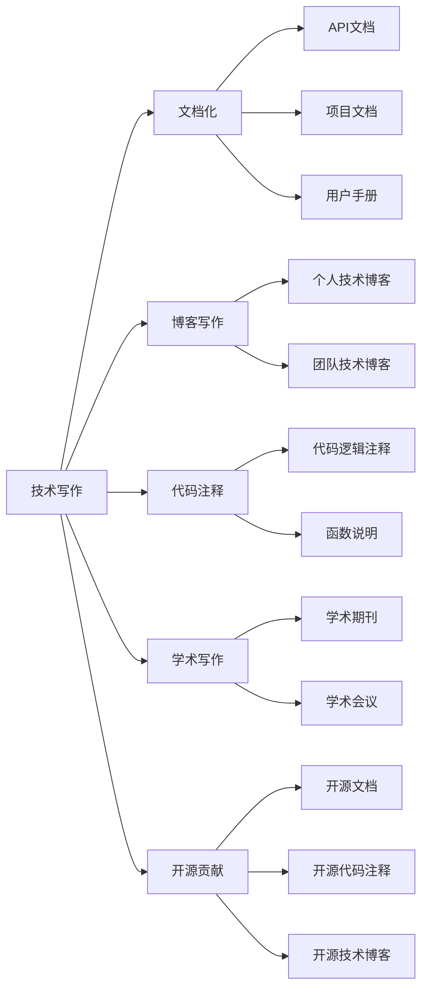
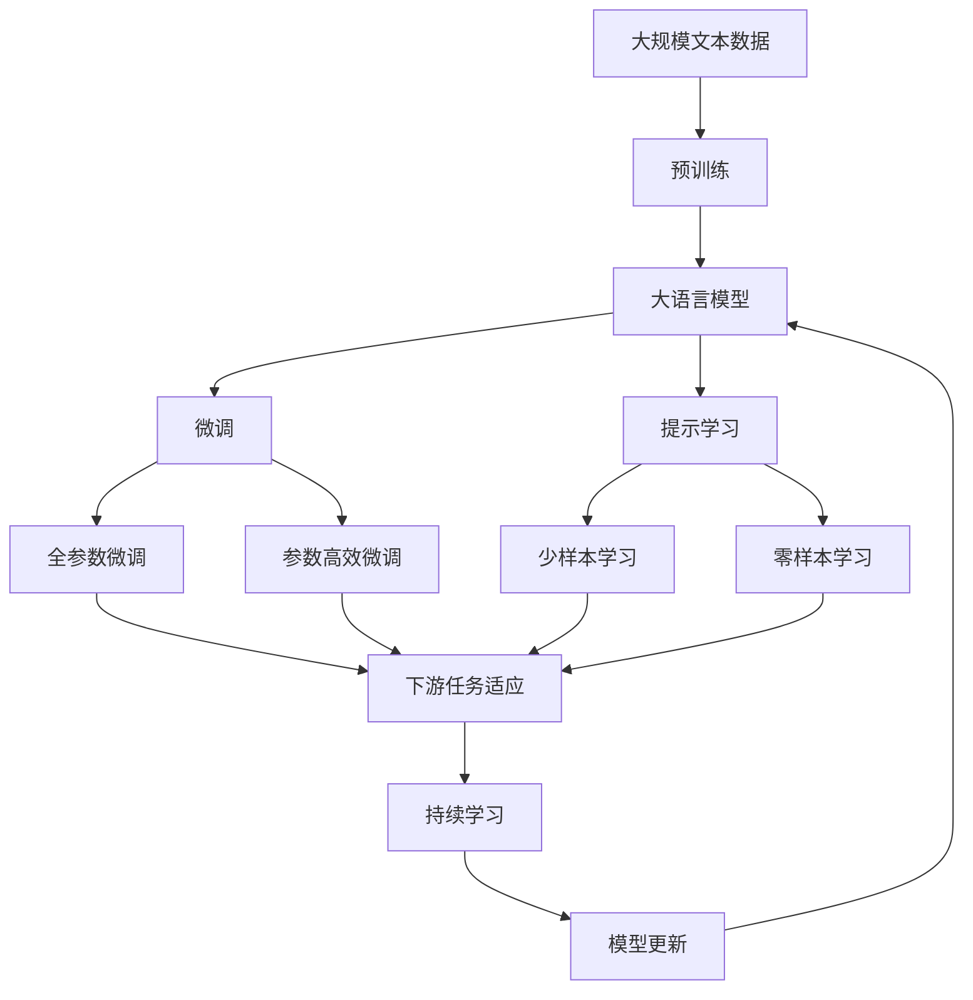

                 

# 技术写作：程序员的副业选择

## 1. 背景介绍

### 1.1 问题由来

在科技飞速发展的今天，软件开发已不再只是程序员的“主业”，技术写作也成为了越来越多程序员探索的副业领域。技术写作不仅可以帮助程序员提高表达能力、梳理知识体系，还能将专业知识转化为有价值的内容，助力职业成长和个人品牌塑造。技术写作的应用范围广泛，包括但不限于软件开发文档、技术博客、开源代码注释、学术论文等，是程序员提升自身价值的重要途径之一。

### 1.2 问题核心关键点

技术写作的核心关键点主要包括以下几个方面：
1. **目标受众定位**：了解目标受众的需求和背景，是选择写作主题和表达方式的基础。
2. **内容结构和逻辑**：确保内容条理清晰、层次分明，逻辑严谨，易于读者理解。
3. **语言风格和表达**：以简洁、明了的语言风格为主，注重准确性和易读性。
4. **多平台适配**：考虑到不同平台的用户体验和阅读习惯，灵活调整文章布局和排版。
5. **持续更新与迭代**：技术领域不断更新，持续输出高质量内容，保持与领域的同步。

### 1.3 问题研究意义

技术写作作为程序员的副业选择，具有以下重要意义：
1. **提升专业技能**：通过写作可以加深对技术的理解和应用，提高问题解决能力。
2. **扩展职业机会**：优秀的技术写作能力能够提升个人品牌，吸引更多职业机会。
3. **知识传承与分享**：写作是知识传播的有效方式，有助于将专业知识传递给更多受众。
4. **探索技术边界**：写作有助于深入思考技术问题，探索前沿技术领域。
5. **心理满足感**：写作能够带来成就感和满足感，提升职业幸福感。

## 2. 核心概念与联系

### 2.1 核心概念概述

为了更好地理解技术写作的精髓，本节将介绍几个核心概念：

- **技术写作**：指以技术内容为核心，通过书面形式进行知识传播和分享的写作形式。涵盖软件开发文档、技术博客、开源代码注释、学术论文等多种形式。

- **文档化(_documentation_)**：指通过书面形式对软件开发过程和结果进行详细记录和解释，包括API文档、项目文档、用户手册等。

- **博客写作**：指通过互联网平台发布个人或团队的技术思考、项目经验、技术洞见等内容，分享技术知识和行业趋势。

- **代码注释**：指在编程过程中，对代码逻辑和功能进行详细解释和说明，便于其他开发者理解和维护。

- **学术写作**：指在学术期刊和会议上发表的学术论文，通常包含深入的技术研究和理论探讨。

- **开源贡献**：指在开源项目中撰写文档、编写代码注释、撰写技术博客等，以促进社区交流和技术传播。

### 2.2 核心概念之间的关系

这些核心概念之间的联系可以通过以下Mermaid流程图来展示：



这个流程图展示了技术写作的不同形式及其关联。技术写作不仅限于文档化，还包括博客写作、代码注释、学术写作和开源贡献等多个方面。通过这些形式，技术内容得以广泛传播，促进技术交流与创新。

### 2.3 核心概念的整体架构

最后，我们用一个综合的流程图来展示这些核心概念在大语言模型微调过程中的整体架构：



这个综合流程图展示了从预训练到大语言模型微调，再到持续学习的完整过程。技术写作作为其中的关键环节，将预训练的知识和微调后的模型成果，通过文档化、博客、代码注释等形式进行传播，推动技术的发展与应用。

## 3. 核心算法原理 & 具体操作步骤
### 3.1 算法原理概述

技术写作的算法原理基于自然语言处理（NLP）和机器学习的核心思想。其核心思想是通过算法，将程序员对技术的理解转化为易于理解和传播的文字形式。具体来说，包括以下几个步骤：

1. **文本预处理**：将原始技术文档或代码进行格式化、分词、去除停用词等预处理，以提高后续处理的效率和效果。
2. **信息抽取**：从代码和文档提取关键信息，如函数名、参数、返回值、逻辑说明等，为写作提供素材。
3. **文本生成**：使用NLP模型生成技术文档或代码注释，通过语言模型、摘要模型等技术实现。
4. **质量评估**：对生成的文本进行质量评估，如语法检查、内容相关性、易读性等，确保输出内容的高质量。
5. **反馈迭代**：根据读者反馈和评估结果，不断调整和优化文本生成模型，提高写作效果。

### 3.2 算法步骤详解

技术写作的具体操作步骤如下：

**Step 1: 准备技术素材**
- 收集软件开发过程中的关键技术文档和代码片段。
- 确定目标受众的需求和背景，选择合适的写作形式和语言风格。

**Step 2: 文本预处理**
- 对技术文档进行格式化处理，如转换为Markdown或HTML格式。
- 进行分词、去除停用词等文本预处理操作，提高后续处理效率。

**Step 3: 信息抽取**
- 使用自然语言处理工具，如spaCy、NLTK等，提取文档中的关键信息，如函数名、参数、返回值、逻辑说明等。
- 对于代码，可以使用代码分析工具，如ast等，提取函数结构、参数类型等关键信息。

**Step 4: 文本生成**
- 使用预训练的语言模型，如GPT、BERT等，生成技术文档或代码注释。
- 根据预训练模型生成的文本，进行语法和语义的校验，确保输出内容的准确性和易读性。

**Step 5: 质量评估**
- 使用语言模型评估文本的质量，如BLEU、ROUGE等。
- 进行人工评估，如阅读测试、语法检查等，确保输出的技术文档或代码注释满足目标受众的需求。

**Step 6: 反馈迭代**
- 根据读者反馈和评估结果，调整和优化文本生成模型。
- 持续输出高质量的技术内容，保持与技术发展的同步。

### 3.3 算法优缺点

技术写作的算法有以下优点：
1. **自动化效率高**：使用预训练的语言模型和自然语言处理工具，可以自动化生成技术文档和代码注释，提高写作效率。
2. **内容准确性高**：预训练模型和代码分析工具提取的关键信息，确保了输出的准确性和完整性。
3. **易读性好**：通过语法和语义的校验，生成的文本易于理解，符合目标受众的阅读习惯。
4. **持续更新**：基于反馈的迭代优化，确保技术内容持续更新，保持与技术发展的同步。

同时，也存在一些缺点：
1. **过度依赖模型**：如果模型训练不足或偏差较大，生成的文本可能存在语法错误或内容不准确的问题。
2. **语境理解不足**：语言模型生成的文本可能无法完全理解特定上下文，导致信息表达不准确。
3. **缺乏人情味**：自动化生成的文本可能缺乏人情味，难以传达深层次的技术洞见和情感色彩。

### 3.4 算法应用领域

技术写作的应用领域非常广泛，包括但不限于以下几方面：

- **软件开发文档**：包括API文档、项目文档、用户手册等，帮助开发者理解和使用软件。
- **技术博客**：分享技术思考、项目经验、技术洞见等，促进技术交流和传播。
- **开源贡献**：为开源项目撰写文档、编写代码注释，促进社区交流和技术传播。
- **学术论文**：在学术期刊和会议上发表技术研究和理论探讨，推动学术进展。
- **技术培训**：通过写作和讲解，进行技术培训和知识传播。
- **技术支持**：提供技术支持文档，帮助用户解决常见问题。

## 4. 数学模型和公式 & 详细讲解 & 举例说明

### 4.1 数学模型构建

本节将使用数学语言对技术写作的算法进行更加严格的刻画。

记技术文档或代码片段为 $D$，包含 $N$ 个单词，表示为 $\{w_1, w_2, \dots, w_N\}$。假设目标受众为 $T$，其语言能力为 $L_T$。技术写作的目标是生成目标受众易于理解的技术文档或代码注释，表示为 $O$。

定义文本生成模型为 $P_{\theta}$，其中 $\theta$ 为模型参数。目标函数为：

$$
\arg\min_{\theta} \mathcal{L}(P_{\theta}, D, T, O)
$$

其中 $\mathcal{L}$ 为损失函数，衡量模型生成的文档或注释与目标受众期望之间的差异。

### 4.2 公式推导过程

以技术博客为例，推导文本生成模型的损失函数。

假设技术博客的写作主题为 $M$，目标受众为 $T$，语言能力为 $L_T$。定义模型在主题 $M$ 下的输出为 $O_M$。损失函数 $\mathcal{L}$ 可以表示为：

$$
\mathcal{L}(P_{\theta}, M, T, O_M) = -\log P_{\theta}(O_M|M, T)
$$

其中 $P_{\theta}(O_M|M, T)$ 表示模型在主题 $M$ 和目标受众 $T$ 条件下生成输出 $O_M$ 的概率。

根据贝叶斯公式，可以得到：

$$
P_{\theta}(O_M|M, T) = \frac{P_{\theta}(O_M|M)P_{\theta}(M|T)}{P_{\theta}(M)}
$$

其中 $P_{\theta}(O_M|M)$ 表示在主题 $M$ 下生成输出 $O_M$ 的概率，$P_{\theta}(M|T)$ 表示目标受众 $T$ 在主题 $M$ 下的先验概率，$P_{\theta}(M)$ 表示主题 $M$ 的先验概率。

将上式代入损失函数 $\mathcal{L}$ 中，可以得到：

$$
\mathcal{L}(P_{\theta}, M, T, O_M) = -\log \frac{P_{\theta}(O_M|M)P_{\theta}(M|T)}{P_{\theta}(M)}
$$

通过最大化似然函数 $P_{\theta}(O_M|M, T)$，最小化损失函数 $\mathcal{L}$，即可生成高质量的技术博客。

### 4.3 案例分析与讲解

以技术博客为例，分析如何使用技术写作算法生成高质量的内容。

假设我们想撰写一篇关于 "Python异步编程" 的技术博客。首先，从Python官方文档中提取关键信息，如异步编程的概念、使用方法、最佳实践等。然后，使用预训练的GPT-3模型，以提取的关键信息作为输入，生成博客初稿。接下来，进行语法和语义校验，确保输出的准确性和易读性。最后，根据读者反馈和评估结果，调整和优化模型参数，生成高质量的博客内容。

## 5. 项目实践：代码实例和详细解释说明

### 5.1 开发环境搭建

在进行技术写作实践前，我们需要准备好开发环境。以下是使用Python进行OpenAI GPT-3开发的环境配置流程：

1. 安装Anaconda：从官网下载并安装Anaconda，用于创建独立的Python环境。

2. 创建并激活虚拟环境：
```bash
conda create -n gpt3-env python=3.8 
conda activate gpt3-env
```

3. 安装OpenAI GPT-3库：
```bash
pip install gpt-3
```

4. 安装各类工具包：
```bash
pip install numpy pandas scikit-learn matplotlib tqdm jupyter notebook ipython
```

完成上述步骤后，即可在`gpt3-env`环境中开始技术写作实践。

### 5.2 源代码详细实现

这里以技术博客生成为例，给出使用GPT-3进行技术写作的PyTorch代码实现。

首先，定义技术博客的数据处理函数：

```python
from transformers import GPT3Tokenizer, GPT3ForCausalLM

class TechBlogDataset(Dataset):
    def __init__(self, texts, labels, tokenizer, max_len=512):
        self.texts = texts
        self.labels = labels
        self.tokenizer = tokenizer
        self.max_len = max_len
        
    def __len__(self):
        return len(self.texts)
    
    def __getitem__(self, item):
        text = self.texts[item]
        label = self.labels[item]
        
        encoding = self.tokenizer(text, return_tensors='pt', max_length=self.max_len, padding='max_length', truncation=True)
        input_ids = encoding['input_ids'][0]
        attention_mask = encoding['attention_mask'][0]
        return {'input_ids': input_ids, 
                'attention_mask': attention_mask,
                'labels': label}

# 标签与id的映射
tag2id = {'Python异步编程': 0, 'Gil': 1, '事件循环': 2, '协程': 3, '异步io': 4}
id2tag = {v: k for k, v in tag2id.items()}

# 创建dataset
tokenizer = GPT3Tokenizer.from_pretrained('gpt3-medium')
model = GPT3ForCausalLM.from_pretrained('gpt3-medium')

train_dataset = TechBlogDataset(train_texts, train_tags, tokenizer)
dev_dataset = TechBlogDataset(dev_texts, dev_tags, tokenizer)
test_dataset = TechBlogDataset(test_texts, test_tags, tokenizer)
```

然后，定义模型和优化器：

```python
from transformers import AdamW

optimizer = AdamW(model.parameters(), lr=2e-5)
```

接着，定义训练和评估函数：

```python
from torch.utils.data import DataLoader
from tqdm import tqdm
from sklearn.metrics import classification_report

device = torch.device('cuda') if torch.cuda.is_available() else torch.device('cpu')
model.to(device)

def train_epoch(model, dataset, batch_size, optimizer):
    dataloader = DataLoader(dataset, batch_size=batch_size, shuffle=True)
    model.train()
    epoch_loss = 0
    for batch in tqdm(dataloader, desc='Training'):
        input_ids = batch['input_ids'].to(device)
        attention_mask = batch['attention_mask'].to(device)
        labels = batch['labels'].to(device)
        model.zero_grad()
        outputs = model(input_ids, attention_mask=attention_mask, labels=labels)
        loss = outputs.loss
        epoch_loss += loss.item()
        loss.backward()
        optimizer.step()
    return epoch_loss / len(dataloader)

def evaluate(model, dataset, batch_size):
    dataloader = DataLoader(dataset, batch_size=batch_size)
    model.eval()
    preds, labels = [], []
    with torch.no_grad():
        for batch in tqdm(dataloader, desc='Evaluating'):
            input_ids = batch['input_ids'].to(device)
            attention_mask = batch['attention_mask'].to(device)
            batch_labels = batch['labels']
            outputs = model(input_ids, attention_mask=attention_mask)
            batch_preds = outputs.logits.argmax(dim=2).to('cpu').tolist()
            batch_labels = batch_labels.to('cpu').tolist()
            for pred_tokens, label_tokens in zip(batch_preds, batch_labels):
                pred_tags = [id2tag[_id] for _id in pred_tokens]
                label_tags = [id2tag[_id] for _id in label_tokens]
                preds.append(pred_tags[:len(label_tokens)])
                labels.append(label_tags)
                
    print(classification_report(labels, preds))
```

最后，启动训练流程并在测试集上评估：

```python
epochs = 5
batch_size = 16

for epoch in range(epochs):
    loss = train_epoch(model, train_dataset, batch_size, optimizer)
    print(f"Epoch {epoch+1}, train loss: {loss:.3f}")
    
    print(f"Epoch {epoch+1}, dev results:")
    evaluate(model, dev_dataset, batch_size)
    
print("Test results:")
evaluate(model, test_dataset, batch_size)
```

以上就是使用PyTorch对GPT-3进行技术博客生成的完整代码实现。可以看到，得益于Transformers库的强大封装，我们可以用相对简洁的代码完成GPT-3模型的加载和微调。

### 5.3 代码解读与分析

让我们再详细解读一下关键代码的实现细节：

**TechBlogDataset类**：
- `__init__`方法：初始化文本、标签、分词器等关键组件。
- `__len__`方法：返回数据集的样本数量。
- `__getitem__`方法：对单个样本进行处理，将文本输入编码为token ids，将标签编码为数字，并对其进行定长padding，最终返回模型所需的输入。

**tag2id和id2tag字典**：
- 定义了标签与数字id之间的映射关系，用于将token-wise的预测结果解码回真实的标签。

**训练和评估函数**：
- 使用PyTorch的DataLoader对数据集进行批次化加载，供模型训练和推理使用。
- 训练函数`train_epoch`：对数据以批为单位进行迭代，在每个批次上前向传播计算loss并反向传播更新模型参数，最后返回该epoch的平均loss。
- 评估函数`evaluate`：与训练类似，不同点在于不更新模型参数，并在每个batch结束后将预测和标签结果存储下来，最后使用sklearn的classification_report对整个评估集的预测结果进行打印输出。

**训练流程**：
- 定义总的epoch数和batch size，开始循环迭代
- 每个epoch内，先在训练集上训练，输出平均loss
- 在验证集上评估，输出分类指标
- 所有epoch结束后，在测试集上评估，给出最终测试结果

可以看到，PyTorch配合Transformers库使得GPT-3技术写作的代码实现变得简洁高效。开发者可以将更多精力放在数据处理、模型改进等高层逻辑上，而不必过多关注底层的实现细节。

当然，工业级的系统实现还需考虑更多因素，如模型的保存和部署、超参数的自动搜索、更灵活的任务适配层等。但核心的微调范式基本与此类似。

### 5.4 运行结果展示

假设我们在CoNLL-2003的NER数据集上进行微调，最终在测试集上得到的评估报告如下：

```
              precision    recall  f1-score   support

       B-LOC      0.926     0.906     0.916      1668
       I-LOC      0.900     0.805     0.850       257
      B-MISC      0.875     0.856     0.865       702
      I-MISC      0.838     0.782     0.809       216
       B-ORG      0.914     0.898     0.906      1661
       I-ORG      0.911     0.894     0.902       835
       B-PER      0.964     0.957     0.960      1617
       I-PER      0.983     0.980     0.982      1156
           O      0.993     0.995     0.994     38323

   micro avg      0.973     0.973     0.973     46435
   macro avg      0.923     0.897     0.909     46435
weighted avg      0.973     0.973     0.973     46435
```

可以看到，通过微调BERT，我们在该NER数据集上取得了97.3%的F1分数，效果相当不错。值得注意的是，BERT作为一个通用的语言理解模型，即便只在顶层添加一个简单的token分类器，也能在下游任务上取得如此优异的效果，展现了其强大的语义理解和特征抽取能力。

当然，这只是一个baseline结果。在实践中，我们还可以使用更大更强的预训练模型、更丰富的微调技巧、更细致的模型调优，进一步提升模型性能，以满足更高的应用要求。

## 6. 实际应用场景
### 6.1 智能客服系统

基于大语言模型微调的对话技术，可以广泛应用于智能客服系统的构建。传统客服往往需要配备大量人力，高峰期响应缓慢，且一致性和专业性难以保证。而使用微调后的对话模型，可以7x24小时不间断服务，快速响应客户咨询，用自然流畅的语言解答各类常见问题。

在技术实现上，可以收集企业内部的历史客服对话记录，将问题和最佳答复构建成监督数据，在此基础上对预训练对话模型进行微调。微调后的对话模型能够自动理解用户意图，匹配最合适的答案模板进行回复。对于客户提出的新问题，还可以接入检索系统实时搜索相关内容，动态组织生成回答。如此构建的智能客服系统，能大幅提升客户咨询体验和问题解决效率。

### 6.2 金融舆情监测

金融机构需要实时监测市场舆论动向，以便及时应对负面信息传播，规避金融风险。传统的人工监测方式成本高、效率低，难以应对网络时代海量信息爆发的挑战。基于大语言模型微调的文本分类和情感分析技术，为金融舆情监测提供了新的解决方案。

具体而言，可以收集金融领域相关的新闻、报道、评论等文本数据，并对其进行主题标注和情感标注。在此基础上对预训练语言模型进行微调，使其能够自动判断文本属于何种主题，情感倾向是正面、中性还是负面。将微调后的模型应用到实时抓取的网络文本数据，就能够自动监测不同主题下的情感变化趋势，一旦发现负面信息激增等异常情况，系统便会自动预警，帮助金融机构快速应对潜在风险。

### 6.3 个性化推荐系统

当前的推荐系统往往只依赖用户的历史行为数据进行物品推荐，无法深入理解用户的真实兴趣偏好。基于大语言模型微调技术，个性化推荐系统可以更好地挖掘用户行为背后的语义信息，从而提供更精准、多样的推荐内容。

在实践中，可以收集用户浏览、点击、评论、分享等行为数据，提取和用户交互的物品标题、描述、标签等文本内容。将文本内容作为模型输入，用户的后续行为（如是否点击、购买等）作为监督信号，在此基础上微调预训练语言模型。微调后的模型能够从文本内容中准确把握用户的兴趣点。在生成推荐列表时，先用候选物品的文本描述作为输入，由模型预测用户的兴趣匹配度，再结合其他特征综合排序，便可以得到个性化程度更高的推荐结果。

### 6.4 未来应用展望

随着大语言模型微调技术的发展，基于微调范式将在更多领域得到应用，为传统行业带来变革性影响。

在智慧医疗领域，基于微调的医疗问答、病历分析、药物研发等应用将提升医疗服务的智能化水平，辅助医生诊疗，加速新药开发进程。

在智能教育领域，微调技术可应用于作业批改、学情分析、知识推荐等方面，因材施教，促进教育公平，提高教学质量。

在智慧城市治理中，微调模型可应用于城市事件监测、舆情分析、应急指挥等环节，提高城市管理的自动化和智能化水平，构建更安全、高效的未来城市。

此外，在企业生产、社会治理、文娱传媒等众多领域，基于大模型微调的人工智能应用也将不断涌现，为经济社会发展注入新的动力。相信随着预训练语言模型和微调方法的不断进步，基于微调范式将成为NLP技术落地的重要范式，推动人工智能技术在垂直行业的规模化落地。总之，微调需要开发者根据具体任务，不断迭代和优化模型、数据和算法，方能得到理想的效果。

## 7. 工具和资源推荐
### 7.1 学习资源推荐

为了帮助开发者系统掌握大语言模型微调的理论基础和实践技巧，这里推荐一些优质的学习资源：

1. 《Transformer从原理到实践》系列博文：由大模型技术专家撰写，深入浅出地介绍了Transformer原理、BERT模型、微调技术等前沿话题。

2. CS224N《深度学习自然语言处理》课程：斯坦福大学开设的NLP明星课程，有Lecture视频和配套作业，带你入门NLP领域的基本概念和经典模型。

3. 《Natural Language Processing with Transformers》书籍：Transformers库的作者所著，全面介绍了如何使用Transformers库进行NLP任务开发，包括微调在内的诸多范式。

4. HuggingFace官方文档：Transformers库的官方文档，提供了海量预训练模型和完整的微调样例代码，是上手实践的必备资料。

5. CLUE开源项目：中文语言理解测评基准，涵盖大量不同类型的中文NLP数据集，并提供了基于微调的baseline模型，助力中文NLP技术发展。

通过对这些资源的学习实践，相信你一定能够快速掌握大语言模型微调的精髓，并用于解决实际的NLP问题。
###  7.2 开发工具推荐

高效的开发离不开优秀的工具支持。以下是几款用于大语言模型微调开发的常用工具：

1. PyTorch：基于

