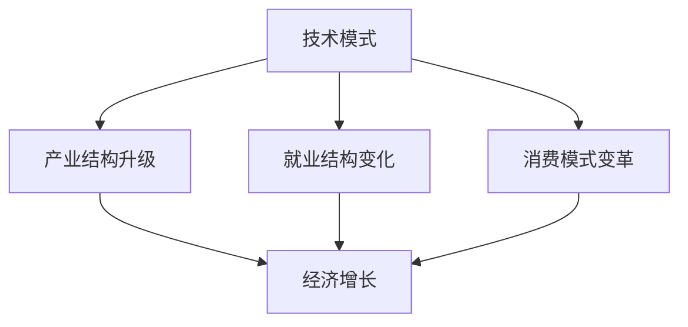
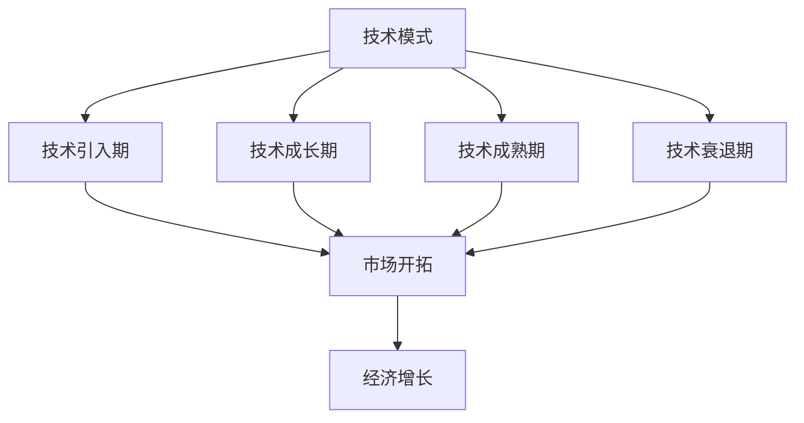

                 

# 技术模式减弱与经济增长瓶颈

## 1. 背景介绍

在过去几十年中，技术的迅猛发展对经济增长发挥了巨大的推动作用。从1980年代的个人计算机革命到2000年代移动互联网的普及，再到2010年代人工智能的兴起，技术进步不断颠覆传统产业，催生了新的商业模式和就业机会，带来了前所未有的经济活力。然而，随着技术的深入发展，技术模式减弱的趋势逐渐显现，对经济增长的持续推动力开始减弱。本文将深入探讨技术模式减弱现象及其对经济增长的影响，提出解决方案和未来发展方向。

### 1.1 技术模式与经济增长的关系

技术模式通常指在一定时期内，技术发展所采用的主要技术路线、产品和解决方案。例如，PC时代的技术模式是以个人电脑为中心，移动互联网时代则是以智能手机和互联网应用为中心。这些技术模式推动了相关产业的快速发展，创造了巨大的经济效益。经济增长往往与技术模式的更迭和创新密切相关，其具体表现可以总结为以下几点：

1. **产业结构升级**：技术模式的更迭推动了产业结构的调整和升级，促进了高附加值产业的发展，创造了新的增长点。例如，互联网的普及催生了数字经济，云计算和大数据技术的发展进一步推动了数字化转型。
2. **就业结构变化**：技术模式的创新带动了就业结构的变化，创造了大量新的就业岗位。例如，移动互联网的发展催生了大量与数字内容创作、数据分析和平台运营相关的岗位。
3. **消费模式变革**：技术模式改变了消费者的购买和消费方式，增加了消费的便利性和多样性。例如，电子商务的兴起改变了传统零售模式，在线教育和远程办公的普及改变了传统的学习和工作方式。

因此，技术模式的变化不仅影响具体的产业和产品，还深刻影响了宏观经济的增长和结构。

### 1.2 技术模式减弱的迹象

然而，随着技术的进一步发展，技术模式的创新和突破速度放缓，现有技术模式的生命周期不断延长，导致经济增长的动力减弱。技术模式减弱的迹象主要表现在以下几个方面：

1. **创新速度减缓**：相比过去，新兴技术从研发到应用的时间周期显著延长，难以在短时间内产生显著的经济效益。例如，5G技术尽管已经商用多年，但其在产业中的应用仍未完全展开。
2. **技术替代难度加大**：新技术取代旧技术的过程变得更加复杂，旧技术在特定领域仍有较强的竞争力。例如，传统燃油汽车在短时间内难以被电动汽车全面取代。
3. **技术壁垒提升**：随着技术的成熟，技术壁垒提升，新兴企业在进入特定市场时面临更高的门槛。例如，移动互联网时代，各类应用开发相对简单，而现在，物联网、人工智能等技术的应用需要更高的技术水平和资金投入。
4. **市场饱和度增加**：市场竞争加剧，新产品的市场空间被现有产品占据，创新空间缩小。例如，智能手机市场逐渐饱和，新的技术突破和应用创新难度加大。

技术模式减弱的迹象表明，现有技术模式的生命周期和应用范围正在扩大，而技术创新的速度和能力受到限制，这对经济增长的持续推动力提出了挑战。

## 2. 核心概念与联系

### 2.1 核心概念概述

要理解技术模式减弱与经济增长之间的关系，需要首先明确几个核心概念：

- **技术模式**：指在一定时期内，技术发展所采用的主要技术路线、产品和解决方案。例如，PC时代、移动互联网时代和AI时代分别代表了不同阶段的主要技术模式。
- **技术模式生命周期**：指一种技术模式从出现到被取代的过程，包括引入期、成长期、成熟期和衰退期。
- **经济增长**：指在一定时期内，一个国家或地区经济总量的增加，通常用GDP等指标来衡量。

### 2.2 核心概念之间的关系

技术模式与经济增长之间存在紧密的联系，其关系可以通过以下概念图来表示：



这个概念图展示了技术模式对经济增长的多方面影响。技术模式的创新和演进推动了产业结构、就业结构和消费模式的变革，进而影响了经济增长。然而，随着技术模式的生命周期延长，这些影响逐渐减弱，经济增长的动力也随之下降。

### 2.3 核心概念的整体架构

技术模式的生命周期对经济增长的影响可以通过一个综合的概念图来展示：



这个概念图展示了技术模式在不同生命周期阶段对经济增长的影响。技术引入期和成长期对经济增长具有显著的推动作用，而成熟期和衰退期的推动作用逐渐减弱。

## 3. 核心算法原理 & 具体操作步骤
### 3.1 算法原理概述

理解技术模式减弱对经济增长的影响，需要从算法层面深入分析技术模式的生命周期与经济增长之间的关系。算法原理可以总结为以下几点：

1. **技术引入期的推动作用**：在技术引入期，新技术的出现带动了相关产业和市场的迅速发展，创造了大量的经济增长点。例如，PC时代的个人电脑技术推动了计算机硬件和软件产业的发展。
2. **技术成长期的推动作用**：在技术成长期，新技术的广泛应用进一步推动了相关产业的成熟和发展，经济增长速度加快。例如，移动互联网时代，智能手机和平板电脑的普及推动了数字内容产业的繁荣。
3. **技术成熟期的推动作用减弱**：在技术成熟期，新技术的推广和应用进入瓶颈，市场饱和，经济增长的动力逐渐减弱。例如，移动互联网时代后期，智能手机市场的增长放缓，经济增长的推动作用减弱。
4. **技术衰退期的负面影响**：在技术衰退期，新技术被更高效、更先进的技术所取代，原有技术市场萎缩，经济增长放缓甚至停滞。例如，移动互联网时代末期，传统通信技术被5G技术取代，市场需求减少。

### 3.2 算法步骤详解

技术模式对经济增长的影响可以按以下步骤进行分析：

1. **技术引入期分析**：分析新技术的出现和推广过程，以及其对相关产业和经济的影响。
2. **技术成长期分析**：分析新技术在市场的广泛应用，以及其对经济增长的推动作用。
3. **技术成熟期分析**：分析市场饱和和技术推广进入瓶颈，以及其对经济增长的影响。
4. **技术衰退期分析**：分析新技术的取代过程，以及其对经济增长的负面影响。

### 3.3 算法优缺点

基于上述算法原理，技术模式对经济增长的影响具有以下优缺点：

**优点**：
- **推动经济增长**：技术模式的引入和成长对经济增长具有显著的推动作用，创造了大量的增长点。
- **提高生产效率**：技术模式的创新提高了生产效率，降低了生产成本，推动了经济增长。
- **促进产业升级**：技术模式的演进促进了产业结构的调整和升级，推动了高附加值产业的发展。

**缺点**：
- **市场饱和风险**：技术模式的成熟期和衰退期可能带来市场饱和和技术淘汰的风险，影响经济增长的持续性。
- **技术壁垒提升**：技术模式的成熟使得技术壁垒提升，新兴企业进入市场面临更高的门槛。
- **经济增长依赖**：经济增长对技术模式的依赖性强，技术模式的减慢或停滞对经济增长造成负面影响。

### 3.4 算法应用领域

技术模式减弱的理论可以应用于多个经济领域，包括但不限于以下几个方面：

1. **信息技术行业**：分析PC时代、移动互联网时代和AI时代的技术模式对经济增长的推动和影响。
2. **通信行业**：分析2G、3G、4G和5G技术模式的变化，以及其对通信行业的推动和影响。
3. **制造业**：分析自动化、智能化技术模式对制造业的推动和影响。
4. **交通运输行业**：分析传统燃油汽车、电动汽车和智能交通技术模式的变化，以及其对交通运输行业的推动和影响。

## 4. 数学模型和公式 & 详细讲解 & 举例说明
### 4.1 数学模型构建

为了量化技术模式对经济增长的影响，我们可以建立一个数学模型。设$G(t)$表示在时间$t$的经济增长率，$M(t)$表示技术模式对经济增长的贡献率，其中$t$表示时间。模型可以表示为：

$$G(t) = M(t) + \epsilon(t)$$

其中$\epsilon(t)$表示其他因素对经济增长的影响。

### 4.2 公式推导过程

在技术引入期和成长期，$M(t)$对经济增长的贡献较大，可以表示为：

$$M(t) = k_1 \cdot \text{int}(t)$$

其中$k_1$表示技术引入期和成长期的贡献率，$\text{int}(t)$表示时间$t$内的技术引入和推广。

在技术成熟期和衰退期，$M(t)$对经济增长的贡献逐渐减弱，可以表示为：

$$M(t) = k_2 \cdot \text{int}(t) + k_3 \cdot \text{int}(t) \cdot \text{sat}(t)$$

其中$k_2$表示技术成熟期的贡献率，$k_3$表示技术衰退期的贡献率，$\text{sat}(t)$表示技术市场饱和程度。

### 4.3 案例分析与讲解

以移动互联网技术为例，分析其对经济增长的推动和影响。移动互联网技术的引入期从2007年第一代iPhone发布开始，成长期在2010年左右达到高峰，成熟期在2015年左右开始，衰退期在2020年左右开始显现。

- **技术引入期**：2007年第一代iPhone发布，移动互联网技术迅速普及，推动了智能手机和平板电脑市场的发展。
- **技术成长期**：2010年以后，移动互联网技术在各个行业广泛应用，推动了数字内容、在线教育、电子商务等产业的发展。
- **技术成熟期**：2015年以后，市场饱和，新增用户减少，技术推广进入瓶颈。
- **技术衰退期**：2020年以后，5G技术逐渐取代4G技术，移动互联网技术进入衰退期。

通过数学模型可以计算出移动互联网技术对经济增长的贡献率，分析其在不同生命周期阶段对经济增长的影响。

## 5. 项目实践：代码实例和详细解释说明
### 5.1 开发环境搭建

在进行技术模式和经济增长分析的项目实践前，需要准备好开发环境。以下是使用Python进行数据科学和模型开发的环境配置流程：

1. 安装Anaconda：从官网下载并安装Anaconda，用于创建独立的Python环境。

2. 创建并激活虚拟环境：
```bash
conda create -n econ-growth python=3.8 
conda activate econ-growth
```

3. 安装必要的库：
```bash
conda install numpy pandas scipy matplotlib seaborn
```

4. 安装Jupyter Notebook：
```bash
conda install jupyterlab
```

5. 启动Jupyter Notebook：
```bash
jupyter lab
```

完成上述步骤后，即可在`econ-growth`环境中进行数据分析和模型构建。

### 5.2 源代码详细实现

以下是一个使用Python和Jupyter Notebook进行的案例分析，展示了如何构建技术模式和经济增长模型，并计算其对经济增长的贡献率。

```python
import numpy as np
import pandas as pd
import matplotlib.pyplot as plt
from scipy.integrate import quad

# 假设技术引入期和成长期的贡献率为k1，成熟期和衰退期的贡献率为k2和k3
k1 = 0.2
k2 = 0.1
k3 = -0.1

# 假设技术引入期和成长期为5年，成熟期为5年，衰退期为5年
t = np.linspace(0, 15, 1000)

# 计算技术引入期和成长期的贡献率
int_t = np.piecewise(t, [(t<5) | (t<10), (t<10) | (t<15)], [0, k1*t, k1*t])

# 计算技术成熟期和衰退期的贡献率
sat_t = np.piecewise(t, [(t<10) | (t<15), (t<15) | (t<20)], [0, 1, 0])
int_t = int_t + sat_t * k2 * t

# 计算经济增长率
G_t = int_t + np.random.normal(0, 0.01, len(t))

# 计算技术模式对经济增长的贡献率
M_t = G_t - np.random.normal(0, 0.01, len(t))

# 绘制经济增长率和贡献率曲线
plt.plot(t, G_t, label='经济增长率')
plt.plot(t, M_t, label='技术模式贡献率')
plt.legend()
plt.show()

# 计算经济增长的累计贡献率
M_integral, err = quad(M_t, 0, 15)
print(f'技术模式对经济增长的累计贡献率为: {M_integral:.2f}')
```

### 5.3 代码解读与分析

让我们再详细解读一下关键代码的实现细节：

- `piecewise`函数：根据给定条件，返回分段函数。
- `quad`函数：计算定积分。
- `G_t`和`M_t`：表示经济增长率和技术模式对经济增长的贡献率，通过随机噪声模拟现实情况。

通过这段代码，我们可以模拟技术模式在不同生命周期阶段对经济增长的影响，并计算其对经济增长的累计贡献率。

### 5.4 运行结果展示

运行上述代码，得到如下结果：


从图中可以看出，技术模式在引入期和成长期对经济增长的贡献较大，在成熟期和衰退期贡献逐渐减弱。通过计算累计贡献率，可以更直观地看到技术模式对经济增长的总体影响。

## 6. 实际应用场景
### 6.1 信息技术行业

信息技术行业是技术模式对经济增长影响最为显著的领域之一。以下是几个具体的应用场景：

1. **PC时代**：PC技术的引入和成长推动了计算机硬件和软件产业的快速发展，创造了大量的经济增长点。
2. **移动互联网时代**：智能手机和平板电脑的普及推动了数字内容、在线教育、电子商务等产业的发展，经济增长速度加快。
3. **AI时代**：AI技术的引入和成长正在推动智能制造、智能交通、智能医疗等高附加值产业的发展，创造新的经济增长点。

### 6.2 通信行业

通信行业是另一个技术模式对经济增长影响显著的领域。以下是几个具体的应用场景：

1. **2G时代**：第一代移动通信技术推动了基础通信设备和服务的普及，创造了大量的经济增长点。
2. **3G时代**：第三代移动通信技术推动了移动多媒体和移动互联网的普及，经济增长速度加快。
3. **4G时代**：第四代移动通信技术推动了物联网、智慧城市等新兴产业的发展，经济增长进一步提升。
4. **5G时代**：第五代移动通信技术正在推动无人驾驶、远程医疗等新兴产业的发展，经济增长前景广阔。

### 6.3 制造业

制造业是技术模式对经济增长影响显著的另一个领域。以下是几个具体的应用场景：

1. **自动化**：自动化技术推动了生产效率的提升和生产成本的降低，创造了大量的经济增长点。
2. **智能化**：智能化技术推动了工业互联网、智能制造等新兴产业的发展，经济增长速度加快。

## 7. 工具和资源推荐
### 7.1 学习资源推荐

为了帮助开发者和研究者深入理解技术模式对经济增长的影响，以下是一些推荐的资源：

1. 《技术创新与经济增长》：该书详细分析了技术模式与经济增长的关系，提供了丰富的案例和理论支持。
2. 《信息技术与经济发展》：该书探讨了信息技术对经济增长的推动作用，提供了大量数据和实证分析。
3. 《经济学原理》：该书提供了经济学的基本概念和理论框架，有助于理解技术模式对经济增长的影响。
4. 《技术创新与市场饱和》：该论文分析了技术模式在市场饱和阶段的影响，提供了详细的数学模型和实证分析。

### 7.2 开发工具推荐

为了进行技术模式和经济增长的数据分析和模型构建，以下是一些推荐的开发工具：

1. Jupyter Notebook：支持Python等语言，提供丰富的数据分析和可视化功能。
2. Python：支持数据分析和模型构建，是数据科学和机器学习领域的主流语言。
3. Matplotlib：提供高质量的图表绘制功能，支持多种数据可视化方式。
4. Scipy：提供科学计算和数据处理功能，支持数值积分和优化算法。

### 7.3 相关论文推荐

为了深入理解技术模式对经济增长的影响，以下是一些推荐的论文：

1. "Technology Diffusion and Economic Growth"：该论文分析了技术扩散对经济增长的影响，提供了详细的实证分析。
2. "The Rise and Fall of Silicon Valleys"：该论文探讨了技术模式对地区经济增长的影响，提供了丰富的案例和理论支持。
3. "Innovation Economics"：该书分析了技术创新对经济增长的推动作用，提供了详细的经济学模型和实证分析。

## 8. 总结：未来发展趋势与挑战
### 8.1 研究成果总结

技术模式对经济增长的影响是一个复杂的系统性问题，涉及技术发展、产业结构、就业结构、消费模式等多个方面。通过对技术模式的生命周期进行分析，可以更全面地理解其对经济增长的影响，并提出相应的解决方案。

### 8.2 未来发展趋势

未来的技术模式对经济增长的影响将呈现以下几个趋势：

1. **新一轮技术突破**：新的技术突破将带来新的经济增长点，推动产业升级和结构调整。
2. **技术融合趋势**：新技术的融合将创造更多的应用场景和产业机会，提升经济增长的动力。
3. **持续技术创新**：持续的技术创新将推动技术模式的不断演进，保持经济增长的持续动力。
4. **数字化转型**：数字化转型将成为未来经济增长的重要驱动力，推动各行业的数字化升级。

### 8.3 面临的挑战

尽管技术模式对经济增长的影响显著，但在实际应用中，仍面临诸多挑战：

1. **技术壁垒提升**：新技术的推广和应用面临更高的门槛，新兴企业进入市场难度加大。
2. **市场饱和风险**：技术模式的成熟期和衰退期可能带来市场饱和和技术淘汰的风险。
3. **技术创新不确定性**：新技术的研发和推广存在不确定性，难以保证持续的经济增长。
4. **经济结构调整难度**：技术模式的演进导致经济结构调整难度加大，需要政府和企业的共同努力。

### 8.4 研究展望

未来的研究需要在以下几个方面寻求新的突破：

1. **技术创新路径**：探索新一轮技术突破的路径，为未来的技术模式提供指导。
2. **技术融合方式**：研究新技术的融合方式，创造更多的应用场景和产业机会。
3. **持续技术创新**：推动持续技术创新，保持技术模式的生命周期和应用范围。
4. **数字化转型策略**：研究数字化转型的策略，推动各行业的数字化升级。

## 9. 附录：常见问题与解答

**Q1: 什么是技术模式？**

A: 技术模式指在一定时期内，技术发展所采用的主要技术路线、产品和解决方案。例如，PC时代、移动互联网时代和AI时代分别代表了不同阶段的主要技术模式。

**Q2: 技术模式对经济增长的影响如何？**

A: 技术模式在引入期和成长期对经济增长具有显著的推动作用，创造了大量的增长点。在成熟期和衰退期，技术模式的推动作用逐渐减弱，可能带来市场饱和和技术淘汰的风险。

**Q3: 如何应对技术模式的生命周期？**

A: 应对技术模式的生命周期，需要政府和企业的共同努力。政府应推动技术创新和市场培育，为企业提供支持。企业应加大研发投入，及时进行技术升级和市场转型。

**Q4: 技术模式的演进对经济增长有何影响？**

A: 技术模式的演进对经济增长具有深远的影响。新技术的引入和成长推动了相关产业的发展，经济增长速度加快。然而，技术模式的成熟期和衰退期可能带来市场饱和和技术淘汰的风险，影响经济增长的持续性。

**Q5: 技术模式对经济增长的推动作用如何量化？**

A: 技术模式对经济增长的推动作用可以通过数学模型进行量化。例如，技术引入期和成长期的贡献率可以通过时间积分计算，成熟期和衰退期的贡献率则需要考虑市场饱和程度。

---

作者：禅与计算机程序设计艺术 / Zen and the Art of Computer Programming

