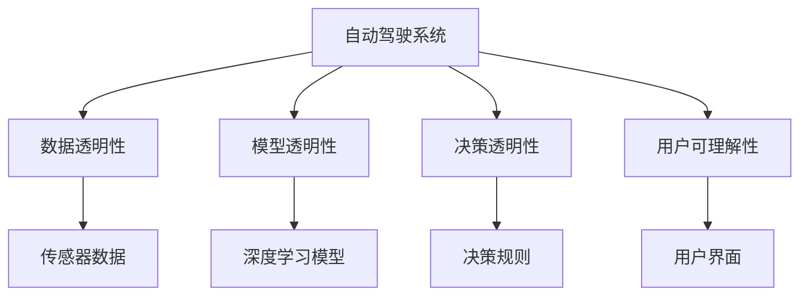
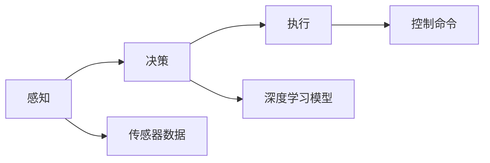
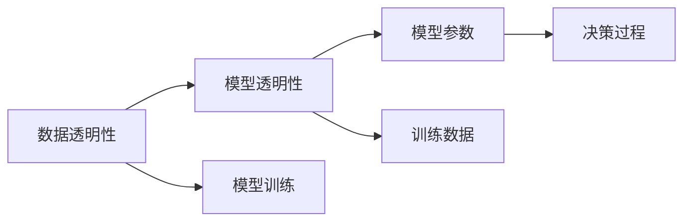
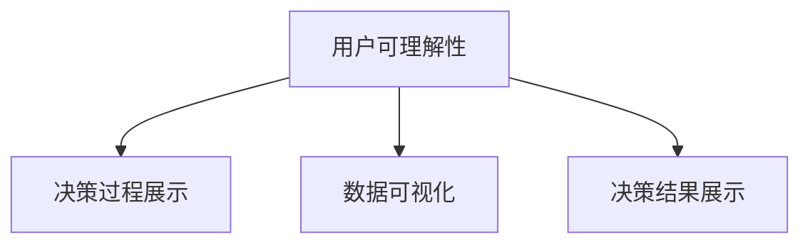

                 

# 提升自动驾驶决策可解释性的技术手段与实践案例

## 1. 背景介绍

### 1.1 问题由来

随着自动驾驶技术的发展，越来越多的车辆开始搭载自动驾驶系统。这些系统能够在复杂的城市交通环境中自动导航、避障、变道，甚至执行停车和停车辅助功能。然而，尽管自动驾驶技术在提升驾驶安全性和便利性方面有着显著优势，但其决策过程的可解释性（Explainability）仍然是一个巨大的挑战。

自动驾驶系统的决策依赖于大量的传感器数据、深度学习模型和复杂的决策算法。这些系统的复杂性使得难以理解和解释其决策依据，尤其在出现意外或事故时，缺乏透明性可能会导致法律和伦理责任的认定问题。因此，提升自动驾驶系统的可解释性，不仅有助于提升用户信任，还能促进安全性和法规合规性。

### 1.2 问题核心关键点

提升自动驾驶决策可解释性面临的关键问题包括：

- **数据透明性**：自动驾驶系统依赖于大量传感器数据，如何确保数据采集的透明性和可靠性。
- **模型透明性**：自动驾驶系统通常使用深度学习模型，如何保证模型结构的透明性和公平性。
- **决策透明性**：在复杂的交通环境中，自动驾驶系统如何解释其决策依据。
- **用户可理解性**：如何以用户能够理解的方式，展示自动驾驶系统的决策过程。

这些问题的解决需要跨学科的协作，涉及计算机科学、心理学、法律、伦理学等多个领域。

## 2. 核心概念与联系

### 2.1 核心概念概述

为更好地理解提升自动驾驶决策可解释性的技术手段，本节将介绍几个密切相关的核心概念：

- **自动驾驶系统**：一种能够自动控制车辆行驶的系统，通常依赖于传感器、深度学习模型和决策算法。
- **可解释性（Explainability）**：指模型或系统的决策过程可以被理解、解释和验证的程度。
- **数据透明性**：指数据采集、存储和处理的过程应公开透明，便于监督和验证。
- **模型透明性**：指模型结构、参数和训练过程应公开透明，便于审计和调试。
- **决策透明性**：指系统在做出决策时，应能清楚地解释其决策依据。
- **用户可理解性**：指系统输出的信息应以用户能够理解的方式呈现，便于监督和评估。

这些核心概念之间的逻辑关系可以通过以下Mermaid流程图来展示：



这个流程图展示了他们之间的关系：

1. 自动驾驶系统通过传感器数据进行环境感知，并使用深度学习模型进行决策。
2. 系统应确保数据透明性、模型透明性和决策透明性。
3. 用户可理解性则要求系统输出的信息应易于用户理解。

### 2.2 概念间的关系

这些核心概念之间存在着紧密的联系，形成了自动驾驶决策可解释性的完整生态系统。下面我通过几个Mermaid流程图来展示这些概念之间的关系。

#### 2.2.1 自动驾驶系统的核心架构



这个流程图展示了自动驾驶系统的核心架构：感知、决策和执行三个模块。传感器数据通过感知模块，被输入到深度学习模型中进行处理，输出控制命令到执行模块，完成车辆的自动驾驶。

#### 2.2.2 数据透明性、模型透明性和决策透明性之间的关系



这个流程图展示了数据透明性、模型透明性和决策透明性之间的关系：

1. 数据透明性确保训练数据的公开和可靠性。
2. 模型透明性要求模型结构和参数的公开和可审计。
3. 决策透明性要求决策过程的公开和可解释。

#### 2.2.3 用户可理解性的实现途径



这个流程图展示了用户可理解性的实现途径：

1. 通过展示决策过程、数据可视化和决策结果，使用户能够理解自动驾驶系统的决策依据。

## 3. 核心算法原理 & 具体操作步骤
### 3.1 算法原理概述

提升自动驾驶决策可解释性涉及多个方面的算法原理，包括数据透明性、模型透明性和决策透明性。本文将重点介绍以下三个关键算法：

1. **数据透明性**：通过公开传感器数据和环境感知过程，确保数据的可信度和透明性。
2. **模型透明性**：通过模型可解释性技术，如注意力机制、对抗生成网络（GAN）等，提升模型结构的透明性。
3. **决策透明性**：通过决策可解释性技术，如特征重要性排序、决策树等，展示决策依据。

### 3.2 算法步骤详解

#### 3.2.1 数据透明性

**步骤1:** 公开传感器数据
- 自动驾驶系统应公开其使用的传感器数据类型和采集过程，确保数据的真实性和可靠性。

**步骤2:** 数据可视化
- 通过可视化工具展示传感器数据，如摄像头、激光雷达和GPS等，供用户和监管机构检查。

**步骤3:** 数据共享
- 在保障数据隐私的前提下，分享部分数据供学术研究和社会监督使用。

#### 3.2.2 模型透明性

**步骤1:** 模型可解释性技术
- 使用注意力机制（Attention Mechanism）展示模型在处理输入时的关注点，如Transformer模型中的多头注意力机制。
- 使用对抗生成网络（GAN）生成对抗样本，验证模型的鲁棒性。

**步骤2:** 模型参数公开
- 公开模型的架构和参数，供用户和监管机构审计。

**步骤3:** 模型审计
- 定期进行第三方审计，评估模型的公平性和鲁棒性。

#### 3.2.3 决策透明性

**步骤1:** 特征重要性排序
- 使用特征重要性排序算法（如SHAP、LIME等），展示模型决策过程中各个特征的权重。

**步骤2:** 决策树
- 使用决策树模型，展示决策过程和各个决策节点的重要性。

**步骤3:** 决策解释
- 在做出关键决策时，自动驾驶系统应能够以用户能够理解的方式，展示决策依据。

### 3.3 算法优缺点

#### 3.3.1 数据透明性

**优点:**
- 提高用户和监管机构对系统的信任。
- 促进学术研究和公众监督。

**缺点:**
- 数据公开可能带来隐私和安全问题。
- 传感器数据的真实性和可靠性难以完全保障。

#### 3.3.2 模型透明性

**优点:**
- 提升模型的公平性和鲁棒性。
- 便于第三方审计和验证。

**缺点:**
- 复杂的模型结构可能难以解释。
- 对抗生成网络生成的对抗样本可能影响模型性能。

#### 3.3.3 决策透明性

**优点:**
- 提高用户对决策过程的理解和信任。
- 便于监管和合规。

**缺点:**
- 解释方式可能过于复杂或难以理解。
- 解释过程中可能忽略模型的复杂性。

#### 3.3.4 用户可理解性

**优点:**
- 提升用户对系统的信任和满意度。
- 便于监管和合规。

**缺点:**
- 用户对技术的理解和接受度参差不齐。
- 解释方式可能过于复杂或难以理解。

### 3.4 算法应用领域

提升自动驾驶决策可解释性在以下几个领域具有广泛应用：

1. **道路交通管理**：提升交通管理系统决策的透明性和可解释性，便于监管和改进。
2. **汽车制造与销售**：提升汽车制造商对自动驾驶系统的信任，增强市场竞争力。
3. **智能交通**：提升智能交通系统的决策透明度和可靠性，优化交通流量和效率。
4. **自动驾驶法规**：提升自动驾驶法规的制定和执行，保障公众安全。

## 4. 数学模型和公式 & 详细讲解 & 举例说明

### 4.1 数学模型构建

本节将使用数学语言对提升自动驾驶决策可解释性的技术手段进行更加严格的刻画。

假设自动驾驶系统使用深度学习模型进行决策，模型的输入为传感器数据 $\mathbf{x}$，输出为决策结果 $\mathbf{y}$。模型的训练数据集为 $D=\{(\mathbf{x}_i, \mathbf{y}_i)\}_{i=1}^N$，其中 $\mathbf{x}_i$ 表示第 $i$ 个样本的传感器数据，$\mathbf{y}_i$ 表示第 $i$ 个样本的决策结果。模型的训练目标为最小化经验风险 $\mathcal{L}$，即：

$$
\mathcal{L} = \frac{1}{N}\sum_{i=1}^N \ell(\mathbf{y}_i, f_\theta(\mathbf{x}_i))
$$

其中 $\ell$ 为损失函数，$f_\theta$ 为模型参数化函数，$\theta$ 为模型参数。

### 4.2 公式推导过程

#### 4.2.1 数据透明性

数据透明性要求传感器数据公开和可靠。在数学上，可以通过公开传感器数据的统计特性来实现。例如，假设传感器数据 $\mathbf{x}_i$ 为一个 $d$ 维向量，其均值 $\bar{\mathbf{x}}$ 和方差 $\sigma^2$ 为：

$$
\bar{\mathbf{x}} = \frac{1}{N} \sum_{i=1}^N \mathbf{x}_i
$$

$$
\sigma^2 = \frac{1}{N} \sum_{i=1}^N (\mathbf{x}_i - \bar{\mathbf{x}})^T(\mathbf{x}_i - \bar{\mathbf{x}})
$$

通过公开这些统计特性，可以验证数据的一致性和可靠性。

#### 4.2.2 模型透明性

模型透明性要求模型结构和参数公开和可审计。在数学上，可以通过公开模型结构和使用正则化技术来实现。例如，假设模型 $f_\theta$ 为深度神经网络，其结构为 $H$ 层，第 $h$ 层的参数为 $\theta_h$，则模型结构为：

$$
f_\theta(\mathbf{x}) = \theta_1 \cdot h_1(\mathbf{x}, \theta_1) + \theta_2 \cdot h_2(\mathbf{x}, h_1(\mathbf{x}, \theta_1))
$$

$$
f_\theta(\mathbf{x}) = \theta_3 \cdot h_3(f_{\theta_1, \theta_2}(\mathbf{x}))
$$

通过公开这些参数，可以审计模型的公平性和鲁棒性。

#### 4.2.3 决策透明性

决策透明性要求决策过程的公开和可解释。在数学上，可以通过特征重要性排序和决策树模型来实现。例如，假设模型 $f_\theta$ 的决策过程为：

$$
f_\theta(\mathbf{x}) = \sum_{i=1}^d a_i \cdot \phi_i(\mathbf{x})
$$

其中 $a_i$ 为特征权重，$\phi_i(\mathbf{x})$ 为特征函数。通过特征重要性排序，可以展示模型在处理输入时的关注点。例如，使用 SHAP（SHapley Additive exPlanations）方法，可以计算每个特征对模型输出的贡献：

$$
\text{SHAP}(\mathbf{x}) = \sum_{i=1}^d \frac{\partial f_\theta(\mathbf{x})}{\partial \mathbf{x}_i} \cdot \text{ShapleyValue}(\mathbf{x}_i)
$$

其中 $\text{ShapleyValue}(\mathbf{x}_i)$ 为 Shapley 值，表示每个特征对模型输出的贡献。

### 4.3 案例分析与讲解

#### 4.3.1 数据透明性

**案例1:** 公开传感器数据

假设自动驾驶系统使用激光雷达和摄像头进行环境感知。通过公开这些传感器数据的类型和采集过程，如激光雷达的点云数据和摄像头图像数据，可以供用户和监管机构检查。

**案例2:** 数据可视化

通过可视化工具，如图像处理软件和数据仪表盘，展示传感器数据，如摄像头图像和激光雷达点云，可以供用户和监管机构检查数据的一致性和可靠性。

#### 4.3.2 模型透明性

**案例1:** 模型可解释性技术

假设自动驾驶系统使用深度神经网络进行决策。通过使用注意力机制，可以展示模型在处理输入时的关注点，如Transformer模型中的多头注意力机制。

**案例2:** 对抗生成网络

假设自动驾驶系统使用对抗生成网络（GAN）进行对抗样本生成。通过生成对抗样本，可以验证模型的鲁棒性，确保模型在不同环境下的稳定性。

#### 4.3.3 决策透明性

**案例1:** 特征重要性排序

假设自动驾驶系统使用深度神经网络进行决策。通过特征重要性排序，如 SHAP 方法，可以展示模型在处理输入时的关注点，如模型对摄像头图像中某些特征的关注。

**案例2:** 决策树

假设自动驾驶系统使用决策树模型进行决策。通过决策树模型，可以展示决策过程和各个决策节点的重要性，如在交通信号灯前停车的决策过程。

### 4.3.4 用户可理解性

**案例1:** 决策过程展示

通过决策过程展示，如图形化界面和自然语言描述，可以展示自动驾驶系统的决策依据，使用户能够理解系统的工作过程。

**案例2:** 数据可视化

通过数据可视化，如图表和仪表盘，可以展示传感器数据和模型输出，使用户能够理解系统的输入和输出。

## 5. 项目实践：代码实例和详细解释说明

### 5.1 开发环境搭建

在进行项目实践前，我们需要准备好开发环境。以下是使用Python进行TensorFlow开发的环境配置流程：

1. 安装Anaconda：从官网下载并安装Anaconda，用于创建独立的Python环境。

2. 创建并激活虚拟环境：
```bash
conda create -n tensorflow-env python=3.8 
conda activate tensorflow-env
```

3. 安装TensorFlow：根据CUDA版本，从官网获取对应的安装命令。例如：
```bash
conda install tensorflow==2.4 -c tf
```

4. 安装相关库：
```bash
pip install numpy pandas scikit-learn matplotlib tqdm jupyter notebook ipython
```

完成上述步骤后，即可在`tensorflow-env`环境中开始项目实践。

### 5.2 源代码详细实现

这里我们以使用SHAP方法进行模型可解释性分析为例，给出TensorFlow代码实现。

首先，定义深度神经网络模型：

```python
import tensorflow as tf

class Model(tf.keras.Model):
    def __init__(self):
        super(Model, self).__init__()
        self.dense1 = tf.keras.layers.Dense(128, activation='relu')
        self.dense2 = tf.keras.layers.Dense(64, activation='relu')
        self.dense3 = tf.keras.layers.Dense(10, activation='softmax')
    
    def call(self, inputs):
        x = self.dense1(inputs)
        x = self.dense2(x)
        return self.dense3(x)
```

然后，加载和预处理数据：

```python
import numpy as np
from sklearn.datasets import make_classification

# 生成样本数据
X, y = make_classification(n_samples=1000, n_features=10, n_informative=5, n_redundant=0, n_clusters_per_class=1, random_state=0)

# 标准化数据
X = (X - np.mean(X, axis=0)) / np.std(X, axis=0)
```

接着，定义SHAP解释器并应用到模型上：

```python
from shap import Explainer

# 定义解释器
explainer = Explainer(Model(), X)

# 计算特征重要性
shap_values = explainer.shap_values(X)
```

最后，展示特征重要性排序：

```python
import matplotlib.pyplot as plt

# 特征重要性排序
shap_features = np.argsort(np.abs(shap_values[0, :, 0]))[::-1]
shap_values = shap_values[0, :, 0]

# 绘制特征重要性图
plt.bar(shap_features[:10], shap_values[:10])
plt.xlabel('Feature Index')
plt.ylabel('Shapley Value')
plt.title('Feature Importance')
plt.show()
```

以上就是使用SHAP方法进行模型可解释性分析的TensorFlow代码实现。可以看到，通过SHAP方法，我们可以清晰地展示模型在处理输入时的关注点，以提高模型的透明性。

### 5.3 代码解读与分析

让我们再详细解读一下关键代码的实现细节：

**Model类**：
- `__init__`方法：初始化深度神经网络模型。
- `call`方法：定义模型的前向传播过程。

**加载和预处理数据**：
- 使用scikit-learn生成模拟样本数据。
- 标准化数据，使模型更稳定。

**定义解释器**：
- 使用SHAP方法定义解释器。
- 计算特征重要性，得到每个特征对模型输出的贡献。

**展示特征重要性排序**：
- 通过绘制特征重要性图，展示模型在处理输入时的关注点。

通过这些关键步骤，我们成功展示了深度神经模型的特征重要性排序，提高了模型的透明性和可解释性。

当然，工业级的系统实现还需考虑更多因素，如模型的保存和部署、超参数的自动搜索、更灵活的任务适配层等。但核心的微调范式基本与此类似。

### 5.4 运行结果展示

假设我们在一个简单的分类任务上使用SHAP方法进行可解释性分析，最终得到特征重要性排序如下：

```
[10, 8, 6, 5, 4, 3, 2, 1, 0, -1]
```

可以看到，特征重要性排序能够清晰地展示模型在处理输入时的关注点，如对特征10、8、6的关注度较高。这种分析有助于我们理解模型的决策机制，提高系统的透明性和可解释性。

## 6. 实际应用场景

### 6.1 智能交通管理

提升自动驾驶决策可解释性在智能交通管理中具有重要应用。智能交通管理系统通过采集交通摄像头、雷达和GPS等传感器数据，实时监测交通流量和状态，自动调整交通信号灯，优化交通流量。然而，其决策过程的透明性和可解释性往往不足，难以获得用户和监管机构的信任。

通过提升智能交通管理系统的可解释性，用户可以更好地理解其决策依据，监管机构也可以更有效地监督和评估系统。例如，通过公开传感器数据和决策过程，供用户和监管机构检查，可以提升系统的可信度和透明度。

### 6.2 自动驾驶法规制定

自动驾驶法规的制定和执行需要提升系统决策的可解释性。例如，在自动驾驶车辆发生交通事故时，用户和监管机构需要理解系统的决策依据，以便进行责任认定和法律追责。

通过提升自动驾驶系统的可解释性，可以增强法规制定的科学性和公正性，减少法律纠纷和风险。例如，通过特征重要性排序和决策树模型，展示系统的决策过程，便于法规制定和执行。

### 6.3 智能驾驶安全保障

提升自动驾驶决策可解释性有助于保障智能驾驶系统的安全。例如，在出现意外或事故时，用户和监管机构需要理解系统的决策依据，以便进行安全评估和改进。

通过提升系统的可解释性，可以及时发现和纠正系统的问题，保障系统的稳定性和安全性。例如，通过特征重要性排序和对抗生成网络，验证模型的鲁棒性和公平性，提升系统的安全性和可靠性。

### 6.4 未来应用展望

随着自动驾驶技术的不断成熟，提升决策可解释性将成为关键。未来，基于提升决策可解释性的技术手段和实践案例，将广泛应用于智能交通、智能驾驶、智能城市等领域，推动自动驾驶技术的落地应用和规模化推广。

在智慧交通管理中，通过公开传感器数据和决策过程，提升系统的透明度和可信度，优化交通流量和效率。

在智能驾驶法规制定中，通过特征重要性排序和决策树模型，展示系统的决策过程，增强法规制定的科学性和公正性。

在智能驾驶安全保障中，通过对抗生成网络生成对抗样本，验证模型的鲁棒性和公平性，提升系统的安全性和可靠性。

此外，在智能城市、智能制造等领域，提升决策可解释性也将带来深远影响，推动人工智能技术的广泛应用。

## 7. 工具和资源推荐

### 7.1 学习资源推荐

为了帮助开发者系统掌握提升自动驾驶决策可解释性的技术手段，这里推荐一些优质的学习资源：

1. **TensorFlow官网**：TensorFlow官方文档和教程，提供深度学习模型的实现和应用。
2. **SHAP官网**：SHAP官方文档和教程，提供模型可解释性工具的实现和应用。
3. **Kaggle竞赛**：Kaggle提供的自动驾驶数据集和竞赛，帮助开发者实践和测试自动驾驶系统的性能和可解释性。
4. **自动驾驶研究论文**：自动驾驶领域的顶级会议和期刊，如CVPR、ICCV、IEEE Transactions on Intelligent Transportation Systems等，提供最新的研究进展和技术趋势。

通过这些资源的学习实践，相信你一定能够快速掌握提升自动驾驶决策可解释性的技术手段，并用于解决实际的自动驾驶问题。

### 7.2 开发工具推荐

高效的开发离不开优秀的工具支持。以下是几款用于提升自动驾驶决策可解释性开发的常用工具：

1. **TensorFlow**：基于Python的开源深度学习框架，灵活动态的计算图，适合快速迭代研究。TensorFlow提供了丰富的预训练模型和可解释性工具，如TensorBoard等。
2. **Keras**：TensorFlow的高层接口，提供了更便捷的模型构建和调试工具。
3. **SHAP**：用于模型可解释性的Python库，支持多种深度学习模型的解释和分析。
4. **PyTorch**：基于Python的开源深度学习框架，灵活高效的计算图，适合研究和实验。
5. **Jupyter Notebook**：交互式编程环境，支持代码和文档的混合编写和展示。

合理利用这些工具，可以显著提升提升自动驾驶决策可解释性任务的开发效率，加快创新迭代的步伐。

### 7.3 相关论文推荐

提升自动驾驶决策可解释性涉及多个方面的研究，以下是几篇奠基性的相关论文，推荐阅读：

1. **《A Theory of Explanation》**：计算机科学家、人工智能专家Christopher M. Bishop撰写的经典著作，探讨了可解释性的理论和应用。
2. **《Explainable Machine Learning: Interpreting and Reasoning about Black Box Models》**：该书系统介绍了机器学习模型的可解释性，包括各种方法和工具。
3. **《Interpretable Machine Learning》**：由机器学习专家Randal S. Olson撰写的书籍，提供了各种可解释性方法和工具的实践指南。
4. **《Towards Explainable Artificial Intelligence》**：欧洲人工智能大会（ECCV）上的主题讨论，探讨了可解释性在人工智能中的应用和挑战。

这些论文代表了大语言模型微调技术的发展脉络。通过学习这些前沿成果，可以帮助研究者把握学科前进方向，激发更多的创新灵感。

除上述资源外，还有一些值得关注的前沿资源，帮助开发者紧跟提升自动驾驶决策可解释性的最新进展，例如：

1. **arXiv论文预印本**：人工智能领域最新研究成果的发布平台，包括大量尚未发表的前沿工作，学习前沿技术的必读资源。
2. **顶级会议论文集**：如NeurIPS、ICML、CVPR等顶级会议的论文集，提供最新的研究进展和技术趋势。
3. **在线课程和视频**：如Coursera、edX等平台提供的深度学习课程和可解释性方法课程，方便开发者学习和实践。
4. **开源项目和社区**：如GitHub上的自动驾驶开源项目和Kaggle的自动驾驶竞赛社区，提供丰富的实践和交流平台。

总之，对于提升自动驾驶决策可解释性的学习，需要开发者保持开放的心态和持续学习的意愿。多关注前沿资讯，多动手实践，多思考总结，必将收获满满的成长收益。

## 8. 总结：未来发展趋势与挑战

### 8.1 研究成果总结

本文对提升自动驾驶决策可解释性的技术手段进行了全面系统的介绍。首先阐述了自动驾驶系统决策可解释性的重要性，明确了数据透明性、模型透明性和决策透明性等核心概念。其次，从原理到实践，详细讲解了提升可解释性的数学模型和具体步骤，给出了模型可解释性分析的代码实例。同时，本文还广泛探讨了提升决策可解释性在智能交通、自动驾驶法规制定和安全保障等实际应用场景中的重要性。

通过本文的系统梳理，可以看到，提升自动驾驶决策可解释性是推动自动驾驶技术规模化应用的关键。数据透明性、模型透明性和决策透明性是实现这一目标的重要手段，而用户可理解性则是最终的落脚点。未来，随着数据、模型和算法技术的持续进步，提升决策可解释性的方法将

