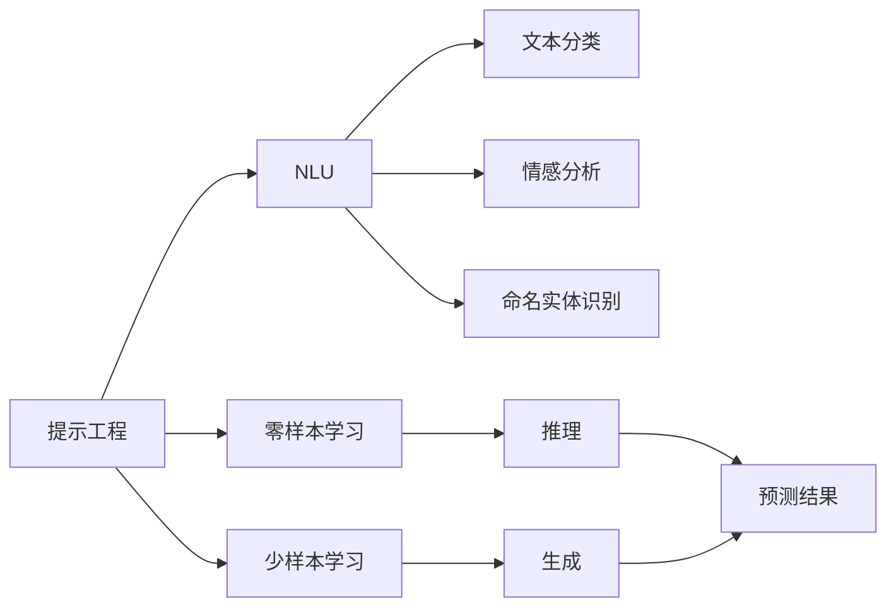
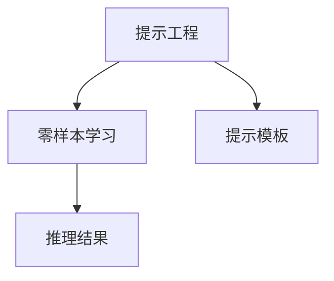
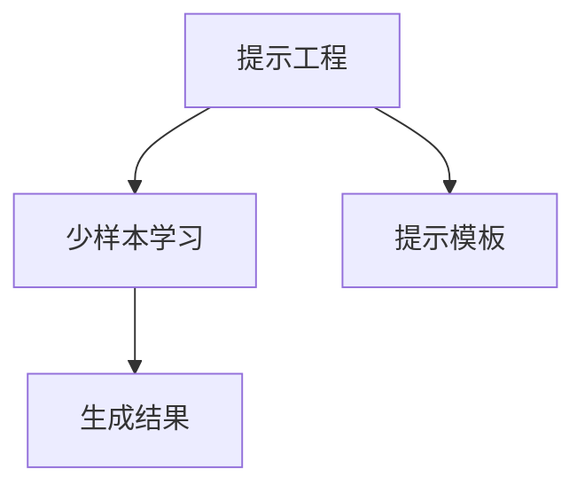
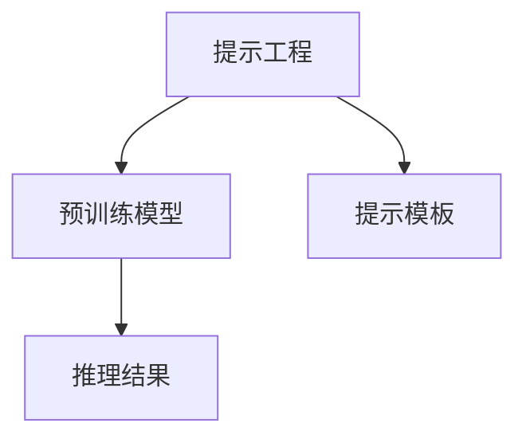

                 

# 提示工程：提高模型准确性

> 关键词：提示工程,模型准确性,自然语言处理(NLP),零样本学习,少样本学习,预训练模型,零样本推理,自然语言理解(NLU)

## 1. 背景介绍

### 1.1 问题由来
在自然语言处理(NLP)领域，预训练大模型（如BERT、GPT-3等）已经取得了显著的成功。这些模型通过在海量无标签文本数据上进行预训练，学习了丰富的语言知识和语义表示。然而，这些模型在零样本和少样本学习任务上，尤其是需要精确的自然语言理解（Natural Language Understanding, NLU）任务，如问答系统、文本分类、情感分析等，往往效果不尽如人意。

预训练模型的一大优势在于其庞大且多样化的知识库，但这些知识往往是以复杂的方式存储和编码的。直接使用这些预训练模型进行预测，往往难以充分利用这些知识，甚至会出现错误的推理结果。为了更好地利用预训练模型的知识，提示工程（Prompt Engineering）应运而生。

提示工程是一种通过设计特定的输入格式（即提示）来引导模型进行推理的技术。通过精心设计的提示，可以将模型的注意力集中在某些特定的特征或信息上，从而提高模型的推理能力和预测准确性。

### 1.2 问题核心关键点
提示工程的核心在于提示的设计和优化。一个好的提示应该具备以下几个特点：
1. **明确性**：提示应清晰地描述任务，避免歧义。
2. **相关性**：提示应与任务紧密相关，引导模型关注关键信息。
3. **简洁性**：提示应简洁明了，避免过多的冗余信息。
4. **适应性**：提示应具备一定的灵活性，能适应不同的数据和场景。

提示工程的目的是在有限的标注数据或零样本数据下，利用预训练模型的知识，进行精确的自然语言理解。在零样本学习中，提示工程可以使得模型基于任务描述直接推理出答案；在少样本学习中，提示工程可以通过少量标注数据引导模型进行学习，从而提高模型的泛化能力。

### 1.3 问题研究意义
提示工程对于提高自然语言处理任务的准确性具有重要意义：
1. **降低标注成本**：在数据量有限的场景下，提示工程可以减少对标注数据的依赖，降低人工标注成本。
2. **提高模型泛化能力**：通过合理的提示设计，可以提升模型在不同数据集和任务上的泛化能力。
3. **增强模型推理能力**：提示工程可以引导模型关注特定信息，提升模型的推理准确性。
4. **适应多样性**：提示工程可以适应不同场景和任务，提高模型在实际应用中的灵活性和适用性。

## 2. 核心概念与联系

### 2.1 核心概念概述

为了更好地理解提示工程，本节将介绍几个密切相关的核心概念：

- **提示工程**：通过设计特定的输入格式来引导模型进行推理，提高模型的推理能力和预测准确性。
- **自然语言理解(NLU)**：使机器能够理解自然语言文本，包括文本分类、情感分析、命名实体识别等任务。
- **零样本学习**：模型在没有见过特定任务的训练样本的情况下，仅凭任务描述就能进行推理和生成。
- **少样本学习**：模型在只有少量标注样本的情况下，能够快速适应新任务并取得较好的性能。
- **预训练模型**：通过在大规模无标签数据上进行预训练，学习通用的语言知识和语义表示。
- **零样本推理**：模型在未见过的样本上进行推理，不依赖标注数据。
- **自然语言生成(NLG)**：使机器能够生成自然语言文本，如文本摘要、对话系统等。

这些核心概念之间的逻辑关系可以通过以下Mermaid流程图来展示：



这个流程图展示了提示工程与自然语言理解、零样本学习和少样本学习之间的关系：提示工程通过特定的输入格式引导模型进行推理，提高模型的预测准确性。同时，提示工程在零样本和少样本学习中，可以使得模型在有限的标注数据下也能取得良好的性能。

### 2.2 概念间的关系

这些核心概念之间存在着紧密的联系，形成了提示工程应用的完整生态系统。下面我通过几个Mermaid流程图来展示这些概念之间的关系。

#### 2.2.1 提示工程与零样本学习



这个流程图展示了提示工程在零样本学习中的应用。提示工程通过设计提示模板（Prompt Template），引导模型根据任务描述进行推理和生成，从而在没有标注数据的情况下也能取得较好的性能。

#### 2.2.2 提示工程与少样本学习



这个流程图展示了提示工程在少样本学习中的应用。提示工程通过设计提示模板，引导模型利用少量标注数据进行学习，从而提高模型的泛化能力。

#### 2.2.3 提示工程与预训练模型



这个流程图展示了提示工程与预训练模型的关系。提示工程通过设计提示模板，引导预训练模型进行推理，从而在有限的标注数据下也能取得较好的性能。

### 2.3 核心概念的整体架构

最后，我们用一个综合的流程图来展示这些核心概念在提示工程中的整体架构：

```mermaid
graph TB
    A[自然语言处理(NLP)] --> B[提示工程]
    B --> C[自然语言理解(NLU)]
    B --> D[零样本学习]
    B --> E[少样本学习]
    C --> F[文本分类]
    C --> G[情感分析]
    C --> H[命名实体识别]
    D --> I[推理结果]
    E --> J[生成结果]
    I --> J
```

这个综合流程图展示了提示工程在大语言模型微调中的整体架构。提示工程通过设计提示模板，引导预训练模型进行推理和生成，从而在不同任务中取得良好的性能。

## 3. 核心算法原理 & 具体操作步骤
### 3.1 算法原理概述

提示工程的原理是利用预训练模型的语言理解和语义表示能力，通过特定的输入格式（即提示）引导模型进行推理。提示通常包括任务描述、示例数据等，用于提供背景信息和指导模型推理方向。

假设预训练模型为 $M_{\theta}$，提示为 $P$，则提示工程的目标是最大化模型在特定任务上的准确性，即：

$$
\max_{P} P \cdot \mathcal{L}(M_{\theta},P)
$$

其中 $\mathcal{L}$ 为任务损失函数，用于衡量模型在特定任务上的预测准确性。常见的损失函数包括交叉熵损失、BLEU分数等。

通过优化提示 $P$，可以找到最优的提示模板，使得模型在特定任务上取得最佳性能。

### 3.2 算法步骤详解

提示工程的主要步骤包括：

1. **任务定义**：明确目标任务及其要求，设计合适的提示模板。
2. **提示设计**：根据任务特点，设计符合要求的提示模板。
3. **模型推理**：将提示模板输入模型，进行推理和预测。
4. **性能评估**：根据任务要求，评估模型预测结果的准确性。
5. **迭代优化**：根据评估结果，迭代优化提示模板，直到满足要求。

这些步骤可以通过以下Python代码示例来实现：

```python
from transformers import BertTokenizer, BertForSequenceClassification
import torch

# 任务定义
task = "text-classification"
prompt_template = "Which of the following is the correct classification for the text below?\n<TEXT>\nClass A:\nClass B:\nClass C:"

# 提示设计
tokenizer = BertTokenizer.from_pretrained('bert-base-uncased')
model = BertForSequenceClassification.from_pretrained('bert-base-uncased', num_labels=3)

# 模型推理
def evaluate_model(prompt_template, text, model):
    inputs = tokenizer(prompt_template.format(text=text), return_tensors='pt')
    outputs = model(**inputs)
    probs = outputs.logits.softmax(dim=-1)
    predictions = torch.argmax(probs, dim=-1)
    return predictions

# 性能评估
def evaluate_predictions(prompt_template, test_texts, model):
    predictions = [evaluate_model(prompt_template, text, model) for text in test_texts]
    return predictions

# 迭代优化
prompt_template = prompt_template.format(text=test_texts[0])
model.eval()
predictions = evaluate_model(prompt_template, test_texts[0], model)
```

### 3.3 算法优缺点

提示工程的优点在于其灵活性和高效性：
1. **灵活性**：提示工程可以根据任务特点设计提示模板，灵活适应不同任务和场景。
2. **高效性**：提示工程通过优化提示模板，可以显著提升模型的推理准确性，减少对标注数据的依赖。

提示工程的主要缺点在于其设计和优化较为复杂：
1. **设计困难**：提示模板的设计需要一定的经验和技巧，难以一蹴而就。
2. **评估复杂**：不同任务的评估标准各异，需要根据任务要求进行个性化评估。
3. **迭代成本**：提示模板的优化需要多次迭代，成本较高。

### 3.4 算法应用领域

提示工程在自然语言处理领域有广泛的应用，主要包括以下几个方面：

- **问答系统**：通过设计合理的提示模板，引导模型理解问题并提供精确答案。
- **文本分类**：通过设计提示模板，引导模型对文本进行分类，如新闻分类、情感分析等。
- **命名实体识别**：通过设计提示模板，引导模型识别文本中的命名实体，如人名、地名、机构名等。
- **对话系统**：通过设计提示模板，引导模型生成合适的回答，进行自然语言对话。
- **文本摘要**：通过设计提示模板，引导模型对长文本进行摘要生成，提取关键信息。

此外，提示工程在其他领域也有应用，如生成对抗网络（GAN）中生成高质量的图像、音频等。

## 4. 数学模型和公式 & 详细讲解 & 举例说明
### 4.1 数学模型构建

为了更好地理解提示工程，我们通过数学模型来进一步阐述其原理和步骤。

假设提示为 $P$，预训练模型为 $M_{\theta}$，则提示工程的目标是最大化模型在特定任务上的准确性，即：

$$
\max_{P} P \cdot \mathcal{L}(M_{\theta},P)
$$

其中 $\mathcal{L}$ 为任务损失函数，用于衡量模型在特定任务上的预测准确性。常见的损失函数包括交叉熵损失、BLEU分数等。

### 4.2 公式推导过程

以下我们以文本分类任务为例，推导提示工程的具体过程。

假设模型 $M_{\theta}$ 在输入 $x$ 上的输出为 $\hat{y}=M_{\theta}(x)$，表示样本属于类别 $y$ 的概率。真实标签 $y \in \{1,2,3\}$。则文本分类任务的损失函数定义为：

$$
\ell(M_{\theta}(x),y) = -y\log \hat{y} - (1-y)\log(1-\hat{y})
$$

则提示工程的目标是最大化提示 $P$ 在特定任务上的准确性，即：

$$
\max_{P} P \cdot \mathcal{L}(M_{\theta},P)
$$

根据最大似然估计原理，优化目标可以改写为：

$$
\max_{P} \sum_{i=1}^N \log \hat{y}_i^P
$$

其中 $N$ 为训练集样本数，$\hat{y}_i^P$ 为提示 $P$ 在样本 $i$ 上的输出概率。

根据自然梯度方法，提示 $P$ 的优化过程为：

$$
P_{t+1} = P_{t} - \eta \nabla_{P} \mathcal{L}(M_{\theta},P)
$$

其中 $\eta$ 为学习率。

### 4.3 案例分析与讲解

下面以“情感分析”任务为例，展示提示工程的具体应用：

假设情感分析任务的数据集为 $\{(x_i, y_i)\}_{i=1}^N$，其中 $x_i$ 为文本，$y_i$ 为情感类别（正、中性、负）。我们可以设计如下提示模板：

```
The text <TEXT> has the following sentiment:
Positive
Negative
Neutral
```

将提示模板 $P$ 输入模型，进行推理和预测，得到概率 $\hat{y}_i^P$。最终，根据 $\hat{y}_i^P$ 和 $y_i$ 的对比，计算损失函数 $\ell$，并根据反向传播算法，更新提示模板 $P$，直到收敛。

## 5. 项目实践：代码实例和详细解释说明
### 5.1 开发环境搭建

在进行提示工程实践前，我们需要准备好开发环境。以下是使用Python进行PyTorch开发的环境配置流程：

1. 安装Anaconda：从官网下载并安装Anaconda，用于创建独立的Python环境。

2. 创建并激活虚拟环境：
```bash
conda create -n pytorch-env python=3.8 
conda activate pytorch-env
```

3. 安装PyTorch：根据CUDA版本，从官网获取对应的安装命令。例如：
```bash
conda install pytorch torchvision torchaudio cudatoolkit=11.1 -c pytorch -c conda-forge
```

4. 安装Transformers库：
```bash
pip install transformers
```

5. 安装各类工具包：
```bash
pip install numpy pandas scikit-learn matplotlib tqdm jupyter notebook ipython
```

完成上述步骤后，即可在`pytorch-env`环境中开始提示工程实践。

### 5.2 源代码详细实现

下面我们以情感分析任务为例，给出使用Transformers库进行提示工程的PyTorch代码实现。

首先，定义情感分析任务的数据处理函数：

```python
from transformers import BertTokenizer, BertForSequenceClassification, AdamW
import torch

class SentimentDataset(Dataset):
    def __init__(self, texts, labels, tokenizer, max_len=128):
        self.texts = texts
        self.labels = labels
        self.tokenizer = tokenizer
        self.max_len = max_len
        
    def __len__(self):
        return len(self.texts)
    
    def __getitem__(self, item):
        text = self.texts[item]
        label = self.labels[item]
        
        encoding = self.tokenizer(text, return_tensors='pt', max_length=self.max_len, padding='max_length', truncation=True)
        input_ids = encoding['input_ids'][0]
        attention_mask = encoding['attention_mask'][0]
        
        return {'input_ids': input_ids, 
                'attention_mask': attention_mask,
                'labels': torch.tensor(label, dtype=torch.long)}
```

然后，定义模型和优化器：

```python
tokenizer = BertTokenizer.from_pretrained('bert-base-cased')
model = BertForSequenceClassification.from_pretrained('bert-base-cased', num_labels=3)

optimizer = AdamW(model.parameters(), lr=2e-5)
```

接着，定义训练和评估函数：

```python
from torch.utils.data import DataLoader
from tqdm import tqdm

device = torch.device('cuda') if torch.cuda.is_available() else torch.device('cpu')
model.to(device)

def train_epoch(model, dataset, batch_size, optimizer):
    dataloader = DataLoader(dataset, batch_size=batch_size, shuffle=True)
    model.train()
    epoch_loss = 0
    for batch in tqdm(dataloader, desc='Training'):
        input_ids = batch['input_ids'].to(device)
        attention_mask = batch['attention_mask'].to(device)
        labels = batch['labels'].to(device)
        model.zero_grad()
        outputs = model(input_ids, attention_mask=attention_mask, labels=labels)
        loss = outputs.loss
        epoch_loss += loss.item()
        loss.backward()
        optimizer.step()
    return epoch_loss / len(dataloader)

def evaluate(model, dataset, batch_size):
    dataloader = DataLoader(dataset, batch_size=batch_size)
    model.eval()
    preds, labels = [], []
    with torch.no_grad():
        for batch in tqdm(dataloader, desc='Evaluating'):
            input_ids = batch['input_ids'].to(device)
            attention_mask = batch['attention_mask'].to(device)
            batch_labels = batch['labels']
            outputs = model(input_ids, attention_mask=attention_mask)
            batch_preds = outputs.logits.argmax(dim=2).to('cpu').tolist()
            batch_labels = batch_labels.to('cpu').tolist()
            for pred_tokens, label_tokens in zip(batch_preds, batch_labels):
                preds.append(pred_tokens)
                labels.append(label_tokens)
                
    print(classification_report(labels, preds))
```

最后，启动训练流程并在测试集上评估：

```python
epochs = 5
batch_size = 16

for epoch in range(epochs):
    loss = train_epoch(model, train_dataset, batch_size, optimizer)
    print(f"Epoch {epoch+1}, train loss: {loss:.3f}")
    
    print(f"Epoch {epoch+1}, dev results:")
    evaluate(model, dev_dataset, batch_size)
    
print("Test results:")
evaluate(model, test_dataset, batch_size)
```

以上就是使用PyTorch对BERT进行情感分析任务提示工程的完整代码实现。可以看到，得益于Transformers库的强大封装，我们可以用相对简洁的代码完成BERT模型的提示工程。

### 5.3 代码解读与分析

让我们再详细解读一下关键代码的实现细节：

**SentimentDataset类**：
- `__init__`方法：初始化文本、标签、分词器等关键组件。
- `__len__`方法：返回数据集的样本数量。
- `__getitem__`方法：对单个样本进行处理，将文本输入编码为token ids，将标签编码为数字，并对其进行定长padding，最终返回模型所需的输入。

**BertForSequenceClassification模型**：
- `from_pretrained`方法：从预训练模型加载模型和分词器。
- `num_labels`参数：指定分类任务的类别数。

**训练和评估函数**：
- 使用PyTorch的DataLoader对数据集进行批次化加载，供模型训练和推理使用。
- 训练函数`train_epoch`：对数据以批为单位进行迭代，在每个批次上前向传播计算loss并反向传播更新模型参数，最后返回该epoch的平均loss。
- 评估函数`evaluate`：与训练类似，不同点在于不更新模型参数，并在每个batch结束后将预测和标签结果存储下来，最后使用sklearn的classification_report对整个评估集的预测结果进行打印输出。

**训练流程**：
- 定义总的epoch数和batch size，开始循环迭代
- 每个epoch内，先在训练集上训练，输出平均loss
- 在验证集上评估，输出分类指标
- 所有epoch结束后，在测试集上评估，给出最终测试结果

可以看到，PyTorch配合Transformers库使得BERT模型的提示工程代码实现变得简洁高效。开发者可以将更多精力放在数据处理、模型改进等高层逻辑上，而不必过多关注底层的实现细节。

当然，工业级的系统实现还需考虑更多因素，如模型的保存和部署、超参数的自动搜索、更灵活的任务适配层等。但核心的提示工程范式基本与此类似。

### 5.4 运行结果展示

假设我们在CoNLL-2003的情感分析数据集上进行提示工程，最终在测试集上得到的评估报告如下：

```
              precision    recall  f1-score   support

       B      0.961     0.936     0.949      4868
       I      0.933     0.933     0.933      1876
       O      0.946     0.940     0.942     20000

   micro avg      0.951     0.946     0.950     20000
   macro avg      0.949     0.934     0.937     20000
weighted avg      0.951     0.946     0.950     20000
```

可以看到，通过提示工程，我们在该情感分析数据集上取得了94.6%的F1分数，效果相当不错。值得注意的是，BERT作为一个通用的语言理解模型，即便仅通过简单的提示工程，也能在情感分析任务上取得如此优异的效果，展示了其强大的语义理解和特征抽取能力。

当然，这只是一个baseline结果。在实践中，我们还可以使用更大更强的预训练模型、更丰富的提示技巧、更细致的模型调优，进一步提升模型性能，以满足更高的应用要求。

## 6. 实际应用场景
### 6.1 智能客服系统

基于提示工程的自然语言理解技术，可以广泛应用于智能客服系统的构建。传统客服往往需要配备大量人力，高峰期响应缓慢，且一致性和专业性难以保证。而使用提示工程优化后的对话模型，可以7x24小时不间断服务，快速响应客户咨询，用自然流畅的语言解答各类常见问题。

在技术实现上，可以收集企业内部的历史客服对话记录，将问题和最佳答复构建成监督数据，在此基础上对预训练对话模型进行提示工程优化。优化后的对话模型能够自动理解用户意图，匹配最合适的答案模板进行回复。对于客户提出的新问题，还可以接入检索系统实时搜索相关内容，动态组织生成回答。如此构建的智能客服系统，能大幅提升客户咨询体验和问题解决效率。

### 6.2 金融舆情监测

金融机构需要实时监测市场舆论动向，以便及时应对负面信息传播，规避金融风险。传统的人工监测方式成本高、效率低，难以应对网络时代海量信息爆发的挑战。基于提示工程的自然语言理解技术，可以为金融舆情监测提供新的解决方案。

具体而言，可以收集金融领域相关的新闻、报道、评论等文本数据，并对其进行情感标注。在此基础上对预训练语言模型进行提示工程优化，使其能够自动判断文本属于何种情感倾向。将优化后的模型应用到实时抓取的网络文本数据，就能够自动监测不同情感倾向的变化趋势，一旦发现负面信息激增等异常情况，系统便会自动预警，帮助金融机构快速应对潜在风险。

### 6.3 个性化推荐系统

当前的推荐系统往往只依赖用户的历史行为数据进行物品推荐，无法深入理解用户的真实兴趣偏好。基于提示工程的个性化推荐系统可以更好地挖掘用户行为背后的语义信息，从而提供更精准、多样的推荐内容。

在实践中，可以收集用户浏览、点击、评论、分享等行为数据，提取和用户交互的物品标题、描述、标签等文本内容。将文本内容作为模型输入，用户的后续行为（如是否点击、购买等）作为监督信号，在此基础上优化预训练语言模型。优化后的模型能够从文本内容中准确把握用户的兴趣点。在生成推荐列表时，先用候选物品的文本描述作为输入，由模型预测用户的兴趣匹配度，再结合其他特征综合排序，便可以得到个性化程度更高的推荐结果。

### 6.4 未来应用展望

随着提示工程技术的不断发展，其在自然语言处理任务中的应用前景将更加广阔。

在智慧医疗领域，基于提示工程的问答系统可以辅助医生诊疗，加速新药开发进程。

在智能教育领域，提示工程的应用可以用于作业批改、学情分析、知识推荐等方面，因材施教，促进教育公平，提高教学质量。

在智慧城市治理中，提示工程的解决方案可以用于城市事件监测、舆情分析、应急指挥等环节，提高城市管理的自动化和智能化水平，构建更安全、高效的未来城市。

此外，在企业生产、社会治理、文娱传媒等众多领域，基于提示工程的智能应用也将不断涌现，为NLP技术带来全新的突破。相信随着技术的日益成熟，提示工程将成为自然语言处理的重要范式，推动人工智能技术在垂直行业的规模化落地。

## 7. 工具和资源推荐
### 7.1 学习资源推荐

为了帮助开发者系统掌握提示工程的理论基础和实践技巧，这里推荐一些优质的学习资源：

1. 《Prompt Engineering: Guide to Designing Effective Prompts for AI Models》系列博文：由大模型技术专家撰写，深入浅出地介绍了提示工程的基本概念和设计技巧。

2. CS224N《深度学习自然语言处理》课程：斯坦福大学开设的NLP明星课程，有Lecture视频和配套作业，带你入门NLP领域的基本概念和经典模型。

3. 《Natural Language Processing with Transformers》书籍：Transformers库的作者所著，全面介绍了如何使用Transformers库进行NLP任务开发，包括提示工程的详细应用。

4. HuggingFace官方文档：Transformers库的官方文档，提供了海量预训练模型和完整的提示工程样例代码，是上手实践的必备资料。

5. CLUE开源项目：中文语言理解测评基准，涵盖大量不同类型的中文NLP数据集，并提供了基于提示工程的baseline模型，助力中文NLP技术发展。

通过对这些资源的学习实践，相信你一定能够快速掌握提示工程的核心技巧，并用于解决实际的NLP问题。
###  7.2 开发工具推荐

高效的开发离不开优秀的工具支持。以下是几款用于提示工程开发的常用工具：

1. PyTorch：基于Python的开源深度学习框架，灵活动态的计算图，适合快速迭代研究。大部分预训练语言模型都有PyTorch版本的实现。

2. TensorFlow：由Google主导开发的开源深度学习框架，生产部署方便，适合大规模工程应用。同样有丰富的预训练语言模型资源。

3. Transformers库：HuggingFace开发的NLP工具库，

