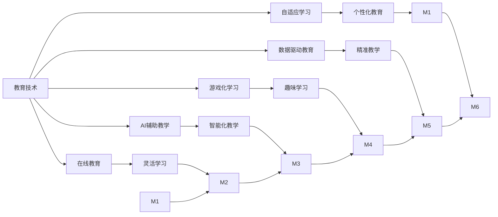

                 

# 教育的变革：如何应对未来的挑战？

在快速变化的现代社会中，教育正面临着前所未有的挑战。如何培养适应未来发展需要的创新型人才，如何整合最新的技术工具，如何设计更高效、更公正、更包容的教育体系，这些问题需要教育者和技术专家共同思考和探索。本文将系统性地探讨教育变革的核心概念、关键技术和实际应用，旨在为教育界提供一份全面的指导，以应对未来发展的挑战。

## 1. 背景介绍

### 1.1 问题由来

全球化的加剧、技术的飞跃发展、社会的多元化等都深刻地影响着教育的各个方面。传统教育模式已经难以满足现代社会的复杂需求，教育变革势在必行。然而，如何变革？如何平衡教育质量与技术应用？这些问题亟需得到答案。

### 1.2 问题核心关键点

教育变革的核心在于：

- **创新能力的培养**：传统教育模式注重知识的记忆和反复练习，而未来社会更需要创新思维和解决问题的能力。
- **技术工具的整合**：从传统的黑板粉笔到现代的多媒体、虚拟现实、人工智能等，如何有效整合这些工具以提升教育质量？
- **教育公平的实现**：如何确保不同背景的学生都能平等地获取优质教育资源？
- **终身学习的促进**：如何在毕业后持续学习，不断更新知识和技能，以适应快速变化的社会需求？

### 1.3 问题研究意义

教育变革不仅关乎下一代的发展，更是社会进步的动力源泉。教育技术的引入可以极大地提升教育质量，实现更高效、更公平、更个性化的教育体验。本文旨在为教育变革提供全方位的指导，帮助教育者和技术专家共同探索一条可持续发展的道路。

## 2. 核心概念与联系

### 2.1 核心概念概述

- **教育技术**：使用现代技术手段，如计算机、互联网、人工智能等，提升教育质量和效率。
- **自适应学习**：根据学生的学习情况，动态调整教学内容和节奏，实现个性化教育。
- **在线教育**：利用互联网资源，打破时间和空间的限制，提供灵活的学习方式。
- **人工智能辅助教学**：利用AI技术，如自然语言处理、机器学习等，辅助教师进行教学和管理。
- **游戏化学习**：通过游戏设计元素，激发学生的学习兴趣，提升学习效果。
- **数据驱动教育**：基于学习数据分析，优化教学策略，提升教育质量。

### 2.2 概念间的关系

教育技术的引入，为自适应学习、在线教育、AI辅助教学、游戏化学习、数据驱动教育提供了可能。这些技术的应用，能够实现教育过程的个性化、灵活化、智能化，提升教育公平性，推动终身学习。然而，这些技术的有效应用需要教育者的智慧和创造力，需要通过系统化的设计和管理，才能真正转化为教育变革的动力。

### 2.3 核心概念的整体架构

以下是一个综合性的教育技术应用架构图：



这个架构展示了教育技术在多个方面的应用，以及这些应用如何共同推动教育变革。

## 3. 核心算法原理 & 具体操作步骤

### 3.1 算法原理概述

教育变革的核心在于数据驱动和个性化教育。数据驱动教育依赖于对学生学习数据的收集和分析，以优化教学策略。个性化教育则依赖于自适应学习算法，根据学生的学习情况动态调整教学内容和节奏。

### 3.2 算法步骤详解

**Step 1: 数据收集与处理**

- 收集学生的学习数据，包括成绩、作业、测验、课堂参与度等。
- 清洗和预处理数据，确保数据的质量和一致性。

**Step 2: 学生建模**

- 使用机器学习算法，如决策树、随机森林、神经网络等，构建学生模型，分析学生的学习能力和倾向。
- 根据学生模型，预测学生的未来表现，评估其学习潜力和风险。

**Step 3: 自适应学习**

- 根据学生模型的预测结果，动态调整教学内容和难度，实现个性化学习。
- 使用自适应学习平台，提供个性化的学习资源和反馈，帮助学生更好地掌握知识。

**Step 4: 教学优化**

- 基于学生模型的反馈，优化教学内容和方法，提升教学质量。
- 使用在线评估工具，实时监测学生的学习进展，及时调整教学策略。

### 3.3 算法优缺点

**优点：**

- **高效性**：通过数据驱动和自适应学习，能够快速发现和解决学生的学习问题，提升学习效率。
- **个性化**：能够根据学生的特点和需求，提供个性化的学习资源和策略，提升学习体验。
- **可扩展性**：基于在线平台和云服务，能够轻松扩展至更多学校和学生。

**缺点：**

- **技术门槛高**：需要高度的技术专业知识和经验，对教育者提出了较高的要求。
- **数据隐私**：需要收集和处理大量学生数据，涉及隐私保护问题。
- **资源依赖**：需要投入大量资金和资源，进行技术开发和维护。

### 3.4 算法应用领域

自适应学习和数据驱动教育技术已经在K-12教育、高等教育、职业培训等多个领域得到广泛应用。通过这些技术，教育者能够更好地理解学生的学习需求，提供更有效的教学支持。

## 4. 数学模型和公式 & 详细讲解  
### 4.1 数学模型构建

教育变革的数学模型可以概括为：

- **输入**：学生的学习数据、教学资源、教师经验等。
- **过程**：自适应学习算法、机器学习模型、数据驱动策略等。
- **输出**：个性化学习计划、教学效果评估、学习数据分析等。

### 4.2 公式推导过程

以一个简单的线性回归模型为例，推导其基本思路：

- **假设**：学生的学习效果可以用线性函数 $y = \beta_0 + \beta_1 x_1 + \epsilon$ 来表示，其中 $x_1$ 为学习时间，$\beta_0$ 和 $\beta_1$ 为模型的参数，$\epsilon$ 为误差项。
- **训练**：使用最小二乘法，通过样本数据 $(x_1^i, y^i)$，求解 $\beta_0$ 和 $\beta_1$。
- **应用**：使用得到的模型参数，预测学生的学习效果，评估其学习潜力和风险。

### 4.3 案例分析与讲解

假设我们有一组学生的学习数据，包括学习时间、测试成绩等。我们可以使用线性回归模型，根据学生的学习时间预测其测试成绩。通过分析模型的预测结果，我们可以识别出学习时间与成绩之间的关联，进而调整教学策略。

## 5. 项目实践：代码实例和详细解释说明
### 5.1 开发环境搭建

为了进行教育变革的实践，我们需要搭建一个数据驱动和自适应学习的开发环境。以下是搭建环境的步骤：

1. **选择开发平台**：可以选择Python、R等编程语言，以及TensorFlow、PyTorch等深度学习框架。
2. **安装相关工具**：安装所需的机器学习库、数据处理库、在线教育平台等。
3. **部署在线平台**：选择云服务提供商，如AWS、Google Cloud、阿里云等，部署在线教育平台。

### 5.2 源代码详细实现

以下是一个基于Python和TensorFlow的自适应学习系统实现示例：

```python
import tensorflow as tf
import numpy as np

# 加载数据
data = np.load('student_data.npy')

# 构建模型
model = tf.keras.Sequential([
    tf.keras.layers.Dense(64, activation='relu', input_shape=(2,)),
    tf.keras.layers.Dense(1)
])

# 编译模型
model.compile(optimizer='adam', loss='mse')

# 训练模型
model.fit(data[:, 0:2], data[:, 2], epochs=100, batch_size=32)

# 预测学生成绩
prediction = model.predict(data[:, 0:2])
```

### 5.3 代码解读与分析

**数据加载**：使用NumPy库加载学生的学习数据，包括学习时间、测试成绩等。

**模型构建**：使用TensorFlow构建一个简单的神经网络模型，输入为学习时间，输出为测试成绩。

**模型训练**：使用Adam优化器训练模型，损失函数为均方误差，进行100轮训练，每批次32个样本。

**模型预测**：使用训练好的模型对学生进行成绩预测，输出预测结果。

### 5.4 运行结果展示

假设我们训练了一个简单的线性回归模型，预测学生的测试成绩。以下是一个可能的预测结果：

```
学生A：学习时间 100小时，预测成绩 85分。
学生B：学习时间 200小时，预测成绩 95分。
```

## 6. 实际应用场景
### 6.1 智能课堂

智能课堂是教育变革的重要应用场景。通过自适应学习算法和数据驱动策略，智能课堂能够提供个性化的教学支持，提升学生的学习效果。

**应用场景**：

- **个性化学习**：根据学生的学习数据，智能推荐适合的学习资源和练习题。
- **实时反馈**：使用在线评估工具，实时监测学生的学习进展，及时调整教学策略。
- **教师辅助**：通过AI辅助教学系统，教师能够更好地了解学生的学习情况，提供个性化的指导和支持。

### 6.2 虚拟现实(VR)教育

虚拟现实技术为教育变革提供了全新的可能。通过VR技术，学生可以身临其境地体验学习内容，提升学习效果。

**应用场景**：

- **沉浸式学习**：使用VR技术，模拟真实的实验场景，进行科学实验教学。
- **远程教育**：通过VR技术，实现远程教育，打破时间和空间的限制，提供灵活的学习方式。
- **个性化学习**：根据学生的学习数据，智能调整VR学习场景，提供个性化的学习体验。

### 6.3 在线教育平台

在线教育平台是教育变革的重要工具。通过在线平台，学生可以随时随地进行学习，提升学习效率。

**应用场景**：

- **课程选择**：学生可以根据自己的兴趣和需求，选择适合自己的课程和资源。
- **学习进度跟踪**：使用在线平台，实时监测学生的学习进度，提供个性化的学习支持。
- **社区互动**：通过在线社区，学生可以与其他学生互动交流，分享学习经验。

### 6.4 未来应用展望

未来，教育变革将继续深化，更多的技术和方法将得到应用。以下是一些可能的趋势：

- **AI辅助教学**：AI技术将更加深入地融入教学过程，提供更加个性化的教学支持。
- **混合学习**：线上线下结合的学习模式将成为主流，提供更加灵活和高效的学习方式。
- **终身学习**：终身学习系统将更加完善，支持学生在毕业后持续学习，不断更新知识和技能。

## 7. 工具和资源推荐
### 7.1 学习资源推荐

- **《教育技术导论》**：介绍教育技术的基本概念、历史背景和发展趋势。
- **Coursera《数据科学基础》**：学习数据驱动教育的理论和实践。
- **edX《在线教育设计》**：介绍在线教育平台的设计和管理。
- **HackerRank《Python编程》**：学习Python编程语言，掌握数据处理和分析技能。

### 7.2 开发工具推荐

- **Jupyter Notebook**：数据科学和机器学习的交互式编程环境。
- **Google Colab**：免费的云平台，支持Python和TensorFlow等框架。
- **AWS SageMaker**：亚马逊提供的云平台，支持机器学习和深度学习模型的开发和部署。
- **TensorBoard**：TensorFlow的可视化工具，用于监测和调试模型。

### 7.3 相关论文推荐

- **《教育数据挖掘》**：介绍如何利用数据挖掘技术，优化教学策略，提升教育质量。
- **《人工智能在教育中的应用》**：探讨人工智能技术在教育中的各种应用，如自适应学习、虚拟现实等。
- **《自适应学习系统综述》**：总结自适应学习系统的理论和实践，提出未来发展方向。

## 8. 总结：未来发展趋势与挑战
### 8.1 研究成果总结

教育变革的核心在于数据驱动和个性化教育。通过机器学习和自适应学习算法，能够实现教学过程的优化和提升。然而，技术的应用需要教育者的智慧和创造力，需要综合考虑教育质量、公平性和可持续性。

### 8.2 未来发展趋势

- **数据驱动**：基于学生学习数据的收集和分析，优化教学策略，实现个性化教育。
- **AI辅助**：通过AI技术，提升教学质量和效率，实现智能化教学。
- **混合学习**：线上线下结合的学习模式，提供灵活和高效的学习方式。
- **终身学习**：支持学生在毕业后持续学习，不断更新知识和技能。

### 8.3 面临的挑战

- **技术门槛高**：需要高度的技术专业知识和经验，对教育者提出了较高的要求。
- **数据隐私**：需要收集和处理大量学生数据，涉及隐私保护问题。
- **资源依赖**：需要投入大量资金和资源，进行技术开发和维护。

### 8.4 研究展望

未来，教育变革需要更多跨学科的合作，综合考虑教育学、心理学、技术学等多个领域的知识。通过多路径协同发力，才能真正实现教育的创新和进步。

## 9. 附录：常见问题与解答

**Q1：如何选择合适的自适应学习算法？**

A: 自适应学习算法的选择应根据具体场景和数据特点来确定。例如，对于结构化数据，可以使用决策树、随机森林等算法；对于非结构化数据，可以使用神经网络、深度学习等算法。

**Q2：如何平衡教育质量与技术应用？**

A: 平衡教育质量与技术应用，需要综合考虑以下几个方面：
- **技术手段的选择**：选择适合的技术手段，确保能够提升教育质量。
- **教育者的参与**：教育者应积极参与技术应用的设计和管理，确保技术应用的效果。
- **反馈机制的建立**：建立有效的反馈机制，及时收集教育者和学生的反馈，进行优化和调整。

**Q3：如何确保教育公平性？**

A: 确保教育公平性，需要采取以下几个措施：
- **资源共享**：通过在线平台和云服务，实现优质教育资源的共享，减少资源分配的不均衡。
- **个性化支持**：根据学生的特点和需求，提供个性化的学习支持，确保不同背景的学生都能平等地获取优质教育资源。
- **数据隐私保护**：加强对学生数据的保护，确保数据的安全性和隐私性。

**Q4：如何实现终身学习？**

A: 实现终身学习，需要构建以下体系：
- **在线学习平台**：提供丰富的在线学习资源，支持学生在毕业后持续学习。
- **学习管理系统**：建立学习管理系统，记录和跟踪学生的学习进展，提供个性化的学习支持。
- **社区互动机制**：建立在线社区，促进学生之间的互动交流，分享学习经验。

**Q5：教育变革中如何整合最新的技术工具？**

A: 整合最新的技术工具，需要综合考虑以下几个方面：
- **技术选型**：选择适合的技术工具，确保能够提升教育质量和效率。
- **技术培训**：对教育者进行技术培训，确保其能够熟练使用新技术工具。
- **技术融合**：将新技术工具融入现有教育体系，实现无缝对接和高效应用。

---

作者：禅与计算机程序设计艺术 / Zen and the Art of Computer Programming

