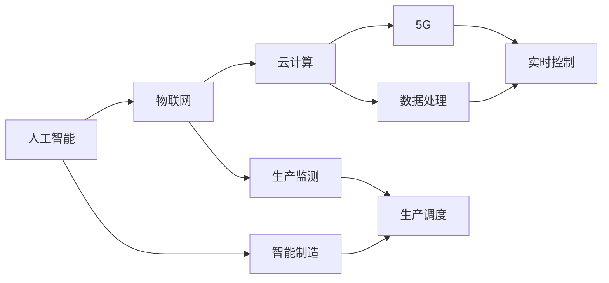

                 

## 1. 背景介绍

在过去的几十年里，信息技术迅猛发展，以计算机技术和互联网为核心的数字革命已深入到社会的各个角落。然而，数字技术与物理实体（如工厂、机器、城市基础设施等）的融合仍处于初级阶段。为了更好地推动这一领域的发展，数字与物理实体的自动化革命应运而生。本文将围绕数字与物理实体的自动化革命，从背景、核心概念、算法原理、实际应用场景、未来展望等方面展开详细探讨。

## 2. 核心概念与联系

### 2.1 核心概念概述

数字与物理实体的自动化革命，是指通过数字技术对物理实体进行智能化、自动化、信息化的全面改造，实现物理与数字的深度融合。该革命的核心在于如何利用人工智能、物联网、5G、云计算等先进技术，使得物理实体能够更好地与数字世界进行交互和协同。

**关键概念：**
- **人工智能 (AI)**：指通过计算机技术模拟人类智能，实现智能推理、自然语言处理、计算机视觉等功能。
- **物联网 (IoT)**：指将各种物理实体通过传感器、通信技术连接到互联网，实现数据的实时采集和传输。
- **云计算 (Cloud Computing)**：指利用大规模服务器集群和分布式存储技术，实现数据的集中管理和计算资源的弹性扩展。
- **5G技术**：指新一代移动通信技术，具有高速率、大容量、低延迟等特点，为物联网的发展提供了基础设施保障。

### 2.2 概念间的关系

数字与物理实体的自动化革命涉及众多关键技术，这些技术之间存在紧密的联系。以一个智能工厂为例，该工厂的自动化改造需要综合应用AI、IoT、云计算和5G技术，实现从生产计划制定、设备监测、产品质量控制到供应链管理的全流程智能化。

**核心技术关系图**：



从上述图可以看出，各技术领域之间的协作，共同驱动着数字与物理实体的自动化革命。

## 3. 核心算法原理 & 具体操作步骤

### 3.1 算法原理概述

数字与物理实体的自动化革命，主要通过以下算法和步骤实现：

1. **数据采集与预处理**：通过物联网技术，将物理实体上的传感器数据实时采集到云端，并进行数据清洗、特征提取等预处理。
2. **模型训练与优化**：利用云计算平台，训练各种AI模型，如预测模型、分类模型、强化学习模型等，以实现对生产过程、设备状态的预测和优化。
3. **决策支持与控制**：将训练好的模型应用于生产实际，进行实时决策与控制，优化生产效率，提升产品质量。
4. **反馈与持续改进**：通过持续采集反馈数据，不断调整和优化模型，实现持续改进。

### 3.2 算法步骤详解

**步骤 1: 数据采集与预处理**

1. **传感器安装与配置**：在物理实体上安装各种传感器，如温度传感器、压力传感器、振动传感器等。
2. **数据采集与传输**：通过无线通信技术（如Wi-Fi、蓝牙、LoRa等）将传感器数据实时传输到云端。
3. **数据清洗与处理**：对采集到的原始数据进行清洗、去噪、异常值处理、特征提取等预处理操作，以便后续建模使用。

**步骤 2: 模型训练与优化**

1. **数据集准备**：从历史数据中提取训练样本，用于训练和验证模型。
2. **模型选择与训练**：选择适合的AI模型（如神经网络、决策树、集成学习等），利用云计算平台进行训练。
3. **模型评估与优化**：通过交叉验证等方法评估模型性能，并根据评估结果进行参数调整和模型优化。

**步骤 3: 决策支持与控制**

1. **实时数据流**：将实时采集到的传感器数据输入训练好的模型，进行实时预测和决策。
2. **控制指令生成**：根据模型的输出结果，生成控制指令，如调整设备参数、调整生产流程等。
3. **执行与反馈**：将控制指令发送给生产设备执行，并通过反馈机制对执行结果进行监控和调整。

**步骤 4: 反馈与持续改进**

1. **数据收集与分析**：持续收集设备运行数据和控制指令执行结果，进行数据分析和统计。
2. **模型更新与优化**：根据分析结果，对模型进行更新和优化，不断提升预测和决策的准确性。
3. **持续改进**：通过迭代优化，不断改进模型性能，实现物理实体的智能化和自动化。

### 3.3 算法优缺点

**优点：**
- **智能化程度高**：通过AI技术，可以实现对生产过程和设备状态的智能化监测和预测。
- **实时性强**：利用物联网和5G技术，可以实现数据的实时采集和传输，提升决策的及时性。
- **灵活性高**：云计算平台提供弹性计算资源，可以根据需求进行动态扩展，适应各种规模的生产任务。

**缺点：**
- **成本高**：传感器、通信设备、云计算等基础设施的建设成本较高。
- **技术复杂**：涉及多个领域的先进技术，对技术团队的综合能力要求较高。
- **数据安全风险**：大量数据传输和存储，可能面临数据泄露、黑客攻击等安全风险。

### 3.4 算法应用领域

数字与物理实体的自动化革命在多个领域得到了广泛应用，以下是几个典型场景：

**智能制造**
- 利用AI技术对生产设备进行智能监测和预测，如预测设备故障、优化生产流程。
- 通过物联网技术实现生产设备的远程监控和控制，提升生产效率和质量。
- 采用云计算平台进行数据分析和决策支持，实现生产过程的自动化和智能化。

**智慧城市**
- 通过物联网技术采集城市基础设施的实时数据，如交通流量、空气质量、能源消耗等。
- 利用AI技术进行数据分析和预测，实现城市管理的智能化。
- 利用5G技术提供高速数据传输，实现实时控制和优化。

**智能农业**
- 利用传感器采集土壤、气象等数据，实现对农作物的精准监测和智能管理。
- 采用AI技术进行数据分析和预测，优化种植方案和施肥策略。
- 通过物联网技术实现远程监控和控制，提升农业生产效率和可持续性。

**智能交通**
- 通过传感器和摄像头采集交通数据，如车辆速度、流量、事故等。
- 利用AI技术进行数据分析和预测，优化交通管理。
- 采用5G技术提供实时数据传输，实现交通流量的实时控制和优化。

## 4. 数学模型和公式 & 详细讲解 & 举例说明

### 4.1 数学模型构建

**智能制造场景数学模型**

1. **输入**：$x = [x_1, x_2, \ldots, x_n]$，其中 $x_i$ 为第 $i$ 个传感器采集的数据。
2. **输出**：$y = [y_1, y_2, \ldots, y_m]$，其中 $y_i$ 为第 $i$ 个生产设备的状态或故障预测结果。
3. **模型**：$f(x) = M \cdot x + b$，其中 $M$ 为模型参数矩阵，$b$ 为偏置向量。

### 4.2 公式推导过程

**模型训练与优化公式**

在智能制造场景中，模型的训练目标为最小化预测值与真实值之间的均方误差：

$$
\min_{M,b} \frac{1}{N} \sum_{i=1}^N ||y_i - f(x_i)||^2
$$

其中 $N$ 为样本数量，$||\cdot||$ 为L2范数。

### 4.3 案例分析与讲解

以某智能工厂为例，假设工厂有多个传感器监测设备的温度、压力和振动情况，目标为预测设备故障并调整生产流程。具体步骤如下：

1. **数据采集**：通过传感器实时采集设备温度、压力和振动数据，存储到云端。
2. **数据预处理**：对采集到的数据进行去噪、归一化等预处理。
3. **模型训练**：使用历史数据训练一个线性回归模型，预测设备故障概率。
4. **决策支持**：根据模型的输出，判断设备是否存在故障，并生成相应的控制指令，如调整生产参数、停机检修等。
5. **反馈与改进**：收集设备运行结果和控制指令执行结果，进行数据分析和模型更新，不断提升模型性能。

## 5. 项目实践：代码实例和详细解释说明

### 5.1 开发环境搭建

1. **安装Python**：从官网下载Python安装程序，并配置环境变量。
2. **安装必要的库**：使用pip安装numpy、pandas、scikit-learn等库，以及TensorFlow或PyTorch等深度学习框架。
3. **配置云端环境**：选择合适的云平台（如AWS、阿里云、华为云等），创建虚拟机实例，安装必要的软件和库。

### 5.2 源代码详细实现

**智能工厂数据采集与预处理代码**

```python
import numpy as np
from sklearn.preprocessing import MinMaxScaler

# 假设传感器数据存储在csv文件中
data = pd.read_csv('sensor_data.csv')

# 数据预处理
scaler = MinMaxScaler(feature_range=(0, 1))
data_scaled = scaler.fit_transform(data)

# 数据集划分
train_data = data_scaled[:train_size]
test_data = data_scaled[train_size:]
```

**模型训练与优化代码**

```python
import tensorflow as tf
from tensorflow.keras.models import Sequential
from tensorflow.keras.layers import Dense

# 构建模型
model = Sequential()
model.add(Dense(64, input_shape=(input_size,), activation='relu'))
model.add(Dense(1, activation='sigmoid'))

# 编译模型
model.compile(optimizer='adam', loss='binary_crossentropy', metrics=['accuracy'])

# 训练模型
model.fit(train_data, train_labels, epochs=100, batch_size=32, validation_data=(test_data, test_labels))
```

**决策支持与控制代码**

```python
def predict_fault(probability):
    if probability > threshold:
        return '预警'
    else:
        return '正常'

# 实时采集数据并进行预测
while True:
    sensor_data = realtime_data采集()
    probability = model.predict(sensor_data)
    action = predict_fault(probability)
    if action == '预警':
        control_command = '调整生产参数'
    else:
        control_command = '继续生产'
```

### 5.3 代码解读与分析

**数据采集与预处理**

- 使用pandas库读取传感器数据，并进行归一化处理。
- 使用MinMaxScaler进行归一化，将数据缩放到0-1之间。
- 将数据集划分为训练集和测试集，以进行模型训练和评估。

**模型训练与优化**

- 使用TensorFlow构建一个简单的线性回归模型。
- 使用Adam优化器和二元交叉熵损失函数进行模型训练。
- 通过交叉验证等方法评估模型性能，并调整模型参数，提升预测准确性。

**决策支持与控制**

- 定义一个阈值，当模型预测概率超过该阈值时，触发预警。
- 实时采集传感器数据，并进行模型预测，生成控制指令。
- 根据控制指令执行相应的操作，如调整生产参数、停机检修等。

### 5.4 运行结果展示

假设在模型训练后，模型在测试集上的准确率为95%，可以认为模型能够较好地预测设备故障。在实际应用中，系统可以根据实时采集的传感器数据，实时生成预测结果和控制指令，确保生产过程的稳定和高效。

## 6. 实际应用场景

### 6.1 智能制造

在智能制造领域，数字与物理实体的自动化革命主要体现在以下几个方面：

**设备故障预测与维护**
- 通过传感器采集设备运行数据，利用AI技术进行故障预测。
- 根据预测结果，自动生成维护计划和维修策略。
- 采用物联网技术实现设备的远程监控和控制，提升设备利用率和生产效率。

**生产过程优化**
- 利用AI技术对生产过程进行分析和优化，如调整生产顺序、优化生产参数等。
- 通过物联网技术实时监控生产过程，确保生产稳定性和一致性。
- 采用云计算平台进行数据分析和决策支持，实现生产过程的智能化。

**供应链管理**
- 利用AI技术对供应链数据进行分析和预测，如库存管理、物流调度等。
- 通过物联网技术实时监控物流状态，提升物流效率和准确性。
- 采用云计算平台进行数据分析和决策支持，实现供应链管理的自动化。

### 6.2 智慧城市

在智慧城市领域，数字与物理实体的自动化革命主要体现在以下几个方面：

**交通流量优化**
- 通过传感器采集交通流量数据，利用AI技术进行流量分析和预测。
- 根据预测结果，自动调整信号灯控制策略，优化交通流量。
- 采用物联网技术实现交通设备的远程监控和控制，提升交通效率和安全性。

**城市能源管理**
- 通过传感器采集能源消耗数据，利用AI技术进行分析和优化。
- 根据优化结果，自动调整能源分配策略，提升能源利用效率。
- 采用物联网技术实现能源设备的远程监控和控制，提升能源管理水平。

**公共安全监控**
- 通过摄像头采集公共场所视频数据，利用AI技术进行异常行为检测。
- 根据检测结果，自动触发安防系统，提升公共安全保障水平。
- 采用物联网技术实现安防设备的远程监控和控制，提升安防效率和反应速度。

### 6.3 智能农业

在智能农业领域，数字与物理实体的自动化革命主要体现在以下几个方面：

**精准农业**
- 利用传感器采集土壤、气象等数据，利用AI技术进行数据分析和预测。
- 根据预测结果，自动调整种植方案和施肥策略，提升农作物产量和品质。
- 采用物联网技术实现农机的远程监控和控制，提升农机利用率和作业效率。

**病虫害监测与防治**
- 通过传感器采集病虫害信息，利用AI技术进行分析和预测。
- 根据预测结果，自动调整防治策略，提升病虫害防治效果。
- 采用物联网技术实现防治设备的远程监控和控制，提升防治效率和准确性。

**农业机械自动化**
- 利用传感器采集农业机械运行数据，利用AI技术进行数据分析和预测。
- 根据预测结果，自动调整机械操作策略，提升机械利用率和作业效率。
- 采用物联网技术实现农业机械的远程监控和控制，提升机械智能化水平。

## 7. 工具和资源推荐

### 7.1 学习资源推荐

1. **《人工智能与深度学习》**：斯坦福大学Andrew Ng教授的课程，系统介绍AI和深度学习的基本概念和算法。
2. **《物联网与智能系统》**：麻省理工学院OpenCourseWare课程，详细介绍物联网技术及其应用。
3. **《云计算基础》**：亚马逊AWS官方文档和培训课程，全面介绍云计算技术和应用。
4. **《5G网络与物联网》**：华为官方文档和培训课程，详细介绍5G技术和物联网应用。
5. **《数字与物理实体的自动化革命》**：本文详细讲解数字与物理实体的自动化革命原理和实践。

### 7.2 开发工具推荐

1. **Python编程语言**：开放、灵活、易用的编程语言，支持多种第三方库和框架。
2. **TensorFlow**：由Google开发的深度学习框架，支持分布式计算和GPU加速。
3. **PyTorch**：由Facebook开发的深度学习框架，支持动态计算图和GPU加速。
4. **AWS、阿里云、华为云**：领先的云服务平台，提供丰富的云计算资源和开发工具。
5. **Jupyter Notebook**：交互式编程环境，支持Python编程和数据可视化。

### 7.3 相关论文推荐

1. **《深度学习在智能制造中的应用》**：介绍深度学习在智能制造中的具体应用和效果。
2. **《智慧城市的物联网技术与应用》**：详细介绍物联网技术在智慧城市中的应用和挑战。
3. **《智能农业的传感器与数据处理》**：介绍传感器在智能农业中的应用和数据处理方法。
4. **《智能交通的物联网与AI技术》**：详细介绍物联网与AI技术在智能交通中的应用。

## 8. 总结：未来发展趋势与挑战

### 8.1 研究成果总结

本文从背景、核心概念、算法原理、实际应用场景等方面，全面介绍了数字与物理实体的自动化革命。通过系统性的分析，展示了该革命在智能制造、智慧城市、智能农业、智能交通等领域的广泛应用。同时，详细讨论了数字与物理实体自动化革命的算法实现和具体步骤，为读者提供了丰富的理论基础和实践指导。

### 8.2 未来发展趋势

未来，数字与物理实体的自动化革命将呈现以下几个发展趋势：

1. **融合多模态数据**：除了传感器数据，未来将更多地利用摄像头、声学设备等采集多模态数据，实现更全面、准确的智能化分析。
2. **引入因果学习**：通过引入因果学习，提升模型预测的因果关系，减少假阳性率和假阴性率。
3. **云计算与边缘计算结合**：在云端进行数据处理和模型训练，在边缘设备上进行实时决策和控制，实现高效、灵活的计算资源分配。
4. **人工智能与人类协同**：通过人机协同，提升人工智能系统的可解释性和可信度，实现更可靠、更安全的智能决策。
5. **可持续发展**：结合环境监测和能源管理技术，推动智能系统向可持续、环保的方向发展。

### 8.3 面临的挑战

尽管数字与物理实体的自动化革命具有广阔的应用前景，但在推进过程中仍面临以下挑战：

1. **数据隐私与安全**：大量数据的采集和存储，可能面临数据泄露和隐私保护问题。
2. **技术标准不统一**：各领域使用的技术标准和协议不一致，导致系统互操作性差。
3. **计算资源限制**：大规模数据的处理和实时计算，对计算资源的要求较高。
4. **人才培养不足**：各领域涉及的技术复杂多样，需要跨学科的人才，但当前人才储备不足。
5. **技术实施成本高**：涉及传感器、通信设备、云计算等基础设施的建设和维护成本较高。

### 8.4 研究展望

未来的研究需要从以下几个方面进行突破：

1. **数据隐私保护技术**：开发更高效、更安全的数据隐私保护技术，确保数据安全。
2. **统一技术标准**：制定各领域的技术标准和协议，实现系统的互操作性和可扩展性。
3. **边缘计算优化**：优化边缘计算设备和网络架构，提升实时计算能力。
4. **人才培养体系**：建立跨学科人才培养体系，提升技术团队综合能力。
5. **开源软件工具**：开发更易用、更高效的开源软件工具，降低技术实施成本。

总之，数字与物理实体的自动化革命是大势所趋，未来将带来更高效、更智能、更可持续的生产方式和社会管理模式。只有面对挑战，积极应对，才能推动这一革命不断向前发展，造福全人类。

## 9. 附录：常见问题与解答

**Q1：数字与物理实体的自动化革命的核心技术是什么？**

A: 数字与物理实体的自动化革命主要依赖于以下核心技术：
- **物联网 (IoT)**：实现物理实体的数据采集和传输。
- **云计算 (Cloud Computing)**：提供大规模计算和存储资源，支持模型的训练和优化。
- **人工智能 (AI)**：实现对物理实体的智能化监测、分析和预测。
- **5G技术**：提供高速、低延迟的数据传输，支持实时通信和控制。

**Q2：数字与物理实体的自动化革命面临的主要挑战是什么？**

A: 数字与物理实体的自动化革命面临的主要挑战包括：
- **数据隐私与安全**：大量数据的采集和存储可能面临数据泄露和隐私保护问题。
- **技术标准不统一**：各领域使用的技术标准和协议不一致，导致系统互操作性差。
- **计算资源限制**：大规模数据的处理和实时计算，对计算资源的要求较高。
- **人才培养不足**：各领域涉及的技术复杂多样，需要跨学科的人才，但当前人才储备不足。
- **技术实施成本高**：涉及传感器、通信设备、云计算等基础设施的建设和维护成本较高。

**Q3：如何实现数字与物理实体的自动化革命？**

A: 实现数字与物理实体的自动化革命，需要综合应用以下步骤：
1. **数据采集与预处理**：通过传感器采集物理实体的数据，并进行数据清洗、特征提取等预处理。
2. **模型训练与优化**：利用云计算平台，训练各种AI模型，以实现对生产过程、设备状态的预测和优化。
3. **决策支持与控制**：将训练好的模型应用于生产实际，进行实时决策与控制，优化生产效率，提升产品质量。
4. **反馈与持续改进**：通过持续采集反馈数据，不断调整和优化模型，实现持续改进。

**Q4：数字与物理实体的自动化革命在哪些领域有广泛应用？**

A: 数字与物理实体的自动化革命在多个领域得到了广泛应用，包括：
- **智能制造**：利用AI技术对生产设备进行智能监测和预测，优化生产流程和供应链管理。
- **智慧城市**：通过物联网技术实现城市基础设施的智能化管理，提升城市治理效率和公共安全。
- **智能农业**：利用传感器和AI技术进行精准农业、病虫害监测与防治、农业机械自动化等。
- **智能交通**：通过传感器和AI技术实现交通流量优化、智能交通管理、智能驾驶等。

---

作者：禅与计算机程序设计艺术 / Zen and the Art of Computer Programming

