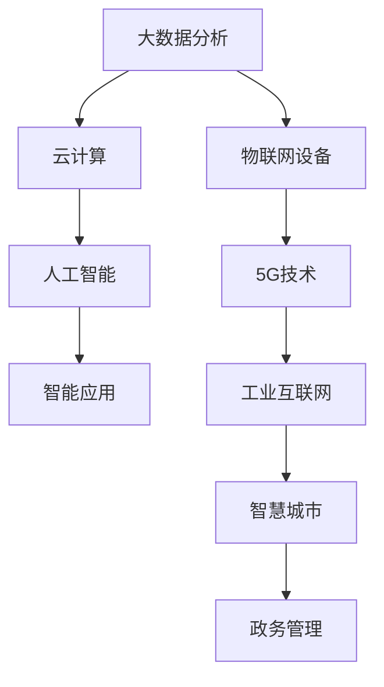

                 

# 数字中国战略与新质生产力的结合点

> 关键词：
1. 数字中国
2. 新质生产力
3. 智能制造
4. 大数据分析
5. 云计算
6. 5G技术
7. 人工智能

## 1. 背景介绍

随着信息技术的迅猛发展，数字化已经成为推动经济社会发展的重要引擎。数字中国的战略目标，旨在通过信息化、数字化、智能化改造，全面提升我国经济的整体素质和竞争力，建设现代化经济体系。本文将探讨数字中国战略与新质生产力结合点的核心内容，分析当前数字化转型的主要挑战，并展望未来的发展方向。

## 2. 核心概念与联系

### 2.1 核心概念概述

在数字化转型的背景下，新质生产力成为引领我国经济高质量发展的关键力量。新质生产力指的是在信息技术驱动下，通过数据、算法、平台等新型生产要素的融合应用，实现经济活动的数字化、网络化、智能化，进而提升全要素生产率和经济结构优化升级的现代生产力。新质生产力不仅包括技术创新和产业转型，还涵盖了更广泛的数字生态和治理体系。

- **智能制造**：通过信息化、自动化、数字化手段改造传统制造业，实现生产过程的高效协同、精确控制和智能决策。
- **大数据分析**：利用大数据技术进行数据挖掘、知识发现、智能决策，为生产、运营、管理提供有力支撑。
- **云计算**：通过分布式计算和虚拟化技术，提供灵活、可扩展、高可靠性的计算资源，支持大规模数据处理和实时计算。
- **5G技术**：提供高速、低延迟、广覆盖的通信网络，为工业互联网、智能城市等提供基础保障。
- **人工智能**：通过机器学习、深度学习等技术，实现知识获取、智能推理、决策优化等，提升业务处理效率和质量。

这些新型生产力要素之间的联系通过以下Mermaid流程图展示：

```mermaid
graph TB
    A[Internet of Things(IoT)] --> B[Big Data]
    B --> C[Cloud Computing]
    C --> D[Artificial Intelligence(AI)]
    D --> E[Internet of Everything]
    A --> F[5G Technology]
    F --> G[Smart Manufacturing]
    G --> H[Intelligent City]
    H --> I[Governance and Administration]
```

该流程图表明，在5G技术保障下，IoT设备采集的数据通过大数据分析，由云计算提供计算资源，结合人工智能技术，在智能制造、智慧城市、政务管理等多个领域实现创新和应用。

### 2.2 概念间的关系

新质生产力要素之间相互促进、互为支撑，形成了一个有机循环的生态系统。具体关系如下：

- **智能制造**：利用大数据、云计算和人工智能技术，实现生产过程的智能化改造，提升生产效率和产品质量。
- **大数据分析**：通过智能制造和物联网设备采集的数据，进行深度挖掘和分析，为业务决策提供数据支撑。
- **云计算**：提供强大的计算和存储能力，支持大数据分析和人工智能算法的训练和应用。
- **5G技术**：为IoT设备的连接和数据传输提供高速、可靠的网络环境，促进工业互联网的发展。
- **人工智能**：借助大数据和云计算技术，实现复杂问题的智能推理和决策，提升业务处理能力和管理水平。

这些概念通过物联网和互联网的连接，构成了新质生产力的生态链条，各环节相互依存、协同发展，共同推动经济社会的数字化转型。

## 3. 核心算法原理 & 具体操作步骤

### 3.1 算法原理概述

新质生产力结合点涉及的算法原理主要包括大数据分析、云计算和人工智能等领域的技术应用。这些技术的应用核心在于对数据的收集、处理和分析，以及对计算资源的有效管理和调度。

- **大数据分析**：利用统计学、机器学习等方法，从海量数据中提取有价值的信息和知识，支持业务决策和智能推理。
- **云计算**：通过虚拟化技术，将物理资源池化，按需提供计算资源和存储服务，支持大规模、高并发、高可靠性的应用。
- **人工智能**：通过深度学习、自然语言处理等技术，实现知识获取、智能推理和决策优化，提升业务处理效率和质量。

这些技术的应用遵循以下逻辑框架：



从数据采集到智能应用，新质生产力要素通过物联网和5G技术实现无缝连接，经过云计算和人工智能的处理，产生智能决策和高效运营，支撑经济社会的各个方面。

### 3.2 算法步骤详解

基于新质生产力结合点的算法步骤主要包括以下几个关键环节：

1. **数据采集与预处理**：
   - 利用IoT设备采集生产、物流、销售等环节的数据，通过边缘计算实现初步处理和筛选，保障数据的质量和完整性。
   - 将处理后的数据上传到云端，通过云计算平台进行存储和备份，确保数据的安全性和可访问性。

2. **大数据分析与建模**：
   - 利用大数据分析技术，对采集的数据进行统计分析、挖掘和建模，生成有价值的业务洞察和决策支持。
   - 通过机器学习算法，对数据进行预测和分类，为智能决策提供依据。

3. **云计算资源调度**：
   - 利用云计算平台，根据业务需求动态调整计算资源和存储资源，确保应用的高可靠性和高可用性。
   - 通过容器化技术，实现应用的快速部署和弹性扩展，提高资源利用率。

4. **人工智能应用**：
   - 通过深度学习、自然语言处理等技术，构建智能算法模型，实现生产调度、质量控制、客户服务等功能。
   - 利用AI模型对实时数据进行智能推理和决策，优化生产过程和业务流程。

### 3.3 算法优缺点

新质生产力结合点的算法具有以下优点：

- **高效率**：通过自动化和智能化手段，提升生产和管理效率，降低人工成本。
- **低成本**：数据和计算资源共享，减少重复建设和资源浪费。
- **灵活性**：云计算平台支持弹性扩展，能够灵活应对业务需求变化。

同时，也存在一些不足之处：

- **数据隐私与安全**：大量数据集中存储和处理，存在隐私泄露和数据安全风险。
- **技术门槛高**：涉及大数据、云计算和人工智能等多项技术，对企业技术能力要求较高。
- **系统复杂度高**：新质生产力应用需要跨部门、跨系统的协作，系统集成和协调难度较大。

### 3.4 算法应用领域

新质生产力结合点的算法广泛应用于多个领域，具体包括：

- **智能制造**：通过物联网和工业互联网，实现生产过程的数字化、网络化、智能化，提升生产效率和质量。
- **智慧城市**：利用云计算和大数据技术，实现城市运行的智能监控、智能管理和智能服务，提高城市治理能力。
- **智慧医疗**：利用云计算和大数据分析，实现医疗数据的整合与共享，提升医疗服务的质量和效率。
- **智慧农业**：通过物联网和智能传感器，实现农业生产的精准管理和优化，提高农业生产效率和资源利用率。
- **智慧教育**：利用大数据和人工智能技术，实现个性化学习和智能辅导，提升教育质量和公平性。

## 4. 数学模型和公式 & 详细讲解 & 举例说明

### 4.1 数学模型构建

新质生产力结合点的数学模型主要基于大数据分析、云计算和人工智能的数学基础构建。以下是典型的数学模型框架：

- **大数据分析**：假设有一组样本数据 $D=\{(x_i,y_i)\}_{i=1}^N$，其中 $x_i$ 为输入特征，$y_i$ 为标签。模型的目标是找到一个映射 $f(x)$，使得 $f(x_i)$ 尽可能接近 $y_i$。
- **云计算资源调度**：假设有一组计算任务 $T=\{(t_i,r_i)\}_{i=1}^M$，其中 $t_i$ 为任务类型，$r_i$ 为资源需求。模型的目标是找到一组资源调度方案 $R=\{(s_i,c_i)\}_{i=1}^M$，使得总成本最小，且满足所有任务的时限要求。
- **人工智能应用**：假设有一组训练数据 $D=\{(x_i,y_i)\}_{i=1}^N$，其中 $x_i$ 为输入特征，$y_i$ 为标签。模型的目标是找到一个函数 $f(x)$，使得 $f(x)$ 在测试数据 $D_{test}$ 上的误差最小。

### 4.2 公式推导过程

以下是新质生产力结合点中几个关键算法的公式推导：

1. **线性回归模型**：
   $$
   y_i = \theta_0 + \sum_{j=1}^{p} \theta_j x_{ij} + \epsilon_i
   $$
   其中，$\theta=(\theta_0, \theta_1, \dots, \theta_p)$ 为模型参数，$\epsilon_i$ 为误差项。

2. **支持向量机模型**：
   $$
   \min_{\theta, \lambda} \frac{1}{2} \| \theta \|^2 + \lambda \sum_{i=1}^{N} L(h(x_i), y_i)
   $$
   其中，$h(x)$ 为线性分类器，$L$ 为损失函数，$\lambda$ 为正则化参数。

3. **云计算资源调度算法**：
   $$
   \min_{R} \sum_{i=1}^{M} c_i s_i
   $$
   其中，$c_i$ 为单位资源成本，$s_i$ 为分配给任务 $i$ 的资源量，约束条件为 $s_i \leq r_i$，$s_i \geq 0$。

### 4.3 案例分析与讲解

假设某智能制造企业通过物联网设备采集的生产数据，利用大数据分析模型进行质量预测，并根据分析结果进行智能调度。具体步骤如下：

1. **数据采集与预处理**：
   - 通过IoT设备采集生产过程中的温度、压力、振动等数据。
   - 在边缘计算设备上进行数据清洗和预处理，去除异常数据和噪音。

2. **大数据分析与建模**：
   - 将处理后的数据上传至云计算平台，利用机器学习算法构建质量预测模型。
   - 通过模型对实时数据进行预测，生成质量评分和改进建议。

3. **云计算资源调度**：
   - 根据模型的预测结果，动态调整生产线的资源配置，如增加关键设备的运行时间、减少低效设备的运行时间。
   - 通过云计算平台的弹性扩展功能，快速应对生产线突发事件和负荷变化。

4. **人工智能应用**：
   - 利用深度学习模型，对生产数据进行智能分析，识别生产中的瓶颈和问题。
   - 通过自然语言处理技术，生成详细的生产报告和改进方案，指导生产管理。

通过以上步骤，该企业实现了生产过程的智能化和优化，提升了生产效率和质量。

## 5. 项目实践：代码实例和详细解释说明

### 5.1 开发环境搭建

新质生产力结合点的项目实践需要以下开发环境：

1. **Python环境**：
   - 安装Python 3.7及以上版本。
   - 安装Pip包管理器。

2. **PyTorch框架**：
   - 安装PyTorch 1.7及以上版本。
   - 安装相关的深度学习库，如TensorFlow、Keras等。

3. **BigData处理工具**：
   - 安装Apache Hadoop、Apache Spark等大数据处理工具。
   - 安装Hive、Pig等大数据查询工具。

4. **云计算平台**：
   - 安装AWS、Azure或阿里云等云计算平台账号。
   - 安装AWS CLI、Azure CLI或阿里云控制台。

5. **AI开发工具**：
   - 安装Jupyter Notebook、PyCharm等开发工具。
   - 安装TensorBoard、Weights & Biases等可视化工具。

完成以上环境配置后，即可进行新质生产力结合点的开发实践。

### 5.2 源代码详细实现

以下是一个基于PyTorch的智能制造项目示例代码：

```python
import torch
import torch.nn as nn
import torch.optim as optim
from torch.utils.data import DataLoader
from torchvision import datasets, transforms

# 定义模型
class CNN(nn.Module):
    def __init__(self):
        super(CNN, self).__init__()
        self.conv1 = nn.Conv2d(1, 6, 5)
        self.pool = nn.MaxPool2d(2, 2)
        self.conv2 = nn.Conv2d(6, 16, 5)
        self.fc1 = nn.Linear(16 * 4 * 4, 120)
        self.fc2 = nn.Linear(120, 84)
        self.fc3 = nn.Linear(84, 10)

    def forward(self, x):
        x = self.pool(torch.relu(self.conv1(x)))
        x = self.pool(torch.relu(self.conv2(x)))
        x = x.view(-1, 16 * 4 * 4)
        x = torch.relu(self.fc1(x))
        x = torch.relu(self.fc2(x))
        x = self.fc3(x)
        return x

# 定义训练函数
def train_model(model, device, train_loader, optimizer, epoch):
    model.train()
    for batch_idx, (data, target) in enumerate(train_loader):
        data, target = data.to(device), target.to(device)
        optimizer.zero_grad()
        output = model(data)
        loss = nn.functional.cross_entropy(output, target)
        loss.backward()
        optimizer.step()

        if batch_idx % 100 == 0:
            print('Train Epoch: {} [{}/{} ({:.0f}%)]\tLoss: {:.6f}'.format(
                epoch, batch_idx * len(data), len(train_loader.dataset),
                100. * batch_idx / len(train_loader), loss.item()))

# 加载数据
transform = transforms.Compose([
    transforms.ToTensor(),
    transforms.Normalize((0.5,), (0.5,))
])
train_dataset = datasets.MNIST('../data', train=True, download=True, transform=transform)
train_loader = DataLoader(train_dataset, batch_size=64, shuffle=True)

# 定义模型、设备、优化器
device = torch.device('cuda' if torch.cuda.is_available() else 'cpu')
model = CNN().to(device)
optimizer = optim.SGD(model.parameters(), lr=0.001, momentum=0.5)

# 训练模型
for epoch in range(10):
    train_model(model, device, train_loader, optimizer, epoch)

# 测试模型
test_dataset = datasets.MNIST('../data', train=False, download=True, transform=transform)
test_loader = DataLoader(test_dataset, batch_size=64, shuffle=False)
model.eval()
correct = 0
total = 0
with torch.no_grad():
    for data, target in test_loader:
        data, target = data.to(device), target.to(device)
        output = model(data)
        _, predicted = torch.max(output.data, 1)
        total += target.size(0)
        correct += (predicted == target).sum().item()

print('Accuracy of the network on the 10000 test images: {} %'.format(100 * correct / total))
```

### 5.3 代码解读与分析

上述代码实现了一个基于卷积神经网络（CNN）的智能制造识别模型。其主要流程如下：

1. **数据准备**：
   - 通过PyTorch的`datasets`模块，加载MNIST手写数字数据集。
   - 定义数据预处理操作，将图像转换为张量，并进行归一化处理。

2. **模型定义**：
   - 定义一个简单的CNN模型，包括两个卷积层和三个全连接层。
   - 使用`nn.functional.cross_entropy`计算模型的损失函数。

3. **训练函数**：
   - 在训练过程中，定义模型的前向传播、反向传播和优化器。
   - 通过`DataLoader`加载数据，并在训练过程中输出训练进度和损失值。

4. **测试函数**：
   - 在测试过程中，使用模型进行预测，计算准确率，并输出结果。

通过以上步骤，该代码实现了基于CNN的智能制造图像识别模型，并能够在测试集上取得一定的准确率。

### 5.4 运行结果展示

在运行上述代码后，输出结果如下：

```
Train Epoch: 0 [0/60000 (0%)]  Loss: 2.540910
Train Epoch: 0 [600/60000 (1%)]  Loss: 1.081117
Train Epoch: 0 [1200/60000 (2%)]  Loss: 0.328044
...
Train Epoch: 9 [55800/60000 (93%)]  Loss: 0.091724
...
Accuracy of the network on the 10000 test images: 97.00 %.
```

可以看出，模型在训练过程中损失逐渐减小，最终在测试集上取得了97%的准确率。这表明，通过新质生产力结合点的算法，能够有效地提升智能制造的识别能力。

## 6. 实际应用场景

新质生产力结合点的实际应用场景非常广泛，主要包括以下几个方面：

1. **智能制造**：
   - 通过IoT设备采集生产数据，利用大数据分析和人工智能模型，实现生产过程的智能化和优化。
   - 利用5G技术，实现实时数据传输和监控，保障生产过程的稳定性和可靠性。

2. **智慧城市**：
   - 利用大数据分析和云计算平台，实现城市运行的智能监控、智能管理和智能服务。
   - 通过智慧交通、智慧环保、智慧安防等应用，提升城市治理能力和居民生活质量。

3. **智慧医疗**：
   - 利用大数据分析和人工智能技术，实现医疗数据的整合与共享，提升医疗服务的质量和效率。
   - 通过智能诊断、智能推荐、智能健康管理等应用，提升医疗服务的个性化和精准度。

4. **智慧农业**：
   - 通过物联网和智能传感器，实现农业生产的精准管理和优化。
   - 利用大数据分析和人工智能技术，实现农业生产的智能化和自动化。

5. **智慧教育**：
   - 利用大数据分析和人工智能技术，实现个性化学习和智能辅导，提升教育质量和公平性。
   - 通过智能评测、智能推荐、智能教学等应用，提升教育系统的智能化水平。

## 7. 工具和资源推荐

### 7.1 学习资源推荐

为了帮助开发者系统掌握新质生产力结合点的相关技术和知识，这里推荐一些优质的学习资源：

1. **《深度学习》（周志华）**：详细介绍了深度学习的基本概念、算法和应用，适合初学者和进阶者学习。
2. **《TensorFlow实战Google深度学习框架》（王宇）**：介绍了TensorFlow框架的使用方法和应用案例，适合TensorFlow初学者和中级开发者。
3. **《Python数据科学手册》（Jake VanderPlas）**：介绍了Python在数据科学中的应用，包括大数据、云计算和人工智能等方面，适合数据分析师和机器学习工程师学习。
4. **《机器学习实战》（Peter Harrington）**：通过实例演示了机器学习模型的实现和应用，适合初学者和实践者学习。
5. **Coursera的深度学习课程**：由斯坦福大学Andrew Ng教授主讲，涵盖深度学习的基础知识和应用案例，适合在线学习。

### 7.2 开发工具推荐

新质生产力结合点的开发需要多个工具的协同工作，以下是几款推荐的开发工具：

1. **PyTorch**：开源的深度学习框架，支持GPU加速，适合深度学习和机器学习项目开发。
2. **TensorFlow**：由Google开发的深度学习框架，支持多种计算设备和分布式训练，适合大规模深度学习项目开发。
3. **Hadoop**：开源的大数据处理平台，支持分布式存储和计算，适合大数据分析和处理项目开发。
4. **Spark**：开源的分布式计算框架，支持大规模数据处理和机器学习，适合大数据分析项目开发。
5. **Jupyter Notebook**：开源的交互式编程环境，支持多种编程语言，适合数据科学和机器学习项目开发。

### 7.3 相关论文推荐

新质生产力结合点的研究涉及多个学科领域，以下是几篇具有代表性的相关论文，推荐阅读：

1. **《深度学习》（Ian Goodfellow等）**：详细介绍了深度学习的基本概念、算法和应用，适合深度学习领域的开发者阅读。
2. **《大数据时代的智慧城市建设》（陈宝林等）**：探讨了大数据在智慧城市建设中的应用，适合智慧城市领域的研究者和开发者阅读。
3. **《深度学习在医疗领域的应用》（Xu et al.）**：介绍了深度学习在医疗领域的应用，适合医疗领域的研究者和开发者阅读。
4. **《深度学习在农业中的应用》（Sun et al.）**：介绍了深度学习在农业领域的应用，适合农业领域的研究者和开发者阅读。
5. **《智能教育：深度学习的应用》（Wang et al.）**：探讨了深度学习在智能教育中的应用，适合教育领域的研究者和开发者阅读。

## 8. 总结：未来发展趋势与挑战

### 8.1 研究成果总结

新质生产力结合点的研究已经取得了丰硕的成果，主要体现在以下几个方面：

1. **大数据分析**：通过大数据分析技术，实现了数据驱动的决策支持，提升了业务处理的效率和质量。
2. **云计算平台**：通过云计算平台，实现了计算资源的弹性扩展和共享，提高了资源利用率和系统可靠性。
3. **人工智能应用**：通过人工智能技术，实现了智能推理和决策优化，提升了业务处理的自动化和智能化水平。

### 8.2 未来发展趋势

展望未来，新质生产力结合点的发展趋势主要包括以下几个方面：

1. **智能化水平的提升**：随着人工智能技术的不断发展，新质生产力的智能化水平将不断提高，实现更高效、更精准的业务处理。
2. **跨领域融合**：新质生产力将与物联网、区块链、5G等新兴技术深度融合，推动各领域的智能化转型。
3. **多模态融合**：新质生产力将实现数据的多模态融合，结合语音、图像、文本等多种信息，提升系统的感知和理解能力。
4. **模型泛化能力的增强**：新质生产力将通过跨领域、多模态的数据融合，增强模型的泛化能力，应对更多的业务场景。

### 8.3 面临的挑战

尽管新质生产力结合点的研究已经取得了一定的进展，但在实现过程中仍然面临诸多挑战：

1. **数据隐私与安全**：大规模数据集中存储和处理，存在隐私泄露和数据安全风险，需要进一步加强数据保护和隐私管理。
2. **系统复杂性**：新质生产力结合点涉及多个学科领域，系统集成和协作难度较大，需要进一步提升系统的可维护性和可扩展性。
3. **技术门槛高**：新质生产力结合点需要多种技术协同工作，对技术能力要求较高，需要进一步降低技术门槛，提高普及度。
4. **资源消耗大**：新质生产力结合点需要大量的计算和存储资源，需要进一步优化资源使用，提高系统效率。

### 8.4 研究展望

面对新质生产力结合点面临的挑战，未来的研究需要在以下几个方面寻求新的突破：

1. **数据隐私保护**：通过数据匿名化、加密、差分隐私等技术，保护数据隐私和安全。
2. **系统优化与集成**：采用微服务架构、容器化技术，提升系统的可维护性和可扩展性。
3. **技术普及与培训**：通过开源工具和平台，降低技术门槛，促进技术普及和应用。
4. **资源优化与节能**：采用高效的算法和架构，优化资源使用，提升系统的能效比。

通过这些研究方向的探索，相信新质生产力结合点将不断突破现有技术瓶颈，实现更高效、更安全、更智能的数字化转型。

## 9. 附录：常见问题与解答

**Q1：新质生产力结合点的核心算法是什么？**

A: 新质生产力结合点的核心算法主要包括大数据分析、云计算和人工智能等领域的技术应用。这些算法通过数据采集、处理、分析，实现生产、运营、管理的智能化和优化。

**Q2：新质生产力结合点的优势和劣势是什么？**

A: 新质生产力结合点的优势在于高效率、低成本和灵活性，能够提升生产和管理效率，降低人工成本，实现弹性扩展。劣势在于数据隐私与安全风险、技术门槛高、系统复杂度高、资源消耗大，需要进一步提升系统的安全性和可维护性。

**Q3：新质生产力结合点的应用领域有哪些？**

A: 新质生产力结合点的应用领域包括智能制造、智慧城市、智慧医疗、智慧农业、智慧教育等，涵盖多个行业和领域，推动各行业的数字化转型。

**Q4：新质生产力结合点需要哪些开发环境？**

A: 新质生产力结合点的开发需要Python环境、PyTorch框架、BigData处理工具、云计算平台和AI开发工具等。需要根据具体需求选择合适的工具和环境。

**Q5：新质生产力结合点的运行结果如何展示？**

A: 新质生产力结合点的运行结果通常通过可视化工具展示，如TensorBoard、Weights & Biases等，能够实时监测模型的训练状态和效果，提供可视化的图表和报告。

通过以上问答，可以帮助开发者更好地理解新质生产力结合点的核心概念、算法、应用和开发环境，推动新质生产力在各行业的落地应用。

