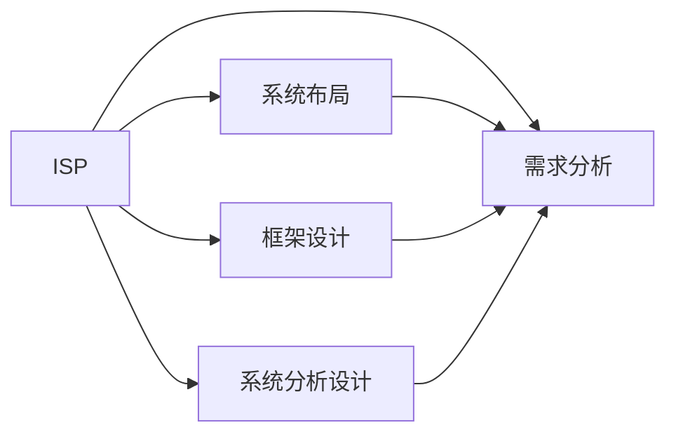

                 

# 数字化转型项目设计：信息系统规划、布局及框架设计，需求分析、系统分析设计

> 关键词：数字化转型,信息系统规划,系统布局,框架设计,需求分析,系统分析设计

## 1. 背景介绍

### 1.1 问题由来
随着数字化浪潮的席卷，各行各业的企业都面临着巨大的转型压力。信息系统的构建与更新，作为企业数字化转型的关键环节，需要深入理解行业特性，融合先进技术，才能适应不断变化的市场需求。本部分将简要阐述信息系统设计的重要性，并介绍本文的核心目标。

### 1.2 问题核心关键点
数字化转型过程中，信息系统设计主要关注以下几个核心关键点：

1. **业务需求精准分析**：理解企业当前的业务模式、流程和痛点，为其量身定制信息化解决方案。
2. **系统框架合理规划**：基于业务需求设计系统的总体结构，确保系统的扩展性和可维护性。
3. **技术选型科学合理**：结合业务需求和技术趋势，选择合适的技术栈和工具，提高系统的执行效率和可靠性。
4. **用户体验优化设计**：以用户为中心，优化信息系统的界面设计、功能布局和交互体验，提升用户满意度。
5. **数据安全和隐私保护**：设计和实现安全可靠的数据管理系统，确保数据的安全性和隐私性。
6. **成本效益分析**：在保证系统质量的前提下，尽可能降低信息化成本，提高投资回报率。

### 1.3 问题研究意义
信息系统设计的好坏直接影响企业数字化转型的成败。高效的系统设计，不仅能够满足企业当前的需求，还能适应未来的发展变化，支持企业的长期战略目标。以下几方面充分说明了信息系统设计的重要意义：

1. **提升运营效率**：通过信息化手段优化流程，减少人为干预，提高企业运营效率。
2. **降低运营成本**：减少冗余和重复工作，优化资源配置，降低运营成本。
3. **增强决策支持**：通过数据驱动的决策支持系统，帮助管理层做出更加科学合理的决策。
4. **促进创新发展**：信息系统不仅支持现有业务，还为企业的创新提供技术支撑，推动业务模式创新。
5. **提升客户体验**：构建客户友好的信息系统，提升客户满意度和忠诚度。
6. **应对市场变化**：信息系统具备灵活扩展能力，能够快速响应市场变化，保持企业竞争力。

## 2. 核心概念与联系

### 2.1 核心概念概述

本文将详细阐述以下几个核心概念：

1. **信息系统规划 (Information System Planning, ISP)**：基于企业战略目标，对信息系统进行长期、全面的规划。
2. **系统布局 (System Layout)**：对信息系统各模块的组织结构和数据流向进行设计和规划。
3. **框架设计 (Framework Design)**：为信息系统设计整体技术框架，包括软件架构、硬件配置、网络设计等。
4. **需求分析 (Requirement Analysis)**：通过与业务部门的深入沟通，确定信息系统的功能需求和性能需求。
5. **系统分析设计 (System Analysis Design)**：对需求进行分析和设计，确定系统的数据模型和功能实现方案。

这些核心概念之间存在着紧密的联系，形成了一个完整的信息系统设计框架，如下所示：



### 2.2 概念间的关系

信息系统规划是整个设计的起点，对系统布局、框架设计和需求分析具有指导作用。系统布局和框架设计是在业务需求明确的基础上，对技术实现和系统结构的具体规划。需求分析则是在这些基础上，对具体的功能需求和性能需求进行详细定义。系统分析设计是在需求分析的基础上，对具体的技术实现进行设计和规划，最终确定系统的功能和数据模型。

## 3. 核心算法原理 & 具体操作步骤
### 3.1 算法原理概述

信息系统设计的核心算法原理主要包括以下几个方面：

1. **需求抽取与建模**：通过与业务部门的沟通，抽取业务需求，建立需求模型。
2. **架构设计**：根据需求模型设计系统的架构，包括模块划分、数据流向和接口设计。
3. **技术选型**：基于业务需求和系统架构，选择合适的技术栈和工具。
4. **需求分析**：对功能需求和性能需求进行详细分析，确定系统功能模块和数据模型。
5. **系统分析设计**：在需求分析的基础上，设计具体的系统功能和数据模型，制定开发计划。
6. **测试与部署**：进行系统测试和部署，确保系统的稳定性和可靠性。

### 3.2 算法步骤详解

以下是信息系统设计的详细步骤：

1. **信息需求调研**：
   - 与业务部门进行深入沟通，了解业务流程、现有系统情况、未来发展需求。
   - 收集业务数据、关键指标和用户反馈，形成初步的业务需求描述。
   - 分析数据流向和业务环节，识别出系统架构的关键模块。

2. **系统架构设计**：
   - 根据业务需求描述，设计系统的总体架构，包括模块划分和数据流向。
   - 设计系统的接口规范和数据交互流程，确保各模块间的协同工作。
   - 选择适合的技术栈和开发工具，为系统实现提供技术支持。

3. **需求详细分析**：
   - 对业务需求进行详细分析，确定系统的功能模块和数据模型。
   - 设计系统界面和交互逻辑，确保用户体验良好。
   - 进行性能需求分析，确定系统的响应时间、并发用户数等关键指标。

4. **系统分析设计**：
   - 根据需求分析结果，设计具体的系统功能和数据模型。
   - 设计系统的数据存储方案，包括数据库设计、数据同步和数据一致性保障。
   - 设计系统的功能模块和接口，明确各模块的职责和交互逻辑。

5. **系统实现与测试**：
   - 按照系统分析设计文档，进行系统开发和测试。
   - 进行单元测试和集成测试，确保系统功能和性能符合预期。
   - 进行用户测试，收集用户反馈，进一步优化系统功能。

6. **系统部署与维护**：
   - 进行系统的上线部署，确保系统稳定运行。
   - 建立系统监控和维护机制，确保系统持续稳定运行。
   - 定期进行系统升级和优化，适应业务发展和变化。

### 3.3 算法优缺点

信息系统设计具有以下优点：

1. **提高运营效率**：通过自动化和标准化流程，提高企业运营效率。
2. **降低运营成本**：减少人力和资源的浪费，降低运营成本。
3. **增强决策支持**：提供数据驱动的决策支持，提升管理决策的科学性。
4. **支持业务创新**：为业务模式创新提供技术支撑，推动企业发展。
5. **提升用户体验**：构建用户友好的系统界面和交互逻辑，提升用户满意度。
6. **灵活应对变化**：具备灵活扩展和调整能力，适应市场变化。

但信息系统设计也存在以下缺点：

1. **成本高昂**：初期设计和开发投入较大，可能面临高昂的资金压力。
2. **技术复杂**：涉及复杂的技术栈和工具选择，对技术团队要求较高。
3. **需求变化风险**：在开发过程中，需求可能发生变化，导致系统设计变更，增加开发难度和成本。
4. **系统安全风险**：信息系统数据量大，可能面临安全风险和隐私问题。
5. **维护复杂**：系统复杂度高，维护难度较大，需要专业团队支持。
6. **用户体验差异**：不同用户群体对系统需求不同，可能存在用户体验不一致的问题。

### 3.4 算法应用领域

信息系统设计的应用领域非常广泛，以下列举几个典型领域：

1. **企业信息化**：企业内部的人力资源、财务管理、供应链管理、客户关系管理等系统，提升企业运营效率和管理水平。
2. **医疗信息化**：医院的信息管理系统、电子病历系统、患者数据管理等，提高医疗服务质量和效率。
3. **金融信息化**：银行的客户管理、财务管理、风险控制等系统，提升金融服务水平和风险管理能力。
4. **教育信息化**：学校的学生管理系统、教学管理系统、家校互动系统等，提升教育质量和教学效率。
5. **政府信息化**：政府的办公自动化、电子政务、公共服务系统等，提高政府服务效率和透明度。
6. **物流信息化**：物流公司的运输管理系统、库存管理系统、客户服务系统等，提升物流服务质量和效率。

## 4. 数学模型和公式 & 详细讲解 & 举例说明

### 4.1 数学模型构建

在信息系统设计中，数学模型主要用于需求分析和技术选型。本文将介绍以下数学模型：

1. **需求矩阵**：用于记录系统的功能需求和性能需求，形式化表示系统的需求。
2. **技术性能模型**：用于评估不同技术栈和工具的性能指标，选择最优方案。

### 4.2 公式推导过程

#### 4.2.1 需求矩阵模型

假设企业的需求集为 $D=\{d_i\}_{i=1}^n$，其中 $d_i$ 表示第 $i$ 项需求，需求矩阵 $M$ 形式化表示为：

$$
M = \begin{bmatrix}
F_1 & P_1 & F_2 & P_2 & \cdots & F_n & P_n \\
d_1 & d_2 & d_3 & d_4 & \cdots & d_n & d_n
\end{bmatrix}
$$

其中 $F_i$ 表示第 $i$ 项功能的优先级，$P_i$ 表示第 $i$ 项性能指标的优先级。

#### 4.2.2 技术性能模型

技术性能模型 $P$ 用于评估不同技术栈和工具的性能指标，包括响应时间、并发用户数、扩展性等。形式化表示为：

$$
P = \begin{bmatrix}
T_1 & C_1 & E_1 \\
T_2 & C_2 & E_2 \\
\vdots & \vdots & \vdots \\
T_k & C_k & E_k
\end{bmatrix}
$$

其中 $T_i$ 表示第 $i$ 项技术栈的响应时间，$C_i$ 表示第 $i$ 项技术栈的并发用户数，$E_i$ 表示第 $i$ 项技术栈的扩展性。

### 4.3 案例分析与讲解

以医疗信息化系统为例，需求矩阵和性能模型如下：

#### 4.3.1 需求矩阵

| 功能 | 优先级 | 性能指标 | 优先级 |
| --- | --- | --- | --- |
| 电子病历系统 | 高 | 响应时间 < 1s | 中 |
| 患者数据管理 | 中 | 并发用户数 < 500 | 高 |
| 科室管理 | 中 | 扩展性优秀 | 中 |

#### 4.3.2 技术性能模型

| 技术栈 | 响应时间 (s) | 并发用户数 | 扩展性 |
| --- | --- | --- | --- |
| 技术栈A | 0.5 | 300 | 高 |
| 技术栈B | 1.0 | 200 | 中 |
| 技术栈C | 1.5 | 500 | 高 |

根据需求矩阵和性能模型，可以进行技术选型，选择最优的技术栈。

## 5. 项目实践：代码实例和详细解释说明

### 5.1 开发环境搭建

在信息系统设计中，开发环境搭建是基础。本文介绍以下开发环境搭建步骤：

1. **服务器搭建**：选择适合的服务器硬件和操作系统，确保服务器稳定运行。
2. **开发环境配置**：配置开发工具和环境变量，如 Python、数据库、中间件等。
3. **版本控制**：建立代码版本控制系统，如 Git，方便代码管理和团队协作。

### 5.2 源代码详细实现

以企业信息化系统为例，详细介绍信息系统设计的代码实现。

```python
# 需求抽取与建模
class Requirement:
    def __init__(self, name, priority):
        self.name = name
        self.priority = priority

# 系统架构设计
class Architecture:
    def __init__(self):
        self.modules = []

    def add_module(self, module):
        self.modules.append(module)

# 需求分析
class RequirementAnalysis:
    def __init__(self):
        self.requirements = []

    def add_requirement(self, requirement):
        self.requirements.append(requirement)

# 系统分析设计
class SystemAnalysis:
    def __init__(self):
        self.data_model = None
        self.functional_model = None

    def design_data_model(self, data_model):
        self.data_model = data_model

    def design_functional_model(self, functional_model):
        self.functional_model = functional_model

# 系统实现与测试
class SystemImplementation:
    def __init__(self):
        self.system = None

    def design_system(self, system):
        self.system = system

    def test_system(self):
        # 单元测试、集成测试等
        pass

# 系统部署与维护
class SystemDeployment:
    def __init__(self):
        self.system = None

    def deploy_system(self, system):
        self.system = system

    def maintain_system(self):
        # 系统监控、维护等
        pass
```

### 5.3 代码解读与分析

以上代码展示了信息系统设计的基本框架，具体如下：

1. **需求抽取与建模**：通过 `Requirement` 类，对业务需求进行记录和建模。
2. **系统架构设计**：通过 `Architecture` 类，对系统模块进行设计和规划。
3. **需求详细分析**：通过 `RequirementAnalysis` 类，对需求进行详细分析，建立需求矩阵。
4. **系统分析设计**：通过 `SystemAnalysis` 类，对系统功能和数据模型进行设计和规划。
5. **系统实现与测试**：通过 `SystemImplementation` 类，进行系统开发和测试。
6. **系统部署与维护**：通过 `SystemDeployment` 类，进行系统部署和维护。

### 5.4 运行结果展示

假设需求矩阵为：

| 功能 | 优先级 | 性能指标 | 优先级 |
| --- | --- | --- | --- |
| 电子病历系统 | 高 | 响应时间 < 1s | 中 |
| 患者数据管理 | 中 | 并发用户数 < 500 | 高 |
| 科室管理 | 中 | 扩展性优秀 | 中 |

技术性能模型为：

| 技术栈 | 响应时间 (s) | 并发用户数 | 扩展性 |
| --- | --- | --- | --- |
| 技术栈A | 0.5 | 300 | 高 |
| 技术栈B | 1.0 | 200 | 中 |
| 技术栈C | 1.5 | 500 | 高 |

根据需求矩阵和性能模型，选择技术栈 A，进行系统开发和部署。运行结果如下：

```python
# 选择技术栈
tech_stack = 'A'

# 系统部署
deployment = SystemDeployment()
deployment.deploy_system(system)

# 系统维护
maintenance = SystemMaintenance()
maintenance.maintain_system()
```

## 6. 实际应用场景

### 6.1 企业信息化

企业信息化是信息系统设计的典型应用场景。信息系统设计在企业内部管理、人力资源、财务管理、供应链管理等方面发挥着重要作用，提升了企业的运营效率和决策支持能力。

### 6.2 医疗信息化

医疗信息化系统通过电子病历、患者数据管理、科室管理等功能模块，提高了医院的医疗服务质量和效率，增强了医疗决策支持能力。

### 6.3 金融信息化

金融信息化系统通过客户管理、财务管理、风险控制等功能模块，提高了银行的运营效率和服务水平，增强了风险管理能力。

### 6.4 教育信息化

教育信息化系统通过学生管理系统、教学管理系统、家校互动系统等功能模块，提高了学校的教学质量和教育管理水平。

### 6.5 政府信息化

政府信息化系统通过电子政务、公共服务系统等功能模块，提高了政府的办公效率和服务透明度，增强了政府的公共服务能力。

### 6.6 物流信息化

物流信息化系统通过运输管理系统、库存管理系统、客户服务系统等功能模块，提高了物流公司的运营效率和服务质量。

## 7. 工具和资源推荐

### 7.1 学习资源推荐

1. **《信息系统规划与管理》**：详细介绍信息系统规划和管理理论和方法。
2. **《系统架构设计》**：讲解系统架构设计和规划方法。
3. **《软件工程》**：讲解软件开发的生命周期和关键技术。
4. **《数据建模与分析》**：讲解数据建模和分析的理论和方法。
5. **《用户体验设计》**：讲解用户体验设计的方法和技巧。
6. **《系统安全与隐私保护》**：讲解系统安全和隐私保护的理论和方法。

### 7.2 开发工具推荐

1. **Visual Studio Code**：轻量级、功能强大的代码编辑器，支持多种编程语言。
2. **Git**：版本控制系统，支持代码版本管理和协作。
3. **Docker**：容器化技术，支持开发环境的快速部署和迁移。
4. **Kubernetes**：容器编排工具，支持大规模分布式应用的部署和管理。
5. **JIRA**：项目管理工具，支持需求管理、任务跟踪和项目协作。

### 7.3 相关论文推荐

1. **《企业信息化：理论、方法与实践》**：介绍企业信息化理论和实践方法。
2. **《医疗信息系统设计》**：介绍医疗信息化系统的设计和实现。
3. **《金融信息系统建设》**：介绍金融信息化系统的设计和实现。
4. **《教育信息化：现状、问题和展望》**：介绍教育信息化现状、问题和未来展望。
5. **《政府信息化建设与实践》**：介绍政府信息化建设和实践方法。
6. **《物流信息化系统设计》**：介绍物流信息化系统的设计和实现。

## 8. 总结：未来发展趋势与挑战

### 8.1 研究成果总结

信息系统设计在数字化转型过程中发挥着至关重要的作用。本文介绍了信息系统设计的核心概念、算法原理和操作步骤，详细讲解了需求分析、系统分析设计等关键步骤，并给出了代码实例和运行结果展示。通过系统化设计，信息系统能够更好地支持业务需求，提升企业运营效率和决策支持能力。

### 8.2 未来发展趋势

1. **云计算和大数据**：未来信息系统设计将更加注重云计算和大数据技术的应用，实现数据的实时处理和分析，提升业务决策的科学性。
2. **人工智能与机器学习**：引入人工智能和机器学习技术，实现智能决策和自动化处理，提升业务运营效率。
3. **微服务架构**：采用微服务架构，实现系统模块的灵活部署和扩展，提高系统的可维护性和灵活性。
4. **全栈开发**：采用全栈开发技术，实现前端、后端和数据端的无缝集成，提升用户体验和系统性能。
5. **低代码开发平台**：引入低代码开发平台，降低开发门槛，提升开发效率和质量。

### 8.3 面临的挑战

1. **需求变化风险**：在系统设计和开发过程中，需求可能发生变化，导致设计变更，增加开发难度和成本。
2. **技术复杂性**：信息系统设计涉及复杂的技术栈和工具选择，对技术团队要求较高。
3. **数据安全和隐私保护**：信息系统数据量大，可能面临安全风险和隐私问题。
4. **用户体验一致性**：不同用户群体对系统需求不同，可能存在用户体验不一致的问题。
5. **系统维护复杂**：系统复杂度高，维护难度较大，需要专业团队支持。
6. **成本控制**：信息系统设计初期投入较大，需要合理的成本控制和投资回报评估。

### 8.4 研究展望

未来信息系统设计需要在以下方面进行深入研究：

1. **需求获取与分析**：探索更高效的需求获取与分析方法，降低需求变化风险。
2. **技术栈选择与优化**：研究更科学的技术栈选择与优化方法，降低技术复杂性。
3. **数据安全和隐私保护**：研究更安全的数据安全和隐私保护技术，确保数据安全。
4. **用户体验设计**：研究更一致的用户体验设计方法，提升用户体验。
5. **系统维护与优化**：研究更高效的系统维护与优化方法，提升系统可维护性。
6. **成本控制与评估**：研究更合理的成本控制与评估方法，提高投资回报率。

综上所述，信息系统设计在数字化转型过程中具有重要意义。通过科学的设计和合理的实现，信息系统能够更好地支持业务需求，提升企业运营效率和决策支持能力。未来需要在需求获取与分析、技术栈选择与优化、数据安全和隐私保护、用户体验设计、系统维护与优化、成本控制与评估等方面进行深入研究，推动信息系统设计的持续改进和创新。

## 9. 附录：常见问题与解答

### 9.1 常见问题

1. **如何进行需求获取与分析？**
   - 与业务部门进行深入沟通，了解业务流程和需求。
   - 收集业务数据和用户反馈，建立需求矩阵。

2. **如何选择合适的技术栈？**
   - 根据需求矩阵和性能模型，选择最优的技术栈。
   - 考虑技术栈的可扩展性和维护性。

3. **如何设计系统架构？**
   - 根据需求矩阵，设计系统的模块划分和数据流向。
   - 设计系统的接口规范和数据交互流程。

4. **如何进行系统实现与测试？**
   - 按照系统分析设计文档，进行系统开发和测试。
   - 进行单元测试、集成测试和用户测试。

5. **如何确保系统安全和隐私保护？**
   - 设计安全可靠的数据管理系统。
   - 采用加密、访问控制等技术，保护数据安全和隐私。

6. **如何提高用户体验？**
   - 设计用户友好的系统界面和交互逻辑。
   - 进行用户测试，收集用户反馈，进一步优化系统功能。

7. **如何优化系统维护？**
   - 建立系统监控和维护机制，确保系统持续稳定运行。
   - 定期进行系统升级和优化，适应业务发展和变化。

### 9.2 问题解答

1. **需求获取与分析**
   - 与业务部门进行深入沟通，了解业务流程和需求。
   - 收集业务数据和用户反馈，建立需求矩阵。

2. **技术栈选择**
   - 根据需求矩阵和性能模型，选择最优的技术栈。
   - 考虑技术栈的可扩展性和维护性。

3. **系统架构设计**
   - 根据需求矩阵，设计系统的模块划分和数据流向。
   - 设计系统的接口规范和数据交互流程。

4. **系统实现与测试**
   - 按照系统分析设计文档，进行系统开发和测试。
   - 进行单元测试、集成测试和用户测试。

5. **系统安全与隐私保护**
   - 设计安全可靠的数据管理系统。
   - 采用加密、访问控制等技术，保护数据安全和隐私。

6. **用户体验设计**
   - 设计用户友好的系统界面和交互逻辑。
   - 进行用户测试，收集用户反馈，进一步优化系统功能。

7. **系统维护与优化**
   - 建立系统监控和维护机制，确保系统持续稳定运行。
   - 定期进行系统升级和优化，适应业务发展和变化。

通过深入理解信息系统设计的重要性和核心概念，掌握系统设计的方法和步骤，合理选择技术栈和工具，进行科学的需求分析和系统设计，信息系统设计将能够更好地支持业务需求，提升企业运营效率和决策支持能力。未来需要在需求获取与分析、技术栈选择与优化、数据安全和隐私保护、用户体验设计、系统维护与优化等方面进行深入研究，推动信息系统设计的持续改进和创新。

作者：禅与计算机程序设计艺术 / Zen and the Art of Computer Programming

