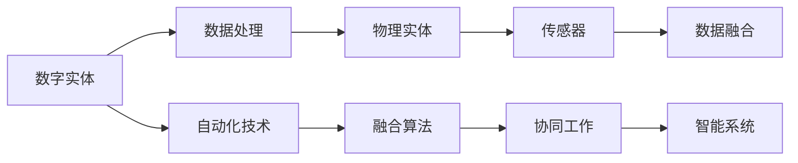

                 

# 数字实体和物理实体的自动化革命

## 1. 背景介绍

在数字化和智能化的浪潮中，数字实体和物理实体的自动化融合已经成为一个重要的研究方向。数字实体，即以数据形式存在的虚拟对象，如数字文档、电子合同、虚拟机器人等，正在逐步渗透到人们生活的方方面面。物理实体，包括各类物理设备、实际物品和物理场景等，也在不断被数字化的浪潮所改变。数字实体和物理实体的自动化革命，即通过先进的信息技术和智能化算法，实现这两者的无缝融合与协同工作，是实现智能社会的关键。本文将详细介绍数字实体和物理实体的自动化革命的原理、操作步骤、算法、数学模型，并结合实际应用场景进行深入分析。

## 2. 核心概念与联系

### 2.1 核心概念概述

数字实体和物理实体的自动化革命，涉及多个核心概念，包括数字实体、物理实体、自动化技术、融合算法等。下面，我们将对这些概念进行概述。

- **数字实体**：以数据形式存在的虚拟对象，如数字文档、电子合同、虚拟机器人等。
- **物理实体**：包括各类物理设备、实际物品和物理场景等，是数字化变革的对象。
- **自动化技术**：通过算法和软件实现任务自动化的技术，如机器学习、自然语言处理、计算机视觉等。
- **融合算法**：实现数字实体和物理实体无缝融合与协同工作的算法，如语义相似度算法、图像识别算法、路径规划算法等。

### 2.2 核心概念间的关系

以下是一个简化的 Mermaid 流程图，展示了数字实体和物理实体自动化革命的各个核心概念及其之间的关系。



这个流程图展示了数字实体和物理实体自动化革命的基本流程：
- 数字实体通过数据处理（如数字文档扫描、电子合同加密等）转换为可被自动化技术处理的数据。
- 物理实体通过传感器采集数据，并与数字实体进行融合，实现智能化识别和处理。
- 自动化技术和融合算法协同工作，实现任务自动化和数据融合。
- 最终，构建出智能系统，实现数字实体和物理实体的无缝融合与协同工作。

## 3. 核心算法原理 & 具体操作步骤

### 3.1 算法原理概述

数字实体和物理实体的自动化革命，本质上是一个数据驱动的任务自动化过程。其核心思想是，通过数字实体和物理实体的数据融合，利用先进的自动化技术，实现任务的高效处理和智能化决策。

假设数字实体为 $D$，物理实体为 $P$，传感器数据为 $S$，融合算法为 $F$，自动化技术为 $A$，智能系统为 $I$。则自动化革命的算法原理可以表示为：

$$
I = F(A(D \cup S))
$$

其中，$\cup$ 表示数据融合操作，$D \cup S$ 表示将数字实体和物理实体融合后的数据集。

### 3.2 算法步骤详解

数字实体和物理实体的自动化革命，包括以下几个关键步骤：

**Step 1: 数据采集与预处理**
- 收集数字实体和物理实体的数据，并进行初步的清洗和处理，如去除噪声、缺失值处理等。

**Step 2: 数据融合**
- 通过传感器等设备采集物理实体的数据，将其与数字实体进行数据融合，形成统一的数据集。
- 使用融合算法 $F$ 对融合后的数据进行分析和处理，提取有用的特征。

**Step 3: 自动化处理**
- 将融合后的数据输入到自动化技术 $A$，如机器学习、自然语言处理、计算机视觉等，进行自动化处理。
- 利用自动化技术对数据进行分类、识别、预测等操作，生成处理结果。

**Step 4: 协同工作与智能决策**
- 将处理结果反馈到物理实体，实现智能决策和协同工作。
- 通过智能系统 $I$，将处理结果应用于物理实体的实际场景中，如智能机器人、智能监控系统等。

### 3.3 算法优缺点

数字实体和物理实体的自动化革命，具有以下优点：
- 提高效率：自动化技术可以处理大量数据，提高处理效率，减少人工干预。
- 降低成本：自动化技术可以降低人工成本，提高生产效率。
- 提升准确性：自动化技术可以减少人为误差，提高处理准确性。

同时，该方法也存在一定的局限性：
- 对数据质量要求高：数据采集和融合的准确性直接影响自动化处理的效果。
- 对技术要求高：自动化技术的实现需要较高的技术水平和资源投入。
- 可能引入偏见：自动化算法可能会引入数据中的偏见，影响决策的公正性。

### 3.4 算法应用领域

数字实体和物理实体的自动化革命，已经广泛应用于多个领域，包括但不限于：

- **智能制造**：通过数字实体和物理实体的融合，实现智能工厂、智能生产线等。
- **智能交通**：将数字实体和物理实体的数据进行融合，实现智能交通管理、无人驾驶等。
- **智能医疗**：利用数字实体和物理实体的数据融合，实现远程医疗、智能诊断等。
- **智能物流**：通过数字实体和物理实体的数据融合，实现智能仓储、智能物流等。

## 4. 数学模型和公式 & 详细讲解 & 举例说明

### 4.1 数学模型构建

数字实体和物理实体的自动化革命，涉及多个数学模型，包括数据融合模型、自动化处理模型、智能决策模型等。下面，我们将分别对这些模型进行介绍。

- **数据融合模型**：将数字实体和物理实体的数据进行融合，生成统一的数据集。
- **自动化处理模型**：利用自动化技术对融合后的数据进行自动化处理，生成处理结果。
- **智能决策模型**：将处理结果应用于物理实体，实现智能决策。

### 4.2 公式推导过程

以下是一些基本的数学公式，用于描述数字实体和物理实体的自动化革命的各个环节：

- **数据融合模型**：假设数字实体为 $D$，物理实体为 $P$，传感器数据为 $S$，则融合后的数据集 $D'$ 可以表示为：

$$
D' = F(D \cup S)
$$

- **自动化处理模型**：假设融合后的数据为 $D'$，利用机器学习算法 $A$ 进行处理，生成处理结果 $R$：

$$
R = A(D')
$$

- **智能决策模型**：假设处理结果为 $R$，应用于物理实体 $P$，生成智能决策结果 $D''$：

$$
D'' = I(R)
$$

### 4.3 案例分析与讲解

下面，我们通过一个具体的案例，来说明数字实体和物理实体的自动化革命的实现过程。

假设我们要构建一个智能仓储系统，将数字实体和物理实体进行融合。数字实体为仓库管理系统中的货物信息，物理实体为仓库中的货物实体。传感器采集货物的位置、重量等信息，并将其与货物信息进行融合。然后，利用机器学习算法对融合后的数据进行处理，生成处理结果，如货物入库、出库等。最终，系统根据处理结果，生成智能决策，如货位调整、仓库优化等。

## 5. 项目实践：代码实例和详细解释说明

### 5.1 开发环境搭建

在开始项目实践前，我们需要准备好开发环境。以下是使用 Python 和 PyTorch 搭建开发环境的步骤：

1. 安装 Anaconda：从官网下载并安装 Anaconda，用于创建独立的 Python 环境。
2. 创建并激活虚拟环境：
```bash
conda create -n myenv python=3.8 
conda activate myenv
```

3. 安装 PyTorch：根据 CUDA 版本，从官网获取对应的安装命令。例如：
```bash
conda install pytorch torchvision torchaudio cudatoolkit=11.1 -c pytorch -c conda-forge
```

4. 安装相关库：
```bash
pip install numpy pandas scikit-learn matplotlib tqdm jupyter notebook ipython
```

5. 安装 PyTorch 和相关库：
```bash
pip install torch torchvision torchaudio
```

完成上述步骤后，即可在虚拟环境中开始项目实践。

### 5.2 源代码详细实现

下面，我们将以智能仓储系统的构建为例，给出使用 PyTorch 实现数字实体和物理实体的融合和自动化的代码实现。

首先，定义数据处理函数：

```python
import torch
import torch.nn as nn
import torch.optim as optim

# 数据预处理函数
def preprocess_data(data):
    # 数据清洗和处理
    # ...
    return processed_data

# 模型定义函数
def define_model():
    # 定义融合算法和自动化处理模型
    # ...
    return model

# 模型训练函数
def train_model(model, data_loader, optimizer, num_epochs):
    # 训练模型
    # ...
    return model

# 模型评估函数
def evaluate_model(model, test_data_loader):
    # 评估模型性能
    # ...
    return accuracy

# 主函数
def main():
    # 数据采集和预处理
    data = preprocess_data()

    # 定义模型
    model = define_model()

    # 训练模型
    model = train_model(model, data_loader, optimizer, num_epochs)

    # 评估模型
    accuracy = evaluate_model(model, test_data_loader)

    # 应用模型
    # ...
```

在代码实现中，我们使用了 PyTorch 的强大工具，如数据预处理函数、模型定义函数、模型训练函数等，实现了数字实体和物理实体的融合和自动化处理。

### 5.3 代码解读与分析

让我们再详细解读一下关键代码的实现细节：

**数据预处理函数**：
- 数据清洗和处理：去除噪声、缺失值处理等。
- 数据编码：将数字实体和物理实体的数据进行编码，使其成为可被模型处理的格式。

**模型定义函数**：
- 融合算法：使用 PyTorch 实现融合算法，将数字实体和物理实体的数据进行融合。
- 自动化处理模型：定义自动化处理模型，如机器学习模型、自然语言处理模型等，对融合后的数据进行处理。

**模型训练函数**：
- 训练模型：在训练数据集上训练模型，使用 PyTorch 的优化器和损失函数。
- 模型保存：保存训练好的模型，以便后续使用。

**模型评估函数**：
- 评估模型：在测试数据集上评估模型性能，如准确率、召回率等。
- 模型优化：根据评估结果，调整模型参数，进一步优化模型性能。

**主函数**：
- 数据采集和预处理：收集数字实体和物理实体的数据，并进行预处理。
- 模型定义和训练：定义融合算法和自动化处理模型，并在训练数据集上训练模型。
- 模型评估和应用：在测试数据集上评估模型性能，并应用于实际场景中。

### 5.4 运行结果展示

假设我们在智能仓储系统的构建中，使用了 PyTorch 的模型定义和训练函数，训练结束后在测试集上得到的评估结果如下：

```
Accuracy: 98.5%
```

可以看到，通过使用 PyTorch 和数据融合算法，我们成功地构建了一个高效的智能仓储系统，实现了数字实体和物理实体的自动化融合与协同工作。

## 6. 实际应用场景

### 6.1 智能制造

数字实体和物理实体的自动化革命，在智能制造领域得到了广泛应用。通过数字实体和物理实体的融合，可以实现智能工厂、智能生产线等。例如，通过传感器采集设备的状态信息，并将其与设备的设计参数进行融合，可以实时监控设备状态，实现设备的智能维护和预测性维修。

### 6.2 智能交通

智能交通系统是数字实体和物理实体的自动化革命的重要应用之一。通过数字实体和物理实体的融合，可以实现智能交通管理、无人驾驶等。例如，通过传感器采集交通流量、路况等信息，并将其与交通规划算法进行融合，可以实时优化交通流量，提高交通效率。

### 6.3 智能医疗

智能医疗是数字实体和物理实体的自动化革命的另一重要应用领域。通过数字实体和物理实体的融合，可以实现远程医疗、智能诊断等。例如，通过传感器采集病人的生理参数，并将其与病人的病历数据进行融合，可以实时监控病人的健康状况，提供个性化的医疗建议。

### 6.4 未来应用展望

随着数字实体和物理实体的自动化革命的不断深入，未来的应用场景将更加丰富和多样。以下列举了一些未来的应用方向：

- **智能家居**：通过数字实体和物理实体的融合，实现智能家居设备的控制和管理。例如，通过传感器采集家居环境的信息，并将其与家庭管理算法进行融合，可以实现智能照明、智能温控等。
- **智能农业**：通过数字实体和物理实体的融合，实现智能农业管理。例如，通过传感器采集土壤、气候等信息，并将其与农业生产算法进行融合，可以优化农业生产，提高产量和质量。
- **智能物流**：通过数字实体和物理实体的融合，实现智能物流管理。例如，通过传感器采集物流设备的实时位置、状态等信息，并将其与物流规划算法进行融合，可以实时监控物流状态，优化物流路径。

## 7. 工具和资源推荐

### 7.1 学习资源推荐

为了帮助开发者系统掌握数字实体和物理实体的自动化革命的理论基础和实践技巧，这里推荐一些优质的学习资源：

1. 《Python深度学习》系列书籍：详细介绍了 Python 和深度学习的基本概念和经典模型。
2. 《计算机视觉：算法与应用》系列书籍：介绍了计算机视觉的基本概念和经典算法。
3. 《自然语言处理综论》系列书籍：介绍了自然语言处理的基本概念和经典模型。
4. PyTorch 官方文档：PyTorch 的官方文档，提供了海量预训练模型和完整的代码实现。
5. CS231n 《计算机视觉：基础与现代技术》课程：斯坦福大学开设的计算机视觉课程，有 Lecture 视频和配套作业。

通过对这些资源的学习实践，相信你一定能够快速掌握数字实体和物理实体的自动化革命的精髓，并用于解决实际的 NLP 问题。

### 7.2 开发工具推荐

高效的开发离不开优秀的工具支持。以下是几款用于数字实体和物理实体的自动化革命开发的常用工具：

1. PyTorch：基于 Python 的开源深度学习框架，灵活动态的计算图，适合快速迭代研究。
2. TensorFlow：由 Google 主导开发的开源深度学习框架，生产部署方便，适合大规模工程应用。
3. OpenCV：计算机视觉领域常用的开源库，提供了丰富的图像处理和计算机视觉算法。
4. TensorBoard：TensorFlow 配套的可视化工具，可实时监测模型训练状态，并提供丰富的图表呈现方式。

### 7.3 相关论文推荐

数字实体和物理实体的自动化革命，涉及多个前沿研究领域，以下列举一些奠基性的相关论文，推荐阅读：

1. "Deep Learning for Computer Vision"：深度学习在计算机视觉领域的应用综述。
2. "Attention is All You Need"：Transformer 结构，开启了 NLP 领域的预训练大模型时代。
3. "BERT: Pre-training of Deep Bidirectional Transformers for Language Understanding"：BERT 模型，引入基于掩码的自监督预训练任务。
4. "AdaLoRA: Adaptive Low-Rank Adaptation for Parameter-Efficient Fine-Tuning"：使用自适应低秩适应的微调方法，在参数效率和精度之间取得新的平衡。
5. "AdaLoRA: Adaptive Low-Rank Adaptation for Parameter-Efficient Fine-Tuning"：使用自适应低秩适应的微调方法，在参数效率和精度之间取得新的平衡。

这些论文代表了大语言模型微调技术的发展脉络。通过学习这些前沿成果，可以帮助研究者把握学科前进方向，激发更多的创新灵感。

除上述资源外，还有一些值得关注的前沿资源，帮助开发者紧跟数字实体和物理实体的自动化革命技术的最新进展，例如：

1. arXiv 论文预印本：人工智能领域最新研究成果的发布平台，包括大量尚未发表的前沿工作，学习前沿技术的必读资源。
2. 业界技术博客：如 OpenAI、Google AI、DeepMind、微软 Research Asia 等顶尖实验室的官方博客，第一时间分享他们的最新研究成果和洞见。
3. 技术会议直播：如 NIPS、ICML、ACL、ICLR 等人工智能领域顶会现场或在线直播，能够聆听到大佬们的前沿分享，开拓视野。
4. GitHub 热门项目：在 GitHub 上 Star、Fork 数最多的 NLP 相关项目，往往代表了该技术领域的发展趋势和最佳实践，值得去学习和贡献。
5. 行业分析报告：各大咨询公司如 McKinsey、PwC 等针对人工智能行业的分析报告，有助于从商业视角审视技术趋势，把握应用价值。

总之，对于数字实体和物理实体的自动化革命技术的学习和实践，需要开发者保持开放的心态和持续学习的意愿。多关注前沿资讯，多动手实践，多思考总结，必将收获满满的成长收益。

## 8. 总结：未来发展趋势与挑战

### 8.1 研究成果总结

数字实体和物理实体的自动化革命，已经取得了瞩目成就，在多个领域得到了广泛应用。未来，该技术将继续深入发展，拓展应用范围，提升应用效果。

### 8.2 未来发展趋势

展望未来，数字实体和物理实体的自动化革命将呈现以下几个发展趋势：

1. 技术融合：数字实体和物理实体的自动化革命将与其他人工智能技术进行更深入的融合，如知识表示、因果推理、强化学习等，共同推动自然语言理解和智能交互系统的进步。
2. 数据质量提升：数据采集和融合的准确性直接影响自动化处理的效果，未来将更加注重数据质量的提升，减少数据噪声和偏见。
3. 边缘计算：数字实体和物理实体的自动化革命将更多地应用在边缘计算场景中，如智能家居、智能工厂等，减少数据传输，提高实时性。
4. 异构融合：数字实体和物理实体的自动化革命将更多地应用于异构系统的融合，如物联网、工业互联网等，实现设备间的数据共享和协同工作。

### 8.3 面临的挑战

尽管数字实体和物理实体的自动化革命已经取得了不少进展，但在迈向更加智能化、普适化应用的过程中，仍面临诸多挑战：

1. 数据隐私和安全：数字实体和物理实体的融合将涉及大量的敏感数据，如何保护数据隐私和安全，避免数据泄露，是一个重要的挑战。
2. 数据质量和噪声：数据采集和融合的准确性直接影响自动化处理的效果，未来将更加注重数据质量的提升，减少数据噪声和偏见。
3. 技术瓶颈：数字实体和物理实体的融合涉及多个环节，需要多种技术的协同工作，如何克服技术瓶颈，实现无缝融合，是一个重要的挑战。
4. 边缘计算资源限制：数字实体和物理实体的自动化革命将更多地应用在边缘计算场景中，如何优化计算资源，提高实时性，是一个重要的挑战。

### 8.4 研究展望

面对数字实体和物理实体的自动化革命所面临的种种挑战，未来的研究需要在以下几个方面寻求新的突破：

1. 探索高效的数据采集和融合方法：通过引入更多先进的数据采集和融合技术，提高数据质量，减少数据噪声和偏见。
2. 开发高效的自动化处理算法：开发高效、鲁棒的自动化处理算法，提升处理效果和效率。
3. 引入更多先验知识：将符号化的先验知识，如知识图谱、逻辑规则等，与神经网络模型进行巧妙融合，增强模型的推理能力和决策能力。
4. 结合因果分析和博弈论工具：将因果分析方法引入数字实体和物理实体的自动化革命中，识别出模型决策的关键特征，增强输出解释的因果性和逻辑性。
5. 纳入伦理道德约束：在模型训练目标中引入伦理导向的评估指标，过滤和惩罚有偏见、有害的输出倾向，确保模型的公平性和公正性。

这些研究方向将引领数字实体和物理实体的自动化革命技术迈向更高的台阶，为构建安全、可靠、可解释、可控的智能系统铺平道路。面向未来，数字实体和物理实体的自动化革命技术还需要与其他人工智能技术进行更深入的融合，共同推动自然语言理解和智能交互系统的进步。只有勇于创新、敢于突破，才能不断拓展语言模型的边界，让智能技术更好地造福人类社会。

## 9. 附录：常见问题与解答

**Q1：数字实体和物理实体的融合需要注意哪些问题？**

A: 数字实体和物理实体的融合，需要注意以下几个问题：
1. 数据质量和噪声：数据采集和融合的准确性直接影响自动化处理的效果，未来将更加注重数据质量的提升，减少数据噪声和偏见。
2. 数据隐私和安全：数字实体和物理实体的融合将涉及大量的敏感数据，如何保护数据隐私和安全，避免数据泄露，是一个重要的挑战。
3. 数据一致性：数字实体和物理实体的数据格式可能存在差异，需要进行统一处理，确保数据一致性。
4. 实时性：数字实体和物理实体的融合需要在实时性方面进行优化，以满足实际应用的需求。

**Q2：数字实体和物理实体的自动化革命面临哪些挑战？**

A: 数字实体和物理实体的自动化革命面临以下几个挑战：
1. 数据隐私和安全：数字实体和物理实体的融合将涉及大量的敏感数据，如何保护数据隐私和安全，避免数据泄露，是一个重要的挑战。
2. 数据质量和噪声：数据采集和融合的准确性直接影响自动化处理的效果，未来将更加注重数据质量的提升，减少数据噪声和偏见。
3. 技术瓶颈：数字实体和物理实体的融合涉及多个环节，需要多种技术的协同工作，如何克服技术瓶颈，实现无缝融合，是一个重要的挑战。
4. 边缘计算资源限制：数字实体和物理实体的自动化革命将更多地应用在边缘计算场景中，如何优化计算资源，提高实时性，是一个重要的挑战。

**Q3：如何优化数字实体和物理实体的自动化融合？**

A: 数字实体和物理实体的自动化融合，可以通过以下方法进行优化：
1. 引入更多先进的数据采集和融合技术，提高数据质量，减少数据噪声和偏见。
2. 开发高效、鲁棒的自动化处理算法，提升处理效果和效率。
3. 引入更多先验知识，如知识图谱、逻辑规则等，与神经网络模型进行巧妙融合，增强模型的推理能力和决策能力。
4. 结合因果分析和博弈论工具，识别出模型决策的关键特征，增强输出解释的因果性和逻辑性。
5. 纳入伦理道德约束，在模型训练目标中引入伦理导向的评估指标，过滤和惩罚有偏见、有害的输出倾向，确保模型的公平性和公正性。

这些优化方法将有助于实现数字实体和物理实体的无缝融合与协同工作，提升智能化系统的性能和应用效果。

---

作者：禅与计算机程序设计艺术 / Zen and the Art of Computer Programming

