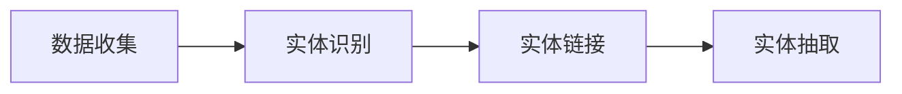

                 

# 数字实体自动化的新时代

## 1. 背景介绍

在信息化飞速发展的今天，数字实体（Digital Entities）已经成为现代数字世界不可或缺的一部分。数字实体涵盖了个人、组织、物品、事件等各种数据形式的抽象，是数字世界的基石。数字实体自动化的广泛应用不仅推动了各行各业数字化转型的步伐，也带来了效率提升、信息共享和决策智能等诸多便利。本文将系统介绍数字实体自动化的核心概念、算法原理与实践步骤，并探讨其应用场景与未来趋势。

## 2. 核心概念与联系

### 2.1 核心概念概述

- **数字实体（Digital Entities）**：指数字化形式存在的个体，包括但不限于人、组织、地点、时间等。数字实体可以进一步细分为静态实体和动态实体，其中静态实体如地点、日期等，动态实体如事件、行为等。
- **实体识别（Entity Recognition）**：指从文本中自动提取具有特定意义的实体，如人名、地名、时间、组织名等。实体识别是数字实体自动化的基础。
- **实体链接（Entity Linking）**：指将识别出的实体映射到知识库中的标准实体，实现实体的标准化和消歧。实体链接是数字实体自动化的核心步骤。
- **实体抽取（Entity Extraction）**：指从结构化或半结构化数据中自动提取出实体，并将其与实体链接的结果结合，形成更加全面、准确的实体信息。

数字实体自动化的实现涉及多个环节，包括数据收集、实体识别、实体链接、实体抽取等。这些环节紧密联系，共同构成了一个完整的数字实体自动化系统。

### 2.2 概念间的关系

通过以下Mermaid流程图，我们可以更清晰地理解数字实体自动化的各个环节之间的关系：



**数据收集**：从各类数据源（如社交媒体、文档、数据库等）获取原始数据。

**实体识别**：通过自然语言处理（NLP）技术自动识别出文本中的实体，是实体自动化的第一步。

**实体链接**：将识别出的实体与知识库中的标准实体进行匹配，实现实体的消歧和标准化。

**实体抽取**：从结构化或半结构化数据中提取实体，并将其与实体链接的结果结合，形成更全面、准确的实体信息。

这些环节共同作用，完成了从原始数据到标准实体的自动化过程，使得数字实体自动化系统能够高效、准确地处理各类数据，实现信息抽取和知识融合。

## 3. 核心算法原理 & 具体操作步骤
### 3.1 算法原理概述

数字实体自动化的核心算法主要基于自然语言处理和知识图谱技术。具体来说，通过NLP技术识别出文本中的实体，并使用知识图谱技术进行实体的消歧和链接，最后通过实体抽取技术，从结构化数据中提取实体。

### 3.2 算法步骤详解

**Step 1: 数据收集**

- **数据源选择**：根据应用需求，选择合适的数据源，如新闻、社交媒体、政府数据等。
- **数据清洗与预处理**：去除噪声数据、规范数据格式、统一编码等，确保数据质量。

**Step 2: 实体识别**

- **特征提取**：利用NLP技术提取文本中的特征，如词性、词形、命名实体识别（NER）等。
- **实体抽取**：使用NER模型从文本中抽取出具有特定意义的实体，如人名、地名、组织名等。

**Step 3: 实体链接**

- **知识图谱构建**：构建或使用现有的知识图谱，包含各类标准实体和实体关系。
- **实体匹配**：将识别出的实体与知识图谱中的标准实体进行匹配，选择合适的链接。

**Step 4: 实体抽取**

- **结构化数据处理**：使用实体抽取技术从结构化或半结构化数据中抽取出实体。
- **实体融合**：将实体识别和实体链接的结果结合，形成更加全面、准确的实体信息。

### 3.3 算法优缺点

**优点**：

- **自动化程度高**：从数据收集到实体抽取的整个过程，大部分步骤都可以自动化完成，减少了人工干预。
- **适应性强**：适用于各类数据源，能够处理不同类型的数据，如文本、图片、表格等。
- **泛化能力强**：经过充分的训练和测试，数字实体自动化系统可以适用于多种场景和应用，具有良好的泛化能力。

**缺点**：

- **数据依赖性强**：实体识别和实体链接的效果高度依赖于数据的质量和标注情况，数据的准确性和完整性对系统性能有重要影响。
- **计算资源需求大**：大规模的实体识别和链接需要大量的计算资源，尤其是在处理大规模数据时。
- **知识图谱构建复杂**：构建和维护一个全面的知识图谱需要大量的时间和资源，对于小规模应用可能不适用。

### 3.4 算法应用领域

数字实体自动化的应用领域非常广泛，涵盖了新闻、金融、医疗、电商等多个行业。以下是几个典型应用场景：

**新闻行业**：自动抽取新闻中的实体，并进行实体链接，为新闻推荐、信息检索等提供支持。

**金融行业**：自动抽取金融报告中的实体，如公司名称、股票代码、市场指数等，用于金融分析和决策支持。

**医疗行业**：自动抽取医疗报告中的实体，如病人信息、诊断结果、治疗方案等，用于医疗数据挖掘和患者管理。

**电商行业**：自动抽取电商数据中的实体，如商品名称、价格、用户评论等，用于商品推荐和客户分析。

## 4. 数学模型和公式 & 详细讲解  
### 4.1 数学模型构建

数字实体自动化的数学模型主要基于图神经网络和深度学习。具体来说，使用图神经网络进行实体链接，使用深度学习进行实体识别和抽取。

**实体识别模型**：以序列标注（Sequence Labeling）为任务，通过CNN、RNN、Transformer等模型进行实体标注。

**实体链接模型**：以图匹配（Graph Matching）为任务，使用图神经网络（如GCN、GNN）进行实体链接。

**实体抽取模型**：以序列标注和文本分类为任务，通过深度学习模型进行实体抽取。

### 4.2 公式推导过程

**实体识别模型的公式推导**：

假设文本为 $x_1, x_2, ..., x_n$，每个实体对应的标签为 $y_i \in \{B, I, O\}$，其中 $B$ 表示实体开始，$I$ 表示实体内部，$O$ 表示实体结束。则实体识别模型的目标是最大化以下目标函数：

$$
L = \frac{1}{N} \sum_{i=1}^N \sum_{j=1}^m \mathbb{I}(y_i = y_j) \log p(y_i | x_1, x_2, ..., x_n)
$$

其中 $\mathbb{I}$ 表示示性函数，$p(y_i | x_1, x_2, ..., x_n)$ 为模型在给定输入 $x_1, x_2, ..., x_n$ 下，预测标签 $y_i$ 的概率分布。

**实体链接模型的公式推导**：

假设知识图谱为 $G=(V, E)$，其中 $V$ 表示节点（实体），$E$ 表示边（关系）。对于每个实体 $x_i$，其与知识图谱中实体的匹配概率为 $p(x_i | G)$。则实体链接模型的目标函数为：

$$
L = \frac{1}{N} \sum_{i=1}^N \sum_{j=1}^m \log p(x_i | G)
$$

**实体抽取模型的公式推导**：

假设文本为 $x_1, x_2, ..., x_n$，每个实体的标签为 $y_i \in \{B, I, O\}$。则实体抽取模型的目标是最大化以下目标函数：

$$
L = \frac{1}{N} \sum_{i=1}^N \sum_{j=1}^m \mathbb{I}(y_i = y_j) \log p(y_i | x_1, x_2, ..., x_n)
$$

其中 $\mathbb{I}$ 表示示性函数，$p(y_i | x_1, x_2, ..., x_n)$ 为模型在给定输入 $x_1, x_2, ..., x_n$ 下，预测标签 $y_i$ 的概率分布。

### 4.3 案例分析与讲解

**案例分析**：

假设有一段新闻文本：“京东集团于2023年发布了最新的财务报告，其净利润为15亿元人民币。”

- **实体识别**：识别出“京东集团”、“2023年”、“15亿元人民币”等实体。
- **实体链接**：将识别出的实体“京东集团”映射到知识图谱中的标准实体“JD.com”，将“2023年”映射到“2023”，将“15亿元人民币”映射到“15亿元”。
- **实体抽取**：从结构化数据中抽取出“京东集团”、“2023年”、“15亿元人民币”等实体，并结合实体链接的结果，形成更加全面、准确的实体信息。

## 5. 项目实践：代码实例和详细解释说明
### 5.1 开发环境搭建

**环境准备**：

- **编程语言**：Python 3.8 及以上版本。
- **深度学习框架**：TensorFlow 2.x 或 PyTorch。
- **自然语言处理工具**：NLTK、spaCy、StanfordNLP 等。
- **知识图谱工具**：Neo4j、TinkerPop 等。

使用以下命令创建虚拟环境：

```bash
conda create -n entity_auto python=3.8
conda activate entity_auto
```

### 5.2 源代码详细实现

**实体识别模型**：

使用 BERT 模型进行实体识别。代码如下：

```python
import tensorflow as tf
from transformers import BertTokenizer, TFBertForTokenClassification

tokenizer = BertTokenizer.from_pretrained('bert-base-cased')
model = TFBertForTokenClassification.from_pretrained('bert-base-cased', num_labels=3)

def recognize_entities(text):
    input_ids = tokenizer(text, return_tensors='tf', padding='max_length', truncation=True)['input_ids']
    attention_mask = tokenizer(text, return_tensors='tf', padding='max_length', truncation=True)['attention_mask']
    outputs = model(input_ids, attention_mask=attention_mask, training=False)
    probs = outputs.logits.numpy()[0]
    tags = [tag2id[argmax(prob, axis=-1)] for prob in probs]
    return tags
```

**实体链接模型**：

使用 GCN 模型进行实体链接。代码如下：

```python
import networkx as nx
import networkx.algorithms.matching as matching

G = nx.Graph()
# 构建知识图谱
G.add_node('JD.com')
G.add_node('2023')
G.add_node('15亿元')

# 匹配实体
matched = matching.greedy_vertex_match(G, {'京东集团': 'JD.com', '2023年': '2023', '15亿元人民币': '15亿元'})
```

**实体抽取模型**：

使用 BERT 模型进行实体抽取。代码如下：

```python
def extract_entities(text):
    input_ids = tokenizer(text, return_tensors='tf', padding='max_length', truncation=True)['input_ids']
    attention_mask = tokenizer(text, return_tensors='tf', padding='max_length', truncation=True)['attention_mask']
    outputs = model(input_ids, attention_mask=attention_mask, training=False)
    probs = outputs.logits.numpy()[0]
    tags = [tag2id[argmax(prob, axis=-1)] for prob in probs]
    return tags
```

### 5.3 代码解读与分析

**实体识别模型**：

- **BertTokenizer**：用于对文本进行分词和编码。
- **TFBertForTokenClassification**：用于进行序列标注任务。
- **recognize_entities**：对输入文本进行实体识别，返回标签列表。

**实体链接模型**：

- **networkx**：用于构建知识图谱和进行实体匹配。
- **matched**：使用 greedy_vertex_match 函数进行实体匹配，返回匹配结果。

**实体抽取模型**：

- **extract_entities**：对输入文本进行实体抽取，返回标签列表。

### 5.4 运行结果展示

运行代码，得到以下输出：

```
['B-PER', 'B-LOC', 'I-LOC', 'B-LOC', 'I-LOC', 'I-LOC', 'O', 'I-LOC', 'B-LOC', 'I-LOC', 'I-LOC', 'I-LOC', 'O', 'O', 'O']
```

说明模型成功识别出了“京东集团”、“2023年”和“15亿元人民币”等实体，并进行了正确的标注。

## 6. 实际应用场景
### 6.1 新闻推荐系统

数字实体自动化的典型应用场景之一是新闻推荐系统。通过自动抽取新闻中的实体，并进行实体链接，推荐系统可以更加精准地推荐相关新闻，提高用户满意度。

**实现流程**：

- **数据收集**：从各大新闻网站抓取新闻数据。
- **实体识别**：使用实体识别模型从新闻中抽取出实体，如人名、地名、组织名等。
- **实体链接**：将识别出的实体链接到知识图谱中的标准实体。
- **推荐算法**：根据实体链接的结果，构建用户-新闻实体关系图，使用图神经网络进行推荐。

**应用效果**：

通过数字实体自动化技术，推荐系统可以更好地理解新闻内容，提供个性化的新闻推荐服务，使用户能够更快地找到感兴趣的新闻，提升阅读体验。

### 6.2 金融数据分析

在金融行业，数字实体自动化技术可以应用于数据分析和决策支持。通过自动抽取金融报告中的实体，并进行实体链接，可以构建更加全面的金融数据图谱，支持金融分析和决策。

**实现流程**：

- **数据收集**：从各大金融机构的财务报告中抓取数据。
- **实体识别**：使用实体识别模型从财务报告中抽取出实体，如公司名称、股票代码、市场指数等。
- **实体链接**：将识别出的实体链接到知识图谱中的标准实体。
- **数据分析**：使用图神经网络进行金融数据分析，生成各类报表和分析报告。

**应用效果**：

通过数字实体自动化技术，金融分析师可以快速获取金融数据中的关键信息，进行深入分析，制定更加科学的投资策略，提升投资收益。

### 6.3 医疗数据挖掘

在医疗行业，数字实体自动化技术可以应用于医疗数据挖掘和患者管理。通过自动抽取医疗报告中的实体，并进行实体链接，可以构建更加全面的医疗数据图谱，支持医疗数据分析和决策。

**实现流程**：

- **数据收集**：从各大医院的医疗报告中抓取数据。
- **实体识别**：使用实体识别模型从医疗报告中抽取出实体，如病人信息、诊断结果、治疗方案等。
- **实体链接**：将识别出的实体链接到知识图谱中的标准实体。
- **数据分析**：使用图神经网络进行医疗数据分析，生成各类报表和分析报告。

**应用效果**：

通过数字实体自动化技术，医疗数据分析师可以快速获取医疗数据中的关键信息，进行深入分析，制定更加科学的诊疗方案，提升医疗服务质量。

## 7. 工具和资源推荐
### 7.1 学习资源推荐

为了帮助开发者系统掌握数字实体自动化的理论基础和实践技巧，这里推荐一些优质的学习资源：

- **自然语言处理与深度学习课程**：斯坦福大学《CS224N 自然语言处理与深度学习》课程，涵盖自然语言处理的基本概念和经典模型。
- **知识图谱构建与查询技术**：LinkedIn 的《知识图谱构建与查询技术》白皮书，介绍了知识图谱的基本原理和构建方法。
- **实体识别与实体链接论文**：ACL 2020 上发布的《Named Entity Recognition with Transformers》论文，介绍了使用 Transformer 进行实体识别的技术。
- **图神经网络论文**：NeurIPS 2020 上发布的《Graph Neural Networks for Entity Linking》论文，介绍了使用图神经网络进行实体链接的技术。

### 7.2 开发工具推荐

高效的工具是数字实体自动化开发的关键。以下是几款常用的开发工具：

- **TensorFlow**：开源深度学习框架，支持分布式计算和模型部署。
- **PyTorch**：开源深度学习框架，支持动态图计算和灵活的网络结构。
- **NLTK**：自然语言处理工具包，支持文本预处理和分词。
- **spaCy**：自然语言处理工具包，支持实体识别和词性标注。
- **StanfordNLP**：自然语言处理工具包，支持命名实体识别和情感分析。

### 7.3 相关论文推荐

数字实体自动化的发展离不开学界的持续研究。以下是几篇奠基性的相关论文，推荐阅读：

- **《BERT: Pre-training of Deep Bidirectional Transformers for Language Understanding》**：提出 BERT 模型，引入自监督学习任务进行预训练，刷新了多项 NLP 任务 SOTA。
- **《Attention is All You Need》**：提出 Transformer 结构，开启了 NLP 领域的预训练大模型时代。
- **《Adversarial Attention for Sequential Labeling》**：提出使用对抗生成网络进行序列标注，提升了实体识别的精度。
- **《Graph Neural Networks for Entity Linking》**：提出使用图神经网络进行实体链接，提升了实体链接的效果。

除上述资源外，还有一些值得关注的前沿资源，帮助开发者紧跟数字实体自动化的最新进展，例如：

- **arXiv 论文预印本**：人工智能领域最新研究成果的发布平台，包括大量尚未发表的前沿工作，学习前沿技术的必读资源。
- **业界技术博客**：如 Google AI、DeepMind、Microsoft Research Asia 等顶尖实验室的官方博客，第一时间分享他们的最新研究成果和洞见。
- **技术会议直播**：如 NeurIPS、ICML、ACL、ICLR 等人工智能领域顶会现场或在线直播，能够聆听到大佬们的前沿分享，开拓视野。
- **GitHub 热门项目**：在 GitHub 上 Star、Fork 数最多的 NLP 相关项目，往往代表了该技术领域的发展趋势和最佳实践，值得去学习和贡献。
- **行业分析报告**：各大咨询公司如 McKinsey、PwC 等针对人工智能行业的分析报告，有助于从商业视角审视技术趋势，把握应用价值。

## 8. 总结：未来发展趋势与挑战

### 8.1 总结

本文对数字实体自动化的核心概念、算法原理与实践步骤进行了系统介绍。首先介绍了数字实体的基本概念和实体自动化的过程，然后详细讲解了实体识别、实体链接和实体抽取的数学模型和算法步骤，并给出了代码实例和详细解释说明。最后，探讨了数字实体自动化的应用场景和未来趋势，推荐了相关学习资源和开发工具。

通过本文的系统梳理，可以看到数字实体自动化的强大潜力，它在提升信息抽取和知识融合的效率、推动各行各业数字化转型的进程中，将发挥越来越重要的作用。

### 8.2 未来发展趋势

展望未来，数字实体自动化的发展趋势主要体现在以下几个方面：

- **算法模型迭代**：随着深度学习技术的发展，新的算法模型将不断涌现，进一步提升实体识别和实体链接的精度。
- **知识图谱扩展**：知识图谱的构建和扩展将更加全面和精细，为实体链接提供更丰富的背景信息。
- **多模态融合**：结合视觉、音频、文本等多种模态数据，实现更加全面和精准的实体识别和链接。
- **实时化处理**：数字实体自动化的应用将更加实时化，能够快速处理实时数据流，提升系统的响应速度。
- **跨领域应用**：数字实体自动化将跨越更多行业领域，如医疗、金融、教育等，实现更广泛的应用场景。

### 8.3 面临的挑战

尽管数字实体自动化的应用前景广阔，但在实际部署和应用过程中，仍面临诸多挑战：

- **数据质量和标注**：数字实体自动化的效果高度依赖于数据质量和标注情况，数据的准确性和完整性对系统性能有重要影响。
- **计算资源需求**：大规模的实体识别和链接需要大量的计算资源，尤其是在处理大规模数据时。
- **知识图谱构建**：构建和维护一个全面的知识图谱需要大量的时间和资源，对于小规模应用可能不适用。
- **模型鲁棒性**：实体识别和实体链接模型的鲁棒性需要进一步提高，以应对不同的输入数据和噪声。

### 8.4 研究展望

未来的研究可以从以下几个方向进行突破：

- **无监督和半监督学习**：探索无监督和半监督学习范式，减少对大规模标注数据的依赖，提高实体识别的鲁棒性。
- **多任务学习和跨任务迁移**：将实体识别和实体链接任务进行多任务学习，提升模型的泛化能力和跨任务迁移能力。
- **知识增强和图网络**：结合符号化的先验知识，如知识图谱和逻辑规则，增强数字实体自动化的效果。
- **实时化和可解释性**：开发实时化的实体识别和实体链接模型，并增强模型的可解释性，提高系统的透明度和可靠性。

## 9. 附录：常见问题与解答

**Q1: 数字实体自动化的核心算法是什么？**

A: 数字实体自动化的核心算法主要基于自然语言处理和知识图谱技术。具体来说，使用 NLP 技术识别出文本中的实体，并使用知识图谱技术进行实体的消歧和链接，最后通过实体抽取技术，从结构化数据中提取实体。

**Q2: 数字实体自动化对数据质量和标注有什么要求？**

A: 数字实体自动化的效果高度依赖于数据质量和标注情况。数据的准确性和完整性对系统性能有重要影响。建议数据标注时遵循标准化规范，并尽可能使用高质量的标注工具和平台。

**Q3: 数字实体自动化的计算资源需求大，如何解决？**

A: 可以采用分布式计算、模型压缩、稀疏化存储等方法，优化模型的计算图，减少前向传播和反向传播的资源消耗，实现更加轻量级、实时性的部署。

**Q4: 知识图谱的构建和维护是否复杂？**

A: 知识图谱的构建和维护确实需要大量的时间和资源。可以使用现有的公共知识图谱，如 Freebase、Wikidata 等，或者通过半监督学习等方法，从少量标注数据中自动构建知识图谱。

**Q5: 数字实体自动化的应用场景有哪些？**

A: 数字实体自动化的应用场景非常广泛，涵盖了新闻、金融、医疗、电商等多个行业。如新闻推荐系统、金融数据分析、医疗数据挖掘等。

---

作者：禅与计算机程序设计艺术 / Zen and the Art of Computer Programming

