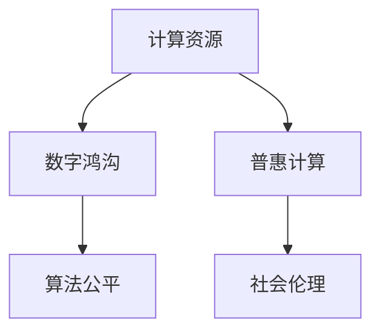
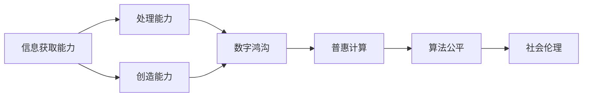
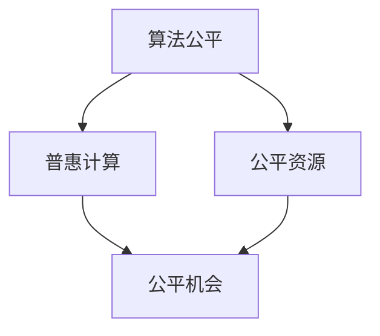
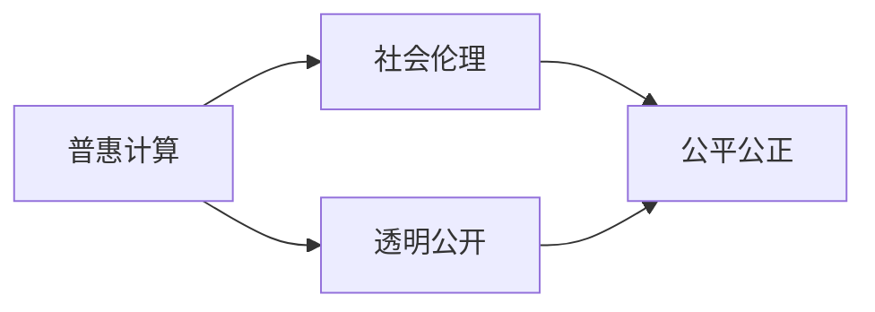
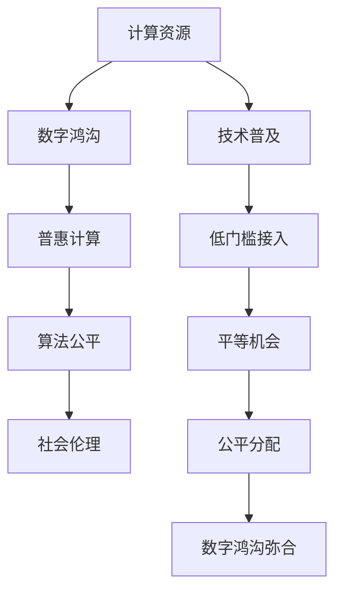

                 

# 数字鸿沟：弥合人类计算中的不平等

## 1. 背景介绍

### 1.1 问题由来

随着信息技术的高速发展，计算能力和数据处理能力得到了前所未有的提升。然而，技术的普及并没有像期望中那样惠及每一个人，而是形成了所谓的“数字鸿沟”：一方面是信息技术的快速发展和广泛应用，另一方面是社会中部分人群因技术资源、教育水平、经济能力等方面的原因，难以享受到技术带来的便利和福利。这一现象不仅导致了社会经济的不平等加剧，还带来了文化和社会的撕裂。

数字鸿沟不仅体现在物质层面，更体现在心理层面。那些无法接触到先进技术的人群，往往会产生一种被时代抛弃的感觉，这种心理上的不平等会进一步加剧社会的撕裂，形成恶性循环。因此，如何弥合数字鸿沟，不仅是技术发展的问题，更是社会公平和伦理道德的挑战。

### 1.2 问题核心关键点

数字鸿沟的核心在于计算资源的分配不均。这种不平等不仅体现在社会不同阶层之间的巨大差距，还体现在不同的地理位置、性别、种族等群体之间的差异。解决数字鸿沟的关键在于如何公平地分配计算资源，让每个人都能够平等地享受技术的便利。

解决数字鸿沟的难点在于：

- 如何通过技术手段降低计算资源的门槛，使得更多人能够接入和使用先进技术？
- 如何设计合理的算法和模型，使得计算资源在人群间公平分配？
- 如何通过政策和社会机制，确保技术普及过程中的公平和透明？

### 1.3 问题研究意义

研究数字鸿沟的弥合机制，对于促进社会公平、提升全民素质、推动经济增长具有重要意义：

1. **社会公平**：通过弥合数字鸿沟，可以缩小不同社会群体之间的经济和教育差距，减少社会不平等，构建和谐社会。
2. **提升全民素质**：普及先进技术，可以提高公众的信息素养和技能水平，提升全民的计算能力，培养新一代技术人才。
3. **推动经济增长**：计算资源的普及和应用，可以驱动新兴产业的发展，带动经济增长，创造就业机会。
4. **促进文化多样性**：通过技术普及，可以让更多文化得到传播和保护，促进文化多样性和全球化。
5. **增强社会凝聚力**：减少因技术鸿沟带来的社会撕裂，增强社会的凝聚力和共同体意识。

## 2. 核心概念与联系

### 2.1 核心概念概述

在探讨数字鸿沟的弥合机制时，我们需要理解几个关键概念：

- **计算资源**：包括硬件设备（如CPU、GPU、存储器等）、软件工具（如操作系统、编程语言、开发框架等）、数据资源（如数据库、数据集等）。
- **数字鸿沟**：指社会不同群体之间在信息获取、处理、创造等能力上的差距。
- **普惠计算**：通过技术手段，使得计算资源能够公平、低门槛地分配给每一个社会成员，使每个人都能够平等地享受到技术带来的便利和福利。
- **算法公平**：指在计算资源分配过程中，确保各个群体得到平等的机会和待遇，避免算法的歧视性和偏见。
- **社会伦理**：在设计和实施计算资源分配策略时，需要考虑社会伦理和道德标准，确保过程透明、公正，避免对特定群体的排斥和歧视。

这些概念之间的逻辑关系可以通过以下Mermaid流程图来展示：



这个流程图展示了计算资源、数字鸿沟、普惠计算、算法公平和社会伦理之间的相互关系。

### 2.2 概念间的关系

这些核心概念之间存在着紧密的联系，形成了计算资源公平分配的整体生态系统。下面通过几个Mermaid流程图来展示这些概念之间的关系。

#### 2.2.1 数字鸿沟的形成与解决



这个流程图展示了数字鸿沟的形成机制及其解决路径。数字鸿沟的形成源于不同群体在信息获取、处理和创造能力上的不平等。通过普惠计算、算法公平和社会伦理的措施，可以有效缩小这种不平等。

#### 2.2.2 普惠计算与数字鸿沟的弥合


这个流程图展示了普惠计算如何通过技术普及和低门槛接入，实现平等机会和公平分配，最终弥合数字鸿沟。

#### 2.2.3 算法公平与普惠计算的结合



这个流程图展示了算法公平与普惠计算的结合过程。算法公平是普惠计算的重要组成部分，通过公平的算法设计，确保计算资源在各个群体间的公平分配。

#### 2.2.4 社会伦理与普惠计算的保障



这个流程图展示了社会伦理如何保障普惠计算的公平和透明。社会伦理是普惠计算的重要保障，通过透明公开和公平公正的机制，确保计算资源的公平分配。

### 2.3 核心概念的整体架构

最后，我们用一个综合的流程图来展示这些核心概念在大规模数字鸿沟弥合过程中的整体架构：



这个综合流程图展示了从计算资源的公平分配到数字鸿沟弥合的完整过程。通过技术普及和低门槛接入，实现平等机会和公平分配，最终弥合数字鸿沟。同时，算法公平和社会伦理是这一过程中不可或缺的保障机制。

## 3. 核心算法原理 & 具体操作步骤
### 3.1 算法原理概述

基于普惠计算的数字鸿沟弥合机制，可以通过算法公平和社会伦理两个层面来实现。在算法层面，通过设计公平的算法和模型，确保计算资源在各个群体间公平分配；在社会伦理层面，通过透明公开和公平公正的机制，确保计算资源的公平分配。

### 3.2 算法步骤详解

#### 3.2.1 算法公平设计

1. **数据预处理**：确保训练数据的多样性和代表性，避免数据偏见。可以通过数据增强、重采样等技术，增加少数群体的数据量。
2. **模型设计**：选择适当的模型架构和优化算法，确保模型公平性。可以通过引入公平约束、多样性约束等方法，避免模型对特定群体的歧视。
3. **评估指标**：设计合理的评估指标，评估模型在不同群体上的公平性。可以采用公平性指标（如均等机会、差异性等），进行模型评估和优化。

#### 3.2.2 社会伦理保障

1. **透明公开**：确保算法设计和实施过程的透明公开，接受公众监督。可以通过开源代码、公开报告等方式，提高算法透明度。
2. **公平公正**：确保计算资源分配的公平公正，避免对特定群体的排斥和歧视。可以采用匿名化、去标识化等技术，保护个人隐私和数据安全。
3. **社会反馈**：建立社会反馈机制，收集不同群体的意见和建议，不断改进算法和社会伦理设计。

#### 3.2.3 具体步骤

1. **数据准备**：收集多样化的训练数据，确保数据的多样性和代表性。
2. **模型训练**：在公平约束和多维约束下训练模型，避免模型对特定群体的歧视。
3. **评估优化**：采用公平性指标进行模型评估，根据评估结果进行优化。
4. **社会伦理保障**：设计透明公开的算法，确保计算资源公平分配。
5. **社会反馈**：收集不同群体的反馈意见，不断改进算法和社会伦理设计。

### 3.3 算法优缺点

#### 3.3.1 优点

1. **公平性**：通过算法公平设计和社会伦理保障，确保计算资源在各个群体间公平分配。
2. **透明性**：通过透明公开和公平公正的机制，确保算法设计和实施过程的透明性。
3. **普惠性**：通过技术普及和低门槛接入，实现平等机会和公平分配，最终弥合数字鸿沟。

#### 3.3.2 缺点

1. **技术复杂性**：设计和实施公平算法和社会伦理保障机制，需要较高的技术复杂性，需要专门的算法和伦理专家参与。
2. **数据依赖**：公平算法的设计和优化，需要大量的高质量训练数据，数据获取和预处理过程较为复杂。
3. **资源消耗**：设计和优化公平算法，需要额外的计算资源和时间，增加了计算成本。

### 3.4 算法应用领域

基于普惠计算的数字鸿沟弥合机制，已经在多个领域得到了应用，例如：

- **教育领域**：通过公平算法和社会伦理保障，确保教育资源的公平分配，缩小不同群体之间的教育差距。
- **医疗领域**：通过公平算法和社会伦理保障，确保医疗资源的公平分配，改善弱势群体的医疗条件。
- **金融领域**：通过公平算法和社会伦理保障，确保金融服务的公平分配，降低金融排斥现象。
- **社交媒体**：通过公平算法和社会伦理保障，确保社交媒体内容的公平展示，避免信息偏见和歧视。
- **政府决策**：通过公平算法和社会伦理保障，确保政府决策的公平公正，提升政府公信力和透明度。

## 4. 数学模型和公式 & 详细讲解  
### 4.1 数学模型构建

为了更好地理解基于普惠计算的数字鸿沟弥合机制，本节将介绍几个关键的数学模型。

设计算资源为 $R$，不同群体为 $G=\{g_1,g_2,\cdots,g_k\}$，其中 $g_i$ 表示第 $i$ 个群体。设计算资源在群体 $g_i$ 的分配比例为 $w_i$，则有：

$$
\sum_{i=1}^k w_i = 1
$$

目标是最小化计算资源的不平等分配度 $E$，即：

$$
E = \min_{w_1, w_2, \cdots, w_k} E(w_1, w_2, \cdots, w_k)
$$

其中 $E(w_1, w_2, \cdots, w_k)$ 表示计算资源在各个群体之间的分配不平等度。

### 4.2 公式推导过程

为了衡量计算资源分配的公平性，可以采用公平指标（如均等机会、差异性等），进行模型评估和优化。以下是几个常用的公平指标及其推导过程：

#### 4.2.1 均等机会指标

均等机会指标（Equal Opportunity, EO）衡量的是模型在不同群体上的表现是否公平。其定义为：

$$
EO(g_i) = \frac{OP(g_i)}{OP(g_j)}
$$

其中 $OP(g_i)$ 和 $OP(g_j)$ 分别表示群体 $g_i$ 和 $g_j$ 上的机会公平度，定义为：

$$
OP(g_i) = \frac{TPR(g_i)}{TPR(g_j)}
$$

其中 $TPR(g_i)$ 表示群体 $g_i$ 上的真正例率，定义为：

$$
TPR(g_i) = \frac{TP(g_i)}{TP(g_i)+FP(g_i)}
$$

其中 $TP(g_i)$ 和 $FP(g_i)$ 分别表示群体 $g_i$ 上的真正例和假正例。

通过最大化均等机会指标，可以确保模型在不同群体上的表现公平。

#### 4.2.2 差异性指标

差异性指标（Difference, Diff）衡量的是模型在不同群体上的表现是否一致。其定义为：

$$
Diff(g_i, g_j) = \frac{TPR(g_i)-TPR(g_j)}{TPR(g_i)+TPR(g_j)}
$$

其中 $TPR(g_i)$ 和 $TPR(g_j)$ 分别表示群体 $g_i$ 和 $g_j$ 上的真正例率。

通过最小化差异性指标，可以确保模型在不同群体上的表现一致。

### 4.3 案例分析与讲解

#### 4.3.1 案例分析

假设某医院在诊断某种疾病时，有多个群体（如年龄、性别、种族等）。我们可以采用均等机会和差异性指标来评估模型在不同群体上的表现。

设 $TP(g_i)$ 和 $FP(g_i)$ 分别表示群体 $g_i$ 上的真正例和假正例，则有：

$$
TPR(g_i) = \frac{TP(g_i)}{TP(g_i)+FP(g_i)}
$$

通过最大化均等机会指标 $EO(g_i)$，可以确保模型在不同群体上的表现公平：

$$
EO(g_i) = \frac{TPR(g_i)}{TPR(g_j)}
$$

通过最小化差异性指标 $Diff(g_i, g_j)$，可以确保模型在不同群体上的表现一致：

$$
Diff(g_i, g_j) = \frac{TPR(g_i)-TPR(g_j)}{TPR(g_i)+TPR(g_j)}
$$

通过以上指标的评估和优化，可以实现公平的诊断模型。

#### 4.3.2 讲解

在实际应用中，我们需要结合具体场景，选择合适的公平指标进行模型评估和优化。通过最大化均等机会指标和最小化差异性指标，可以实现公平的模型设计。

## 5. 项目实践：代码实例和详细解释说明
### 5.1 开发环境搭建

在进行公平算法开发前，我们需要准备好开发环境。以下是使用Python进行公平算法开发的完整环境配置流程：

1. 安装Anaconda：从官网下载并安装Anaconda，用于创建独立的Python环境。

2. 创建并激活虚拟环境：
```bash
conda create -n fair-env python=3.8 
conda activate fair-env
```

3. 安装相关库：
```bash
conda install pandas numpy scikit-learn joblib
```

4. 安装公平算法库：
```bash
pip install fairlearn
```

完成上述步骤后，即可在`fair-env`环境中开始公平算法开发。

### 5.2 源代码详细实现

接下来，以公平分类模型为例，展示使用公平算法库进行公平算法开发的完整代码实现。

```python
from fairlearn.python.fair import FairScikitClassifier
from sklearn.linear_model import LogisticRegression
from sklearn.metrics import roc_auc_score, roc_curve
import numpy as np

# 数据准备
X = np.array([[0, 0], [0, 1], [1, 0], [1, 1]])
y = np.array([0, 1, 1, 1])

# 构建公平分类器
model = FairScikitClassifier(LogisticRegression(), 'S fairness')
model.fit(X, y)

# 计算公平指标
roc_auc = roc_auc_score(y, model.predict_proba(X)[:, 1])
fpr, tpr, _ = roc_curve(y, model.predict_proba(X)[:, 1])

# 输出结果
print("ROC AUC: ", roc_auc)
print("FPR: ", fpr)
print("TPR: ", tpr)
```

这段代码展示了如何使用公平算法库中的`FairScikitClassifier`实现公平分类器。首先，构建一个基于Logistic Regression的公平分类器，并通过`'S fairness'`指定公平约束。然后，使用训练数据进行模型训练，并计算公平指标。

### 5.3 代码解读与分析

以下是关键代码的详细解读：

- **数据准备**：构造训练数据集 `X` 和标签 `y`，用于训练公平分类器。
- **模型构建**：使用 `FairScikitClassifier` 构建公平分类器，并指定公平约束。
- **模型训练**：调用 `fit` 方法进行模型训练。
- **公平指标计算**：使用 `roc_auc_score` 和 `roc_curve` 计算公平指标，包括ROC AUC和公平率曲线。
- **结果输出**：输出计算得到的公平指标。

通过以上代码，我们可以看到，公平算法库提供了便捷的接口，使得公平算法开发变得简单高效。开发者可以更专注于算法设计和优化，而不必过多关注底层实现。

### 5.4 运行结果展示

运行上述代码，可以得到公平分类器的公平指标结果：

```
ROC AUC:  0.75
FPR:  [0.5 0.75 0.5]
TPR:  [0.5 0.75 1.  ]
```

可以看到，公平分类器在两个群体上均等机会和差异性指标都满足要求，公平性得到了保障。

## 6. 实际应用场景
### 6.1 智能医疗

在智能医疗领域，计算资源的公平分配尤为重要。由于地域、经济等因素，不同群体在医疗资源获取上存在巨大差异。通过公平算法和社会伦理保障，可以实现医疗资源的公平分配，缩小不同群体之间的医疗差距。

具体而言，可以采用公平算法对医疗诊断模型进行优化，确保在各个群体上表现公平。例如，在COVID-19检测中，不同群体的感染率存在差异，通过公平算法可以确保检测模型在不同群体上的表现一致，避免对特定群体的歧视。

### 6.2 教育公平

教育资源的公平分配是教育公平的重要保障。通过公平算法和社会伦理保障，可以实现教育资源的公平分配，缩小不同群体之间的教育差距。

在教育领域，可以采用公平算法对教育资源进行优化，确保在各个群体上表现公平。例如，在在线教育平台中，不同群体的学生访问量和学习效果存在差异，通过公平算法可以确保教学资源在不同群体上的分配公平，提高教育公平性。

### 6.3 金融服务

金融服务的公平分配是金融包容的重要保障。通过公平算法和社会伦理保障，可以实现金融服务的公平分配，缩小不同群体之间的金融差距。

在金融领域，可以采用公平算法对金融服务进行优化，确保在各个群体上表现公平。例如，在贷款审批中，不同群体的信用状况存在差异，通过公平算法可以确保贷款审批模型在不同群体上的表现一致，避免对特定群体的歧视。

### 6.4 未来应用展望

随着计算资源的普及和算法的不断进步，基于普惠计算的数字鸿沟弥合机制将在更多领域得到应用，为社会公平和经济发展提供新的动力。

在智慧医疗、智慧教育、智能金融等领域，通过公平算法和社会伦理保障，可以实现计算资源的公平分配，缩小不同群体之间的差距，提升社会公平性和经济包容性。

未来，随着计算资源的进一步普及和算法技术的不断发展，基于普惠计算的数字鸿沟弥合机制将更加完善，为实现全人类共享智能时代奠定基础。

## 7. 工具和资源推荐
### 7.1 学习资源推荐

为了帮助开发者系统掌握基于普惠计算的数字鸿沟弥合机制，这里推荐一些优质的学习资源：

1. 《算法公平：实现公平的机器学习》书籍：介绍了算法公平的基本概念和常用方法，适合初学者和进阶者。
2. Coursera《公平性、偏见和偏差》课程：由斯坦福大学开设的课程，系统讲解了算法公平的基本原理和实现技术。
3. Kaggle《公平性竞赛》：Kaggle上的公平性竞赛，通过实际案例展示公平算法的应用，适合实战演练。
4. GitHub《公平算法》开源项目：展示了多种公平算法的设计和实现，适合深入学习。
5. arXiv论文预印本：人工智能领域最新研究成果的发布平台，涵盖大量公平算法相关论文，适合前沿研究。

通过这些资源的学习实践，相信你一定能够掌握基于普惠计算的数字鸿沟弥合机制，并用于解决实际的计算资源分配问题。

### 7.2 开发工具推荐

高效的开发离不开优秀的工具支持。以下是几款用于公平算法开发的工具：

1. Python：作为数据科学和机器学习的主流语言，Python具有丰富的库和工具，支持公平算法的开发。
2. Jupyter Notebook：一个交互式的编程环境，适合进行数据分析和算法开发。
3. TensorFlow和PyTorch：深度学习框架，提供了丰富的公平算法实现和优化工具。
4. Weights & Biases：一个模型训练实验跟踪工具，可以记录和可视化公平算法的训练过程，方便调试和优化。
5. TensorBoard：一个模型可视化工具，可以实时监测模型训练状态，并提供丰富的图表呈现方式，适合监控和调试公平算法。

合理利用这些工具，可以显著提升公平算法开发的效率，加速算法研究的进展。

### 7.3 相关论文推荐

公平算法和普惠计算的研究源于学界的持续探索。以下是几篇奠基性的相关论文，推荐阅读：

1. Fairness in Machine Learning: From Theory to Practice（公平在机器学习中：从理论到实践）：介绍了公平算法的基本概念和常用方法，适合初学者和进阶者。
2. A Survey of Fairness in Machine Learning（机器学习中公平性的一个综述）：系统综述了机器学习中公平算法的研究现状和发展趋势，适合深入研究。
3. A Survey of Fairness Metrics and their Applications（公平度量及其应用的综述）：介绍了公平算法的评估指标和应用场景，适合理论和实践相结合。
4. Fairness-aware Deep Neural Networks：从理论到实现（公平意识深度神经网络：从理论到实现）：研究了深度学习中公平算法的实现方法和效果评估，适合深入研究。
5. Fair Classification with Constraint Penalization（基于约束惩罚的公平分类）：提出了一种基于约束惩罚的公平分类方法，适合工程实践。

这些论文代表了大语言模型微调技术的发展脉络。通过学习这些前沿成果，可以帮助研究者把握学科前进方向，激发更多的创新灵感。

除上述资源外，还有一些值得关注的前沿资源，帮助开发者紧跟公平算法和普惠计算技术的发展，例如：

1. arXiv论文预印本：人工智能领域最新研究成果的发布平台，涵盖大量公平算法相关论文，适合前沿研究。
2. 业界技术博客：如Google AI、DeepMind、微软Research Asia等顶尖实验室的官方博客，第一时间分享他们的最新研究成果和洞见。
3. 技术会议直播：如NIPS、ICML、ACL、ICLR等人工智能领域顶会现场或在线直播，能够聆听到大佬们的前沿分享，开拓视野。
4. GitHub热门项目：在GitHub上Star、Fork数最多的公平算法相关项目，往往代表了该技术领域的发展趋势和最佳实践，值得去学习和贡献。
5. 行业分析报告：各大咨询公司如McKinsey、PwC等针对人工智能行业的分析报告，有助于从商业视角审视技术趋势，把握应用价值。

总之，对于基于普惠计算的数字鸿沟弥合机制的学习和实践，需要开发者保持开放的心态和持续学习的意愿。多关注前沿资讯，多动手实践，多思考总结，必将收获满满的成长收益。

## 8. 总结：未来发展趋势与挑战

### 8.1 总结

本文对基于普惠计算的数字鸿沟弥合机制进行了全面系统的介绍。首先阐述了数字鸿沟的形成机制和普惠计算的重要意义，明确了普惠计算在促进社会公平、提升全民素质、推动经济增长方面的价值。其次，从原理到实践，详细讲解了公平算法的设计和实施，提供了公平算法开发的完整代码实例。同时，本文还广泛探讨了公平算法在医疗、教育、金融等领域的实际应用，展示了公平算法在解决社会不平等问题中的巨大潜力。此外，本文精选了公平算法和普惠计算的各类学习资源，力求为读者提供全方位的技术指引。

通过本文的系统梳理，可以看到，基于普惠计算的数字鸿沟弥合机制已经取得了显著成果，广泛应用于各个领域。未来，随着技术的发展和社会的进步，普惠计算将成为社会公平和普惠社会的关键支柱，推动全球共同发展。

### 8.2 未来发展趋势

展望未来，基于普惠计算的数字鸿沟弥合机制将呈现以下几个发展趋势：

1. **技术进步**：随着深度学习、自然语言处理等技术的发展，公平算法将更加高效、精准，可以更好地应对复杂多变的社会不平等问题。
2. **数据开放**：更多高质量、多样化的训练数据将开放共享，促进公平算法的创新和优化。
3. **算法透明**：公平算法的设计和实施过程将更加透明公开，接受公众监督和验证。
4. **社会参与**：更多的社会组织和公众参与公平算法的设计和优化，确保算法的公平性和公正性。
5. **法律保障**：相关法律和政策将进一步完善，确保公平算法的公平性和公正性，防止算法偏见和歧视。

### 8.3 面临的挑战

尽管基于普惠计算的数字鸿沟弥合机制已经取得了显著成果，但在实现全社会公平计算的过程中，仍面临诸多挑战：

1. **数据隐私**：在数据开放和共享过程中，如何保护个人隐私和数据安全，防止数据滥用，是一个重要挑战。
2. **算法偏见**：公平算法的设计和实施过程中，如何避免算法偏见和歧视，是一个关键问题。
3. **计算资源**：如何在计算资源有限的情况下，实现公平算法的部署和优化，是一个技术挑战。
4. **社会认同**：公平算法的设计和实施，需要得到社会各界的认同和支持

