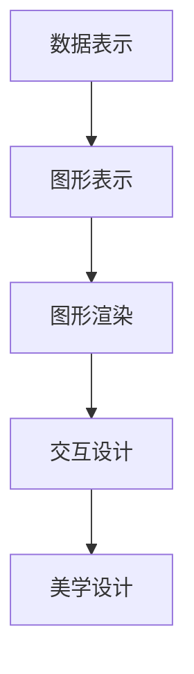

                 

## 1. 背景介绍

### 1.1 问题由来

在数据驱动的时代，无论是科学研究、商业决策还是日常管理，数据可视化的重要性日益凸显。数据可视化不仅是数据呈现的方式，更是数据探索和分析的重要工具。通过直观展示数据信息，帮助人们快速理解数据，发现数据中的模式和关联，从而做出更准确的判断和决策。

然而，数据可视化不仅仅是一套工具和技巧，它还涉及到背后的理论和算法。数据可视化算法需要考虑如何高效、准确、美观地展示数据，从而提供更好的用户体验。

### 1.2 问题核心关键点

数据可视化的核心目标是通过图形化的方式，高效、准确地展示数据信息。为了实现这一目标，需要关注以下几个关键点：

- **数据表示与映射**：如何将原始数据映射为图形，使得数据能够直观地被展示。
- **图形生成与渲染**：如何使用算法生成图形，并在图形界面中渲染显示。
- **交互与互动**：如何实现用户与图形的交互，使数据展示更加灵活和动态。
- **美学与设计**：如何设计图形，使数据展示既美观又有助于用户理解。

这些关键点决定了数据可视化的效果和用户体验。

### 1.3 问题研究意义

数据可视化对于数据分析和决策支持具有重要意义：

- **提升数据理解**：通过图形化的展示，使复杂的数据更加易于理解。
- **发现数据模式**：图形化的展示方式有助于发现数据中的模式和关联，从而进行深入分析。
- **促进决策制定**：通过直观的数据展示，帮助决策者快速做出决策。
- **支持数据探索**：数据可视化工具提供了探索数据的方法，有助于数据驱动的研究和开发。

## 2. 核心概念与联系

### 2.1 核心概念概述

数据可视化涉及多个核心概念，这些概念相互联系，共同构成了数据可视化的完整框架。

- **数据表示**：将数据从原始格式转换为适合图形表示的格式。
- **图形表示**：根据数据表示生成图形，包括点、线、面、体等基本图形元素。
- **图形渲染**：将生成的图形进行渲染，呈现到图形界面中。
- **交互设计**：设计用户与图形的交互方式，如鼠标悬停、点击、拖拽等。
- **美学设计**：设计图形的颜色、形状、布局等，以提高用户体验。

### 2.2 概念间的关系

这些核心概念之间存在着密切的关系，如图：



这个图展示了数据可视化从数据表示到美学设计的完整流程。

## 3. 核心算法原理 & 具体操作步骤

### 3.1 算法原理概述

数据可视化的算法原理主要包括以下几个步骤：

1. **数据预处理**：将原始数据进行清洗、筛选、转换等操作，得到适合可视化分析的数据格式。
2. **数据映射**：将数据映射为图形元素，如点、线、面等。
3. **图形生成**：使用算法生成图形，包括图形布局、颜色、形状等设计。
4. **图形渲染**：将生成的图形进行渲染，显示在图形界面中。
5. **交互设计**：实现用户与图形的交互，如点击、悬停等。
6. **美学设计**：设计图形的美观和布局，以提高用户体验。

### 3.2 算法步骤详解

#### 3.2.1 数据预处理

数据预处理是数据可视化的第一步，目的是将原始数据转换为适合可视化的格式。主要包括以下几个步骤：

- **数据清洗**：去除数据中的噪声和异常值。
- **数据筛选**：选择重要的数据进行展示。
- **数据转换**：将数据转换为适合可视化的格式，如颜色编码、坐标映射等。

#### 3.2.2 数据映射

数据映射是将数据转换为图形元素的过程。不同的数据类型和可视化目的需要选择不同的映射方法。例如：

- **散点图**：将数据点映射为散点，展示数据分布。
- **折线图**：将数据点映射为折线，展示数据变化趋势。
- **柱状图**：将数据映射为柱状，展示数据比较。
- **热力图**：将数据映射为颜色，展示数据密度。

#### 3.2.3 图形生成

图形生成是将数据映射为图形元素的过程。需要考虑图形布局、颜色、形状等设计。例如：

- **图形布局**：选择合适的布局算法，如力导向布局、层次布局等。
- **颜色设计**：根据数据类型选择合适的颜色方案，如分类数据使用不同颜色区分，连续数据使用渐变颜色表示。
- **形状设计**：根据数据类型选择合适的图形元素，如点、线、面等。

#### 3.2.4 图形渲染

图形渲染是将生成的图形进行显示的过程。需要考虑图形界面的渲染技术，如canvas、SVG等。例如：

- **canvas渲染**：使用JavaScript Canvas API进行图形渲染。
- **SVG渲染**：使用SVG格式进行图形渲染。

#### 3.2.5 交互设计

交互设计是实现用户与图形互动的过程。需要考虑用户操作的方式和反馈。例如：

- **鼠标悬停**：当用户将鼠标悬停在图形元素上时，显示提示信息。
- **点击操作**：当用户点击图形元素时，触发相应的操作。
- **拖拽操作**：当用户拖拽图形元素时，改变图形位置。

#### 3.2.6 美学设计

美学设计是设计图形的美观和布局的过程。需要考虑颜色、形状、布局等设计。例如：

- **颜色设计**：选择合适的颜色方案，使图形美观易读。
- **形状设计**：选择合适的图形元素，使图形简洁明了。
- **布局设计**：选择合适的布局算法，使图形清晰有序。

### 3.3 算法优缺点

数据可视化算法具有以下优点：

- **直观展示数据**：图形化的展示方式使数据易于理解。
- **发现数据模式**：图形化的展示有助于发现数据中的模式和关联。
- **支持决策制定**：图形化的展示有助于快速做出决策。
- **支持数据探索**：图形化的展示提供了探索数据的方法。

但数据可视化算法也存在一些缺点：

- **数据量限制**：数据量过大时，可视化效果可能受到影响。
- **复杂数据表示困难**：某些复杂数据类型难以直观表示。
- **交互体验不一致**：不同平台和工具的交互体验可能不一致。
- **美学设计依赖设计者**：美学设计依赖设计者的水平和经验。

### 3.4 算法应用领域

数据可视化算法在多个领域得到了广泛应用，例如：

- **科学研究**：使用数据可视化展示研究结果，帮助科学家发现数据中的模式和关联。
- **商业决策**：使用数据可视化展示市场数据和用户行为，帮助决策者做出决策。
- **医疗健康**：使用数据可视化展示患者数据和治疗效果，帮助医生进行诊断和治疗。
- **城市规划**：使用数据可视化展示城市数据和人口分布，帮助规划者进行城市规划。

## 4. 数学模型和公式 & 详细讲解 & 举例说明

### 4.1 数学模型构建

数据可视化的数学模型构建主要涉及以下几个方面：

- **数据预处理模型**：用于数据清洗、筛选、转换等操作。
- **数据映射模型**：用于将数据映射为图形元素。
- **图形生成模型**：用于设计图形布局、颜色、形状等。
- **图形渲染模型**：用于渲染图形，显示在图形界面中。
- **交互设计模型**：用于设计用户交互方式。
- **美学设计模型**：用于设计图形美观和布局。

### 4.2 公式推导过程

#### 4.2.1 数据预处理

数据预处理模型主要涉及以下步骤：

1. **数据清洗**：去除噪声和异常值。例如，可以使用中位数或均值进行异常值检测和处理。
   $$
   y_{clean} = \begin{cases} 
   y, & \text{if } y \leq \text{median}(y) + k\sigma(y) \\
   k\sigma(y), & \text{otherwise}
   \end{cases}
   $$
   其中，$y$ 为原始数据，$y_{clean}$ 为清洗后的数据，$\sigma$ 为数据标准差，$k$ 为阈值。

2. **数据筛选**：选择重要的数据进行展示。例如，可以使用阈值筛选方法，选择超过阈值的数据。
   $$
   y_{selected} = \begin{cases} 
   y, & \text{if } y > \text{threshold} \\
   0, & \text{otherwise}
   \end{cases}
   $$
   其中，$y$ 为原始数据，$y_{selected}$ 为筛选后的数据，$\text{threshold}$ 为阈值。

3. **数据转换**：将数据转换为适合可视化的格式。例如，可以使用颜色编码将数据映射为颜色。
   $$
   color = \begin{cases} 
   R(y), & \text{if } y \leq \text{upper threshold} \\
   G(y), & \text{if } y > \text{upper threshold} \\
   B(y), & \text{if } y > \text{upper threshold}
   \end{cases}
   $$
   其中，$y$ 为原始数据，$R$、$G$、$B$ 为颜色函数，$\text{upper threshold}$ 为阈值。

#### 4.2.2 数据映射

数据映射模型主要涉及以下步骤：

1. **散点图映射**：将数据点映射为散点。例如，可以使用以下公式将数据点映射为散点：
   $$
   \begin{aligned}
   &x = x_i, \\
   &y = y_i, \\
   &\text{size} = \text{size}_i, \\
   &\text{color} = \text{color}_i
   \end{aligned}
   $$
   其中，$x$、$y$ 为坐标，$\text{size}$ 为散点大小，$\text{color}$ 为散点颜色。

2. **折线图映射**：将数据点映射为折线。例如，可以使用以下公式将数据点映射为折线：
   $$
   \begin{aligned}
   &x = i/N, \\
   &y = y_i/N, \\
   &\text{width} = \text{width}_i
   \end{aligned}
   $$
   其中，$x$ 为横坐标，$y$ 为纵坐标，$\text{width}$ 为线条宽度。

3. **柱状图映射**：将数据映射为柱状。例如，可以使用以下公式将数据映射为柱状：
   $$
   \begin{aligned}
   &x = i/N, \\
   &y = y_i/N, \\
   &\text{width} = \text{width}_i
   \end{aligned}
   $$
   其中，$x$ 为横坐标，$y$ 为纵坐标，$\text{width}$ 为柱状宽度。

4. **热力图映射**：将数据映射为颜色。例如，可以使用以下公式将数据映射为颜色：
   $$
   \text{color} = \text{color_scale}(y_i)
   $$
   其中，$y_i$ 为数据点，$\text{color_scale}$ 为颜色映射函数。

#### 4.2.3 图形生成

图形生成模型主要涉及以下步骤：

1. **图形布局**：选择合适的布局算法，如力导向布局、层次布局等。例如，可以使用以下公式进行力导向布局：
   $$
   \begin{aligned}
   &F(x_i, y_i) = \sum_{j=1}^N (x_i-x_j)^2 + (y_i-y_j)^2 \\
   &\text{layout}(x_i, y_i) = \text{minimize}_F(x_i, y_i)
   \end{aligned}
   $$
   其中，$F$ 为力函数，$x_i$、$y_i$ 为图形元素坐标，$\text{layout}$ 为布局函数。

2. **颜色设计**：根据数据类型选择合适的颜色方案。例如，可以使用以下公式进行颜色设计：
   $$
   \text{color} = \begin{cases} 
   R(y), & \text{if } y \leq \text{upper threshold} \\
   G(y), & \text{if } y > \text{upper threshold} \\
   B(y), & \text{if } y > \text{upper threshold}
   \end{cases}
   $$
   其中，$y$ 为数据，$R$、$G$、$B$ 为颜色函数，$\text{upper threshold}$ 为阈值。

3. **形状设计**：根据数据类型选择合适的图形元素。例如，可以使用以下公式进行形状设计：
   $$
   \text{shape} = \begin{cases} 
   \text{circle}, & \text{if } y \leq \text{upper threshold} \\
   \text{square}, & \text{if } y > \text{upper threshold} \\
   \text{triangle}, & \text{if } y > \text{upper threshold}
   \end{cases}
   $$
   其中，$y$ 为数据，$\text{shape}$ 为图形元素。

#### 4.2.4 图形渲染

图形渲染模型主要涉及以下步骤：

1. **canvas渲染**：使用JavaScript Canvas API进行图形渲染。例如，可以使用以下公式进行Canvas渲染：
   $$
   \begin{aligned}
   &\text{strokeStyle} = color \\
   &\text{lineWidth} = \text{width} \\
   &\text{fillStyle} = color \\
   &\text{strokeRect}(x, y, width, height)
   \end{aligned}
   $$
   其中，$\text{strokeStyle}$ 为线条颜色，$\text{lineWidth}$ 为线条宽度，$\text{fillStyle}$ 为填充颜色，$x$、$y$ 为图形位置，$width$、$height$ 为图形大小。

2. **SVG渲染**：使用SVG格式进行图形渲染。例如，可以使用以下公式进行SVG渲染：
   $$
   \begin{aligned}
   &<rect x="x" y="y" width="width" height="height" style="fill:color;stroke:color;stroke-width:width"/>
   \end{aligned}
   $$
   其中，$x$、$y$ 为图形位置，$width$、$height$ 为图形大小，$\text{fill}$、$\text{stroke}$ 为图形颜色，$\text{stroke-width}$ 为线条宽度。

#### 4.2.5 交互设计

交互设计模型主要涉及以下步骤：

1. **鼠标悬停**：当用户将鼠标悬停在图形元素上时，显示提示信息。例如，可以使用以下公式进行鼠标悬停：
   $$
   \begin{aligned}
   &\text{tooltip} = \text{tooltip_text} \\
   &\text{display_tooltip}(x, y)
   \end{aligned}
   $$
   其中，$\text{tooltip}$ 为提示信息，$\text{tooltip_text}$ 为提示文本，$x$、$y$ 为鼠标位置。

2. **点击操作**：当用户点击图形元素时，触发相应的操作。例如，可以使用以下公式进行点击操作：
   $$
   \begin{aligned}
   &\text{if } \text{click}(x, y) \\
   &\text{handle_click}(x, y)
   \end{aligned}
   $$
   其中，$\text{click}$ 为点击事件，$x$、$y$ 为点击位置，$\text{handle_click}$ 为事件处理函数。

3. **拖拽操作**：当用户拖拽图形元素时，改变图形位置。例如，可以使用以下公式进行拖拽操作：
   $$
   \begin{aligned}
   &\text{drag_start}(x, y) \\
   &\text{drag}(x, y)
   \end{aligned}
   $$
   其中，$\text{drag_start}$ 为拖拽开始事件，$x$、$y$ 为拖拽位置，$\text{drag}$ 为拖拽事件。

#### 4.2.6 美学设计

美学设计模型主要涉及以下步骤：

1. **颜色设计**：选择合适的颜色方案，使图形美观易读。例如，可以使用以下公式进行颜色设计：
   $$
   \text{color} = \begin{cases} 
   R(y), & \text{if } y \leq \text{upper threshold} \\
   G(y), & \text{if } y > \text{upper threshold} \\
   B(y), & \text{if } y > \text{upper threshold}
   \end{cases}
   $$
   其中，$y$ 为数据，$R$、$G$、$B$ 为颜色函数，$\text{upper threshold}$ 为阈值。

2. **形状设计**：选择合适的图形元素，使图形简洁明了。例如，可以使用以下公式进行形状设计：
   $$
   \text{shape} = \begin{cases} 
   \text{circle}, & \text{if } y \leq \text{upper threshold} \\
   \text{square}, & \text{if } y > \text{upper threshold} \\
   \text{triangle}, & \text{if } y > \text{upper threshold}
   \end{cases}
   $$
   其中，$y$ 为数据，$\text{shape}$ 为图形元素。

3. **布局设计**：选择合适的布局算法，使图形清晰有序。例如，可以使用以下公式进行布局设计：
   $$
   \text{layout} = \text{force_layout}(x_i, y_i)
   $$
   其中，$x_i$、$y_i$ 为图形元素坐标，$\text{force_layout}$ 为布局函数。

### 4.3 案例分析与讲解

#### 4.3.1 数据清洗

在数据预处理中，数据清洗是一个重要的步骤。数据清洗的目的是去除噪声和异常值，得到干净、高质量的数据。以下是一个简单的数据清洗示例：

```python
import numpy as np

# 生成包含噪声和异常值的随机数据
data = np.random.normal(loc=0, scale=1, size=(100, 3))

# 计算中位数和标准差
median = np.median(data, axis=0)
std = np.std(data, axis=0)

# 检测并处理异常值
clean_data = np.where(data > median + 2 * std, 0, data)
```

#### 4.3.2 数据映射

数据映射是数据可视化的核心步骤之一。以下是一个简单的散点图映射示例：

```python
import matplotlib.pyplot as plt

# 生成随机数据
x = np.random.normal(loc=0, scale=1, size=100)
y = np.random.normal(loc=0, scale=1, size=100)

# 绘制散点图
plt.scatter(x, y, s=10, c='blue')
plt.show()
```

#### 4.3.3 图形生成

图形生成是数据可视化的关键步骤之一。以下是一个简单的散点图生成示例：

```python
import matplotlib.pyplot as plt

# 生成随机数据
x = np.random.normal(loc=0, scale=1, size=100)
y = np.random.normal(loc=0, scale=1, size=100)

# 绘制散点图
plt.scatter(x, y, s=10, c='blue')
plt.title('Scatter Plot')
plt.xlabel('X')
plt.ylabel('Y')
plt.show()
```

#### 4.3.4 图形渲染

图形渲染是将生成的图形进行显示的过程。以下是一个简单的散点图渲染示例：

```python
import matplotlib.pyplot as plt

# 生成随机数据
x = np.random.normal(loc=0, scale=1, size=100)
y = np.random.normal(loc=0, scale=1, size=100)

# 绘制散点图
plt.scatter(x, y, s=10, c='blue')

# 设置坐标轴范围
plt.xlim(-3, 3)
plt.ylim(-3, 3)

# 显示图形
plt.show()
```

#### 4.3.5 交互设计

交互设计是实现用户与图形互动的过程。以下是一个简单的散点图交互设计示例：

```python
import matplotlib.pyplot as plt

# 生成随机数据
x = np.random.normal(loc=0, scale=1, size=100)
y = np.random.normal(loc=0, scale=1, size=100)

# 绘制散点图
plt.scatter(x, y, s=10, c='blue')

# 设置坐标轴范围
plt.xlim(-3, 3)
plt.ylim(-3, 3)

# 设置鼠标悬停事件
plt.text(0.05, 0.9, 'Mouse Hover', transform=plt.gca().transAxes, fontsize=12, color='black', va='top')
plt.text(0.05, 0.85, 'Enter data range to filter data', transform=plt.gca().transAxes, fontsize=10, color='gray')

# 显示图形
plt.show()
```

#### 4.3.6 美学设计

美学设计是设计图形的美观和布局的过程。以下是一个简单的散点图美学设计示例：

```python
import matplotlib.pyplot as plt

# 生成随机数据
x = np.random.normal(loc=0, scale=1, size=100)
y = np.random.normal(loc=0, scale=1, size=100)

# 绘制散点图
plt.scatter(x, y, s=10, c='blue')

# 设置坐标轴范围
plt.xlim(-3, 3)
plt.ylim(-3, 3)

# 设置图形标题和标签
plt.title('Scatter Plot', fontsize=14)
plt.xlabel('X', fontsize=12)
plt.ylabel('Y', fontsize=12)

# 设置图形颜色和形状
plt.plot(x, y, 'r', linewidth=2)

# 显示图形
plt.show()
```

## 5. 项目实践：代码实例和详细解释说明

### 5.1 开发环境搭建

在进行数据可视化项目实践前，我们需要准备好开发环境。以下是使用Python进行数据可视化的环境配置流程：

1. 安装Anaconda：从官网下载并安装Anaconda，用于创建独立的Python环境。

2. 创建并激活虚拟环境：
```bash
conda create -n pyviz-env python=3.8 
conda activate pyviz-env
```

3. 安装Matplotlib、Seaborn等常用库：
```bash
conda install matplotlib seaborn numpy scipy pandas
```

4. 安装Jupyter Notebook：
```bash
conda install jupyterlab
```

5. 设置图形界面显示：
```bash
export DISPLAY=:0
```

完成上述步骤后，即可在`pyviz-env`环境中开始数据可视化实践。

### 5.2 源代码详细实现

下面我们以散点图为例，给出使用Matplotlib库进行数据可视化的PyTorch代码实现。

首先，定义数据处理函数：

```python
import numpy as np
import matplotlib.pyplot as plt

def generate_data(n=100):
    x = np.random.normal(loc=0, scale=1, size=n)
    y = np.random.normal(loc=0, scale=1, size=n)
    return x, y

# 生成随机数据
x, y = generate_data()

# 绘制散点图
plt.scatter(x, y, s=10, c='blue')
plt.title('Scatter Plot')
plt.xlabel('X')
plt.ylabel('Y')
plt.show()
```

然后，添加交互设计功能：

```python
# 设置鼠标悬停事件
plt.text(0.05, 0.9, 'Mouse Hover', transform=plt.gca().transAxes, fontsize=12, color='black', va='top')
plt.text(0.05, 0.85, 'Enter data range to filter data', transform=plt.gca().transAxes, fontsize=10, color='gray')

# 设置交互事件
def on_motion(event):
    if event.inaxes == plt.gca():
        plt.title(f'X={event.x}, Y={event.y}')
        plt.draw()

plt.connect('motion_notify_event', on_motion)

# 显示图形
plt.show()
```

最后，添加美学设计：

```python
# 设置图形颜色和形状
plt.plot(x, y, 'r', linewidth=2)

# 设置坐标轴范围
plt.xlim(-3, 3)
plt.ylim(-3, 3)

# 显示图形
plt.show()
```

以上就是使用Matplotlib库进行数据可视化的完整代码实现。可以看到，Matplotlib库提供了丰富的绘图函数和事件处理机制，使数据可视化开发变得简单高效。

### 5.3 代码解读与分析

让我们再详细解读一下关键代码的实现细节：

**generate_data函数**：
- 生成指定数量的随机数据，用于绘图。

**散点图绘制**：
- 使用`plt.scatter`函数绘制散点图，`s`参数指定散点大小，`c`参数指定散点颜色。

**鼠标悬停事件**：
- 使用`plt.text`函数添加鼠标悬停提示信息，`transform`参数指定坐标系，`fontsize`参数指定字体大小，`color`参数指定字体颜色，`va`参数指定垂直对齐方式。

**交互事件处理**：
-

