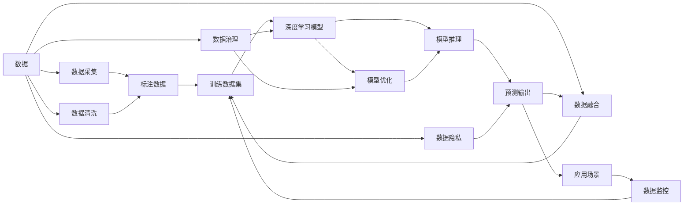

                 

## 1. 背景介绍

### 1.1 问题由来

在人工智能(AI)领域，数据和数据库扮演了至关重要的角色。自机器学习时代以来，数据驱动的AI模型已经取得了显著的进展，例如深度神经网络(DNN)、强化学习(RL)等。然而，数据和数据库的基础设施对于AI底层创新仍然有着深远的影响，并不断推动AI技术的演进。

首先，数据驱动的AI模型需要大量的标注数据进行训练，以提高模型的预测精度和泛化能力。同时，数据和数据库还为AI模型的部署和应用提供了必要的支撑，使得模型能够在不同的应用场景中有效工作。例如，NLP模型需要大量的文本数据进行预训练，而图像识别模型则依赖于大规模的图像数据集。此外，数据库的可靠性和性能也是保证AI模型高效运行的基石。

随着AI技术的不断发展，数据和数据库在AI底层创新的作用越发凸显。本文将从数据和数据库的基本概念入手，探讨其在AI模型构建、训练、部署及优化中的关键作用，以及未来AI领域的数据和数据库技术发展趋势。

### 1.2 问题核心关键点

数据和数据库在AI底层创新中的核心作用主要体现在以下几个方面：

- **数据获取与标注**：高质量的训练数据对于模型的性能至关重要。通过数据采集、清洗、标注等过程，获取具有代表性的数据，可以提高模型的泛化能力。

- **模型训练与优化**：数据和数据库是训练深度学习模型的基础。通过高效的数据存储和检索，可以加速模型的训练过程，并在优化过程中提升模型的性能。

- **模型部署与推理**：数据库支持模型的高效部署和推理。数据库的分布式处理能力和高可用性，使得AI模型能够在大规模数据集上实现高效、稳定的推理。

- **数据治理与隐私保护**：在数据使用过程中，数据治理和隐私保护是不可或缺的。合理的数据治理策略，可以保障数据质量和安全，防止数据滥用和隐私泄露。

- **多源数据整合**：在复杂的AI应用场景中，常常需要整合来自不同源的数据。通过数据融合和集成，可以提高数据的全面性和代表性，提升AI模型的性能。

综上所述，数据和数据库不仅是AI技术的基础设施，更是推动AI技术在各行各业广泛应用的重要推动力。理解并利用好数据和数据库，对于AI底层创新至关重要。

## 2. 核心概念与联系

### 2.1 核心概念概述

为了更好地理解数据和数据库在AI底层创新中的作用，本节将介绍几个核心概念：

- **数据（Data）**：指用于机器学习、深度学习、强化学习等AI模型训练和推理的输入和输出。数据可以是结构化的，如数据库中的表、文件系统中的文件等，也可以是非结构化的，如图像、视频、文本等。

- **数据库（Database）**：一种用于高效存储、管理和检索数据的系统。数据库通常包含结构化查询语言(SQL)接口，允许用户以程序化方式访问数据。

- **数据流（Dataflow）**：在AI模型中，数据从数据源流入模型，经过一系列处理后生成输出。数据流模型有助于理解数据如何在不同组件间流动。

- **数据治理（Data Governance）**：确保数据的质量、安全、合规性和完整性的管理实践。数据治理策略对于保障数据质量和安全至关重要。

- **数据隐私（Data Privacy）**：保护个人和组织的数据不被未经授权的访问、收集或使用的措施。在AI应用中，数据隐私保护是合规性和用户信任的基础。

- **数据融合（Data Fusion）**：将不同来源的数据集成和综合，提高数据的全面性和代表性，增强AI模型的决策能力。

### 2.2 概念间的关系

这些核心概念之间存在着紧密的联系，形成了AI数据基础设施的完整生态系统。下面我通过几个Mermaid流程图来展示这些概念之间的关系。



这个流程图展示了数据在AI模型构建、训练、部署及优化过程中的整体流程：

1. 数据从数据源流入，经过采集、清洗和标注，成为训练数据集。
2. 训练数据集用于深度学习模型的训练。
3. 训练后的模型进行推理，产生预测输出。
4. 数据治理和隐私保护策略保障数据质量和安全。
5. 数据融合增强数据全面性和代表性。
6. 数据监控实时监控模型的性能和数据的使用情况。

通过这些流程图的展示，我们可以更清晰地理解数据和数据库在AI底层创新中的作用。

## 3. 核心算法原理 & 具体操作步骤

### 3.1 算法原理概述

在AI底层创新中，数据和数据库的作用主要体现在以下几个方面：

- **数据预处理**：在模型训练之前，需要从数据源采集、清洗、标注数据，以确保数据的质量和代表性。

- **数据存储与管理**：通过数据库系统，高效地存储和管理训练数据和模型参数，支持大规模分布式训练和推理。

- **数据增量更新**：在模型训练和推理过程中，需要不断更新数据，以应对数据分布的变化和模型的适应性需求。

- **数据与模型的集成**：通过API接口或中间件，实现数据和模型的高效集成，支持模型的快速部署和推理。

- **数据隐私保护**：在数据使用过程中，需要采取数据隐私保护措施，如加密、匿名化、访问控制等，确保数据安全。

### 3.2 算法步骤详解

下面详细介绍基于数据和数据库的AI模型训练、推理和优化步骤：

#### 3.2.1 数据预处理步骤

1. **数据采集**：
   - 从数据源（如数据库、文件系统、网络爬虫等）采集数据。
   - 使用API接口或ETL工具（Extract, Transform, Load）进行数据抽取、转换和加载。

2. **数据清洗**：
   - 去除重复数据、处理缺失值、去除异常值等。
   - 使用数据清洗算法和规则，确保数据质量和一致性。

3. **数据标注**：
   - 对数据进行标注，生成标注数据集。
   - 标注过程可以手动进行，也可以使用自动标注工具和规则。

#### 3.2.2 数据存储与管理步骤

1. **数据存储**：
   - 使用数据库系统（如MySQL、PostgreSQL、MongoDB等）存储训练数据和模型参数。
   - 合理设计数据库表结构，确保数据的高效存储和检索。

2. **数据管理**：
   - 使用数据管理工具（如Hadoop、Spark、Databricks等）进行数据的分布式管理和处理。
   - 优化数据存储和检索策略，提高数据处理的效率。

3. **数据备份与恢复**：
   - 定期备份数据，确保数据的高可用性和灾难恢复能力。
   - 使用快照、增量备份等技术，保障数据的安全性和完整性。

#### 3.2.3 数据增量更新步骤

1. **数据增量采集**：
   - 实时采集新数据，确保数据的时效性和动态性。
   - 使用流处理框架（如Apache Kafka、Apache Flink等）进行数据的实时处理和更新。

2. **数据增量清洗与标注**：
   - 对新数据进行清洗和标注，确保数据的及时更新。
   - 使用数据清洗和标注工具，提高数据处理的自动化和效率。

3. **数据增量训练**：
   - 使用增量训练算法和工具，实时更新模型参数。
   - 优化增量训练的算法和策略，确保模型的高效更新。

#### 3.2.4 数据与模型的集成步骤

1. **API接口集成**：
   - 使用API接口（如RESTful API、gRPC等）实现数据和模型的集成。
   - 通过API接口，实现数据和模型的高效交互和调用。

2. **中间件集成**：
   - 使用中间件（如Kafka、RabbitMQ等）实现数据和模型的集成。
   - 通过中间件，实现数据和模型的分布式处理和协同工作。

3. **模型部署与推理**：
   - 使用容器化技术（如Docker、Kubernetes等）进行模型部署。
   - 通过模型推理引擎（如TensorFlow Serving、PyTorch Serving等）进行模型推理和预测输出。

#### 3.2.5 数据隐私保护步骤

1. **数据加密**：
   - 对数据进行加密处理，确保数据在传输和存储过程中的安全。
   - 使用AES、RSA等加密算法，保护数据的机密性和完整性。

2. **数据匿名化**：
   - 对数据进行匿名化处理，确保数据无法直接关联到个人。
   - 使用数据匿名化算法和规则，保护数据隐私。

3. **访问控制**：
   - 使用访问控制技术（如RBAC、ABAC等）限制数据访问权限。
   - 确保只有授权用户可以访问和使用数据。

### 3.3 算法优缺点

基于数据和数据库的AI模型训练、推理和优化方法，具有以下优点：

- **高效性**：通过数据库系统的高效存储和管理，支持大规模分布式训练和推理，提高数据处理和模型训练的效率。
- **可靠性**：使用数据备份和增量更新技术，确保数据和模型的高可用性和灾难恢复能力。
- **灵活性**：通过API接口和中间件集成，支持模型的快速部署和灵活调用。

然而，这些方法也存在一些缺点：

- **成本高**：大规模数据存储和处理需要较高的硬件和软件成本。
- **复杂性高**：数据预处理和数据管理过程较为复杂，需要专业知识和技术支持。
- **数据质量风险**：数据采集、清洗和标注过程中可能存在错误，影响模型性能。

### 3.4 算法应用领域

基于数据和数据库的AI模型训练、推理和优化方法，已经广泛应用于以下几个领域：

- **自然语言处理（NLP）**：在文本分类、情感分析、机器翻译等NLP任务中，通过标注数据集训练和优化模型。
- **计算机视觉（CV）**：在图像分类、物体检测、图像生成等CV任务中，通过图像数据集训练和优化模型。
- **语音识别（ASR）**：在语音识别、语音合成等任务中，通过语音数据集训练和优化模型。
- **医疗健康**：在疾病预测、病历分析、药物研发等医疗健康应用中，通过医疗数据集训练和优化模型。
- **金融科技**：在风险评估、金融预测、信用评分等金融应用中，通过金融数据集训练和优化模型。

## 4. 数学模型和公式 & 详细讲解 & 举例说明

### 4.1 数学模型构建

在AI模型中，数据和数据库的作用主要体现在以下几个数学模型中：

- **损失函数**：用于衡量模型输出与真实标签之间的差异。常见的损失函数包括交叉熵损失、均方误差损失等。
- **优化算法**：用于更新模型参数，最小化损失函数。常见的优化算法包括梯度下降、Adam、RMSprop等。
- **数据增量更新算法**：用于实时更新模型参数，适应数据分布的变化。常见的增量更新算法包括在线梯度下降、增量随机梯度下降等。

### 4.2 公式推导过程

以下我们以二分类任务为例，推导交叉熵损失函数及其梯度的计算公式。

假设模型 $M_{\theta}$ 在输入 $x$ 上的输出为 $\hat{y}=M_{\theta}(x) \in [0,1]$，表示样本属于正类的概率。真实标签 $y \in \{0,1\}$。则二分类交叉熵损失函数定义为：

$$
\ell(M_{\theta}(x),y) = -[y\log \hat{y} + (1-y)\log (1-\hat{y})]
$$

将其代入经验风险公式，得：

$$
\mathcal{L}(\theta) = -\frac{1}{N}\sum_{i=1}^N [y_i\log M_{\theta}(x_i)+(1-y_i)\log(1-M_{\theta}(x_i))]
$$

根据链式法则，损失函数对参数 $\theta_k$ 的梯度为：

$$
\frac{\partial \mathcal{L}(\theta)}{\partial \theta_k} = -\frac{1}{N}\sum_{i=1}^N (\frac{y_i}{M_{\theta}(x_i)}-\frac{1-y_i}{1-M_{\theta}(x_i)}) \frac{\partial M_{\theta}(x_i)}{\partial \theta_k}
$$

其中 $\frac{\partial M_{\theta}(x_i)}{\partial \theta_k}$ 可进一步递归展开，利用自动微分技术完成计算。

### 4.3 案例分析与讲解

以深度学习模型为例，我们分析数据和数据库在模型训练、推理和优化中的作用。

**模型训练**：在深度学习模型的训练过程中，数据和数据库的作用体现在以下几个方面：

1. **数据采集**：从数据源（如数据库、文件系统、网络爬虫等）采集数据。
2. **数据清洗**：去除重复数据、处理缺失值、去除异常值等，确保数据质量和一致性。
3. **数据标注**：对数据进行标注，生成标注数据集。
4. **数据存储**：使用数据库系统（如MySQL、PostgreSQL、MongoDB等）高效存储训练数据和模型参数。
5. **数据管理**：使用数据管理工具（如Hadoop、Spark、Databricks等）进行数据的分布式管理和处理。

**模型推理**：在深度学习模型的推理过程中，数据和数据库的作用体现在以下几个方面：

1. **数据读取**：从数据库系统读取训练数据和模型参数。
2. **数据处理**：对输入数据进行预处理，包括格式转换、数据扩充等。
3. **模型推理**：通过模型推理引擎（如TensorFlow Serving、PyTorch Serving等）进行模型推理和预测输出。
4. **结果输出**：将推理结果输出到数据库系统或其他应用系统中。

**模型优化**：在深度学习模型的优化过程中，数据和数据库的作用体现在以下几个方面：

1. **数据增量更新**：通过API接口或中间件集成，实现数据的实时增量更新，优化模型参数。
2. **模型监控**：使用数据监控工具（如Prometheus、Grafana等）实时监控模型的性能和数据的使用情况。
3. **模型部署**：使用容器化技术（如Docker、Kubernetes等）进行模型部署。

## 5. 项目实践：代码实例和详细解释说明

### 5.1 开发环境搭建

在进行数据和数据库的AI模型训练、推理和优化实践前，我们需要准备好开发环境。以下是使用Python进行PyTorch开发的环境配置流程：

1. 安装Anaconda：从官网下载并安装Anaconda，用于创建独立的Python环境。

2. 创建并激活虚拟环境：
```bash
conda create -n pytorch-env python=3.8 
conda activate pytorch-env
```

3. 安装PyTorch：根据CUDA版本，从官网获取对应的安装命令。例如：
```bash
conda install pytorch torchvision torchaudio cudatoolkit=11.1 -c pytorch -c conda-forge
```

4. 安装TensorFlow：根据CUDA版本，从官网获取对应的安装命令。例如：
```bash
conda install tensorflow
```

5. 安装相关的数据处理库和工具：
```bash
pip install pandas numpy scikit-learn matplotlib tqdm jupyter notebook ipython
```

完成上述步骤后，即可在`pytorch-env`环境中开始数据和数据库的AI模型实践。

### 5.2 源代码详细实现

这里我们以深度学习模型为例，给出使用PyTorch对图像分类任务进行训练、推理和优化的代码实现。

首先，定义模型和优化器：

```python
import torch
import torch.nn as nn
import torch.optim as optim

# 定义模型
class MyModel(nn.Module):
    def __init__(self):
        super(MyModel, self).__init__()
        self.conv1 = nn.Conv2d(3, 64, kernel_size=3, padding=1)
        self.relu = nn.ReLU()
        self.maxpool = nn.MaxPool2d(kernel_size=2, stride=2)
        self.fc1 = nn.Linear(64 * 16 * 16, 256)
        self.fc2 = nn.Linear(256, 10)

    def forward(self, x):
        x = self.conv1(x)
        x = self.relu(x)
        x = self.maxpool(x)
        x = x.view(-1, 64 * 16 * 16)
        x = self.fc1(x)
        x = self.relu(x)
        x = self.fc2(x)
        return x

# 加载数据集
import torchvision
import torchvision.transforms as transforms

train_dataset = torchvision.datasets.CIFAR10(root='./data', train=True, transform=transforms.ToTensor(), download=True)
test_dataset = torchvision.datasets.CIFAR10(root='./data', train=False, transform=transforms.ToTensor(), download=True)

# 数据加载器
train_loader = torch.utils.data.DataLoader(train_dataset, batch_size=64, shuffle=True)
test_loader = torch.utils.data.DataLoader(test_dataset, batch_size=64, shuffle=False)

# 定义优化器和损失函数
model = MyModel()
optimizer = optim.SGD(model.parameters(), lr=0.01, momentum=0.9)
criterion = nn.CrossEntropyLoss()

# 训练模型
for epoch in range(10):
    running_loss = 0.0
    for i, data in enumerate(train_loader, 0):
        inputs, labels = data
        optimizer.zero_grad()
        outputs = model(inputs)
        loss = criterion(outputs, labels)
        loss.backward()
        optimizer.step()
        running_loss += loss.item()
        if i % 2000 == 1999:
            print('[%d, %5d] loss: %.3f' % (epoch + 1, i + 1, running_loss / 2000))
            running_loss = 0.0

# 测试模型
correct = 0
total = 0
with torch.no_grad():
    for data in test_loader:
        inputs, labels = data
        outputs = model(inputs)
        _, predicted = torch.max(outputs.data, 1)
        total += labels.size(0)
        correct += (predicted == labels).sum().item()

print('Accuracy of the network on the 10000 test images: %d %%' % (100 * correct / total))
```

以上就是使用PyTorch对图像分类任务进行训练、推理和优化的完整代码实现。可以看到，PyTorch提供了强大的模型定义和数据处理能力，大大简化了深度学习模型的实现过程。

### 5.3 代码解读与分析

让我们再详细解读一下关键代码的实现细节：

**模型定义**：
- `MyModel`类：定义了一个简单的卷积神经网络模型。
- `__init__`方法：初始化模型的各个组件。
- `forward`方法：定义模型的前向传播过程。

**数据加载器**：
- 使用`torchvision`库加载CIFAR-10数据集，并将其转换为PyTorch张量。
- 使用`DataLoader`类加载数据，并设置批大小和随机化参数。

**训练模型**：
- 在每个epoch内，对训练集数据进行迭代，计算损失并反向传播更新模型参数。
- 使用`SGD`优化器更新模型参数，并输出每个epoch的平均损失。

**测试模型**：
- 在测试集上对模型进行评估，计算预测精度。

**结果展示**：
- 在测试集上输出模型的预测精度。

通过以上代码实现，我们可以看到数据和数据库在深度学习模型训练、推理和优化中的关键作用。通过合理的预处理和数据管理，可以显著提升模型性能，实现高效、可靠的数据驱动AI系统。

## 6. 实际应用场景

### 6.1 智能推荐系统

智能推荐系统是数据和数据库在AI底层创新中的重要应用场景之一。推荐系统需要处理大规模用户行为数据，并实时更新模型以应对用户兴趣的变化。

在智能推荐系统中，数据和数据库的作用主要体现在以下几个方面：

1. **用户行为数据采集**：通过API接口和数据管道，从各种渠道（如网站、APP、社交网络等）采集用户行为数据。
2. **数据存储与管理**：使用数据库系统（如MySQL、Hadoop等）高效存储和管理用户行为数据。
3. **数据预处理**：对用户行为数据进行清洗、归一化、特征提取等预处理操作。
4. **模型训练与优化**：使用分布式计算框架（如Spark、Flink等）进行模型训练和优化。
5. **模型部署与推理**：使用模型推理引擎（如TensorFlow Serving、Kafka Streams等）进行模型推理和实时推荐。

通过数据和数据库的支撑，智能推荐系统可以高效处理大规模用户数据，实时更新模型，生成个性化的推荐结果，提升用户体验和业务价值。

### 6.2 金融风控系统

金融风控系统是数据和数据库在AI底层创新中的另一重要应用场景。风控系统需要处理海量金融交易数据，并实时监控风险。

在金融风控系统中，数据和数据库的作用主要体现在以下几个方面：

1. **交易数据采集**：通过API接口和数据管道，从银行、证券公司、第三方支付平台等采集交易数据。
2. **数据存储与管理**：使用数据库系统（如MySQL、Oracle等）高效存储和管理交易数据。
3. **数据预处理**：对交易数据进行清洗、归一化、特征提取等预处理操作。
4. **模型训练与优化**：使用分布式计算框架（如Spark、Flink等）进行模型训练和优化。
5. **模型部署与推理**：使用模型推理引擎（如TensorFlow Serving、Kafka Streams等）进行模型推理和实时风控决策。

通过数据和数据库的支撑，金融风控系统可以高效处理大规模交易数据，实时监控风险，提升金融安全性，保障金融机构的健康运营。

### 6.3 医疗健康系统

医疗健康系统是数据和数据库在AI底层创新中的另一个重要应用场景。医疗健康系统需要处理海量的患者数据，并实时更新模型以应对病情变化。

在医疗健康系统中，数据和数据库的作用主要体现在以下几个方面：

1. **患者数据采集**：通过API接口和数据管道，从医院、诊所、社区卫生服务中心等采集患者数据。
2. **数据存储与管理**：使用数据库系统（如MySQL、Hadoop等）高效存储和管理患者数据。
3. **数据预处理**：对患者数据进行清洗、归一化、特征提取等预处理操作。
4. **模型训练与优化**：使用分布式计算框架（如Spark、Flink等）进行模型训练和优化。
5. **模型部署与推理**：使用模型推理引擎（如TensorFlow Serving、Kafka Streams等）进行模型推理和实时诊断。

通过数据和数据库的支撑，医疗健康系统可以高效处理大规模患者数据，实时更新模型，生成个性化的诊断和治疗方案，提升医疗服务的质量和效率。

### 6.4 未来应用展望

随着数据和数据库技术的不断发展，其在AI底层创新中的作用将更加凸显。未来，数据和数据库技术将呈现以下几个发展趋势：

1. **大数据与人工智能的融合**：通过大数据技术与人工智能的深度融合，实现数据的高效存储、处理和分析，提升模型的训练效率和性能。
2. **分布式数据处理**：使用分布式计算框架（如Spark、Flink等）实现数据的分布式处理，支持大规模数据集的存储和计算。
3. **实时数据处理**：使用流处理框架（如Apache Kafka、Apache Flink等）实现数据的实时处理和分析，支持模型的实时更新和推理。
4. **数据隐私保护**：使用数据加密、数据匿名化、访问控制等技术，保障数据隐私和安全，防止数据滥用和隐私泄露。
5. **数据治理与知识管理**：通过数据治理和知识管理工具，提高数据质量和知识重用率，提升模型的决策能力和可靠性。

这些趋势将推动数据和数据库在AI底层创新中发挥更大的作用，为各行各业带来深远的影响。

## 7. 工具和资源推荐

### 7.1 学习资源推荐

为了帮助开发者系统掌握数据和数据库在AI底层创新中的作用，这里推荐一些优质的学习资源：

1. **《深度学习》书籍**：由吴恩达等人编写，系统介绍了深度学习的基本概念和算法，是AI领域的重要参考书。
2. **《Python数据科学手册》书籍**：由Jake VanderPlas编写，系统介绍了Python在数据科学中的应用，是学习数据处理的绝佳资源。
3. **《MySQL官方文档》**：MySQL数据库的官方文档，提供了详细的SQL语法和接口，是学习MySQL的必备资料。
4. **《Apache Spark官方文档》**：Apache Spark分布式计算框架的官方文档，提供了详细的API接口和运行环境，是学习分布式计算的必备资料。
5. **《数据科学导论》课程**：由Johns Hopkins University提供的在线课程，系统介绍了数据科学的基本概念和

