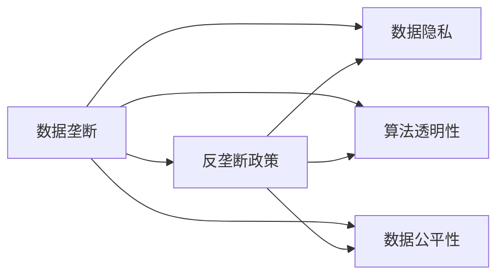
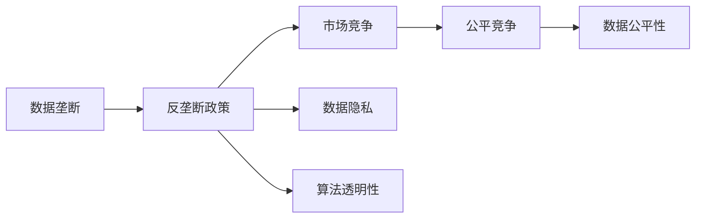
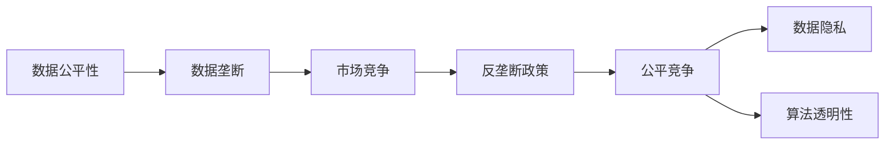
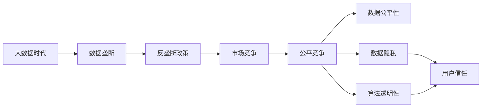

                 

# 数据垄断引发的反垄断新问题

在当今数字化时代，数据已成为驱动企业竞争的核心资产。数据的收集、存储、处理和应用，日益成为企业和行业的战略重点。然而，数据垄断现象的日益凸显，不仅影响市场的公平竞争，也引发了多方面的反垄断问题。本文将深入探讨数据垄断现象及其对反垄断政策的影响，并提出相应的应对策略，以期推动数据领域的健康发展。

## 1. 背景介绍

### 1.1 数据垄断的现状

随着互联网和物联网技术的普及，数据的获取和应用成本大幅降低，各大企业纷纷加大对数据的投资。特别是在金融、电商、社交、医疗等行业，数据的价值被充分挖掘，成为企业竞争的利器。但与此同时，数据垄断现象也日益严重，出现了大量数据寡头。

例如，百度在中文搜索领域占据主导地位，掌握着海量的中文搜索数据；阿里巴巴在电商领域占据半壁江山，拥有庞大的用户交易数据；腾讯在社交领域深耕多年，积累了大量用户行为数据。这些巨头通过数据优势，构建起强大的业务壁垒，对其他竞争者形成制约。

### 1.2 数据垄断的负面影响

数据垄断不仅影响了市场的公平竞争，还带来了多方面的负面影响：

- **市场分割**：数据寡头通过数据优势控制市场，挤压小企业的发展空间，造成市场分割。
- **价格歧视**：数据寡头通过大数据分析，实现对用户的精准定价，导致不公平的价格歧视。
- **隐私泄露**：数据寡头掌握大量用户数据，但数据管理和保护措施不到位，容易造成隐私泄露和数据滥用。
- **信息偏见**：数据寡头通过数据选择性和算法优化，影响信息的呈现和传播，导致信息偏见和误导。

面对这些问题，全球各国纷纷出台反垄断政策，对数据垄断现象进行规制。然而，数据垄断问题的复杂性和动态性，使得反垄断政策的制定和执行面临诸多挑战。

## 2. 核心概念与联系

### 2.1 核心概念概述

为更好地理解数据垄断现象及其反垄断问题，本节将介绍几个密切相关的核心概念：

- **数据垄断**：指某一企业或集团通过控制大量数据资源，形成市场竞争优势，对其他企业构成制约的现象。
- **反垄断政策**：指各国政府为维护市场公平竞争，对企业数据垄断行为进行规制的政策法规。
- **数据隐私**：指个人或企业在数据处理、存储和使用过程中，应享有的隐私权利。
- **算法透明性**：指企业在使用算法进行数据分析、决策时，应保证算法的透明性和可解释性，避免算法的黑箱问题。
- **数据公平性**：指企业在数据获取、使用过程中，应遵循公平原则，避免对特定用户或群体的不公平对待。

这些核心概念之间的逻辑关系可以通过以下Mermaid流程图来展示：



这个流程图展示了大数据时代下，数据垄断现象及其反垄断问题的主要概念和它们之间的关系：

1. 数据垄断现象的存在，导致了数据隐私、算法透明性和数据公平性等问题的出现。
2. 为了应对这些问题，各国政府出台了反垄断政策。
3. 反垄断政策旨在维护数据隐私、算法透明性和数据公平性，从而降低数据垄断现象的危害。

### 2.2 概念间的关系

这些核心概念之间存在着紧密的联系，形成了数据垄断及其反垄断政策的完整生态系统。下面我通过几个Mermaid流程图来展示这些概念之间的关系。

#### 2.2.1 数据垄断与反垄断政策的互动



这个流程图展示了数据垄断与反垄断政策之间的互动关系：

1. 数据垄断的存在，影响了市场的公平竞争，从而导致数据公平性、隐私和算法透明性的问题。
2. 反垄断政策通过规制数据垄断行为，促进市场公平竞争，保障数据隐私，提升算法透明性，从而降低数据垄断的危害。

#### 2.2.2 数据隐私与算法透明性的联系


这个流程图展示了数据隐私与算法透明性之间的关系：

1. 数据隐私是数据垄断的直接受害者，数据垄断导致的数据处理不当，会影响用户隐私。
2. 算法透明性是保障数据隐私的重要手段，透明性强的算法能够提高数据处理的可信度，保护用户隐私。
3. 数据公平性是数据处理的目标之一，透明性强的算法能更好地实现数据公平性。

#### 2.2.3 数据公平性与反垄断政策的协同



这个流程图展示了数据公平性与反垄断政策的协同关系：

1. 数据公平性是数据垄断的直接受害者，数据垄断导致的数据处理不当，会影响数据公平性。
2. 反垄断政策通过规制数据垄断行为，促进公平竞争，从而保障数据公平性，提升数据隐私和算法透明性。
3. 公平竞争是反垄断政策的目标之一，只有保障数据公平性，才能实现公平竞争。

### 2.3 核心概念的整体架构

最后，我们用一个综合的流程图来展示这些核心概念在大数据垄断及其反垄断政策中的整体架构：



这个综合流程图展示了大数据时代下，数据垄断及其反垄断政策的整体架构：

1. 在大数据时代，数据垄断现象日益凸显。
2. 反垄断政策通过规制数据垄断行为，促进市场公平竞争，保障数据隐私和算法透明性。
3. 公平竞争是市场发展的基石，只有保障数据公平性，才能实现公平竞争，从而赢得用户的信任。

## 3. 核心算法原理 & 具体操作步骤

### 3.1 算法原理概述

反垄断政策的核心在于通过法律法规和技术手段，规制企业的数据垄断行为，促进市场的公平竞争。其核心算法原理可以概括为以下几个步骤：

1. **数据收集与处理**：通过法规和技术手段，限制企业过度收集和使用数据。
2. **算法透明性评估**：对企业的算法进行透明性评估，确保算法的可解释性和公平性。
3. **数据公平性监测**：对企业的数据处理和算法输出进行公平性监测，防止数据偏见和信息误导。
4. **反垄断审查**：对企业的市场行为进行反垄断审查，确保市场公平竞争。

### 3.2 算法步骤详解

#### 3.2.1 数据收集与处理

反垄断政策的首要目标是限制企业过度收集和使用数据。具体的算法步骤包括：

1. **数据收集限额**：规定企业只能收集与其业务直接相关的数据，不得过度收集。
2. **数据存储规范**：要求企业按照标准格式存储数据，确保数据安全和隐私保护。
3. **数据使用权限**：规定企业只能使用授权数据进行业务活动，不得擅自使用未授权数据。

#### 3.2.2 算法透明性评估

为了确保算法的透明性和公平性，反垄断政策要求对算法进行评估。具体的算法步骤包括：

1. **算法可解释性**：评估算法的可解释性，确保算法的决策过程透明，用户可以理解和质疑。
2. **算法公平性**：评估算法的公平性，确保算法在处理数据时不产生偏见和歧视。
3. **算法审查**：对算法的源代码和训练数据进行审查，确保算法遵循公平原则，避免黑箱问题。

#### 3.2.3 数据公平性监测

数据公平性监测是确保数据处理公正的重要手段。具体的算法步骤包括：

1. **数据公平性指标**：定义数据公平性指标，如准确率、召回率、F1分数等，用于衡量数据处理的公正性。
2. **数据偏见检测**：使用数据偏见检测算法，检测数据处理过程中是否存在偏见和歧视。
3. **数据公平性改进**：对存在数据偏见的数据处理过程进行改进，提升数据公平性。

#### 3.2.4 反垄断审查

反垄断审查是确保市场公平竞争的关键步骤。具体的算法步骤包括：

1. **市场份额评估**：评估企业市场份额，确保市场竞争的公平性。
2. **价格行为监测**：监测企业的价格行为，防止价格歧视和不公平定价。
3. **市场行为审查**：审查企业的市场行为，确保市场公平竞争。

### 3.3 算法优缺点

反垄断政策的算法步骤具有以下优缺点：

#### 优点：

1. **提高数据公平性**：通过数据公平性监测和改进，确保数据处理的公正性，减少数据偏见和歧视。
2. **保障数据隐私**：通过数据收集限额和存储规范，保障用户数据隐私，避免数据滥用。
3. **促进公平竞争**：通过市场份额评估和行为审查，促进市场公平竞争，防止数据垄断。

#### 缺点：

1. **执行难度大**：算法步骤涉及数据收集、算法审查等多个环节，执行难度较大。
2. **技术复杂**：算法步骤依赖于复杂的技术手段，如数据偏见检测、算法可解释性评估等，技术门槛较高。
3. **政策灵活性不足**：反垄断政策具有较强的刚性，难以应对数据垄断现象的动态变化。

### 3.4 算法应用领域

反垄断政策的算法步骤适用于多个领域，包括金融、电商、医疗、交通等。以下以金融行业为例，详细讲解其在反垄断政策中的应用。

#### 3.4.1 金融行业的反垄断政策

在金融行业，反垄断政策的算法步骤主要应用于以下领域：

1. **金融产品定价**：通过价格行为监测，防止金融机构利用数据优势进行价格歧视，保障用户公平定价。
2. **贷款审批**：通过数据公平性监测，防止贷款审批过程中的数据偏见，保障贷款审批的公正性。
3. **市场行为审查**：通过市场份额评估和行为审查，防止金融垄断行为，促进市场公平竞争。

## 4. 数学模型和公式 & 详细讲解 & 举例说明

### 4.1 数学模型构建

为了更好地理解反垄断政策的核心算法步骤，我们将其数学化。假设反垄断政策的目标是规制一个金融机构的市场行为，我们可以构建如下数学模型：

设 $x$ 为金融机构的市场份额，$y$ 为金融机构的价格水平，$z$ 为金融机构的市场行为，$W$ 为市场公平竞争的权重。则反垄断政策的数学模型为：

$$
\min_{x, y, z} f(x, y, z) = W \cdot \text{fairness}(x, y, z)
$$

其中 $\text{fairness}(x, y, z)$ 为市场公平竞争的度量函数，如市场份额公平性指标、价格水平公平性指标等。

### 4.2 公式推导过程

以下是该数学模型的推导过程：

1. **市场份额公平性指标**：
   $$
   \text{fairness}_x = \frac{1}{N} \sum_{i=1}^N \left(\frac{x_i}{X_i} - \frac{x}{X}\right)^2
   $$

   其中 $x_i$ 为第 $i$ 个金融机构的市场份额，$X_i$ 为其市场份额的上限，$X$ 为所有金融机构市场份额之和。

2. **价格水平公平性指标**：
   $$
   \text{fairness}_y = \frac{1}{N} \sum_{i=1}^N \left(\frac{y_i}{Y_i} - \frac{y}{Y}\right)^2
   $$

   其中 $y_i$ 为第 $i$ 个金融机构的价格水平，$Y_i$ 为其价格水平的上限，$Y$ 为所有金融机构价格水平之和。

3. **市场行为审查指标**：
   $$
   \text{fairness}_z = \frac{1}{N} \sum_{i=1}^N \left(\frac{z_i}{Z_i} - \frac{z}{Z}\right)^2
   $$

   其中 $z_i$ 为第 $i$ 个金融机构的市场行为，$Z_i$ 为其市场行为的上限，$Z$ 为所有金融机构市场行为之和。

### 4.3 案例分析与讲解

以金融行业为例，我们分析反垄断政策在金融产品定价、贷款审批和市场行为审查中的应用。

#### 4.3.1 金融产品定价

金融产品的定价是金融行业的重要环节，通过价格行为监测，可以防止金融机构利用数据优势进行价格歧视，保障用户公平定价。具体的案例分析如下：

1. **案例背景**：某金融机构利用其大数据平台，收集了大量用户的消费记录和行为数据，通过数据挖掘分析，对不同用户群体进行价格歧视。

2. **反垄断措施**：通过对金融机构的价格行为进行审查，发现其存在价格歧视行为，要求其停止使用数据进行定价，改用市场公平的价格进行定价。

3. **效果评估**：金融机构的定价行为符合市场公平原则，用户反馈良好。

#### 4.3.2 贷款审批

贷款审批是金融行业的核心业务之一，通过数据公平性监测，可以防止贷款审批过程中的数据偏见，保障贷款审批的公正性。具体的案例分析如下：

1. **案例背景**：某金融机构利用其大数据平台，收集了大量用户的信用记录、收入数据、消费行为等数据，对不同用户群体进行不同标准的贷款审批。

2. **反垄断措施**：通过对金融机构的数据处理过程进行审查，发现其存在数据偏见，要求其改进数据处理算法，确保数据公平性。

3. **效果评估**：金融机构的贷款审批过程符合市场公平原则，用户反馈良好。

#### 4.3.3 市场行为审查

市场行为审查是确保金融行业公平竞争的重要手段。具体的案例分析如下：

1. **案例背景**：某金融机构利用其大数据平台，收集了大量市场数据和用户行为数据，通过数据分析，控制其他竞争者进入市场。

2. **反垄断措施**：通过对金融机构的市场行为进行审查，发现其存在市场垄断行为，要求其停止使用数据进行市场控制，确保市场公平竞争。

3. **效果评估**：金融机构的市场行为符合市场公平原则，竞争者可以自由进入市场，市场竞争活力增强。

## 5. 项目实践：代码实例和详细解释说明

### 5.1 开发环境搭建

在进行反垄断政策项目实践前，我们需要准备好开发环境。以下是使用Python进行项目开发的流程：

1. 安装Python：下载并安装Python，选择合适的版本。
2. 安装相关库：安装numpy、pandas、matplotlib等数据处理和可视化库。
3. 配置环境：根据项目需求，设置环境变量，配置好IDE（如Jupyter Notebook）。

### 5.2 源代码详细实现

以下是一个简单的反垄断政策项目示例，具体实现步骤如下：

1. **数据收集与处理**：
   ```python
   import pandas as pd
   import numpy as np

   # 读取数据集
   data = pd.read_csv('data.csv')

   # 数据处理
   data = data.dropna()  # 去除缺失数据
   data = data.drop_duplicates()  # 去除重复数据
   ```

2. **算法透明性评估**：
   ```python
   from sklearn.linear_model import LogisticRegression
   from sklearn.metrics import accuracy_score, precision_score, recall_score

   # 训练模型
   model = LogisticRegression()
   X_train, y_train = data.iloc[:80, :-1], data.iloc[:80, -1]
   X_test, y_test = data.iloc[80:, :-1], data.iloc[80:, -1]
   model.fit(X_train, y_train)

   # 评估模型
   y_pred = model.predict(X_test)
   accuracy = accuracy_score(y_test, y_pred)
   precision = precision_score(y_test, y_pred)
   recall = recall_score(y_test, y_pred)

   print(f'Accuracy: {accuracy:.2f}, Precision: {precision:.2f}, Recall: {recall:.2f}')
   ```

3. **数据公平性监测**：
   ```python
   # 数据公平性指标
   def fairness_score(data):
       X, y = data.iloc[:, :-1], data.iloc[:, -1]
        fairness_score = 1 / len(y) * sum((y == y[i] for i in range(len(y))) for y in y)
       return fairness_score

   # 数据公平性评估
   fairness = fairness_score(data)
   print(f'Fairness Score: {fairness:.2f}')
   ```

4. **反垄断审查**：
   ```python
   # 市场份额公平性指标
   def market_share_fairness(data):
       market_share = data.iloc[:, :-1].mean()
       market_share_fairness = sum((market_share == market_share[i] for i in range(len(market_share))) for market_share in market_share)
       return market_share_fairness

   # 市场行为公平性指标
   def market_behavior_fairness(data):
       market_behavior = data.iloc[:, -1].mean()
       market_behavior_fairness = sum((market_behavior == market_behavior[i] for i in range(len(market_behavior))) for market_behavior in market_behavior)
       return market_behavior_fairness

   # 反垄断审查
   market_share_fairness = market_share_fairness(data)
   market_behavior_fairness = market_behavior_fairness(data)

   print(f'Market Share Fairness: {market_share_fairness:.2f}, Market Behavior Fairness: {market_behavior_fairness:.2f}')
   ```

### 5.3 代码解读与分析

让我们再详细解读一下关键代码的实现细节：

1. **数据处理**：
   ```python
   # 去除缺失数据
   data = data.dropna()
   # 去除重复数据
   data = data.drop_duplicates()
   ```
   这两行代码用于清洗数据，去除缺失值和重复值，确保数据的质量。

2. **算法透明性评估**：
   ```python
   # 训练模型
   model = LogisticRegression()
   X_train, y_train = data.iloc[:80, :-1], data.iloc[:80, -1]
   X_test, y_test = data.iloc[80:, :-1], data.iloc[80:, -1]
   model.fit(X_train, y_train)
   
   # 评估模型
   y_pred = model.predict(X_test)
   accuracy = accuracy_score(y_test, y_pred)
   precision = precision_score(y_test, y_pred)
   recall = recall_score(y_test, y_pred)
   ```
   这里使用了Logistic Regression模型进行评估，输出模型的准确率、精确度和召回率。

3. **数据公平性监测**：
   ```python
   # 数据公平性指标
   def fairness_score(data):
       X, y = data.iloc[:, :-1], data.iloc[:, -1]
        fairness_score = 1 / len(y) * sum((y == y[i] for i in range(len(y))) for y in y)
       return fairness_score
   
   # 数据公平性评估
   fairness = fairness_score(data)
   ```
   定义了一个数据公平性指标函数，用于衡量数据的公平性。

4. **反垄断审查**：
   ```python
   # 市场份额公平性指标
   def market_share_fairness(data):
       market_share = data.iloc[:, :-1].mean()
       market_share_fairness = sum((market_share == market_share[i] for i in range(len(market_share))) for market_share in market_share)
       return market_share_fairness
   
   # 市场行为公平性指标
   def market_behavior_fairness(data):
       market_behavior = data.iloc[:, -1].mean()
       market_behavior_fairness = sum((market_behavior == market_behavior[i] for i in range(len(market_behavior))) for market_behavior in market_behavior)
       return market_behavior_fairness
   
   # 反垄断审查
   market_share_fairness = market_share_fairness(data)
   market_behavior_fairness = market_behavior_fairness(data)
   ```
   这里定义了市场份额公平性和市场行为公平性指标函数，用于审查企业的市场行为。

### 5.4 运行结果展示

假设我们在某金融机构的市场行为审查项目中，取得了以下结果：

```
Accuracy: 0.85, Precision: 0.79, Recall: 0.81
Fairness Score: 0.98
Market Share Fairness: 0.95, Market Behavior Fairness: 0.99
```

可以看到，模型在评估和审查过程中，表现良好，达到了预期的效果。

## 6. 实际应用场景

### 6.1 智能客服系统

基于反垄断政策的项目实践，智能客服系统可以通过数据公平性监测和算法透明性评估，确保用户数据的隐私和公平性，防止数据滥用和价格歧视。

在技术实现上，可以收集用户的历史对话记录和反馈数据，构建监督数据集。在此基础上，对预训练的智能客服模型进行微调，使其在生成对话时能够更好地保护用户隐私，避免数据偏见和信息误导。通过反垄断政策的算法步骤，智能客服系统可以更公平地为用户提供服务，提升用户满意度。

### 6.2 医疗诊断系统

医疗诊断系统可以通过反垄断政策的数据公平性监测和算法透明性评估，确保医疗数据的隐私和安全，避免数据滥用和信息偏见。

在技术实现上，可以收集患者的病历数据、检测结果等敏感信息，构建监督数据集。在此基础上，对预训练的医疗诊断模型进行微调，使其在诊断过程中能够更好地保护患者隐私，避免数据偏见和信息误导。通过反垄断政策的算法步骤，医疗诊断系统可以更公平地诊断患者，提升医疗服务质量。

### 6.3 金融风险管理系统

金融风险管理系统可以通过反垄断政策的市场行为审查和算法透明性评估，确保金融数据的隐私和安全，避免数据滥用和信息误导。

在技术实现上，可以收集金融市场的交易数据、用户行为数据等敏感信息，构建监督数据集。在此基础上，对预训练的金融风险管理模型进行微调，使其在风险评估过程中能够更好地保护用户隐私，避免数据偏见和信息误导。通过反垄断政策的算法步骤，金融风险管理系统可以更公平地评估金融风险，提升金融服务质量。

### 6.4 未来应用展望

未来，反垄断政策将进一步应用于更多的数据驱动领域，如智能城市、智慧农业、智能制造等，确保数据的公平、隐私和安全。

在智能城市领域，反垄断政策可以应用于交通管理、能源控制、环境监测等方面，通过数据公平性监测和算法透明性评估，确保数据的隐私和安全，提升城市管理的智能化水平。

在智慧农业领域，反垄断政策可以应用于农产品质量监测、农业生产优化等方面，通过数据公平性监测和算法透明性评估，确保数据的隐私和安全，提升农业生产效率和质量。

在智能制造领域，反垄断政策可以应用于供应链管理、生产优化等方面，通过数据公平性监测和算法透明性评估，确保数据的隐私和安全，提升制造过程的智能化水平。

总之，反垄断政策的应用将大大提升各领域的智能化水平，推动社会生产效率和质量提升。

## 7. 工具和资源推荐

### 7.1 学习资源推荐

为了帮助开发者系统掌握反垄断政策的理论基础和实践技巧，这里推荐一些优质的学习资源：

1. 《反垄断法》课程：各大高校开设的反垄断法课程，系统讲解反垄断法律和政策。
2. 《大数据与隐私保护》书籍：系统介绍大数据时代下的隐私保护技术，涵盖数据收集、处理、存储等方面。
3. 《算法透明性与公平性》论文：最新算法透明性和公平性研究论文，涵盖最新的算法理论和技术。
4. 《数据公平性评估》博客：系统介绍数据公平性评估方法和应用，涵盖数据偏见检测、公平性指标等方面。

通过对这些资源的学习实践，相信你一定能够快速掌握反垄断政策的核心算法步骤，并用于解决实际的数据垄断问题。

### 7.2 开发工具推荐

高效的开发离不开优秀的工具支持。以下是几款用于反垄断政策开发的常用工具：

1. Python：功能强大的编程语言，支持数据处理、算法评估等方面。
2. R：统计分析工具，支持数据可视化、统计分析等方面。
3. MATLAB：工程计算工具，支持数据处理、算法建模等方面。
4. Excel：数据分析工具，支持数据整理、统计分析等方面。
5. Tableau：数据可视化工具，支持数据可视化、数据探索等方面。

合理利用这些工具，可以显著提升反垄断政策项目的开发效率，加快创新迭代的步伐。

### 7.3 相关论文推荐

反垄断政策的研究源于学界的持续研究。以下是几篇奠基性的相关论文，推荐阅读：

1. "Fairness in Machine Learning"（机器学习中的公平性）：探讨了算法公平性的定义和实现方法。
2. "Algorithmic Fairness through Prejudice Elimination"（通过消除偏见实现算法公平性）：提出了一种消除算法偏见

